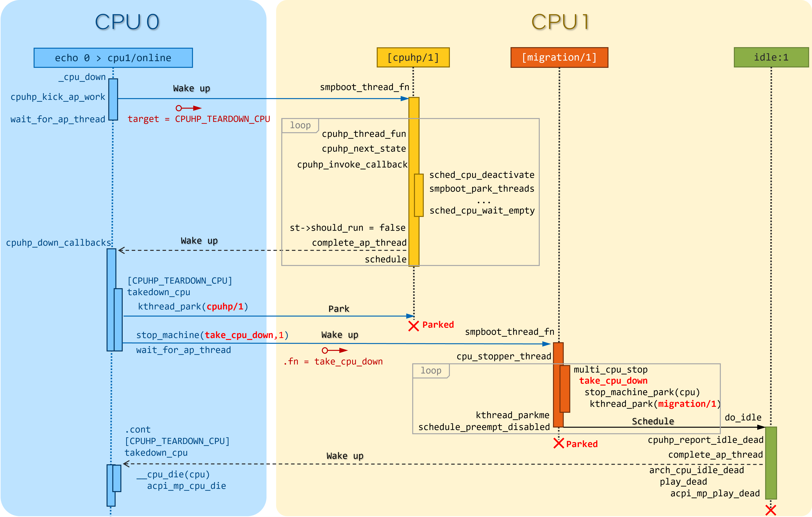

# CPU 热插拔

## 命令行开关
* `maxcpus=n` 限制启动时的 CPU 为 `n` 个。例如，如果你有四个CPU，使用 `maxcpus=2` 将只能启动两个。你可以选择稍后让其他 CPU 上线。
* `nr_cpus=n` 限制内核将支持的 CPU 总量。如果这里提供的数量低于实际可用的 CPU 数量，那么其他 CPU 以后就不能上线了。
* `possible_cpus=n` 这个选项设置 `cpu_possible_mask` 中的 `possible_cpus` 位。这个选项只限于 X86 和 S390 架构。
* `cpu0_hotplug` 允许关闭 CPU0。这个选项只限于 X86 架构。

## CPU 位图

* 不需要操作任何系统的 CPU 映射。在大多数情况下，它们应该是只读的。
* 当设置每个 CPU 资源时，几乎总是使用 `cpu_possible_mask` 或 `for_each_possible_cpu()` 来进行迭代。
* 宏 `for_each_cpu()` 可以用来迭代一个自定义的 CPU 掩码。
* 不要使用 `cpumask_t` 以外的任何东西来表示 CPU 的位图。

#### `cpu_possible_mask`
* 系统中可能可用 CPU 的位图。
* 这是用来为 per_cpu 变量分配一些启动时的内存，这些变量不会随着 CPU 的可用或移除而增加/减少。
* 一旦在启动时的发现阶段被设置，该映射就是静态的，也就是说，任何时候都不会增加或删除任何位。根据你的系统需求提前准确地调整它可以节省一些启动时的内存。

#### `cpu_online_mask`
* 当前在线的所有 CPU 的位图。
* 在一个 CPU 可用于内核调度并准备接收设备的中断后，它在 `__cpu_up()` 中被设置。
* 当使用 `__cpu_disable()` 关闭一个 CPU 时，它被清空，在此之前，所有的操作系统服务包括中断都被迁移到另一个目标 CPU。

#### `cpu_present_mask`
* 系统中当前存在的 CPU 的位图。它们并非全部在线。
* 当物理热插拔被相关的子系统 （如ACPI）处理时，可以改变和添加新的位或从位图中删除，这取决于事件是 `hot-add/hot-remove`。目前还没有定死规定。
* 典型的用法是在启动时启动拓扑结构，这时热插拔被禁用。

## 使用 CPU 热插拔
* 内核选项 `CONFIG_HOTPLUG_CPU` 需要被启用。它目前可用于多种架构，包括ARM、MIPS、 PowerPC和X86。配置是通过 `sysfs` 接口完成的：
```sh
$ ls -lh /sys/devices/system/cpu
total 0
drwxr-xr-x  9 root root    0 Dec 21 16:33 cpu0
drwxr-xr-x  9 root root    0 Dec 21 16:33 cpu1
drwxr-xr-x  9 root root    0 Dec 21 16:33 cpu2
drwxr-xr-x  9 root root    0 Dec 21 16:33 cpu3
drwxr-xr-x  9 root root    0 Dec 21 16:33 cpu4
drwxr-xr-x  9 root root    0 Dec 21 16:33 cpu5
drwxr-xr-x  9 root root    0 Dec 21 16:33 cpu6
drwxr-xr-x  9 root root    0 Dec 21 16:33 cpu7
drwxr-xr-x  2 root root    0 Dec 21 16:33 hotplug
-r--r--r--  1 root root 4.0K Dec 21 16:33 offline
-r--r--r--  1 root root 4.0K Dec 21 16:33 online
-r--r--r--  1 root root 4.0K Dec 21 16:33 possible
-r--r--r--  1 root root 4.0K Dec 21 16:33 present
```
* 文件 `offline`、`online`、`possible`、`present` 代表 CPU 掩码。
* 每个 CPU 文件夹包含一个 `online` 文件，控制逻辑上的开（`1`）和关（`0`）状态。
* 例如，要在逻辑上关闭 CPU4:
```sh
$ echo 0 > /sys/devices/system/cpu/cpu4/online
 smpboot: CPU 4 is now offline
```
* 一旦 CPU 被关闭，它将从 `/proc/interrupts`、`/proc/cpuinfo` 中被删除，也不应该被 `top` 命令显示出来。
* 例如，要让 CPU4 重新上线:
```sh
$ echo 1 > /sys/devices/system/cpu/cpu4/online
smpboot: Booting Node 0 Processor 4 APIC 0x1
```
* CPU4 又可以使用了。
* 这应该对所有的 CPU 都有效。CPU0 通常比较特殊，被排除在 CPU 热插拔之外。
* 在 X86 上，内核选项 `CONFIG_BOOTPARAM_HOTPLUG_CPU0` 必须被启用，以便能够关闭 CPU0。或者，可以使用内核命令选项 `cpu0_hotplug`。
* CPU0 的一些已知的依赖性:
  * 从休眠/暂停中恢复。如果 CPU0 处于离线状态，休眠/暂停将失败。
  * PIC 中断。如果检测到 PIC 中断，CPU0 就不能被移除。

## CPU 热拔插 API

### CPU 热插拔状态机
* CPU 热插拔使用一个从 `CPUHP_OFFLINE` 到 `CPUHP_ONLINE` 的线性状态空间的普通状态机。每个状态都有一个 `startup` 和 `teardown` 回调。
* 当一个 CPU 上线时，将按顺序调用 `startup` 回调，直到达到 `CPUHP_ONLINE` 状态。
  * 当设置状态的回调或将实例添加到多实例状态时，也可以调用它们。
* 当一个 CPU 下线时，将按相反的顺序依次调用 `teardown` 回调，直到达到 `CPUHP_OFFLINE` 状态。
  * 当删除状态的回调或从多实例状态中删除实例时，也可以调用它们。
* 如果某个使用场景只需要一个方向的热插拔操作回调（CPU 上线或 CPU 下线），则在设置状态时，可以将另一个不需要的回调设置为 `NULL`。
* 状态空间被划分成三个阶段：
#### PREPARE 阶段
* PREPARE 阶段涵盖了从 `CPUHP_OFFLINE` 到 `CPUHP_BRINGUP_CPU` 之间的状态空间。
* 在该阶段中，`startup` 回调在 CPU 上线操作启动 CPU 之前被调用，`teardown` 回调在 CPU 下线操作使 CPU 功能失效之后被调用。
* 这些回调是在 **控制 CPU 上调用的**，因为它们显然不能在热插拔的 CPU 上运行，此时热插拔的 CPU 要么还没有启动，要么已经功能失效。
* `startup` 回调用于设置 CPU 成功上线所需要的资源。`teardown` 回调用于释放资源或在热插拔的 CPU 功能失效后，将待处理的工作转移到在线的 CPU 上。
* 允许 `startup` 回调失败。如果回调失败，CPU 上线操作被中止，CPU 将再次被降到之前的状态（通常是 `CPUHP_OFFLINE`）。
* 本阶段中的 `teardown` 回调不允许失败。
#### STARTING 阶段
* STARTING 阶段涵盖了 `CPUHP_BRINGUP_CPU + 1` 到 `CPUHP_AP_ONLINE` 之间的状态空间。
* 该阶段中的 `startup` 回调是在早期 CPU 设置代码中的 CPU 上线操作期间，禁用中断的情况下在热插拔的 CPU 上被调用。
* `teardown` 回调是在 CPU 完全关闭前不久的 CPU 下线操作期间，禁用中断的情况下在热插拔的 CPU 上被调用。
* 该阶段中的回调不允许失败。
* 回调用于低级别的硬件初始化/关机和核心子系统。
#### ONLINE 阶段
* ONLINE 阶段涵盖了 `CPUHP_AP_ONLINE + 1` 到 `CPUHP_ONLINE` 之间的状态空间。
* 该阶段中的 `startup` 回调是在 CPU 上线时在热插拔的 CPU上调用的。
* `teardown` 回调是在 CPU 下线操作时在热插拔 CPU 上调用的。
* 回调是在每个 CPU 热插拔线程的上下文中调用的，该线程绑定在热插拔的CPU上。
* 回调是在启用中断和抢占的情况下调用的。
* 允许回调失败。如果回调失败，CPU 热插拔操作被中止，CPU 将恢复到之前的状态。
### 分配一个状态
* 有两种方式分配一个 CPU 热插拔状态:
#### 静态分配
* 当子系统或驱动程序有相对于其他 CPU 热插拔状态的排序要求时，必须使用静态分配。例如，
  * 在 CPU 上线操作期间，PERF 核心 `startup` 回调必须在 PERF 驱动 `startup` 回调之前被调用。
  * 在 CPU 下线操作中，驱动 `teardown` 回调必须在核心 `teardown` 回调之前调用。
* 静态分配的状态由 `cpuhp_state` 枚举中的常量描述，可以在 include/linux/cpuhotplug.h 中找到。
```cpp
enum cpuhp_state {
    CPUHP_INVALID = -1,

    /* PREPARE section invoked on a control CPU */
    CPUHP_OFFLINE = 0,
    CPUHP_CREATE_THREADS,
    CPUHP_PERF_PREPARE,
...
    CPUHP_BRINGUP_CPU,

    /*
     * STARTING section invoked on the hotplugged CPU in low level
     * bringup and teardown code.
     */
    CPUHP_AP_IDLE_DEAD,
    CPUHP_AP_OFFLINE,
...
    CPUHP_AP_ONLINE,
    CPUHP_TEARDOWN_CPU,

    /* Online section invoked on the hotplugged CPU from the hotplug thread */
    CPUHP_AP_ONLINE_IDLE,
...
    CPUHP_AP_ONLINE_DYN,
    CPUHP_AP_ONLINE_DYN_END     = CPUHP_AP_ONLINE_DYN + 30,
    /* Must be after CPUHP_AP_ONLINE_DYN for node_states[N_CPU] update */
    CPUHP_AP_MM_DEMOTION_ONLINE,
    CPUHP_AP_X86_HPET_ONLINE,
    CPUHP_AP_X86_KVM_CLK_ONLINE,
    CPUHP_AP_ACTIVE,
    CPUHP_ONLINE,
};
```
* 在适当的位置将状态插入枚举中，这样就满足了排序要求。状态常量必须被用于状态的设置和移除。
* 当状态回调不是在运行时设置的，并且是 kernel/cpu.c 中 CPU 热插拔状态数组初始化的一部分时，也需要静态分配。
```cpp
/* Boot processor state steps */
static struct cpuhp_step cpuhp_hp_states[] = {
    [CPUHP_OFFLINE] = {
        .name           = "offline",
        .startup.single     = NULL,
        .teardown.single    = NULL,
    },
...
    /* Entry state on starting. Interrupts enabled from here on. Transient
     * state for synchronsization */
    [CPUHP_AP_ONLINE] = {
        .name           = "ap:online",
    },
    /*
     * Handled on control processor until the plugged processor manages
     * this itself.
     */
    [CPUHP_TEARDOWN_CPU] = {
        .name           = "cpu:teardown",
        .startup.single     = NULL,
        .teardown.single    = takedown_cpu,
        .cant_stop      = true,
    },

    [CPUHP_AP_SCHED_WAIT_EMPTY] = {
        .name           = "sched:waitempty",
        .startup.single     = NULL,
        .teardown.single    = sched_cpu_wait_empty,
    },
...
    /*
     * The dynamically registered state space is here
     */

#ifdef CONFIG_SMP
    /* Last state is scheduler control setting the cpu active */
    [CPUHP_AP_ACTIVE] = {
        .name           = "sched:active",
        .startup.single     = sched_cpu_activate,
        .teardown.single    = sched_cpu_deactivate,
    },
#endif

    /* CPU is fully up and running. */
    [CPUHP_ONLINE] = {
        .name           = "online",
        .startup.single     = NULL,
        .teardown.single    = NULL,
    },
};
```
#### 动态分配
* 当对状态回调没有排序要求时，动态分配是首选方法。
* 状态编号由 `setup` 函数分配，并在成功后返回给调用者。
* 只有 PREPARE 和 ONLINE 阶段提供了一个动态分配范围。STARTING 阶段则没有，因为该部分的大多数回调都有明确的排序要求。

### CPU 热插拔状态的设置
* 常见的 mode 名称有：

Mode 名称 | 解释
---------|-------------------------
prepare  | 对应 PREPARE 阶段中的状态
dead     | 对应 PREPARE 阶段中不提供 `startup` 回调的状态
starting | 对应 STARTING 阶段中的状态
dying    | 对应 STARTING 阶段中不提供 `startup` 回调的状态
online   | 对应 ONLINE 阶段中的状态
offline  | 对应 ONLINE 阶段中不提供 `startup` 回调的状态

## 测试热拔插状态
* 验证自定义状态是否按预期工作的一个方法是关闭一个CPU，然后再把它上线。
* 也可以把 CPU 放到某些状态（例如 `CPUHP_AP_ONLINE`），然后再回到 `CPUHP_ONLINE`。这将模拟在 `CPUHP_AP_ONLINE` 之后的一个状态出现错误，从而导致回滚到在线状态。
* 所有注册的状态都被列举在 `/sys/devices/system/cpu/hotplug/states`
```sh
$ tail /sys/devices/system/cpu/hotplug/states
138: mm/vmscan:online
139: mm/vmstat:online
140: lib/percpu_cnt:online
141: acpi/cpu-drv:online
142: base/cacheinfo:online
143: virtio/net:online
144: x86/mce:online
145: printk:online
168: sched:active
169: online
```

## CPU Offline 时的任务迁移



* CPU offline 是个复杂的过程，流程一共需要四个线程和周期性调度器参与，其中四个线程分别为：
1. 启动 CPU 热插拔命令的线程，以下将其称为 *发起线程*
2. 用于执行热插拔状态机的 per-CPU 线程 `cpuhp/%u`，以下将其称为 *热插拔线程*
3. 最高优先级的 per-CPU stop 类型的线程 `migration/%u`，以下将其称为 *stop machine*
4. Per-CPU 的 *idle 线程*
* 由于 CPU 下线流程各部分相互之间具有依赖关系，因此需要对它们的执行流程进行同步操作。
1. 发起线程运行 CPU offline 命令，并在内核中唤醒 per-CPU 热插拔线程，执行实际的状态机处理流程，然后等待热插拔线程执行完成后再唤醒自己
2. 热插拔线程将 CPU 设置为 `inactive` 状态，使负载均衡模块不再向该 CPU 均衡负载。并且使能 balance push 机制，使得该 CPU 上的进程在 scheduler 流程中执行 `balance_push` 操作，将自身迁移到其它 CPU 上
   * 由于 balance push 操作由 tick 中断触发的周期性调度器执行，因此在进程迁移过程中，该线程可继续执行其后的状态机回调函数。
   * 但 `CPUHP_TEARDOWN_CPU` 状态对应的回调函数 `takedown_cpu()` 需要执行 CPU 中断迁移，tick 时钟关闭等工作，故必须要等进程迁移完成后才能执行这部分操作。
     * 因为周期性调度器依赖于 tick 时钟和中断驱动，因此热插拔线程需要在该状态执行之前等待进程迁移完成。
3. 当进程迁移完成后，scheduler 将唤醒热插拔线程，使其继续执行。
   * 由于接下来需要执行 `takedown_cpu()` 函数，且该函数最终会触发 CPU 的下电操作。
   * 而热插拔线程是 per-CPU 的，此时 CPU 本身都要撂挑子了，显然与该 CPU 绑定的线程也应该要完成其使命。
     * 因此该线程会唤醒 CPU offline 发起进程完成状态机后面的回调，然后其自身将退出执行并被设置为 `park` 状态
4. 发起进程被唤醒后，如果之前是运行在将要被下线的 CPU，现在将会运行在其它的 CPU 上（进程唤醒后会执行选核操作，而待关闭的 CPU 已经为 `inactive` 状态，因此不会被选中），并开始执行 `takedown_cpu` 流程
   * 由于进程已完成迁移，故它给 offline CPU 安排一个 stop machine 的 `take_cpu_down()` 流程，完成第二阶段的 offline：
     * 将该 CPU 从 CPU 拓扑结构和 NUMA 节点中移除，
     * 将其自身状态设置为 `offline`，
     * 且将其中断迁移到其它 CPU 上。
   * 当完成以上流程之后，`take_cpu_down()` 将其 stop machine 线程自身设置为 `park` 状态，此时该 CPU 上将只剩下 idle 进程，因此 idle 进程开始执行。
5. 当 idle 进程检测到 CPU 已经为 `offline` 状态，就开始执行 CPU 假死流程。
   * 它首先关闭 idle 进程自身的 nohz tick 时钟，
   * 然后通过发起一个异步的  IPI `CALL_FUNCTION_SINGLE_VECTOR` 去唤醒阻塞在 `takedown_cpu()` 处的发起进程
     ```cpp
     cpuhp_report_idle_dead()
     -> cpuhp_report_idle_dead()
        -> cpuhp_complete_idle_dead()
           -> smp_call_function_single(cpuhp_complete_idle_dead)
     ···-> complete_ap_thread(st, false)
     ```
   * 随后调用 `arch_cpu_idle_dead()` 进入假死状态。
6. CPU offline 发起进程被唤醒后，继续执行 CPU 下电后的一些遗留工作，比如 `__cpu_die(cpu)`，并最终完成整个 CPU offline 流程。

### 触发 CPU Offline
* 了解一下 `DEVICE_ATTR_RW()` 宏，通过 `static DEVICE_ATTR_RW(online)` 定义了 `/sys/devices/system/cpu/cpu*/online` 文件操作回调函数
  * `online_store()` 是它的 *写* 回调函数
  * 往该文件写 `0` 会让指定 CPU 的 `cpuhp_state` 目标为 `CPUHP_OFFLINE`
* 首先，因为当前 `st->state` 是 `CPUHP_OFFLINE`，条件 `if (st->state > CPUHP_TEARDOWN_CPU)` 是满足的，表明如果当前 CPU 状态在 AP 热插拔线程的范围内，那么我们需要踢一下（唤醒）该线程。
  * 不要着急一步到位至目标 `CPUHP_OFFLINE`，先将目标设为 `CPUHP_TEARDOWN_CPU`
  * 调用 `cpuhp_kick_ap_work()` 触发 offline CPU 的调度
  * 恢复目标状态 `st->target` 为 `CPUHP_OFFLINE`，继续往前
* 如果以上操作成功，AP 自身已降至 `CPUHP_TEARDOWN_CPU` 状态了。发起 CPU 上需要进行进一步清理，调用 `cpuhp_down_callbacks()`。
```cpp
//kernel/cpu.c
_cpu_down(target=target@entry=CPUHP_OFFLINE)
   if (st->state > CPUHP_TEARDOWN_CPU)
      st->target = max((int)target, CPUHP_TEARDOWN_CPU); //不要着急一步到位至目标 CPUHP_OFFLINE，先将目标设为 CPUHP_TEARDOWN_CPU
   -> cpuhp_kick_ap_work()
         struct cpuhp_cpu_state *st = per_cpu_ptr(&cpuhp_state, cpu) //在发起 CPU 上得到要 offline 的 CPU 的 cpuhp_state
      -> cpuhp_kick_ap(cpu, st, st->target)
         -> __cpuhp_kick_ap(st)
            -> wake_up_process(st->thread) //唤醒 offline 的 CPU 的 cpuhp_state 任务
            -> wait_for_ap_thread(st, st->bringup) //发起 CPU 等待 offline CPU 执行完 cpuhp_state 的任务
   -> st->target = target;
   -> cpuhp_down_callbacks(cpu, st, target) //发起 CPU 继续其他 offline 操作
```

### CPU 热插拔内核线程 `cpuhp/%u`
* 上面 `wake_up_process(st->thread)` 唤醒 offline 的 CPU 的 `cpuhp_state` 任务是是什么任务呢？我们来看看
```cpp
smp_init()
   //kernel/cpu.c
-> cpuhp_threads_init()
   -> cpuhp_init_state() //初始化 per-CPU 的 cpuhp_state 变量
   -> smpboot_register_percpu_thread(&cpuhp_threads) //注册 per-CPU 的 "cpuhp/%u" 内核线程
   -> kthread_unpark(this_cpu_read(cpuhp_state.thread))
```
* 这就是 Per-CPU 的 `cpuhp/%u` AP 热插拔线程，其描述结构定义如下：
  * kernel/cpu.c
```cpp
static struct smp_hotplug_thread cpuhp_threads = {
    .store          = &cpuhp_state.thread,
    .thread_should_run  = cpuhp_should_run,
    .thread_fn      = cpuhp_thread_fun,
    .thread_comm        = "cpuhp/%u",
    .selfparking        = true,
};
```
* 经过 `smpboot_register_percpu_thread(&cpuhp_threads)` 注册后，per-CPU 的 `cpuhp/%u` 内核线程就会等待被调度
* 当被调度时，`cpuhp_thread_fun()` 函数会通过 per-CPU 内核线程的公用入口函数 `smpboot_thread_fn()` 运行起来
  * 如果该函数无事可做就在 `smpboot_thread_fn()` 处睡眠
* 在这个场景，它是被 `_cpu_down() -> cpuhp_kick_ap_work()` 唤醒的
```cpp
ret_from_fork_asm -> ret_from_fork()
-> kthread()
   -> threadfn(data)
   => smpboot_thread_fn()
      while (1) {
      -> __set_current_state(TASK_RUNNING);
      -> preempt_enable()
      -> ht->thread_fn(td->cpu) //到此是 CPU 热插拔内核线程的公用路径
      => cpuhp_thread_fun() //这个函数需要展开说，它和 smpboot_thread_fn() 配合起来迁移状态机
            st->should_run = cpuhp_next_state(bringup, &state, st, st->target); //循环是否继续看这个值
         -> cpuhp_invoke_callback()
               cb = bringup ? step->startup.single : step->teardown.single;
            -> cb(cpu)
         -> complete_ap_thread(st, bringup) //任务完成后通知发起 CPU 结束等待
      if (!ht->thread_should_run(td->cpu))  //如果循环不能继续
          => cpuhp_should_run(cpu)          //AP 热插拔线程重载了这个回调函数
                return st->should_run;      //cpuhp_thread_fun() 设置的值很关键
      -> schedule() //调度出去，cpuhp/%u 内核线程完成此次任务
      }
```
* CPU 热插拔的 `CPUHP_TEARDOWN_CPU` 之前的状态迁移由 CPU 热插拔内核线程 `cpuhp/%u` 来完成
* 它通过 per-CPU 内核线程的公用入口函数 `smpboot_thread_fn()` 的循环和核心函数 `cpuhp_thread_fun()` 控制着状态的迁移和状态回调函数的调用

#### 几个辅助函数
1. `cpuhp_get_step()` 根据状态得到 CPU 热插拔状态机数组 `struct cpuhp_step cpuhp_hp_states[]` 的元素
```cpp
static struct cpuhp_step *cpuhp_get_step(enum cpuhp_state state)
{
    return cpuhp_hp_states + state;
}
```
2. `cpuhp_step_empty()` 根据是 `bringup` 以及对应状态的 `startup` 或 `teardown` 回调是否为空返回该步骤是否有动作需要做
```cpp
static bool cpuhp_step_empty(bool bringup, struct cpuhp_step *step)
{
    return bringup ? !step->startup.single : !step->teardown.single;
}
```
3. `cpuhp_next_state()` 获取下一个要运行的状态。
   * 空步骤将会被跳过。
   * 如果该步骤必须被运行返回 `true`；否则返回 `false`
   * `st->state` 会被提前修改以匹配 `state_to_run`，就好像它已经运行过了一样。
```cpp
/*
 * Get the next state to run. Empty ones will be skipped. Returns true if a
 * state must be run.
 *
 * st->state will be modified ahead of time, to match state_to_run, as if it
 * has already ran.
 */
static bool cpuhp_next_state(bool bringup,
                 enum cpuhp_state *state_to_run,
                 struct cpuhp_cpu_state *st,
                 enum cpuhp_state target)
{
    do {
        if (bringup) { //如果是 bringup，状态向前（下）迁移
            if (st->state >= target) //到达目标状态了，返回 false 让调用者停止它的循环
                return false;

            *state_to_run = ++st->state;
        } else { //否则，状态向后（上）迁移
            if (st->state <= target) //到达目标状态了，返回 false 让调用者停止它的循环
                return false;

            *state_to_run = st->state--;
        }
        //空步骤将会被跳过
        if (!cpuhp_step_empty(bringup, cpuhp_get_step(*state_to_run)))
            break;
    } while (true);
    //如果该步骤必须被运行，返回 true 让调用者继续循环
    return true;
}
```
* `cpuhp_next_state()` 的调用者通常是一个循环，它负责迁移状态机至目标状态，调用者根据它的返回值确定是继续迁移还是停止迁移
```cpp
1 kernel/cpu.c|963| <<__cpuhp_invoke_callback_range>> while (cpuhp_next_state(bringup, &state, st, target)) {
2 kernel/cpu.c|1086| <<cpuhp_thread_fun>> st->should_run = cpuhp_next_state(bringup, &state, st, st->target);
```
* `cpuhp_thread_fun()` 这个调用者的循环比较隐蔽，它借助的是内核线程公用函数 `smpboot_thread_fn()` 来进行循环
4. 循环的结束也是由 CPU 热插拔线程管理的，它重载了 SMP 线程控制结构 `struct smp_hotplug_thread` 的 `.thread_should_run` 回调函数为 `cpuhp_should_run()`
```cpp
/*
 * The cpu hotplug threads manage the bringup and teardown of the cpus
 */
static int cpuhp_should_run(unsigned int cpu)
{
    struct cpuhp_cpu_state *st = this_cpu_ptr(&cpuhp_state);

    return st->should_run;
}
```
* 这里可以看到，per-CPU 的 `cpuhp_state->should_run` 域其实控制了循环的结束，它返回 `false` 会导致 `smpboot_thread_fn()` 处 `if (!ht->thread_should_run(td->cpu))` 条件返回 `true` 进而调用 `schedule()` 去睡眠

#### 核心函数 `cpuhp_thread_fun()`
* 接下来看看核心函数 `cpuhp_thread_fun()`，用于在插入的 CPU 上执行 `teardown`/`startup` 回调。还用于在运行时状态被 `[un]installed` 时调用回调。
* smpboot 线程（即 `cpuhp/%u` 所属的 `smpboot_thread_fn()`）每次调用此函数都会执行一次 AP 状态回调。
* 它有 3 种操作模式：
1. **single**：运行 `st->cb_state`
2. **up**：运行 `++st->state`，当 `st->state < st->target`
3. **down**：运行 `st->state--`，当 `st->state > st->target`
* 完成或出现错误时，`should_run` 将被清除并触发完成量 `struct completion *done = bringup ? &st->done_up : &st->done_down`。
```cpp
/*
 * Execute teardown/startup callbacks on the plugged cpu. Also used to invoke
 * callbacks when a state gets [un]installed at runtime.
 *
 * Each invocation of this function by the smpboot thread does a single AP
 * state callback.
 *
 * It has 3 modes of operation:
 *  - single: runs st->cb_state
 *  - up:     runs ++st->state, while st->state < st->target
 *  - down:   runs st->state--, while st->state > st->target
 *
 * When complete or on error, should_run is cleared and the completion is fired.
 */
static void cpuhp_thread_fun(unsigned int cpu)
{
    struct cpuhp_cpu_state *st = this_cpu_ptr(&cpuhp_state);
    bool bringup = st->bringup;
    enum cpuhp_state state;
    //不应该以“不应该运行”的标志唤醒该线程
    if (WARN_ON_ONCE(!st->should_run))
        return;

    /*
     * ACQUIRE for the cpuhp_should_run() load of ->should_run. Ensures
     * that if we see ->should_run we also see the rest of the state.
     */
    smp_mb();

    /*
     * The BP holds the hotplug lock, but we're now running on the AP,
     * ensure that anybody asserting the lock is held, will actually find
     * it so.
     */
    lockdep_acquire_cpus_lock();
    cpuhp_lock_acquire(bringup);
    //mode 1，在运行时状态被 [un]installed
    if (st->single) {
        state = st->cb_state;
        st->should_run = false;
    } else { //mode 2、3，在插入的 CPU 上执行 teardown/startup 回调
        st->should_run = cpuhp_next_state(bringup, &state, st, st->target); //递进状态，并决定是否需要终止循环
        if (!st->should_run)
            goto end;
    }
    //本线程仅负责处理 CPUHP_BRINGUP_CPU 之前的状态
    WARN_ON_ONCE(!cpuhp_is_ap_state(state));
    //前面的 STARTING/DYING 状态需要在禁用 IRQ 的情况下运行，并且不得失败。
    if (cpuhp_is_atomic_state(state)) {
        local_irq_disable();
        st->result = cpuhp_invoke_callback(cpu, state, bringup, st->node, &st->last);
        local_irq_enable();

        /*
         * STARTING/DYING must not fail!
         */
        WARN_ON_ONCE(st->result);
    } else {
        st->result = cpuhp_invoke_callback(cpu, state, bringup, st->node, &st->last);
    }
    //如果出错发生了回滚，然而回滚也失败了，也不要再继续运行了，内核文档有解释过这个场景
    if (st->result) {
        /*
         * If we fail on a rollback, we're up a creek without no
         * paddle, no way forward, no way back. We loose, thanks for
         * playing.
         */
        WARN_ON_ONCE(st->rollback);
        st->should_run = false;
    }

end:
    cpuhp_lock_release(bringup);
    lockdep_release_cpus_lock();
    //结束循环，设置完成量，让 CPU offline 的发起 CPU 继续运行
    if (!st->should_run)
        complete_ap_thread(st, bringup);
}
```
#### 迁移被 offlined CPU 上的任务
* 请注意 `struct cpuhp_step cpuhp_hp_states[]` 状态数组的 `CPUHP_AP_ACTIVE` 和 `CPUHP_AP_SCHED_WAIT_EMPTY` 状态
  * `CPUHP_AP_ACTIVE` 的 `.teardown.single = sched_cpu_deactivate` 就负责将任务推到其他 CPU 上
  * `CPUHP_AP_SCHED_WAIT_EMPTY` 状态等待调度完成的事件
* 这两个函数会在 CPU 热插拔状态迁移的过程中分别被 `cpuhp_thread_fun()`，完成被 offlined CPU 上的任务迁移
```cpp
    [CPUHP_AP_SCHED_WAIT_EMPTY] = {
        .name           = "sched:waitempty",
        .startup.single     = NULL,
        .teardown.single    = sched_cpu_wait_empty,
    },
...
#ifdef CONFIG_SMP
    /* Last state is scheduler control setting the cpu active */
    [CPUHP_AP_ACTIVE] = {
        .name           = "sched:active",
        .startup.single     = sched_cpu_activate,
        .teardown.single    = sched_cpu_deactivate,
    },
#endif
```
* 路径如下：
```cpp
(gdb) bt
#0  sched_cpu_deactivate (cpu=3) at kernel/sched/core.c:9560
#1  0xffffffff81140b39 in cpuhp_invoke_callback (cpu=cpu@entry=3, state=CPUHP_AP_ACTIVE, bringup=bringup@entry=false,
    node=0x0 <fixed_percpu_data>, lastp=0xff1100017bb9b988) at kernel/cpu.c:192
#2  0xffffffff81141b6f in cpuhp_thread_fun (cpu=3) at kernel/cpu.c:825
#3  0xffffffff81175aa3 in smpboot_thread_fn (data=0xff11000100073210) at kernel/smpboot.c:164
#4  0xffffffff8116b066 in kthread (_create=0xff110001005aab80) at kernel/kthread.c:376
#5  0xffffffff81006ff9 in ret_from_fork () at arch/x86/entry/entry_64.S:311
#6  0x0000000000000000 in ?? ()
```

#### 核心函数 `__cpuhp_invoke_callback_range()`
* `__cpuhp_invoke_callback_range()` 则是在发起 offline CPU 上通过 `cpuhp_down_callbacks()` 调用的核心函数
  * 它会让 `cpuhp_state` 状态机发生变化，并且调用对应状态的回调函数
```cpp
static int __cpuhp_invoke_callback_range(bool bringup,
                     unsigned int cpu,
                     struct cpuhp_cpu_state *st,
                     enum cpuhp_state target,
                     bool nofail)
{
    enum cpuhp_state state;
    int ret = 0;

    while (cpuhp_next_state(bringup, &state, st, target)) {
        int err;
        //调用对应状态的回调函数
        err = cpuhp_invoke_callback(cpu, state, bringup, NULL, NULL);
        if (!err)
            continue; //如果没出错，迁移到下一个状态
        //如果出错了，调用者要求不管失败，则只是打印在某个状态遇到了错误的信息
        if (nofail) {
            pr_warn("CPU %u %s state %s (%d) failed (%d)\n",
                cpu, bringup ? "UP" : "DOWN",
                cpuhp_get_step(st->state)->name,
                st->state, err);
            ret = -1;
        } else { //调用者关心失败，则停止状态迁移，返回出错码
            ret = err;
            break;
        }
    }

    return ret;
}
```

### 运行在发起 CPU Offline 进程上的 `takedown_cpu()`
* 当发起 CPU Offline 的进程进入到 `CPUHP_TEARDOWN_CPU` 的时候就会调用其回调函数 `takedown_cpu()`
* kernel/cpu.c
```cpp
static int takedown_cpu(unsigned int cpu)
{
    struct cpuhp_cpu_state *st = per_cpu_ptr(&cpuhp_state, cpu);
    int err;
    //停放 "cpuhp/%u"
    /* Park the smpboot threads */
    kthread_park(st->thread);

    /*
     * Prevent irq alloc/free while the dying cpu reorganizes the
     * interrupt affinities.
     */
    irq_lock_sparse();
    //给 offline CPU 安排一个 stop machine 的 take_cpu_down() 流程，完成第二阶段的 offline
    /*
     * So now all preempt/rcu users must observe !cpu_active().
     */
    err = stop_machine_cpuslocked(take_cpu_down, NULL, cpumask_of(cpu));
    if (err) {
        /* CPU refused to die */
        irq_unlock_sparse();
        /* Unpark the hotplug thread so we can rollback there */
        kthread_unpark(st->thread);
        return err;
    }
    BUG_ON(cpu_online(cpu));
    //等待 stop machine 的 take_cpu_down() 流程走完
    /*
     * The teardown callback for CPUHP_AP_SCHED_STARTING will have removed
     * all runnable tasks from the CPU, there's only the idle task left now
     * that the migration thread is done doing the stop_machine thing.
     *
     * Wait for the stop thread to go away.
     */
    wait_for_ap_thread(st, false);
    BUG_ON(st->state != CPUHP_AP_IDLE_DEAD);

    /* Interrupts are moved away from the dying cpu, reenable alloc/free */
    irq_unlock_sparse();

    hotplug_cpu__broadcast_tick_pull(cpu);
    /* This actually kills the CPU. */
    __cpu_die(cpu);

    cpuhp_bp_sync_dead(cpu);

    tick_cleanup_dead_cpu(cpu);
    rcutree_migrate_callbacks(cpu);
    return 0;
}
```

### 运行在 Stop Machine 进程中的 `take_cpu_down()`
* 这个 stop machine 的 work 是发起 CPU Offline 的进程安排进来的，完成第二阶段的 offline
* kernel/cpu.c
```cpp
static int take_cpu_down(void *_param)
{
    struct cpuhp_cpu_state *st = this_cpu_ptr(&cpuhp_state);
    enum cpuhp_state target = max((int)st->target, CPUHP_AP_OFFLINE);
    int err, cpu = smp_processor_id();

    /* Ensure this CPU doesn't handle any more interrupts. */
    err = __cpu_disable();
    if (err < 0)
        return err;

    /*
     * Must be called from CPUHP_TEARDOWN_CPU, which means, as we are going
     * down, that the current state is CPUHP_TEARDOWN_CPU - 1.
     */
    WARN_ON(st->state != (CPUHP_TEARDOWN_CPU - 1));

    /*
     * Invoke the former CPU_DYING callbacks. DYING must not fail!
     */
    cpuhp_invoke_callback_range_nofail(false, cpu, st, target);

    /* Give up timekeeping duties */
    tick_handover_do_timer();
    /* Remove CPU from timer broadcasting */
    tick_offline_cpu(cpu);
    /* Park the stopper thread */
    stop_machine_park(cpu);
    return 0;
}
```

## References
- [内核中的CPU热拔插 — The Linux Kernel documentation](https://docs.kernel.org/translations/zh_CN/core-api/cpu_hotplug.html)
- [linux cpu管理（四） cpu热插拔 - 知乎](https://zhuanlan.zhihu.com/p/538782115)
- [Linux 内核 _ CPU 热插拔（Hotplug）](https://www.dingmos.com/index.php/archives/117/)
- [Linux Kernel cpu拓扑简介](https://daybreakgx.github.io/2016/10/08/kernel_cpumask/)