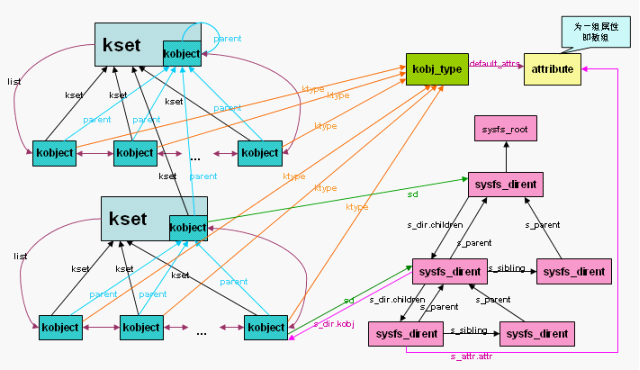
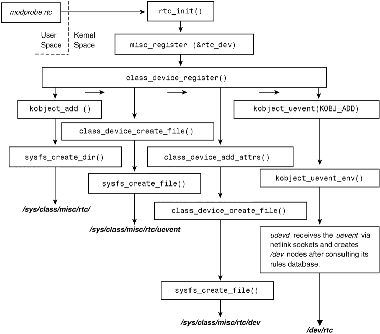

# 设备模型

* 设备模型（device model）提供了一个独立的机制专门来表示设备，并描述其在系统中的拓扑结构。
* 具有以下优点：
  * 代码重复最小化
  * 提供诸如引用计数这样的统一机制。
  * 列举系统中所有的设备，观察它们的状态，查看它们连接的总线。
  * 将系统中的全部设备以树的形式完整、有效地展现出来——包括所有的总线和内部连接。
  * 可以将设备和其对应的驱动联系起来，反之亦然。
  * 可以将设备按照类型加以归类，而无需理解物理设备的拓扑结构。
  * 可以沿设备树的叶子向其根的方向依次遍历，以保证能以正确顺序关闭各设备的电源。

## kobject
* 设备模型的核心部分 **kobject（kernel object）**
* include/linux/kobject.h
```c
struct kobject {
        const char              *name;   /*此kobject的名称*/
        struct list_head        entry;   
        struct kobject          *parent; /*指向父对象*/
        struct kset             *kset;
        struct kobj_type        *ktype;
        struct kernfs_node      *sd; /* sysfs directory entry */
        struct kref             kref;    /*提供引用计数*/
#ifdef CONFIG_DEBUG_KOBJECT_RELEASE
        struct delayed_work     release;
#endif
        unsigned int state_initialized:1;
        unsigned int state_in_sysfs:1;
        unsigned int state_add_uevent_sent:1;
        unsigned int state_remove_uevent_sent:1;
        unsigned int uevent_suppress:1;
};
```
* `sd`指针指向`struct kernfs_node`类型的对象在sysfs中表示的就是这个kobject。
* `kobject`通常是嵌入其他结构中，其单独意义其实不大。
* include/linux/cdev.h
```c
struct cdev {
        struct kobject kobj;
        struct module *owner;
        const struct file_operations *ops;
        struct list_head list;
        dev_t dev;
        unsigned int count;
};
```
* 当`struct kobject`被嵌入到其他结构中，该结构就拥有了kobject提供的标准功能。
* 嵌入`struct kobject`嵌入的结构体可以成为对象层次结构中的一部分。

## kobj_type
* **ktype** 描述一族kobject所具有的普遍特性。
  * 不需要为每个kobject分别定义自己的特性，将普遍的特性在`struct kobj_type`结构对象中定义一次，所有同类的kobject共享这一特性。
* include/linux/kobject.h
```c
struct kobj_type {
        void (*release)(struct kobject *kobj);
        const struct sysfs_ops *sysfs_ops;
        struct attribute **default_attrs;
        const struct kobj_ns_type_operations *(*child_ns_type)(struct kobject *kobj);
        const void *(*namespace)(struct kobject *kobj);
};
```
* `release`指向kobject引用计数减至 **0** 时要被调用的析构函数。负责释放kobject使用的内存和相关清理工作。
* `sysfs_ops`指向的`struct sysfs_ops`结构体描述了sysfs文件读写时的特性。
* `default_attrs`指向一个`struct attribute`数组，定义了该kobject相关的默认属性。
  * 属性描述了给定对象的特征，如果该kobject导出到sysfs中，这些属性都将相应地作为文件而导出。
  * 数组最后一项必须为NULL。

## kset
* **kset** 是kobject对象的集合体。可将所有相关的kobject对象置于同一位置。
* kset与ktype的重要区别：**具有相同ktype的kobject可以被分组到不同的kset**。
* include/linux/kobject.h
```c
/**
 * struct kset - a set of kobjects of a specific type, belonging to a specific subsystem.
 *
 * A kset defines a group of kobjects.  They can be individually
 * different "types" but overall these kobjects all want to be grouped
 * together and operated on in the same manner.  ksets are used to
 * define the attribute callbacks and other common events that happen to
 * a kobject.
 *
 * @list: the list of all kobjects for this kset
 * @list_lock: a lock for iterating over the kobjects
 * @kobj: the embedded kobject for this kset (recursion, isn't it fun...)
 * @uevent_ops: the set of uevent operations for this kset.  These are
 * called whenever a kobject has something happen to it so that the kset
 * can add new environment variables, or filter out the uevents if so
 * desired.
 */
struct kset {
        struct list_head list;
        spinlock_t list_lock;
        struct kobject kobj;
        const struct kset_uevent_ops *uevent_ops;
};
```
* `uevent_ops`指向的`struct kset_uevent_ops`结构体用于处理集合中kobject对象的热插拔操作。
* uevnet是 *user event* 的缩写，提供了与用户空间热插拔信息进行通信的机制。



## 创建kobject
* kobject对象可用`kobject_init()`初始化，或者由`kobject_create()`完成空间分配和初始化。
* include/linux/kref.h
```c
/**
 * kref_init - initialize object.
 * @kref: object in question.
 */
static inline void kref_init(struct kref *kref)
{
        atomic_set(&kref->refcount, 1);
}
```

* lib/kobject.c
```c
static void kobject_init_internal(struct kobject *kobj)
{
        if (!kobj)
                return;
        kref_init(&kobj->kref);
        INIT_LIST_HEAD(&kobj->entry);
        kobj->state_in_sysfs = 0;
        kobj->state_add_uevent_sent = 0;
        kobj->state_remove_uevent_sent = 0;
        kobj->state_initialized = 1;
}
...

/**
 * kobject_init - initialize a kobject structure
 * @kobj: pointer to the kobject to initialize
 * @ktype: pointer to the ktype for this kobject.
 *
 * This function will properly initialize a kobject such that it can then
 * be passed to the kobject_add() call.
 *
 * After this function is called, the kobject MUST be cleaned up by a call
 * to kobject_put(), not by a call to kfree directly to ensure that all of
 * the memory is cleaned up properly.
 */
void kobject_init(struct kobject *kobj, struct kobj_type *ktype)
{
        char *err_str;

        if (!kobj) {
                err_str = "invalid kobject pointer!";
                goto error;
        }
        if (!ktype) {
                err_str = "must have a ktype to be initialized properly!\n";
                goto error;
        }
        if (kobj->state_initialized) {
                /* do not error out as sometimes we can recover */
                printk(KERN_ERR "kobject (%p): tried to init an initialized "
                       "object, something is seriously wrong.\n", kobj);
                dump_stack();
        }

        kobject_init_internal(kobj);
        kobj->ktype = ktype;
        return;

error:
        printk(KERN_ERR "kobject (%p): %s\n", kobj, err_str);
        dump_stack();
}
EXPORT_SYMBOL(kobject_init);

...

static void dynamic_kobj_release(struct kobject *kobj)
{
        pr_debug("kobject: (%p): %s\n", kobj, __func__);
        kfree(kobj);
}

static struct kobj_type dynamic_kobj_ktype = {
        .release        = dynamic_kobj_release,
        .sysfs_ops      = &kobj_sysfs_ops,
};

/**
 * kobject_create - create a struct kobject dynamically
 *
 * This function creates a kobject structure dynamically and sets it up
 * to be a "dynamic" kobject with a default release function set up.
 *
 * If the kobject was not able to be created, NULL will be returned.
 * The kobject structure returned from here must be cleaned up with a
 * call to kobject_put() and not kfree(), as kobject_init() has
 * already been called on this structure.
 */
struct kobject *kobject_create(void)
{
        struct kobject *kobj;

        kobj = kzalloc(sizeof(*kobj), GFP_KERNEL);
        if (!kobj)
                return NULL;

        kobject_init(kobj, &dynamic_kobj_ktype);
        return kobj;
}
...

/* default kobject attribute operations */
static ssize_t kobj_attr_show(struct kobject *kobj, struct attribute *attr,
                              char *buf)
{
        struct kobj_attribute *kattr;
        ssize_t ret = -EIO;

        kattr = container_of(attr, struct kobj_attribute, attr);
        if (kattr->show)
                ret = kattr->show(kobj, kattr, buf);
        return ret;
}

static ssize_t kobj_attr_store(struct kobject *kobj, struct attribute *attr,
                               const char *buf, size_t count)
{
        struct kobj_attribute *kattr;
        ssize_t ret = -EIO;

        kattr = container_of(attr, struct kobj_attribute, attr);
        if (kattr->store)
                ret = kattr->store(kobj, kattr, buf, count);
        return ret;
}

const struct sysfs_ops kobj_sysfs_ops = {
        .show   = kobj_attr_show,
        .store  = kobj_attr_store,
};
EXPORT_SYMBOL_GPL(kobj_sysfs_ops);
```

## kobject的引用计数
* kobject的主要功能之一就是提供一个统一的引用计数系统。
* kobject初始化后引用计数为 **1**，只要不为 **0**，该对象就继续保留在内存中。
* 任何包含对象引用的代码首先要增加该对象的引用计数，称为 *getting*。
* 当代码结束后减少它的引用计数，称为 *putting*。
* 引用计数减为 0，对象可以被销毁，相关内存被释放。

### kobject_get
* include/linux/kref.h
```c
/**
 * kref_get - increment refcount for object.
 * @kref: object.
 */
static inline void kref_get(struct kref *kref)
{
	/* If refcount was 0 before incrementing then we have a race
	 * condition when this kref is freeing by some other thread right now.
	 * In this case one should use kref_get_unless_zero()
	 */
	WARN_ON_ONCE(atomic_inc_return(&kref->refcount) < 2);
}
```
* lib/kobject.c
```c
/**
 * kobject_get - increment refcount for object.
 * @kobj: object.
 */
struct kobject *kobject_get(struct kobject *kobj)
{
        if (kobj) {
                if (!kobj->state_initialized)
                        WARN(1, KERN_WARNING "kobject: '%s' (%p): is not "
                               "initialized, yet kobject_get() is being "
                               "called.\n", kobject_name(kobj), kobj);
                kref_get(&kobj->kref);
        }
        return kobj;
}
EXPORT_SYMBOL(kobject_get);
```

### kobject_put
* include/linux/kref.h
```c
/**
 * kref_sub - subtract a number of refcounts for object.
 * @kref: object.
 * @count: Number of recounts to subtract.
 * @release: pointer to the function that will clean up the object when the
 *           last reference to the object is released.
 *           This pointer is required, and it is not acceptable to pass kfree
 *           in as this function.  If the caller does pass kfree to this
 *           function, you will be publicly mocked mercilessly by the kref
 *           maintainer, and anyone else who happens to notice it.  You have
 *           been warned.
 *
 * Subtract @count from the refcount, and if 0, call release().
 * Return 1 if the object was removed, otherwise return 0.  Beware, if this
 * function returns 0, you still can not count on the kref from remaining in
 * memory.  Only use the return value if you want to see if the kref is now
 * gone, not present.
 */
static inline int kref_sub(struct kref *kref, unsigned int count,
             void (*release)(struct kref *kref))
{
        WARN_ON(release == NULL);
        /*仅在引用计数减为零时才调用release()函数，且返回值为 1*/
        if (atomic_sub_and_test((int) count, &kref->refcount)) {
                release(kref);
                return 1;
        }
        return 0;
}

/**
 * kref_put - decrement refcount for object.
 * @kref: object.
 * @release: pointer to the function that will clean up the object when the
 *           last reference to the object is released.
 *           This pointer is required, and it is not acceptable to pass kfree
 *           in as this function.  If the caller does pass kfree to this
 *           function, you will be publicly mocked mercilessly by the kref
 *           maintainer, and anyone else who happens to notice it.  You have
 *           been warned.
 *
 * Decrement the refcount, and if 0, call release().
 * Return 1 if the object was removed, otherwise return 0.  Beware, if this
 * function returns 0, you still can not count on the kref from remaining in
 * memory.  Only use the return value if you want to see if the kref is now
 * gone, not present.
 */
static inline int kref_put(struct kref *kref, void (*release)(struct kref *kref))
{
        return kref_sub(kref, 1, release);
}
```

* lib/kobject.c
```c
/* remove the kobject from its kset's list */
static void kobj_kset_leave(struct kobject *kobj)
{
        if (!kobj->kset)
                return;

        spin_lock(&kobj->kset->list_lock);
        list_del_init(&kobj->entry);
        spin_unlock(&kobj->kset->list_lock);
        kset_put(kobj->kset);
}
...
/**
 * kobject_del - unlink kobject from hierarchy.
 * @kobj: object.
 */
void kobject_del(struct kobject *kobj)
{
        struct kernfs_node *sd;

        if (!kobj)
                return;

        sd = kobj->sd;
        sysfs_remove_dir(kobj);  /*在sysfs中删除该kobject*/
        sysfs_put(sd);           /*减少指向sysfs的dentry条目的引用*/

        kobj->state_in_sysfs = 0;  /*在sysfs的标志置0*/
        kobj_kset_leave(kobj);     /*将kobject从所在kset链表中移除*/
        kobject_put(kobj->parent); /*父对象引用计数减 1，如果父对象引用计数减为 0则会向上层递归*/
        kobj->parent = NULL;       /*指向父kobject的指针置空*/
}
EXPORT_SYMBOL(kobject_del);
...
/*
 * kobject_cleanup - free kobject resources.
 * @kobj: object to cleanup
 */
static void kobject_cleanup(struct kobject *kobj)
{
        struct kobj_type *t = get_ktype(kobj);
        const char *name = kobj->name;

        pr_debug("kobject: '%s' (%p): %s, parent %p\n",
                 kobject_name(kobj), kobj, __func__, kobj->parent);
        /*kobject所属的ktype没有release回调函数会引发以下debug信息。*/
        if (t && !t->release)
                pr_debug("kobject: '%s' (%p): does not have a release() "
                         "function, it is broken and must be fixed.\n",
                         kobject_name(kobj), kobj);
        /*如果调用者发送过“添加”没有发送“删除”的uevent，则这里会发送*/
        /* send "remove" if the caller did not do it but sent "add" */
        if (kobj->state_add_uevent_sent && !kobj->state_remove_uevent_sent) {
                pr_debug("kobject: '%s' (%p): auto cleanup 'remove' event\n",
                         kobject_name(kobj), kobj);
                kobject_uevent(kobj, KOBJ_REMOVE);
        }
        /*如果调用者没有在sysfs中移除该kobject，则这里移除*/
        /* remove from sysfs if the caller did not do it */
        if (kobj->state_in_sysfs) {
                pr_debug("kobject: '%s' (%p): auto cleanup kobject_del\n",
                         kobject_name(kobj), kobj);
                kobject_del(kobj);
        }
        /*调用所属ktype的release()回调*/
        if (t && t->release) {
                pr_debug("kobject: '%s' (%p): calling ktype release\n",
                         kobject_name(kobj), kobj);
                t->release(kobj);
        }
        /*如果name的空间是分配得到的，则此处释放它*/
        /* free name if we allocated it */
        if (name) {
                pr_debug("kobject: '%s': free name\n", name);
                kfree_const(name);
        }
}
...
static void kobject_release(struct kref *kref)
{
        struct kobject *kobj = container_of(kref, struct kobject, kref);
#ifdef CONFIG_DEBUG_KOBJECT_RELEASE
        unsigned long delay = HZ + HZ * (get_random_int() & 0x3);
        pr_info("kobject: '%s' (%p): %s, parent %p (delayed %ld)\n",
                 kobject_name(kobj), kobj, __func__, kobj->parent, delay);
        INIT_DELAYED_WORK(&kobj->release, kobject_delayed_cleanup);

        schedule_delayed_work(&kobj->release, delay);
#else
        kobject_cleanup(kobj);
#endif
}

/**
 * kobject_put - decrement refcount for object.
 * @kobj: object.
 *
 * Decrement the refcount, and if 0, call kobject_cleanup().
 */
void kobject_put(struct kobject *kobj)
{
        if (kobj) {
                if (!kobj->state_initialized)
                        WARN(1, KERN_WARNING "kobject: '%s' (%p): is not "
                               "initialized, yet kobject_put() is being "
                               "called.\n", kobject_name(kobj), kobj);
                kref_put(&kobj->kref, kobject_release);
        }
}
EXPORT_SYMBOL(kobject_put);
```
* mm/util.c
```c
static inline int is_kernel_rodata(unsigned long addr)
{
        return addr >= (unsigned long)__start_rodata &&
                addr < (unsigned long)__end_rodata;
}               

/**
 * kfree_const - conditionally free memory
 * @x: pointer to the memory
 *
 * Function calls kfree only if @x is not in .rodata section.
 */
void kfree_const(const void *x)
{
        if (!is_kernel_rodata((unsigned long)x))
                kfree(x);
}
EXPORT_SYMBOL(kfree_const);
```
* 可见ktype与kset的区别。kobject的所属的ktype只提供release()函数释放资源，而所属kset有一个确切的链表构成的集合，删除kobject需要从集合中移除。

# sysfs

* **sysfs**是一个处于内存中的虚拟文件系统，为我们提供了kobject对象层次结构的视图。
  ```
  > mount
  ...
  sysfs on /sys type sysfs (rw,noexec,nosuid,nodev)
  ...
  ```

* sysfs的诀窍是 **把kobject对象与目录项（directory entries）紧密联系起来**，这点是通过kobject对象中的`sd`字段实现的。

Name | Description
---|---
block | contains one directory for each of the registered block devices on the system. Each of those directories, in turn, contains any partitions on the block device.
bus | provides a view of the system buses.
class | a view of the devices on the system organized by high-level function.
dev | a view of registered device nodes.
devices | a view of the device topology of the system. It maps directly to the hierarchy of device structures inside the kernel.
firmware | contains a system-specific tree of low-level subsystems such as ACPI, EDD, EFI, and so on.
fs | contains a view of registered filesystems.
kernel | contains kernel configuration options and status information
module | a view of the system’s loaded modules.
power | contains systemwide power management data.

* 其中最重要的目录是`devices`，该目录将设备模型导出到用户空间。
  * 目录结构就是系统中实际的设备拓扑。
  * 其他目录中的很多数据都是将`devices`目录下的数据加以转换加工而得。

## sysfs中添加和删除kobject

### 添加kobject到sysfs
* 仅仅初始化kobject是不能将其导入到sysfs中，还需要用`kobject_add()`。
* lib/kobject.c
```c
/*
 * populate_dir - populate directory with attributes.
 * @kobj: object we're working on.
 *
 * Most subsystems have a set of default attributes that are associated
 * with an object that registers with them.  This is a helper called during
 * object registration that loops through the default attributes of the
 * subsystem and creates attributes files for them in sysfs.
 */
static int populate_dir(struct kobject *kobj)
{
        struct kobj_type *t = get_ktype(kobj);
        struct attribute *attr;
        int error = 0;
        int i;
        /*根据ktype的缺省属性数组分别创建sysfs文件*/
        if (t && t->default_attrs) {
                for (i = 0; (attr = t->default_attrs[i]) != NULL; i++) {
                        error = sysfs_create_file(kobj, attr);
                        if (error)
                                break;
                }
        }
        return error;
}

static int create_dir(struct kobject *kobj)
{
        const struct kobj_ns_type_operations *ops;
        int error;
        /*以带namespace tag的方式创建sysfs目录*/
        error = sysfs_create_dir_ns(kobj, kobject_namespace(kobj));
        if (error)
                return error;
        /*根据kobject的ktype的关联attributes创建该对象在sysfs目录下文件*/
        error = populate_dir(kobj);
        if (error) {
                sysfs_remove_dir(kobj);
                return error;
        }

        /*
         * @kobj->sd may be deleted by an ancestor going away.  Hold an
         * extra reference so that it stays until @kobj is gone.
         */
        sysfs_get(kobj->sd);

        /*
         * If @kobj has ns_ops, its children need to be filtered based on
         * their namespace tags.  Enable namespace support on @kobj->sd.
         */
        ops = kobj_child_ns_ops(kobj);
        if (ops) {
                BUG_ON(ops->type <= KOBJ_NS_TYPE_NONE);
                BUG_ON(ops->type >= KOBJ_NS_TYPES);
                BUG_ON(!kobj_ns_type_registered(ops->type));

                sysfs_enable_ns(kobj->sd);
        }

        return 0;
}
...
static int kobject_add_internal(struct kobject *kobj)
{
        int error = 0;
        struct kobject *parent;

        if (!kobj)
                return -ENOENT;

        if (!kobj->name || !kobj->name[0]) {
                WARN(1, "kobject: (%p): attempted to be registered with empty "
                         "name!\n", kobj);
                return -EINVAL;
        }
        /*不管怎样，先将parent引用计数加 1*/
        parent = kobject_get(kobj->parent);
        /*如果parent未指定，则kobject将其kset->kobj作为其父对象，如果仍为空，create_dir()处理*/
        /* join kset if set, use it as parent if we do not already have one */
        if (kobj->kset) {
                if (!parent)
                        parent = kobject_get(&kobj->kset->kobj);
                kobj_kset_join(kobj);
                kobj->parent = parent;
        }

        pr_debug("kobject: '%s' (%p): %s: parent: '%s', set: '%s'\n",
                 kobject_name(kobj), kobj, __func__,
                 parent ? kobject_name(parent) : "<NULL>",
                 kobj->kset ? kobject_name(&kobj->kset->kobj) : "<NULL>");

        error = create_dir(kobj);
        if (error) { /*创建节点失败的处理*/
                kobj_kset_leave(kobj);
                kobject_put(parent);
                kobj->parent = NULL;

                /* be noisy on error issues */
                if (error == -EEXIST)
                        WARN(1, "%s failed for %s with "
                             "-EEXIST, don't try to register things with "
                             "the same name in the same directory.\n",
                             __func__, kobject_name(kobj));
                else
                        WARN(1, "%s failed for %s (error: %d parent: %s)\n",
                             __func__, kobject_name(kobj), error,
                             parent ? kobject_name(parent) : "'none'");
        } else  /*创建成功，将kobject在sysfs上的标志置 1*/
                kobj->state_in_sysfs = 1;

        return error;
}
...
/**
 * kobject_set_name_vargs - Set the name of an kobject
 * @kobj: struct kobject to set the name of
 * @fmt: format string used to build the name
 * @vargs: vargs to format the string.
 */
int kobject_set_name_vargs(struct kobject *kobj, const char *fmt,
                                  va_list vargs)
{
        const char *s;

        if (kobj->name && !fmt)
                return 0;
        /*分配空间并格式化字符串*/
        s = kvasprintf_const(GFP_KERNEL, fmt, vargs);
        if (!s)
                return -ENOMEM;

        /*
         * ewww... some of these buggers have '/' in the name ... If
         * that's the case, we need to make sure we have an actual
         * allocated copy to modify, since kvasprintf_const may have
         * returned something from .rodata.
         */
        if (strchr(s, '/')) {
                char *t;

                t = kstrdup(s, GFP_KERNEL);
                kfree_const(s);
                if (!t)
                        return -ENOMEM;
                strreplace(t, '/', '!');
                s = t;
        }
        kfree_const(kobj->name);
        kobj->name = s;  /*name在此确定了*/

        return 0;
}
...
static __printf(3, 0) int kobject_add_varg(struct kobject *kobj,
                                           struct kobject *parent,
                                           const char *fmt, va_list vargs)
{
        int retval;
        /*sysfs中代表kobject的name接受以printf()样式的格式化字符串*/
        retval = kobject_set_name_vargs(kobj, fmt, vargs);
        if (retval) {
                printk(KERN_ERR "kobject: can not set name properly!\n");
                return retval;
        }
        kobj->parent = parent;  /*kobject的父指针指向传入的参数parent*/
        return kobject_add_internal(kobj);
}

/**
 * kobject_add - the main kobject add function
 * @kobj: the kobject to add
 * @parent: pointer to the parent of the kobject.
 * @fmt: format to name the kobject with.
 *
 * The kobject name is set and added to the kobject hierarchy in this
 * function.
 *
 * If @parent is set, then the parent of the @kobj will be set to it.
 * If @parent is NULL, then the parent of the @kobj will be set to the
 * kobject associated with the kset assigned to this kobject.  If no kset
 * is assigned to the kobject, then the kobject will be located in the
 * root of the sysfs tree.
 *
 * If this function returns an error, kobject_put() must be called to
 * properly clean up the memory associated with the object.
 * Under no instance should the kobject that is passed to this function
 * be directly freed with a call to kfree(), that can leak memory.
 *
 * Note, no "add" uevent will be created with this call, the caller should set
 * up all of the necessary sysfs files for the object and then call
 * kobject_uevent() with the UEVENT_ADD parameter to ensure that
 * userspace is properly notified of this kobject's creation.
 */
int kobject_add(struct kobject *kobj, struct kobject *parent,
                const char *fmt, ...)
{
        va_list args;
        int retval;

        if (!kobj)
                return -EINVAL;

        if (!kobj->state_initialized) {
                printk(KERN_ERR "kobject '%s' (%p): tried to add an "
                       "uninitialized object, something is seriously wrong.\n",
                       kobject_name(kobj), kobj);
                dump_stack();
                return -EINVAL;
        }
        va_start(args, fmt);
        retval = kobject_add_varg(kobj, parent, fmt, args);
        va_end(args);

        return retval;
}
EXPORT_SYMBOL(kobject_add);
...
/**
 * kobject_create_and_add - create a struct kobject dynamically and register it with sysfs
 *
 * @name: the name for the kobject
 * @parent: the parent kobject of this kobject, if any.
 *
 * This function creates a kobject structure dynamically and registers it
 * with sysfs.  When you are finished with this structure, call
 * kobject_put() and the structure will be dynamically freed when
 * it is no longer being used.
 *
 * If the kobject was not able to be created, NULL will be returned.
 */
struct kobject *kobject_create_and_add(const char *name, struct kobject *parent)
{
        struct kobject *kobj;
        int retval;

        kobj = kobject_create();
        if (!kobj)
                return NULL;

        retval = kobject_add(kobj, parent, "%s", name);
        if (retval) {
                printk(KERN_WARNING "%s: kobject_add error: %d\n",
                       __func__, retval);
                kobject_put(kobj);
                kobj = NULL;
        }
        return kobj;
}
EXPORT_SYMBOL_GPL(kobject_create_and_add);
...
```

* fs/sysfs/dir.c
```c
/**
 * sysfs_create_dir_ns - create a directory for an object with a namespace tag
 * @kobj: object we're creating directory for
 * @ns: the namespace tag to use
 */
int sysfs_create_dir_ns(struct kobject *kobj, const void *ns)
{
        struct kernfs_node *parent, *kn;

        BUG_ON(!kobj);
        /*如果kobject的父指针为空，则kobject会被映射到sysfs下的根级目录！*/
        if (kobj->parent)
                parent = kobj->parent->sd;
        else
                parent = sysfs_root_kn;

        if (!parent)
                return -ENOENT;
        /*创建kernfs目录，kernfs相关实现见fs/kernfs/dir.c*/
        kn = kernfs_create_dir_ns(parent, kobject_name(kobj),
                                  S_IRWXU | S_IRUGO | S_IXUGO, kobj, ns);
        if (IS_ERR(kn)) {
                if (PTR_ERR(kn) == -EEXIST)
                        sysfs_warn_dup(parent, kobject_name(kobj));
                return PTR_ERR(kn);
        }

        kobj->sd = kn;
        return 0;
}
```

### 从sysfs删除kobject
* 从sysfs中删除一个kobject对应的目录需用`kobject_del()`。
* 该函数在之前介绍 [kobject_put](#kobject_put) 时出现过。
* lib/kobject.c
```c
/**
 * kobject_del - unlink kobject from hierarchy.
 * @kobj: object.
 */
void kobject_del(struct kobject *kobj)
{
        struct kernfs_node *sd;

        if (!kobj)
                return;

        sd = kobj->sd;
        sysfs_remove_dir(kobj);    /*从sysfs中删除kobject*/
        sysfs_put(sd);             /*指向的sysfs目录条目引用计数减 1*/

        kobj->state_in_sysfs = 0;  /*在sysfs的标志位置 0*/
        kobj_kset_leave(kobj);     /*从所属kset集合中删除kobject对象*/
        kobject_put(kobj->parent); /*父对象引用计数减 1，如果父对象引用计数减为 0则会向上层递归*/
        kobj->parent = NULL;       /*父对象指针置空*/
}
EXPORT_SYMBOL(kobject_del);
```

## 向sysfs中添加文件

* 注意：**kobject对象仅被映射为sysfs中的目录，但没有提供实际数据的文件**。

### 默认属性

* 默认的文件集合是通过kobject和kset中的`ktype`域提供的。
* 因此具有相同type的kobject在它们对应的sysfs目录下都拥有相同的默认文件集合。
* `struct kobj_type`的`default_attrs`域指向`struct attribute`类型的数组，内核负责将这些属性映射成sysfs中的文件。
* include/linux/sysfs.h
```c
struct attribute {
        const char              *name;  /*属性名称*/
        umode_t                 mode;   /*权限*/
#ifdef CONFIG_DEBUG_LOCK_ALLOC
        bool                    ignore_lockdep:1;
        struct lock_class_key   *key;
        struct lock_class_key   skey;
#endif
};
```
* `struct kobj_type`的`sysfs_ops`域指向的`struct sysfs_ops`对象描述了如何操作属性。
* include/linux/sysfs.h
```c
struct sysfs_ops {
        /*读sysfs文件时，该方法被调用*/
        ssize_t (*show)(struct kobject *, struct attribute *, char *);
        /*写sysfs文件时，该方法被调用*/
        ssize_t (*store)(struct kobject *, struct attribute *, const char *, size_t);
};
```
* 读写操作的拷贝buffer大小通常为 `PAGE_SIZE`。

### 创建新属性
* 如果需在默认集合之上添加新属性，需调用`sysfs_create_file()`
  ```c
  static inline int __must_check sysfs_create_file(struct kobject *kobj,
                                                   const struct attribute *attr);

  int sysfs_create_files(struct kobject *kobj, const struct attribute **ptr)
  {
          int err = 0;
          int i;

          for (i = 0; ptr[i] && !err; i++)
                  err = sysfs_create_file(kobj, ptr[i]);
          if (err)
                  while (--i >= 0)
                          sysfs_remove_file(kobj, ptr[i]);
          return err;
  }
  EXPORT_SYMBOL_GPL(sysfs_create_files);
  ```

* **注意**: kobject的`ktype`域指向的对象的`sysfs_ops`对象提供的操作将负责处理新属性。
* 创建符号连接调用`sysfs_create_link()`
  ```c
  int sysfs_create_link(struct kobject *kobj, struct kobject *target,
                        const char *name);
  ```

### 删除新属性
* 删除一个属性需通过函数`sysfs_remove_file()`
  ```c
  static inline void sysfs_remove_file(struct kobject *kobj,
                                       const struct attribute *attr);

  void sysfs_remove_files(struct kobject *kobj, const struct attribute **ptr)
  {
          int i;
          for (i = 0; ptr[i]; i++)
                  sysfs_remove_file(kobj, ptr[i]);
  }
  EXPORT_SYMBOL_GPL(sysfs_remove_files);
  ```

* 删除由`sysfs_create_link()`创建的符号链接需用`sysfs_remove_link()`
  ```c
  void sysfs_remove_link(struct kobject *kobj, const char *name);
  ```

### sysfs约定
* sysfs属性应保证每个文件只导出一个值，该值应该是文本形式而且映射为简单C类型。
* 在sysfs中要以一个清晰的层次结构来组织数据。
* 谨记sysfs提供内核到用户空间的服务，这多少有些用户空间的ABI的作用。因此任何情况下都不应改变现有的文件。此外，更改给定属性但却保留名称和位置不变纯属自找麻烦。

## 内核事件层（The Kernel Events Layer）
* **内核事件层** 实现了内核到用户的消息通知系统——建立在kobject之上。
* 内核事件层把是事件模拟成信号——从明确的kobject对象发出，所以每个事件源都是一个sysfs路径。
* 实质上，我们认为事件都是从幕后的kobject对象产生的。
* 每个事件都被赋予一个动词或者动作字符串表示信号。如 *modified*，*unmounted* 来描述发生了什么。
* 每个事件都有一个可选的负载（payload）。
* 从内部实现来讲，内核事件由内核空间传递到用户空间需要经过 *netlink*。

> **netlink** is a high-speed multicast socket that transmits networking information.

* 方式是，在用户空间实现一个系统后台服务，用于监听socket，处理任何读到的信息，并将事件传送到系统栈里。
  * 对于这种用户后台服务，一个潜在的目的就是将事件融入D-BUS。
  * D-BUS已经实现了一套系统范围的消息总线，这种总线可帮祖内核如果系统中其他组件一样发出信号。


* include/linux/kobject.h
```c
/*
 * The actions here must match the index to the string array
 * in lib/kobject_uevent.c
 *
 * Do not add new actions here without checking with the driver-core
 * maintainers. Action strings are not meant to express subsystem
 * or device specific properties. In most cases you want to send a
 * kobject_uevent_env(kobj, KOBJ_CHANGE, env) with additional event
 * specific variables added to the event environment.
 */
enum kobject_action {
        KOBJ_ADD,
        KOBJ_REMOVE,
        KOBJ_CHANGE,
        KOBJ_MOVE,
        KOBJ_ONLINE,
        KOBJ_OFFLINE,
        KOBJ_MAX
};
```

* lib/kobject_uevent.c
```c
/* the strings here must match the enum in include/linux/kobject.h */
static const char *kobject_actions[] = {
        [KOBJ_ADD] =            "add",
        [KOBJ_REMOVE] =         "remove",
        [KOBJ_CHANGE] =         "change",
        [KOBJ_MOVE] =           "move",
        [KOBJ_ONLINE] =         "online",
        [KOBJ_OFFLINE] =        "offline",
};
...
/**
 * kobject_uevent_env - send an uevent with environmental data
 *
 * @action: action that is happening
 * @kobj: struct kobject that the action is happening to
 * @envp_ext: pointer to environmental data
 *
 * Returns 0 if kobject_uevent_env() is completed with success or the
 * corresponding error when it fails.
 */
int kobject_uevent_env(struct kobject *kobj, enum kobject_action action,
                       char *envp_ext[])
{
        struct kobj_uevent_env *env;
        const char *action_string = kobject_actions[action];
        const char *devpath = NULL;
        const char *subsystem;  
        struct kobject *top_kobj;
        struct kset *kset;      
        const struct kset_uevent_ops *uevent_ops;
        int i = 0;
        int retval = 0;
#ifdef CONFIG_NET
        struct uevent_sock *ue_sk;
#endif

        pr_debug("kobject: '%s' (%p): %s\n",
                 kobject_name(kobj), kobj, __func__);
        /*向上搜索kobject属于哪个kset*/
        /* search the kset we belong to */
        top_kobj = kobj;
        while (!top_kobj->kset && top_kobj->parent)
                top_kobj = top_kobj->parent;

        if (!top_kobj->kset) {
                pr_debug("kobject: '%s' (%p): %s: attempted to send uevent "
                         "without kset!\n", kobject_name(kobj), kobj,
                         __func__);
                return -EINVAL;
        }       

        kset = top_kobj->kset;
        uevent_ops = kset->uevent_ops;  /*采用所属kset的事件操作函数*/
        /*如果uevent_suppress压制被设置，则跳过事件*/
        /* skip the event, if uevent_suppress is set*/
        if (kobj->uevent_suppress) {
                pr_debug("kobject: '%s' (%p): %s: uevent_suppress "
                                 "caused the event to drop!\n",
                                 kobject_name(kobj), kobj, __func__);
                return 0;
        }
        /*如果事件被过滤，则跳过事件*/
        /* skip the event, if the filter returns zero. */
        if (uevent_ops && uevent_ops->filter)
                if (!uevent_ops->filter(kset, kobj)) {
                        pr_debug("kobject: '%s' (%p): %s: filter function "
                                 "caused the event to drop!\n",
                                 kobject_name(kobj), kobj, __func__);
                        return 0;
                }
        /*事件源自哪个子系统*/
        /* originating subsystem */
        if (uevent_ops && uevent_ops->name)
                subsystem = uevent_ops->name(kset, kobj);
        else
                subsystem = kobject_name(&kset->kobj);
        if (!subsystem) {
                pr_debug("kobject: '%s' (%p): %s: unset subsystem caused the "
                         "event to drop!\n", kobject_name(kobj), kobj,
                         __func__);
                return 0;
        }
        /*分配环境变量缓冲区*/
        /* environment buffer */
        env = kzalloc(sizeof(struct kobj_uevent_env), GFP_KERNEL);
        if (!env)
                return -ENOMEM;
        /*补全对象完整路径*/
        /* complete object path */
        devpath = kobject_get_path(kobj, GFP_KERNEL);
        if (!devpath) {
                retval = -ENOENT;
                goto exit;
        }
        /*构造一些缺省的keys*/
        /* default keys */
        retval = add_uevent_var(env, "ACTION=%s", action_string);
        if (retval)
                goto exit;
        retval = add_uevent_var(env, "DEVPATH=%s", devpath);
        if (retval)
                goto exit;
        retval = add_uevent_var(env, "SUBSYSTEM=%s", subsystem);
        if (retval)
                goto exit;
        /*构造调用者通过envp_ext传入的keys*/
        /* keys passed in from the caller */
        if (envp_ext) {
                for (i = 0; envp_ext[i]; i++) {
                        retval = add_uevent_var(env, "%s", envp_ext[i]);
                        if (retval)
                                goto exit;
                }
        }
        /*让kset特定的uevent()回调函数先处理一下*/
        /* let the kset specific function add its stuff */
        if (uevent_ops && uevent_ops->uevent) {
                retval = uevent_ops->uevent(kset, kobj, env);
                if (retval) {
                        pr_debug("kobject: '%s' (%p): %s: uevent() returned "
                                 "%d\n", kobject_name(kobj), kobj,
                                 __func__, retval);
                        goto exit;
                }
        }

        /*
         * Mark "add" and "remove" events in the object to ensure proper
         * events to userspace during automatic cleanup. If the object did
         * send an "add" event, "remove" will automatically generated by
         * the core, if not already done by the caller.
         */
        if (action == KOBJ_ADD)
                kobj->state_add_uevent_sent = 1;
        else if (action == KOBJ_REMOVE)
                kobj->state_remove_uevent_sent = 1;

        mutex_lock(&uevent_sock_mutex);
        /* we will send an event, so request a new sequence number */
        retval = add_uevent_var(env, "SEQNUM=%llu", (unsigned long long)++uevent_seqnum);
        if (retval) {
                mutex_unlock(&uevent_sock_mutex);
                goto exit;
        }
        /*通过netlink发送uevent*/
#if defined(CONFIG_NET)
        /* send netlink message */
        list_for_each_entry(ue_sk, &uevent_sock_list, list) {
                struct sock *uevent_sock = ue_sk->sk;
                struct sk_buff *skb;
                size_t len;

                if (!netlink_has_listeners(uevent_sock, 1))
                        continue;

                /* allocate message with the maximum possible size */
                len = strlen(action_string) + strlen(devpath) + 2;
                skb = alloc_skb(len + env->buflen, GFP_KERNEL);
                if (skb) {
                        char *scratch;

                        /* add header */
                        scratch = skb_put(skb, len);
                        sprintf(scratch, "%s@%s", action_string, devpath);

                        /* copy keys to our continuous event payload buffer */
                        for (i = 0; i < env->envp_idx; i++) {
                                len = strlen(env->envp[i]) + 1;
                                scratch = skb_put(skb, len);
                                strcpy(scratch, env->envp[i]);
                        }

                        NETLINK_CB(skb).dst_group = 1;
                        retval = netlink_broadcast_filtered(uevent_sock, skb,
                                                            0, 1, GFP_KERNEL,
                                                            kobj_bcast_filter,
                                                            kobj);
                        /* ENOBUFS should be handled in userspace */
                        if (retval == -ENOBUFS || retval == -ESRCH)
                                retval = 0;
                } else
                        retval = -ENOMEM;
        }
#endif
        mutex_unlock(&uevent_sock_mutex);

#ifdef CONFIG_UEVENT_HELPER
        /* call uevent_helper, usually only enabled during early boot */
        if (uevent_helper[0] && !kobj_usermode_filter(kobj)) {
                struct subprocess_info *info;

                retval = add_uevent_var(env, "HOME=/");
                if (retval)
                        goto exit;
                retval = add_uevent_var(env,
                                        "PATH=/sbin:/bin:/usr/sbin:/usr/bin");
                if (retval)
                        goto exit;
                retval = init_uevent_argv(env, subsystem);
                if (retval)
                        goto exit;

                retval = -ENOMEM;
                info = call_usermodehelper_setup(env->argv[0], env->argv,
                                                 env->envp, GFP_KERNEL,
                                                 NULL, cleanup_uevent_env, env);
                if (info) {
                        retval = call_usermodehelper_exec(info, UMH_NO_WAIT);
                        env = NULL;     /* freed by cleanup_uevent_env */
                }
        }
#endif

exit:
        kfree(devpath);
        kfree(env);
        return retval;
}
EXPORT_SYMBOL_GPL(kobject_uevent_env);

/**
 * kobject_uevent - notify userspace by sending an uevent
 *
 * @action: action that is happening
 * @kobj: struct kobject that the action is happening to
 *
 * Returns 0 if kobject_uevent() is completed with success or the
 * corresponding error when it fails.
 */
int kobject_uevent(struct kobject *kobj, enum kobject_action action)
{
        return kobject_uevent_env(kobj, action, NULL);
}
EXPORT_SYMBOL_GPL(kobject_uevent);
```

## uevent, udev and D-BUS


## A sample of rtc module



# 参考资料

* [How does Linux kernel detect and plug in your hardware? Kernel, sysfs, udev and dbus collaboration.](http://hybridego.net/entry/How-does-Linux-kernel-detect-and-plug-in-your-hardware-Kernel-sysfs-udev-and-dbus-collaboration)
