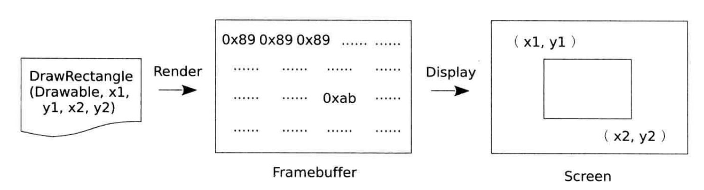
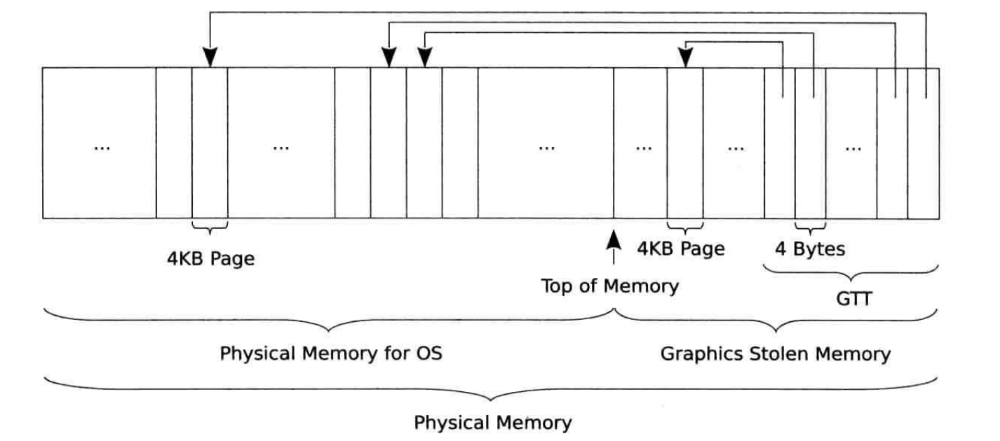
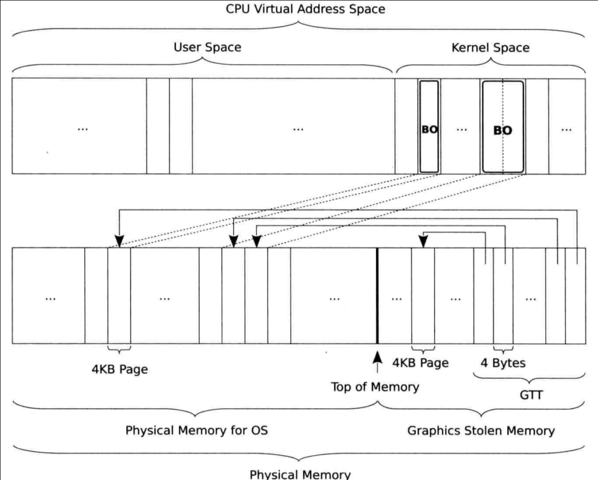
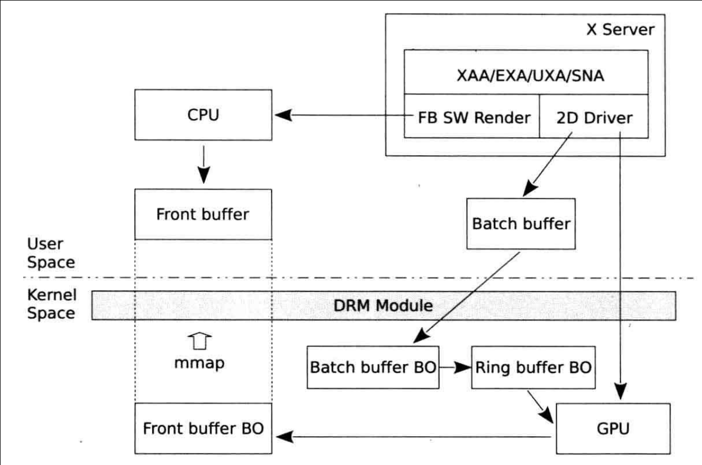
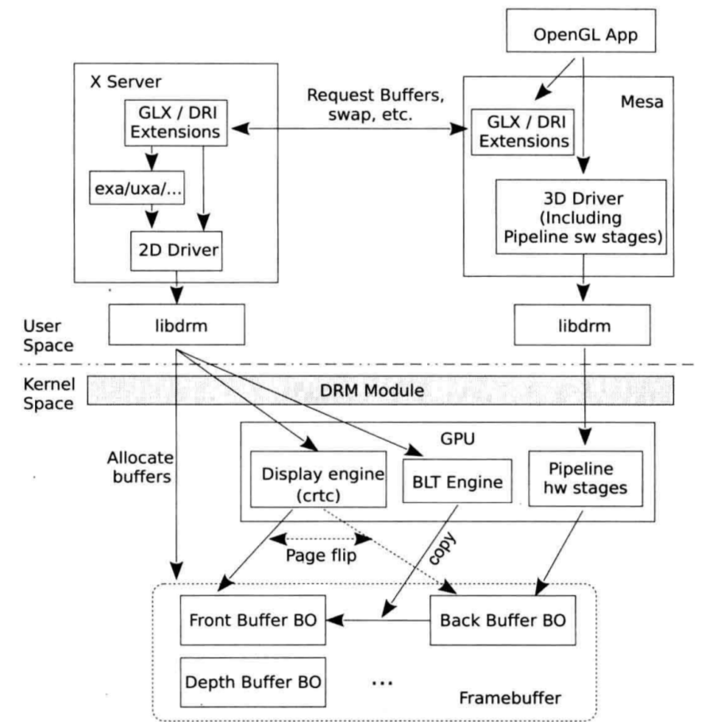
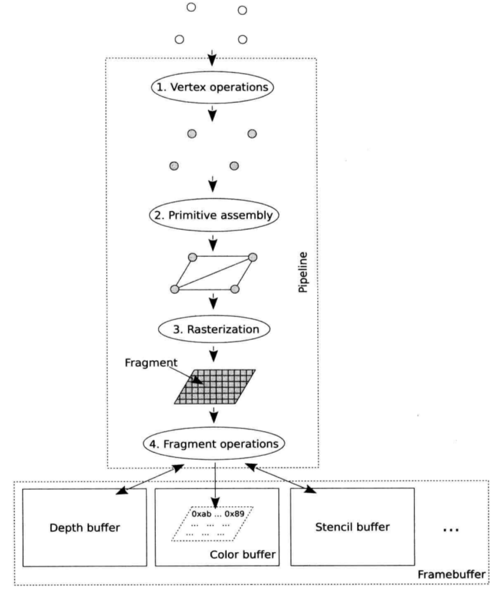
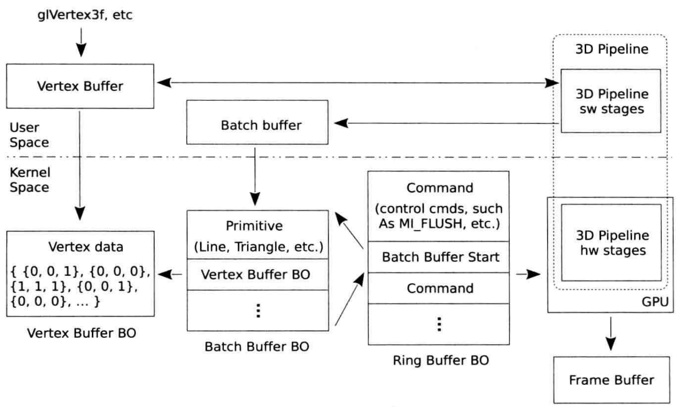
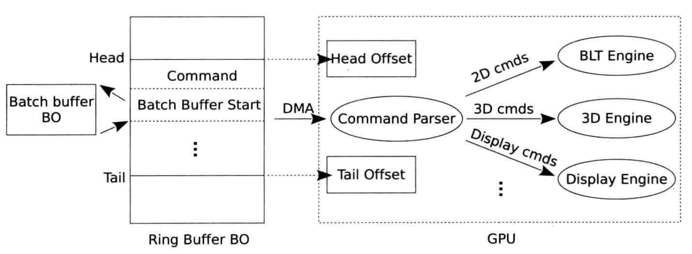

# 概念



## 渲染

* **渲染**：将使用数学描述的图形转化为*像素阵列*，或者叫*像素数组*。
* 像素数组中每个元素是一个*颜色值*或*颜色索引*，对应图像的一个*像素*。
* 渲染分为两种：
  * 软件渲染：渲染过程由CPU完成
  * 硬件渲染：渲染过程由GPU完成，也即*硬件加速*
* 帧缓冲（Framebuffer）
  * 狭义：存储一帧屏幕图像像素数据的存储区。
  * 广义：多个缓冲区的统称。

## 显示

* 图像中一个像素对应屏幕上的一个像素。
* 将图像显示到屏幕的过程就是逐个读取Framebuffer中存储的图像的像素，根据其所代表的颜色值，控制显示器上对应的点显示相应颜色的过程。

### 显示过程经过的几个组件：

* **显示控制器（CRTC）**
  * 读取Framebuffer中的数据
  * 如果存储的是颜色的索引值，还需从颜色映射（Colormap）中查询具体的颜色值
  * 产生同步信号，如水平同步信号（HSYNC）和垂直同步信号（VSYNC）
    - 水平同步信号：通知显示设备开始显示新的一*行*
    - 垂直同步信号：通知显示设备开始显示新的一*帧*
* **编码器（Encoder）**
  * 将从CRTC中读取的数据encoding为适合具体物理接口的编码格式。
* **发射器（Transmitter）**
  * 将编码后的数据转变为物理信号
* **连接器（Connector）**
  * 也被称为Port，如VGA，LVDS等。
  * 直接连接着显示设备，将发射器发出的信号传递给显示设备。

# 显存

* **动态显存技术（Dynamic Video Memory Technology）** 不再是在内存中为GPU开辟专用显存，而是显存和系统按需动态共享整个主存。
* **GART（Graphics Address Remapping Table）**，亦即 **GTT（Graphics Translation Table）**，是动态显存技术的关键，也是GPU直接访问系统内存的关键。
* 整个GTT所能寻址的范围就代表了GPU逻辑寻址空间。
* GTT中的所有表项不必全部映射到物理内存，完全可以按需映射，GPU不再使用的表项指向的内存可以回收给系统使用。
* Kernel的DRM模块设计了特殊的互斥机制，保证CPU和GPU独立寻址物理内存时不会发生冲突。
* **Graphics Stolen Memory**，通过BIOS划分出一块对操作系统不可见，专用于显存的存储区域。
* BIOS负责在*Graphics Stolen Memory*中
  * 建立*GTT表*
  * 初始化*GTT表项*
  * 将*GTT相关信息*，如GTT的基址，写入到GPU的PCI的配置寄存器（PCI Configuration Registers），这样GPU就可以直接找到GTT了。



* 操作系统启动后，显存的分配和回收由操作系统负责，因此操作系统需要访问*GTT*。
* 操作系统从GPU的PCI配置寄存器中获取如GTT的基址等信息。

* drivers/char/agp/intel-gtt.c
```c
...
static const struct intel_gtt_driver i915_gtt_driver = {
    .gen = 3,
    .has_pgtbl_enable = 1,
    .setup = i9xx_setup,
    .cleanup = i9xx_cleanup,
    /*i945 is the last gpu to need phys mem (for overlay and cursors).*/
    .write_entry = i830_write_entry,
    .dma_mask_size = 32,
    .check_flags = i830_check_flags,
    .chipset_flush = i9xx_chipset_flush,
};
...
static const struct intel_gtt_driver ironlake_gtt_driver = {
    .gen = 5,
    .is_ironlake = 1,
    .setup = i9xx_setup,
    .cleanup = i9xx_cleanup,
    .write_entry = i965_write_entry,
    .dma_mask_size = 36,
    .check_flags = i830_check_flags,
    .chipset_flush = i9xx_chipset_flush,
};
...

static int i9xx_setup(void)
{
    phys_addr_t reg_addr;
    int size = KB(512);

    reg_addr = pci_resource_start(intel_private.pcidev, I915_MMADR_BAR);

    intel_private.registers = ioremap(reg_addr, size);
    if (!intel_private.registers)
        return -ENOMEM;

    switch (INTEL_GTT_GEN) {
    case 3:
        intel_private.gtt_phys_addr =
            pci_resource_start(intel_private.pcidev, I915_PTE_BAR);
        break;
    case 5:
        intel_private.gtt_phys_addr = reg_addr + MB(2);
        break;
    default:
        intel_private.gtt_phys_addr = reg_addr + KB(512);
        break;
    }

    intel_i9xx_setup_flush();

    return 0;
}
...
```

## GEM Object
* 引入 **Direct Rendering Manager（DRM）** 的原因：
  * 多个程序并发访问GPU，一旦逻辑控制不好会导致系统工作不稳定，严重时使GPU陷入混乱状态。
  * 如果每个希望使用GPU加速的组件或者程序都需要在自身代码中加入操作GPU的代码，使开发过程变得非常复杂。
* 所有访问GPU的操作都通过DRM统一进行，由DRM协调对GPU的访问。


* DRM的核心是 **显存的管理**
* DRM包含的两个显存管理机制：
  * [GEM](https://en.wikipedia.org/wiki/Direct_Rendering_Manager#Graphics_Execution_Manager) (*Graphics Execution Manager*)：Intel后来设计的，占据主导地位。
  * [TTM](https://en.wikipedia.org/wiki/Direct_Rendering_Manager#Translation_Table_Maps) (*Translation Table Maps*)：ATI和NVidia驱动仍在使用。

### **GEM Object**
* GEM抽象出来的一个数据结构。
* 通过GEM，一个用户空间的应用程序可以创建、处理和销毁在GPU显存中的内存对象，这些内存对象别叫做 **GEM Object** 。
* 从用户空间的角度来看，GEM Object是持久的，而且每次程序重新获得GPU控制权的时候不需要重新载入。

> Through GEM, a user space program can create, handle and destroy memory objects living in the GPU's video memory. These objects, called "GEM objects", are persistent from the user space program's perspective, and don't need to be reloaded every time the program regains control of the GPU.
>
> --https://en.wikipedia.org/wiki/Direct_Rendering_Manager#Graphics_Execution_Manager

* include/drm/drm_gem.h
```c
/**
 * struct drm_gem_object - GEM buffer object
 *
 * This structure defines the generic parts for GEM buffer objects, which are
 * mostly around handling mmap and userspace handles.
 *
 * Buffer objects are often abbreviated to BO.
 */
struct drm_gem_object {
    /**
     * @refcount:
     *
     * Reference count of this object
     *
     * Please use drm_gem_object_reference() to acquire and
     * drm_gem_object_unreference() or drm_gem_object_unreference_unlocked()
     * to release a reference to a GEM buffer object.
     */
    struct kref refcount;

    /**
     * @handle_count:
     *
     * This is the GEM file_priv handle count of this object.
     *
     * Each handle also holds a reference. Note that when the handle_count
     * drops to 0 any global names (e.g. the id in the flink namespace) will
     * be cleared.
     *
     * Protected by dev->object_name_lock.
     */
    unsigned handle_count;

    /**
     * @dev: DRM dev this object belongs to.
     */
    struct drm_device *dev;

    /**
     * @filp:
     *
     * SHMEM file node used as backing storage for swappable buffer objects.
     * GEM also supports driver private objects with driver-specific backing
     * storage (contiguous CMA memory, special reserved blocks). In this
     * case @filp is NULL.
     */
    struct file *filp;

    /**
     * @vma_node:
     *
     * Mapping info for this object to support mmap. Drivers are supposed to
     * allocate the mmap offset using drm_gem_create_mmap_offset(). The
     * offset itself can be retrieved using drm_vma_node_offset_addr().
     *
     * Memory mapping itself is handled by drm_gem_mmap(), which also checks
     * that userspace is allowed to access the object.
     */
    struct drm_vma_offset_node vma_node;

    /**
     * @size:
     *
     * Size of the object, in bytes.  Immutable over the object's
     * lifetime.
     */
    size_t size;

    /**
     * @name:
     *
     * Global name for this object, starts at 1. 0 means unnamed.
     * Access is covered by dev->object_name_lock. This is used by the GEM_FLINK
     * and GEM_OPEN ioctls.
     */
    int name;

    /**
     * @read_domains:
     *
     * Read memory domains. These monitor which caches contain read/write data
     * related to the object. When transitioning from one set of domains
     * to another, the driver is called to ensure that caches are suitably
     * flushed and invalidated.
     */
    uint32_t read_domains;

    /**
     * @write_domain: Corresponding unique write memory domain.
     */
    uint32_t write_domain;

    /**
     * @pending_read_domains:
     *
     * While validating an exec operation, the
     * new read/write domain values are computed here.
     * They will be transferred to the above values
     * at the point that any cache flushing occurs
     */
    uint32_t pending_read_domains;

    /**
     * @pending_write_domain: Write domain similar to @pending_read_domains.
     */
    uint32_t pending_write_domain;

    /**
     * @dma_buf:
     *
     * dma-buf associated with this GEM object.
     *
     * Pointer to the dma-buf associated with this gem object (either
     * through importing or exporting). We break the resulting reference
     * loop when the last gem handle for this object is released.
     *
     * Protected by obj->object_name_lock.
     */
    struct dma_buf *dma_buf;

    /**
     * @import_attach:
     *
     * dma-buf attachment backing this object.
     *
     * Any foreign dma_buf imported as a gem object has this set to the
     * attachment point for the device. This is invariant over the lifetime
     * of a gem object.
     *
     * The driver's ->gem_free_object callback is responsible for cleaning
     * up the dma_buf attachment and references acquired at import time.
     *
     * Note that the drm gem/prime core does not depend upon drivers setting
     * this field any more. So for drivers where this doesn't make sense
     * (e.g. virtual devices or a displaylink behind an usb bus) they can
     * simply leave it as NULL.
     */
    struct dma_buf_attachment *import_attach;
};
...
```
* 一个GEM object可能会有多个组件或者程序需要访问它，因此用的共享内存的机制来实现。
* `filp`成员指向GEM Object对应的共享内存。

* drivers/gpu/drm/drm_gem.c
```c
/**
 * drm_gem_object_init - initialize an allocated shmem-backed GEM object
 * @dev: drm_device the object should be initialized for
 * @obj: drm_gem_object to initialize
 * @size: object size
 *
 * Initialize an already allocated GEM object of the specified size with
 * shmfs backing store.
 */
int drm_gem_object_init(struct drm_device *dev,
            struct drm_gem_object *obj, size_t size)
{
    struct file *filp;

    drm_gem_private_object_init(dev, obj, size);

    filp = shmem_file_setup("drm mm object", size, VM_NORESERVE);
    if (IS_ERR(filp))
        return PTR_ERR(filp);

    obj->filp = filp;

    return 0;
}
EXPORT_SYMBOL(drm_gem_object_init);
```

* GEM Object占用整数个page，即GEM Object的大小一般是4KB的整数倍。

* drivers/gpu/drm/i915/i915_drv.h
  ```c
  struct drm_i915_gem_object {
    ...
    struct sg_table *pages;
    ...
  }
  ```
* `pages`成员指向GEM Object占用的pages的链表。
* 为了可以被GPU访问，GEM Object使用的内存pages还要映射到GTT。

#### 获取GEM Object占据的pages
* drivers/gpu/drm/i915/i915_gem.c::i915_gem_object_get_pages_gtt
```c
static int
i915_gem_object_get_pages_gtt(struct drm_i915_gem_object *obj)
{
    struct drm_i915_private *dev_priv = obj->base.dev->dev_private;
    int page_count, i;
    struct address_space *mapping;
    struct sg_table *st;
    struct scatterlist *sg;
    struct sg_page_iter sg_iter;
    struct page *page;
    unsigned long last_pfn = 0; /* suppress gcc warning */
    int ret;
    gfp_t gfp;

    /* Assert that the object is not currently in any GPU domain. As it
     * wasn't in the GTT, there shouldn't be any way it could have been in
     * a GPU cache
     */
    BUG_ON(obj->base.read_domains & I915_GEM_GPU_DOMAINS);
    BUG_ON(obj->base.write_domain & I915_GEM_GPU_DOMAINS);

    st = kmalloc(sizeof(*st), GFP_KERNEL);
    if (st == NULL)
        return -ENOMEM;

    page_count = obj->base.size / PAGE_SIZE;
    if (sg_alloc_table(st, page_count, GFP_KERNEL)) {
        kfree(st);
        return -ENOMEM;
    }

    /* Get the list of pages out of our struct file.  They'll be pinned
     * at this point until we release them.
     *
     * Fail silently without starting the shrinker
     */
    mapping = file_inode(obj->base.filp)->i_mapping;
    gfp = mapping_gfp_constraint(mapping, ~(__GFP_IO | __GFP_RECLAIM));
    gfp |= __GFP_NORETRY | __GFP_NOWARN;
    sg = st->sgl;
    st->nents = 0;
    for (i = 0; i < page_count; i++) {
        page = shmem_read_mapping_page_gfp(mapping, i, gfp);
        if (IS_ERR(page)) {
            i915_gem_shrink(dev_priv,
                    page_count,
                    I915_SHRINK_BOUND |
                    I915_SHRINK_UNBOUND |
                    I915_SHRINK_PURGEABLE);
            page = shmem_read_mapping_page_gfp(mapping, i, gfp);
        }
        if (IS_ERR(page)) {
          /* We've tried hard to allocate the memory by reaping
           * our own buffer, now let the real VM do its job and
           * go down in flames if truly OOM.
           */
          i915_gem_shrink_all(dev_priv);
          page = shmem_read_mapping_page(mapping, i);
          if (IS_ERR(page)) {
              ret = PTR_ERR(page);
              goto err_pages;
          }
      }
#ifdef CONFIG_SWIOTLB
      if (swiotlb_nr_tbl()) {
          st->nents++;
          sg_set_page(sg, page, PAGE_SIZE, 0);
          sg = sg_next(sg);
          continue;
      }
#endif
      if (!i || page_to_pfn(page) != last_pfn + 1) {
          if (i)
              sg = sg_next(sg);
          st->nents++;
          sg_set_page(sg, page, PAGE_SIZE, 0);
      } else {
          sg->length += PAGE_SIZE;
      }
      last_pfn = page_to_pfn(page);

      /* Check that the i965g/gm workaround works. */
      WARN_ON((gfp & __GFP_DMA32) && (last_pfn >= 0x00100000UL));
  }
#ifdef CONFIG_SWIOTLB
  if (!swiotlb_nr_tbl())
#endif
      sg_mark_end(sg);
  obj->pages = st;

  ret = i915_gem_gtt_prepare_object(obj);
  if (ret)
      goto err_pages;

  if (i915_gem_object_needs_bit17_swizzle(obj))
      i915_gem_object_do_bit_17_swizzle(obj);

  if (obj->tiling_mode != I915_TILING_NONE &&
      dev_priv->quirks & QUIRK_PIN_SWIZZLED_PAGES)
      i915_gem_object_pin_pages(obj);

  return 0;

err_pages:
  sg_mark_end(sg);
  for_each_sg_page(st->sgl, &sg_iter, st->nents, 0)
      put_page(sg_page_iter_page(&sg_iter));
  sg_free_table(st);
  kfree(st);

  /* shmemfs first checks if there is enough memory to allocate the page
   * and reports ENOSPC should there be insufficient, along with the usual
   * ENOMEM for a genuine allocation failure.
   *
   * We use ENOSPC in our driver to mean that we have run out of aperture
   * space and so want to translate the error from shmemfs back to our
   * usual understanding of ENOMEM.
   */
  if (ret == -ENOSPC)
      ret = -ENOMEM;
  return ret;
}

```

#### 将GEM Object 对应的pages写入到GTT的表项
* drivers/gpu/drm/i915/i915_gem_gtt.c
```c
static void i915_ggtt_insert_entries(struct i915_address_space *vm,
                     struct sg_table *pages,
                     uint64_t start,
                     enum i915_cache_level cache_level, u32 unused)
{
    struct drm_i915_private *dev_priv = vm->dev->dev_private;
    unsigned int flags = (cache_level == I915_CACHE_NONE) ?
        AGP_USER_MEMORY : AGP_USER_CACHED_MEMORY;
    int rpm_atomic_seq;

    rpm_atomic_seq = assert_rpm_atomic_begin(dev_priv);

    intel_gtt_insert_sg_entries(pages, start >> PAGE_SHIFT, flags);

    assert_rpm_atomic_end(dev_priv, rpm_atomic_seq);

}
```
* 在Intel GTT驱动中完成写入
  * drivers/char/agp/intel-gtt.c
```c
...
static void i830_write_entry(dma_addr_t addr, unsigned int entry,
                 unsigned int flags)
{
    u32 pte_flags = I810_PTE_VALID;

    if (flags ==  AGP_USER_CACHED_MEMORY)
        pte_flags |= I830_PTE_SYSTEM_CACHED;

    writel_relaxed(addr | pte_flags, intel_private.gtt + entry);
}
...
void intel_gtt_insert_sg_entries(struct sg_table *st,
                 unsigned int pg_start,
                 unsigned int flags)
{
    struct scatterlist *sg;
    unsigned int len, m;
    int i, j;

    j = pg_start;

    /* sg may merge pages, but we have to separate
     * per-page addr for GTT */
    for_each_sg(st->sgl, sg, st->nents, i) {
        len = sg_dma_len(sg) >> PAGE_SHIFT;
        for (m = 0; m < len; m++) {
            /*此处addr指向的是page的物理地址，GPU不能理解虚拟地址*/
            dma_addr_t addr = sg_dma_address(sg) + (m << PAGE_SHIFT);
            /*对于i915 GTT驱动来说，write_entry指向i830_write_entry()，
              见i915_gtt_driver定义。*/
            intel_private.driver->write_entry(addr, j, flags);
            j++;
        }
    }    
    wmb();
}
EXPORT_SYMBOL(intel_gtt_insert_sg_entries);
```

#### CPU 如何寻址和更新 GTT 表项
* GTT在BIOS里划分给GPU专用的Graphics Stolen Memory中，为了让CPU也能寻址并更新GTT表项，需要GTT模块在初始化时，使用`ioremap()`将GTT所在地址映射到CPU的地址空间。
* drivers/char/agp/intel-gtt.c
```c
static int intel_gtt_init(void)
{
    u32 gtt_map_size;
    int ret, bar;

    ret = intel_private.driver->setup();
    if (ret != 0)
        return ret;

    intel_private.gtt_mappable_entries = intel_gtt_mappable_entries();
    intel_private.gtt_total_entries = intel_gtt_total_entries();

    /* save the PGETBL reg for resume */
    intel_private.PGETBL_save =
        readl(intel_private.registers+I810_PGETBL_CTL)
            & ~I810_PGETBL_ENABLED;
    /* we only ever restore the register when enabling the PGTBL... */
    if (HAS_PGTBL_EN)
        intel_private.PGETBL_save |= I810_PGETBL_ENABLED;

    dev_info(&intel_private.bridge_dev->dev,
            "detected gtt size: %dK total, %dK mappable\n",
            intel_private.gtt_total_entries * 4,   
            intel_private.gtt_mappable_entries * 4);

    gtt_map_size = intel_private.gtt_total_entries * 4;

    intel_private.gtt = NULL;
    if (intel_gtt_can_wc())
        intel_private.gtt = ioremap_wc(intel_private.gtt_phys_addr,
                           gtt_map_size);
    if (intel_private.gtt == NULL)
        intel_private.gtt = ioremap(intel_private.gtt_phys_addr,
                        gtt_map_size);
    if (intel_private.gtt == NULL) {
        intel_private.driver->cleanup();
        iounmap(intel_private.registers);
        return -ENOMEM;
    }

#if IS_ENABLED(CONFIG_AGP_INTEL)
    global_cache_flush();   /*FIXME: ?*/
#endif

    intel_private.stolen_size = intel_gtt_stolen_size();

    intel_private.needs_dmar = USE_PCI_DMA_API && INTEL_GTT_GEN > 2;

    ret = intel_gtt_setup_scratch_page();
    if (ret != 0) {
        intel_gtt_cleanup();
        return ret;
    }

    if (INTEL_GTT_GEN <= 2)
        bar = I810_GMADR_BAR;
    else
        bar = I915_GMADR_BAR;

    intel_private.gma_bus_addr = pci_bus_address(intel_private.pcidev, bar);
    return 0;
}
```

* GEM Object本质上是一块共享内存，它被映射进了GTT，所以它即可被CPU寻址，也可以被GPU寻址。



* 对于GPU来说，显存采用的是线性地址空间，任何一个显存地址都是从起始地址的偏移。

### 通过GEM Object交互
* GEM Object是显存的基本单元，所以从保存像素阵列的Framebuffer，到CPU下达给GPU的指令和数据，全部都是GEM Object承载。
* **软件渲染**：对于GPU不支持的绘制操作，代表Framebuffer的GEM Object将被映射到用户空间，用户程序直接在GEM Object上使用CPU进行软件绘制。
* **硬件渲染**：对于GPU支持的绘制操作，用户程序将命令和数据等复制到保存命令的GEM Object，然后GPU从这些GEM Object读取命令和数据，按照GEM Object中的指令和数据进行渲染。

# 2D渲染


## 前缓冲
* 在X环境不开启复合（Composite）扩展的情况下，所有程序共享一个前缓冲。
  * 对于2D程序，所有绘制动作生成的图像的像素阵列最终都输出到这个前缓冲
  * 窗口只不过是前缓冲中的一块区域而已。
* 在开启复合扩展情况下，每个窗口都被分配一个离屏（offscreen）缓冲。
  * 应用程序将生成的像素阵列输出到这个离屏缓冲中。
  * 绘制完成后X Server将向复合管理器（Composite Manager）发送Damage事件。
  * 复合管理器收到这个事件后，将离屏缓冲区的内容合成到前缓冲。
* 前缓冲建立起来后需要将窗口与前缓冲关联起来，否则窗口上的绘制不能体现在屏幕上。
* 所谓创建窗口事实上就是将窗口与前缓冲关联起来，以后凡是发生到窗口上的绘制，都将直接绘制到前缓冲中。

## GPU渲染
* GPU渲染即通常所说的 **硬件加速**。
* 将数学模型按照GPU的规定翻译成GPU可以识别的指令和数据，传给GPU，由GPU完成像素图像等密集计算。

# 3D渲染

* DRI机制，X应用不再将绘制图形的请求发送给X Server，而是由应用自行绘制。
* Linux的OpenGL实现--Mesa
  * 兼容OpenGL的标准，为应用程序提供标准的OpenGL API。
  * DRI驱动，也称为3D驱动。
    * Pipeline的软件实现，即使GPU没有任何3D计算能力，Mesa也可以用CPU完成3D渲染。
    * 3D渲染命令翻译成GPU可以理解并能执行的指令。
    * Mesa中针对不同的GPU有各自的3D驱动。
  * Pipeline将生成好的像素阵列输出到Framebuffer。
* X的核心协议不包含OpenGL的相关协议，因此 *GLX* 与 *DRI扩展* 在X和Mesa中均需实现。



* 应用程序创建OpenGL的上下文，包括向X Server申请创建Framebuffer。
  * 创建完成后X Server需要将Framebuffer的BO信息返回给应用程序。
  * 为了将Framebuffer与具体窗口绑定，应用程序向X Server请求为其创建Framebuffer。
* 应用程序建立数学模型，并通过OpenGL的API将数学模型的数据写入顶点缓冲（vertex buffer）。
  * 更新GPU的状态，如指定后缓冲，用来存储Pipeline输出的像素阵列。
  * 启动Pipeline进行渲染。
* 渲染完成后，应用程序向X Server发出交换（swap）请求。
  * 复制（**copy**）：将后缓冲中的内容复制到前缓冲，由GPU中的BLT引擎负责。
  * 页翻转（**page flip**）：通过GPU的显示引擎控制显示控制器（CRTC）扫描哪个缓冲。
    * 被扫描的缓冲此时为前缓冲。
    * 不被扫描的缓冲作为后缓冲，也是应用程序的“画板”。

## 创建Framebuffer
* X Server创建Framebuffer，然后告知应用程序。
* Framebuffer中的每个buffer对应一个BO。

### 创建Framebuffer的过程
1. OpenGL应用向X Server请求为指定窗口创建Framebuffer对应的BO。Framebuffer中包含多个buffer，所以创建了多个BO。
2. X server收到请求后，为各个buffer创建BO。创建完成后，将BO名字等相关信息发送给应用。
3. 应用程序收到BO信息后更新GPU状态。比如告诉GPU画板在哪里。

* 对于运行在X窗口系统上的OpenGL应用来说，尽管应用程序有可能要求直接绘制在前缓冲上，但是X Server发给OpenGL应用的只是一个伪前缓冲，和普通的后缓冲没有本质区别。
* X不允许DRI应用程序不通过X直接在前缓冲上绘制，X不希望应用程序把屏幕显示搞乱，X要对前缓冲有绝对的控制权。
* 如同进程切换时，CPU需要切换上下文一样，在对不同的OpenGL程序进行渲染的时候，GPU也需要在不同程序间切换。
  * 以Framebuffer为例，每个OpenGL程序都有自己的Framebuffer。
  * 但只有当前进行绘制的OpenGL应用的Framebuffer才是GPU的目标Framebuffer。
  * 所以当不同OpenGL程序进行切换时，GPU需要切换记录Framebuffer地址的寄存器，使其指向当前正在进行绘制的程序的Framebuffer。

## 渲染Pipeline
* OpenGL标准将3D渲染的过程划分为一些阶段，并将由这些阶段组成的这一过程形象地称为 **Pipeline**。
* Pipeline可由软件实现（CPU），也可全部由硬件（GPU）实现，或者二者混合，取决于GPU的能力。

### Pipeline的几个主要阶段
1. 顶点处理（vertex operation）
    * 顶点处理单元将几何对象的顶点从对象坐标系换到视点坐标系，即三维坐标投影到二维坐标。
    * 为每个顶点赋颜色值。
    * 进行光照处理。
2. 图元装配（primitive assembly）
    * 很多操作不能以顶点单独进行处理，如裁减，光栅化。
    * 将处理过的顶点连接成为一些最基本的图元，包括点，线和三角形等。
3. 光栅化（rasterization）
    * 图元最终转化成像素阵列的过程。
    * 光栅化后，图元被分解成一些片段（fragment），每个片段对应一个像素，其中有位置值（像素位置），颜色，纹理坐标和深度等属性。
4. 片段处理（fragment operation）
    * 对每个片段进行相关测试，如深度测试，模版测试。



* Intel GPU 3D渲染的过程


* GPU命令流

