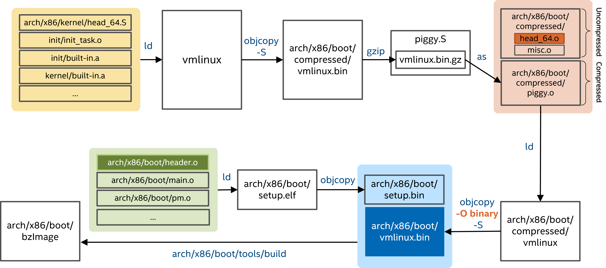

# setup.bin
* arch/x86/boot/header.S
* real mode data
* zero page
```s
    # offset 512, entry point

    .globl  _start
_start:
        # Explicitly enter this as bytes, or the assembler
        # tries to generate a 3-byte jump here, which causes
        # everything else to push off to the wrong offset.
        .byte   0xeb        # short (2-byte) jump
        .byte   start_of_setup-1f
...
# End of setup header #####################################################

    .section ".entrytext", "ax"
start_of_setup:
# Force %es = %ds
    movw    %ds, %ax
    movw    %ax, %es
    cld
...
# Jump to C code (should not return)
    calll   main
...
```

* arch/x86/boot/main.c
```c
main()
   arch/x86/boot/memory.c
-> detect_memory()
   -> detect_memory_e820()
         ireg.ax  = 0xe820;
         ireg.edx = SMAP; // 0x534d4150  /* ASCII "SMAP" */
         arch/x86/boot/bioscall.S
      -> intcall(0x15, &ireg, &oreg)
```

# vmlinux
* arch/x86/kernel/head_64.S
```s
    .text
    __HEAD
    .code64
SYM_CODE_START_NOALIGN(startup_64)
...
    leaq    _text(%rip), %rdi
    pushq   %rsi
    call    __startup_64
    popq    %rsi

    /* Form the CR3 value being sure to include the CR3 modifier */
    addq    $(early_top_pgt - __START_KERNEL_map), %rax
    jmp 1f
SYM_CODE_END(startup_64)
...
    pushq   $.Lafter_lret   # put return address on stack for unwinder
    xorl    %ebp, %ebp  # clear frame pointer
    movq    initial_code(%rip), %rax
    pushq   $__KERNEL_CS    # set correct cs
    pushq   %rax        # target address in negative space
    lretq
.Lafter_lret:
    ANNOTATE_NOENDBR
SYM_CODE_END(secondary_startup_64)
...
    /* Both SMP bootup and ACPI suspend change these variables */
    __REFDATA
    .balign 8
SYM_DATA(initial_code,  .quad x86_64_start_kernel)
SYM_DATA(initial_gs,    .quad INIT_PER_CPU_VAR(fixed_percpu_data))
...
```

```c
startup_64
   arch/x86/kernel/head64.c
-> x86_64_start_kernel()
   -> x86_64_start_reservations(real_mode_data)
      -> start_kernel()
            arch/x86/kernel/setup.c
         -> setup_arch()
            -> early_reserve_memory()
                  arch/x86/kernel/ebda.c
               -> reserve_bios_regions()
                  -> get_bios_ebda()
            arch/x86/kernel/e820.c
         -> e820__memory_setup()
            -> who = x86_init.resources.memory_setup()
            => e820__memory_setup_default()
            -> pr_info("BIOS-provided physical RAM map:\n")
            -> e820__print_table(who)
```