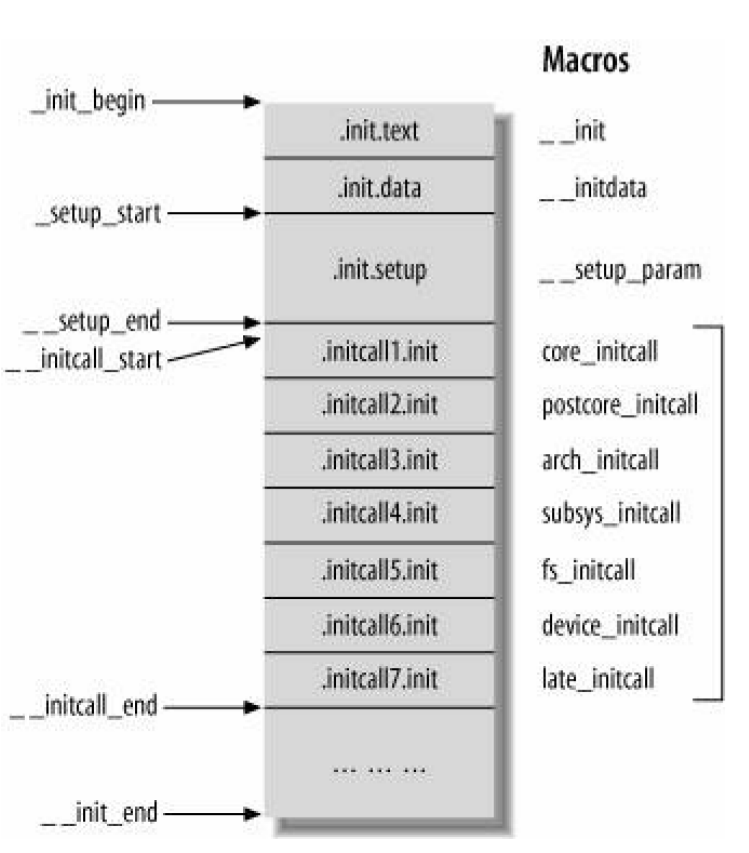

# initcall

* initcalls 按照功能分组，分别放在不同的子段（subsection）
* 它们在子段中的顺序取决于链接的顺序
* 由于向后兼容的原因，`initcall()`把调用放到了 device init 的子段
* `__define_initcall()`的`id`参数是为了让多个 initcalls 可以指向同一个 handler，并且不引起符号重复的编译错误
* initcalls 通过内核在运行时迭代在 initcall section 的指针来运行
  * initcall section 不止一个
* 链接器会因为无用代码/数据消除而完全移除它，所以 initcall section 不得不在链接器脚本中被标识成 `KEEP()`。
  * include/asm-generic/vmlinux.lds.h
  * include/linux/init.h

## 支持的 initcalls 类型
```c
typedef int (*initcall_t)(void);
...
/*
 * initcalls are now grouped by functionality into separate
 * subsections. Ordering inside the subsections is determined
 * by link order.
 * For backwards compatibility, initcall() puts the call in
 * the device init subsection.
 *
 * The `id' arg to __define_initcall() is needed so that multiple initcalls
 * can point at the same handler without causing duplicate-symbol build errors.
 *
 * Initcalls are run by placing pointers in initcall sections that the
 * kernel iterates at runtime. The linker can do dead code / data elimination
 * and remove that completely, so the initcall sections have to be marked
 * as KEEP() in the linker script.
 */

#define __define_initcall(fn, id) \
       static initcall_t __initcall_##fn##id __used \
       __attribute__((__section__(".initcall" #id ".init"))) = fn;
 /*
  * Early initcalls run before initializing SMP.
  *
  * Only for built-in code, not modules.
  */
 #define early_initcall(fn)              __define_initcall(fn, early)

 /*
  * A "pure" initcall has no dependencies on anything else, and purely
  * initializes variables that couldn't be statically initialized.
  *
  * This only exists for built-in code, not for modules.
  * Keep main.c:initcall_level_names[] in sync.
  */
 #define pure_initcall(fn)               __define_initcall(fn, 0)

 #define core_initcall(fn)               __define_initcall(fn, 1)
 #define core_initcall_sync(fn)          __define_initcall(fn, 1s)
 #define postcore_initcall(fn)           __define_initcall(fn, 2)
 #define postcore_initcall_sync(fn)      __define_initcall(fn, 2s)
 #define arch_initcall(fn)               __define_initcall(fn, 3)
 #define arch_initcall_sync(fn)          __define_initcall(fn, 3s)
 #define subsys_initcall(fn)             __define_initcall(fn, 4)
 #define subsys_initcall_sync(fn)        __define_initcall(fn, 4s)
 #define fs_initcall(fn)                 __define_initcall(fn, 5)
 #define fs_initcall_sync(fn)            __define_initcall(fn, 5s)
 #define rootfs_initcall(fn)             __define_initcall(fn, rootfs)
 #define device_initcall(fn)             __define_initcall(fn, 6)
 #define device_initcall_sync(fn)        __define_initcall(fn, 6s)
 #define late_initcall(fn)               __define_initcall(fn, 7)
 #define late_initcall_sync(fn)          __define_initcall(fn, 7s)

 #define __initcall(fn) device_initcall(fn)

 #define __exitcall(fn)                                          \
         static exitcall_t __exitcall_##fn __exit_call = fn

 #define console_initcall(fn)                                    \
         static initcall_t __initcall_##fn                       \
         __used __section(.con_initcall.init) = fn

 #define security_initcall(fn)                                   \
         static initcall_t __initcall_##fn                       \
         __used __section(.security_initcall.init) = fn
...__``
```
* 一个 initcall 展开示例
  ```c
  core_initcall(init_function_trace);
  /*after marco expansion*/
  static initcall_t __initcall_init_function_trace1 __attribute__((__used__)) \
  __attribute__((__section__(".initcall1.init"))) = init_function_trace;
  ```
  * 语义：定义了一个类型为`int (*initcall_t)(void)`的函数指针`__initcall_init_function_trace1`，其值为函数`init_function_trace()`的地址，编译时该符号放到名为`.initcall1.init`的 section
  * `__attribute__((__used__))`的释义
  > **used**
  >
  > This attribute, attached to a function, means that code must be emitted for the function even if it appears that the function is not referenced. This is useful, for example, when the function is referenced only in inline assembly.
  >
  > When applied to a member function of a C++ class template, the attribute also means that the function is instantiated if the class itself is instantiated.
  >
  > https://gcc.gnu.org/onlinedocs/gcc-6.2.0/gcc/Common-Function-Attributes.html#Common-Function-Attributes

## 调用 initcalls

## 调用关系
* `rest_init()`的调用比较靠后，而且是通过内核线程的方式开启`kernel_init()`调用，因此 initcalls 调用在内核启动过程中并不是很靠前
* 通过`early_initcall()`声明的函数要早于其他 initcalls 方式声明的函数被调用
```
start_kernel()
  -> rest_init()
      -> kernel_thread(kernel_init, NULL, CLONE_FS);
                          |
  +-----------------------+
  |  /*in a new kernel thread*/
  +-> kernel_init()
        -> kernel_init_freeable()
             |
             +-> do_pre_smp_initcalls()
             |     -> for (fn = __initcall_start; fn < __initcall0_start; fn++)
             +           do_one_initcall(*fn);
             +
             +  /*some other function initializes*/
             |
             +-> do_basic_setup()
                  -> do_initcalls()
                        -> for (level = 0; level < ARRAY_SIZE(initcall_levels) - 1; level++)
                              do_initcall_level(level);
                                -> for (fn = initcall_levels[level]; fn < initcall_levels[level+1]; fn++)
                                      do_one_initcall(*fn);
```

## 调用过程
* include/linux/compiler.h
  ```c
  /* Simple shorthand for a section definition */
  #ifndef __section
  # define __section(S) __attribute__ ((__section__(#S)))
  #endif
  ```
* include/linux/init.h
  ```c
  /* These are for everybody (although not all archs will actually
     discard it in modules) */
  #define __init          __section(.init.text) __cold notrace __latent_entropy
  #define __initdata      __section(.init.data)
  #define __initconst     __section(.init.rodata)
  #define __exitdata      __section(.exit.data)
  #define __exit_call     __used __section(.exitcall.exit)
  ...__``
  ```
* `__initdata` 放在变量定义之后，表明编译时该变量会被放到`.init.data` section
* init/main.c
```c
bool initcall_debug;
core_param(initcall_debug, initcall_debug, bool, 0644);
...
__setup("initcall_blacklist=", initcall_blacklist);

static int __init_or_module do_one_initcall_debug(initcall_t fn)
{
        ktime_t calltime, delta, rettime;
        unsigned long long duration;
        int ret;
        /*这里会记录下调用前的时间和调用后的时间，并打印时间差*/
        printk(KERN_DEBUG "calling  %pF @ %i\n", fn, task_pid_nr(current));
        calltime = ktime_get();
        ret = fn();
        rettime = ktime_get();
        delta = ktime_sub(rettime, calltime);
        duration = (unsigned long long) ktime_to_ns(delta) >> 10;
        printk(KERN_DEBUG "initcall %pF returned %d after %lld usecs\n",
                 fn, ret, duration);

        return ret;
}

int __init_or_module do_one_initcall(initcall_t fn)
{
        int count = preempt_count();
        int ret;
        char msgbuf[64];
        /*如果函数在 initcall 黑名单上，则该 initcall 跳过。黑名单可以通过命令行参数指定*/
        if (initcall_blacklisted(fn))
                return -EPERM;
        /*根据命令行参数 initcall_debug 是否开启，进入不同的分支*/
        if (initcall_debug)
                ret = do_one_initcall_debug(fn);
        else
                ret = fn();

        msgbuf[0] = 0;

        if (preempt_count() != count) {
                sprintf(msgbuf, "preemption imbalance ");
                preempt_count_set(count);
        }
        if (irqs_disabled()) {
                strlcat(msgbuf, "disabled interrupts ", sizeof(msgbuf));
                local_irq_enable();
        }
        WARN(msgbuf[0], "initcall %pF returned with %s\n", fn, msgbuf);
        /*添加随机数熵*/
        add_latent_entropy();
        return ret;
}

extern initcall_t __initcall_start[];
extern initcall_t __initcall0_start[];
extern initcall_t __initcall1_start[];
extern initcall_t __initcall2_start[];
extern initcall_t __initcall3_start[];
extern initcall_t __initcall4_start[];
extern initcall_t __initcall5_start[];
extern initcall_t __initcall6_start[];
extern initcall_t __initcall7_start[];
extern initcall_t __initcall_end[];

static initcall_t *initcall_levels[] __initdata = {
        __initcall0_start,
        __initcall1_start,
        __initcall2_start,
        __initcall3_start,
        __initcall4_start,
        __initcall5_start,
        __initcall6_start,
        __initcall7_start,
        __initcall_end,
};

/* Keep these in sync with initcalls in include/linux/init.h */
static char *initcall_level_names[] __initdata = {
        "early",
        "core",
        "postcore",
        "arch",
        "subsys",
        "fs",
        "device",
        "late",
};

static void __init do_initcall_level(int level)
{
        initcall_t *fn;

        strcpy(initcall_command_line, saved_command_line);
        parse_args(initcall_level_names[level],
                   initcall_command_line, __start___param,
                   __stop___param - __start___param,
                   level, level,
                   NULL, &repair_env_string);
        /*`initcall_levels[0]`，`initcall_levels[1]`，...其实是取第一维元素，
          fn 在第二维的元素间移动*/
        for (fn = initcall_levels[level]; fn < initcall_levels[level+1]; fn++)
                do_one_initcall(*fn);
}

static void __init do_initcalls(void)
{
        int level;
        /*`initcall_levels`其实是个二维数组*/
        for (level = 0; level < ARRAY_SIZE(initcall_levels) - 1; level++)
                do_initcall_level(level);
}
...__```
```

## initcall 相关的一些内存布局


* 以下符号映射截取自一个 x86-64 平台的 `System.map`
```
ffffffff82483488 T __initcall_start
ffffffff82483488 T __setup_end
ffffffff82483490 t __initcall_trace_init_perf_perm_irq_work_exitearly
ffffffff82483498 t __initcall_trace_init_flags_sys_exitearly
ffffffff824834a0 t __initcall_trace_init_flags_sys_enterearly
ffffffff824834a8 t __initcall_init_hw_perf_eventsearly
...
ffffffff824834f0 t __initcall_init_eventsearly
ffffffff824834f8 t __initcall_init_trace_printkearly
ffffffff82483500 t __initcall_event_trace_enable_againearly
ffffffff82483508 t __initcall_rand_initializeearly
ffffffff82483510 t __initcall_mce_amd_initearly
ffffffff82483518 T __initcall0_start
ffffffff82483518 t __initcall_ipc_ns_init0
ffffffff82483520 t __initcall_init_mmap_min_addr0
ffffffff82483528 t __initcall_init_cpufreq_transition_notifier_list0
ffffffff82483530 t __initcall_net_ns_init0
ffffffff82483538 T __initcall1_start
ffffffff82483538 t __initcall_e820_mark_nvs_memory1
ffffffff82483540 t __initcall_cpufreq_tsc1
ffffffff82483548 t __initcall_init_cpu_syscore1
ffffffff82483550 t __initcall_reboot_init1
...
ffffffff824835b0 t __initcall_init_function_trace1
ffffffff824835b8 t __initcall_init_graph_trace1
...
ffffffff82483658 t __initcall_netpoll_init1
ffffffff82483660 t __initcall_netlink_proto_init1
ffffffff82483668 T __initcall2_start
ffffffff82483668 t __initcall_bdi_class_init2
ffffffff82483670 t __initcall_mm_sysfs_init2
...
ffffffff824845c0 t __initcall_init_dns_resolver6
ffffffff824845c8 t __initcall_mcheck_init_device6s
ffffffff824845d0 T __initcall7_start
ffffffff824845d0 t __initcall_mcheck_late_init7
ffffffff824845d8 t __initcall_severities_debugfs_init7
...
ffffffff82484708 t __initcall_software_resume7s
ffffffff82484710 t __initcall_clk_disable_unused7s
ffffffff82484718 t __initcall_alsa_sound_last_init7s
ffffffff82484720 T __con_initcall_start
ffffffff82484720 t __initcall_con_init
ffffffff82484720 T __initcall_end
ffffffff82484728 t __initcall_univ8250_console_init
ffffffff82484730 T __con_initcall_end
...
```
* 可以关注以下几点：
  * `__initcall_start`与`__setup_end`，`__initcall_end`与`__con_initcall_start`共用同一地址
  * 由于是 64 bit 平台，指针的长度是 8 Bytes，因此每个条目占用的空间是 8 Bytes
  * `initcall_levels`数组的元素的静态布局
  * `early_initcall()`声明的函数被调用的更早其实跟布局没有关系，但布局上确实也把它排在了前面

## kernel command line 相关选项

> **initcall_debug**
>
> [KNL] Trace initcalls as they are executed.  Useful for working out where the kernel is dying during startup.
>
> **initcall_blacklist=**
>
> [KNL] Do not execute a comma-separated list of initcall functions.  Useful for debugging built-in modules and initcalls.
>
> *Documentation/admin-guide/kernel-parameters.txt*


# References
- [Oreilly, Understanding Linux Network Internals (2005)](http://www.embeddedlinux.org.cn/linux_net/0596002556/understandlni-CHP-7-SECT-3.html)
- [Linux Kernel init_cal](http://blog.163.com/vic_kk/blog/static/494705242010426114940551/)
- [The kernel infrastructure - macro label](http://www.programering.com/a/MzNwcDNwATg.html)
