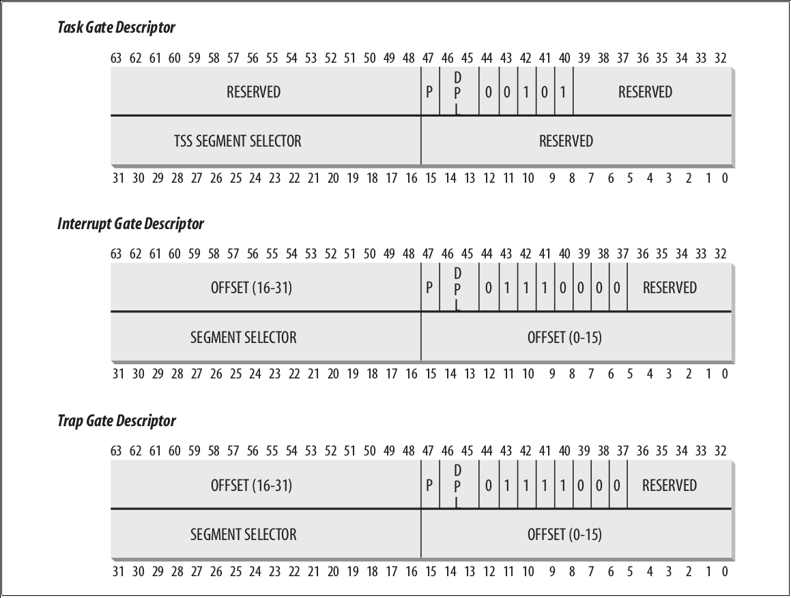

# 中断

## Interrupt Descriptor Table (IDT)
* 中断描述符表 Interrupt Descriptor Table (IDT) 与每个中断和异常向量关联
* 每个表项是一个 8 字节的描述符，x86 有 256 个中断向量，因此需要 256 x 8 = 2048 字节来存储 IDT
* `idtr`寄存器允许 IDT 被加载到内存中的任何位置
  * 指定 IDT 的线性地址的基址和它的最大长度
  * 必须在开启中断前用`lidt`指令初始化
* Intel 提供的中断描述符分三种类型，用 40-43 位进行区分
  * 任务门（Task Gate）
  * 中断门（Interrupt Gate）
  * 陷阱门（Trap Gate）

* Linux 采用的中断描述符稍有不同：
  * 中断门（Interrupt Gate）
  * 系统门（System Gate）：
    * Intel 陷阱门
    * DPL=3
    * 关联到 4，5，128 号向量，因此`into`，`bound`，`int $0x80`指令可以在用户态使用。
  * 系统中断门（System Interrupt Gate）
    * Intel 中断门
    * DPL=3
    * 关联到 3 号向量，因此`int3`指令可以在用户态使用
  * 陷阱门（Trap Gate）
  * 任务门（Task Gate）

## x86的中断和异常的硬件处理

* 假设内核已经初始化并且 CPU 运行在保护模式
* 在执行完一条指令之后，`cs`和`eip`寄存器会包含将要执行的下一条指令的逻辑地址
* 在处理这条指令之前，CPU 控制单元会检查在执行上一条指令期间是否有中断或异常发生，如果有，CPU 控制单元会完成下列操作
  1. 决定中断向量 i (0 < i < 255)
  2. 根据`idtr`寄存器找到中断描述符表 IDT 的第 i 项
  3. 从`gdtr`寄存器获取到全局描述符表 GDT 的基地址，在 GDT 中，根据 IDT 条目中的选择符（selector）读取指定的段描述符（Segment Descriptor），该描述符指明了含有中断或异常 handler 的 segment 的基地址
      - 在我们熟知的段寻址中，逻辑地址的高 16 bit 作为段选择符（Segment Selector）在 GDT 中选择段描述符，而这里用的是 IDT 条目中的选择符来在 GDT 中选择段描述符
      - 含有中断或异常 handler 的 segment 应该是某一内核代码 segment
  4. 确保发出中断/异常的来源是合法的
      - 比较存储在`cs`寄存器最后两位的 Current Privilege Level (CPL) 和 GDT 表中的段描述符的 Descriptor Privilege Level (DPL)。
      - 如果 CPL 比 DPL 低，产生一个 “General protection” 的异常，因为中断处理函数的特权级不能低于比引起中断的程序的特权级。
      - 例如，只有在硬件中断发生时，CPU 特权级提升（到 0 级）后才能跳转到去执行中断处理代码，因此不会做此检查。而系统调用发生在用户态，因为系统调用所使用的陷阱门的 DPL=3，因此 CPL 为任何特权级的代码都可以发出系统调用。
      - 对于编程异常，作进一步的安全检查：比较 CPL 和 IDT 表中的门描述符的 DPL，如果 DPL 比 CPL 低，产生一个 “General protection” 异常。
      - 因为要跳转到的目标代码（中断代码）优先级需要高于或等于被打断的代码（比如用户态的代码）
      - 第二个检查阻止了用户应用程序通过高优先级的陷阱门或中断门，只能通过低优先级的陷阱门（系统门和系统中断门）
  5. 检查特权级是否发生了改变，即 CPL 与所选择的段描述符的 DPL 不一样，如果是的话，CPU 必须开始启用与特权级关联的新的栈，通过以下步骤：
      - 读取`tr`寄存器去访问当前正在运行的进程的 TSS segment
      - 将新特权级关联的栈段和栈指针加载到`ss`和`esp`寄存器，这些值是在 TSS segment 中找到的
      - 在新的栈中，保存之前`ss`和`esp`寄存器的值，这些值定义了旧特权级关联的栈的逻辑地址
  6. 如果缺陷已经发生了，将引起异常的指令的逻辑地址加载`cs`和`eip`，以便异常能够再次被执行
  7. 将`eflags`，`cs`，`eip`的值保存到栈上
  8. 如果异常带有硬件错误码，也将它保存到栈上
  9. 根据 IDT 第 i 项的门描述符中的 *段选择符* 和 *偏移*，将中断或异常 handler 第一条指令的逻辑地址加载地址到`cs`和`eip`

## 中断初始化
### Call trace
```c
start_kernel()
-> trap_init()
  -> idt_setup_traps()
     -> idt_setup_from_table(idt_table, def_idts, ARRAY_SIZE(def_idts), true);
  -> cea_set_pte(CPU_ENTRY_AREA_RO_IDT_VADDR, __pa_symbol(idt_table), PAGE_KERNEL_RO);
  -> idt_descr.address = CPU_ENTRY_AREA_RO_IDT;
  -> cpu_init()
     -> load_current_idt()
        -> load_idt((const struct desc_ptr *)&idt_descr);
           -> native_load_idt()
  -> idt_setup_ist_traps()
  -> x86_init.irqs.trap_init()
  -> idt_setup_debugidt_traps()
-> init_IRQ()
  -> x86_init.irqs.intr_init()
  => native_init_IRQ()
     -> idt_setup_apic_and_irq_gates()
        -> idt_setup_from_table(idt_table, apic_idts, ARRAY_SIZE(apic_idts), true);
        -> int i = FIRST_EXTERNAL_VECTOR;
           for_each_clear_bit_from(i, system_vectors, FIRST_SYSTEM_VECTOR)
              set_intr_gate(i, irq_entries_start + 8 * (i - FIRST_EXTERNAL_VECTOR));
```
* `idt_table`为设置好内容的 **IDT 表**
* `idt_descr`为存储 IDT 表地址的指针，用`lidt`指令将它加载到`idtr`寄存器
* `def_idts[]`为通用的异常数组，`apic_idts[]`为 x86 APIC 的中断数组
* x86 通过`native_init_IRQ()`调用`idt_setup_apic_and_irq_gates()`设置好 APIC 和 **中断** 的门
  * 对于中断来说，`irq_entries_start`就是软件在中断处理的第一段例程
  * `irq_entries_start`见 arch/x86/entry/entry_64.S，里面包含一个很大的汇编宏展开`.rept (FIRST_SYSTEM_VECTOR - FIRST_EXTERNAL_VECTOR)`

### `def_idts[]`数组
* `struct gate_struct`对应到 Intel IDT 的表项，存储格式见上面图示，注意，中断处理函数的地址不是连续存储的，而是被`offset_low`，`offset_middle`，`offset_high`分成三个部分
  * arch/x86/include/asm/desc_defs.h
  ```c
  enum {  //对应到表示门描述符类型的 40-43 位
          GATE_INTERRUPT = 0xE,
          GATE_TRAP = 0xF,
          GATE_CALL = 0xC,
          GATE_TASK = 0x5,
  };
  ...
  struct idt_bits {
          u16             ist     : 3, //32-34 位
                          zero    : 5, //35-39 位为 0
                          type    : 5, //40-43 位为门描述符类型，44 为 0
                          dpl     : 2, //45-46 位为门描述符 DPL
                          p       : 1; //47 位为 P
  } __attribute__((packed));

  struct gate_struct {
          u16             offset_low; //0~15 位为 Offset(0-15)
          u16             segment;    //16~31 位为段选择符
          struct idt_bits bits;       //32-47 位为门描述符 bit 位，见 struct idt_bits
          u16             offset_middle; //48-63 位为 Offset(16-31)
  #ifdef CONFIG_X86_64
          u32             offset_high; //64 位的高 32 位， Offset(32-63)
          u32             reserved;
  #endif
  } __attribute__((packed));

  typedef struct gate_struct gate_desc;
  ```
* 0~32 号异常的枚举定义
  * arch/x86/include/asm/traps.h
  ```c
  /* Interrupts/Exceptions */
  enum {
          X86_TRAP_DE = 0,        /*  0, Divide-by-zero */
          X86_TRAP_DB,            /*  1, Debug */
          X86_TRAP_NMI,           /*  2, Non-maskable Interrupt */
          X86_TRAP_BP,            /*  3, Breakpoint */
          X86_TRAP_OF,            /*  4, Overflow */
          X86_TRAP_BR,            /*  5, Bound Range Exceeded */
          X86_TRAP_UD,            /*  6, Invalid Opcode */
          X86_TRAP_NM,            /*  7, Device Not Available */
          X86_TRAP_DF,            /*  8, Double Fault */
          X86_TRAP_OLD_MF,        /*  9, Coprocessor Segment Overrun */
          X86_TRAP_TS,            /* 10, Invalid TSS */
          X86_TRAP_NP,            /* 11, Segment Not Present */
          X86_TRAP_SS,            /* 12, Stack Segment Fault */
          X86_TRAP_GP,            /* 13, General Protection Fault */
          X86_TRAP_PF,            /* 14, Page Fault */
          X86_TRAP_SPURIOUS,      /* 15, Spurious Interrupt */
          X86_TRAP_MF,            /* 16, x87 Floating-Point Exception */
          X86_TRAP_AC,            /* 17, Alignment Check */
          X86_TRAP_MC,            /* 18, Machine Check */
          X86_TRAP_XF,            /* 19, SIMD Floating-Point Exception */
          X86_TRAP_IRET = 32,     /* 32, IRET Exception */
  };
  ```
* `def_idts[]`数组存储的 Linux 中断向量与中断处理函数的对应关系，这与 Intel IDT 表`idt_table[]`是不同的，尤其是 Intel IDT 表项中存的是 **段选择符** 和 **偏移**，因此需要在`idt_init_desc()`函数中进行格式转换
* arch/x86/kernel/idt.c
  ```c
  struct idt_data {
          unsigned int    vector;
          unsigned int    segment;
          struct idt_bits bits;
          const void      *addr;
  };

  #define DPL0            0x0
  #define DPL3            0x3

  #define DEFAULT_STACK   0

  #define G(_vector, _addr, _ist, _type, _dpl, _segment)  \
          {                                               \
                  .vector         = _vector,              \
                  .bits.ist       = _ist,                 \
                  .bits.type      = _type,                \
                  .bits.dpl       = _dpl,                 \
                  .bits.p         = 1,                    \
                  .addr           = _addr,                \
                  .segment        = _segment,             \
          }

  /* Interrupt gate */
  #define INTG(_vector, _addr)                            \
          G(_vector, _addr, DEFAULT_STACK, GATE_INTERRUPT, DPL0, __KERNEL_CS)

  /* System interrupt gate */
  #define SYSG(_vector, _addr)                            \
          G(_vector, _addr, DEFAULT_STACK, GATE_INTERRUPT, DPL3, __KERNEL_CS)

  /* Interrupt gate with interrupt stack */
  #define ISTG(_vector, _addr, _ist)                      \
          G(_vector, _addr, _ist, GATE_INTERRUPT, DPL0, __KERNEL_CS)

  /* System interrupt gate with interrupt stack */
  #define SISTG(_vector, _addr, _ist)                     \
          G(_vector, _addr, _ist, GATE_INTERRUPT, DPL3, __KERNEL_CS)

  /* Task gate */
  #define TSKG(_vector, _gdt)                             \
          G(_vector, NULL, DEFAULT_STACK, GATE_TASK, DPL0, _gdt << 3)

  ...
  /*
   * The default IDT entries which are set up in trap_init() before
   * cpu_init() is invoked. Interrupt stacks cannot be used at that point and
   * the traps which use them are reinitialized with IST after cpu_init() has
   * set up TSS.
   */
  static const __initconst struct idt_data def_idts[] = {
          INTG(X86_TRAP_DE,               divide_error),
          INTG(X86_TRAP_NMI,              nmi),
          INTG(X86_TRAP_BR,               bounds),
          INTG(X86_TRAP_UD,               invalid_op),
          INTG(X86_TRAP_NM,               device_not_available),
          INTG(X86_TRAP_OLD_MF,           coprocessor_segment_overrun),
          INTG(X86_TRAP_TS,               invalid_TSS),
          INTG(X86_TRAP_NP,               segment_not_present),
          INTG(X86_TRAP_SS,               stack_segment),
          INTG(X86_TRAP_GP,               general_protection),
          INTG(X86_TRAP_SPURIOUS,         spurious_interrupt_bug),
          INTG(X86_TRAP_MF,               coprocessor_error),
          INTG(X86_TRAP_AC,               alignment_check),
          INTG(X86_TRAP_XF,               simd_coprocessor_error),

  #ifdef CONFIG_X86_32
          TSKG(X86_TRAP_DF,               GDT_ENTRY_DOUBLEFAULT_TSS),
  #else
          INTG(X86_TRAP_DF,               double_fault),
  #endif
          INTG(X86_TRAP_DB,               debug),

  #ifdef CONFIG_X86_MCE
          INTG(X86_TRAP_MC,               &machine_check),
  #endif

          SYSG(X86_TRAP_OF,               overflow),
  #if defined(CONFIG_IA32_EMULATION)
          SYSG(IA32_SYSCALL_VECTOR,       entry_INT80_compat),
  #elif defined(CONFIG_X86_32)
          SYSG(IA32_SYSCALL_VECTOR,       entry_INT80_32),
  #endif
  };
  ...*```
  ```
* 例如，对于`X86_TRAP_NMI`，在IDT 数组`def_idts[]`的第二个元素
  ```c
  struct idt_data def_idts[1] =
  {
          .vector         = X86_TRAP_NMI,   //第二号中断向量
          .bits.ist       = DEFAULT_STACK,
          .bits.type      = GATE_INTERRUPT, //门描述符的 40-43 位
          .bits.dpl       = DPL0,           //门描述符的 45~46 位
          .bits.p         = 1,              //门描述符的 47 位
          .addr           = nmi,
          .segment        = __KERNEL_CS,
  }
  ...__```
  ```
* 其中，`X86_TRAP_NMI`向量的中断处理函数的入口地址为`nmi`，例如在 x86-64 中的定义见`arch/x86/entry/entry_64.S`中的`ENTRY(nmi)`
  * 该中断处理函数的入口地址会在`idt_init_desc()`函数中被分为`offset_low`（16 bit）、`offset_middle`（16 bit）、`offset_high`（32 bit）三段存储
* 其他的一些中断向量的入口函数可能会用类似`idtentry invalid_op do_invalid_op has_error_code=0`的汇编宏`.macro idtentry sym do_sym has_error_code:req paranoid=0 shift_ist=-1`来实现
* x86 填充 Intel IDT 表，加载 IDT 表的实现
  * arch/x86/include/asm/desc.h
  ```c
  #ifdef CONFIG_PARAVIRT
  #include <asm/paravirt.h>
  #else
  #define load_TR_desc()                          native_load_tr_desc()
  ...
  #define load_idt(dtr)                           native_load_idt(dtr)
  #define load_tr(tr)                             asm volatile("ltr %0"::"m" (tr))
  ...
  #define store_tr(tr)                            (tr = native_store_tr())

  #define load_TLS(t, cpu)                        native_load_tls(t, cpu)
  ...
  #define write_idt_entry(dt, entry, g)           native_write_idt_entry(dt, entry, g)
  ...
  #endif  /* CONFIG_PARAVIRT */
  ...
  static inline void native_write_idt_entry(gate_desc *idt, int entry, const gate_desc *gate)
  {
          memcpy(&idt[entry], gate, sizeof(*gate));
  }
  ```
* `idt_descr` 初始值为`idt_table[]`的起始地址，在`trap_init()`中会被改写
* arch/x86/kernel/idt.c
  ```c
  /* Must be page-aligned because the real IDT is used in a fixmap. */
  gate_desc idt_table[IDT_ENTRIES] __page_aligned_bss;

  struct desc_ptr idt_descr __ro_after_init = {
          .size           = (IDT_ENTRIES * 2 * sizeof(unsigned long)) - 1,
          .address        = (unsigned long) idt_table,
  };

  static inline void idt_init_desc(gate_desc *gate, const struct idt_data *d)
  {
          unsigned long addr = (unsigned long) d->addr;

          gate->offset_low        = (u16) addr;
          gate->segment           = (u16) d->segment;
          gate->bits              = d->bits;
          gate->offset_middle     = (u16) (addr >> 16);
  #ifdef CONFIG_X86_64
          gate->offset_high       = (u32) (addr >> 32);
          gate->reserved          = 0;
  #endif
  }

  static void
  idt_setup_from_table(gate_desc *idt, const struct idt_data *t, int size, bool sys)
  {
          gate_desc desc;

          for (; size > 0; t++, size--) {
                  idt_init_desc(&desc, t); // 格式转换，转为 Intel IDT 表项要求的格式
                  write_idt_entry(idt, t->vector, &desc);
                  if (sys)
                          set_bit(t->vector, system_vectors);
          }
  }

  /**
   * idt_setup_traps - Initialize the idt table with default traps
   */
  void __init idt_setup_traps(void)
  {   //idt_table 是要填入的 Intel IDT 表，def_idts 是我们要提供的输入
      idt_setup_from_table(idt_table, def_idts, ARRAY_SIZE(def_idts), true);
  }
  ```
* 数组`def_idts[]`中的向量都会在`system_vectors`位图中设置相应的位
* arch/x86/kernel/traps.c
  ```c
  DECLARE_BITMAP(system_vectors, NR_VECTORS);
  ```
* `__ro_after_init`是编译器属性，定义如下
* include/linux/cache.h
  ```c
  /*
   * __ro_after_init is used to mark things that are read-only after init (i.e.
   * after mark_rodata_ro() has been called). These are effectively read-only,
   * but may get written to during init, so can't live in .rodata (via "const").
   */
  #ifndef __ro_after_init
  #define __ro_after_init __attribute__((__section__(".data..ro_after_init")))
  #endif
  ```
### 加载IDT
* arch/x86/include/asm/pgtable_64_types.h
  ```c
  /*
   * 4th level page in 5-level paging case
   */
  #define P4D_SHIFT       39
  ...
  #define CPU_ENTRY_AREA_PGD      _AC(-4, UL) //0xfffffffffffffffc
  #define CPU_ENTRY_AREA_BASE     (CPU_ENTRY_AREA_PGD << P4D_SHIFT) //0xfffffe0000000000
  ```
* arch/x86/include/asm/cpu_entry_area.h
  ```c
  #define CPU_ENTRY_AREA_RO_IDT           CPU_ENTRY_AREA_BASE //0xfffffe0000000000
  ...
  #define CPU_ENTRY_AREA_RO_IDT_VADDR     ((void *)CPU_ENTRY_AREA_RO_IDT)  //0xfffffe0000000000
  ...*
  ```
* `cea_set_pte()`用于给某个虚拟地址填充页表项
  * `pa >> PAGE_SHIFT` 得到物理地址所在的 Page Frame Number
  * `pfn_pte(unsigned long page_nr, pgprot_t pgprot)` 根据输入的 Page Frame Number 和 Page Flags 转为 `pte_t` 类型的值（`.val`当然是物理地址）
  * `set_pte_vaddr(unsigned long vaddr, pte_t pteval)` 会根据输入的虚拟地址层层往下直至找到 PTE，把值设为传入的`pte_t pteval`
* arch/x86/mm/cpu_entry_area.c
  ```c
  void cea_set_pte(void *cea_vaddr, phys_addr_t pa, pgprot_t flags)
  {       
          unsigned long va = (unsigned long) cea_vaddr;

          set_pte_vaddr(va, pfn_pte(pa >> PAGE_SHIFT, flags));
  }
  ```
* `load_idt()`在非半虚拟化分支就是`native_load_idt()`，定义见之前的代码
* `native_load_idt()`用`lidt`指令将`&idt_descr`加载到`idtr`寄存器
* arch/x86/include/asm/desc.h
  ```c
  static inline void native_load_idt(const struct desc_ptr *dtr)
  {
          asm volatile("lidt %0"::"m" (*dtr));
  }
  ...
  /*
   * The load_current_idt() must be called with interrupts disabled
   * to avoid races. That way the IDT will always be set back to the expected
   * descriptor. It's also called when a CPU is being initialized, and
   * that doesn't need to disable interrupts, as nothing should be
   * bothering the CPU then.
   */
  static inline void load_current_idt(void)
  {
          if (is_debug_idt_enabled())
                  load_debug_idt();
          else
                  load_idt((const struct desc_ptr *)&idt_descr);
  }
  ```
  * arch/x86/kernel/traps.c
  ```c
  void __init trap_init(void)
  {
          /* Init cpu_entry_area before IST entries are set up */
          setup_cpu_entry_areas();

          idt_setup_traps();

          /*
           * Set the IDT descriptor to a fixed read-only location, so that the
           * "sidt" instruction will not leak the location of the kernel, and
           * to defend the IDT against arbitrary memory write vulnerabilities.
           * It will be reloaded in cpu_init() */
          cea_set_pte(CPU_ENTRY_AREA_RO_IDT_VADDR, __pa_symbol(idt_table),
                      PAGE_KERNEL_RO);
          idt_descr.address = CPU_ENTRY_AREA_RO_IDT;

          /*
           * Should be a barrier for any external CPU state:
           */
          cpu_init();

          idt_setup_ist_traps();

          x86_init.irqs.trap_init();

          idt_setup_debugidt_traps();
  }
  ...*```
  ```

## x86的`do_IRQ()`
### 几个相关的数组
#### irq_desc数组/radix tree
* 中断请求描述符`struct irq_desc`用于记录各个中断事件的处理方法和未处理事件
* 注意：不要与硬件分发中用到的“中断描述符表”（IDT）相混淆 —— 那是与不同中断向量入口地址相关的
* `struct irq_desc`定义见 include/linux/irqdesc.h
* `struct irq_desc irq_desc[NR_IRQS]`数组的初值
  - 索引是中断向量，值是`struct irq_desc`实例
  - kernel/irq/irqdesc.c
  ```c
  struct irq_desc irq_desc[NR_IRQS] __cacheline_aligned_in_smp = {
          [0 ... NR_IRQS-1] = {
                  .handle_irq     = handle_bad_irq,
                  .depth          = 1,
                  .lock           = __RAW_SPIN_LOCK_UNLOCKED(irq_desc->lock),
          }
  };
  ```
#### vector_irq
* `vector_irq`则是 per-CPU 的存储指向`struct irq_desc`实例的指针
* 声明
  - arch/x86/include/asm/hw_irq.h
  ```c
  typedef struct irq_desc* vector_irq_t[NR_VECTORS];
  DECLARE_PER_CPU(vector_irq_t, vector_irq);
  ```
* 初值
  - arch/x86/kernel/irqinit.c
  ```c
  DEFINE_PER_CPU(vector_irq_t, vector_irq) = {
          [0 ... NR_VECTORS - 1] = VECTOR_UNUSED,
  };
  ```

### Call Trace
```c
irq_entries_start
-> jmp common_interrupt
   -> interrupt do_IRQ
      -> call \func
      => call do_IRQ()
```
* `struct pt_regs`结构体的定义见`arch/x86/include/uapi/asm/ptrace.h`
* Per-CPU 的`struct pt_regs`类型的`irq_regs`变量用于保存被中断时的寄存器的值。
  * 这些值是在调用`do_IRQ()`前在汇编入口例程中保存的。
* arch/x86/include/asm/irq_regs.h
  ```c
  DECLARE_PER_CPU(struct pt_regs *, irq_regs);

  static inline struct pt_regs *get_irq_regs(void)
  {
          return this_cpu_read(irq_regs);
  }

  static inline struct pt_regs *set_irq_regs(struct pt_regs *new_regs)
  {
          struct pt_regs *old_regs;
          /*被中断进程的寄存器的值的地址存入old_regs，irq_regs写入新的值*/
          old_regs = get_irq_regs();
          this_cpu_write(irq_regs, new_regs);
          /*该函数返回存旧寄存器值的地址*/
          return old_regs;
  }
  ```
* include/linux/irqdesc.h
  ```c
  /*
   * Architectures call this to let the generic IRQ layer
   * handle an interrupt.
   */
  static inline void generic_handle_irq_desc(struct irq_desc *desc)
  {       // 调用 handle_level_irq() 或者 handle_edge_irq() 类似的函数
          desc->handle_irq(desc);
  }
  ```
* arch/x86/kernel/irq.c
  ```c
  /*
   * do_IRQ handles all normal device IRQ's (the special
   * SMP cross-CPU interrupts have their own specific
   * handlers).
   */
  __visible unsigned int __irq_entry do_IRQ(struct pt_regs *regs)
  {
          struct pt_regs *old_regs = set_irq_regs(regs);
          struct irq_desc * desc;
          /* high bit used in ret_from_ code  */
          unsigned vector = ~regs->orig_ax;

          entering_irq();

          /* entering_irq() tells RCU that we're not quiescent.  Check it. */
          RCU_LOCKDEP_WARN(!rcu_is_watching(), "IRQ failed to wake up RCU");
          /*根据中断向量读取中断描述符*/
          desc = __this_cpu_read(vector_irq[vector]);
          if (likely(!IS_ERR_OR_NULL(desc))) {
                  if (IS_ENABLED(CONFIG_X86_32))
                          handle_irq(desc, regs);
                  else
                          generic_handle_irq_desc(desc); //调用中断描述符对应的中断处理函数
          } else {
                  ack_APIC_irq();

                  if (desc == VECTOR_UNUSED) {
                          pr_emerg_ratelimited("%s: %d.%d No irq handler for vector\n",
                                               __func__, smp_processor_id(),
                                               vector);
                  } else {
                          __this_cpu_write(vector_irq[vector], VECTOR_UNUSED);
                  }
          }

          exiting_irq();

          set_irq_regs(old_regs);
          return 1;
  }
  ```
* arch/x86/entry/entry_64.S
  ```c
  /*
   * Build the entry stubs with some assembler magic.
   * We pack 1 stub into every 8-byte block.
   */
          .align 8
  ENTRY(irq_entries_start)
      vector=FIRST_EXTERNAL_VECTOR
      .rept (FIRST_SYSTEM_VECTOR - FIRST_EXTERNAL_VECTOR)
          pushq   $(~vector+0x80)                 /* Note: always in signed byte range */
      vector=vector+1
          jmp     common_interrupt  /*跳转至x86通用的汇编中断处理*/
          .align  8
      .endr
  END(irq_entries_start)

  /*
   * Interrupt entry/exit.
   *
   * Interrupt entry points save only callee clobbered registers in fast path.
   *
   * Entry runs with interrupts off.
   */

  /* 0(%rsp): ~(interrupt number) */
          .macro interrupt func
          cld
          ALLOC_PT_GPREGS_ON_STACK
          SAVE_C_REGS
          SAVE_EXTRA_REGS
          ENCODE_FRAME_POINTER

          testb   $3, CS(%rsp)
          jz      1f

          /*
           * IRQ from user mode.  Switch to kernel gsbase and inform context
           * tracking that we're in kernel mode.
           */
          SWAPGS

          /*
           * We need to tell lockdep that IRQs are off.  We can't do this until
           * we fix gsbase, and we should do it before enter_from_user_mode
           * (which can take locks).  Since TRACE_IRQS_OFF idempotent,
           * the simplest way to handle it is to just call it twice if
           * we enter from user mode.  There's no reason to optimize this since
           * TRACE_IRQS_OFF is a no-op if lockdep is off.
           */
          TRACE_IRQS_OFF

          CALL_enter_from_user_mode

  1:
          /*
           * Save previous stack pointer, optionally switch to interrupt stack.
           * irq_count is used to check if a CPU is already on an interrupt stack
           * or not. While this is essentially redundant with preempt_count it is
           * a little cheaper to use a separate counter in the PDA (short of
           * moving irq_enter into assembly, which would be too much work)
           */
          movq    %rsp, %rdi
          incl    PER_CPU_VAR(irq_count)
          cmovzq  PER_CPU_VAR(irq_stack_ptr), %rsp
          pushq   %rdi
          /* We entered an interrupt context - irqs are off: */
          TRACE_IRQS_OFF
          /*跳转至x86通用的 C 中断处理，在上面列出了*/
          call    \func   /* rdi points to pt_regs */
          .endm

          /*
           * The interrupt stubs push (~vector+0x80) onto the stack and
           * then jump to common_interrupt.
           */
          .p2align CONFIG_X86_L1_CACHE_SHIFT
  common_interrupt:
          ASM_CLAC
          addq    $-0x80, (%rsp)                  /* Adjust vector to [-256, -1] range */
          interrupt do_IRQ       /*上面列出的 .macro interrupt 汇编宏在此处展开*/
          /* 0(%rsp): old RSP */
  ret_from_intr:                 /*注意，这里是连着的，do_IRQ 返回后会接着执行后面的指令*/
          DISABLE_INTERRUPTS(CLBR_ANY)
          TRACE_IRQS_OFF
          decl    PER_CPU_VAR(irq_count)

          /* Restore saved previous stack */
          popq    %rsp          /*将之前存在栈上的前一个栈的栈指针弹出，放到栈指针寄存器*/

          testb   $3, CS(%rsp)  /*CS 为宏 17*8，即根据栈指针寄存器的值做偏移运算，在栈中找到被打断的上下文原 %cs 寄存器的值，判断中断是该返回到 user space 还是 kernel space*/
          jz      retint_kernel

          /* Interrupt came from user space */
  GLOBAL(retint_user)
          mov     %rsp,%rdi
          call    prepare_exit_to_usermode
          TRACE_IRQS_IRETQ
          SWAPGS
          jmp     restore_regs_and_iret

  /* Returning to kernel space */
  retint_kernel:
  #ifdef CONFIG_PREEMPT
          /* Interrupts are off */
          /* Check if we need preemption */
          bt      $9, EFLAGS(%rsp)                /* were interrupts off? */
          jnc     1f
  0:      cmpl    $0, PER_CPU_VAR(__preempt_count) /*读取抢占计数，看能否进行内核抢占*/
          jnz     1f                    /*如果抢占计数不为 0，通过跳转到 lable 1 返回原执行点*/
          call    preempt_schedule_irq  /*如果抢占计数为 0，触发内核抢占，这里是内核抢占的一个点*/
          jmp     0b   /* preempt_schedule_irq 返回后再次跳回 label 0 检查抢占计数 */
  1:
  #endif
          /*
           * The iretq could re-enable interrupts:
           */
          TRACE_IRQS_IRETQ
  ```
