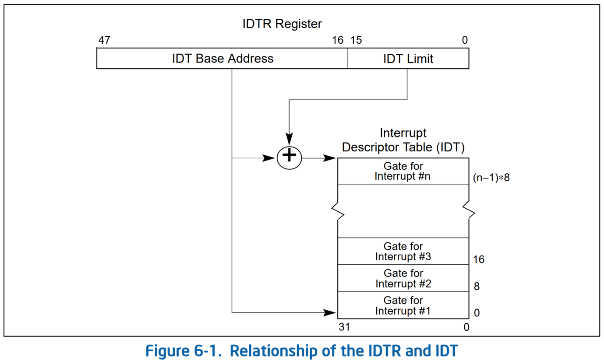
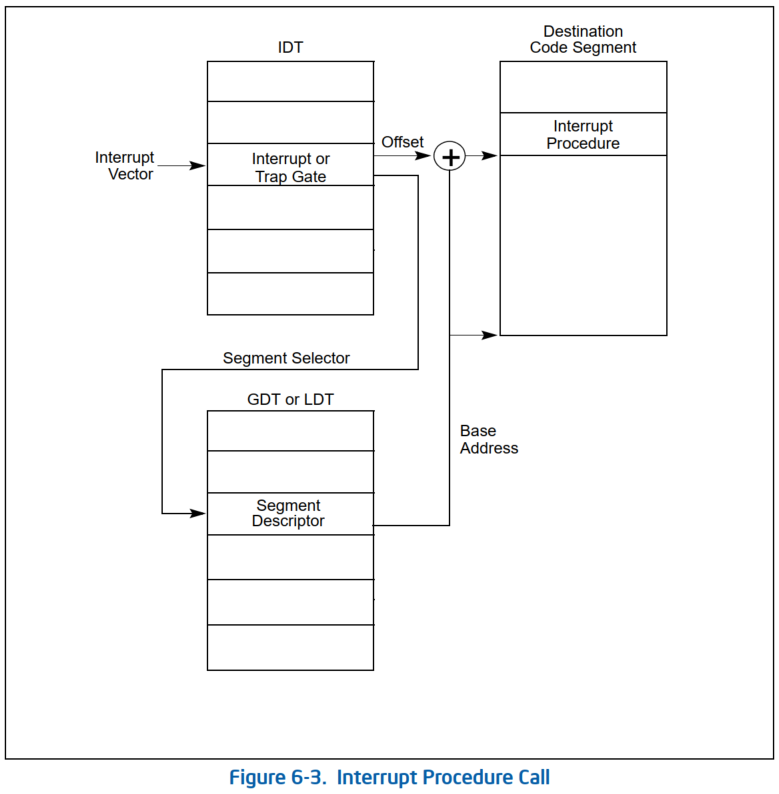
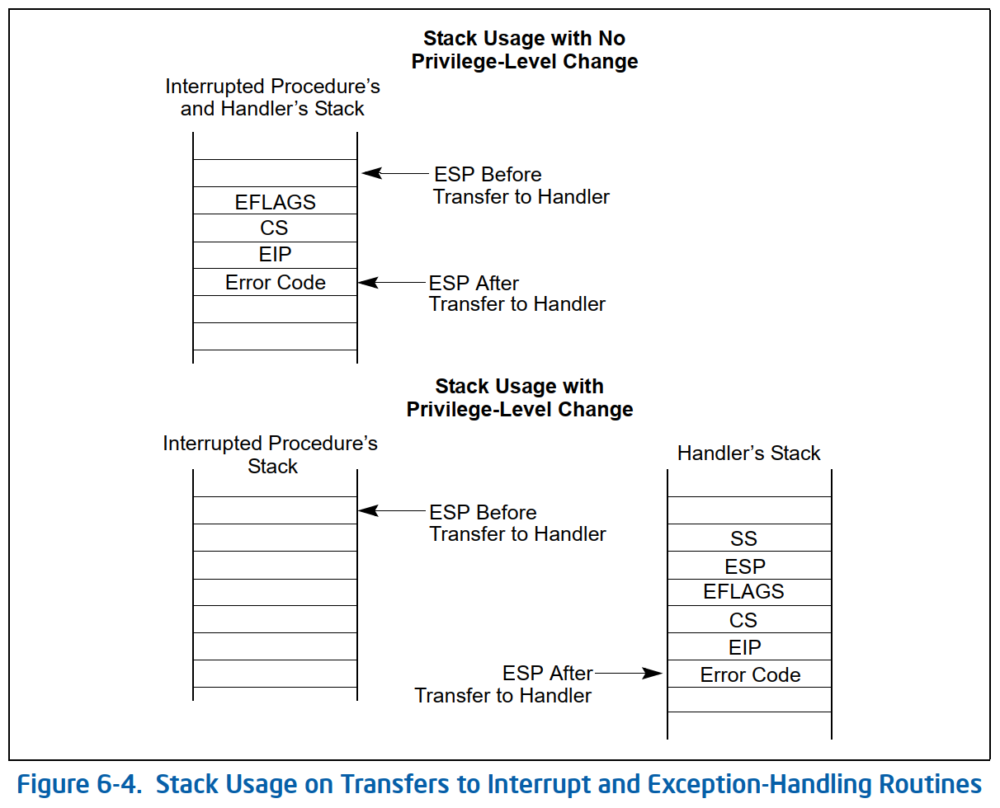

# 中断

## 中断的硬件处理流程


* 比较有意思的一点，`IRQ pending? == yes` 后回到继续递交中断的流程，可能会由于 `TPR[7:4]` > `ISRV[7:4]` 导致 `PPR[7:4]` > `ISRV[7:4]` 遇到两种情况：
1. 还未发出 `INT`，则只递交那些 *中断优先级* 高于 `PPR` 中 *处理器优先级* 的中断
2. 曾经发出过 `INT`，在 CPU 回 `INTA` 的时候才发现处理器将其 *任务优先级* 提高到大于或等于 *处理器 INTR 信号当前被 asserted 的中断优先级*，则 local APIC 将提供一个 *伪中断向量（Spurious Interrupt Vector）*

## Interrupt Descriptor Table (IDT)



* 中断描述符表 Interrupt Descriptor Table (IDT) 与每个中断和异常向量关联
* 每个表项是一个 8 字节的描述符，x86 有 256 个中断向量，因此需要 256 x 8 = 2048 字节来存储 IDT
* `idtr`寄存器允许 IDT 被加载到内存中的任何位置
  * 指定 IDT 的线性地址的基址和它的最大长度
  * 必须在开启中断前用`lidt`指令初始化
* Intel 提供的中断描述符分三种类型，用 40-43 位进行区分
  * 任务门（Task Gate）
  * 中断门（Interrupt Gate）
  * 陷阱门（Trap Gate）
  
* Linux 采用的中断描述符稍有不同：
  * 中断门（Interrupt Gate）
  * 系统门（System Gate）：
    * Intel 陷阱门
    * DPL=3
    * 关联到 4，5，128 号向量，因此`into`，`bound`，`int $0x80`指令可以在用户态使用。较新的内核这几个向量也改用系统中断门来实现了
  * 系统中断门（System Interrupt Gate）
    * Intel 中断门
    * DPL=3
    * 关联到 3 号向量，因此`int3`指令可以在用户态使用
  * 陷阱门（Trap Gate）
  * 任务门（Task Gate）

## x86的中断和异常的硬件处理



* 假设内核已经初始化并且 CPU 运行在保护模式
* 在执行完一条指令之后，`cs`和`eip`寄存器会包含将要执行的下一条指令的逻辑地址
* 在处理这条指令之前，CPU 控制单元会检查在执行上一条指令期间是否有中断或异常发生，如果有，CPU 控制单元会完成下列操作
  1. 决定中断向量 i (0 < i < 255)
  2. 根据`idtr`寄存器找到中断描述符表 IDT 的第 i 项
  3. 从`gdtr`寄存器获取到全局描述符表 GDT 的基地址，在 GDT 中，根据 IDT 条目中的选择符（selector）读取指定的段描述符（Segment Descriptor），该描述符指明了含有中断或异常 handler 的 segment 的基地址
      - 在我们熟知的段寻址中，逻辑地址的高 16 bit 作为段选择符（Segment Selector）在 GDT 中选择段描述符，而这里用的是 IDT 条目中的选择符来在 GDT 中选择段描述符
      - 含有中断或异常 handler 的 segment 应该是某一内核代码 segment
  4. 确保发出中断/异常的来源是合法的
      - 比较存储在`cs`寄存器最后两位的 Current Privilege Level (CPL) 和 GDT 表中的段描述符的 Descriptor Privilege Level (DPL)。
      - 如果 CPL 比 DPL 低，产生一个 “General protection” 的异常，因为中断处理函数的特权级不能低于比引起中断的程序的特权级。
      - 例如，**只有在硬件中断发生时，CPU 特权级提升（到 0 级）后才能跳转到去执行中断处理代码，因此不会做此检查**。而系统调用发生在用户态，因为系统调用所使用的陷阱门的 DPL=3，因此 CPL 为任何特权级的代码都可以发出系统调用。
      - 对于编程异常，作进一步的安全检查：比较 CPL 和 IDT 表中的门描述符的 DPL，如果 DPL 比 CPL 低，产生一个 “General protection” 异常。
      - 因为要跳转到的目标代码（中断代码）优先级需要高于或等于被打断的代码（比如用户态的代码）
      - 第二个检查阻止了用户应用程序通过高优先级的陷阱门或中断门，只能通过低优先级的陷阱门（系统门和系统中断门）
  5. 检查特权级是否发生了改变，即 CPL 与所选择的段描述符的 DPL 不一样，如果是的话，CPU 必须开始启用与特权级关联的新的栈，通过以下步骤：
      - 读取`tr`寄存器去访问当前正在运行的进程的 TSS segment
      - 将新特权级关联的栈段和栈指针加载到`ss`和`esp`寄存器，这些值是在 TSS segment 中找到的
      - 在新的栈中，保存之前`ss`和`esp`寄存器的值，这些值定义了旧特权级关联的栈的逻辑地址
  6. 如果缺陷已经发生了，将引起异常的指令的逻辑地址加载`cs`和`eip`，以便异常能够再次被执行
  7. 将`eflags`，`cs`，`eip`的值保存到栈上
  8. 如果异常带有硬件错误码，也将它保存到栈上
  9. 根据 IDT 第 i 项的门描述符中的 *段选择符* 和 *偏移*，将中断或异常 handler 第一条指令的逻辑地址加载地址到`cs`和`eip`

* x86-32 位模式 CPU 的异常处理对栈的使用


## 中断初始化
### Call trace
```c
start_kernel()
-> trap_init(void)
   -> setup_cpu_entry_areas() /* Init cpu_entry_area before IST entries are set up */
      -> init_cea_offsets()
      -> setup_cpu_entry_area_ptes()
         for_each_possible_cpu(cpu)
         -> setup_cpu_entry_area(cpu)
      -> sync_initial_page_table()
   -> cpu_init_exception_handling(true) /* Initialize TSS before setting up traps so ISTs work */
      -> load_current_idt()
         -> load_idt(&idt_descr) //加载 idt_descr 到 IDTR，见后面的实现
   -> idt_setup_traps() /* Setup traps as cpu_init() might #GP */
      -> idt_setup_from_table(idt_table, def_idts, ARRAY_SIZE(def_idts), true) //设置异常在 IDT 中的入口（包括使用 IST 的异常）
   -> cpu_init()
      -> load_sp0((unsigned long)(cpu_entry_stack(cpu) + 1)) //设置 TSS 的 sp0 为 Trampoline stack 的栈顶（高地址）
-> init_IRQ()
  -> x86_init.irqs.intr_init()
  => native_init_IRQ()
     -> idt_setup_apic_and_irq_gates()
        -> idt_setup_from_table(idt_table, apic_idts, ARRAY_SIZE(apic_idts), true); //设置 APIC 中断的 IDT 入口
        -> int i = FIRST_EXTERNAL_VECTOR; // 第一个外部中断向量，0x20
           for_each_clear_bit_from(i, system_vectors, FIRST_SYSTEM_VECTOR) { //设置外部中断的 IDT 入口
              entry = irq_entries_start + IDT_ALIGN * (i - FIRST_EXTERNAL_VECTOR);
              set_intr_gate(i, entry);
           }
           for_each_clear_bit_from(i, system_vectors, NR_VECTORS) { //设置伪中断的 IDT 入口
               entry = spurious_entries_start + IDT_ALIGN * (i - FIRST_SYSTEM_VECTOR);
               set_intr_gate(i, entry);
           }
        -> idt_map_in_cea(); /* Map IDT into CPU entry area and reload it. */
           -> cea_set_pte(CPU_ENTRY_AREA_RO_IDT_VADDR, __pa_symbol(idt_table), PAGE_KERNEL_RO) //建立 IDT 在 CPU entry area 映射，并且是只读的
              idt_descr.address = CPU_ENTRY_AREA_RO_IDT; //0xfffffe0000000000 将来会被加载到 IDTR
        -> load_idt(&idt_descr) //加载 idt_descr 到 IDTR，见后面的实现
        -> set_memory_ro((unsigned long)&idt_table, 1); /* Make the IDT table read only */
           idt_setup_done = true;
```
* `idt_table`为设置好内容的 **IDT 表**
* `idt_descr`为存储 IDT 表地址的指针，用`lidt`指令将它加载到`idtr`寄存器
* `def_idts[]`为通用的异常数组，`apic_idts[]`为 x86 APIC 的中断数组
  * 原来有为使用 IST 栈的异常建立的单独的 `ist_idts[]` 数组，现在合并到 `def_idts[]` 中一起设置了
* x86 通过 `native_init_IRQ()` 调用 `idt_setup_apic_and_irq_gates()` 设置好 APIC、**外部中断**、伪中断在 IDT 中的门
  * `for_each_clear_bit_from((bit, addr, size)` 宏根据 `addr = system_vectors` 位图中从第 `i` 个 bit 开始的 `size` 个 bits，如果 `bit` 为空，执行循环体
  * APIC 中断的实现见 [IPI](ipi.md)，`for_each_clear_bit_from` 只遍历 clear bit 确保 APIC 中断已占据的向量不会被后面的设置覆盖
  * 对于外部中断来说，`irq_entries_start` 就是软件在中断处理的第一段例程
    * `irq_entries_start` 见 arch/x86/include/asm/idtentry.h，里面包含一个很大的汇编宏展开 `.rept (FIRST_SYSTEM_VECTOR - FIRST_EXTERNAL_VECTOR)`
  * 对于伪中断来说，`spurious_entries_start` 就是软件在中断处理的第一段例程
    * `spurious_entries_start` 同样也是汇编宏展开 `.rept (NR_VECTORS - FIRST_SYSTEM_VECTOR)`
    * `spurious_entries_start` 的每个条目都会 `jmp asm_spurious_interrupt`，这个汇编函数通过 `DEFINE_IDTENTRY_IRQ(spurious_interrupt)` 实现，它会调用 arch/x86/kernel/apic/apic.c::`handle_spurious_interrupt(vector)`

### `def_idts[]`数组
* `struct gate_struct`对应到 Intel IDT 的表项，存储格式见上面图示，注意，中断处理函数的地址不是连续存储的，而是被`offset_low`，`offset_middle`，`offset_high`分成三个部分
  * arch/x86/include/asm/desc_defs.h
  ```cpp
  enum {  //对应到表示门描述符类型的 40-43 位
          GATE_INTERRUPT = 0xE,
          GATE_TRAP = 0xF,
          GATE_CALL = 0xC,
          GATE_TASK = 0x5,
  };
  ...
  struct idt_bits {
          u16             ist     : 3, //32-34 位，interrupt stack table 索引
                          zero    : 5, //35-39 位为 0
                          type    : 5, //40-43 位为门描述符类型，44 为 0
                          dpl     : 2, //45-46 位为门描述符 DPL
                          p       : 1; //47 位为 P
  } __attribute__((packed));

  struct gate_struct {
          u16             offset_low; //0~15 位为 Offset(0-15)
          u16             segment;    //16~31 位为段选择符
          struct idt_bits bits;       //32-47 位为门描述符 bit 位，见 struct idt_bits
          u16             offset_middle; //48-63 位为 Offset(16-31)
  #ifdef CONFIG_X86_64
          u32             offset_high; //64 位的高 32 位， Offset(32-63)
          u32             reserved;
  #endif
  } __attribute__((packed));

  typedef struct gate_struct gate_desc;
  ```
* 0~32 号异常的枚举定义
  * arch/x86/include/asm/traps.h
  ```c
  /* Interrupts/Exceptions */
  #define X86_TRAP_DE              0      /* Divide-by-zero */
  #define X86_TRAP_DB              1      /* Debug */
  #define X86_TRAP_NMI             2      /* Non-maskable Interrupt */
  #define X86_TRAP_BP              3      /* Breakpoint */
  #define X86_TRAP_OF              4      /* Overflow */
  #define X86_TRAP_BR              5      /* Bound Range Exceeded */
  #define X86_TRAP_UD              6      /* Invalid Opcode */
  #define X86_TRAP_NM              7      /* Device Not Available */
  #define X86_TRAP_DF              8      /* Double Fault */
  #define X86_TRAP_OLD_MF          9      /* Coprocessor Segment Overrun */
  #define X86_TRAP_TS             10      /* Invalid TSS */
  #define X86_TRAP_NP             11      /* Segment Not Present */
  #define X86_TRAP_SS             12      /* Stack Segment Fault */
  #define X86_TRAP_GP             13      /* General Protection Fault */
  #define X86_TRAP_PF             14      /* Page Fault */
  #define X86_TRAP_SPURIOUS       15      /* Spurious Interrupt */
  #define X86_TRAP_MF             16      /* x87 Floating-Point Exception */
  #define X86_TRAP_AC             17      /* Alignment Check */
  #define X86_TRAP_MC             18      /* Machine Check */
  #define X86_TRAP_XF             19      /* SIMD Floating-Point Exception */
  #define X86_TRAP_VE             20      /* Virtualization Exception */
  #define X86_TRAP_CP             21      /* Control Protection Exception */
  #define X86_TRAP_VC             29      /* VMM Communication Exception */
  #define X86_TRAP_IRET           32      /* IRET Exception */
  ```
* `def_idts[]`数组存储的 Linux 中断向量与中断处理函数的对应关系，这与 Intel IDT 表`idt_table[]`是不同的，尤其是 Intel IDT 表项中存的是 **段选择符** 和 **偏移**，因此需要在`idt_init_desc()`函数中进行格式转换
* **注意**：现在内核已经不再使用 Intel 陷阱门（包括基于它的陷阱门和系统门）作为异常处理的门类型了，统一改为用中断门（和系统中断门）来处理异常，这也意味着异常处理从入口点开始中断也是关闭的（`RFLAGS.IF == 0`）
* arch/x86/kernel/idt.c
  ```c
  struct idt_data {
          unsigned int    vector;
          unsigned int    segment;
          struct idt_bits bits;
          const void      *addr;
  };

  #define DPL0            0x0
  #define DPL3            0x3

  #define DEFAULT_STACK   0

  #define G(_vector, _addr, _ist, _type, _dpl, _segment)  \
          {                                               \
                  .vector         = _vector,              \
                  .bits.ist       = _ist,                 \
                  .bits.type      = _type,                \
                  .bits.dpl       = _dpl,                 \
                  .bits.p         = 1,                    \
                  .addr           = _addr,                \
                  .segment        = _segment,             \
          }
  //中断门，经过门后中断会关闭，DLP = 0
  /* Interrupt gate */
  #define INTG(_vector, _addr)                            \
          G(_vector, _addr, DEFAULT_STACK, GATE_INTERRUPT, DPL0, __KERNEL_CS)
  //系统中断门，经过门后中断会关闭，DLP = 3，用于实现用户态可以发起的异常
  /* System interrupt gate */
  #define SYSG(_vector, _addr)                            \
          G(_vector, _addr, DEFAULT_STACK, GATE_INTERRUPT, DPL3, __KERNEL_CS)
  //使用 IST 栈的中断门，经过门后中断会关闭，DLP = 0，由于使用 IST 栈，所以 IST 栈索引必须从 1 开始
  #ifdef CONFIG_X86_64
  /*
   * Interrupt gate with interrupt stack. The _ist index is the index in
   * the tss.ist[] array, but for the descriptor it needs to start at 1.
   */
  #define ISTG(_vector, _addr, _ist)                      \
          G(_vector, _addr, _ist + 1, GATE_INTERRUPT, DPL0, __KERNEL_CS)
  #else
  #define ISTG(_vector, _addr, _ist)      INTG(_vector, _addr)
  #endif
  //任务门
  /* Task gate */
  #define TSKG(_vector, _gdt)                             \
          G(_vector, NULL, DEFAULT_STACK, GATE_TASK, DPL0, _gdt << 3)
  ...
  /*
   * The default IDT entries which are set up in trap_init() before
   * cpu_init() is invoked. Interrupt stacks cannot be used at that point and
   * the traps which use them are reinitialized with IST after cpu_init() has
   * set up TSS.
   */
  static const __initconst struct idt_data def_idts[] = {
          INTG(X86_TRAP_DE,               asm_exc_divide_error),
          ISTG(X86_TRAP_NMI,              asm_exc_nmi, IST_INDEX_NMI), //#NMI 使用 IST 栈的中断门
          INTG(X86_TRAP_BR,               asm_exc_bounds),
          INTG(X86_TRAP_UD,               asm_exc_invalid_op),
          INTG(X86_TRAP_NM,               asm_exc_device_not_available),
          INTG(X86_TRAP_OLD_MF,           asm_exc_coproc_segment_overrun),
          INTG(X86_TRAP_TS,               asm_exc_invalid_tss),
          INTG(X86_TRAP_NP,               asm_exc_segment_not_present),
          INTG(X86_TRAP_SS,               asm_exc_stack_segment),
          INTG(X86_TRAP_GP,               asm_exc_general_protection),
          INTG(X86_TRAP_SPURIOUS,         asm_exc_spurious_interrupt_bug),
          INTG(X86_TRAP_MF,               asm_exc_coprocessor_error),
          INTG(X86_TRAP_AC,               asm_exc_alignment_check),
          INTG(X86_TRAP_XF,               asm_exc_simd_coprocessor_error),

  #ifdef CONFIG_X86_32
          TSKG(X86_TRAP_DF,               GDT_ENTRY_DOUBLEFAULT_TSS), //32 位的 #DF 使用任务门
  #else
          ISTG(X86_TRAP_DF,               asm_exc_double_fault, IST_INDEX_DF),//#DF 使用 IST 栈的中断门
  #endif
          ISTG(X86_TRAP_DB,               asm_exc_debug, IST_INDEX_DB), //#DB 使用 IST 栈的中断门

  #ifdef CONFIG_X86_MCE
          ISTG(X86_TRAP_MC,               asm_exc_machine_check, IST_INDEX_MCE), //#MC 使用 IST 栈的中断门
  #endif

  #ifdef CONFIG_X86_CET
          INTG(X86_TRAP_CP,               asm_exc_control_protection),
  #endif

  #ifdef CONFIG_AMD_MEM_ENCRYPT
          ISTG(X86_TRAP_VC,               asm_exc_vmm_communication, IST_INDEX_VC),
  #endif
          //#OF 用的是系统门
          SYSG(X86_TRAP_OF,               asm_exc_overflow),
  };
  //32 位系统用 int 0x80 发起系统调用，用的是系统中断门
  static const struct idt_data ia32_idt[] __initconst = {
  #if defined(CONFIG_IA32_EMULATION)
          SYSG(IA32_SYSCALL_VECTOR,       asm_int80_emulation),
  #elif defined(CONFIG_X86_32)
          SYSG(IA32_SYSCALL_VECTOR,       entry_INT80_32),
  #endif
  };
  ```
* 例如，对于`X86_TRAP_NMI`，即 IDT 数组`def_idts[]`的第二个元素
  ```cpp
  struct idt_data def_idts[1] =
  {
          .vector         = X86_TRAP_NMI,   //第二号中断向量
          .bits.ist       = IST_INDEX_NMI + 1,  //用于中断栈表的索引
          .bits.type      = GATE_INTERRUPT, //门描述符的 40-43 位
          .bits.dpl       = DPL0,           //门描述符的 45~46 位
          .bits.p         = 1,              //门描述符的 47 位
          .addr           = asm_exc_nmi,
          .segment        = __KERNEL_CS,
  }
  ```
* 其中，`X86_TRAP_NMI`向量的中断处理函数的入口地址为`asm_exc_nmi`，例如在 x86-64 中的定义见`arch/x86/entry/entry_64.S`中的`SYM_CODE_START(asm_exc_nmi)`
  * 该中断处理函数的入口地址会在`idt_init_desc()`函数中被分为`offset_low`（16 bit）、`offset_middle`（16 bit）、`offset_high`（32 bit）三段存储
* 还有一些异常向量的入口函数可能会采用其他风格实现，例如用 `DECLARE_IDTENTRY_RAW(X86_TRAP_UD, exc_invalid_op)` 声明一个 IDT 入口条目：
  * arch/x86/include/asm/idtentry.h
  ```c
  #ifndef __ASSEMBLER__
  ...
  #else /* !__ASSEMBLER__ */
  ...
  #define DECLARE_IDTENTRY(vector, func)                                  \
          idtentry vector asm_##func func has_error_code=0
  ...
  #define DECLARE_IDTENTRY_RAW(vector, func)                              \
          DECLARE_IDTENTRY(vector, func)
  ...
  #endif /* __ASSEMBLER__ */
  
  DECLARE_IDTENTRY_RAW(X86_TRAP_UD, exc_invalid_op);
  ```
* 宏展开为 `idtentry vector asm_exc_invalid_op func has_error_code=0`，这个宏会被汇编器编译时根据汇编宏 `.macro idtentry` 和展开成为对函数 `asm_exc_invalid_op` 的调用，这个地址也是填入到 IDT entry 的地址
  * arch/x86/entry/entry_64.S
  ```c
  .macro idtentry vector asmsym cfunc has_error_code:req
  SYM_CODE_START(\asmsym)
  ...
          idtentry_body \cfunc \has_error_code
  ...
  SYM_CODE_END(\asmsym)
  .endm
  ```
* 而汇编宏 `.macro idtentry_body` 会展开成对 C 函数 `exc_invalid_op()` 的调用，arch/x86/kernel/traps.c::`DEFINE_IDTENTRY_RAW(exc_invalid_op)` 实现了对该函数的定义

### x86 填充 Intel IDT 表的实现
* 以下是这个过程中涉及的一些最底层的函数
  * arch/x86/include/asm/desc.h
  ```c
  #ifdef CONFIG_PARAVIRT
  #include <asm/paravirt.h>
  #else
  #define load_TR_desc()                          native_load_tr_desc()
  ...
  #define load_idt(dtr)                           native_load_idt(dtr)
  #define load_tr(tr)                             asm volatile("ltr %0"::"m" (tr))
  ...
  #define store_tr(tr)                            (tr = native_store_tr())

  #define load_TLS(t, cpu)                        native_load_tls(t, cpu)
  ...
  #define write_idt_entry(dt, entry, g)           native_write_idt_entry(dt, entry, g)
  ...
  #endif  /* CONFIG_PARAVIRT */
  ...
  static inline void native_write_idt_entry(gate_desc *idt, int entry, const gate_desc *gate)
  {
          memcpy(&idt[entry], gate, sizeof(*gate));
  }
  ```
* `idt_descr` 初始值为 `idt_table[]` 的起始地址，在 `trap_init()` 中会被改写为 CPU Entry Area 的起始地址 `CPU_ENTRY_AREA_RO_IDT = 0xfffffe0000000000`
  * 关于 CPU Entry Area 更多内容请阅读 [内核中的栈 - x86-64](stack_x86-64.md)
  * arch/x86/kernel/idt.c
  ```cpp
  /* Must be page-aligned because the real IDT is used in a fixmap. */
  gate_desc idt_table[IDT_ENTRIES] __page_aligned_bss;

  struct desc_ptr idt_descr __ro_after_init = {
          .size           = (IDT_ENTRIES * 2 * sizeof(unsigned long)) - 1,
          .address        = (unsigned long) idt_table,
  };

  static inline void idt_init_desc(gate_desc *gate, const struct idt_data *d)
  {
          unsigned long addr = (unsigned long) d->addr;

          gate->offset_low        = (u16) addr;
          gate->segment           = (u16) d->segment;
          gate->bits              = d->bits;
          gate->offset_middle     = (u16) (addr >> 16);
  #ifdef CONFIG_X86_64
          gate->offset_high       = (u32) (addr >> 32);
          gate->reserved          = 0;
  #endif
  }

  static void
  idt_setup_from_table(gate_desc *idt, const struct idt_data *t, int size, bool sys)
  {
          gate_desc desc;

          for (; size > 0; t++, size--) {
                  idt_init_desc(&desc, t); //格式转换，转为 Intel IDT 表项要求的格式
                  write_idt_entry(idt, t->vector, &desc);
                  if (sys)
                          set_bit(t->vector, system_vectors);
          }
  }

  /**
   * idt_setup_traps - Initialize the idt table with default traps
   */
  void __init idt_setup_traps(void)
  {   //idt_table 是要填入的 Intel IDT 表，def_idts 是我们要提供的输入
      idt_setup_from_table(idt_table, def_idts, ARRAY_SIZE(def_idts), true);
  }
  ```
* 数组`def_idts[]`中的向量都会在`system_vectors`位图中设置相应的位
  * arch/x86/kernel/traps.c
  ```cpp
  DECLARE_BITMAP(system_vectors, NR_VECTORS);
  ```
* `__ro_after_init` 利用编译器属性将用它声明的变量放入一个名为 `.data..ro_after_init` section，定义如下：
  * include/linux/cache.h
  ```cpp
  /*
   * __ro_after_init is used to mark things that are read-only after init (i.e.
   * after mark_rodata_ro() has been called). These are effectively read-only,
   * but may get written to during init, so can't live in .rodata (via "const").
   */
  #ifndef __ro_after_init
  #define __ro_after_init __attribute__((__section__(".data..ro_after_init")))
  #endif
  ```
* 这个 section 中的变量在 kernel init 期间可以写，但 init 完成后会被 `mark_rodata_ro()` 函数将存储这些变量的页面的映射方式改为“read-only”，阻止 init 后对这些变量的修改。

### 加载 IDT
* 加载到 `IDTR` 寄存器中的 IDT 的虚拟地址其实是 CPU Entry Area 的起始地址 `CPU_ENTRY_AREA_RO_IDT = 0xfffffe0000000000` 而不是 `idt_table[]` 的虚拟地址
  * arch/x86/include/asm/pgtable_64_types.h
  ```c
  /*
   * 4th level page in 5-level paging case
   */
  #define P4D_SHIFT       39
  ...
  #define CPU_ENTRY_AREA_PGD      _AC(-4, UL) //0xfffffffffffffffc
  #define CPU_ENTRY_AREA_BASE     (CPU_ENTRY_AREA_PGD << P4D_SHIFT) //0xfffffe0000000000
  ```
  * arch/x86/include/asm/cpu_entry_area.h
  ```c
  #define CPU_ENTRY_AREA_RO_IDT       CPU_ENTRY_AREA_BASE //0xfffffe0000000000
  #define CPU_ENTRY_AREA_PER_CPU      (CPU_ENTRY_AREA_RO_IDT + PAGE_SIZE) //0xfffffe0000001000

  #define CPU_ENTRY_AREA_RO_IDT_VADDR ((void *)CPU_ENTRY_AREA_RO_IDT) //0xfffffe0000000000
  ```
* `cea_set_pte()`用于给某个虚拟地址填充页表项
  * `pa >> PAGE_SHIFT` 得到物理地址所在的 Page Frame Number
  * `pfn_pte(unsigned long page_nr, pgprot_t pgprot)` 根据输入的 Page Frame Number 和 Page Flags 转为 `pte_t` 类型的值（`.val`当然是物理地址）
  * `set_pte_vaddr(unsigned long vaddr, pte_t pteval)` 会根据输入的虚拟地址层层往下直至找到 PTE，把值设为传入的`pte_t pteval`
  * arch/x86/mm/cpu_entry_area.c
  ```cpp
  void cea_set_pte(void *cea_vaddr, phys_addr_t pa, pgprot_t flags)
  {
          unsigned long va = (unsigned long) cea_vaddr;

          set_pte_vaddr(va, pfn_pte(pa >> PAGE_SHIFT, flags));
  }
  ```
* `load_idt()`在非半虚拟化分支就是`native_load_idt()`，定义见之前的代码
* `native_load_idt()`用`lidt`指令将`&idt_descr`加载到`idtr`寄存器
  * arch/x86/include/asm/desc.h
  ```cpp
  static inline void native_load_idt(const struct desc_ptr *dtr)
  {
          asm volatile("lidt %0"::"m" (*dtr));
  }
  ...
  /*
   * The load_current_idt() must be called with interrupts disabled
   * to avoid races. That way the IDT will always be set back to the expected
   * descriptor. It's also called when a CPU is being initialized, and
   * that doesn't need to disable interrupts, as nothing should be
   * bothering the CPU then.
   */
  static inline void load_current_idt(void)
  {
          if (is_debug_idt_enabled())
                  load_debug_idt();
          else
                  load_idt((const struct desc_ptr *)&idt_descr);
  }
  ```
  * arch/x86/kernel/traps.c
  ```cpp
  void __init trap_init(void)
  {
        /* Init cpu_entry_area before IST entries are set up */
        setup_cpu_entry_areas();

        /* Init GHCB memory pages when running as an SEV-ES guest */
        sev_es_init_vc_handling();

        /* Initialize TSS before setting up traps so ISTs work */
        cpu_init_exception_handling(true);

        /* Setup traps as cpu_init() might #GP */
        if (!cpu_feature_enabled(X86_FEATURE_FRED))
                idt_setup_traps();

        cpu_init();
  }
  ```

## x86 的中断入口的实现
### 几个相关的数组
#### irq_desc数组/radix tree
* 中断请求描述符`struct irq_desc`用于记录各个中断事件的处理方法和未处理事件
* 注意：不要与硬件分发中用到的“中断描述符表”（IDT）相混淆 —— 那是与不同中断向量入口地址相关的
* `struct irq_desc`定义见 include/linux/irqdesc.h
* `struct irq_desc irq_desc[NR_IRQS]`数组的初值
  - 索引是中断向量，值是`struct irq_desc`实例
  - kernel/irq/irqdesc.c
  ```cpp
  struct irq_desc irq_desc[NR_IRQS] __cacheline_aligned_in_smp = {
          [0 ... NR_IRQS-1] = {
                  .handle_irq     = handle_bad_irq,
                  .depth          = 1,
                  .lock           = __RAW_SPIN_LOCK_UNLOCKED(irq_desc->lock),
          }
  };
  ```
#### vector_irq
* `vector_irq`则是 per-CPU 的存储指向`struct irq_desc`实例的指针
* 声明
  - arch/x86/include/asm/hw_irq.h
  ```cpp
  typedef struct irq_desc* vector_irq_t[NR_VECTORS];
  DECLARE_PER_CPU(vector_irq_t, vector_irq);
  ```
* 初值
  - arch/x86/kernel/irqinit.c
  ```cpp
  DEFINE_PER_CPU(vector_irq_t, vector_irq) = {
          [0 ... NR_VECTORS - 1] = VECTOR_UNUSED,
  };
  ```

### 旧的到中断通用入口 `common_interrupt` 的实现
#### Call Trace
```cpp
irq_entries_start
-> jmp common_interrupt
   -> interrupt do_IRQ
      -> call \func
      => call do_IRQ()
```
* `struct pt_regs`结构体的定义见`arch/x86/include/uapi/asm/ptrace.h`
* Per-CPU 的`struct pt_regs`类型的`irq_regs`变量用于保存被中断时的寄存器的值。
  * 这些值是在调用`do_IRQ()`前在汇编入口例程中保存的。
* arch/x86/include/asm/irq_regs.h
  ```cpp
  DECLARE_PER_CPU(struct pt_regs *, irq_regs);

  static inline struct pt_regs *get_irq_regs(void)
  {
          return this_cpu_read(irq_regs);
  }

  static inline struct pt_regs *set_irq_regs(struct pt_regs *new_regs)
  {
          struct pt_regs *old_regs;
          /*被中断进程的寄存器的值的地址存入old_regs，irq_regs写入新的值*/
          old_regs = get_irq_regs();
          this_cpu_write(irq_regs, new_regs);
          /*该函数返回存旧寄存器值的地址*/
          return old_regs;
  }
  ```
* include/linux/irqdesc.h
  ```cpp
  /*
   * Architectures call this to let the generic IRQ layer
   * handle an interrupt.
   */
  static inline void generic_handle_irq_desc(struct irq_desc *desc)
  {       // 调用 handle_level_irq() 或者 handle_edge_irq() 类似的函数
          desc->handle_irq(desc);
  }
  ```
* arch/x86/kernel/irq.c
  ```cpp
  /*
   * do_IRQ handles all normal device IRQ's (the special
   * SMP cross-CPU interrupts have their own specific
   * handlers).
   */
  __visible unsigned int __irq_entry do_IRQ(struct pt_regs *regs)
  {
          struct pt_regs *old_regs = set_irq_regs(regs);
          struct irq_desc * desc;
          /* high bit used in ret_from_ code  */
          unsigned vector = ~regs->orig_ax;

          entering_irq();

          /* entering_irq() tells RCU that we're not quiescent.  Check it. */
          RCU_LOCKDEP_WARN(!rcu_is_watching(), "IRQ failed to wake up RCU");
          /*根据中断向量读取中断描述符*/
          desc = __this_cpu_read(vector_irq[vector]);
          if (likely(!IS_ERR_OR_NULL(desc))) {
                  if (IS_ENABLED(CONFIG_X86_32))
                          handle_irq(desc, regs);
                  else
                          generic_handle_irq_desc(desc); //调用中断描述符对应的中断处理函数
          } else {
                  ack_APIC_irq();

                  if (desc == VECTOR_UNUSED) {
                          pr_emerg_ratelimited("%s: %d.%d No irq handler for vector\n",
                                               __func__, smp_processor_id(),
                                               vector);
                  } else {
                          __this_cpu_write(vector_irq[vector], VECTOR_UNUSED);
                  }
          }

          exiting_irq();

          set_irq_regs(old_regs);
          return 1;
  }
  ```
* arch/x86/entry/entry_64.S
  ```cpp
  /*
   * Build the entry stubs with some assembler magic.
   * We pack 1 stub into every 8-byte block.
   */
          .align 8
  ENTRY(irq_entries_start)
      vector=FIRST_EXTERNAL_VECTOR
      .rept (FIRST_SYSTEM_VECTOR - FIRST_EXTERNAL_VECTOR)
          pushq   $(~vector+0x80)                 /* Note: always in signed byte range */
      vector=vector+1
          jmp     common_interrupt  /*跳转至x86通用的汇编中断处理*/
          .align  8
      .endr
  END(irq_entries_start)

  /*
   * Interrupt entry/exit.
   *
   * Interrupt entry points save only callee clobbered registers in fast path.
   *
   * Entry runs with interrupts off.
   */

  /* 0(%rsp): ~(interrupt number) */
          .macro interrupt func
          cld
          ALLOC_PT_GPREGS_ON_STACK
          SAVE_C_REGS
          SAVE_EXTRA_REGS
          ENCODE_FRAME_POINTER

          testb   $3, CS(%rsp)
          jz      1f

          /*
           * IRQ from user mode.  Switch to kernel gsbase and inform context
           * tracking that we're in kernel mode.
           */
          SWAPGS

          /*
           * We need to tell lockdep that IRQs are off.  We can't do this until
           * we fix gsbase, and we should do it before enter_from_user_mode
           * (which can take locks).  Since TRACE_IRQS_OFF idempotent,
           * the simplest way to handle it is to just call it twice if
           * we enter from user mode.  There's no reason to optimize this since
           * TRACE_IRQS_OFF is a no-op if lockdep is off.
           */
          TRACE_IRQS_OFF

          CALL_enter_from_user_mode

  1:
          /*
           * Save previous stack pointer, optionally switch to interrupt stack.
           * irq_count is used to check if a CPU is already on an interrupt stack
           * or not. While this is essentially redundant with preempt_count it is
           * a little cheaper to use a separate counter in the PDA (short of
           * moving irq_enter into assembly, which would be too much work)
           */
          movq    %rsp, %rdi
          incl    PER_CPU_VAR(irq_count)
          cmovzq  PER_CPU_VAR(irq_stack_ptr), %rsp /* 中断栈的切换是由内核完成的 */
          pushq   %rdi
          /* We entered an interrupt context - irqs are off: */
          TRACE_IRQS_OFF
          /*跳转至x86通用的 C 中断处理，在上面列出了*/
          call    \func   /* rdi points to pt_regs */
          .endm

          /*
           * The interrupt stubs push (~vector+0x80) onto the stack and
           * then jump to common_interrupt.
           */
          .p2align CONFIG_X86_L1_CACHE_SHIFT
  common_interrupt:
          ASM_CLAC
          addq    $-0x80, (%rsp)                  /* Adjust vector to [-256, -1] range */
          interrupt do_IRQ       /*上面列出的 .macro interrupt 汇编宏在此处展开*/
          /* 0(%rsp): old RSP */
  ret_from_intr:                 /*注意，这里是连着的，do_IRQ 返回后会接着执行后面的指令*/
          DISABLE_INTERRUPTS(CLBR_ANY)
          TRACE_IRQS_OFF
          decl    PER_CPU_VAR(irq_count)

          /* Restore saved previous stack */
          popq    %rsp          /*将之前存在栈上的前一个栈的栈指针弹出，放到栈指针寄存器*/

          testb   $3, CS(%rsp)  /*CS 为宏 17*8，即根据栈指针寄存器的值做偏移运算，在栈中找到被打断的上下文原 %cs 寄存器的值，判断中断是该返回到 user space 还是 kernel space*/
          jz      retint_kernel

          /* Interrupt came from user space */
  GLOBAL(retint_user)
          mov     %rsp,%rdi
          call    prepare_exit_to_usermode
          TRACE_IRQS_IRETQ
          SWAPGS
          jmp     restore_regs_and_iret

  /* Returning to kernel space */
  retint_kernel:
  #ifdef CONFIG_PREEMPT
          /* Interrupts are off */
          /* Check if we need preemption */
          bt      $9, EFLAGS(%rsp)                /* were interrupts off? */ /*测试 EFLAGS 的 bit 9，即 IF 的值存入 CF*/
          jnc     1f  /*检查 CF 即检查 IF，中断是否关闭。如果 CF=0，表示中断关闭，则前跳至 1，不抢占；否则往下执行*/
  0:      cmpl    $0, PER_CPU_VAR(__preempt_count) /*读取抢占计数，看能否进行内核抢占*/
          jnz     1f                    /*如果抢占计数不为 0，通过跳转到 lable 1 返回原执行点*/
          call    preempt_schedule_irq  /*如果抢占计数为 0，触发内核抢占，这里是内核抢占的一个点*/
          jmp     0b   /* preempt_schedule_irq 返回后再次跳回 label 0 检查抢占计数 */
  1:
  #endif
          /*
           * The iretq could re-enable interrupts:
           */
          TRACE_IRQS_IRETQ
  ```

### 新的到中断通用入口 `common_interrupt` 的实现
* `irq_entries_start` 的实现有所不同，跳转到通用中断入口 `asm_common_interrupt`
* arch/x86/include/asm/idtentry.h
```cpp
/*
 * ASM code to emit the common vector entry stubs where each stub is
 * packed into IDT_ALIGN bytes.
 *
 * Note, that the 'pushq imm8' is emitted via '.byte 0x6a, vector' because
 * GCC treats the local vector variable as unsigned int and would expand
 * all vectors above 0x7F to a 5 byte push. The original code did an
 * adjustment of the vector number to be in the signed byte range to avoid
 * this. While clever it's mindboggling counterintuitive and requires the
 * odd conversion back to a real vector number in the C entry points. Using
 * .byte achieves the same thing and the only fixup needed in the C entry
 * point is to mask off the bits above bit 7 because the push is sign
 * extending.
 */
    .align IDT_ALIGN
SYM_CODE_START(irq_entries_start)
    vector=FIRST_EXTERNAL_VECTOR
    .rept NR_EXTERNAL_VECTORS //重复以下汇编代码 NR_EXTERNAL_VECTORS 次
    UNWIND_HINT_IRET_REGS
0 :
    ENDBR                     //插入 CET/IBT 防护相关的 endbr 指令
    .byte   0x6a, vector      //pushq 立即数 vector 指令，占据了原本 error code 的位置
    jmp asm_common_interrupt
    /* Ensure that the above is IDT_ALIGN bytes max */
    .fill 0b + IDT_ALIGN - ., 1, 0xcc //填充一堆 int3 指令
    vector = vector+1
    .endr                     //结束重复
SYM_CODE_END(irq_entries_start)
...
#define DECLARE_IDTENTRY_ERRORCODE(vector, func)            \
    idtentry vector asm_##func func has_error_code=1
...
/**
 * DECLARE_IDTENTRY_IRQ - Declare functions for device interrupt IDT entry
 *            points (common/spurious)
 * @vector: Vector number (ignored for C)
 * @func:   Function name of the entry point
 *
 * Maps to DECLARE_IDTENTRY_ERRORCODE()
 */
#define DECLARE_IDTENTRY_IRQ(vector, func)              \
    DECLARE_IDTENTRY_ERRORCODE(vector, func)
...
/* Entries for common/spurious (device) interrupts */
#define DECLARE_IDTENTRY_IRQ(vector, func)              \
    idtentry_irq vector func
...
/* Device interrupts common/spurious */
DECLARE_IDTENTRY_IRQ(X86_TRAP_OTHER,    common_interrupt);
```
* `X86_TRAP_OTHER` 是一个值为 `0xFFFF` 的 dummy 异常向量，因此低级 ASM 宏向量号检查不匹配，从而导致发出没有花哨功能的普通 `IDTENTRY` stub。这里声明了通用的中断处理函数 `common_interrupt()`
* `asm_common_interrupt` 由 arch/x86/entry/entry_64.S::`idtentry -> idtentry_body` 汇编宏生成，最终会调用 `common_interrupt()`
* 发生外部中断时，CPU 并没有把中断向量保存在任何寄存器，作为外部中断的通用实现的 `common_interrupt()` 是怎么得到中断向量 `vector` 的？
  * **注意**：外部中断产生时 CPU 不会压入 error code，而是借助编译时期 `pushq vector` 指令压入的汇编宏产生的硬编码的向量值（这个值对于每段 interrupt stub 是不同的）占据了原本 error code 的位置，这个值在 `.macro idtentry_body` 宏会被传入到 `%rsi`，作为第二个参数，即 `vector` 传给 `common_interrupt()`
* arch/x86/kernel/irq.c
```cpp
/*
 * common_interrupt() handles all normal device IRQ's (the special SMP
 * cross-CPU interrupts have their own entry points).
 */
DEFINE_IDTENTRY_IRQ(common_interrupt)
{
    struct pt_regs *old_regs = set_irq_regs(regs);
    struct irq_desc *desc;

    /* entry code tells RCU that we're not quiescent.  Check it. */
    RCU_LOCKDEP_WARN(!rcu_is_watching(), "IRQ failed to wake up RCU");

    desc = __this_cpu_read(vector_irq[vector]);
    if (likely(!IS_ERR_OR_NULL(desc))) {
        handle_irq(desc, regs);
    } else {
        apic_eoi();

        if (desc == VECTOR_UNUSED) {
            pr_emerg_ratelimited("%s: %d.%u No irq handler for vector\n",
                         __func__, smp_processor_id(),
                         vector);
        } else {
            __this_cpu_write(vector_irq[vector], VECTOR_UNUSED);
        }
    }

    set_irq_regs(old_regs);
}
```
* 上面看到的 `common_interrupt()` 其实是 `__common_interrupt()`，真正的 `common_interrupt()` 其实是由 `DEFINE_IDTENTRY_IRQ` 宏生成的
```cpp
/**
 * DEFINE_IDTENTRY_IRQ - Emit code for device interrupt IDT entry points
 * @func:   Function name of the entry point
 *
 * The vector number is pushed by the low level entry stub and handed
 * to the function as error_code argument which needs to be truncated
 * to an u8 because the push is sign extending.
 *
 * irq_enter/exit_rcu() are invoked before the function body and the
 * KVM L1D flush request is set. Stack switching to the interrupt stack
 * has to be done in the function body if necessary.
 */
#define DEFINE_IDTENTRY_IRQ(func)                   \
static void __##func(struct pt_regs *regs, u32 vector);         \
                                    \
__visible noinstr void func(struct pt_regs *regs,           \
                unsigned long error_code)           \
{                                   \
    irqentry_state_t state = irqentry_enter(regs);          \
    u32 vector = (u32)(u8)error_code;               \
                                    \
    instrumentation_begin();                    \
    kvm_set_cpu_l1tf_flush_l1d();                   \
    run_irq_on_irqstack_cond(__##func, regs, vector);       \
    instrumentation_end();                      \
    irqentry_exit(regs, state);                 \
}                                   \
                                    \
static noinline void __##func(struct pt_regs *regs, u32 vector)
```
* `common_interrupt()` 的最后会调用 C 函数 `irqentry_exit()` 完成旧的汇编代码实现的大部分功能，包括中断处理完成后的内核抢占点
  * kernel/entry/common.c
```cpp
void raw_irqentry_exit_cond_resched(void)
{
    if (!preempt_count()) {
        /* Sanity check RCU and thread stack */
        rcu_irq_exit_check_preempt();
        if (IS_ENABLED(CONFIG_DEBUG_ENTRY))
            WARN_ON_ONCE(!on_thread_stack());
        if (need_resched())
            preempt_schedule_irq();
    }
}
#ifdef CONFIG_PREEMPT_DYNAMIC
#if defined(CONFIG_HAVE_PREEMPT_DYNAMIC_CALL)
DEFINE_STATIC_CALL(irqentry_exit_cond_resched, raw_irqentry_exit_cond_resched);
#elif defined(CONFIG_HAVE_PREEMPT_DYNAMIC_KEY)
DEFINE_STATIC_KEY_TRUE(sk_dynamic_irqentry_exit_cond_resched);
void dynamic_irqentry_exit_cond_resched(void)
{
    if (!static_branch_unlikely(&sk_dynamic_irqentry_exit_cond_resched))
        return;
    raw_irqentry_exit_cond_resched();
}
#endif
#endif

noinstr void irqentry_exit(struct pt_regs *regs, irqentry_state_t state)
{
    /* Check whether this returns to user mode */
    if (user_mode(regs)) {
        irqentry_exit_to_user_mode(regs);
    } else if (!regs_irqs_disabled(regs)) { //检查 EFLAGS 的 IF bit，如果中断未关闭
...
        instrumentation_begin();
        if (IS_ENABLED(CONFIG_PREEMPTION))
            irqentry_exit_cond_resched();

        /* Covers both tracing and lockdep */
        trace_hardirqs_on();
        instrumentation_end();
...
    }
}
```
* 不用担心中断返回时被内核抢占。比如说
1. 进程 A 在内核态被中断，它的上下文 a1 被 `error_entry` 压入进程内核栈，然后进行中断处理
2. 切换到 per CPU 的中断栈的过程略过，中断处理 `__common_interrupt` 完成后要切换回 A 的内核栈的（见 `call_on_stack` 宏的实现）
3. 中断返回前 `irqentry_exit()` 处发生内核抢占，被进程 B 抢占，此时 A 的上下文 a2 （被`__switch_to_asm`）保存在 A 的内核栈以及（被 `__switch_to()`）PCB 中
4. 进程 B 又被中断，中断返回前再次发生内核抢占，假设被进程 A 抢了回来
5. A 的上下文 a2 从 A 的内核栈（`__switch_to_asm`）以及 PCB（`__switch_to()`）中恢复，如果不再发生内核抢占，会继续执行，从 `irqentry_exit()` 返回
6. 最后会通过 `error_return` 返回进程 A 最初被中断的上下文 a1
```cpp
idtentry
    idtentry_body
        call    \cfunc
        jmp error_return
```
* arch/x86/entry/entry_64.S
```cpp
SYM_CODE_START_LOCAL(error_return)
    UNWIND_HINT_REGS
    DEBUG_ENTRY_ASSERT_IRQS_OFF
    testb   $3, CS(%rsp)
    jz  restore_regs_and_return_to_kernel
    jmp swapgs_restore_regs_and_return_to_usermode
SYM_CODE_END(error_return)
```
* 进入硬件中断处理函数时，修改硬中断 `preempt_count()` 的抢占计数的地方比较隐蔽，在 `run_irq_on_irqstack_cond()` 的第三个参数中构造的内联汇编 `ASM_CALL_IRQ` 中调用 `call irq_enter_rcu/call irq_exit_rcu` 来实现
* `ASM_CALL_CONSTRAINT` 输出约束适用于任何包含“`call`”指令的内联汇编代码。否则，汇编代码可能会在包含函数设置帧指针之前插入。如果忘记执行此操作，objtool 可能会打印“call without frame pointer save/setup”警告。
  * arch/x86/include/asm/asm.h
```c
/*
 * This output constraint should be used for any inline asm which has a "call"
 * instruction.  Otherwise the asm may be inserted before the frame pointer
 * gets set up by the containing function.  If you forget to do this, objtool
 * may print a "call without frame pointer save/setup" warning.
 */
register unsigned long current_stack_pointer asm(_ASM_SP);
#define ASM_CALL_CONSTRAINT "+r" (current_stack_pointer)
```
  * arch/x86/include/asm/irq_stack.h
```c
#define call_on_stack(stack, func, asm_call, argconstr...)      \
{                                   \
    register void *tos asm("r11");                  \
                                    \
    tos = ((void *)(stack));                    \
                                    \
    asm_inline volatile(                        \
    "movq   %%rsp, (%[tos])             \n"     \ //保存当前栈指针的值到将要切换到的新栈的栈顶
    "movq   %[tos], %%rsp               \n"     \ //切换到新的栈
                                    \
    asm_call                            \
                                    \
    "popq   %%rsp                   \n"     \     //弹出之前保存在栈上的旧的栈指针值到 %rsp，切换回旧的栈
                                    \
    : "+r" (tos), ASM_CALL_CONSTRAINT               \
    : [__func] "i" (func), [tos] "r" (tos) argconstr        \
    : "cc", "rax", "rcx", "rdx", "rsi", "rdi", "r8", "r9", "r10",   \
      "memory"                          \
    );                              \
}

#define ASM_CALL_ARG0                           \ //零参数调用函数
    "1: call %c[__func]             \n"     \
    ANNOTATE_REACHABLE(1b)

#define ASM_CALL_ARG1                           \ //传一个参数调用函数
    "movq   %[arg1], %%rdi              \n"     \
    ASM_CALL_ARG0

#define ASM_CALL_ARG2                           \ //传两个参数调用函数
    "movq   %[arg2], %%rsi              \n"     \
    ASM_CALL_ARG1

#define ASM_CALL_ARG3                           \ //传三个参数调用函数
    "movq   %[arg3], %%rdx              \n"     \
    ASM_CALL_ARG2

#define call_on_irqstack(func, asm_call, argconstr...)          \
    call_on_stack(__this_cpu_read(pcpu_hot.hardirq_stack_ptr),  \ //在 per-CPU 的中断栈上调用 asm_call
              func, asm_call, argconstr)
...
/*
 * Macro to invoke system vector and device interrupt C handlers.
 */
#define call_on_irqstack_cond(func, regs, asm_call, constr, c_args...)  \
{                                   \
    /*                              \
     * User mode entry and interrupt on the irq stack do not    \
     * switch stacks. If from user mode the task stack is empty.    \
     */                             \ //用户程序被中断或者已经有中断正在 per-CPU 的中断栈上被处理
    if (user_mode(regs) || __this_cpu_read(pcpu_hot.hardirq_stack_inuse)) { \
        irq_enter_rcu();                    \
        func(c_args);                       \ //直接调用 func => __common_interrupt()，不切换栈 
        irq_exit_rcu();                     \
    } else {                            \
        /*                          \
         * Mark the irq stack inuse _before_ and unmark _after_ \
         * switching stacks. Interrupts are disabled in both    \
         * places. Invoke the stack switch macro with the call  \
         * sequence which matches the above direct invocation.  \
         */                         \
        __this_cpu_write(pcpu_hot.hardirq_stack_inuse, true);   \ //设置已经有中断正在 per-CPU 的中断栈上被处理
        call_on_irqstack(func, asm_call, constr);       \         //在 per-CPU 的中断栈上调用中断处理函数
        __this_cpu_write(pcpu_hot.hardirq_stack_inuse, false);  \ //清除已经有中断正在 per-CPU 的中断栈上被处理
    }                               \
}
...
/*
 * As in ASM_CALL_SYSVEC above the clobbers force the compiler to store
 * @regs and @vector in callee saved registers.
 */
#define ASM_CALL_IRQ                            \
    "call irq_enter_rcu             \n"     \ //增加 HARDIRQ_OFFSET 的抢占计数
    ASM_CALL_ARG2                           \ //按两参数的方式调用 __common_interrupt(regs, vector)
    "call irq_exit_rcu              \n"       //减小 HARDIRQ_OFFSET 的抢占计数

#define IRQ_CONSTRAINTS , [arg1] "r" (regs), [arg2] "r" ((unsigned long)vector)

#define run_irq_on_irqstack_cond(func, regs, vector)            \
{                                   \
    assert_function_type(func, void (*)(struct pt_regs *, u32));    \
    assert_arg_type(regs, struct pt_regs *);            \
    assert_arg_type(vector, u32);                   \
                                    \
    call_on_irqstack_cond(func, regs, ASM_CALL_IRQ,         \
                  IRQ_CONSTRAINTS, regs, vector);       \
}
```