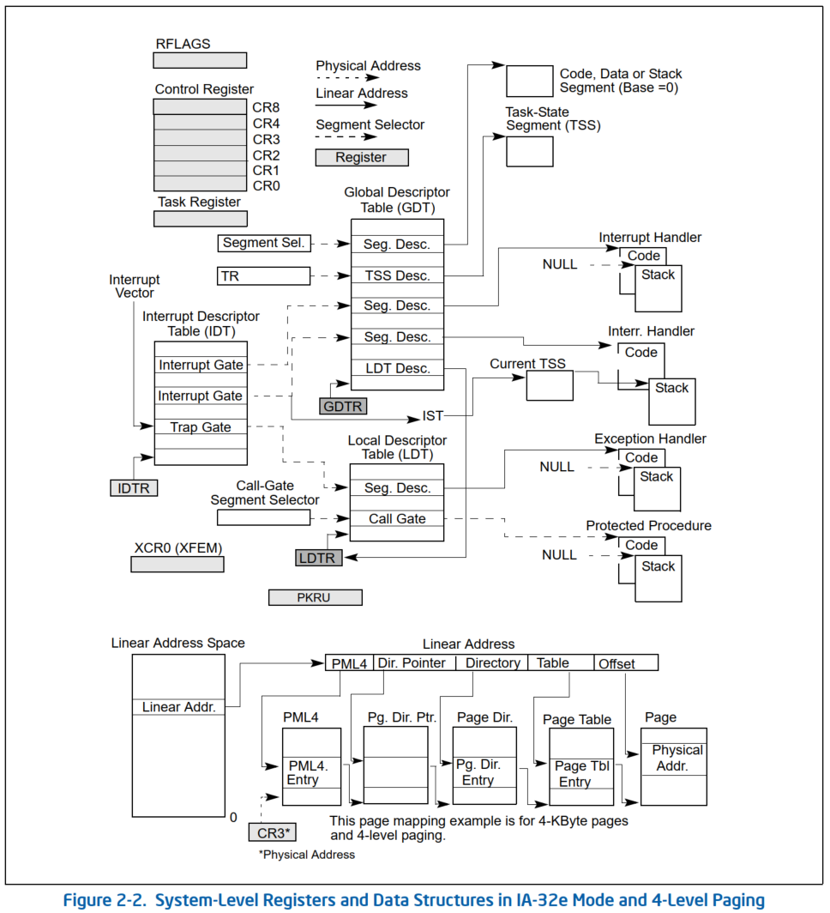
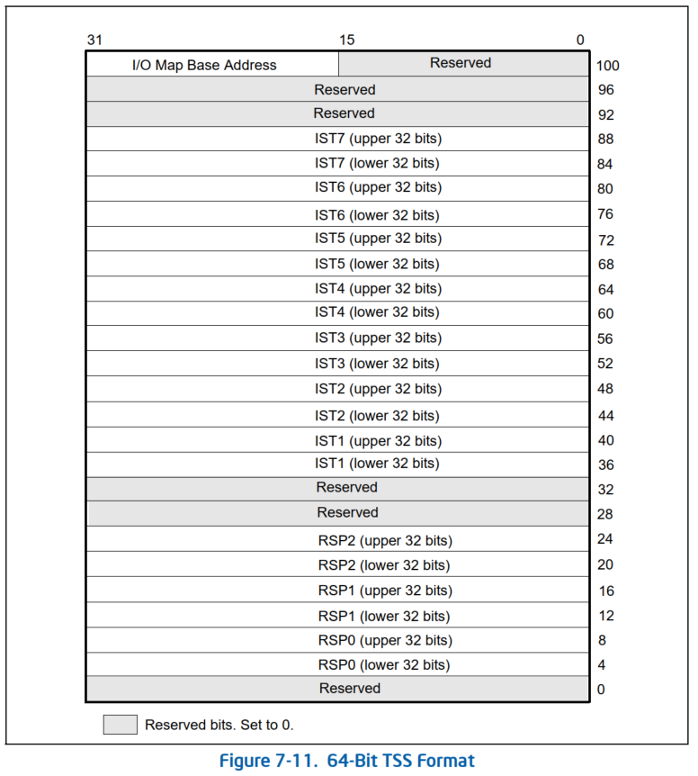
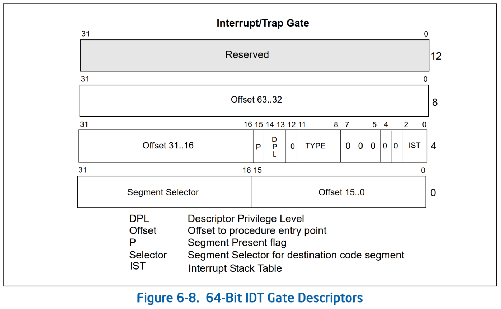

# 内核中的栈 - x86-64



* 在 64 位模式下，中断和异常处理类似于非 64 位模式。以下是例外情况：
  * IDT 指向的所有中断处理程序都是 64 位的代码（这不适用于 SMI 处理程序）。
  * 中断堆栈压栈的大小固定为 64 位；处理器使用 8 字节，零扩展的方式保存。
  * 堆栈指针（`SS:RSP`）在中断时被无条件压入。在旧模式中，此压栈是有条件的，取决于 current privilege level (CPL) 是否会发生更改。
  * 如果 CPL 发生变化，则新的`SS`设置为`NULL`。
  * `IRET`行为改变。
  * 有一个新的中断堆栈切换机制和一个新的中断影子堆栈切换机制。
  * 中断堆栈帧的对齐方式不同。

## 64 位 TSS

* arch/x86/include/asm/processor.h
```cpp
/*
 * Note that while the legacy 'TSS' name comes from 'Task State Segment',
 * on modern x86 CPUs the TSS also holds information important to 64-bit mode,
 * unrelated to the task-switch mechanism:
 */
#ifdef CONFIG_X86_32
...
#else
struct x86_hw_tss {
    u32         reserved1;
    u64         sp0;
    u64         sp1;

    /*
     * Since Linux does not use ring 2, the 'sp2' slot is unused by
     * hardware.  entry_SYSCALL_64 uses it as scratch space to stash
     * the user RSP value.
     */
    u64         sp2;

    u64         reserved2;
    u64         ist[7];
    u32         reserved3;
    u32         reserved4;
    u16         reserved5;
    u16         io_bitmap_base;

} __attribute__((packed));
#endif
...
struct tss_struct {
    /*
     * The fixed hardware portion.  This must not cross a page boundary
     * at risk of violating the SDM's advice and potentially triggering
     * errata.
     */
    struct x86_hw_tss   x86_tss;

    struct x86_io_bitmap    io_bitmap;
} __aligned(PAGE_SIZE);

DECLARE_PER_CPU_PAGE_ALIGNED(struct tss_struct, cpu_tss_rw);

/* Per CPU interrupt stacks */
struct irq_stack {
    char        stack[IRQ_STACK_SIZE];
} __aligned(IRQ_STACK_SIZE);
```
* `sp0`：无论正在运行什么任务，`sp0`指向 CPU entry trampoline stack。
* `sp1`：旧版本时宏`cpu_current_top_of_stack`指引到这，指向当前任务的内核栈。任务切换时会更新`cpu_current_top_of_stack`的值，指向换入任务的内核栈。
* `sp2`：由于 Linux 不使用 ring 2，因此硬件未使用`sp2`这个域。系统调用的入口例程`entry_SYSCALL_64`会将其用作来暂存用户态的`RSP`值。

## 几种内核栈的大小
* arch/x86/include/asm/page_64_types.h
```cpp
#ifdef CONFIG_KASAN
#define KASAN_STACK_ORDER 1
#else
#define KASAN_STACK_ORDER 0
#endif

#define THREAD_SIZE_ORDER   (2 + KASAN_STACK_ORDER)
#define THREAD_SIZE  (PAGE_SIZE << THREAD_SIZE_ORDER)

#define EXCEPTION_STACK_ORDER (1 + KASAN_STACK_ORDER)
#define EXCEPTION_STKSZ (PAGE_SIZE << EXCEPTION_STACK_ORDER)

#define IRQ_STACK_ORDER (2 + KASAN_STACK_ORDER)
#define IRQ_STACK_SIZE (PAGE_SIZE << IRQ_STACK_ORDER)
```
* 在未开启 KASAN 的情况下：
  * 内核进程栈的大小`THREAD_SIZE`：`16kB`（`2^THREAD_SIZE_ORDER = 4`）
  * 中断栈的大小`IRQ_STACK_SIZE`：`16kB`（`2^IRQ_STACK_ORDER = 4`）
  * 异常栈的大小`EXCEPTION_STKSZ`：`8kB`（`2^EXCEPTION_STACK_ORDER = 2`）
* 有 KASAN 时会多一页

## 中断栈
* 对于无需进行 privilege-level 变化的情况，比如中断发生时 CPU 运行在内核态
  1. CPU 依然会将被中断进程的`ss`、`rsp`、`rflags`、`cs`、`rip`、`error code`等压入 *当前内核栈*
  2. 软件保存被中断进程的通用目的寄存器在当前进程栈，然后清除 GPRs 的内容
  3. 软件将栈切换到预设好的 per-CPU 的中断栈，栈的地址由 per-CPU 变量来记录，类似`moveq PER_CPU_VAR(irq_stack_ptr), %rsp`

### 中断栈的分配和初始化
```cpp
start_kernel()
-> init_IRQ()
   -> irq_init_percpu_irqstack(smp_processor_id())
      -> map_irq_stack()
   // arch/x86/kernel/x86_init.c
   -> x86_init.irqs.intr_init()
   // arch/x86/kernel/irqinit.c
   => native_init_IRQ()
      -> idt_setup_apic_and_irq_gates()
```
* arch/x86/kernel/irq_64.c
```c
DEFINE_PER_CPU_PAGE_ALIGNED(struct irq_stack, irq_stack_backing_store) __visible;
DECLARE_INIT_PER_CPU(irq_stack_backing_store);
...
#ifdef CONFIG_VMAP_STACK
...
#else
static int map_irq_stack(unsigned int cpu)
{
    void *va = per_cpu_ptr(&irq_stack_backing_store, cpu);

    per_cpu(hardirq_stack_ptr, cpu) = va + IRQ_STACK_SIZE;
    return 0;
}
#endif
```
* 因此`hardirq_stack_ptr`指向的是栈顶（高地址）

### 切换中断栈
* v5.4
```cpp
irq_entries_start
   jmp common_interrupt
      call interrupt_entry
         ENTER_IRQ_STACK old_rsp=%rdi save_ret=1
            movq    \old_rsp, PER_CPU_VAR(irq_stack_backing_store + IRQ_STACK_SIZE - 8)
            movq    PER_CPU_VAR(hardirq_stack_ptr), %rsp
```
* v6.0
```cpp
irq_entries_start
   jmp asm_common_interrupt
      call common_interrupt
           -> irqentry_state_t state = irqentry_enter(regs);
              u32 vector = (u32)(u8)error_code;
              run_irq_on_irqstack_cond(__##func, regs, vector)
                 call_on_irqstack_cond(func, regs, ASM_CALL_IRQ, IRQ_CONSTRAINTS, regs, vector);
                    call_on_irqstack(func, asm_call, constr);
                       call_on_stack(__this_cpu_read(hardirq_stack_ptr), func, asm_call, argconstr)
                          register void *tos asm("r11");
                          tos = ((void *)(stack));
                          "movq   %%rsp, (%[tos])             \n"
                          "movq   %[tos], %%rsp               \n"
                          asm_call
                          => __common_interrupt()
           -> irqentry_exit(regs, state)
```
* 在这个 commit 后中断栈的使用发生了一些变化，
  * [[patch V2 00_13] x86_irq_64 Inline irq stack switching](https://lore.kernel.org/all/20210209234041.127454039@linutronix.de/)
  * [x86/entry: Convert system vectors to irq stack macro](https://git.kernel.org/pub/scm/linux/kernel/git/torvalds/linux.git/commit/?id=569dd8b4eb7ef666b467c41b8e8e4f2820d07f67)
  * 对于用户程序被中断或者已经有中断正在 per-CPU 的中断栈上被处理的情况，直接调用`__common_interrupt()`
    * 中断的是用户程序，第一站是 trampoline stack，但随即切换到进程内核栈上去处理中断
    * 已经有中断正在 per-CPU 中断栈上被处理，则使用 *当前内核栈*

## 异常栈
* 对于无需进行 privilege-level 变化的情况，比如异常发生时 CPU 运行在内核态
  1. CPU 依然会将被中断进程的`ss`、`rsp`、`rflags`、`cs`、`rip`、`error code`等压入 *当前内核栈*
  2. 软件保存被中断进程的通用目的寄存器在当前进程栈，然后清除 GPRs 的内容
  3. 软件继续在 *当前内核栈* 进行异常处理
* **当前内核栈** 指的是异常或中断发生时当前内核所使用的栈，可能是中断栈、内核进程栈、trampoline stack、IST 栈中任何一种

## Privilege-level 发生变化时的栈
* 对于 privilege-level 变化的情况，比如异常或中断发生时 CPU 运行在用户态，handler 要使用的栈的 segment selector 和 stack pointer 是从当前执行任务的 TSS 中获得的。
  * 对于 x86-64 Linux 这个栈由`cpu_tss_rw.x86_tss.sp0`指示，也就是 CPU entry trampoline stack
  * 对于中断，内核会随后切换到中断栈上去处理中断（commit 569dd8b4eb7e 后有变化，见上面，也切换到进程内核栈上去处理中断）
  * 对于异常，随即切换到进程内核栈上去处理异常

```cpp
/* Device interrupts common/spurious */
DECLARE_IDTENTRY_IRQ(X86_TRAP_OTHER,    common_interrupt);

#ifndef __ASSEMBLY__ //对于 C 代码包含该宏

#define DECLARE_IDTENTRY_IRQ(vector, func)              \
    DECLARE_IDTENTRY_ERRORCODE(vector, func)

#define DECLARE_IDTENTRY_ERRORCODE(vector, func)            \
    asmlinkage void asm_##func(void);               \
    asmlinkage void xen_asm_##func(void);               \
    __visible void func(struct pt_regs *regs, unsigned long error_code)

#else //对于汇编代码包含该宏
/* Entries for common/spurious (device) interrupts */
#define DECLARE_IDTENTRY_IRQ(vector, func)              \
    idtentry_irq vector func
#endif
```
* 中断处理函数的入口的汇编宏 `idtentry_irq`
```c
/*
 * Interrupt entry/exit.
 *
 + The interrupt stubs push (vector) onto the stack, which is the error_code
 * position of idtentry exceptions, and jump to one of the two idtentry points
 * (common/spurious).
 *
 * common_interrupt is a hotpath, align it to a cache line
 */
.macro idtentry_irq vector cfunc
    .p2align CONFIG_X86_L1_CACHE_SHIFT
    idtentry \vector asm_\cfunc \cfunc has_error_code=1
.endm

.macro idtentry vector asmsym cfunc has_error_code:req
SYM_CODE_START(\asmsym)

    .if \vector == X86_TRAP_BP //vector = X86_TRAP_OTHER，进不来
        /* #BP advances %rip to the next instruction */
        UNWIND_HINT_IRET_REGS offset=\has_error_code*8 signal=0
    .else
        UNWIND_HINT_IRET_REGS offset=\has_error_code*8
    .endif

    ENDBR
    ASM_CLAC
    cld

    .if \has_error_code == 0
        pushq   $-1         /* ORIG_RAX: no syscall to restart */
    .endif

    .if \vector == X86_TRAP_BP //vector = X86_TRAP_OTHER，进不来
        /*
         * If coming from kernel space, create a 6-word gap to allow the
         * int3 handler to emulate a call instruction.
         */
        testb   $3, CS-ORIG_RAX(%rsp)
        jnz .Lfrom_usermode_no_gap_\@
        .rept   6
        pushq   5*8(%rsp)
        .endr
        UNWIND_HINT_IRET_REGS offset=8
.Lfrom_usermode_no_gap_\@:
    .endif

    idtentry_body \cfunc \has_error_code

_ASM_NOKPROBE(\asmsym)
SYM_CODE_END(\asmsym)
.endm

/**
 * idtentry_body - Macro to emit code calling the C function
 * @cfunc:      C function to be called
 * @has_error_code: Hardware pushed error code on stack
 */
.macro idtentry_body cfunc has_error_code:req

    /*
     * Call error_entry() and switch to the task stack if from userspace.
     *
     * When in XENPV, it is already in the task stack, and it can't fault
     * for native_iret() nor native_load_gs_index() since XENPV uses its
     * own pvops for IRET and load_gs_index().  And it doesn't need to
     * switch the CR3.  So it can skip invoking error_entry().
     */
    ALTERNATIVE "call error_entry; movq %rax, %rsp", \
            "call xen_error_entry", X86_FEATURE_XENPV

    ENCODE_FRAME_POINTER
    UNWIND_HINT_REGS

    movq    %rsp, %rdi          /* pt_regs pointer into 1st argument*/

    .if \has_error_code == 1
        movq    ORIG_RAX(%rsp), %rsi    /* get error code into 2nd argument*/
        movq    $-1, ORIG_RAX(%rsp) /* no syscall to restart */
    .endif

    call    \cfunc //调用 common_interrupt

    /* For some configurations \cfunc ends up being a noreturn. */
    REACHABLE

    jmp error_return
.endm
```
* `sync_regs()` 帮忙找到进程内核栈，真正地将栈切换到进程内核栈在 `call error_entry; movq %rax, %rsp`
```cpp
/*
 * Help handler running on a per-cpu (IST or entry trampoline) stack
 * to switch to the normal thread stack if the interrupted code was in
 * user mode. The actual stack switch is done in entry_64.S
 */
asmlinkage __visible noinstr struct pt_regs *sync_regs(struct pt_regs *eregs)
{
    struct pt_regs *regs = (struct pt_regs *)this_cpu_read(pcpu_hot.top_of_stack) - 1;
    if (regs != eregs)
        *regs = *eregs;
    return regs;
}
```
* `idtentry_body`里切换到进程内核栈，
* **注意**，跳转到 `sync_regs()` 的用的不是 `call` 指令，而是 `jmp` 指令，因此
  * `sync_regs()` 返回即是 `error_entry` 返回，
  * `sync_regs()` 的返回值即 `call error_entry` 的返回值，放在 `$rax`
```cpp
call error_entry
   PUSH_AND_CLEAR_REGS save_ret=1 //寄存器压栈
   testb   $3, CS+8(%rsp) //中断/异常发生在内核态 or 用户态？
   jz  .Lerror_kernelspace //内核态不走下面
   /* Put us onto the real thread stack. */
   jmp sync_regs //帮忙找到进程内核栈，该函数的返回就是 error_entry 的返回
   ...
.Lerror_kernelspace:
   ...
movq %rax, %rsp //sync_regs() 的返回值即 error_entry 的返回值，真正地将栈切换到进程内核栈
```

> When the processor performs a call to the exception- or interrupt-handler procedure:
> * If the handler procedure is going to be executed at a numerically lower privilege level, a stack switch occurs.
>   When the stack switch occurs:
>   1. The segment selector and stack pointer for the stack to be used by the handler are obtained from the TSS for the currently executing task. On this new stack, the processor pushes the stack segment selector and stack pointer of the interrupted procedure.
>   2. The processor then saves the current state of the `EFLAGS`, `CS`, and `EIP` registers on the new stack (see Figure 6-4).
>   3. If an exception causes an error code to be saved, it is pushed on the new stack after the `EIP` value.
>
> * If the handler procedure is going to be executed at the same privilege level as the interrupted procedure:
>   1. The processor saves the current state of the `EFLAGS`, `CS`, and `EIP` registers on the current stack (see Figure 6-4).
>   2. If an exception causes an error code to be saved, it is pushed on the current stack after the `EIP` value.
>
> -- SDM, Vol. 3A, 6.12.1 Exception- or Interrupt-Handler Procedures

* 对于 x86-64 模式，CPU 压栈是不区分 CPL 是否发生改变的
> In 64-bit mode, the size of interrupt stack-frame pushes is fixed at eight bytes. This is because only 64-bit mode gates can be referenced. 64-bit mode also pushes `SS:RSP` unconditionally, rather than only on a CPL change.
>
> -- SDM, Vol. 3A, 6.14.2 64-Bit Mode Stack Frame

* 为什么异常处理发生 OOPs 时看到的的栈有时是`0xfffffexxxxxxxxxx`有时是`0xffffc90000000000 ~ ffffe8ffffffffff`（对于 5 级页表是`0xffa0000000000000 ~ 0xffd1ffffffffffff`）？
  * `0xfffffexxxxxxxxxx` 是 cpu_entry_area mapping 的范围，说明此时使用的是 CPU entry trampoline stack，异常发生时 CPU 在运行的是用户态的程序；
  * `0xffffc90000000000 ~ ffffe8ffffffffff` 是 vmalloc/ioremap space 的范围，说明当前内核启用了`CONFIG_VMAP_STACK`，进程内核栈是通过`vmalloc`分配的，异常发生时处于内核态；
  * 对于一些出错的极端情况，甚至有可能看到异常在使用中断栈或者 IST 栈。

## 进程内核栈
* 对于任务的内核栈，在任务创建时分配，由`struct task_struct`的`stack`域记录
* 每当发生任务切换时，会将它更新到 per-CPU 变量`cpu_current_top_of_stack`中
  * 旧版本这不是变量而是个宏，实际是`cpu_tss_rw.x86_tss.sp1`
  * arch/x86/kernel/process_64.c:`__switch_to()`
    ```c
    this_cpu_write(cpu_current_top_of_stack, task_top_of_stack(next_p));
    ```
* 对于 x86-64 模式，当进程发生系统调用陷入内核态时，`syscall`指令不保存用户态的栈指针`RSP`，因此任务的用户态和内核态之间栈的切换由软件负责。此时内核会将`cpu_current_top_of_stack`的值作为内核栈的栈顶
  * arch/x86/entry/entry_64.S:`SYM_CODE_START(entry_SYSCALL_64)`
    ```c
    movq    PER_CPU_VAR(cpu_current_top_of_stack), %rsp
    ```

## IST 异常栈
* 每种 IST 异常栈的是独立分配的，新版本加入了 guard page
* 由硬件完成 IST 异常栈的切换



* arch/x86/include/asm/page_64_types.h
```cpp
/*
 * The index for the tss.ist[] array. The hardware limit is 7 entries.
 */
#define IST_INDEX_DF        0
#define IST_INDEX_NMI       1
#define IST_INDEX_DB        2
#define IST_INDEX_MCE       3
#define IST_INDEX_VC        4
```
* 通过`ISTG()`定义了 IST 异常栈的起始地址
* arch/x86/include/asm/desc_defs.h
```cpp
struct idt_bits {
    u16     ist : 3,
            zero    : 5,
            type    : 5,
            dpl : 2,
            p   : 1;
} __attribute__((packed));

struct idt_data {
    unsigned int    vector;
    unsigned int    segment;
    struct idt_bits bits;
    const void  *addr;
};
```
* `ist`域为 IST 栈的索引
* arch/x86/kernel/idt.c
```cpp
#define G(_vector, _addr, _ist, _type, _dpl, _segment)  \
    {                       \
        .vector     = _vector,      \
        .bits.ist   = _ist,         \
        .bits.type  = _type,        \
        .bits.dpl   = _dpl,         \
        .bits.p     = 1,            \
        .addr       = _addr,        \
        .segment    = _segment,     \
    }
...
#ifdef CONFIG_X86_64
/*
 * Interrupt gate with interrupt stack. The _ist index is the index in
 * the tss.ist[] array, but for the descriptor it needs to start at 1.
 */
#define ISTG(_vector, _addr, _ist)          \
    G(_vector, _addr, _ist + 1, GATE_INTERRUPT, DPL0, __KERNEL_CS)
#else
#define ISTG(_vector, _addr, _ist)  INTG(_vector, _addr)
#endif
/*
 * The default IDT entries which are set up in trap_init() before
 * cpu_init() is invoked. Interrupt stacks cannot be used at that point and
 * the traps which use them are reinitialized with IST after cpu_init() has
 * set up TSS.
 */
static const __initconst struct idt_data def_idts[] = {
...
    ISTG(X86_TRAP_NMI,      asm_exc_nmi, IST_INDEX_NMI),
...
#ifdef CONFIG_X86_32
    TSKG(X86_TRAP_DF,       GDT_ENTRY_DOUBLEFAULT_TSS),
#else
    ISTG(X86_TRAP_DF,       asm_exc_double_fault, IST_INDEX_DF),
#endif
    ISTG(X86_TRAP_DB,       asm_exc_debug, IST_INDEX_DB),

#ifdef CONFIG_X86_MCE
    ISTG(X86_TRAP_MC,       asm_exc_machine_check, IST_INDEX_MCE),
#endif
...
#ifdef CONFIG_AMD_MEM_ENCRYPT
    ISTG(X86_TRAP_VC,       asm_exc_vmm_communication, IST_INDEX_VC),
#endif
...
}
```
* 在启动过程中初始化异常栈的处理
```cpp
start_kernel()
-> trap_init()
   -> cpu_init_exception_handling() /* Initialize TSS before setting up traps so ISTs work */
```
* 通过以下方式设定 per-CPU 的 `cpu_tss_rw` 的 `x86_tss.ist[]` 数组元素的值，指示的不同类型的 IST 异常的栈顶（高地址）
```cpp
static inline void tss_setup_ist(struct tss_struct *tss)
{
    /* Set up the per-CPU TSS IST stacks */
    tss->x86_tss.ist[IST_INDEX_DF] = __this_cpu_ist_top_va(DF);
    tss->x86_tss.ist[IST_INDEX_NMI] = __this_cpu_ist_top_va(NMI);
    tss->x86_tss.ist[IST_INDEX_DB] = __this_cpu_ist_top_va(DB);
    tss->x86_tss.ist[IST_INDEX_MCE] = __this_cpu_ist_top_va(MCE);
    /* Only mapped when SEV-ES is active */
    tss->x86_tss.ist[IST_INDEX_VC] = __this_cpu_ist_top_va(VC);
}
...
/*
 * Setup everything needed to handle exceptions from the IDT, including the IST
 * exceptions which use paranoid_entry().
 */
void cpu_init_exception_handling(void)
{
    struct tss_struct *tss = this_cpu_ptr(&cpu_tss_rw);
    int cpu = raw_smp_processor_id();

    /* paranoid_entry() gets the CPU number from the GDT */
    setup_getcpu(cpu);

    /* IST vectors need TSS to be set up. */
    tss_setup_ist(tss); //设置不同类型的 IST 异常的栈顶
    tss_setup_io_bitmap(tss);
    set_tss_desc(cpu, &get_cpu_entry_area(cpu)->tss.x86_tss); //设置 GDT 中的 TSS 描述符

    load_TR_desc(); //用 ldt 指令将 TSS 加载到 TR 寄存器

    /* Finally load the IDT */
    load_current_idt();
}
```
* 如果通过 PerCPU 的数组`exception_stacks[]`去查看每个 CPU 的 IST 栈，看到的是栈底（低地址）
* arch/x86/include/asm/cpu_entry_area.h
```cpp
#ifdef CONFIG_X86_64

#ifdef CONFIG_AMD_MEM_ENCRYPT
#define VC_EXCEPTION_STKSZ  EXCEPTION_STKSZ
#else
#define VC_EXCEPTION_STKSZ  0
#endif

/* Macro to enforce the same ordering and stack sizes */
#define ESTACKS_MEMBERS(guardsize, optional_stack_size)     \
    char    DF_stack_guard[guardsize];          \
    char    DF_stack[EXCEPTION_STKSZ];          \
    char    NMI_stack_guard[guardsize];         \
    char    NMI_stack[EXCEPTION_STKSZ];         \
    char    DB_stack_guard[guardsize];          \
    char    DB_stack[EXCEPTION_STKSZ];          \
    char    MCE_stack_guard[guardsize];         \
    char    MCE_stack[EXCEPTION_STKSZ];         \
    char    VC_stack_guard[guardsize];          \
    char    VC_stack[optional_stack_size];          \
    char    VC2_stack_guard[guardsize];         \
    char    VC2_stack[optional_stack_size];         \
    char    IST_top_guard[guardsize];           \

/* The exception stacks' physical storage. No guard pages required */
struct exception_stacks {
    ESTACKS_MEMBERS(0, VC_EXCEPTION_STKSZ)
};

/* The effective cpu entry area mapping with guard pages. */
struct cea_exception_stacks {
    ESTACKS_MEMBERS(PAGE_SIZE, EXCEPTION_STKSZ)
};
```

### 用户态发生 `#MC` 和 `#DB` 时的栈
* 虽然 `#MC` 和 `#DB` 被 Linux 定义为使用 IST 栈，但发生在用户态时，会通过软件把它切换到进程内核栈上去处理
```c
# define DECLARE_IDTENTRY_MCE(vector, func)             \
    idtentry_mce_db vector asm_##func func

# define DECLARE_IDTENTRY_DEBUG(vector, func)               \
    idtentry_mce_db vector asm_##func func
```
* `idtentry_mce_db` 会判断，如果是发生在用户态，用的是汇编宏 `idtentry_body`，之前已经展示过了它是怎么切换栈的了

## CPU Entry Trampoline Stack
* 出于安全的目的，trampoline stack 被引入以支持 x86 KAISER
  * https://git.kernel.org/pub/scm/linux/kernel/git/torvalds/linux.git/commit/?id=7f2590a110b837af5679d08fc25c6227c5a8c497
  * https://lore.kernel.org/lkml/20171127104529.12435-17-mingo@kernel.org/
* ring 3 切换到 ring 0，CPU 会根据 TSS 的`SP0`字段切换内核栈
  * 原先，`cpu_tss_rw.x86_tss.sp0`的值设置为进程的内核栈。如果发生进程切换，该值也会跟着切换
  * 此后，`cpu_tss_rw.x86_tss.sp0`的值设置为 trampoline stack。**即使发生进程切换，也不会更新该值**
  * 当 CPU 需要切换栈时，内核不再直接使用进程的内核栈，而是先使其切换到 trampoline stack，进行一些安全相关的操作，之后再由内核决定该用那种类型的内核栈
* 注意：`syscall`指令导致的用户态到内核态的切换，CPU 不会自动切换栈，而是由内核自行切换到进程的内核栈
### Trampoline Stack 的分配
* Trampoline stack 的空间来自 per-CPU 变量`struct entry_stack_page entry_stack_storage`
* arch/x86/mm/cpu_entry_area.c
```cpp
static DEFINE_PER_CPU_PAGE_ALIGNED(struct entry_stack_page, entry_stack_storage);
```
* Trampoline stack 大小为 4 kB
* arch/x86/include/asm/processor.h
```cpp
struct entry_stack {
    char    stack[PAGE_SIZE];
};

struct entry_stack_page {
    struct entry_stack stack;
} __aligned(PAGE_SIZE);
```
### Trampoline stack 的设置
* Trampoline stack 的值由启动时`cpu_init()`调用`load_sp0()`设置 TSS 的`sp0`为`entry_stack_storage + PAGE_SIZE`的地址，也就是栈顶（高地址）
  * arch/x86/kernel/cpu/common.c
```cpp
void cpu_init(void)
{
    ...
    /*
     * sp0 points to the entry trampoline stack regardless of what task
     * is running.
     */
    load_sp0((unsigned long)(cpu_entry_stack(cpu) + 1));
    ...
}
```
### CPU Entry Area
* `cpu_entry_area` 是一个 per-cpu 区域，包含 CPU 和早期进入/退出代码需要的东西。
* 并非所有字段都使用真实类型以避免头文件的循环依赖。
* 每个字段都是其他分配的后备存储的虚拟别名。
* 没有直接分配的`struct cpu_entry_area`。
  * arch/x86/include/asm/cpu_entry_area.h
```cpp
/*
 * cpu_entry_area is a percpu region that contains things needed by the CPU
 * and early entry/exit code.  Real types aren't used for all fields here
 * to avoid circular header dependencies.
 *
 * Every field is a virtual alias of some other allocated backing store.
 * There is no direct allocation of a struct cpu_entry_area.
 */
struct cpu_entry_area {
    char gdt[PAGE_SIZE];

    /*
     * The GDT is just below entry_stack and thus serves (on x86_64) as
     * a read-only guard page. On 32-bit the GDT must be writeable, so
     * it needs an extra guard page.
     */
#ifdef CONFIG_X86_32
    char guard_entry_stack[PAGE_SIZE];
#endif
    struct entry_stack_page entry_stack_page;

#ifdef CONFIG_X86_32
    char guard_doublefault_stack[PAGE_SIZE];
    struct doublefault_stack doublefault_stack;
#endif

    /*
     * On x86_64, the TSS is mapped RO.  On x86_32, it's mapped RW because
     * we need task switches to work, and task switches write to the TSS.
     */
    struct tss_struct tss;
#ifdef CONFIG_X86_64
    /*
     * Exception stacks used for IST entries with guard pages.
     */
    struct cea_exception_stacks estacks;
#endif
    /*
     * Per CPU debug store for Intel performance monitoring. Wastes a
     * full page at the moment.
     */
    struct debug_store cpu_debug_store;
    /*
     * The actual PEBS/BTS buffers must be mapped to user space
     * Reserve enough fixmap PTEs.
     */
    struct debug_store_buffers cpu_debug_buffers;
};

#define CPU_ENTRY_AREA_SIZE     (sizeof(struct cpu_entry_area))
#define CPU_ENTRY_AREA_ARRAY_SIZE   (CPU_ENTRY_AREA_SIZE * NR_CPUS)

/* Total size includes the readonly IDT mapping page as well: */
#define CPU_ENTRY_AREA_TOTAL_SIZE   (CPU_ENTRY_AREA_ARRAY_SIZE + PAGE_SIZE)

DECLARE_PER_CPU(struct cpu_entry_area *, cpu_entry_area);
DECLARE_PER_CPU(struct cea_exception_stacks *, cea_exception_stacks);
...
```
* 注意，最后也只是分配了一个`struct cpu_entry_area *`类型的 per-CPU 指针`cpu_entry_area`
* cpu_entry_area 的范围

Start addr       |   Offset   |     End addr     |  Size   | VM area description
-----------------|------------|------------------|---------|-----------------------
fffffe0000000000 |   -2    TB | fffffe7fffffffff |  0.5 TB | cpu_entry_area mapping

* arch/x86/include/asm/pgtable_64_types.h
```cpp
#define CPU_ENTRY_AREA_PGD  _AC(-4, UL)
#define CPU_ENTRY_AREA_BASE (CPU_ENTRY_AREA_PGD << P4D_SHIFT)
```
* arch/x86/include/asm/pgtable_areas.h
```cpp
#define CPU_ENTRY_AREA_RO_IDT       CPU_ENTRY_AREA_BASE
#define CPU_ENTRY_AREA_PER_CPU      (CPU_ENTRY_AREA_RO_IDT + PAGE_SIZE)
```
* 获取 cpu_entry_area 的接口函数`get_cpu_entry_area()`
  * arch/x86/mm/cpu_entry_area.c
  ```cpp
  noinstr struct cpu_entry_area *get_cpu_entry_area(int cpu)
  {
      unsigned long va = CPU_ENTRY_AREA_PER_CPU + cpu * CPU_ENTRY_AREA_SIZE;
      BUILD_BUG_ON(sizeof(struct cpu_entry_area) % PAGE_SIZE != 0);

      return (struct cpu_entry_area *) va;
  }
  ```
* 获取`entry_stack_page`域的用例
  * arch/x86/include/asm/cpu_entry_area.h
  ```cpp
  static __always_inline struct entry_stack *cpu_entry_stack(int cpu)
  {
      return &get_cpu_entry_area(cpu)->entry_stack_page.stack;
  }
  ```
#### 为什么 trampoline stack 以及 IST 栈会有两个虚拟地址？
* 因为`setup_cpu_entry_area()`中会调用`cea_map_percpu_pages()`对 cpu_entry_area 中的指针进行重新映射
* arch/x86/mm/cpu_entry_area.c
```cpp
/* Setup the fixmap mappings only once per-processor */
static void __init setup_cpu_entry_area(unsigned int cpu)
{
    struct cpu_entry_area *cea = get_cpu_entry_area(cpu);
    ...
    cea_map_percpu_pages(&cea->entry_stack_page,
                 per_cpu_ptr(&entry_stack_storage, cpu), 1,
                 PAGE_KERNEL);
    ...
    cea_map_percpu_pages(&cea->tss, &per_cpu(cpu_tss_rw, cpu),
                 sizeof(struct tss_struct) / PAGE_SIZE, tss_prot);
    ...
    percpu_setup_exception_stacks(cpu);
    ...
}
```
* 所以看到的内容会是这样
```cpp
crash> struct tss_struct.x86_tss -x cpu_tss_rw:0
[0]: ff1100007fa06000
  x86_tss = {
    reserved1 = 0x0,
    sp0 = 0xfffffe0000003000,
    sp1 = 0x0,
    sp2 = 0x7ffe6c6f4118,
    reserved2 = 0x0,
    ist = {0xfffffe000000b000, 0xfffffe000000e000, 0xfffffe0000011000, 0xfffffe0000014000, 0xfffffe0000017000, 0x0, 0x0},
    reserved3 = 0x0,
    reserved4 = 0x0,
    reserved5 = 0x0,
    io_bitmap_base = 0x4088
  },
crash>

crash> p entry_stack_storage
PER-CPU DATA TYPE:
  struct entry_stack_page entry_stack_storage;
PER-CPU ADDRESSES:
  [0]: ff1100007fa14000
crash>

crash> vtop fffffe0000002000
VIRTUAL           PHYSICAL
fffffe0000002000  7fa14000

PGD DIRECTORY: ffffffff83010000
PAGE DIRECTORY: 3014067
   P4D: 3014fe0 => 7fda6067
   PUD: 7fda6000 => 7faa4067
   PMD: 7faa4000 => 7faa3067
   PTE: 7faa3010 => 800000007fa14163
  PAGE: 7fa14000

      PTE         PHYSICAL  FLAGS
800000007fa14163  7fa14000  (PRESENT|RW|ACCESSED|DIRTY|GLOBAL|NX)

      PAGE       PHYSICAL      MAPPING       INDEX CNT FLAGS
ffd4000001fe8500 7fa14000                0        0  1 fffffc0001000 reserved

crash> vtop ff1100007fa14000
VIRTUAL           PHYSICAL
ff1100007fa14000  7fa14000

PGD DIRECTORY: ffffffff83010000
PAGE DIRECTORY: 4201067
   P4D: 4201000 => 4202067
   PUD: 4202008 => 4205067
   PMD: 4205fe8 => 4cda063
   PTE: 4cda0a0 => 800000007fa14163
  PAGE: 7fa14000

      PTE         PHYSICAL  FLAGS
800000007fa14163  7fa14000  (PRESENT|RW|ACCESSED|DIRTY|GLOBAL|NX)
      PAGE       PHYSICAL      MAPPING       INDEX CNT FLAGS

ffd4000001fe8500 7fa14000                0        0  1 fffffc0001000 reserved
crash>
```
* `0xfffffe0000003000`是 trampoline stack 的栈顶（高地址），故栈实为`0xfffffe0000002000 - 0xfffffe0000002fff`
* `0xff1100007fa14000`为实际存储的 per-CPU 变量`entry_stack_storage`的地址
* `vtop`的结果观察到它们都映射到了同一个物理页`0x7fa14000`上

#### idt_table 在 CPU_ENTRY_AREA 上的重新映射
* 中断描述符表`idt_table[]`也会被重新映射到 CPU entry area 并真正起作用
* arch/x86/kernel/idt.c
```cpp
/* Must be page-aligned because the real IDT is used in the cpu entry area */
static gate_desc idt_table[IDT_ENTRIES] __page_aligned_bss;

static struct desc_ptr idt_descr __ro_after_init = {
    .size       = IDT_TABLE_SIZE - 1,
    .address    = (unsigned long) idt_table,
};
...
static void __init idt_map_in_cea(void)
{
    /*
     * Set the IDT descriptor to a fixed read-only location in the cpu
     * entry area, so that the "sidt" instruction will not leak the
     * location of the kernel, and to defend the IDT against arbitrary
     * memory write vulnerabilities.
     */
    cea_set_pte(CPU_ENTRY_AREA_RO_IDT_VADDR, __pa_symbol(idt_table),
            PAGE_KERNEL_RO);
    idt_descr.address = CPU_ENTRY_AREA_RO_IDT;
}
```
* 初始化时会通过`idt_map_in_cea()`将 IDT 描述符表重新映射到`CPU_ENTRY_AREA_RO_IDT_VADDR`，即 CPU entry area 的起始地址`0xfffffe0000000000`
* 因为`idt_table[]`原来的位置与 kernel image 的位置有固定的偏移，而`sidt`指令可以在用户空间使用，这样会泄漏 kernel 的位置，通过`lidt`将 IDTR 设为新的 cea 地址来避免这一点
* 当然，原来`idt_table[]`到 IDT 描述符表之间的映射依旧存在且有效
```cpp
start_kernel()
-> init_IRQ()
   -> x86_init.irqs.intr_init()
   => native_init_IRQ()
      -> idt_setup_apic_and_irq_gates() //Setup APIC/SMP and normal interrupt gates
         -> idt_map_in_cea() //映射 idt_table 到 CPU entry area
         -> load_idt(&idt_descr); //lidt 重新加载到 IDTR
         -> set_memory_ro((unsigned long)&idt_table, 1); //将 IDT 表所在页设为只读
```

## References
- [中断硬件之Intel架构](https://blog.betamao.me/posts/2021/ia-interrupt-hardware/)
- [计算机中断体系一：历史和原理](https://zhuanlan.zhihu.com/p/26464793)