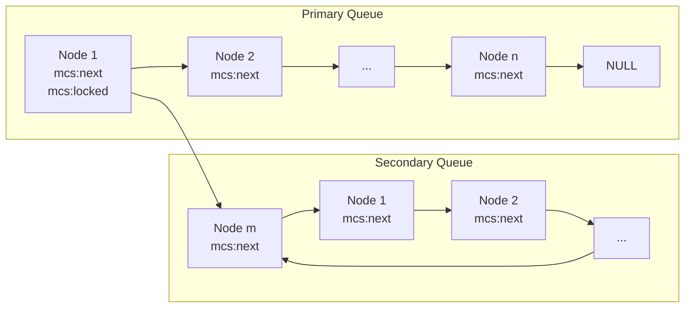

# NUMA 感知的 qspinlock
* 尽管在 qspinlock 的慢速路径上，MCS 锁在自己的锁字上自旋，第一等待者得到锁后修改会修改第一个 MCS 锁的锁字，
* 在确保不会导致其他 NUMA node 上的等待进程（waiter）出现饥饿（starvation）问题的前提下，通过将锁传递给与锁持有者（lock holder）位于同一 NUMA node 的等待进程，可提升锁的吞吐量（lock throughput）。
* CNA（紧凑式 NUMA 感知锁，compact NUMA-aware lock），将其作为队列自旋锁（qspinlock）的慢路径（slow path）实现。该功能可通过配置选项（`NUMA_AWARE_SPINLOCKS`）启用。
* CNA 是 MCS 锁的 NUMA 感知版本。自旋线程（spinning threads）被组织在两个队列中：
  * 主队列（primary queue）：用于存放与当前锁持有者在同一 node 上运行的线程；
  * 次队列（secondary queue）：用于存放在其他 node 上运行的线程。
* 线程会在其队列节点（queue node）中存储自身运行所在 node 的 ID。
* ==当线程 **获取 MCS 锁后、获取自旋锁前**，该 MCS 锁持有者会检查主队列中的下一个等待进程（若存在）是否在同一 NUMA node 上运行==：
  * ==若不在同一节点，则将该等待进程从主队列中分离，并移至次队列的尾部。==
* 通过这种方式，主队列会被逐步 “过滤”，最终仅保留在同一优先 NUMA node 上运行的等待进程。
* 注意，某些优先级等待进程（如中断上下文（irq context）和不可屏蔽中断上下文（nmi context）中的进程）不会被移至次队列。
* 为防止此队列上的等待线程一直饥饿，当次队列头部的等待进程自旋达到特定时长后，我们会调整 NUMA node 偏好（preference）：将次队列的全部内容 “刷新”（flush）到主队列的头部。
  * 这一操作会实际改变 node 偏好 —— 新的偏好将对应于 “刷新时次队列头部等待进程所在的 NUMA node”。


* 仅需在原先的 qspinlock 的慢速路径的 *自旋点 5* 之前、*拿锁点 4*、和 *拿锁点 5* 之后做一些修改，就可以将 CNA 锁的逻辑接入现有的 qspinlock **实现**0

## 等待者加入次队列
* 注意之前提到过，插入次队列的时机为 **线程获取 MCS 锁后、获取自旋锁前**，`pv_wait_head_or_lock()` 原本是半虚拟化自旋锁实现 MCS 锁被解除在自己的锁字上自旋后，成为第 2 或 3 个等待者，等待着 owner 和 pending 都不为 0 时结束自旋的 *自选点 5*，这里被借用为实现 CNA 锁的队列调整
* `cna_splice_next()` 将下一个 node 从主队列拼接到次队列，这是实现 NUMA 感知的关键操作，将不同 NUMA node 的等待者移到次队列
```c
/*
 * cna_splice_next -- splice the next node from the primary queue onto
 * the secondary queue.
 */
static void cna_splice_next(struct mcs_spinlock *node,
                struct mcs_spinlock *next,
                struct mcs_spinlock *nnext)
{   //从主队列中移除 next 节点
    /* remove 'next' from the main queue */
    node->next = nnext;
    //将 next 节点添加到次队列尾部
    /* stick `next` on the secondary queue tail */
    if (node->locked <= 1) { /* if secondary queue is empty */
        struct cna_node *cn = (struct cna_node *)node;
        //创建次队列 - 单节点形成自环
        /* create secondary queue */
        next->next = next;
        //记录次队列创建时间，用于后续的公平性判断
        cn->start_time = local_clock();
        /* secondary queue is not empty iff start_time != 0 */
        WARN_ON(!cn->start_time);
    } else { //将节点添加到非空的次队列尾部
        /* add to the tail of the secondary queue */
        struct mcs_spinlock *tail_2nd = decode_tail(node->locked);
        struct mcs_spinlock *head_2nd = tail_2nd->next; //因为是环结构，原尾部的下一个节点是头部
        //更新链表连接：原尾部指向移入次队列的新节点，新节点指向头部形成环
        tail_2nd->next = next;
        next->next = head_2nd;
    }
    //更新 locked 字段，编码新的次队列尾部信息
    node->locked = ((struct cna_node *)next)->encoded_tail;
}
```
* `cna_order_queue()` 检查主队列中的下一个等待者是否与锁持有者在相同 NUMA node，如果不在相同 node 且其后还有等待者，则将其移动到次队列
  * 返回 `1` 表示下一个等待者在相同 NUMA node；`0` 表示不同 node
```c
/*
 * cna_order_queue - check whether the next waiter in the main queue is on
 * the same NUMA/LLC node as the lock holder; if not, and it has a waiter behind
 * it in the main queue, move the former onto the secondary queue.
 * Returns 1 if the next waiter runs on the same NUMA/LLC node; 0 otherwise.
 */
static int cna_order_queue(struct mcs_spinlock *node)
{
    struct mcs_spinlock *next = READ_ONCE(node->next);
    struct cna_node *cn = (struct cna_node *)node;
    int locality_node, next_locality_node;

    if (!next)
        return 0; //没有下一个等待者
    //获取当前节点和下一个节点的 NUMA 节点信息
    locality_node = cn->locality_node;
    next_locality_node = ((struct cna_node *)next)->locality_node;
    //如果下一个节点与当前节点不在相同 NUMA 节点，且不是优先级节点
    if (next_locality_node != locality_node && next_locality_node != CNA_PRIORITY_NODE) {
        struct mcs_spinlock *nnext = READ_ONCE(next->next);
        //只有在 next 后面还有节点时才进行迁移，避免不必要的迁移
        if (nnext)
            cna_splice_next(node, next, nnext);
        //下一个等待者在不同 NUMA node
        return 0;
    }   
    return 1; //下一个等待者在相同 NUMA node
}
```
* 利用 `pv_wait_head_or_lock()` 钩子函数在等待时进行队列优化，这是 NUMA 感知策略的核心调度逻辑
```c
/* Abuse the pv_wait_head_or_lock() hook to get some work done */
static __always_inline u32 cna_wait_head_or_lock(struct qspinlock *lock,
                         struct mcs_spinlock *node)
{
    struct cna_node *cn = (struct cna_node *)node;
    //优化：当次队列为空且锁竞争不激烈时，减少不必要的队列调整开销
    if (node->locked <= 1 && probably(SHUFFLE_REDUCTION_PROB_ARG)) {
        /*
         * When the secondary queue is empty, skip the calls to
         * cna_order_queue() below with high probability. This optimization
         * reduces the overhead of unnecessary shuffling of threads
         * between waiting queues when the lock is only lightly contended.
         */
        return 0;
    }   
    //检查是否需要重新组织队列
    if (!cn->start_time || !intra_node_threshold_reached(cn)) {
        /*  
         * We are at the head of the wait queue, no need to use
         * the fake NUMA/LLC node ID.
         */
        if (cn->locality_node == CNA_PRIORITY_NODE)
            cn->locality_node = cn->real_locality_node;
        //在等待锁释放的时间间隔内进行队列排序优化，持续检查锁状态并重新组织队列，直到锁可用或队列调整完成
        /*  
         * Try and put the time otherwise spent spin waiting on
         * _Q_LOCKED_PENDING_MASK to use by sorting our lists.
         */
        while (LOCK_IS_BUSY(lock) && !cna_order_queue(node))
            cpu_relax();
    } else { //达到节点内等待阈值，标记需要刷新次队列
        cn->start_time = FLUSH_SECONDARY_QUEUE;
    }   
    //返回 0 表示需要继续等待
    return 0; /* we lied; we didn't wait, go do so now */
}
```

## MCS lock 拿锁

## 传递 MCS lock 信息
* 第一个 MCS 锁竞争者在 *拿锁点 5* 获得锁之后，按照 MCS node 队列的规则，需设置下一个 node 的 `locked` 为 `1`，解除它在 *自旋点 4* 的自旋，这时还需要传递 node ID 信息给下一个 node
* `cna_try_clear_tail()` 函数在准备清除锁的尾部时被调用，主要目的是处理次队列中的等待者。函数大体逻辑如下：
  * 如果主队列为空（即当前节点后面没有等待者），但是次队列非空（`node->locked > 1`），则我们需要处理次队列。
    * 如果次队列中有等待者，我们尝试将次队列的头部移动到主队列（即将其变为下一个获取锁的候选者）。
    * 如果成功从次队列中取出一个节点，则将该节点设置为下一个锁的持有者（通过arch_mcs_lock_handoff将锁传递给它）。
  * 如果次队列为空，则执行标准的 MCS 锁清除尾部操作。
* 注意：这个函数是准备占有锁时调用的，它需要确定下一个获取锁的线程。
```c
static inline bool cna_try_clear_tail(struct qspinlock *lock, u32 val,
                      struct mcs_spinlock *node)
{   //我们到达这里是因为主队列为空；检查次队列中是否有远程等待者
    //node->locked 字段编码了队列状态信息：
    // - 0-1: 表示队列基本为空或只有本地等待者
    // - >1:  表示次队列中有等待者
    /*
     * We're here because the primary queue is empty; check the secondary
     * queue for remote waiters.
     */
    if (node->locked > 1) {
        struct mcs_spinlock *next;
        //当次队列中有等待者时，尝试将它们移回主队列并让它们竞争锁。这是实现公平性的关键：防止次队列中的线程饥饿
        /*
         * When there are waiters on the secondary queue, try to move
         * them back onto the primary queue and let them rip.
         */
        next = cna_splice_head(lock, val, node, NULL);
        if (next) {//成功从次队列中取出下一个节点，将锁传递给它
            arch_mcs_lock_handoff(&next->locked, 1); //设置 next->locked = 1，唤醒等待的线程
            return true; //成功处理了次队列切换
        }

        return false;
    }
    //两个队列都为空，回退到标准 MCS 行为
    /* Both queues are empty. Do what MCS does. */
    return __try_clear_tail(lock, val, node);
}
```
## References
- [[PATCH v15 0/6] Add NUMA-awareness to qspinlock](https://lore.kernel.org/linux-arm-kernel/20210514200743.3026725-1-alex.kogan@oracle.com/)