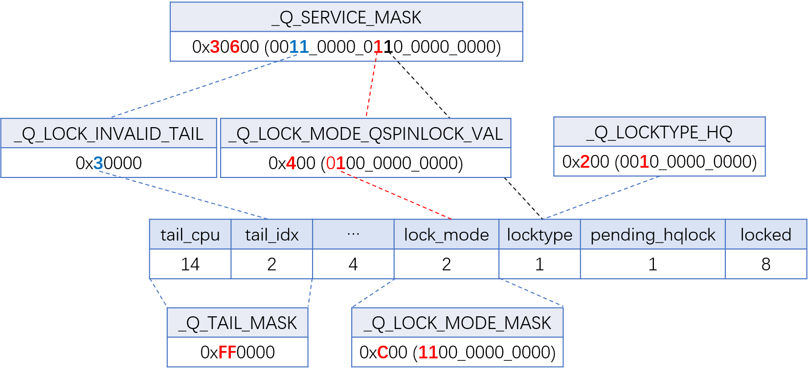

# Hierarchical Queued (HQ) Spinlock

* **Hierarchical Queued (HQ) Spinlock**：NUMA 感知自旋锁，旨在减少高竞争场景下的跨 NUMA 节点缓存行流量，从而提高锁吞吐量。其设计结合了 **Cohort Locking**（Dave Dice）和 Linux 内核原生 **Queued Spinlock (qspinlock)** 的思想，采用两级队列结构，并支持动态模式切换。

## 1. 核心设计思想

- **两级队列**  
  * 每个 NUMA 节点维护一个 **本地 FIFO 队列**（`numa_queue`），存放该节点上的等待线程。
  * 所有 *非空的节点队列* 再通过一个全局的 **节点间链表** 串联起来，保证节点之间的 FIFO 顺序。

- **动态元数据绑定**  
  * 为了避免为每个锁静态预分配 NUMA 队列（开销过大），HQ spinlock 按需分配 `lock_metadata` 结构，通过锁的指针哈希值索引，实现锁与 NUMA 队列的动态绑定。

- **两阶段交接**  
  - **本地交接**：在同一 NUMA 节点的等待队列内，使用 MCS 锁机制交接。  
  - **远程交接**：当本地队列为空时，沿节点间链表找到下一个非空节点队列，将锁交接给该节点的队首线程。

- **可切换模式**  
  * 锁可以在普通 `qspinlock` 模式和 NUMA‑aware 模式之间动态切换。
  * 低竞争时使用普通模式以降低开销，高竞争时自动升级为 HQ 模式。

## 2. 关键数据结构

```c
struct numa_qnode {
    struct mcs_spinlock mcs;   // MCS 节点，内嵌 locked、next
    u16 lock_id;               // 锁的哈希 ID（元数据索引）
    u16 wrong_fallback_tail;   // 模式切换时的辅助字段
    u16 general_handoffs;      // 全局交接计数（用于公平性阈值）
    u16 numa_node;             // 所属 NUMA 节点（1..N）
};

struct numa_queue {
    struct numa_qnode *head;   // 该节点队列的队首
    u64 seq_counter_tail;      // 低位：队列尾索引；高位：元数据序列号
    u16 next_node;             // 节点间链表中的下一个节点 ID
    u16 prev_node;             // 节点间链表中的上一个节点 ID
    u16 handoffs_not_head;     // 远程交接计数（防饥饿）
};

struct lock_metadata {
    atomic_t seq_counter;       // 序列号，标识元数据的“代”
    struct qspinlock *lock_ptr; // 指向拥有该元数据的锁
    union {
        u32 nodes_tail;         // 编码节点链表的头/尾
        struct {
            u16 tail_node;
            u16 head_node;
        };
    };
};
```

- **全局元数据池**：`meta_pool[LOCK_ID_MAX]`，每个锁通过 `hash_ptr(lock, LOCK_ID_BITS)` 获得 `lock_id`，尝试占用对应的 `lock_metadata`。
- **每节点队列表**：`queue_table[MAX_NUMNODES][LOCK_ID_MAX]`，为每个可能的锁在每个 NUMA 节点上预分配一个 `numa_queue`。
- `numa_queue.handoffs_not_head` 记录当前节点队列在非头部情况下被“交给过”的次数。
  - 它会在远程交接时在远程节点队列间传递。
  - 每当远程交接到全局节点队列链表头时被重置为 `0`。
  - 当 `handoff_remote()` 交接给其他 NUMA 节点队列的头部线程时，如果 `handoffs_not_head >= nr_online_nodes`，表示其他节点已经至少各获得过一次锁，而当前节点的头部线程仍然没有拿到锁，此时应强制将锁交接给全局链表头部，而不是 `handoff_info` 指定的下一个节点，以防止头部节点饥饿。

## 3. 动态元数据管理（锁绑定）

- **`grab_lock_meta()`**：尝试将 `lock_metadata` 绑定到当前锁。
  * 若 `meta->lock_ptr` 为 `NULL`，则通过 `cmpxchg_acquire` 将其指向当前锁；
  * 若已指向同一锁，则共享；
  * 若指向其他锁（哈希冲突），则放弃 NUMA 模式，回退到普通 qspinlock。
- **`setup_lock_mode()`**：根据锁当前状态，决定切换到 HQ 模式或保持普通模式。成功绑定后，通过 `set_mode_hqlock()` 在锁的原子值中设置 `_Q_LOCKTYPE_HQ` 和 `_Q_LOCK_MODE_QSPINLOCK_VAL` 标志，告知后续等待者使用 NUMA 感知路径。
- **`release_lock_meta()`**：当锁完全释放且所有节点队列都为空时，清除元数据中的 `lock_ptr`，使该元数据可被其他锁重用。

## 4. 加锁慢路径流程（`queued_spin_lock_slowpath` 的 HQ 扩展）

当锁处于 HQ 模式时，慢路径调用 `hqlock_xchg_tail()` 代替普通的 `xchg_tail()`：

```c
old = hqlock_xchg_tail(lock, tail, node, &numa_awareness_on);
```

- **若锁处于普通模式**：调用 `try_update_tail_qspinlock_mode()`，执行标准 qspinlock 的 `xchg_tail`，若发现 `_Q_LOCK_INVALID_TAIL`（表示正在切换模式），则进行补偿逻辑。
- **若锁处于 HQ 模式或无模式**：调用 `try_update_tail_hqlock_mode()`：
  1. 通过 `setup_lock_mode()` 获得或建立元数据绑定，并读取元数据的 `seq_counter`。
  2. 找到当前 CPU 对应的 `numa_queue`（通过 `numa_node` 和 `lock_id`）。
  3. 使用 `try_cmpxchg` 更新该队列的 `seq_counter_tail`（低位为队列尾索引，高位为 `seq_counter`），若失败说明元数据已被释放或切换，则重试。
  4. 如果是该节点队列的第一个等待者，则调用 `append_node_queue()` 将本节点插入全局节点链表，并返回之前的尾节点（用于后续 MCS 链接）。

- **特殊情况**：当 `old == Q_NEW_NODE_QUEUE` 且 `numa_awareness_on` 为真时，跳过 MCS 自旋，直接进入头部等待（因为第一个入队者需要全局自旋）。

## 5. 解锁与交接流程（`hqlock_clear_tail_handoff`）

锁释放时，当前锁持有者调用 `hqlock_try_clear_tail()` 判断下一步动作：

- **本地队列非空**：返回 `HQLOCK_HANDOFF_LOCAL`，随后 `hqlock_handoff()` 执行本地交接：将锁传给本节点队列的下一个 `numa_qnode`，并增加 `general_handoffs` 计数器。
- **本地队列空，但有其他节点队列**：
  - 若节点链表中有后继节点，返回后继节点 ID（>0），执行远程交接。
  - 若当前节点是链表尾且链表头不是自身（即只有自己一个节点但可能有新节点正在加入），返回 `HQLOCK_HANDOFF_REMOTE_HEAD`，表示需要交接给链表头节点。
- **若所有队列都空**：调用 `release_lock_meta()` 释放元数据，并将锁切回普通模式（清除 HQ 标志）。

**交接细节**：
- **本地交接** (`handoff_local`)：更新 `queue->head` 为下一个 MCS 节点，调用 `arch_mcs_spin_unlock_contended()` 唤醒下一个线程。同时将 `general_handoffs` 传递给后继 MCS 节点。
- **远程交接** (`handoff_remote`)：通过 `lock_metadata` 找到链表头节点 `head_node`（或指定节点），获取其 `head` 线程，直接唤醒它。同时更新 `handoffs_not_head` 计数器以防止头部饥饿。

## 6. 公平性与饥饿避免

- **交接阈值**：每个锁维护一个 `general_handoffs` 计数器，记录该锁已被交接的次数。当该值超过 `hqlock_fairness_threshold`（可配置）时，即使本地队列非空，也 **强制进行一次远程交接**，将锁交给其他节点上的等待者。
- **头部节点保护**：节点链表中的头部节点如果长期未被服务，其 `handoffs_not_head` 会递增。当该值达到在线节点数时，下次远程交接会 **强制交给头部节点**，防止尾部节点“插队”。

## 7. 动态模式切换

- **进入 HQ 模式**：在锁释放时，如果 `determine_contention_qspinlock_mode()` 检测到高竞争（`general_handoffs` 超过预设阈值 `hqlock_general_handoffs_turn_numa`），则在 `low_contention_try_clear_tail()` 中设置 `_Q_LOCK_INVALID_TAIL`，使后续加锁者进入 HQ 路径，并尝试绑定元数据。
- **退出 HQ 模式**：当锁完全释放且所有队列为空时，`release_lock_meta()` 会清除锁中的 HQ 标志，将锁恢复为普通 qspinlock。

## 8. 初始化与配置

- **内核配置**：`CONFIG_HQSPINLOCKS` 依赖 `NUMA` 和 `QUEUED_SPINLOCKS`，不支持大端架构。
- **启动参数**：`numa_spinlock=auto/on/off` 控制是否启用 HQ spinlock。
- **元数据分配**：在 `hq_configure_spin_lock_slowpath()` 中调用 `hqlock_alloc_global_queues()`，使用 `memblock_alloc_range_nid()` 为元数据池和每节点队列表预留内存。
- **锁初始化**：提供 `spin_lock_init_hq()` / `DEFINE_SPINLOCK_HQ()` 宏，初始化的锁会带有 `_Q_LOCKTYPE_HQ | _Q_LOCK_MODE_QSPINLOCK_VAL` 标志，表示其支持 HQ 模式但初始处于普通模式。

## 9. 与现有 CNA 锁的差异

- **CNA (Compact NUMA-aware)** 使用简单的双队列（主队列+辅助队列），HQ spinlock 则为每个 NUMA 节点维护独立队列，形成更精细的层次结构。
- **元数据动态绑定**：CNA 需要为每个锁预留额外的 `cna_node` 空间（通过 `struct qnode` 扩充），而 HQ 通过全局池按需绑定，理论上可以服务更多锁。
- **交接阈值**：CNA 通过 `intra_node_threshold` 控制是否切回主队列，HQ 使用 `general_handoffs` 和 `handoffs_not_head` 双重机制。

## 总结

Hierarchical Queued Spinlock 通过两级队列、动态元数据绑定和智能交接策略，在保持 qspinlock 低开销的同时，显著减少了高竞争下的跨 NUMA 缓存一致性流量。其设计兼顾了**局部性**（优先本地交接）、**公平性**（阈值强制远程交接）和**可伸缩性**（按需元数据分配），是对 Linux 内核自旋锁机制的一次重要 NUMA 优化尝试。

## 函数解析

### 全局数据结构初始化 `hqlock_alloc_global_queues()`

```c
/*
 * hqlock_alloc_global_queues - 初始化 HQ spinlock 所需的全局数据结构
 * 
 * 该函数在系统启动早期（通过 hq_configure_spin_lock_slowpath() 调用）执行，
 * 负责分配以下两类内存：
 *   1. lock_metadata 池：大小为 LOCK_ID_MAX 的元数据数组，每个元数据对应一个可能的锁哈希值
 *      （通过 hash_ptr(lock, LOCK_ID_BITS) 索引）。
 *   2. 每 NUMA 节点的队列表：每个节点有一个长度为 LOCK_ID_MAX 的 numa_queue 数组，用于存放该节点上每个锁的本地队列。
 *
 * 所有分配均使用 memblock_alloc_range_nid() 在 NUMA 节点本地内存上完成，以保证访问局部性。
 * 若分配失败则直接 panic，因为系统无法继续运行。
 */
static void __init hqlock_alloc_global_queues(void)
{
    int nid;
    phys_addr_t phys_addr;

    /* ========== 1. 分配 lock_metadata 池 ========== */
    unsigned long meta_pool_size = sizeof(struct lock_metadata) * LOCK_ID_MAX;

    pr_info("Init HQspinlock lock_metadata info: size = %lu B\n", meta_pool_size);
    /*
     * 使用 memblock 在任意节点上分配连续的物理内存（不指定 NUMA 节点），对齐到 L1 缓存行大小。
	 * meta_pool 全局指针指向虚拟地址。
     */
    phys_addr = memblock_alloc_range_nid(
                    meta_pool_size, L1_CACHE_BYTES, 0,
                    MEMBLOCK_ALLOC_ACCESSIBLE, NUMA_NO_NODE, false);

    if (!phys_addr)
        panic("HQspinlock lock_metadata metadata info: allocation failure.\n");

    meta_pool = phys_to_virt(phys_addr);
    memset(meta_pool, 0, meta_pool_size);

    /* 初始化每个元数据的 seq_counter 为 0 */
    for (int i = 0; i < LOCK_ID_MAX; i++)
        atomic_set(&meta_pool[i].seq_counter, 0);
    /* ========== 2. 为每个 NUMA 节点分配队列表 ========== */
    /* 每个节点上的队列表大小：LOCK_ID_MAX 个 numa_queue 结构 */
    unsigned long queues_size = LOCK_ID_MAX *
                                ALIGN(sizeof(struct numa_queue), L1_CACHE_BYTES);

    pr_info("Init HQspinlock per-NUMA metadata (per-node size = %lu B)\n", queues_size);
    /* 遍历所有在线 NUMA 节点 */
    for_each_node(nid) {
        /* 在每个节点本地内存上分配该节点的队列表，提高访问效率 */
        phys_addr = memblock_alloc_range_nid(
            queues_size, L1_CACHE_BYTES, 0, MEMBLOCK_ALLOC_ACCESSIBLE,
            nid, false);

        if (!phys_addr)
            panic("HQspinlock per-NUMA metadata: allocation failure for node %d.\n", nid);
        /* 保存虚拟地址到全局 queue_table 数组（每个节点一个指针） */
        queue_table[nid] = phys_to_virt(phys_addr);
        memset(queue_table[nid], 0, queues_size);
    }
}
```

#### 关键设计要点

1. **内存分配时机**  
   * 函数标记为 `__init`，在系统启动早期、SMP 初始化之前通过 `hq_configure_spin_lock_slowpath()` 调用。
   * 此时 `memblock` 分配器可用，而 `kmalloc` 尚未就绪，因此使用 `memblock_alloc_range_nid()`。

2. **元数据池大小**  
   * `LOCK_ID_MAX` 由 `LOCK_ID_BITS` 决定（补丁中定义为 `12`，即 `4096` 个条目）。
   * 这个值必须足够大，以减少不同锁之间的哈希冲突，同时又不至于浪费过多内存。
   * 每个 `lock_metadata` 约为 `16` 字节（包含 `atomic_t`、指针和两个 `u16`），总大小约 `64KB`，开销可接受。

3. **每节点队列表大小**  
   * 每个节点上的 `numa_queue` 数组长度为 `LOCK_ID_MAX`，每个 `numa_queue` 约为 32 字节（含 `head` 指针、`seq_counter_tail`、`next_node`、`prev_node`、`handoffs_not_head`，对齐后可能更大）。
   * 假设 4 个节点，总内存约为 `4 * 4096 * 32 = 512KB`，仍在合理范围内。

4. **NUMA 本地分配**  
   使用 `memblock_alloc_range_nid(..., nid, ...)` 确保每个节点的队列表分配在该节点的本地内存上，以减少跨节点访问延迟。

5. **失败处理**  
   若任何分配失败，直接调用 `panic()`，因为缺少这些数据结构 HQ spinlock 无法工作。由于系统刚启动，内存压力很小，此情况极少发生。

6. **对齐要求**  
   通过 `ALIGN(sizeof(struct numa_queue), L1_CACHE_BYTES)` 将每个 `numa_queue` 对齐到缓存行边界，避免 false sharing。元数据池也按 `L1_CACHE_BYTES` 对齐，提高访问效率。

### HQ Spinlock 的加锁慢速路径 `queued_spin_lock_slowpath()`

HQ Spinlock 引入了新的锁字掩码如下：



以下是打过 HQ spinlock 补丁后的 `queued_spin_lock_slowpath()` 函数的详细注释。该函数整合了原生 qspinlock 慢路径和 NUMA 感知的 HQ 模式，根据锁的状态动态选择路径。

```c
/*
 * queued_spin_lock_slowpath - 获取排队自旋锁的慢路径
 * @lock: 锁指针
 * @val:  锁的当前原子值（由快速路径传入）
 *
 * 整体流程：
 *   1. 处理 pending 位优化路径（如果可能）。
 *   2. 如果无法直接获取锁，则入队到 MCS 等待队列。
 *   3. 根据锁是否处于 HQ 模式，选择普通 qspinlock 入队或 NUMA 感知入队。
 *   4. 当成为队列头部时，等待锁释放，然后获取锁。
 *   5. 在锁释放时，根据模式选择交接策略（普通 MCS 交接或 HQ 本地/远程交接）。
 *
 * HQ 模式特有的改动：
 *   - 识别锁值中的 _Q_LOCKTYPE_HQ 和 _Q_LOCK_MODE_QSPINLOCK_VAL 标志。
 *   - 使用 hqlock_xchg_tail() 代替 xchg_tail()，实现动态模式选择。
 *   - 使用 hqlock_clear_pending() / hqlock_clear_pending_set_locked() 保留模式位。
 *   - 使用 hqlock_clear_tail_handoff() 处理解锁时的交接。
 */
void __lockfunc queued_spin_lock_slowpath(struct qspinlock *lock, u32 val)
{
    struct mcs_spinlock *prev, *next, *node;
    u32 old, tail;
    int idx;

#if defined(_GEN_HQ_SPINLOCK_SLOWPATH) && !defined(_GEN_PV_LOCK_SLOWPATH)
    /* HQ 模式特有：从锁值中解析是否为 NUMA 锁以及当前是否处于 NUMA 感知状态 */
    bool is_numa_lock = val & _Q_LOCKTYPE_MASK;
    bool numa_awareness_on = is_numa_lock && !(val & _Q_LOCK_MODE_QSPINLOCK_VAL);
#endif

    BUILD_BUG_ON(CONFIG_NR_CPUS >= (1U << _Q_TAIL_CPU_BITS));

    if (pv_enabled())
        goto pv_queue;

    if (virt_spin_lock(lock))
        return;

    /*
     * 等待 pending 位被清除（如果当前是 pending 状态）。
     * 注意：原生的 _Q_PENDING_VAL 比较现在需要屏蔽 _Q_SERVICE_MASK，
     * 因为 HQ 模式在锁值中使用了额外的服务位。
     */
    if ((val & ~_Q_SERVICE_MASK) == _Q_PENDING_VAL) {
        int cnt = _Q_PENDING_LOOPS;
        val = atomic_cond_read_relaxed(&lock->val,
                        ((VAL & ~_Q_SERVICE_MASK) != _Q_PENDING_VAL) || !cnt--);
    }

    /* 如果已有任何等待者（tail 非零或 pending 被设置），直接进入队列 */
    if (val & ~(_Q_LOCKED_MASK | _Q_SERVICE_MASK))
        goto queue;

    /*
     * 尝试设置 pending 位（快速路径）。
     * 使用 queued_fetch_set_pending_acquire()，它返回旧值。
     */
    val = queued_fetch_set_pending_acquire(lock);

    /* 如果设置 pending 后发现已有竞争，则撤销 pending 并进入队列 */
    if (unlikely(val & ~(_Q_LOCKED_MASK | _Q_SERVICE_MASK))) {
        if (!(val & _Q_PENDING_VAL)) {
#if defined(_GEN_HQ_SPINLOCK_SLOWPATH) && !defined(_GEN_PV_LOCK_SLOWPATH)
            /* HQ 模式：清除 pending 时保留模式位 */
            hqlock_clear_pending(lock, val);
#else
            clear_pending(lock);
#endif
        }
        goto queue;
    }

    /* 如果锁已被持有，等待锁释放（pending 位已设置） */
    if (val & _Q_LOCKED_MASK)
        smp_cond_load_acquire(&lock->locked_pending, !(VAL & _Q_LOCKED_MASK));

    /* 获取锁并清除 pending 位 */
#if defined(_GEN_HQ_SPINLOCK_SLOWPATH) && !defined(_GEN_PV_LOCK_SLOWPATH)
    hqlock_clear_pending_set_locked(lock, val);
#else
    clear_pending_set_locked(lock);
#endif
    lockevent_inc(lock_pending);
    return;

queue:
    lockevent_inc(lock_slowpath);
pv_queue:
    /* 获取当前 CPU 的 MCS 节点 */
    node = this_cpu_ptr(&qnodes[0].mcs);
    idx = node->count++;
    tail = encode_tail(smp_processor_id(), idx);

    trace_contention_begin(lock, LCB_F_SPIN);

    /* 如果节点索引超出预分配数量（通常 4），则自旋重试 */
    if (unlikely(idx >= _Q_MAX_NODES)) {
        lockevent_inc(lock_no_node);
        while (!queued_spin_trylock(lock))
            cpu_relax();
        goto release;
    }

    node = grab_mcs_node(node, idx);
    barrier();
    node->locked = 0;
    node->next = NULL;
    pv_init_node(node);

    /* 再试一次 trylock，可能锁已被释放 */
    if (queued_spin_trylock(lock))
        goto release;

    /* 确保节点初始化完成后再发布 tail */
    smp_wmb();

    /*
     * 发布 tail（入队）。
     * 根据锁模式选择不同的 xchg_tail 实现：
     *   - 如果是 NUMA 锁，调用 hqlock_xchg_tail()，它会根据锁状态选择普通或 HQ 入队。
     *   - 否则使用原生 xchg_tail()。
     */
#if defined(_GEN_HQ_SPINLOCK_SLOWPATH) && !defined(_GEN_PV_LOCK_SLOWPATH)
    if (is_numa_lock)
        old = hqlock_xchg_tail(lock, tail, node, &numa_awareness_on);
    else
        old = xchg_tail(lock, tail);

    /* HQ 模式特殊：如果 old == Q_NEW_NODE_QUEUE，表示当前线程是本地队列的第一个，
       且全局链表已有其他节点，因此需要直接进入 MCS 自旋（跳过再次尝试链接） */
    if (numa_awareness_on && old == Q_NEW_NODE_QUEUE)
        goto mcs_spin;
#else
    old = xchg_tail(lock, tail);
#endif

    next = NULL;

    /* 如果旧 tail 非零，说明有前驱节点，需要链接并等待 */
    if (old & _Q_TAIL_MASK) {
        prev = decode_tail(old, qnodes);
        WRITE_ONCE(prev->next, node);
        pv_wait_node(node, prev);
#if defined(_GEN_HQ_SPINLOCK_SLOWPATH) && !defined(_GEN_PV_LOCK_SLOWPATH)
mcs_spin:
#endif
        arch_mcs_spin_lock_contended(&node->locked);

        /* 预取下一个节点，为解锁做准备 */
        next = READ_ONCE(node->next);
        if (next)
            prefetchw(next);
    }

    /* 现在成为队列头部，等待锁释放（locked 和 pending 位清零） */
    if ((val = pv_wait_head_or_lock(lock, node)))
        goto locked;

    val = atomic_cond_read_acquire(&lock->val, !(VAL & _Q_LOCKED_PENDING_MASK));

locked:
    /*
     * 获取锁。
     * 如果锁是 NUMA 模式，则使用 hqlock_clear_tail_handoff() 处理解锁和交接；
     * 否则使用普通逻辑。
     */
#if defined(_GEN_HQ_SPINLOCK_SLOWPATH) && !defined(_GEN_PV_LOCK_SLOWPATH)
    if (is_numa_lock) {
        hqlock_clear_tail_handoff(lock, val, tail, node, next, prev, numa_awareness_on);
        goto release;
    }
#endif
    /* 普通 qspinlock 模式：尝试清除 tail 并设置 locked */
    if ((val & _Q_TAIL_MASK) == tail) {
        if (atomic_try_cmpxchg_relaxed(&lock->val, &val, _Q_LOCKED_VAL))
            goto release;
    }

    set_locked(lock);

    if (!next)
        next = smp_cond_load_relaxed(&node->next, (VAL));

    arch_mcs_spin_unlock_contended(&next->locked);
    pv_kick_node(lock, next);

release:
    trace_contention_end(lock, 0);
    __this_cpu_dec(qnodes[0].mcs.count);
}
```

#### 主要改动总结

1. **模式识别**：从锁值中读取 `_Q_LOCKTYPE_MASK` 和 `_Q_LOCK_MODE_QSPINLOCK_VAL` 来确定是否使用 HQ 模式。
2. **pending 操作**：使用 `hqlock_clear_pending()` 和 `hqlock_clear_pending_set_locked()` 替代原生函数，以保留锁值中的模式位。
3. **入队**：当锁是 NUMA 锁时，调用 `hqlock_xchg_tail()` 实现动态路径选择，并处理 `Q_NEW_NODE_QUEUE` 特殊返回值。
4. **解锁**：当锁是 NUMA 锁时，调用 `hqlock_clear_tail_handoff()` 处理交接，否则走普通 MCS 交接。
5. **服务位屏蔽**：所有检查锁值的地方都使用 `~_Q_SERVICE_MASK` 屏蔽掉 HQ 模式使用的额外标志位，避免干扰原有逻辑。

这些修改使得同一个慢路径函数能够在原生 qspinlock 和 NUMA 感知 HQ 模式之间无缝切换，同时保持对 PV 和 virt 锁的兼容性。

### 加锁慢路径函数

#### `set_lock_mode()` - 设置锁字中的锁模式

```c
// 构造锁值的模式部分
static inline u32 encode_lock_mode(u16 lock_id)
{
    if (lock_id == LOCK_ID_NONE)
        return LOCK_MODE_QSPINLOCK << _Q_LOCK_MODE_OFFSET;

    return LOCK_MODE_HQLOCK << _Q_LOCK_MODE_OFFSET;
}

/*
 * set_lock_mode - 尝试更新锁的原子值，以设置 HQ 模式或普通 qspinlock 模式
 * @lock:      目标锁指针
 * @__val:     锁当前的原子值（传入前由调用者读取）
 * @lock_id:   锁的元数据索引（若 lock_id == LOCK_ID_NONE 表示要设置为普通模式）
 *
 * 返回值：
 *   LOCK_MODE_HQLOCK    - 成功设置为 HQ 模式
 *   LOCK_MODE_QSPINLOCK - 成功设置为普通 qspinlock 模式
 *   LOCK_NO_MODE        - 设置失败（因锁值 val 在循环中被其他 CPU 改变，或 pending 位未清除）
 *
 * 核心逻辑：
 *   1. 等待锁的 pending 位被清除（如果 pending 被设置，不能直接修改锁值 val，否则可能破坏锁状态）。
 *   2. 根据 lock_id 决定要写入的新值：
 *      若启用 HQ 模式则保留锁尾 tail 并设置模式位；
 *      若关闭 HQ 模式则清除 _Q_LOCK_INVALID_TAIL 并清除模式位。
 *   3. 使用原子 CAS 尝试更新锁值 val，成功后返回对应模式。
 *   4. 若 CAS 失败或检测到锁模式已被其他 CPU 设置，则返回 LOCK_NO_MODE 让调用者重试。
 *
 * 注：该函数在 setup_lock_mode() 中被调用，用于实际发布模式切换。
 */
static inline hqlock_mode_t set_lock_mode(struct qspinlock *lock, int __val, u16 lock_id)
{
    u32 val = (u32)__val;
    u32 new_val = 0;
    u32 lock_mode = encode_lock_mode(lock_id);

    /* 循环直到成功更新锁值 val，或遇到无法继续的情况 */
    while (!(val & _Q_LOCK_MODE_MASK)) {
        /*
         * 等待 pending 位被清除。
         * 如果锁的 pending 位被设置（表示有线程正在通过 pending 快速路径获取锁），
         * 我们不能直接修改锁值，否则可能清除 pending 位并破坏锁状态。
         * 必须等到 pending 位被清除后，才能安全地修改锁的模式位。
         */
        if (val & _Q_PENDING_VAL) {
            /* 条件读取：等待 pending 位被清除，同时可能锁模式已被其他 CPU 设置 */
            val = atomic_cond_read_relaxed(&lock->val, !(VAL & _Q_PENDING_VAL)); //[自旋点]
            /* 如果在等待期间锁模式已被设置（其他 CPU 抢先），则放弃本次尝试 */
            if (val & _Q_LOCK_MODE_MASK)
                return LOCK_NO_MODE;
        }
        /*
         * 构造新的锁值：
         * - 如果要启用 NUMA 感知（lock_id != LOCK_ID_NONE）：
         *   保留锁的原有值（包括 tail、locked、pending），并加上 HQ 模式标志。
         * - 如果要切换回普通模式（lock_id == LOCK_ID_NONE）：
         *   清除 _Q_LOCK_INVALID_TAIL 标志（如果有），并清除模式位，
         *   同时保留 locked/pending/tail 原有值。
         */
        if (lock_id != LOCK_ID_NONE)
            new_val = val | lock_mode;
        else
            new_val = (val & ~_Q_LOCK_INVALID_TAIL) | lock_mode;
        /*
         * 如果要启用 HQ 模式，需要确保元数据中的 seq_counter 更新（在分配元数据时已递增）已经被全局可见，
         * 之后才发布锁的模式位。
         * 此写屏障与 setup_lock_mode() 中的 smp_rmb() 配对，保证其他 CPU 在读取到锁模式为 HQ 之前，
         * 能够看到 seq_counter 的正确值。
         */
        if (lock_id != LOCK_ID_NONE)
            smp_wmb();
        /* 原子尝试更新锁的值，使用 relaxed 顺序（因为成功后的顺序由其他操作保证） */
        bool updated = atomic_try_cmpxchg_relaxed(&lock->val, &val, new_val);//[更新锁值点]

        if (updated) {
            /* 成功锁值更新，根据 lock_id 返回对应的模式 */
            return (lock_id == LOCK_ID_NONE) ?
                LOCK_MODE_QSPINLOCK : LOCK_MODE_HQLOCK;
        }
        /*
         * 走到这里意味着 CAS 失败，说明在循环过程中锁的 val 已被其他 CPU 修改。
         * 此时 val 已被 atomic_try_cmpxchg_relaxed() 更新为最新的锁值，无需再次读取，
         * 继续循环，重新检查条件。
         */
    }
    /* 如果退出循环时 val 已经包含 _Q_LOCK_MODE_MASK，说明模式已被其他 CPU 设置 */
    return LOCK_NO_MODE;
}
```

##### 关键设计要点

1. **pending 位等待**  
   当锁的 pending 位被设置时，表示有一个线程正在通过“pending 快速路径”获取锁（该路径在锁仅有锁持有者而无等待者时使用）。此时如果直接修改锁的 `val`（例如设置模式位），可能会错误地清除 pending 位或导致锁状态不一致。因此必须等待 pending 位被清除后才能安全更新。

2. **_Q_LOCK_INVALID_TAIL 的处理**  
   当锁要从普通模式切换到 HQ 模式时，之前可能有一些线程在普通模式下已经设置了 `_Q_LOCK_INVALID_TAIL` 标志（该标志表示“tail 无效，请走 HQ 路径”）。因此，若要切换回普通模式时，需要清除该标志，以便后续普通模式的 `xchg_tail()` 能够正常工作。

3. **内存屏障的放置**  
   `smp_wmb()` 仅在启用 HQ 模式时使用，确保 `seq_counter` 的写入（在 `grab_lock_meta` 中完成）在锁的模式位发布之前对其它 CPU 可见。这是因为其他 CPU 在看到锁模式变为 HQ 后，会立即读取元数据中的 `seq_counter` 来验证队列的有效性；如果 `seq_counter` 尚未传播，可能导致错误的验证失败。

4. **CAS 失败处理**  
   `atomic_try_cmpxchg_relaxed()` 在失败时会自动将 `val` 更新为当前锁值，因此循环可以继续。如果循环条件 `!(val & _Q_LOCK_MODE_MASK)` 不满足（即锁模式已经被其他 CPU 设置），则函数返回 `LOCK_NO_MODE`，让调用者（`setup_lock_mode`）重试或回退。

#### `setup_lock_mode()` - 设置锁模式

```c
/*
 * setup_lock_mode - 尝试将锁设置为 HQ 模式（NUMA 感知）或回退到普通 qspinlock 模式
 * @lock:          目标锁指针
 * @lock_id:       通过哈希计算的锁元数据索引（0 到 LOCK_ID_MAX-1）
 * @meta_seq_counter: 输出参数，返回元数据当前的序列号（用于后续队列操作）
 *
 * 返回值：
 *   LOCK_MODE_HQLOCK    - 成功进入 NUMA 感知模式
 *   LOCK_MODE_QSPINLOCK - 使用普通 qspinlock 模式（因哈希冲突或配置原因）
 *   LOCK_NO_MODE        - 临时状态，需要重试（实际循环中不会返回此值）
 *
 * 核心逻辑：
 *   1. 如果锁已经处于 HQ 模式，验证元数据仍归属于本锁（通过 seq_counter 检查），
 *      若验证通过则直接返回 HQ 模式。
 *   2. 如果锁处于普通 qspinlock 模式，直接返回该模式。
 *   3. 否则锁处于“无模式”状态（_Q_LOCK_MODE_MASK == 0），此时需要竞争元数据所有权，
 *      并尝试将锁切换到 HQ 模式；若元数据冲突则回退到普通模式。
 */
static inline
hqlock_mode_t setup_lock_mode(struct qspinlock *lock, u16 lock_id, u32 *meta_seq_counter)
{
    hqlock_mode_t mode;

    do {
        enum meta_status status;
        int val = atomic_read(&lock->val);

        /* ---------- 锁已经处于 NUMA 感知模式 ---------- */
        if (is_mode_hqlock(val)) {
            struct lock_metadata *lock_meta = get_meta(lock_id);
            /*
             * 锁当前处于 LOCK_MODE_HQLOCK，但我们必须确保关联的元数据没有被其他锁占用（即没有发生哈希冲突）。
             *
             * 可能发生的几种情况：
             * [情况1] 另一个锁正在使用同一个元数据（哈希冲突）
             * [情况2] 元数据在刚被释放后又重新分配给了本锁（同一锁的不同生命周期）
             * [情况3] 元数据空闲，无人使用
             * [情况4] 锁模式已被切换回 LOCK_MODE_QSPINLOCK
             */
            /* 读取元数据的当前序列号（该序列号在元数据分配时递增） */
            int seq_counter = atomic_read(&lock_meta->seq_counter);
            /*
             * 需要保证“seq_counter”的读取发生在“lock->val”再次读取之前。
             * 否则，如果另一个 CPU 刚刚释放了元数据并清除了锁的 HQ 标志，
             * 我们可能读到旧的 seq_counter 但新的锁值，造成错误判断。
             * 此读屏障与 set_lock_mode() 中的 smp_wmb() 配对，
             * 确保在 HQ 标志发布之前，seq_counter 的更新已经全局可见。
             */
            smp_rmb();
            val = atomic_read(&lock->val);

            /* 再次检查锁是否仍处于 HQ 模式 */
            if (is_mode_hqlock(val)) {
                /* 模式仍然有效，将序列号返回给调用者（用于后续入队验证） */
                *meta_seq_counter = (u32)seq_counter;
                return LOCK_MODE_HQLOCK;
            }
            /*
             * 如果走到这里，说明锁模式已经不是 HQ 模式了，可能有两种情况：
             *   1. [情况3]，元数据空闲，无人使用，需要重新尝试获取所有权并发布 HQ 模式。
             *   2. [情况4]，锁已经切换回 LOCK_MODE_QSPINLOCK 模式。
             * 无论哪种，都跳出当前分支，继续循环（重新读取 lock->val）。
             */
            continue;
        }
        /* ---------- 情况4：锁已经处于普通 qspinlock 模式 ---------- */
        else if (is_mode_qspinlock(val)) {
            return LOCK_MODE_QSPINLOCK;
        }
        /* ---------- 锁处于“无模式”状态（尚未决定使用哪种模式） ---------- */
        /*
         * 尝试获取元数据的“弱”所有权（即临时绑定）。
         * grab_lock_meta 可能返回：
         *   META_GRABBED   - 成功获取所有权（此前 lock_ptr 为 NULL）
         *   META_SHARED    - 元数据已被同一锁的其他竞争者占用（lock_ptr == lock）
         *   META_CONFLICT  - 元数据被其他锁占用（哈希冲突）
         */
        status = grab_lock_meta(lock, lock_id, meta_seq_counter);
        if (status == META_SHARED) {
            /*
             * 已有其他线程为本锁占用了元数据，并且可能正在尝试发布 HQ 模式。
             * 我们可以快速循环几次，等待锁的 val 中出现 HQ 标志，
             * 或者最终该元数据被释放（极少情况）。直接 continue 重试即可。
             */
            continue;
        }
        /* 根据元数据获取结果，尝试设置锁的模式（HQ 或回退到 qspinlock） */
        if (status == META_GRABBED)
            mode = set_mode_hqlock(lock, val, lock_id);
        else if (status == META_CONFLICT)
            mode = set_mode_qspinlock(lock, val);
        else
            BUG_ON(1);   /* 未预期的状态 */
        /*
         * 如果我们成功获取了元数据（status == META_GRABBED），但最终
         * set_mode_hqlock() 未能将锁切换到 HQ 模式（例如因为锁值在此期间被改变，或由于竞争导致模式设置失败），
         * 则我们需要释放刚刚占用的元数据，以便其他锁可以使用它。
         */
        if (status == META_GRABBED && mode != LOCK_MODE_HQLOCK) {
            smp_store_release(&meta_pool[lock_id].lock_ptr, NULL);
#ifdef CONFIG_HQSPINLOCKS_DEBUG
            atomic_dec(&cur_buckets_in_use);
#endif
        }
        /* 如果 mode == LOCK_NO_MODE，循环继续尝试；否则退出循环 */
    } while (mode == LOCK_NO_MODE);
    //[情况1] 和 [情况3] 能走到这里
    return mode;
}
```

##### 关键设计要点

1. **元数据序列号（seq_counter）的作用**  
   * 每次元数据被重新分配（绑定到一个新锁）时，`seq_counter` 会原子递增。
   * 每个 NUMA 节点的队列头中保存了该序列号。当线程入队时，会检查队列中保存的序列号是否与当前元数据的序列号匹配，若不匹配则说明元数据已被释放并重新分配给其他锁，此时必须重新执行绑定流程，从而避免了使用过期的队列结构。

2. **内存屏障配对**  
   - `smp_rmb()` 在 `setup_lock_mode()` 中用于确保读取 `seq_counter` 之后才读取 `lock->val`，防止读到过期的 HQ 标志。  
   - `set_lock_mode()` 中的 `smp_wmb()` 在更新 `lock->val` 之前，确保元数据中 `seq_counter` 的递增已经全局可见。两者配合保证了元数据代次与锁模式的一致性。

3. **`META_SHARED` 的快速路径**  
   当 `grab_lock_meta()` 返回 `META_SHARED` 时，说明元数据已经被当前锁的其他等待者占用，且很可能锁的 `val` 即将变为 HQ 模式。此时无需再竞争元数据，直接重试读取 `lock->val` 即可，减少了原子操作开销。

4. **回退到普通 qspinlock 的条件**  
   元数据哈希冲突（`META_CONFLICT`）或 `set_mode_hqlock()` 失败时，会调用 `set_mode_qspinlock()` 将锁切换到普通模式。此后，该锁的生命周期内将不再尝试 NUMA 感知，直到锁完全释放后重新进入“无模式”状态。

5. **并发释放元数据的处理**  
   在 `status == META_GRABBED` 但未能成功设置 HQ 模式时，代码通过 `smp_store_release` 将 `lock_ptr` 置为 `NULL`，并递减使用计数。这保证了后续竞争者能够重新获取该元数据，不会因为残留指针而导致死锁。

#### `try_update_tail_qspinlock_mode()`

```c
/*
 * try_update_tail_qspinlock_mode - 在普通 qspinlock 模式下尝试更新锁的全局 tail
 * @lock:      目标锁指针
 * @tail:      当前线程编码后的 tail 值（标准 qspinlock 格式，已包含 CPU 和节点索引）
 * @old_tail:  输出参数，返回更新前锁的 tail 值（若成功）或 0（若模式切换后直接成功）
 * @next_tail: 输入/输出参数，最初等于 tail；若因模式切换导致 xchg_tail() 返回 _Q_LOCK_INVALID_TAIL，
 *             则可能更新为从锁值中读取到的有效 tail，供后续重试使用。
 *
 * 返回值：
 *   true  - 成功在普通模式下完成 tail 更新（或成功处理了模式切换，锁已变为普通模式）
 *   false - 需要回退到 HQ 模式路径（锁当前处于 HQ 模式，且未能恢复 _Q_LOCK_INVALID_TAIL）
 *
 * 核心逻辑：
 *   1. 尝试执行标准的 xchg_tail() 操作，将当前线程的 tail 写入锁的全局 tail 字段。
 *   2. 如果返回的旧值不是 _Q_LOCK_INVALID_TAIL（特殊标志，表示锁正处于模式切换中），
 *      则正常返回旧 tail，表示成功入队到全局队列。
 *   3. 如果返回 _Q_LOCK_INVALID_TAIL，说明锁当前不在普通模式（可能正在切换到 HQ 模式，或已经处于 HQ 模式）。
 *      此时必须：
 *       a) 读取锁当前值，判断锁模式。
 *       b) 如果锁已经变为普通模式，则直接返回成功（旧 tail 为 0，表示没有前驱）。
 *       c) 否则，通过 CAS 将锁值中的 _Q_LOCK_INVALID_TAIL 重新设置（保持该标志），
 *          同时保留锁的其他位（locked、pending、模式位等）。
 *       d) 如果在 CAS 过程中发现锁值变化（可能模式切换已完成），则记录新的 tail 到 *next_tail，
 *          并返回 false，让调用者重试 HQ 路径。
 *
 * 注：此函数主要用于处理锁从普通模式向 HQ 模式切换时的过渡期，避免多个 CPU 同时看到 _Q_LOCK_INVALID_TAIL 导致混乱。
 */
static inline bool try_update_tail_qspinlock_mode(struct qspinlock *lock, u32 tail, u32 *old_tail, u32 *next_tail)
{
    /*
     * next_tail 初始通常等于 tail，但如果之前有过一次失败的调用，
     * 它可能保存了从锁中读取到的其他 CPU 的 tail（极端情况）。
     * 使用 *next_tail 执行 xchg_tail，避免丢失已经排队的线程。
     */
    u32 xchged_tail = xchg_tail(lock, *next_tail);
    /* 常见情况：2. 返回的不是 _Q_LOCK_INVALID_TAIL，说明锁处于普通模式，入队成功 */
    if (likely(xchged_tail != _Q_LOCK_INVALID_TAIL)) {
        *old_tail = xchged_tail;
        return true;
    }
    /*
     * 返回 _Q_LOCK_INVALID_TAIL，表示锁不在普通模式（可能是 HQ 模式或正在切换）。
     * 此时需要进一步处理，避免后续线程无限重试。
     */
    u32 val = atomic_read(&lock->val);
    bool fixed = false;

    /* 循环直到确定锁的模式，并恢复 _Q_LOCK_INVALID_TAIL 标志（如果仍需保持 HQ 模式） */
    while (!fixed) {
        /* 如果锁已经变为普通模式（可能其他 CPU 完成了模式切换），直接返回成功 */
        if (decode_lock_mode(val) == LOCK_MODE_QSPINLOCK) {
            *old_tail = 0;   /* 没有前驱，调用者应视为自己是队列第一个 */
            return true;
        }
        /*
         * 锁仍处于 HQ 模式或“无模式”状态，需要重新设置 _Q_LOCK_INVALID_TAIL，
         * 以防止后续普通模式的 xchg_tail() 继续错误地返回该标志。
         * 构造新值：保留锁的 locked、pending、以及锁类型/模式位（_Q_LOCK_TYPE_MODE_MASK），
         * 并将 tail 字段设置为 _Q_LOCK_INVALID_TAIL。
         *
         * 使用 CAS 是为了防止在读取 val 之后，锁模式又变回普通模式。
         * 如果 CAS 成功，则标志恢复完成；如果失败，则 val 被更新为最新值，循环继续。
         */
        fixed = atomic_try_cmpxchg_relaxed(&lock->val, &val, //失败会刷新 val 的值
                _Q_LOCK_INVALID_TAIL | (val & (_Q_LOCKED_PENDING_MASK | _Q_LOCK_TYPE_MODE_MASK)));
    }
    /*
     * 如果从锁值中读取到的 tail（低 32 位 tail 字段）与传入的 tail 不同，
     * 说明在本次调用过程中，有其他 CPU 已经成功更新了 tail。
     * 将那个 tail 保存到 *next_tail 中，以便调用者在下一次尝试（可能走 HQ 路径）
     * 时能够保留这个已经排队的线程信息，避免丢失。
     */
    if ((val & _Q_TAIL_MASK) != tail)
        *next_tail = val & _Q_TAIL_MASK;
    /* 返回 false，通知调用者当前无法在普通模式下完成入队，需要尝试 HQ 路径 */
    return false;
}
```

##### 关键设计要点

1. **`_Q_LOCK_INVALID_TAIL` 标志的作用**  
   * 当锁从普通模式向 HQ 模式切换时，锁的 `tail` 字段会被设置为 `_Q_LOCK_INVALID_TAIL`（一个全 1 的特殊值，在普通 qspinlock 中不会出现）。
   * 这告诉所有后续试图通过 `xchg_tail()` 入队的线程：“锁已不在普通模式，不要继续用普通逻辑”。
   * 这些线程会进入本函数，看到返回值是 `_Q_LOCK_INVALID_TAIL`，从而转去执行 HQ 路径。

2. **恢复 `_Q_LOCK_INVALID_TAIL` 的必要性**  
   当多个线程几乎同时调用 `xchg_tail()` 并返回 `_Q_LOCK_INVALID_TAIL` 时，第一个线程可能已经将锁的 `tail` 字段修改为其他值（例如通过 HQ 路径的 `append_node_queue()`）。其他线程需要重新将锁的 `tail` 设置为 `_Q_LOCK_INVALID_TAIL`，以确保后续新来的普通模式线程仍然能够检测到模式切换。这就是 CAS 循环的作用。

3. **保留锁的其他位**  
   在恢复 `_Q_LOCK_INVALID_TAIL` 时，必须保留锁的 `locked`、`pending` 以及锁类型/模式位（`_Q_LOCK_TYPE_MODE_MASK`），否则可能破坏锁的状态（例如错误地清除 `locked` 位导致多个线程同时获得锁）。

4. **`*next_tail` 的更新**  
   * 如果在处理过程中发现锁的 `tail` 字段已经包含了某个 CPU 的 `tail`（不是传入的 `tail`），说明已经有另一个普通模式的线程成功更新了 `tail`（可能发生在锁刚刚切回普通模式的一瞬间）。
   * 将该 `tail` 返回给调用者，调用者（`hqlock_xchg_tail()`）会将其传递给 `try_update_tail_hqlock_mode()`，最终通过 `qnode->wrong_fallback_tail` 记录，确保那个线程不会被遗漏。

#### `try_update_tail_hqlock_mode()`

```c
/**
 * Put new node's queue into global NUMA-level queue
 */
static inline u16 append_node_queue(u16 lock_id, u16 node_id)
{
    struct lock_metadata *lock_meta = get_meta(lock_id);
    u16 prev_node_id = xchg(&lock_meta->tail_node, node_id); //获取当前全局节点队列链表的尾节点

    if (prev_node_id) //如果全局节点队列链表上有节点，则追加新节点队列
        set_next_queue(lock_id, prev_node_id, node_id);
    else //如果全局节点队列链表上没有有节点，则新节点队列作为其首节点队列
        WRITE_ONCE(lock_meta->head_node, node_id);
    return prev_node_id;
}

/*
 * try_update_tail_hqlock_mode - 在 NUMA 感知（HQ）模式下将当前线程入队到本地队列
 * @lock:       目标锁指针
 * @lock_id:    锁的元数据索引（哈希值）
 * @qnode:      当前线程的 numa_qnode（内嵌在 mcs_spinlock 中）
 * @tail:       编码了 CPU 和节点索引的 tail 值（由 encode_tail 生成）
 * @next_tail:  输入/输出参数，可能包含之前失败的普通模式 tail 值
 * @old_tail:   输出参数，返回本地队列之前的状态（用于链接 MCS 节点）
 *
 * 返回值：
 *   true  - 成功将当前线程加入本地 NUMA 队列（包括可能是第一个入队者）
 *   false - 需要回退到普通 qspinlock 模式（锁已切换到该模式）
 *
 * 核心逻辑：
 *   1. 调用 setup_lock_mode() 确保锁处于 HQ 模式，并获得元数据序列号。
 *   2. 获取当前 CPU 所属 NUMA 节点的本地队列（numa_queue）。
 *   3. 通过 CAS 更新本地队列的 seq_counter_tail，将当前线程的 tail 索引写入队列尾。
 *      CAS 同时验证队列的序列号与元数据序列号一致，防止使用已释放的元数据。
 *   4. 如果之前发生过模式切换时遗留的普通模式 tail，则记录在 qnode->wrong_fallback_tail。
 *   5. 根据更新前队列是否为空，决定是否需要初始化队列或链接到全局节点链表。
 *   6. 返回旧的队列状态（old_tail）供调用者建立 MCS 链接。
 */
static inline bool try_update_tail_hqlock_mode(struct qspinlock *lock, u16 lock_id,
				struct numa_qnode *qnode, u32 tail, u32 *next_tail, u32 *old_tail)
{
	u32 meta_seq_counter;
	hqlock_mode_t mode;

	struct numa_queue *queue;
	u64 old_counter_tail;
	bool updated_queue_tail = false;

re_setup:
	/* 获取/验证锁的模式，并读取元数据的当前序列号 */
	mode = setup_lock_mode(lock, lock_id, &meta_seq_counter);

	/* 如果锁已经处于普通 qspinlock 模式，则无法使用 HQ 路径，返回 false */
	if (mode == LOCK_MODE_QSPINLOCK)
		return false;

	/* 获取当前 CPU 所在 NUMA 节点的本地队列（每个 lock_id 在每个 NUMA node 上有一个队列） */
	queue = get_local_queue(qnode);

	/*
	 * 本地队列的 seq_counter_tail 字段是一个 64 位值：
	 *   - 低 32 位：队列尾索引（与 qspinlock 的 tail 编码相同）
	 *   - 高 32 位：元数据序列号（seq_counter）
	 * 每次队列操作前，必须确保队列中保存的序列号与元数据当前的序列号匹配，
	 * 否则说明元数据已被释放并重新分配给其他锁，当前队列已无效，需要重试。
	 */
	old_counter_tail = READ_ONCE(queue->seq_counter_tail);

	/* 循环尝试更新本地队列尾，直到成功或发现序列号不匹配 */
	while (!updated_queue_tail &&
		   decode_tc_counter(old_counter_tail) == meta_seq_counter) {
		/*
		 * 构造新的 seq_counter_tail 值：
		 *   - 尾索引：(*next_tail) >> _Q_TAIL_OFFSET（通常是当前 CPU 的编码）
		 *   - 序列号：meta_seq_counter（保持不变）
		 */
		updated_queue_tail =
			try_cmpxchg_relaxed(&queue->seq_counter_tail, &old_counter_tail,
				encode_tc((*next_tail) >> _Q_TAIL_OFFSET, meta_seq_counter));
	}
	/* 如果 CAS 失败（old_counter_tail 的序列号已改变），说明元数据被重置，必须重新开始 */
	if (!updated_queue_tail)
		goto re_setup;
	/*
	 * 特殊情况：*next_tail != tail 表示我们在进入此函数之前，
	 * 曾经尝试在普通 qspinlock 模式下执行 xchg_tail()，但锁模式在那一刻被切换为 HQ。
	 * 那些在普通模式下已经排队（设置了全局 tail）的线程需要被“收养”。
	 * 记录它们的 tail 到 qnode->wrong_fallback_tail，以便在交接时通知它们，
	 * 它们实际上已经被移入本 NUMA 节点的本地队列中。
	 */
	if (unlikely(*next_tail != tail))
		qnode->wrong_fallback_tail = *next_tail >> _Q_TAIL_OFFSET;
	/* 获取更新前的本地队列尾索引（低 32 位） */
	*old_tail = decode_tc_tail(old_counter_tail);
	/* 如果之前本地队列为空（old_tail == 0），需要初始化队列并可能加入全局节点链表 */
	if (!(*old_tail)) {
		u16 prev_node_id;
		/* 初始化当前 NUMA 队列（设置 head 指针、清除 handoffs 计数等） */
		init_queue(qnode);
		/*
		 * 将本节点追加到全局节点链表的尾部，返回之前的尾节点 ID。
		 * 如果之前没有其他节点，prev_node_id == 0；否则为非零。
		 */
		prev_node_id = append_node_queue(lock_id, qnode->numa_node);
		/*
		 * 编码 old_tail 以表示“新节点队列”：
		 *   - 如果 prev_node_id != 0，则返回 Q_NEW_NODE_QUEUE（一个特殊标志值），
		 *     通知调用者本线程是第一个入队者且全局链表已有其他节点。
		 *   - 否则返回 0，表示当前锁完全没有等待者（包括其他节点）。
		 */
		*old_tail = prev_node_id ? Q_NEW_NODE_QUEUE : 0;
	} else {
		/*
		 * 本地队列非空，old_tail 是之前的尾索引（CPU 编码），
		 * 需要左移 _Q_TAIL_OFFSET 位，以符合调用者期望的全局 tail 编码格式，
		 * 这样调用者可以将其作为“上一个节点”的指针来链接 MCS 节点。
		 */
		*old_tail <<= _Q_TAIL_OFFSET;
	}

	return true;
}
```

##### 关键设计要点

1. **序列号验证机制**  
   * 每个 `numa_queue` 的 `seq_counter_tail` 高位存储元数据的序列号。
   * 当元数据被释放并重新分配给另一个锁时，序列号会递增。
   * 如果线程在入队前读取到的队列序列号与当前元数据的序列号不一致，说明该队列已经属于另一个锁，必须重新执行 `setup_lock_mode` 获取新的元数据绑定，从而避免错误地将自己加入其他锁的队列。

2. **`Q_NEW_NODE_QUEUE` 特殊值**  
   * 当线程是本地队列的第一个入队者，且全局节点链表中已有其他节点（即 `prev_node_id != 0`）时，`*old_tail` 被设置为 `Q_NEW_NODE_QUEUE`（值为 1）。
   * 这个特殊值在 `queued_spin_lock_slowpath()` 中被检测到（`if (numa_awareness_on && old == Q_NEW_NODE_QUEUE) goto mcs_spin;`），表示该线程需要直接进入 MCS 自旋等待，而不是再次尝试通过 `xchg_tail` 链接，因为锁已经被其他节点上的线程持有或等待。

3. **处理模式切换时的遗留 `tail`**  
   * 当锁从普通模式切换到 HQ 模式时，可能已经有多个线程通过普通模式的 `xchg_tail()` 设置了全局 `tail`，并看到了 `_Q_LOCK_INVALID_TAIL`。
   * 这些线程会调用 `try_update_tail_qspinlock_mode()` 进行补偿，并将它们收集到的 `tail` 传递给 `try_update_tail_hqlock_mode()`。
   * 这里的 `wrong_fallback_tail` 机制确保了这些“迷失”的线程最终能被正确纳入本地队列，并在锁释放时得到唤醒。

4. **`old_tail` 的编码一致性**  
   调用者（`hqlock_xchg_tail()`）期望 `old_tail` 要么是 `0`（无前驱），要么是左移后的 `tail` 值（可以解码为 MCS 节点指针）。因此
   * 当本地队列 **非空** 时，函数将 `old_tail` 左移 `_Q_TAIL_OFFSET` 位；
   * 当队列为空且 **没有** 其他节点时返回 `0`；
   * 当队列为空但 **有** 其他节点时返回 `Q_NEW_NODE_QUEUE`，调用者会特殊处理这个值。

#### `hqlock_xchg_tail()`

```cpp
/*
 * hqlock_xchg_tail - 根据锁当前模式，将当前线程入队到合适的队列
 * @lock:              目标锁指针
 * @tail:              当前线程的编码 tail（包含 CPU 和节点索引）
 * @node:              当前线程的 mcs_spinlock 节点（实际类型为 numa_qnode）
 * @numa_awareness_on: 输入/输出标志，指示当前锁是否处于 NUMA 感知模式
 *
 * 返回值：
 *   成功入队后，返回锁/队列之前的 tail 值（编码格式与标准 qspinlock 一致），用于链接 MCS 节点。
 *   特殊值 Q_NEW_NODE_QUEUE (1) 表示当前线程是第一个入队者且已有其他 NUMA 节点在等待，需要特殊处理。
 *
 * 核心逻辑（状态机）：
 *   锁可以处于三种模式之一：
 *     1. LOCK_MODE_QSPINLOCK - 普通模式（低竞争或元数据冲突）
 *     2. LOCK_NO_MODE        - 无模式（曾经有竞争但队列已空，首个入队者需尝试启用 HQ）
 *     3. LOCK_MODE_HQLOCK    - HQ 模式（高竞争，启用 NUMA 感知）
 *
 *   根据当前观察到的模式和历史标志，依次尝试：
 *     - 如果 numa_awareness_on == false（之前看到的是普通模式），先尝试普通入队。
 *     - 计算 lock_id（锁的哈希），然后尝试 NUMA 感知入队。
 *     - 若 NUMA 入队失败（元数据冲突等），回退到普通入队。
 *     - 极端情况（模式在尝试过程中突变）则重试整个流程。
 */
static inline u32 hqlock_xchg_tail(struct qspinlock *lock, u32 tail,
				 struct mcs_spinlock *node, bool *numa_awareness_on)
{
	struct numa_qnode *qnode = (struct numa_qnode *)node;

	u16 lock_id;
	u32 old_tail;
	u32 next_tail = tail;
	/*
	 * 第一阶段：如果调用者之前观察到的锁模式是普通模式（即 slowpath 入口 看到的是 LOCK_MODE_QSPINLOCK），
     * 则优先尝试普通 qspinlock 入队。这可以避免不必要的 NUMA 路径开销，尤其是在竞争不激烈时。
	 *
	 * try_update_tail_qspinlock_mode() 会处理 _Q_LOCK_INVALID_TAIL 标志，如果锁正在切换到 HQ 模式，
     * 该函数会返回 false 并可能修改 next_tail。
	 */
	if (*numa_awareness_on == false &&
		try_update_tail_qspinlock_mode(lock, tail, &old_tail, &next_tail))
		return old_tail;
	/*
	 * 第二阶段：计算当前锁的哈希 ID（用于索引元数据池）。
	 * 每个锁在首次进入 NUMA 路径时确定 lock_id，并保存在 qnode 中，后续重试时直接使用已计算的值。
	 */
	qnode->lock_id = lock_id = hash_ptr(lock, LOCK_ID_BITS);

try_again:
	/*
	 * 尝试 NUMA 感知入队（适用于锁处于 LOCK_NO_MODE 或 LOCK_MODE_HQLOCK 的情况）。
	 * 该函数会：
	 *   - 调用 setup_lock_mode() 确保锁处于 HQ 模式（或确认已是 HQ 模式），
	 *   - 将当前线程加入本地 NUMA 队列，
	 *   - 如果本地队列为空，则将本节点追加到全局节点链表。
	 * 成功时返回 true，并将 old_tail 设置为：
	 *   - 0                : 本地队列为空且无其他节点
	 *   - Q_NEW_NODE_QUEUE : 本地队列为空但有其他节点
	 *   - 非零（左移后）    : 本地队列非空，即前驱 MCS 节点的 tail 编码
	 */
	if (try_update_tail_hqlock_mode(lock, lock_id, qnode, tail, &next_tail, &old_tail)) {
		*numa_awareness_on = true;   /* 后续慢路径知道锁处于 NUMA 模式 */
		return old_tail;
	}
	/*
	 * 第三阶段：NUMA 入队失败（通常因为元数据哈希冲突，导致锁被迫回退到 LOCK_MODE_QSPINLOCK）。
     * 此时再次尝试普通入队。
	 *
	 * 注意：这里传入的 next_tail 可能已被 try_update_tail_qspinlock_mode()
	 * 或 try_update_tail_hqlock_mode() 修改过（例如，记录下因模式切换而丢失的 tail）。
	 */
	if (try_update_tail_qspinlock_mode(lock, tail, &old_tail, &next_tail)) {
		*numa_awareness_on = false;  /* 标记为普通模式 */
		return old_tail;
	}
	/*
	 * 极少数情况：在执行上述步骤期间，锁的 tail 被其他 CPU 清除（例如最后一个持有者释放锁并清空了所有队列），
     * 导致上述两次尝试均失败。此时需要从头重试整个流程。
	 */
	goto try_again;
}
```

##### 关键设计要点

1. **模式记忆与自适应**  
   * `numa_awareness_on` 是一个调用者维护的标志，记录了上一次慢路径观察到的锁模式。这允许函数优先尝试上一次成功使用的路径，减少不必要的元数据操作。
   * 例如，如果一个锁曾经进入 HQ 模式，后续的竞争者会直接走 NUMA 路径；反之，低竞争时锁会保持在普通模式。

2. **`next_tail` 的传递**  
   在模式切换的过渡期，某些线程可能已经在普通模式下执行了 `xchg_tail()` 但看到了 `_Q_LOCK_INVALID_TAIL`。这些线程的 `tail` 值通过 `next_tail` 参数在不同尝试之间传递，最终被记录到 `qnode->wrong_fallback_tail` 中，确保它们不会丢失。

3. **重试与回退**  
   - 普通入队失败（返回 `false`）意味着锁正处于模式切换中，此时立即尝试 NUMA 入队。  
   - NUMA 入队失败通常是因为元数据哈希冲突，此时锁已自动切回普通模式，因此再次尝试普通入队。  
   - 极端情况下的 `goto try_again` 保证了算法的终止性。

4. **与标准 qspinlock 的兼容性**  
   如果锁从未进入 NUMA 路径（`numa_awareness_on` 始终为 `false`），则函数行为退化为单次 `xchg_tail` 调用（通过 `try_update_tail_qspinlock_mode()`），与原生 qspinlock 几乎相同，开销仅多了一次条件判断。

### 解锁与交接函数

#### `hqlock_clear_tail_handoff()`

```c
/*
 * hqlock_clear_tail_handoff - 释放锁时，根据锁模式决定交接策略
 * @lock:      目标锁指针
 * @val:       锁当前的原子值（包含 locked、pending、tail 等信息）
 * @tail:      当前线程的编码 tail（与入队时相同）
 * @node:      当前线程的 mcs_spinlock 节点（实际类型为 numa_qnode）
 * @next:      当前线程在 MCS 队列中的下一个节点（可能为 NULL）
 * @prev:      当前线程在 MCS 队列中的上一个节点（用于普通模式交接）
 * @is_numa_lock: 指示锁是否处于 NUMA 感知模式（由调用者根据锁的 val 判断）
 *
 * 核心逻辑：
 *   该函数在锁持有者即将释放锁时调用，负责：
 *   1. 如果锁处于 NUMA 模式（is_numa_lock == true）或存在“错误回退”标记（wrong_fallback_tail），
 *      则调用 hqlock_try_clear_tail() 进行 NUMA 感知的队列清理和交接决策。
 *   2. 否则，按普通 qspinlock 模式处理：
 *      如果当前线程是全局队列尾且无竞争，直接清除 tail；
 *      否则设置 locked 位，并将锁交接给 MCS 队列中的下一个节点。
 *
 * 注意：此函数在锁已被当前线程持有的上下文中执行，无需再次获取锁。
 */
static inline void hqlock_clear_tail_handoff(struct qspinlock *lock, u32 val,
				    u32 tail,
				    struct mcs_spinlock *node,
				    struct mcs_spinlock *next,
				    struct mcs_spinlock *prev,
				    bool is_numa_lock)
{
	int handoff_info;
	struct numa_qnode *qnode = (void *)node;
	/*
	 * qnode->wrong_fallback_tail 非零表示：当前线程在入队时，曾尝试普通模式
	 * 但遇到 _Q_LOCK_INVALID_TAIL，然后被某个“先驱”线程纳入其本地队列。
	 * 这种情况通常发生在锁从普通模式切换到 HQ 模式的过渡期。
	 * 如果存在该标记，即使锁当前不处于 NUMA 模式，也必须走 NUMA 交接路径，
	 * 因为当前线程实际存在于某个 NUMA 节点的本地队列中。
	 */
	if (is_numa_lock || qnode->wrong_fallback_tail) {
		/*
		 * 关键：在 NUMA 模式下，我们不能先清除 tail 再设置 locked，
		 * 否则可能导致两个线程同时认为自己拥有锁。
		 * 因此先通过 set_locked() 将锁字的 locked 位设置为 1，
		 * 确保在清理队列期间锁处于“锁定”状态，防止其他线程偷锁。
		 */
		set_locked(lock);
		/*
		 * 尝试清除当前 NUMA 队列的 tail，并判断需要何种 handoff。
		 * hqlock_try_clear_tail() 返回值：
		 *   true  - 当前线程是最后一个等待者，锁已完全释放（无需交接）
		 *   false - 存在其他等待者，需要执行交接
		 * 同时通过 handoff_info 输出具体的交接类型：
		 *   HQLOCK_HANDOFF_LOCAL (0)        - 交接给同 NUMA 节点的下一个线程
		 *   HQLOCK_HANDOFF_REMOTE_HEAD (-1) - 交接给其他节点的队列头部
		 *   >0                              - 交接给指定节点 ID 的队列头部
		 */
		if (hqlock_try_clear_tail(lock, val, tail, node, &handoff_info))
			return;   /* 没有等待者，直接返回（锁已释放） */
		/* 存在等待者，执行实际交接（本地或远程） */
		hqlock_handoff(lock, node, next, tail, handoff_info);
	} else {
		/*
		 * 普通 qspinlock 模式（低竞争或 fallback 路径）
		 */
		/* 如果当前线程是全局队列的尾（即队列中只有自己），尝试直接清除 tail */
		if ((val & _Q_TAIL_MASK) == tail) {
			if (low_contention_try_clear_tail(lock, val, node))
				return;   /* 成功清除 tail，锁已释放 */
		}
		/* 否则，需要先将锁的 locked 位置 1，保证在交接期间锁处于锁定状态 */
		set_locked(lock);
		/* 如果下一个节点尚未观察到，则自旋等待它被链接 */
		if (!next)
			next = smp_cond_load_relaxed(&node->next, (VAL));
		/* 执行普通 MCS 锁交接：唤醒下一个线程，并传递 handoff 计数 */
		low_contention_mcs_lock_handoff(node, next, prev);
	}
}
```

##### 关键设计要点

1. **NUMA 模式下的先 `set_locked` 策略**  
   * 在 NUMA 模式下，锁的 `tail` 可能是一个 NUMA 节点 ID，而不是直接的 CPU 索引。
   * 如果先清除 `tail`（将锁值设为 `_Q_LOCKED_VAL`），可能导致其他 CPU 通过 `queued_spin_trylock()` 误以为锁已释放而偷锁。因此必须先调用 `set_locked` 将 `locked` 位置 `1`，再安全地清理队列。

2. **`wrong_fallback_tail` 的处理**  
   * 该标记的存在意味着当前线程实际上位于某个 NUMA 节点的本地队列中，而不是全局 MCS 队列。
   * 即使锁的 `val` 显示为普通模式（例如因为元数据冲突导致临时 fallback），也必须走 NUMA 交接路径，否则会丢失正确的队列信息。

3. **`low_contention_try_clear_tail()` 的作用**  
   * 在普通模式下，如果当前线程是全局队列的唯一元素，尝试直接清除 `tail` 并释放锁。
   * 如果清除成功（即没有其他等待者），则直接返回；如果失败（说明有新的等待者在此期间加入），则继续走普通交接路径。
   * ==该函数还会根据 `determine_contention_qspinlock_mode()` 判断是否应当设置 `_Q_LOCK_INVALID_TAIL` 来触发模式切换。==

4. **与 `hqlock_handoff()` 的协作**  
   * `hqlock_handoff()` 根据 `handoff_info` 决定是进行本地交接（`handoff_local`）还是远程交接（`handoff_remote`），同时处理公平性阈值（`general_handoffs`）和饥饿避免（`handoffs_not_head`）。
   * 交接完成后，锁的所有权转移给下一个线程，当前线程不再持有锁。

5. **内存顺序考虑**  
   `set_locked` 通常通过 `smp_store_release()` 或 `atomic_or` 实现，确保之前对队列结构的写操作在锁的 `locked` 位发布前完成，避免重排序导致的并发问题。

#### `hqlock_try_clear_tail()`

```c
/*
 * hqlock_try_clear_tail - 在 NUMA 模式下释放锁时，清理当前线程的队列尾并决定交接类型
 * @lock:          锁指针
 * @val:           锁的当前原子值（未使用，但保留用于一致性）
 * @tail:          当前线程入队时的 tail 编码（用于比较是否为本队列的尾）
 * @node:          当前线程的 mcs_spinlock 节点（实际类型为 numa_qnode）
 * @p_next_node:   输出参数，返回交接类型：
 *                 HQLOCK_HANDOFF_LOCAL (0)       -> 交接给同节点内下一个线程
 *                 HQLOCK_HANDOFF_REMOTE_HEAD (-1)-> 交接给全局节点链表头部
 *                 >0                             -> 交接给指定节点 ID 的队列头部
 *
 * 返回值：
 *   true  - 没有更多的等待者，锁已完全释放（无需交接）
 *   false - 存在等待者，需要根据 *p_next_node 执行交接
 *
 * 核心功能：
 *   1. 判断当前线程是否是其 NUMA 节点队列的最后一个等待者。
 *   2. 如果是，则尝试从全局节点链表中移除本节点（或直接清除全局尾）。
 *   3. 根据全局链表的状态，决定下一个应该获得锁的线程是同节点内下一个，还是其他节点的队列头部。
 *   4. 如果本地队列非空（当前线程不是尾部），则直接返回本地交接。
 *   5. 处理边界情况：如本地队列清除失败（新竞争者已加入），则需要重新链接。
 */
static inline bool hqlock_try_clear_tail(struct qspinlock *lock, u32 val,
				       u32 tail, struct mcs_spinlock *node,
				       int *p_next_node)
{
	bool ret = false;
	struct numa_qnode *qnode = (void *)node;

	u16 lock_id = qnode->lock_id;
	u16 local_node = qnode->numa_node;
	struct numa_queue *queue = get_queue(lock_id, qnode->numa_node);

	struct lock_metadata *lock_meta = get_meta(lock_id);

	u16 prev_node = 0, next_node = 0;
	u16 node_tail;

	u32 old_val;

	bool lock_tail_updated = false;
	bool lock_tail_cleared = false;

	/* 标志是否有其他节点在当前节点之后（即本节点不是全局链表尾） */
	bool pending_next_node = false;
	/* tail 是编码后的全局 tail，需要右移得到本地队列尾索引（CPU 编码） */
	tail >>= _Q_TAIL_OFFSET;

	/* 第一步：检查本地队列中是否还有其他线程（即当前线程不是本地队列尾） */
	if (READ_ONCE(queue->tail) != tail) {
		/* 本地队列非空，直接交接给同节点内下一个 MCS 节点 */
		*p_next_node = HQLOCK_HANDOFF_LOCAL;
		goto out;
	}
	/*
	 * 本地队列为空（当前线程是该节点队列的最后一个等待者）。
	 * 现在需要处理全局节点链表，尝试将本节点从链表中移除。
	 */
	/* 读取前驱节点和后继节点信息（节点链表是双向的） */
	prev_node = READ_ONCE(queue->prev_node);
	/* 判断本节点是否全局链表的尾（lock_meta->tail_node == local_node 则为尾） */
	pending_next_node = READ_ONCE(lock_meta->tail_node) != local_node;
	/*
	 * 情况 A：本节点是全局链表尾（有后继节点），且有前驱节点。
	 * 尝试将全局尾指针更新为前驱节点，从而从链表中移除本节点。
	 */
	if (!pending_next_node && prev_node) {
		struct numa_queue *prev_queue = get_queue(lock_id, prev_node);
		/* 临时清除前驱节点的 next 指针，防止新节点错误链接 */
		WRITE_ONCE(prev_queue->next_node, 0);
		/*
		 * 使用 release 语义 CAS：如果 lock_meta->tail_node 仍是本节点，
		 * 则将其更新为 prev_node，表示尾节点前移。
		 * 成功则说明本节点已被成功移除。
		 */
		if (cmpxchg_release(&lock_meta->tail_node, local_node, prev_node) == local_node) {
			lock_tail_updated = true;
			/* 清除本节点在链表中的链接（已脱离） */
			queue->next_node = 0;
			queue->prev_node = 0;
			next_node = 0;
		} else {
			/* CAS 失败，说明有新的节点已追加到本节点之后，恢复前驱的 next 指针 */
			WRITE_ONCE(prev_queue->next_node, local_node);
			/* 读取新的后继节点（可能已设置） */
			next_node = READ_ONCE(queue->next_node);
		}
	}
	/* 获取当前全局链表的尾节点 ID */
	node_tail = READ_ONCE(lock_meta->tail_node);
	/*
	 * 情况 B：本节点是全局链表的唯一节点（tail_node == local_node 且无前驱）。
	 * 尝试清除整个全局链表（将 nodes_tail 设为 0）。
	 */
	if (node_tail == local_node && !prev_node) {
		old_val = (((u32)local_node) | (((u32)local_node) << 16));
		/* 使用 release 语义 CAS，同时清除 head_node 和 tail_node */
		lock_tail_cleared = try_cmpxchg_release(&lock_meta->nodes_tail, &old_val, 0);
	}
	/*
	 * 情况 C：既没有成功更新全局尾，也没有清除全局尾，
	 * 说明本节点之后还有至少一个其他节点（即 next_node 必须存在）。
	 * 此时需要等待后继节点链接完成（next_node 被设置）。
	 */
	if (!lock_tail_updated && !lock_tail_cleared) {
		/* 如果 next_node 尚未被设置，则自旋等待直到有值 */
		if (!next_node) {
			next_node = smp_cond_load_relaxed(&queue->next_node, (VAL));
		}
	}
	/*
	 * 尝试清除本地队列的 tail 字段（将 queue->tail 从当前 tail 设为 0）。
	 * 这步成功意味着本地队列已完全清空，当前线程是最后一个本地等待者。
	 */
	if (try_clear_queue_tail(queue, tail)) {
		/*
		 * 子情况 1：全局尾也被清除了（lock_tail_cleared == true）
		 * 表示没有其他节点队列存在，也没有本地等待者，锁完全空闲。
		 */
		if (lock_tail_cleared) {
			ret = true;  /* 无需交接，直接释放锁 */
			/*
			 * 再次检查是否有人在这期间重新添加了节点（极罕见）。
			 * 如果 nodes_tail 仍为 0，说明我们是最后一个竞争者，
			 * 可以释放元数据，以便其他锁重用。
			 */
			old_val = READ_ONCE(lock_meta->nodes_tail);
			if (!old_val) {
				release_lock_meta(lock, lock_meta, qnode);
			}
			goto out;
		}
		/*
		 * 子情况 2：全局尾已更新为前驱节点（lock_tail_updated == true）
		 * 本节点已从链表中移除，但前驱节点可能还有本地等待者。
		 * 需要通知调用者进行远程交接，且交接的目标是链表头部（由 handoff_remote 处理）。
		 */
		if (lock_tail_updated) {
			*p_next_node = HQLOCK_HANDOFF_REMOTE_HEAD;
			goto out;
		}
		/*
		 * 子情况 3：本节点之后还有至少一个节点（next_node > 0）
		 * 需要将本节点从节点链表中解链，并将锁交接给下一个节点队列的头部。
		 */
		unlink_node_queue(lock_id, prev_node, next_node);
		/* 如果本节点是链表头（prev_node == 0），更新全局头指针 */
		if (!prev_node)
			WRITE_ONCE(lock_meta->head_node, next_node);

		*p_next_node = next_node;   /* 输出目标节点 ID */
	} else {
		/*
		 * 清除本地队列 tail 失败，说明在清除之前，已经有新的本地线程入队了。
		 * 这会导致当前线程不再是本地队列尾部，因此需要重新处理。
		 */
		/* 如果之前成功更新了全局尾或清除了全局尾，则需要重新添加本节点到链表 */
		if (lock_tail_updated || lock_tail_cleared) {
			u16 prev_node_id;
			/* 重新初始化本节点队列的链表链接（清除 next/prev） */
			init_queue_link(queue);
			/* 将本节点重新追加到全局节点链表的尾部 */
			prev_node_id = append_node_queue(lock_id, local_node);
			/*
			 * 如果之前全局尾被清除（lock_tail_cleared）且成功重新追加，
			 * 且本地队列 head 已经指向了下一个 MCS 节点（说明本地队列非空），
			 * 则可以直接返回 true（表示锁已可被下一个本地线程获取？）
			 * 实际上此处 ret = true 表示无需额外交接，因为锁已被重新链接，
			 * 调用者会走 set_locked 路径。
			 */
			if (prev_node_id && lock_tail_cleared) {
				ret = true;
				/* 等待 node->next 被设置（即本地队列的下一个节点） */
				WRITE_ONCE(queue->head,
					   (void *) smp_cond_load_relaxed(&node->next, (VAL)));
				goto out;
			}
		}
		/* 默认：本地队列非空，执行本地交接 */
		*p_next_node = HQLOCK_HANDOFF_LOCAL;
		ret = false;
	}
out:
	return ret;
}
```

##### 关键设计要点

1. **本地队列尾判断**  
   通过 `READ_ONCE(queue->tail) != tail` 检测当前线程是否是本地队列的最后一个。如果不是，说明队列中还有同节点的其他线程在等待，直接返回本地交接。

2. **全局节点链表的操作**  
   - 当本节点是全局尾（有后继节点）且有前驱时，尝试将尾指针指向自己的前驱（`lock_tail_updated`）。  
   - 当本节点是全局唯一节点时，尝试清除全局头尾指针（`lock_tail_cleared`）。  
   - 如果存在后继节点且无法更新尾指针，则等待后继链接完成，然后执行 `unlink_node_queue()` 将本节点从链表中移除。

3. **`try_clear_queue_tail()` 的关键作用**  
   * 使用 `cmpxchg` 将本地队列的 `tail` 清零。只有成功才能表示当前线程确实是最后一个本地等待者。
   * 如果失败，说明有新的本地线程已经入队，需要重新处理（可能重新将本节点加入全局链表）。

4. **`release_lock_meta()` 的调用条件**  
   仅当全局节点链表完全为空（`lock_tail_cleared == true` 且再次确认 `nodes_tail == 0`）时，才释放元数据。这确保了元数据不会被过早释放，避免其他锁错误使用。

5. **输出参数 `p_next_node` 的含义**  
   - `0`： 本地交接，唤醒同节点内的下一个 MCS 节点。  
   - `-1`：远程交接，但目标节点是全局链表头部（需要 `handoff_remote()` 动态获取）。  
   - `>0`：远程交接，目标节点 ID 已确定，直接唤醒该节点队列的头部线程。

#### `hqlock_handoff()` 交接函数（本地或远程）

```c
static inline bool has_other_nodes(struct qspinlock *lock,
                                   struct numa_qnode *qnode)
{
        struct lock_metadata *lock_meta = get_meta(qnode->lock_id);
        //锁的元数据里记录的尾部节点不是传入的 qnode 所属的节点，说明该锁在其他节点上还有竞争者
        return lock_meta->tail_node != qnode->numa_node;
}

/*
 * hqlock_handoff - 执行锁的交接操作（本地或远程）
 * @lock:         锁指针
 * @node:         当前持有锁的线程的 mcs_spinlock 节点（实际为 numa_qnode）
 * @next:         当前线程在 MCS 队列中的下一个节点（可能为 NULL，此时需等待）
 * @tail:         当前线程入队时的 tail 编码（仅用于调试/传递）
 * @handoff_info: 交接类型，由 hqlock_try_clear_tail 输出：
 *                HQLOCK_HANDOFF_LOCAL (0)        -> 本地交接
 *                HQLOCK_HANDOFF_REMOTE_HEAD (-1) -> 远程交接，目标为全局链表头部
 *                >0                              -> 远程交接，目标节点 ID
 *
 * 核心逻辑：
 *   1. 如果是本地交接，先获取下一个 MCS 节点，更新本地队列头。
 *   2. 检查当前节点是否已经达到公平性阈值（general_handoffs 超过阈值）。
 *      - 若未达阈值，或有 wrong_fallback_tail（特殊回退标记），直接执行本地交接。
 *      - 若已达阈值，尝试判断是否有其他 NUMA 节点队列在等待：
 *          * 有其他节点，则转为远程交接（目标为下一个节点队列或链表头部）。
 *          * 无其他节点，则清除阈值计数，仍执行本地交接。
 *   3. 如果是远程交接，调用 handoff_remote() 唤醒目标节点队列的头部线程，并重置当前节点的公平性计数器。
 */
static inline void hqlock_handoff(struct qspinlock *lock,
					 struct mcs_spinlock *node,
					 struct mcs_spinlock *next, u32 tail,
					 int handoff_info)
{
	struct numa_qnode *qnode = (void *)node;
	u16 lock_id = qnode->lock_id;
	struct lock_metadata *lock_meta = get_meta(lock_id);
	struct numa_queue *queue = get_local_queue(qnode);

	/* ---------- 情况1：本地交接（交接给同一个 NUMA 节点内的下一个线程） ---------- */
	if (handoff_info == HQLOCK_HANDOFF_LOCAL) {
		/* 如果下一个节点尚未观察到，则自旋等待它被链接 */
		if (!next)
			next = smp_cond_load_relaxed(&node->next, (VAL));
		/* 更新本地队列的头指针为下一个节点 */
		WRITE_ONCE(queue->head, (void *) next);
		/* 检查是否已经达到公平性阈值（需要强制进行一次远程交接以避免饥饿） */
		bool threshold_expired = is_node_threshold_reached(qnode);
		/*
		 * 若未达阈值，或者当前节点有 wrong_fallback_tail（表示它是在模式切换中被“收养”的节点，不应该延迟其交接），
		 * 则直接执行本地交接。
		 */
		if (!threshold_expired || qnode->wrong_fallback_tail) {
			handoff_local(node, next, tail);
			return;
		}
		/* ---------- 已达阈值，尝试转为远程交接以保证跨节点公平性 ---------- */
		u16 queue_next = READ_ONCE(queue->next_node);
		bool has_others = has_other_nodes(lock, qnode);
		/*
		 * 检查是否有其他 NUMA 节点在等待（通过全局节点链表判断）。
		 * 注意：这里的检查是 racy 的，但最坏情况会退化为本地交接，且不会错误地重置 handoff 计数器。
         * 下一个本地竞争者将在节点链表正确链接后执行远程交接。
		 */
		if (has_others) {
			/* 如果有下一个节点队列，则交接给该队列；否则仍为本地交接 */
			handoff_info = queue_next > 0 ? queue_next : HQLOCK_HANDOFF_LOCAL;
		} else {
			/* 没有其他节点队列，但阈值已过期 -> 交接给全局链表头部（自己？） */
			handoff_info = HQLOCK_HANDOFF_REMOTE_HEAD;
		}
		/*
		 * 如果最终确定仍为本地交接，或者虽然要交接给链表头部但头部恰好是自己节点（意味着没有其他节点），
		 * 那么清除公平性计数器并执行本地交接。
		 */
		if (handoff_info == HQLOCK_HANDOFF_LOCAL ||
			(handoff_info == HQLOCK_HANDOFF_REMOTE_HEAD &&
				READ_ONCE(lock_meta->head_node) == qnode->numa_node)) {
			/*
			 * 没有其他节点到来，可以安全地清除本节点的公平性计数器，
			 * 因为无需强制远程交接。
			 */
			if (handoff_info == HQLOCK_HANDOFF_REMOTE_HEAD)
				reset_handoff_counter(qnode);
			handoff_local(node, next, tail);
			return;
		}
		/* 否则，handoff_info 已更新为远程交接（目标节点 ID），继续往下执行 */
	}

	/* ---------- 情况2：远程交接（交接给其他 NUMA 节点的队列头部） ---------- */
	handoff_remote(lock, qnode, tail, handoff_info);
	/* 远程交接后，重置本节点的公平性计数器（因为已执行过跨节点交接） */
	reset_handoff_counter(qnode);
}
```

##### 关键设计要点

1. **公平性阈值机制**  
   * 每个锁维护一个 `general_handoffs` 计数器，记录当前节点内的线程已连续获得锁的次数。
   * 当该值超过 `hqlock_fairness_threshold` 时，表示本地节点可能垄断锁过久，需要强制进行一次远程交接，将锁交给其他节点上的等待者，防止饥饿。

2. **`wrong_fallback_tail` 的特殊处理**  
   如果当前节点是通过模式切换时的“回退”路径进入本地队列的（即 `wrong_fallback_tail != 0`），则即使阈值已过期，也立即执行本地交接，而不转为远程。这是因为该节点本身可能是被“收养”的，其 handoff 计数不应计入本地节点的公平性统计。

3. **远程交接的目标选择**  
   - 若 `has_others` 为真且有明确的 `queue_next`，则交接给下一个节点队列的头部（`handoff_info = queue_next`）。  
   - 若 `has_others` 为假但阈值已过期，则设置 `handoff_info = HQLOCK_HANDOFF_REMOTE_HEAD`，由 `handoff_remote` 获取全局链表头部节点（可能仍然是当前节点，此时会退化为本地交接）。  
   - 远程交接后，必须重置本节点的 `general_handoffs`，避免下一次本地交接时再次误判。

4. **与 `handoff_local` / `handoff_remote` 的分工**  
   - `handoff_local`：唤醒本地队列中的下一个 MCS 节点，并传递 `general_handoffs` 计数器（累加）。  
   - `handoff_remote`：根据 `handoff_info` 找到目标节点队列的头部线程，直接唤醒它，并更新全局节点链表的状态（如 `handoffs_not_head` 计数器）。

5. **并发安全性**  
   对 `queue_next`、`has_others` 的检查可能因并发修改而不精确，但最坏情况只会退化为本地交接，不会破坏锁的正确性。下一个锁释放时会重新评估条件，从而保证最终公平性。

#### `handoff_local()` 交接给同一 NUMA 节点内的下一个 MCS 等待者

```c
/*
 * handoff_local - 将锁交接给同一个 NUMA 节点内的下一个 MCS 等待者
 * @node:  当前持有锁的线程对应的 mcs_spinlock 节点（实际为 numa_qnode）
 * @next:  同一个本地队列中的下一个 MCS 节点（即交接目标）
 * @tail:  当前线程入队时的 tail 编码（仅用于计算 tail 索引以判断 wrong_fallback_tail）
 *
 * 核心功能：
 *   1. 将当前节点的公平性交接计数器（general_handoffs）递增后传递给下一个节点，用于后续判断是否达到跨节点公平性阈值。
 *   2. 如果当前节点有 wrong_fallback_tail 标记（表示它是在模式切换过程中被“收养”的），
 *      则将该标记以及对应的 lock_id 和 numa_node 也传递给下一个节点，确保在交接链中保留这些特殊信息。
 *   3. 最后调用 arch_mcs_spin_unlock_contended() 唤醒下一个节点，完成本地交接。
 *
 * 注意：此函数不涉及任何 NUMA 节点链表的操作，仅处理同一节点内 MCS 队列的交接。
 */
static inline void handoff_local(struct mcs_spinlock *node,
					       struct mcs_spinlock *next,
					       u32 tail)
{
	static u16 max_u16 = (u16)(-1);

	struct numa_qnode *qnode = (struct numa_qnode *)node;
	struct numa_qnode *qnext = (struct numa_qnode *)next;

	u16 general_handoffs = qnode->general_handoffs;
	/*
	 * 增加公平性计数器，但防止溢出（最大值为 0xFFFF）。
	 * 该计数器记录当前 NUMA 节点内的线程连续获得锁的次数，用于在达到阈值时强制进行远程交接，避免节点饥饿。
	 */
	if (likely(general_handoffs + 1 != max_u16))
		general_handoffs++;
	/* 将更新后的计数器传递给下一个线程 */
	qnext->general_handoffs = general_handoffs;
	/*
	 * wrong_fallback_tail 是在入队时可能设置的特殊标记。
	 * 它表示当前线程在尝试普通 qspinlock 模式时遇到了锁模式切换，被某个“先驱”线程纳入其本地队列，而非通过正常的 NUMA 入队流程。
	 * 该标记需要沿 MCS 链表向后传递，以确保所有被收养的线程都能正确处理交接，并且它们的 handoff 计数不会影响本地节点的公平性判断。
	 */
	u16 wrong_fallback_tail = qnode->wrong_fallback_tail;
	/*
	 * 传递条件：
	 *   - wrong_fallback_tail 非零（存在特殊标记）
	 *   - 且 wrong_fallback_tail 不等于当前线程的 tail 索引（避免重复传递自身）
	 * 满足条件时，将当前线程的 numa_node、lock_id 以及 wrong_fallback_tail 复制给下一个节点，以便后续交接继续传递。
	 */
	if (wrong_fallback_tail != 0 && wrong_fallback_tail != (tail >> _Q_TAIL_OFFSET)) {
		qnext->numa_node = qnode->numa_node;
		qnext->wrong_fallback_tail = wrong_fallback_tail;
		qnext->lock_id = qnode->lock_id;
	}
	/*
	 * 完成交接：唤醒下一个 MCS 节点。
	 * 该函数会设置 next->locked = 1，使下一个线程退出 MCS 自旋等待。
	 * 同时隐含了必要的内存屏障，确保之前对 next 节点的写操作（如传递的计数器）在唤醒前全局可见。
	 */
	arch_mcs_spin_unlock_contended(&next->locked);
}
```

##### 关键设计要点

1. **公平性计数器的传递**  
   `general_handoffs` 记录当前节点队列已连续获得锁的次数。每次本地交接时递增并传递给下一个线程，这样同一节点内的每个线程都能累加这个计数，最终当某个线程持有的计数值超过阈值时，会触发远程交接，避免锁被一个节点垄断。

2. **`wrong_fallback_tail` 的传递链**  
   * 当锁从普通模式切换到 HQ 模式时，可能有一些线程已经在普通模式下调用了 `xchg_tail()` 但看到了 `_Q_LOCK_INVALID_TAIL`，它们会被“收养”到某个本地队列中。
   * 这些线程的 `wrong_fallback_tail` 记录了它们原本在普通模式队列中的位置。为了确保这些线程在被唤醒后能正确释放锁或继续传递，这个标记必须沿着 MCS 链表一直传递下去，直到链尾。`handoff_local()` 中的复制逻辑保证了这一点。

3. **避免重复传递**
   * 通过检查 `wrong_fallback_tail != (tail >> _Q_TAIL_OFFSET)` 防止将标记传递回自身。
   * `tail >> _Q_TAIL_OFFSET` 是当前线程在本地队列中的索引（即其 MCS 节点在 per-CPU 数组中的位置），该值永远不等于 `wrong_fallback_tail`（后者是全局 CPU 编码），但此处作为额外的安全保护。

4. **与 `arch_mcs_spin_unlock_contended` 的配合**  
   该函数是 MCS 锁的标准交接原语，它执行 `smp_store_release(&l->locked, 1)` 并可能包含架构相关的优化（如避免不必要的内存屏障）。这里直接使用它来唤醒下一个等待者，与普通 qspinlock 的交接逻辑保持一致。

---

##### 问题：传递 `wrong_fallback_tail` 是否会对公平性造成破坏？

假设锁从普通模式切换到 HQ 模式时，线程 A 在普通模式下调用 `xchg_tail()` 并遇到了 `_Q_LOCK_INVALID_TAIL`，它被先驱线程 D（第一个进入 HQ 模式的线程）依次“收养”到本地队列，线程 B 和 C 通过 HQ 模式正常进入队列，顺序为 D → A → B → C。

* D、B、C 没有 `wrong_fallback_tail`（正常入队）
* A 设置了 `wrong_fallback_tail`（记录它们在普通模式下的 `tail` 值）
* D 交接给 A（被收养节点）时，`D.general_handoffs == hqlock_fairness_threshold`，交给 A 后 `A.general_handoffs > hqlock_fairness_threshold`
* A 获得锁并执行，释放锁时，因为 `wrong_fallback_tail` 非零，跳过阈值检查，直接执行 `handoff_local()` 给 B

根据代码逻辑，**`wrong_fallback_tail` 标记确实会沿着 MCS 链表一直传递下去**，导致后续所有节点（包括正常入队的 B、C）都获得该标记，从而**全部忽略公平性阈值**，依次进行本地交接。这意味着 B 和 C 都会“赚到”锁，而远程节点被持续推迟。

###### 代码证据

在 `handoff_local()` 中：

```c
if (wrong_fallback_tail != 0 && wrong_fallback_tail != (tail >> _Q_TAIL_OFFSET)) {
    qnext->numa_node = qnode->numa_node;
    qnext->wrong_fallback_tail = wrong_fallback_tail;
    qnext->lock_id = qnode->lock_id;
}
```

- 当 A（被收养节点）释放锁时，它的 `wrong_fallback_tail` 非零，且不等于 B 的 `tail >> _Q_TAIL_OFFSET`（因为那是 B 自己的 CPU 编号），所以条件成立，**将 A 的 `wrong_fallback_tail` 复制给 B**。
- B 获得标记后，在它释放锁时，同样因为标记非零而忽略阈值检查，继续将标记传递给 C。
- 如此传递下去，整个队列中的所有节点都会被“污染”，全部变成忽略阈值的状态。

###### 后果

- **公平性被破坏**：无论 `general_handoffs` 多高，只要队列中有一个被收养节点，它后面的所有节点都会连锁获得锁，直到本地队列清空。远程节点在此期间无法获得锁，可能造成饥饿。
- **阈值机制失效**：`general_handoffs` 计数器虽然仍在累加，但永远不会触发远程交接，因为每个节点都因标记而跳过检查。

###### 这是 Bug 还是设计意图？

从代码注释和设计目标来看，`wrong_fallback_tail` 的本意是让“被收养”节点自身绕过阈值，以便快速排空模式切换时遗留的线程。但**传递标记给后续正常节点**似乎是一个疏忽，因为正常节点应该受阈值约束。可能的原因：

1. **开发者未考虑到链式传递的后果**，误以为标记只需存在于被收养节点自身。
2. **传递条件中的 `wrong_fallback_tail != (tail >> _Q_TAIL_OFFSET)` 意在阻止传递**，但仅对节点自身有效（因为自身相等），对后继节点无效，所以实际上无法阻止传递。
3. **可能存在其他机制清除标记**（例如在 `hqlock_try_clear_tail` 中重置），但代码中没有体现。

###### 结论
B 和 C 确实会“赚到”锁，相继被解锁，而远程节点被推迟。这是当前实现的一个明显公平性缺陷。在实际使用中，这可能只在模式切换的短暂窗口内发生（因为被收养节点通常很少），但理论上确实存在问题。如果要修复，应该在 `handoff_local` 中**不传递 `wrong_fallback_tail` 给后继节点**，或者只在特定条件下传递（例如后继节点也是被收养的）。

---

#### `handoff_remote()` 交接给其他 NUMA 节点队列的头部线程

```c
/*
 * handoff_remote - 将锁交接给其他 NUMA 节点队列的头部线程
 * @lock:         锁指针
 * @qnode:        当前持有锁的线程对应的 numa_qnode
 * @tail:         当前线程入队时的 tail 编码（未直接使用，但保留用于上下文）
 * @handoff_info: 远程交接的目标信息：
 *                >0                  -> 目标节点 ID（直接交接给该节点的队列头部）
 *                HQLOCK_HANDOFF_REMOTE_HEAD (-1) -> 目标为全局节点链表的头部节点
 *
 * 核心功能：
 *   1. 根据 handoff_info 确定目标节点 ID（可能是直接指定的节点，也可能是链表头部节点）。
 *   2. 考虑饥饿避免机制：如果当前节点队列的 handoffs_not_head 计数器超过在线节点数，
 *      则强制交接给链表头部（而不是 handoff_info 指定的节点），防止头部节点被忽略。
 *   3. 获取目标节点的队列头部线程（numa_qnode），并通过 arch_mcs_spin_unlock_contended() 唤醒它，完成交接
 *   4. 更新目标节点队列的 handoffs_not_head 计数器（记录该节点被交给过的次数）。
 *
 * 注意：此函数不改变当前节点所在队列的链表结构，只负责唤醒远程节点。
 */
static inline void handoff_remote(struct qspinlock *lock,
						struct numa_qnode *qnode,
						u32 tail, int handoff_info)
{
	struct numa_queue *next_queue = NULL;
	struct mcs_spinlock *mcs_head = NULL;
	struct numa_qnode *qhead = NULL;
	u16 lock_id = qnode->lock_id;

	struct lock_metadata *lock_meta = get_meta(lock_id);
	struct numa_queue *queue = get_local_queue(qnode);

	u16 next_node_id;
	u16 node_head, node_tail;
	/* 获取全局节点链表的头节点和尾节点 ID */
	node_tail = READ_ONCE(lock_meta->tail_node);
	node_head = READ_ONCE(lock_meta->head_node);
	/*
	 * 饥饿避免机制：
	 * queue->handoffs_not_head 记录当前节点队列在非头部情况下被“交给过”的次数。
	 * 当 handoffs_not_head >= nr_online_nodes 时，表示其他节点已经至少各获得过一次锁，
	 * 而当前节点的头部线程仍然没有拿到锁，此时应强制将锁交接给全局链表头部，
	 * 而不是 handoff_info 指定的下一个节点，以防止头部节点饥饿。
	 */
	u16 handoffs_not_head = READ_ONCE(queue->handoffs_not_head);
	/*
	 * 决策交接目标节点：
	 * - 如果 handoff_info > 0 且 handoffs_not_head 尚未达到阈值，
	 *   则使用 handoff_info 指定的节点（通常是当前节点的下一个节点）。
	 * - 否则，使用全局链表头部节点（node_head）。如果 node_head 暂时为 0，
	 *   则自旋等待其被设置（因为一定有其他节点在等待）。
	 */
	if (handoff_info > 0 && (handoffs_not_head < nr_online_nodes)) {
		next_node_id = handoff_info;
		/*
		 * 如果当前节点不是头部节点（即它在链表中有前驱），则增加 handoffs_not_head，
		 * 表示该节点又被交给过了一次。否则（是头部）则无需增加。
		 */
		if (node_head != qnode->numa_node)
			handoffs_not_head++;
	} else {
		/* 等待头部节点被设置（因为一定有其他节点） */
		if (!node_head) {
			next_node_id = smp_cond_load_relaxed(&lock_meta->head_node, (VAL));
		} else {
			next_node_id = node_head;
		}
		/* 重置 handoffs_not_head，因为现在要交接给头部节点了 */
		handoffs_not_head = 0;
	}
	/* 获取目标节点的队列结构 */
	next_queue = get_queue(lock_id, next_node_id);
	/* 更新目标节点的 handoffs_not_head 计数器（用于后续的饥饿避免） */
	WRITE_ONCE(next_queue->handoffs_not_head, handoffs_not_head);
	/* 获取目标节点队列的头部线程（该队列的第一个等待者） */
	qhead = READ_ONCE(next_queue->head);
	mcs_head = (void *) qhead;
	/*
	 * 唤醒目标节点队列的头部线程。
	 * arch_mcs_spin_unlock_contended 会设置 mcs_head->locked = 1，
	 * 使该线程退出 MCS 自旋等待。该函数隐式包含内存屏障，
	 * 确保之前对 next_queue 的写操作在唤醒前全局可见。
	 */
	arch_mcs_spin_unlock_contended(&mcs_head->locked);
}
```

##### 关键设计要点

1. **饥饿避免机制**  
   `handoffs_not_head` 记录当前节点在非头部情况下被“交给过”的次数。当该值达到 `nr_online_nodes` 时，表示其他每个节点都至少获得过一次锁，而当前节点的头部线程仍在等待，此时强制将锁交接给全局链表头部，防止头部节点被无限期推迟。这保证了跨节点队列的公平性。

2. **目标节点选择逻辑**  
   - 正常情况下，`handoff_info` 指向当前节点链表中的下一个节点（由 `hqlock_try_clear_tail()` 输出）。  
   - 如果 `handoffs_not_head` 超过阈值，则忽略 `handoff_info`，直接使用链表头部节点。  
   - 当 `handoff_info == HQLOCK_HANDOFF_REMOTE_HEAD` 时，也直接使用链表头部。

3. **`handoffs_not_head` 的更新**  
   - 如果交接给下一个节点且当前节点不是头部（说明当前节点是中间节点），则增加 `handoffs_not_head`。  
   - 如果交接给头部节点，则重置 `handoffs_not_head` 为 0，因为头部节点现在被服务了。

4. **与 `arch_mcs_spin_unlock_contended()` 的配合**  
   该函数是 MCS 锁的标准唤醒原语，用于唤醒另一个 MCS 节点。这里直接使用它来唤醒远程节点队列的头部线程，与本地交接使用相同的机制，简化了实现。

5. **内存顺序考虑**  
   代码没有显式的屏障，但 `arch_mcs_spin_unlock_contended()` 通常包含 `smp_store_release`，保证之前对 `next_queue` 和 `handoffs_not_head` 的写入在唤醒前可见。同时，`READ_ONCE` 和 `WRITE_ONCE` 确保对共享变量的原子访问。

#### 普通 qspinlock 模式解锁交接

以下三个函数用于普通 qspinlock 模式（低竞争或元数据冲突回退）下的交接处理。

##### 1. `determine_contention_qspinlock_mode()`

```c
/*
 * determine_contention_qspinlock_mode - 根据当前节点的交接次数判断锁竞争程度
 * @node: 当前持有锁的线程对应的 mcs_spinlock 节点（实际为 numa_qnode）
 *
 * 返回值：
 *   true  - 竞争激烈，应该切换到 NUMA 感知模式（HQ 模式）
 *   false - 竞争不激烈，保持普通 qspinlock 模式
 *
 * 核心逻辑：
 *   检查当前节点记录的 general_handoffs（累计交接次数）是否超过
 *   预设的阈值 hqlock_general_handoffs_turn_numa。
 *   该阈值表示：在普通模式下，如果锁被交接了这么多次，说明竞争已经足够高，
 *   下一次释放锁时应该尝试切换到 NUMA 感知模式。
 */
static __always_inline bool determine_contention_qspinlock_mode(struct mcs_spinlock *node)
{
    struct numa_qnode *qnode = (void *)node;
    /* 如果交接次数超过阈值，认为竞争激烈，需要启用 NUMA 模式 */
    if (qnode->general_handoffs > READ_ONCE(hqlock_general_handoffs_turn_numa))
        return true;
    return false;
}
```

##### 2. `low_contention_try_clear_tail()`

```c
/*
 * low_contention_try_clear_tail - 在普通 qspinlock 模式下尝试清除锁的 tail 并设置模式标志
 * @lock: 锁指针
 * @val:  锁当前的原子值（输入输出，CAS 失败时会更新）
 * @node: 当前持有锁的线程对应的 mcs_spinlock 节点
 *
 * 返回值：
 *   true  - 成功更新锁值，锁已释放（并且可能设置了模式切换标志）
 *   false - CAS 失败，锁值在此期间被其他 CPU 修改
 *
 * 核心逻辑：
 *   根据竞争程度构造新的锁值：
 *     - 如果竞争不激烈（determine_contention_qspinlock_mode() 返回 false），则设置
 *       _Q_LOCK_MODE_QSPINLOCK_VAL 标志，保持普通模式。
 *     - 如果竞争激烈，则设置 _Q_LOCK_INVALID_TAIL 标志，通知后续入队者锁正在切换到 HQ 模式，应该走 NUMA 感知路径。
 *   同时保留 _Q_LOCKED_VAL 和 _Q_LOCKTYPE_HQ 位（后者指示锁支持 HQ 模式）。
 *
 * 注意：此函数仅在当前线程是全局队列的唯一等待者时被调用，目的是在释放锁的同时决定下一个锁周期使用哪种模式。
 */
static __always_inline bool low_contention_try_clear_tail(struct qspinlock *lock,
                                             u32 val,
                                             struct mcs_spinlock *node)
{
    u32 update_val = _Q_LOCKED_VAL | _Q_LOCKTYPE_HQ;

    bool high_contention = determine_contention_qspinlock_mode(node);

    if (!high_contention)
        /* 低竞争：保持普通模式，设置 _Q_LOCK_MODE_QSPINLOCK_VAL */
        update_val |= _Q_LOCK_MODE_QSPINLOCK_VAL;
    else
        /* 高竞争：设置 _Q_LOCK_INVALID_TAIL，触发模式切换 */
        update_val |= _Q_LOCK_INVALID_TAIL;
    /* 原子替换锁值，如果 val 未变则成功 */
    return atomic_try_cmpxchg_relaxed(&lock->val, &val, update_val);
}
```

##### 3. `low_contention_mcs_lock_handoff()`

```c
/*
 * low_contention_mcs_lock_handoff - 在普通 qspinlock 模式下执行 MCS 锁交接
 * @node: 当前持有锁的线程的 MCS 节点
 * @next: 队列中的下一个节点（即交接目标）
 * @prev: 队列中的上一个节点（用于判断 next 是否为有效的后继）
 *
 * 核心功能：
 *   1. 将当前节点的 general_handoffs（累计交接次数）递增后传递给下一个节点。
 *   2. 唤醒下一个节点，使其获得锁。
 *
 * 注意：
 *   - 此函数用于低竞争场景（普通 qspinlock 模式）下的交接，不涉及 NUMA 感知。
 *   - 参数 prev 用于判断 next 是否与 node 直接相邻（即 next != prev），
 *     避免在链表异常时错误地增加计数器（正常情况下 next 就是 node->next）。
 *   - 交接计数器的传递使得锁的竞争程度可以在连续持有者之间累计，
 *     用于 determine_contention_qspinlock_mode() 判断何时切换模式。
 */
static __always_inline void low_contention_mcs_lock_handoff(struct mcs_spinlock *node,
                                               struct mcs_spinlock *next, struct mcs_spinlock *prev)
{
    struct numa_qnode *qnode = (void *)node;
    struct numa_qnode *qnext = (void *)next;

    static u16 max_u16 = (u16)(-1);

    u16 general_handoffs = qnode->general_handoffs;
    /*
     * 只有当 next 确实指向有效的后继节点（即不是 prev）时，才增加交接计数器。防止在链表未正确链接时错误累加。
     */
    if (next != prev && likely(general_handoffs + 1 != max_u16))
        general_handoffs++;

#ifdef CONFIG_HQSPINLOCKS_DEBUG
    /* 调试统计：记录最大交接次数 */
    if (READ_ONCE(max_general_handoffs) < general_handoffs)
        WRITE_ONCE(max_general_handoffs, general_handoffs);
#endif
    /* 将更新后的计数器传递给下一个节点 */
    qnext->general_handoffs = general_handoffs;
    /* 唤醒下一个节点（设置 next->locked = 1） */
    arch_mcs_spin_unlock_contended(&next->locked);
}
```

##### 三个函数的协作关系

在普通 qspinlock 模式下的锁释放路径（`hqlock_clear_tail_handoff` 的 `else` 分支）中：

1. 如果当前线程是全局队列的唯一等待者，调用 `low_contention_try_clear_tail()`，该函数根据 `determine_contention_qspinlock_mode()` 的结果决定是保持普通模式还是设置 `_Q_LOCK_INVALID_TAIL` 触发模式切换。
2. 否则（队列中还有其他等待者），调用 `low_contention_mcs_lock_handoff()` 将锁交接给下一个 MCS 节点，并传递 `general_handoffs` 计数器，使得竞争程度的判断可以在连续的锁持有者之间累积，最终触发模式切换。