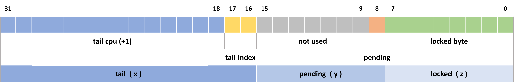

# qspinlock

## qspinlock 结构体

* qspinlock 无论在 32 位还是 64 位的体系结构上，大小都是 **4 字节**
* include/linux/types.h

```c
typedef struct {
    int counter;
} atomic_t;

#define ATOMIC_INIT(i) { (i) }
```

* include/asm-generic/qspinlock_types.h

```c
typedef struct qspinlock {
    union {
        atomic_t val;

        /*
         * By using the whole 2nd least significant byte for the
         * pending bit, we can allow better optimization of the lock
         * acquisition for the pending bit holder.
         */
#ifdef __LITTLE_ENDIAN
        struct {
            u8  locked;
            u8  pending;
        };
        struct {
            u16 locked_pending;
            u16 tail;
        };
#else
        struct {
            u16 tail;
            u16 locked_pending;
        };
        struct {
            u8  reserved[2];
            u8  pending;
            u8  locked;
        };
#endif
    };
} arch_spinlock_t;
```

* 小端时的内存排布
  
* 大端时的内存排布
  

## 各位域的使用

```c
/*
 * Bitfields in the atomic value:
 *
 * When NR_CPUS < 16K
 *  0- 7: locked byte
 *     8: pending
 *  9-15: not used
 * 16-17: tail index
 * 18-31: tail cpu (+1)
 *
 * When NR_CPUS >= 16K
 *  0- 7: locked byte
 *     8: pending
 *  9-10: tail index
 * 11-31: tail cpu (+1)
 */
```

* CPU 数目小于`16K`个时的位域使用
  
* `locked`: 锁字。MCS lock 中表示是否持有锁的`locked`占据了`32`个`bits`，但它其实只需要表示`0`和`1`两个值，在 qspinlock 中被压缩成了`8`个`bits`，即"**locked byte**"（其实只需要`1`个`bit`）
* `pending`：锁的第一竞争者检查该位
* `tail index`：用来标识 context 的编号。Linux 的 4 种 context，分别是 task，softirq，hardirq 和 nmi，而一个 CPU 在一种 context下，至多试图获取一个 spinlock
* `tail cpu`：MCS lock 的结构体中没有专门的标识等待队列末尾的元素，它使用的是一个全局的二级指针来指向队列末尾。而 qspinlock 使用的是一个 per-CPU 的数组来表示每个 MCS node（用`qnode`结构体表示），通过 CPU 编号作为数组的 index，就可以获得对应 MCS node 的内存位置，因而 qspinlock 使用的是末尾 MCS node 的 CPU 编号加 1，即“**tail cpu**”，来记录等待队列 tail 的位置
* `val`对应的`locked`，`pending`和`tail`作为一个三元组`(x,y,z)`来表示

## 锁的初始化

* include/linux/spinlock.h

```c
#ifdef CONFIG_DEBUG_SPINLOCK
...
#else

# define spin_lock_init(_lock)          \
do {                        \
    spinlock_check(_lock);          \
    *(_lock) = __SPIN_LOCK_UNLOCKED(_lock); \
} while (0)

#endif
```

* include/linux/spinlock_types.h

```c
#ifndef CONFIG_PREEMPT_RT

/* Non PREEMPT_RT kernels map spinlock to raw_spinlock */
typedef struct spinlock {
    union {
        struct raw_spinlock rlock;

#ifdef CONFIG_DEBUG_LOCK_ALLOC
# define LOCK_PADSIZE (offsetof(struct raw_spinlock, dep_map))
        struct {
            u8 __padding[LOCK_PADSIZE];
            struct lockdep_map dep_map;
        };
#endif
    };
} spinlock_t;

#define ___SPIN_LOCK_INITIALIZER(lockname)  \
    {                   \
    .raw_lock = __ARCH_SPIN_LOCK_UNLOCKED,  \
    SPIN_DEBUG_INIT(lockname)       \
    SPIN_DEP_MAP_INIT(lockname) }

#define __SPIN_LOCK_INITIALIZER(lockname) \
    { { .rlock = ___SPIN_LOCK_INITIALIZER(lockname) } }

#define __SPIN_LOCK_UNLOCKED(lockname) \
    (spinlock_t) __SPIN_LOCK_INITIALIZER(lockname)

#define DEFINE_SPINLOCK(x)  spinlock_t x = __SPIN_LOCK_UNLOCKED(x)

#else /* !CONFIG_PREEMPT_RT */
...
#endif
```

* `raw_lock`的类型是 arch 相关的`arch_spinlock_t`，那又回到开头 include/asm-generic/qspinlock_types.h 定义的`arch_spinlock_t`
* include/linux/spinlock_types_raw.h

```c
typedef struct raw_spinlock {
    arch_spinlock_t raw_lock;
#ifdef CONFIG_DEBUG_SPINLOCK
    unsigned int magic, owner_cpu;
    void *owner;
#endif
#ifdef CONFIG_DEBUG_LOCK_ALLOC
    struct lockdep_map dep_map;
#endif
} raw_spinlock_t;
```

* 那么初始化锁就是把`arch_spinlock_t`的`val`域赋值为`{ 0 }`，即`count = 0`
* include/asm-generic/qspinlock_types.h

```c
/*
 * Initializier
 */
#define __ARCH_SPIN_LOCK_UNLOCKED   { { .val = ATOMIC_INIT(0) } }
```

## 加锁

### 快速路径

* 三元组的初始值是`(0, 0, 0)`，当第一个 CPU 试图获取锁时，可以立即成为该 spinlock 的owner，此时三元组的值变为`(0, 0, 1)`
* include/asm-generic/qspinlock.h

```c
// 定义来自 include/asm-generic/qspinlock_types.h
#define _Q_LOCKED_OFFSET    0
#define _Q_LOCKED_VAL       (1U << _Q_LOCKED_OFFSET)

#ifndef queued_spin_lock
/**
 * queued_spin_lock - acquire a queued spinlock
 * @lock: Pointer to queued spinlock structure
 */
static __always_inline void queued_spin_lock(struct qspinlock *lock)
{
    int val = 0;
    // (0,0,0) --> (0,0,1)
    if (likely(atomic_try_cmpxchg_acquire(&lock->val, &val, _Q_LOCKED_VAL)))
        return;

    queued_spin_lock_slowpath(lock, val);
}
#endif
```

* `atomic_try_cmpxchg_acquire`依赖于 arch 相关提供的原子 CAS，对于 x86 见 arch/x86/include/asm/cmpxchg.h
* **CAS（Compare And Swap）** 的语义如下：

```c
cmpxchg(*ptr, old, new)
{
	ret = *ptr;
	if (*ptr == old)
		*ptr = new;
	return ret;
}
```

* 如果`ptr`内容和`old`的内容相同，则原子地将`ptr`的内容设成`new`，否则`ptr`保持原来的值
* 无论是否相等，返回的都是`ptr`原来的值。因此，只要比较返回值与`old`的值，
  * 如果相等，拿锁成功
  * 如果不相等，说明别的 CPU 修改了`ptr`的内容，拿锁失败
* 通过`cmpxchg()`，将当前 lock 的`val`值和`0`进行比较，如果为`0`，那么获得 spinlock，同时将 lock 的值设为`1`（即`_Q_LOCKED_VAL`）

### 慢速路径

* 在第一个 CPU 未释放锁之前，如果有第二个 CPU 试图获取锁，`atomic_try_cmpxchg_acquire()`会返回`false`，因此它必须等待，其获取锁的过程被称为“slow path”，进入`queued_spin_lock_slowpath()`函数

#### qspinlock 的掩码

* include/asm-generic/qspinlock_types.h

```c
#define _Q_SET_MASK(type)   (((1U << _Q_ ## type ## _BITS) - 1)\
                      << _Q_ ## type ## _OFFSET)
#define _Q_LOCKED_OFFSET    0
#define _Q_LOCKED_BITS      8
#define _Q_LOCKED_MASK      _Q_SET_MASK(LOCKED)
```

* 故锁字的掩码`_Q_LOCKED_MASK`展开为 `(((1U << _Q_LOCKED_BITS) - 1) << _Q_LOCKED_OFFSET)`，值为`0xff`

```c
#define _Q_PENDING_OFFSET   (_Q_LOCKED_OFFSET + _Q_LOCKED_BITS) // 值为 8
#if CONFIG_NR_CPUS < (1U << 14) // CPU 少于 2^14 = 16384 个
#define _Q_PENDING_BITS     8
#else                           // CPU 多于 16384 个
#define _Q_PENDING_BITS     1
#endif
#define _Q_PENDING_MASK     _Q_SET_MASK(PENDING)
```

* `pending`位的掩码`_Q_PENDING_MASK`展开为 `(((1U << _Q_PENDING_BITS) - 1) << _Q_PENDING_OFFSET)`，值为`0xff00`

```c
#define _Q_TAIL_IDX_OFFSET  (_Q_PENDING_OFFSET + _Q_PENDING_BITS) // 值为 16
#define _Q_TAIL_IDX_BITS    2
#define _Q_TAIL_IDX_MASK    _Q_SET_MASK(TAIL_IDX)
```

* `tail idx`位的掩码`_Q_TAIL_IDX_MASK`展开为 `(((1U << _Q_TAIL_IDX_BITS) - 1) << _Q_TAIL_IDX_OFFSET)`，值为`0x30000`

```c
#define _Q_TAIL_CPU_OFFSET  (_Q_TAIL_IDX_OFFSET + _Q_TAIL_IDX_BITS) // 值为 18
#define _Q_TAIL_CPU_BITS    (32 - _Q_TAIL_CPU_OFFSET) // 值为 14
#define _Q_TAIL_CPU_MASK    _Q_SET_MASK(TAIL_CPU)
```

* `tail cpu`位的掩码`_Q_TAIL_CPU_MASK`展开为 `(((1U << _Q_TAIL_CPU_BITS) - 1) << _Q_TAIL_CPU_OFFSET)`，值为`0xfffc0000`

```c
#define _Q_TAIL_OFFSET      _Q_TAIL_IDX_OFFSET
#define _Q_TAIL_MASK        (_Q_TAIL_IDX_MASK | _Q_TAIL_CPU_MASK)
```

* `tail`位的掩码即为`tail idx`和`tail cpu`的掩码的和，值为`0xffff0000`

```c
#define _Q_LOCKED_VAL       (1U << _Q_LOCKED_OFFSET)  // 值为 0x1
#define _Q_PENDING_VAL      (1U << _Q_PENDING_OFFSET) // 值为 0x100
```

#### 第二个 CPU 试图获取锁 - pending

```c
/**
 * queued_spin_lock_slowpath - acquire the queued spinlock
 * @lock: Pointer to queued spinlock structure
 * @val: Current value of the queued spinlock 32-bit word
 *
 * (queue tail, pending bit, lock value)
 *
 *              fast     :    slow                                  :    unlock
 *                       :                                          :
 * uncontended  (0,0,0) -:--> (0,0,1) ------------------------------:--> (*,*,0)
 *                       :       | ^--------.------.             /  :
 *                       :       v           \      \            |  :
 * pending               :    (0,1,1) +--> (0,1,0)   \           |  :
 *                       :       | ^--'              |           |  :
 *                       :       v                   |           |  :
 * uncontended           :    (n,x,y) +--> (n,0,0) --'           |  :
 *   queue               :       | ^--'                          |  :
 *                       :       v                               |  :
 * contended             :    (*,x,y) +--> (*,0,0) ---> (*,0,1) -'  :
 *   queue               :         ^--'                             :
 */
void queued_spin_lock_slowpath(struct qspinlock *lock, u32 val)
{
    struct mcs_spinlock *prev, *next, *node;
    u32 old, tail;
    int idx;
    // CPU 数目多于 1<<14 = 16384 个，超出 tail cpu 所能表示的范围了，编译报错
    BUILD_BUG_ON(CONFIG_NR_CPUS >= (1U << _Q_TAIL_CPU_BITS));
    // 需符合条件 !defined(_GEN_PV_LOCK_SLOWPATH) && defined(CONFIG_PARAVIRT_SPINLOCKS)
    if (pv_enabled())
        goto pv_queue;
    // 开启 CONFIG_PARAVIRT 时会 hijack spinlock 的处理，先不管这个分支
    if (virt_spin_lock(lock))
        return;
    // [part 2 - 第三个 CPU 试图获取 spinlock]
    /*
     * Wait for in-progress pending->locked hand-overs with a bounded
     * number of spins so that we guarantee forward progress.
     *
     * 0,1,0 -> 0,0,1
     */
    // 三元组为 (0,1,0)，恰巧碰到了第一个 CPU 准备把锁交给第二个 CPU 的过渡状态，我们就自旋一小下，等待移交完成 (0,1,0) --> (0,0,1)
    if (val == _Q_PENDING_VAL) {
        int cnt = _Q_PENDING_LOOPS;
        val = atomic_cond_read_relaxed(&lock->val,
                           (VAL != _Q_PENDING_VAL) || !cnt--);
    }
    // 自旋一小下的第一种结果，三元组是(*,1,0)，仍然在过渡或者有其他竞争者加入，排长队去
    /*
     * If we observe any contention; queue.
     */
    if (val & ~_Q_LOCKED_MASK)
        goto queue;
    // 自旋一小下的第二种结果，三元组是 (0,0,1)，过渡完成，而我们有机会成为第二个 CPU
    // [part 1 - 第二个 CPU 试图获取 spinlock]
    /*
     * trylock || pending
     *
     * 0,0,* -> 0,1,* -> 0,0,1 pending, trylock
     */
    // 此时，三元组是 (0,0,1)，我们设置 pending 位，(0,0,1) --> (0,1,1)
    val = queued_fetch_set_pending_acquire(lock);
    // 这里有两种返回结果，见下面详解。注意，返回的是三元组的原值，赋给 val
    /*
     * If we observe contention, there is a concurrent locker.
     *
     * Undo and queue; our setting of PENDING might have made the
     * n,0,0 -> 0,0,0 transition fail and it will now be waiting
     * on @next to become !NULL.
     */
    // 第一种结果，三元组的原值不是 (0,0,1) 说明我们没能占住 pending 位成为第二个 CPU，要排长队去
    if (unlikely(val & ~_Q_LOCKED_MASK)) {

        /* Undo PENDING if we set it. */
        if (!(val & _Q_PENDING_MASK))
            clear_pending(lock);      // 清除 pending 位
        // 排长队去
        goto queue;
    }
    // 第二种结果，三元组旧值为 (0,0,1)，说明是我们设置的 pending 位，那我们就自旋直到 owner 释放锁，三元组变为 (0,1,0)
    /*
     * We're pending, wait for the owner to go away.
     *
     * 0,1,1 -> 0,1,0
     *
     * this wait loop must be a load-acquire such that we match the
     * store-release that clears the locked bit and create lock
     * sequentiality; this is because not all
     * clear_pending_set_locked() implementations imply full
     * barriers.
     */
    if (val & _Q_LOCKED_MASK)
        atomic_cond_read_acquire(&lock->val, !(VAL & _Q_LOCKED_MASK));
    // 拿锁，将三元组由 (0,1,0) 设为 (0,0,1)，pending 位同时被清除
    /*
     * take ownership and clear the pending bit.
     *
     * 0,1,0 -> 0,0,1
     */
    clear_pending_set_locked(lock);
    lockevent_inc(lock_pending); // 增加 lock_pending 事件的统计计数
    return;                      // 获得锁，返回
    [part 3 - 进入 MCS lock 队列]
    /*
     * End of pending bit optimistic spinning and beginning of MCS
     * queuing.
     */
queue:
    lockevent_inc(lock_slowpath);
pv_queue:
    node = this_cpu_ptr(&qnodes[0].mcs);
    idx = node->count++; // 我们只在 context 0（task）的 node->count 上记载 context 索引
    tail = encode_tail(smp_processor_id(), idx); // 将自己的 CPU 编号和 context 编号编进 tail 里
    // 基于没有 NMI 上下文发生自旋锁嵌套的假设，当真的发生这种情况时简单粗暴地原地自旋，直到拿到锁
    /*
     * 4 nodes are allocated based on the assumption that there will
     * not be nested NMIs taking spinlocks. That may not be true in
     * some architectures even though the chance of needing more than
     * 4 nodes will still be extremely unlikely. When that happens,
     * we fall back to spinning on the lock directly without using
     * any MCS node. This is not the most elegant solution, but is
     * simple enough.
     */
    if (unlikely(idx >= MAX_NODES)) {
        lockevent_inc(lock_no_node);
        while (!queued_spin_trylock(lock))
            cpu_relax();
        goto release;
    }
    // 根据上下文索引 idx 拿到真正跟上下文关联的 msc node
    node = grab_mcs_node(node, idx);

    /*
     * Keep counts of non-zero index values:
     */
    lockevent_cond_inc(lock_use_node2 + idx - 1, idx);

    /*
     * Ensure that we increment the head node->count before initialising
     * the actual node. If the compiler is kind enough to reorder these
     * stores, then an IRQ could overwrite our assignments.
     */
    barrier();
    // 初始化新入队的 MCS node
    node->locked = 0;
    node->next = NULL;
    pv_init_node(node);
    // 碰碰运气，看能不能拿到目前三元组是 (0,0,0) 的锁
    /*
     * We touched a (possibly) cold cacheline in the per-cpu queue node;
     * attempt the trylock once more in the hope someone let go while we
     * weren't watching.
     */
    if (queued_spin_trylock(lock))
        goto release;

    /*
     * Ensure that the initialisation of @node is complete before we
     * publish the updated tail via xchg_tail() and potentially link
     * @node into the waitqueue via WRITE_ONCE(prev->next, node) below.
     */
    smp_wmb();
    // 在 qspinlock 中原子地设置新的 tail 值，还返回 qspinlock 中之前存储的 tail 值（即"old"）
    /*
     * Publish the updated tail.
     * We have already touched the queueing cacheline; don't bother with
     * pending stuff.
     *
     * p,*,* -> n,*,*
     */
    old = xchg_tail(lock, tail);
    next = NULL;
    // 对于第 N 个（N > 3）试图获取 spinlock 的 CPU，之前的 tail 值是指向上一个 MCS node 的，获得上一个 node 的目的是让它的"next"指向自己，这样才能加入 MCS node 的等待队列
    /*
     * if there was a previous node; link it and wait until reaching the
     * head of the waitqueue.
     */
    if (old & _Q_TAIL_MASK) {
        prev = decode_tail(old); // tail（old）转 MCS node
        // 让上一个 node 的 next 指向自己，加入 MCS node 的等待队列
        /* Link @node into the waitqueue. */
        WRITE_ONCE(prev->next, node); // prev->next = node
        // 在自己的 locked 值上进行自旋，在[part 4]中解除
        pv_wait_node(node, prev);
        arch_mcs_spin_lock_contended(&node->locked);
        // 当我们在自旋等锁的时候，我们的 next 指针可能被其他的竞争者设置了。我们乐观地预取 next 指针，期望能减少即将进行的 MCS 释放锁操作的延迟
        /*
         * While waiting for the MCS lock, the next pointer may have
         * been set by another lock waiter. We optimistically load
         * the next pointer & prefetch the cacheline for writing
         * to reduce latency in the upcoming MCS unlock operation.
         */
        next = READ_ONCE(node->next);
        if (next)
            prefetchw(next);
    }

    /*
     * we're at the head of the waitqueue, wait for the owner & pending to
     * go away.
     *
     * *,x,y -> *,0,0
     *
     * this wait loop must use a load-acquire such that we match the
     * store-release that clears the locked bit and create lock
     * sequentiality; this is because the set_locked() function below
     * does not imply a full barrier.
     *
     * The PV pv_wait_head_or_lock function, if active, will acquire
     * the lock and return a non-zero value. So we have to skip the
     * atomic_cond_read_acquire() call. As the next PV queue head hasn't
     * been designated yet, there is no way for the locked value to become
     * _Q_SLOW_VAL. So both the set_locked() and the
     * atomic_cmpxchg_relaxed() calls will be safe.
     *
     * If PV isn't active, 0 will be returned instead.
     *
     */
    if ((val = pv_wait_head_or_lock(lock, node)))
        goto locked;
    // 能走到这说明我们是第三个 CPU，在这自旋直到 pending 位变为 0
    val = atomic_cond_read_acquire(&lock->val, !(VAL & _Q_LOCKED_PENDING_MASK));
    [part 4 - 第三个 CPU 成功获取 spinlock]
locked:
    /*
     * claim the lock:
     *
     * n,0,0 -> 0,0,1 : lock, uncontended
     * *,*,0 -> *,*,1 : lock, contended
     *
     * If the queue head is the only one in the queue (lock value == tail)
     * and nobody is pending, clear the tail code and grab the lock.
     * Otherwise, we only need to grab the lock.
     */
    // 如果 qspinlock 的 tail 是指向我的，说明我是当前 MCS node 队列中唯一的 node，那么直接通过 atomic_try_cmpxchg_relaxed() 获取 spinlock 即可，三元组的值变为 (0,0,1)
    /*
     * In the PV case we might already have _Q_LOCKED_VAL set, because
     * of lock stealing; therefore we must also allow:
     *
     * n,0,1 -> 0,0,1
     *
     * Note: at this point: (val & _Q_PENDING_MASK) == 0, because of the
     *       above wait condition, therefore any concurrent setting of
     *       PENDING will make the uncontended transition fail.
     */
    if ((val & _Q_TAIL_MASK) == tail) {
        if (atomic_try_cmpxchg_relaxed(&lock->val, &val, _Q_LOCKED_VAL))
            goto release; /* No contention */
    }
    // 如果不是，说明队列中还有其他的 node 在等待，或者 pending 位被设置
    /*
     * Either somebody is queued behind us or _Q_PENDING_VAL got set
     * which will then detect the remaining tail and queue behind us
     * ensuring we'll see a @next.
     */
    set_locked(lock);

    /*
     * contended path; wait for next if not observed yet, release.
     */
    if (!next)
        next = smp_cond_load_relaxed(&node->next, (VAL));
    // 按照 MCS node 队列的规则，需要设置下一个 node（CPU D）的 locked 为 1
    arch_mcs_spin_unlock_contended(&next->locked);
    pv_kick_node(lock, next);

release:
    /*
     * release the node
     */
    __this_cpu_dec(qnodes[0].mcs.count);
}
```

* `queued_fetch_set_pending_acquire()`的语义为，获取整个锁的`val`，并设置`pending`位，返回之前的锁的`val`
* arch/x86/include/asm/qspinlock.h

```c
#define _Q_PENDING_LOOPS    (1 << 9)

#define queued_fetch_set_pending_acquire queued_fetch_set_pending_acquire
static __always_inline u32 queued_fetch_set_pending_acquire(struct qspinlock *lock)
{
    u32 val;

    /*
     * We can't use GEN_BINARY_RMWcc() inside an if() stmt because asm goto
     * and CONFIG_PROFILE_ALL_BRANCHES=y results in a label inside a
     * statement expression, which GCC doesn't like.
     */
    val = GEN_BINARY_RMWcc(LOCK_PREFIX "btsl", lock->val.counter, c,
                   "I", _Q_PENDING_OFFSET) * _Q_PENDING_VAL;
    val |= atomic_read(&lock->val) & ~_Q_PENDING_MASK;

    return val;
}
```
* `btsl`，**bit test and set**，前面还加了`lock`前缀使其成为原子操作
* 这里返回两个结果：
  1. 是我们设置了`pending`位，三元组`(0, 0, 1)`->`(0, 1, 1)`，第一行语句的`val`为`0`，因为是我们把`pending`位变为了`0`，第二行语句让`val`为三元组`(0, 0, 1)`
  2. 别人设置了`pending`位，我们在三元组为`(0, 1, 1)`时设置`pending`位，第一行语句的`val`为`1*_Q_PENDING_VAL`，因为`pending`位原值已经是`1`，第二行语句让`val`为三元组`(0, 1, 1)`
* 但这个写操作是个原子操作，所以只能有一个 CPU 返回的三元组是`(0, 0, 1)`，成为第二个 CPU
* include/asm-generic/barrier.h
```c
/**
 * smp_acquire__after_ctrl_dep() - Provide ACQUIRE ordering after a control dependency
 *
 * A control dependency provides a LOAD->STORE order, the additional RMB
 * provides LOAD->LOAD order, together they provide LOAD->{LOAD,STORE} order,
 * aka. (load)-ACQUIRE.
 *
 * Architectures that do not do load speculation can have this be barrier().
 */
#ifndef smp_acquire__after_ctrl_dep
#define smp_acquire__after_ctrl_dep()       smp_rmb()
#endif

/**
 * smp_cond_load_relaxed() - (Spin) wait for cond with no ordering guarantees
 * @ptr: pointer to the variable to wait on
 * @cond: boolean expression to wait for
 *
 * Equivalent to using READ_ONCE() on the condition variable.
 *
 * Due to C lacking lambda expressions we load the value of *ptr into a
 * pre-named variable @VAL to be used in @cond.
 */
#ifndef smp_cond_load_relaxed
#define smp_cond_load_relaxed(ptr, cond_expr) ({        \
    typeof(ptr) __PTR = (ptr);              \
    __unqual_scalar_typeof(*ptr) VAL;           \
    for (;;) {                      \
        VAL = READ_ONCE(*__PTR);            \
        if (cond_expr)                  \
            break;                  \
        cpu_relax();                    \
    }                           \
    (typeof(*ptr))VAL;                  \
})
#endif

/**
 * smp_cond_load_acquire() - (Spin) wait for cond with ACQUIRE ordering
 * @ptr: pointer to the variable to wait on
 * @cond: boolean expression to wait for
 *
 * Equivalent to using smp_load_acquire() on the condition variable but employs
 * the control dependency of the wait to reduce the barrier on many platforms.
 */
#ifndef smp_cond_load_acquire
#define smp_cond_load_acquire(ptr, cond_expr) ({        \
    __unqual_scalar_typeof(*ptr) _val;          \
    _val = smp_cond_load_relaxed(ptr, cond_expr);       \
    smp_acquire__after_ctrl_dep();              \
    (typeof(*ptr))_val;                 \
})
#endif
```
* `smp_cond_load_relaxed(ptr, cond_expr)`语义为自旋直至条件表达式`cond_expr`成立
* `smp_cond_load_acquire(ptr, cond_expr)`比`smp_cond_load_relaxed`多一个读屏障
* kernel/locking/qspinlock.c
```c
#if _Q_PENDING_BITS == 8
/**
 * clear_pending - clear the pending bit.
 * @lock: Pointer to queued spinlock structure
 *
 * *,1,* -> *,0,*
 */
static __always_inline void clear_pending(struct qspinlock *lock)
{
    WRITE_ONCE(lock->pending, 0);
}

/**
 * clear_pending_set_locked - take ownership and clear the pending bit.
 * @lock: Pointer to queued spinlock structure
 *
 * *,1,0 -> *,0,1
 *
 * Lock stealing is not allowed if this function is used.
 */
static __always_inline void clear_pending_set_locked(struct qspinlock *lock)
{
    WRITE_ONCE(lock->locked_pending, _Q_LOCKED_VAL);
}
#else
#endif
```
* `clear_pending()`清除`pending`位，将三元组由`(*, 1, *)`设为`(*, 0, *)`
* `clear_pending_set_locked()`拿锁，将三元组由`(*, 1, 0)`设为`(*, 0, 1)`，`pending`位同时被清除

##### lockevent_inc() 增加统计计数
* kernel/locking/lock_events.h
* kernel/locking/lock_events_list.h
* kernel/locking/lock_events.c

#### 第三个 CPU 试图获取锁 - uncontended queue

* `_Q_PENDING_LOOPS`为`pending`位的自旋循环的次数
  * 这种启发式自旋用于，等待锁从`== _Q_PENDING_VAL`状态转换时，限制`atomic_cond_read_relaxed()`对锁字的访问次数
  * 不能无限地旋转，因为此时没有保证我们会取得进步（成为第二个 CPU）
* `smp_cond_load_relaxed(ptr, cond_expr)`语义为，自旋直至条件表达式`cond_expr`成立
* include/linux/atomic.h 
```c
#define atomic_cond_read_relaxed(v, c) smp_cond_load_relaxed(&(v)->counter, (c))
```
* 宏替换完成后如下
```c
{
    int *__PTR = (&lock->val->counter);
    int VAL;
    for (;;) {
        VAL = READ_ONCE(*__PTR);
        if ((VAL != _Q_PENDING_VAL) || !cnt--)
            break;
        cpu_relax();
    }
    int VAL;
}
```
* 如果三元组为`(0, 1, 0)`，则判断`!cnt`（再`cnt--`）
  * 当`cnt`减到零了，三元组还是`(0, 1, 0)`，那就不自旋了
* 如果三元组不为`(0, 1, 0)`，则锁移交完成`(0, 0, 1)`，或者有其他竞争者加入`(*, 1, 0)`，那也结束自旋
```c
// [part 2 - 第三个 CPU 试图获取 spinlock]
    /*
     * Wait for in-progress pending->locked hand-overs with a bounded
     * number of spins so that we guarantee forward progress.
     *
     * 0,1,0 -> 0,0,1
     */
    // 三元组为 (0,1,0)，恰巧碰到了第一个 CPU 准备把锁交给第二个 CPU 的过渡状态，我们就自旋一小下，等待移交完成 (0,1,0) --> (0,0,1)
    if (val == _Q_PENDING_VAL) {
        int cnt = _Q_PENDING_LOOPS;
        val = atomic_cond_read_relaxed(&lock->val,
                           (VAL != _Q_PENDING_VAL) || !cnt--);
    }
    // 自旋一小下的第一种结果，三元组是(*,1,0)，仍然在过渡或者有其他竞争者加入，排长队去
    /*
     * If we observe any contention; queue.
     */
    if (val & ~_Q_LOCKED_MASK)
        goto queue;
    // 自旋一小下的第二种结果，三元组是 (0,0,1)，过渡完成，而我们有机会成为第二个 CPU
```

#### 进入 MCS node 队列

##### MCS node
* kernel/locking/mcs_spinlock.h
```c
struct mcs_spinlock {
    struct mcs_spinlock *next;
    int locked; /* 1 if lock acquired */
    int count;  /* nesting count, see qspinlock.c */
};
```

* kernel/locking/qspinlock.c
```c
#define MAX_NODES   4

/*
 * On 64-bit architectures, the mcs_spinlock structure will be 16 bytes in
 * size and four of them will fit nicely in one 64-byte cacheline. For
 * pvqspinlock, however, we need more space for extra data. To accommodate
 * that, we insert two more long words to pad it up to 32 bytes. IOW, only
 * two of them can fit in a cacheline in this case. That is OK as it is rare
 * to have more than 2 levels of slowpath nesting in actual use. We don't
 * want to penalize pvqspinlocks to optimize for a rare case in native
 * qspinlocks.
 */
struct qnode {
    struct mcs_spinlock mcs;
#ifdef CONFIG_PARAVIRT_SPINLOCKS
    long reserved[2];
#endif
};
...
/*
 * Per-CPU queue node structures; we can never have more than 4 nested
 * contexts: task, softirq, hardirq, nmi.
 *
 * Exactly fits one 64-byte cacheline on a 64-bit architecture.
 *
 * PV doubles the storage and uses the second cacheline for PV state.
 */
static DEFINE_PER_CPU_ALIGNED(struct qnode, qnodes[MAX_NODES]);
```

#####  MCS 队列辅助函数
* **tail CPU** 是 CPU 的编号加`1`，因为对于编号为`0`，`tail index`也为`0`的 CPU，如果不加`1`，那么算出来的`tail`值就是`0`，而`tail`为`0`表示当前没有 MCS node 的队列，为了能够区分这两种情况，在`encode_tail()`的时候把`cpu + 1`编码进`tail`
```c
/*
 * We must be able to distinguish between no-tail and the tail at 0:0,
 * therefore increment the cpu number by one.
 */

static inline __pure u32 encode_tail(int cpu, int idx)
{
    u32 tail;

    tail  = (cpu + 1) << _Q_TAIL_CPU_OFFSET;
    tail |= idx << _Q_TAIL_IDX_OFFSET; /* assume < 4 */

    return tail;
}
```
* `decode_tail()`根据`tail`返回的上下文相关的 MCS node
```c
static inline __pure struct mcs_spinlock *decode_tail(u32 tail)
{
    int cpu = (tail >> _Q_TAIL_CPU_OFFSET) - 1;
    int idx = (tail &  _Q_TAIL_IDX_MASK) >> _Q_TAIL_IDX_OFFSET;

    return per_cpu_ptr(&qnodes[idx].mcs, cpu);
}
```
* `grab_mcs_node()`根据 *task 上下文的 mcs node* 和 *上下文索引 idx*，返回上下文相关的 MCS node
```c
static inline __pure
struct mcs_spinlock *grab_mcs_node(struct mcs_spinlock *base, int idx)
{
    return &((struct qnode *)base + idx)->mcs;
}
```
* `queued_spin_trylock()`返回`1`表示尝试成功，返回`0`表示尝试失败
```c
/**
 * queued_spin_trylock - try to acquire the queued spinlock
 * @lock : Pointer to queued spinlock structure
 * Return: 1 if lock acquired, 0 if failed
 */
static __always_inline int queued_spin_trylock(struct qspinlock *lock)
{
    int val = atomic_read(&lock->val);
    // 如果三元组不为 (0,0,0)，返回 0，表示尝试失败
    if (unlikely(val))
        return 0;
    // 如果三元组为 (0,0,0)，尝试拿锁，(0,0,0) --> (0,0,1)，这里返回的是 r == o 的比较结果
    return likely(atomic_try_cmpxchg_acquire(&lock->val, &val, _Q_LOCKED_VAL));
}
```
* `xchg_tail()`让 qspinlock（即"lock"）的`tail`设为传入的`tail`，并返回 qspinlock 中之前存储的`tail`值
```c
/*
 * xchg_tail - Put in the new queue tail code word & retrieve previous one
 * @lock : Pointer to queued spinlock structure
 * @tail : The new queue tail code word
 * Return: The previous queue tail code word
 *
 * xchg(lock, tail), which heads an address dependency
 *
 * p,*,* -> n,*,* ; prev = xchg(lock, node)
 */
static __always_inline u32 xchg_tail(struct qspinlock *lock, u32 tail)
{
    /*
     * We can use relaxed semantics since the caller ensures that the
     * MCS node is properly initialized before updating the tail.
     */
    return (u32)xchg_relaxed(&lock->tail,
                 tail >> _Q_TAIL_OFFSET) << _Q_TAIL_OFFSET;
}
```

#### 第 N 个 CPU 试图获取锁 - contended queue

#### 第三个 CPU 成功获取锁
* `set_locked()` 设置锁位，三元组`(*, *, 0)` -> `( *, 0, 1)`
```c
/**
 * set_locked - Set the lock bit and own the lock
 * @lock: Pointer to queued spinlock structure
 *
 * *,*,0 -> *,0,1
 */
static __always_inline void set_locked(struct qspinlock *lock)
{
    WRITE_ONCE(lock->locked, _Q_LOCKED_VAL);
}
```
## 解锁
* 只需要把 qspinlock 中的 **locked byte** 置为`0`就可以了
```c
/**
 * queued_spin_unlock - release a queued spinlock
 * @lock : Pointer to queued spinlock structure
 */
static __always_inline void queued_spin_unlock(struct qspinlock *lock)
{
    /*
     * unlock() needs release semantics:
     */
    smp_store_release(&lock->locked, 0);
}
```