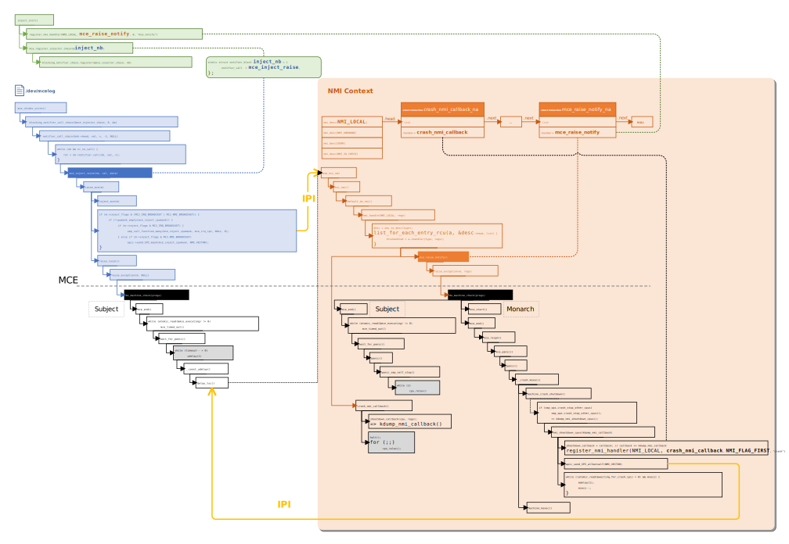

# MCE

* Machine Check Exception 是一类由硬件错误触发的异常，譬如当 CPU 检测到总线，chipset，内存，cache，TLB 等硬件出现致命错误时会触发这类异常。
* 一般来说这些错误对系统的稳定性危害极大而且无法恢复，通常会触发系统的复位操作。这些错误在一个大型的服务器环境 如服务器集群或者是云计算的环境下是不可避免的，因此必须对此有相应的处理机制。

## MCA 错误分类分级表


| Error Handling                                                                           | Category              |
| ---------------------------------------------------------------------------------------- | --------------------- |
| **System Reset** <br/>Multi-bit Error in Kernel                                          | Non-Recoverable/Fatal |
| **OS Recoverable: System Available** <br/>Multi-bit Error in Application                 | Recoverable           |
| **OS Corrected: Execution Continues** <br/>Patrol Scrub Error                            | Recoverable           |
| **Firmware Corrected: Execution Continues** <br/>Single-bit Error in Write-Through Cache | Corrected             |
| **Hardware Corrected: Execution Continues** <br/>Most Single-bit Errors                  | Corrected             |

* **Corrected**: 对于可以纠正的错误（**CE** -- corrected error）类型，需要通过 CMCI（Corrected Machine Check Interrupt）中断来处理（并不是所有的 CE 都需要）
  * 这是一个存在于每个 CPU 的 Local Vector Table 中的中断向量而不是一个异常
* **Recoverable**: 对于不可纠正但是可以恢复的错误（**UCR Error** -- Uncorrected Recoverable Error），通过传统的 MCE 异常处理
* **Fatal**: 对于致命的错误，软件也无法恢复的，将通过 MCE 强制系统复位

### UCR 的细分

* UCR 还可以细分为 SRAR 和 SRAO 两种不同的类型的 MCE
  * **SRAR**（software recoverable action **required**）
  * **SRAO**（software recoverable action **optional**）
* **相同点**：对于**已知**类型的错误，OS 需要根据错误类型执行不同的动作将系统从错误状态中恢复
* **不同点**：对于**未知**类型的错误
  * SRAR 需要将系统 *复位*
  * SRAO 则可以让系统 *继续正常运行*


## 注册 MCE 中断处理函数

```c
start_kernel()
-> check_bugs()
   -> identify_boot_cpu()
      -> identify_cpu(&boot_cpu_data)
         -> mcheck_cpu_init(c)
            -> machine_check_vector = do_machine_check;
```

* Machine Check 的中断向量`X86_TRAP_MC`（中断号是`18`）

  * arch/x86/include/asm/trapnr.h

  ```c
  /* Interrupts/Exceptions */

  #define X86_TRAP_DE      0  /* Divide-by-zero */
  #define X86_TRAP_DB      1  /* Debug */
  #define X86_TRAP_NMI         2  /* Non-maskable Interrupt */
  #define X86_TRAP_BP      3  /* Breakpoint */
  #define X86_TRAP_OF      4  /* Overflow */
  #define X86_TRAP_BR      5  /* Bound Range Exceeded */
  #define X86_TRAP_UD      6  /* Invalid Opcode */
  #define X86_TRAP_NM      7  /* Device Not Available */
  #define X86_TRAP_DF      8  /* Double Fault */
  #define X86_TRAP_OLD_MF      9  /* Coprocessor Segment Overrun */
  #define X86_TRAP_TS     10  /* Invalid TSS */
  #define X86_TRAP_NP     11  /* Segment Not Present */
  #define X86_TRAP_SS     12  /* Stack Segment Fault */
  #define X86_TRAP_GP     13  /* General Protection Fault */
  #define X86_TRAP_PF     14  /* Page Fault */
  #define X86_TRAP_SPURIOUS   15  /* Spurious Interrupt */
  #define X86_TRAP_MF     16  /* x87 Floating-Point Exception */
  #define X86_TRAP_AC     17  /* Alignment Check */
  #define X86_TRAP_MC     18  /* Machine Check */
  #define X86_TRAP_XF     19  /* SIMD Floating-Point Exception */
  #define X86_TRAP_VE     20  /* Virtualization Exception */
  #define X86_TRAP_CP     21  /* Control Protection Exception */
  #define X86_TRAP_VC     29  /* VMM Communication Exception */
  #define X86_TRAP_IRET       32  /* IRET Exception */
  ```
* 定义 Machine Check 的中断向量`X86_TRAP_MC`的中断描述符表项

  * arch/x86/kernel/idt.c

  ```c
  ...
  #define G(_vector, _addr, _ist, _type, _dpl, _segment)  \
      {                       \
          .vector     = _vector,      \
          .bits.ist   = _ist,         \
          .bits.type  = _type,        \
          .bits.dpl   = _dpl,         \
          .bits.p     = 1,            \
          .addr       = _addr,        \
          .segment    = _segment,     \
      }
  ...
  #ifdef CONFIG_X86_64
  /*
  * Interrupt gate with interrupt stack. The _ist index is the index in
  * the tss.ist[] array, but for the descriptor it needs to start at 1.
  */
  #define ISTG(_vector, _addr, _ist)          \
      G(_vector, _addr, _ist + 1, GATE_INTERRUPT, DPL0, __KERNEL_CS)
  #else
  #define ISTG(_vector, _addr, _ist)  INTG(_vector, _addr)
  #endif
  ...
  /*
  * The default IDT entries which are set up in trap_init() before
  * cpu_init() is invoked. Interrupt stacks cannot be used at that point and
  * the traps which use them are reinitialized with IST after cpu_init() has
  * set up TSS.
  */
  static const __initconst struct idt_data def_idts[] = {
      ...
  #ifdef CONFIG_X86_MCE
      ISTG(X86_TRAP_MC,       asm_exc_machine_check, IST_INDEX_MCE),
  #endif
      ...
  };
  ```

  * 由此可见，其中断处理函数为`asm_exc_machine_check`

## MCE 中断处理函数的声明

* `idtentry_mce_db`宏的定义

  * arch/x86/entry/entry_64.S

  ```s
  /**
   * idtentry_mce_db - Macro to generate entry stubs for #MC and #DB
   * @vector:     Vector number
   * @asmsym:     ASM symbol for the entry point
   * @cfunc:      C function to be called
   *
   * The macro emits code to set up the kernel context for #MC and #DB
   *
   * If the entry comes from user space it uses the normal entry path
   * including the return to user space work and preemption checks on
   * exit.
   *
   * If hits in kernel mode then it needs to go through the paranoid
   * entry as the exception can hit any random state. No preemption
   * check on exit to keep the paranoid path simple.
   */
  .macro idtentry_mce_db vector asmsym cfunc
  SYM_CODE_START(\asmsym)
      UNWIND_HINT_IRET_REGS
      ASM_CLAC

      pushq   $-1         /* ORIG_RAX: no syscall to restart */

      /*
       * If the entry is from userspace, switch stacks and treat it as
       * a normal entry.
       */
      testb   $3, CS-ORIG_RAX(%rsp)
      jnz .Lfrom_usermode_switch_stack_\@

      /* paranoid_entry returns GS information for paranoid_exit in EBX. */
      call    paranoid_entry

      UNWIND_HINT_REGS

      movq    %rsp, %rdi      /* pt_regs pointer */

      call    \cfunc

      jmp paranoid_exit

      /* Switch to the regular task stack and use the noist entry point */
  .Lfrom_usermode_switch_stack_\@:
      idtentry_body noist_\cfunc, has_error_code=0

  _ASM_NOKPROBE(\asmsym)
  SYM_CODE_END(\asmsym)
  .endm
  ```

  * arch/x86/include/asm/idtentry.h
  ```c
  #ifdef CONFIG_X86_64
  # define DECLARE_IDTENTRY_MCE(vector, func)             \
    idtentry_mce_db vector asm_##func func
    ...
  #endif
  ...
  #ifdef CONFIG_X86_MCE
  #ifdef CONFIG_X86_64
  DECLARE_IDTENTRY_MCE(X86_TRAP_MC,   exc_machine_check);
  ...
  #endif
  ```

## MCE 中断处理函数的定义

* arch/x86/include/asm/idtentry.h
  ```c
  #ifndef __ASSEMBLY__
  ...
  /**
   * DEFINE_IDTENTRY_RAW - Emit code for raw IDT entry points
   * @func:   Function name of the entry point
   *
   * @func is called from ASM entry code with interrupts disabled.
   *
   * The macro is written so it acts as function definition. Append the
   * body with a pair of curly brackets.
   *
   * Contrary to DEFINE_IDTENTRY() this does not invoke the
   * idtentry_enter/exit() helpers before and after the body invocation. This
   * needs to be done in the body itself if applicable. Use if extra work
   * is required before the enter/exit() helpers are invoked.
   */
  #define DEFINE_IDTENTRY_RAW(func)                   \
  __visible noinstr void func(struct pt_regs *regs)
  ...
  /**
   * DEFINE_IDTENTRY_IST - Emit code for IST entry points
   * @func:   Function name of the entry point
   *
   * Maps to DEFINE_IDTENTRY_RAW
   */
  #define DEFINE_IDTENTRY_IST(func)                   \
      DEFINE_IDTENTRY_RAW(func)
  ...
  #define DEFINE_IDTENTRY_NOIST(func)                 \
      DEFINE_IDTENTRY_RAW(noist_##func)
  ...
  #ifdef CONFIG_X86_64
  ...
  #define DEFINE_IDTENTRY_MCE     DEFINE_IDTENTRY_IST
  ...
  #define DEFINE_IDTENTRY_MCE_USER    DEFINE_IDTENTRY_NOIST
  ...
  #endif
  ...
  #endif
  ```
* 所以最后看到的中断处理函数`exc_machine_check()`的定义是这样的：
  * arch/x86/kernel/cpu/mce/core.c
  ```c
  ...
  #ifdef CONFIG_X86_64
  /* MCE hit kernel mode */
  DEFINE_IDTENTRY_MCE(exc_machine_check)
  {
      unsigned long dr7;

      dr7 = local_db_save();
      exc_machine_check_kernel(regs);
      local_db_restore(dr7);
  }
  // 发生异常时正在运行的是用户态的代码，跳转到这 noist_exc_machine_check()
  /* The user mode variant. */
  DEFINE_IDTENTRY_MCE_USER(exc_machine_check)
  {
      unsigned long dr7;

      dr7 = local_db_save();
      exc_machine_check_user(regs);
      local_db_restore(dr7);
  }
  #else
  /* 32bit unified entry point */
  ...
  #endif
  ```

## MCE Severity

* MCE 的严重程度分为以下级别：
* arch/x86/kernel/cpu/mce/internal.h

```c
enum severity_level {
    MCE_NO_SEVERITY,
    MCE_DEFERRED_SEVERITY,
    MCE_UCNA_SEVERITY = MCE_DEFERRED_SEVERITY, // Uncorrected no action required
    MCE_KEEP_SEVERITY,
    MCE_SOME_SEVERITY,
    MCE_AO_SEVERITY,    // Action optional
    MCE_UC_SEVERITY,    // Uncorrected error
    MCE_AR_SEVERITY,    // Action required
    MCE_PANIC_SEVERITY,
};
```

* 对应的，有个`struct severity`类型的数组`severities[]`
* arch/x86/kernel/cpu/mce/severity.c

```c
static struct severity {
    u64 mask;
    u64 result;
    unsigned char sev;
    unsigned char mcgmask;
    unsigned char mcgres;
    unsigned char ser;
    unsigned char context;
    unsigned char excp;
    unsigned char covered;
    unsigned char cpu_model;
    unsigned char cpu_minstepping;
    unsigned char bank_lo, bank_hi;
    char *msg;
} severities[] = {
#define MCESEV(s, m, c...) { .sev = MCE_ ## s ## _SEVERITY, .msg = m, ## c }
#define BANK_RANGE(l, h) .bank_lo = l, .bank_hi = h
#define MODEL_STEPPING(m, s) .cpu_model = m, .cpu_minstepping = s
#define  KERNEL     .context = IN_KERNEL
#define  USER       .context = IN_USER
#define  KERNEL_RECOV   .context = IN_KERNEL_RECOV
#define  SER        .ser = SER_REQUIRED
#define  NOSER      .ser = NO_SER
#define  EXCP       .excp = EXCP_CONTEXT
#define  NOEXCP     .excp = NO_EXCP
#define  BITCLR(x)  .mask = x, .result = 0
#define  BITSET(x)  .mask = x, .result = x
#define  MCGMASK(x, y)  .mcgmask = x, .mcgres = y
#define  MASK(x, y) .mask = x, .result = y
#define MCI_UC_S (MCI_STATUS_UC|MCI_STATUS_S)
#define MCI_UC_AR (MCI_STATUS_UC|MCI_STATUS_AR)
#define MCI_UC_SAR (MCI_STATUS_UC|MCI_STATUS_S|MCI_STATUS_AR)
#define MCI_ADDR (MCI_STATUS_ADDRV|MCI_STATUS_MISCV)

    MCESEV(
        NO, "Invalid",
        BITCLR(MCI_STATUS_VAL)
        ),
    MCESEV(
        NO, "Not enabled",
        EXCP, BITCLR(MCI_STATUS_EN)
        ),
    MCESEV(
        PANIC, "Processor context corrupt",
        BITSET(MCI_STATUS_PCC)
        ),
    /* When MCIP is not set something is very confused */
    MCESEV(
        PANIC, "MCIP not set in MCA handler",
        EXCP, MCGMASK(MCG_STATUS_MCIP, 0)
        ),
    /* Neither return not error IP -- no chance to recover -> PANIC */
    MCESEV(
        PANIC, "Neither restart nor error IP",
        EXCP, MCGMASK(MCG_STATUS_RIPV|MCG_STATUS_EIPV, 0)
        ),
    MCESEV(
        PANIC, "In kernel and no restart IP",
        EXCP, KERNEL, MCGMASK(MCG_STATUS_RIPV, 0)
        ),
    MCESEV(
        PANIC, "In kernel and no restart IP",
        EXCP, KERNEL_RECOV, MCGMASK(MCG_STATUS_RIPV, 0)
        ),
    /*
     * known AO MCACODs reported via MCE or CMC:
     *
     * SRAO could be signaled either via a machine check exception or
     * CMCI with the corresponding bit S 1 or 0. So we don't need to
     * check bit S for SRAO.
     */
    MCESEV(
        AO, "Action optional: memory scrubbing error",
        SER, MASK(MCI_UC_AR|MCACOD_SCRUBMSK, MCI_STATUS_UC|MCACOD_SCRUB)
        ),
    MCESEV(
        AO, "Action optional: last level cache writeback error",
        SER, MASK(MCI_UC_AR|MCACOD, MCI_STATUS_UC|MCACOD_L3WB)
        ),
    /*
     * Quirk for Skylake/Cascade Lake. Patrol scrubber may be configured
     * to report uncorrected errors using CMCI with a special signature.
     * UC=0, MSCOD=0x0010, MCACOD=binary(000X 0000 1100 XXXX) reported
     * in one of the memory controller banks.
     * Set severity to "AO" for same action as normal patrol scrub error.
     */
    MCESEV(
        AO, "Uncorrected Patrol Scrub Error",
        SER, MASK(MCI_STATUS_UC|MCI_ADDR|0xffffeff0, MCI_ADDR|0x001000c0),
        MODEL_STEPPING(INTEL_FAM6_SKYLAKE_X, 4), BANK_RANGE(13, 18)
    ),

    /* ignore OVER for UCNA */
    MCESEV(
        UCNA, "Uncorrected no action required",
        SER, MASK(MCI_UC_SAR, MCI_STATUS_UC)
        ),
    MCESEV(
        PANIC, "Illegal combination (UCNA with AR=1)",
        SER,
        MASK(MCI_STATUS_OVER|MCI_UC_SAR, MCI_STATUS_UC|MCI_STATUS_AR)
        ),
    MCESEV(
        KEEP, "Non signaled machine check",
        SER, BITCLR(MCI_STATUS_S)
        ),

    MCESEV(
        PANIC, "Action required with lost events",
        SER, BITSET(MCI_STATUS_OVER|MCI_UC_SAR)
        ),

    /* known AR MCACODs: */
#ifdef  CONFIG_MEMORY_FAILURE
    MCESEV(
        KEEP, "Action required but unaffected thread is continuable",
        SER, MASK(MCI_STATUS_OVER|MCI_UC_SAR|MCI_ADDR, MCI_UC_SAR|MCI_ADDR),
        MCGMASK(MCG_STATUS_RIPV|MCG_STATUS_EIPV, MCG_STATUS_RIPV)
        ),
    MCESEV(
        AR, "Action required: data load in error recoverable area of kernel",
        SER, MASK(MCI_STATUS_OVER|MCI_UC_SAR|MCI_ADDR|MCACOD, MCI_UC_SAR|MCI_ADDR|MCACOD_DATA),
        KERNEL_RECOV
        ),
    MCESEV(
        AR, "Action required: data load error in a user process",
        SER, MASK(MCI_STATUS_OVER|MCI_UC_SAR|MCI_ADDR|MCACOD, MCI_UC_SAR|MCI_ADDR|MCACOD_DATA),
        USER
        ),
    MCESEV(
        AR, "Action required: instruction fetch error in a user process",
        SER, MASK(MCI_STATUS_OVER|MCI_UC_SAR|MCI_ADDR|MCACOD, MCI_UC_SAR|MCI_ADDR|MCACOD_INSTR),
        USER
        ),
    MCESEV(
        PANIC, "Data load in unrecoverable area of kernel",
        SER, MASK(MCI_STATUS_OVER|MCI_UC_SAR|MCI_ADDR|MCACOD, MCI_UC_SAR|MCI_ADDR|MCACOD_DATA),
        KERNEL
        ),
    MCESEV(
        PANIC, "Instruction fetch error in kernel",
        SER, MASK(MCI_STATUS_OVER|MCI_UC_SAR|MCI_ADDR|MCACOD, MCI_UC_SAR|MCI_ADDR|MCACOD_INSTR),
        KERNEL
        ),
#endif
    MCESEV(
        PANIC, "Action required: unknown MCACOD",
        SER, MASK(MCI_STATUS_OVER|MCI_UC_SAR, MCI_UC_SAR)
        ),

    MCESEV(
        SOME, "Action optional: unknown MCACOD",
        SER, MASK(MCI_STATUS_OVER|MCI_UC_SAR, MCI_UC_S)
        ),
    MCESEV(
        SOME, "Action optional with lost events",
        SER, MASK(MCI_STATUS_OVER|MCI_UC_SAR, MCI_STATUS_OVER|MCI_UC_S)
        ),

    MCESEV(
        PANIC, "Overflowed uncorrected",
        BITSET(MCI_STATUS_OVER|MCI_STATUS_UC)
        ),
    MCESEV(
        UC, "Uncorrected",
        BITSET(MCI_STATUS_UC)
        ),
    MCESEV(
        SOME, "No match",
        BITSET(0)
        )   /* always matches. keep at end */
};
```

* arch/x86/include/asm/mce.h

```c
/* MCG_STATUS register defines */
#define MCG_STATUS_RIPV     BIT_ULL(0)   /* restart ip valid */
#define MCG_STATUS_EIPV     BIT_ULL(1)   /* ip points to correct instruction */
#define MCG_STATUS_MCIP     BIT_ULL(2)   /* machine check in progress */
#define MCG_STATUS_LMCES    BIT_ULL(3)   /* LMCE signaled */

/* MCG_EXT_CTL register defines */
#define MCG_EXT_CTL_LMCE_EN BIT_ULL(0) /* Enable LMCE */

/* MCi_STATUS register defines */
#define MCI_STATUS_VAL      BIT_ULL(63)  /* valid error */
#define MCI_STATUS_OVER     BIT_ULL(62)  /* previous errors lost */
#define MCI_STATUS_UC       BIT_ULL(61)  /* uncorrected error */
#define MCI_STATUS_EN       BIT_ULL(60)  /* error enabled */
#define MCI_STATUS_MISCV    BIT_ULL(59)  /* misc error reg. valid */
#define MCI_STATUS_ADDRV    BIT_ULL(58)  /* addr reg. valid */
#define MCI_STATUS_PCC      BIT_ULL(57)  /* processor context corrupt */
#define MCI_STATUS_S        BIT_ULL(56)  /* Signaled machine check */
#define MCI_STATUS_AR       BIT_ULL(55)  /* Action required */
#define MCI_STATUS_CEC_SHIFT    38           /* Corrected Error Count */
#define MCI_STATUS_CEC_MASK GENMASK_ULL(52,38)
#define MCI_STATUS_CEC(c)   (((c) & MCI_STATUS_CEC_MASK) >> MCI_STATUS_CEC_SHIFT)

/* AMD-specific bits */
#define MCI_STATUS_TCC      BIT_ULL(55)  /* Task context corrupt */
#define MCI_STATUS_SYNDV    BIT_ULL(53)  /* synd reg. valid */
#define MCI_STATUS_DEFERRED BIT_ULL(44)  /* uncorrected error, deferred exception */
#define MCI_STATUS_POISON   BIT_ULL(43)  /* access poisonous data */
#define MCI_STATUS_SCRUB    BIT_ULL(40)  /* Error detected during scrub operation */
...
/*
 * Indicates an MCE which has happened in kernel space but from
 * which the kernel can recover simply by executing fixup_exception()
 * so that an error is returned to the caller of the function that
 * hit the machine check.
 */
#define MCE_IN_KERNEL_RECOV BIT_ULL(6)

/*
 * Indicates an MCE that happened in kernel space while copying data
 * from user. In this case fixup_exception() gets the kernel to the
 * error exit for the copy function. Machine check handler can then
 * treat it like a fault taken in user mode.
 */
#define MCE_IN_KERNEL_COPYIN    BIT_ULL(7)
...
```

## /dev/mcelog 错误注入

## HWPOISON

### HWPOISON 的应用背景与基本原理

* 当硬件（如内存控制器）发现一个内存页中的数据出错并且无法被纠正，就会标记该页面，并抛出 MCE 异常并通知 OS 该页面已包含错误数据，需要立即被隔离。从而确保错误数据不会被自身或应用程序“消费”，或进一步被写入磁盘。
* 一般来说，大多数出错的页面都可以被 OS 简单有效地隔离，从而避免错误的扩散甚至系统复位，但也有些 OS 不值得或者不可能处理的情况，比如
  * 页面被复杂数据结构所引用，
  * 包含了内核自身的代码和数据，
  * 恰好在硬件发现问题到 OS 隔离的时间间隙内被访问。
* 如果这些未被隔离的页面被访问，将会被硬件捕获并触发新的 MCE 异常，从而导致 kernel panic。
* **可隔离的页面** 包括 LRU page 和 buddy system 中的页面，都是**和进程相关的**
  * 如果这个页面映射的是**磁盘文件**，即 page cache，
    * 如果这个页面是**干净的**，也就是说和磁盘数据是同步的，那么**直接丢弃**这个页面即可
    * 反之如果这个页面**被改写过**或者说是**脏页**则不能让这个有问题的内存页面污染磁盘文件，**所有映射了该页面的进程必须被终止**
  * 如果这个页面是某个进程正在使用的**匿名页面（anonymous page）**，譬如进程使用的栈或者堆，那么**必须终止这个进程**以防止错误扩散到本进程以外的其他地址空间中
* **不可隔离的页面** 即由内核分配使用的页面，如 driver，内核线程，slab 管理器等等

### HWPOISON 对于 corrupted 页面的处理方式

* 当硬件检测到一个 *无法纠正* 的内存 ECC 校验错误时，
  * 如果这个*页面正在被“消费”*，会产生 Action Required 类型的 MCE 异常
  * 反之则产生 Action Optional 类型的 MCE 异常
* 从产生 MCE 开始，这个内存页必须尽快从内存管理系统中隔离并且确保永远不会被使用，除非重启系统。但是由于内存页可能处于各种各样的状态，譬如被改写过，是否处于 swap 分区中，是 anonymous 映射还是 file-backed 映射等等，因此需要分门别类的进行相应的处理。总的来说有四种处理结果：
  * recovery
  * delay
  * ignore
  * failure
* **Recovery** 意味着 HWPOISON 采取了一定的动作，可能仅仅只有一步操作，也可能是一系列的处理，但是最终这个内存页被成功隔离，因此被称为 Recovery。
  * 这里的 recovery 并不是说内存错误被修复，这个内存页又可以使用了，而是指 **这个内存页从一切可以导向 / 访问这个页面的数据结构中隔离开了**，如 buddy system，LRU 队列，radix tree 等等。
* 对于 delay/ignore/failure 而言，它们和 recovery 最大的不同是 delay/ignore/failure 并没有在处理行为结束时将内存页隔离开，而 **仅仅是在 OS 中标识了当前内存页被 poison 而已**。
* **Delay** 意味着需要延后处理，譬如当 HWPOISON 面对的是一个 *出错的空闲的内存页* 时，HWPOISON 不用做过多的处理，只需要将其标识为 poison，等待后继的内存分配函数（这里指 `prep_new_page`）执行时自动将其跳过并从 buddy system 中隔离开，永不再用
* **Ignore** 则意味着 HWPOISON 放弃处理某些类型的内存页，忽略即可。这些类型包括有：
  * 已经被标识为 poison 的内存页，无需再处理一次
  * 无效的页面，如页框号超出了当前系统的最大内存
  * 内核占用的页面，因为如果处理的话很可能导致系统变得更加不稳定
  * 某些引用计数（`(struct page *)page->_count`）为 0 的页面，这里特指那些为 high order 但是并没有标识为 `PG_compound` 的页面，这是因为一个 high order 的页面包含连续的几个物理页，但是只有 `head` 页才会更新引用计数，其他的页面中的引用计数均为 0，由于 high order 的页面是连续的物理地址，可能处于各种状态，例如正在被设备用作 DMA 传输，在这种情况下就无法杀掉使用的进程，因为这个"进程"就是内核本身，因此对这种页面目前没有再做细分处理，全部忽略
* **Failure** 则针对以上所以处理情形之外的 *未知页* 或者是 *大页*，或者是 *在处理的过程中出现问题* 也会视为 failure。
  * 这里所说的 **大页** 不是上文提及的 high order 的页面，而是指开启 PAE，PSE 之后使用的 2M/4M 甚至更大的页面，这种页面标识有 `PG_compound` 以确保这个大页面不会被细分。
  * 因为目前反向映射不提供对大页的支持，而且对大页的支持还需要将 hugetlbfs 考虑进来，由于其复杂性目前并没有实现对大页的支持，因此只能当作处理失败。
* Recovery 和 Delay 都可以认为是 **“隔离成功”**，因为 OS 确信该页面不会再被访问，从而造成系统崩溃
* Ignore 和 Failure 都应当被视为 **“隔离失败”**，因为系统可能在接下来的任何时刻崩溃
* `action_result()`对错误处理的结果进行解释
  * include/linux/mm.h
  ```c
  /*
  * Error handlers for various types of pages.
  */
  enum mf_result {
      MF_IGNORED, /* Error: cannot be handled */
      MF_FAILED,  /* Error: handling failed */
      MF_DELAYED, /* Will be handled later */
      MF_RECOVERED,   /* Successfully recovered */
  };
  ```
  * mm/memory-failure.c
  ```c
  static const char *action_name[] = {
    [MF_IGNORED] = "Ignored",
    [MF_FAILED] = "Failed",
    [MF_DELAYED] = "Delayed",
    [MF_RECOVERED] = "Recovered",
  };
  ...
  /*
   * "Dirty/Clean" indication is not 100% accurate due to the possibility of
   * setting PG_dirty outside page lock. See also comment above set_page_dirty().
   */
  static void action_result(unsigned long pfn, enum mf_action_page_type type,
                enum mf_result result)
  {
      trace_memory_failure_event(pfn, type, result);
  
      pr_err("Memory failure: %#lx: recovery action for %s: %s\n",
          pfn, action_page_types[type], action_name[result]);
  }
  ```

* `memory_failure()`会通过`TestSetPageHWPoison(p)`宏来设置页面结构的`PG_hwpoison` flag
  * include/linux/page-flags.h
  ```cpp
  enum pageflags {
  ...
  #ifdef CONFIG_MEMORY_FAILURE
      PG_hwpoison,        /* hardware poisoned page. Don't touch */
  #endif
  ...
  }
  ...
  /*
  * Macros to create function definitions for page flags
  */
  #define TESTPAGEFLAG(uname, lname, policy)              \
  static __always_inline bool folio_test_##lname(struct folio *folio) \
  { return test_bit(PG_##lname, folio_flags(folio, FOLIO_##policy)); }    \
  static __always_inline int Page##uname(struct page *page)       \
  { return test_bit(PG_##lname, &policy(page, 0)->flags); }

  #define SETPAGEFLAG(uname, lname, policy)               \
  static __always_inline                          \
  void folio_set_##lname(struct folio *folio)             \
  { set_bit(PG_##lname, folio_flags(folio, FOLIO_##policy)); }        \
  static __always_inline void SetPage##uname(struct page *page)       \
  { set_bit(PG_##lname, &policy(page, 1)->flags); }

  #define CLEARPAGEFLAG(uname, lname, policy)             \
  static __always_inline                          \
  void folio_clear_##lname(struct folio *folio)               \
  { clear_bit(PG_##lname, folio_flags(folio, FOLIO_##policy)); }      \
  static __always_inline void ClearPage##uname(struct page *page)     \
  { clear_bit(PG_##lname, &policy(page, 1)->flags); }
  ...
  #define TESTSETFLAG(uname, lname, policy)               \
  static __always_inline                          \
  bool folio_test_set_##lname(struct folio *folio)            \
  { return test_and_set_bit(PG_##lname, folio_flags(folio, FOLIO_##policy)); } \
  static __always_inline int TestSetPage##uname(struct page *page)    \
  { return test_and_set_bit(PG_##lname, &policy(page, 1)->flags); }

  #define TESTCLEARFLAG(uname, lname, policy)             \
  static __always_inline                          \
  bool folio_test_clear_##lname(struct folio *folio)          \
  { return test_and_clear_bit(PG_##lname, folio_flags(folio, FOLIO_##policy)); } \
  static __always_inline int TestClearPage##uname(struct page *page)  \
  { return test_and_clear_bit(PG_##lname, &policy(page, 1)->flags); }

  #define PAGEFLAG(uname, lname, policy)                  \
      TESTPAGEFLAG(uname, lname, policy)              \
      SETPAGEFLAG(uname, lname, policy)               \
      CLEARPAGEFLAG(uname, lname, policy)
  ...
  #define TESTSCFLAG(uname, lname, policy)                \
      TESTSETFLAG(uname, lname, policy)               \
      TESTCLEARFLAG(uname, lname, policy)
  ...
  #ifdef CONFIG_MEMORY_FAILURE
  PAGEFLAG(HWPoison, hwpoison, PF_ANY)
  TESTSCFLAG(HWPoison, hwpoison, PF_ANY)
  #define __PG_HWPOISON (1UL << PG_hwpoison)
  #define MAGIC_HWPOISON  0x48575053U /* HWPS */
  extern void SetPageHWPoisonTakenOff(struct page *page);
  extern void ClearPageHWPoisonTakenOff(struct page *page);
  extern bool take_page_off_buddy(struct page *page);
  extern bool put_page_back_buddy(struct page *page);
  #else
  PAGEFLAG_FALSE(HWPoison, hwpoison)
  #define __PG_HWPOISON 0
  #endif
  ```

#### 为什么`get_user_pages(uaddr2, 1, FOLL_HWPOISON | FOLL_WRITE, ...)`在`memory_failure()`把 page unmap 后还能再找回来？
1. `memory_failure()`会先给 page 设置上`PG_hwpoison` flag
2. 后面`try_to_unmap()`会给该 page 对应的 PTE 改为一个特殊的 poison swap 条目，类型为`SWP_HWPOISON`，让它看起来是被交换出去了（其实并不是）
3. 等到进程访问到该地址的时候，会发生缺页，但之前并不是正真的被换出，这里当然也不会换入，而是根据这个特殊的 swap 类型返回缺页原因`VM_FAULT_HWPOISON`
4. 该缺页原因 `VM_FAULT_HWPOISON` + `get_user_pages()`时传入的`FOLL_HWPOISON` flag 会被`vm_fault_to_errno()`转化为`-EHWPOISON`并最终返回给用户（否则会被当成普通缺页错误`-EFAULT`）
* 参见 commits：
  ```
  commit 888b9f7c58ebe8303bad817cd554df887a683957
  Author: Andi Kleen ak@linux.intel.com
  Date:   Wed Sep 16 11:50:11 2009 +0200

      HWPOISON: Handle hardware poisoned pages in try_to_unmap

  commit a7420aa54dbf699a5a05feba3c859b6baaa3938c
  Author: Andi Kleen andi@firstfloor.org
  Date:   Wed Sep 16 11:50:05 2009 +0200

      HWPOISON: Add support for poison swap entries v2
  ```

### Early Kill VS. Late Kill

* 当一个 **内存页是干净的** 状态时，无论这个页是映射磁盘文件的一个 page cache 页，还是进程使用的 anonymous 页，由于已经是和磁盘同步的，所以不用担心丢失数据，可以直接从磁盘读取或者在 page fault 的时候从磁盘中读取。因此处理逻辑也很简单：
  1. 首先将所有使用这个页面的进程中对应的页表项取消映射，
  2. 然后直接丢弃这个页面即可；
* 但是对于 **脏页** 显然要麻烦的多，因为脏页面就意味着有数据还没来得及同步，因此无法从磁盘中恢复有效的数据，所以对于使用脏页的进程只能被杀掉。
* HWPOISON 的具体处理过程如下：
  1. 首先要将所有使用这个页面的进程中对应的页表项取消映射，
  2. 然后根据需要选择是否立即杀掉相应的进程。
* 这里 HWPOISON 使用了一个 sysctl 接口 `vm.memory_failure_early_kill` 来选择
  * 是立刻杀掉所有有关的进程
    * 如果是选择立刻杀掉进程的话，HWPOISON 通过构造一个 `SIGBUS` 信号来杀掉相应的进程
  * 还是仅仅把对应的页表项取消映射，等到 page fault 的时候再进行必要的处理
* 即使是要杀掉的进程是像 Qemu 这样的虚拟机客户端，也没有太大的不同，只要 Qemu 能够将这个信号适当的转发到 Guest VM 的内部，从逻辑上也讲也只会杀掉真正使用这个内存页的虚拟进程，而不会将整个虚拟机都杀掉。
* 不过对于存在于 swap cache 中的页面处理则有些特别。
  * 因为放在 swap cache 中的页面有可能已经不存在通常意义上的 rmap，因而无法通过 rmap 遍历所有引用当前页面的进程，从而无法进行 early kill，
  * 因此对于 swap cache 中的页面只能使用 late kill 的方式进行处理，即使通过 sysctl 接口选择了 early kill 也是一样的。

## APEI

* **APEI（ACPI Platform Error Interface）** 是定义在 ACPI4.0 规范中的一个面向硬件错误管理的接口。
* APEI 的产生，主要是为了统一 firmware/BIOS 和 OS 之间的错误交互机制，使用标准的错误接口进行管理，同时也扩展了错误接口的内容以便实现更加灵活丰富的功能
* 通过 APEI，firmware/BIOS 甚至可以在将错误报告到 OS 之前就进行解析，譬如
  * 通过 firmware/BIOS 提供一个简单的管理环境，不用进入 OS 就可以分析处理错误，
  * 或者利用 APEI 人为注入错误以测试某些特定的错误是否可以正确处理。
* 本质上说，APEI 就是四张表：
  * Error Record Serialization Table (**ERST**)：用来保存错误记录，通过 daemon 程序可以定期写入到 flash 或者 NVRAM 这类非易失性介质中永久保存；
  * Boot Error Record Table (**BERT**)：用来记录本次启动之前保留下来的未处理的错误；
  * Hardware Error Source Table (**HEST**)：提供了对各式各样的硬件错误源的控制管理；
  * Error Injection Table (**EINJ**)：是提供了一个便捷的错误注入接口以方便测试其他的 APEI 接口和相关的 RAS 特性。
* APEI 所涵盖的硬件错误类型十分丰富，包括处理器，chipset，总线以及 I/O 设备产生的各种硬件错误。
  * 对于 MCE，NMI 这样的严重错误，根据错误的严重程度，可以选择
    * 通过 CPER 记录下来，
    * 或是需要重启系统，在重启系统之前同时使用 BERT 保存本次的出错信息供重启后继续处理；
  * 对于普通的错误则可以定期轮询并记录保存在磁盘上。

### 用 APEI 进行错误注入

* APEI 提供的 inject 机制十分便利。通过一个与 OS 无关的接口，注入需要的硬件错误，从而检测硬件是否可以正确的错误报告，从而达到了诊断硬件的目的。
* 在这个基础上，OS 可以提供一个简便的错误处理机制来完善软件对硬件的诊断和管理。APEI 的 inject 实现基本上是一个 2 步操作：
  1. 软件通过`SET_ERROR_TYPE`这个动作每次在`EINJ`表中注入一个错误
  2. 软件通过`GET_TRIGGER_ERROR_ACTION_TABLE`得到需要的 Trigger Error Action 表，然后通过读写这个表来触发上一步注入的错误
* 在操作系统平台可以使用这种机制注入错误之前，它必须通过执行`GET_ERROR_TYPE`动作来了解平台的错误注入能力。
  * `/sys/kernel/debug/apei/einj/available_error_type`对应函数 drivers/acpi/apei/einj.c:`available_error_type_show()`
  * 在发现错误注入能力后，操作系统平台可以按照下面描述的顺序注入并触发错误。
* 请注意，将错误注入平台不会自动消耗错误。为响应错误注入，平台返回一个触发错误动作表（trigger error action table）。
* 注入错误的软件必须执行触发错误动作表中的动作才能消耗错误。如果特定错误类型在注入时*自动消耗*，则平台将返回由`NO_OP`组成的触发错误操作表。

#### 执行错误注入

1. 执行 `BEGIN_INJECTION_OPERATION` 动作以通知平台错误注入操作正在开始
2. 执行 `GET_ERROR_TYPE` 动作以确定系统的错误注入能力。此动作返回平台支持的错误类型的 DWORD bitmap
3. 如果 `GET_ERROR_TYPE` 返回设置了第 `[31] bit` 的 DWORD，则表示存在 vendor 定义的错误类型
4. 操作系统平台选择要注入的错误类型。
   * 如果操作系统平台选择注入一个支持的标准错误类型，则它通过执行 `SET_ERROR_TYPE_WITH_ADDRESS` 命令设置“`Error Type`”字段中的相应位。
      * 例如，如果操作系统平台选择注入“Memory Correctable”错误，则操作系统平台执行 `SET_ERROR_TYPE_WITH_ADDRESS`，“`Error Type`”值为 `0x0000_0080`。
      * 或者，操作系统平台可以选择注入的目标，例如内存范围、PCIe Segment/Device/Function 或 Processor APIC ID，具体取决于错误的类型。操作系统平台通过填写“`SET_ERROR_TYPE_WITH_ADDRESS` 数据结构”的适当字段来做到这一点。参考 ACPI spec 的 `SET_ERROR_TYPE_WITH_ADDRESS Data Structure` 表。
   * 如果操作系统平台选择注入一个 vendor 定义的错误类型，则它执行 `SET_ERROR_TYPE_WITH_ADDRESS` 并设置“`Error Type`”字段的 `[31] bit`。
      * 操作系统平台通过读取“`SET_ERROR_TYPE_WITH_ADDRESS` 数据结构”的“`Vendor Error Type Extension Structure Offset`”字段获取“`Vendor Error Type Extension Structure`”的位置。
        * 操作系统平台从 PCI 配置空间中读取 Vendor ID、Device ID 和 Rev ID，其路径（PCIe Segment/Device/Function）在 `Vendor Error Type Extension Structure` 的 `SBDF` 字段中提供。
        * 如果 Vendor ID、Device ID、Rev ID 匹配，则操作系统平台可以识别它正在运行的平台，并知道该平台支持的 Vendor Error Type。
        * 操作系统平台在“`OEM Defined Structure`”字段中写入要注入的 Vendor Error Type。
      * 或者，操作系统平台可以选择注入的目标，例如内存范围、PCIe Segment/Device/Function 或 Processor APIC ID，具体取决于错误的类型。操作系统平台通过填写“`SET_ERROR_TYPE_WITH_ADDRESS` 数据结构”的适当字段来做到这一点。
5. 执行 `EXECUTE_OPERATION` 操作以指示平台开始注入操作。
6. 通过不断执行 `CHECK_BUSY_STATUS` 操作来忙等待，直到平台通过清除 `Busy` 位来指示*操作完成*。
7. 执行 `GET_COMMAND_STATUS` 操作以确定读取操作的状态。
8. 如果状态指示平台无法注入错误，停止注入。
9. 执行 `GET_TRIGGER_ERROR_ACTION_TABLE` 动作以获取指向触发错误动作表的物理地址的指针。这在错误注入是两个（或更多）步骤的系统中提供了灵活性。
10. 执行在触发错误动作表中指定的操作。
11. 执行 `END_OPERATION` 通知平台错误注入操作已完成。

### CPER & Serialization

* **标准错误接口 CPER（Common Platform Error Record）** 定义在 UEFI 2.1 specification 的 Appendix N 中。
* **Serialization** 类似于 C++ 中的流，这里特指使用 CPER 的编码方式将记录保存在 non-volatile 的设备如 flash/NVRAM 上。

### 用户态 MCE 错误的一些处理
1. 对于用户态的 UCNA 错误，MCE hanlder 会利用 task_work facility 把会调用`memory_failure()`的回调函数挂在`task_struct`的`task_works`链表上
2. 当 task 返回用户态/虚拟机时会调用`task_work_run()`去逐个执行`task_works`链表上的回调函数
3. 所以对于 RIPV 的 MCE，发送信号的目的 task 就是当时 MCE handler 发现 memory failure 的 task，只是延后到了返回用户态时才进行`memory_failure()`处理

## MCE 在内核中的处理
* 本地的 machine check 可能会更早地知道是否会 panic
* 广播的 machine check 会复杂一些，各 CPU 首先会在 `mce_start()` 汇合，然后遍历所有 bank，排除其他 CPU。这样我们就不会报告共享 bank 的重复事件，因为第一个看到它的人会清除它
1. 如果是 MCE 广播，进入 `mce_start()` 中选出 Monarch
2. Monarch 需要等其他 CPU callin `mce_callin`，其他 CPU 成为 Subject，从 `mce_callin` 原子地得到它的 `order` 同时增加 `mce_callin`
3. Monarch 开始先执行 bank 扫描，Subject 按照 callin 的顺序等待轮到自己扫描
4. Monarch 扫描完后进入 `mce_end()`，允许其他 Subject 开始扫描
5. Monarch 在 `mce_end()` 等待其他 Subject 完成扫描
6. Monarch 在 `mce_end()` 开始 `mce_reign()`，其他 Subject 等待 Monarch reign 完成
   * 如果条件 `atomic_read(&mce_executing) != 0` 不成立，Subject 等待
   (1) 此时，其他 Subject 都扫描完了，Monarch 可以从中选出最严重的错误
   (2) 如果最严重的错误严重程度 `>= MCE_PANIC_SEVERITY`，那么在此触发 `mce_panic("Fatal machine check")`
   (3) 如果最严重的错误严重程度在 `MCE_KEEP_SEVERITY` 与 `MCE_PANIC_SEVERITY` 之间，必定有一些外部的源或某个 CPU hung 住了，触发 `mce_panic("Fatal machine check from unknown source")`
   (4) 现在清除所有 CPU 的 `mces_seen`，这样它们就不会再出现在下一个 mce 上
7. Monarch 清楚所有的全局状态 `global_nwo`、`mce_callin`
8. Monarch 完成 reign，在 `mce_end()` 的末尾 `atomic_set(&mce_executing, 0)`，结束 Subject 的等待

## MCE gen_pool
* `mce_panic()` 的时候会通过 `mce_gen_pool_prepare_records()` 得到一个 `struct mce` 链表，然后把链表上的节点携带的 `struct mce` 实例传给 `mce_print()` 打印出来
* 这个链表存在通过 `struct gen_pool * mce_evt_pool` 指向的 gen_pool 上
```cpp
mce_gen_pool_init()
-> mce_gen_pool_create()
   -> tmpp = gen_pool_create(ilog2(sizeof(struct mce_evt_llist)), -1);
      mce_evt_pool = tmpp;
```
* 在扫描 MC banks 的时候会通过 `mce_gen_pool_add()` 加入链表
```c
do_machine_check()
-> __mc_scan_banks()
   -> mce_log()
         if (!mce_gen_pool_add(m))
         -> irq_work_queue(&mce_irq_work);
```
* 这一系列调用，就是为了调用 `mce_gen_pool_process()`。但 `#MC` NMI 上下文，不能调 `mce_schedule_work()`，只能通过 `mce_irq_work_cb()` 去调用它，再由它去调度 `mce_gen_pool_process()` 所在的 `mce_work`
```c
static void mce_schedule_work(void)
{
    if (!mce_gen_pool_empty())
        schedule_work(&mce_work);
}

static void mce_irq_work_cb(struct irq_work *entry)
{
    mce_schedule_work();
}
...
int __init mcheck_init(void)
{
    mce_register_decode_chain(&early_nb);
    mce_register_decode_chain(&mce_uc_nb);
    mce_register_decode_chain(&mce_default_nb);

    INIT_WORK(&mce_work, mce_gen_pool_process);
    init_irq_work(&mce_irq_work, mce_irq_work_cb);

    return 0;
}
```
* `mce_gen_pool_process()` 负责调用 `blocking_notifier_call_chain(&x86_mce_decoder_chain, 0, mce)` 去调用之前在 `mcheck_init(()` 调用的 `mce_register_decode_chain()` 去注册的三个 notifier blocking 的 `.notifier_call` 回调函数。随后释放 gen_pool 里的 `struct mce` 实例
* `mce_panic()` 的时候，如果 `struct mce_evt_llist` 链表上有 `struct mce` 实例，应该也会打出来
  * 但通常应该没有，因为在上一个步骤被释放掉了
  * 有可能打印出来的是 `do_machine_check()` 最开始调用 `mce_gather_info(&m, regs)` 收集到的 `struct mce *final`

## 系统配置
```sh
/sys/devices/system/machinecheck/machinecheck[n]
```
## References

- [怎样诊断Machine-check Exception](http://linuxperf.com/?p=105)
- [x86架构—MCA](https://www.codenong.com/cs106476885/)
- [CPU RAS](https://zhuanlan.zhihu.com/p/345444988)
- [Machine-check架构](https://huataihuang.gitbooks.io/cloud-atlas/content/os/linux/kernel/cpu/analysis_cpu_mce.html)
