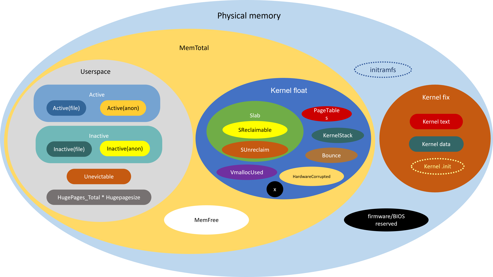
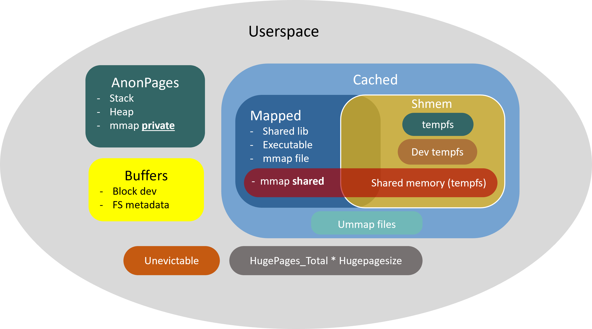

# 学习/proc/meminfo



## MemTotal

`MemTotal` = 物理内存 – firmware/BIOS 保留内存 - kernel 本身占用内存

## MemFree

* `MemFree`表示系统尚未使用的内存
* 已被用掉的内存 = `MemTotal` - `MemFree`

## MemAvailable

* `MemAvailable` 即系统可用的内存
* `MemAvailable` = 部分可回收的内存 + `MemFree`
  * 系统中有些内存虽然已被使用但是可以回收的，比如 cache/buffer、slab 都有一部分可以回收

## 内存黑洞

* Kernel的动态内存分配通过以下几种接口：
  * `alloc_pages/__get_free_page`: 以页为单位分配
  * `vmalloc`: 以字节为单位分配虚拟地址连续的内存块
  * slab allocator
    * `kmalloc`: 以字节为单位分配物理地址连续的内存块，它是以 slab 为基础的，使用 slab 层的 general caches — 大小为`2^n`，名称是`kmalloc-32`、`kmalloc-64`等（在老 kernel 上的名称是`size-32`、`size-64`等）。
* 通过`alloc_pages`分配的内存不会自动统计，除非调用`alloc_pages`的内核模块或驱动程序主动进行统计，否则我们只能看到 free memory 减少了，但从`/proc/meminfo`中看不出它们具体用到哪里去了。

## 内核

### 内核内存

```
Memory: 3918160K/4093400K available (18445K kernel code, 2373K rwdata, 5424K rodata, 1716K init, 1884K bss, 174980K reserved, 0K cma-reserved)
```

* Reserved
  * 初始化代码 init（`.init`section）
  * 内核代码及数据
    * 内核数据是动态变化的，这里所说的是引导阶段截至`mem_init`为止所产生的数据，包括存放页描述符`struct page`的`mem_map[]`数组等
  * initrd
    * initrd 和初始化代码 init 在引导完成之后会被释放掉，所以最终的可用内存会比`dmesg`显示的`available`更多一点
* Absent
  * 表示不可用的物理内存大小。譬如有一些物理内存被 BIOS 保留、对 kernel 是不可用的，这部分物理内存被计入`absent`之中
* Available
  * `available` = 物理内存 – `absent` – `reserved`

### SLAB

* SReclaimable
  * slab 中可回收的部分
  * 调用`kmem_getpages()`时加上`SLAB_RECLAIM_ACCOUNT`标记，表明是可回收的，计入`SReclaimable`，否则计入`SUnreclaim`
* SUnreclaim
  * slab 中不可回收的部分
* Slab
  * slab = `SReclaimable` + `SUnreclaim`

### VmallocUsed

* 通过`vmalloc`分配的内存
  * `VM_ALLOC`操作分配的内存从`/proc/vmallocinfo`中的`vmalloc`记录看到
    * 一些 driver 以及网络模块和文件系统模块可能会调用`vmalloc`
    * 加载内核模块(kernel module)时也会用到
* 还有`VM_IOREMAP`、`VM_MAP`等操作的值分配的物理内存
  * `VM_IOREMAP`是把IO地址映射到内核空间，并未消耗物理内存

### HardwareCorrupted

* 当系统检测到内存的硬件故障时，会把有问题的页面删除掉，不再使用，`/proc/meminfo`中的`HardwareCorrupted`统计了删除掉的内存页的总大小
* 相应的代码参见 mm/memory-failure.c:`memory_failure()`

### PageTables

* 页表占用的空间，属于内核占用的空间
* 不包括页面描述符（`struct page`）所占用的空间
  * 每个物理页对应一个描述符(`struct page`)，在内核的引导阶段就会分配好，保存在`mem_map[]`数组中，
  * `mem_map[]`所占用的内存被统计在`dmesg`显示的`reserved`中，`/proc/meminfo`的`MemTotal`是不包含它们的
  * 在NUMA系统上可能会有多个`mem_map`数组，在`node_data`中或`mem_section`中

### KernelStack

* Kernel stack（内核栈）是常驻内存的，既不包括在 LRU lists 里，也不包括在进程的 RSS/PSS 内存里，所以我们认为它是 kernel 消耗的内存

### Bounce

> 有些老设备只能访问低端内存，比如 16M 以下的内存，当应用程序发出一个 I/O 请求，DMA 的目的地址却是高端内存时（比如在 16M 以上），内核将在低端内存中分配一个临时 buffer 作为跳转，把位于高端内存的缓存数据复制到此处。这种额外的数据拷贝被称为“bounce buffering”，会降低 I/O 性能。大量分配的 bounce buffers 也会占用额外的内存。

## 用户进程



### Hugepages

* 独立统计的，与其它统计项不重叠，既不计入进程的 RSS/PSS 中，又不计入 LRU Active/Inactive，也不会计入 cache/buffer。如果进程使用了 Hugepages，它的 RSS/PSS 不会增加
* 一个进程通过`mmap()`申请并使用了 Hugepages，在`/proc/<pid>/smaps`中可以看到如下内存段，`VmFlags`包含的`ht`表示Hugepages，`kernelPageSize`是`2048kB`，注意`RSS/PSS`都是`0`：
  ```
  ...
  2aaaaac00000-2aaabac00000 rw-p 00000000 00:0c 311151 /anon_hugepage (deleted)
  Size: 262144 kB
  Rss: 0 kB
  Pss: 0 kB
  Shared_Clean: 0 kB
  Shared_Dirty: 0 kB
  Private_Clean: 0 kB
  Private_Dirty: 0 kB
  Referenced: 0 kB
  Anonymous: 0 kB
  AnonHugePages: 0 kB
  Swap: 0 kB
  KernelPageSize: 2048 kB
  MMUPageSize: 2048 kB
  Locked: 0 kB
  VmFlags: rd wr mr mw me de ht
  ...
  ```

#### HugePages_Total

* 对应内核参数`vm.nr_hugepages`
* 也可以在运行中的系统上直接修改`/proc/sys/vm/nr_hugepages`
* 修改的结果会立即影响空闲内存`MemFree`的大小，因为 HugePages 在内核中独立管理，只要一经定义，无论是否被使用，都不再属于 free memory

#### 使用 Hugepages 的三种方式

1. `mount`一个特殊的 **hugetlbfs 文件系统**，在上面创建文件，然后用`mmap()`进行访问，如果要用`read()`访问也是可以的，但是`write()`不行
2. 通过`shmget/shmat`也可以使用 Hugepages，调用`shmget`申请共享内存时要加上`SHM_HUGETLB`标志
3. 通过`mmap()`，调用时指定`MAP_HUGETLB`标志也可以使用 Huagepages

#### HugePages_Rsvd

* 用户程序在申请 Hugepages 的时候，其实是 reserve 了一块内存，并未真正使用，此时`/proc/meminfo`中的 `HugePages_Rsvd`会增加，而`HugePages_Free`不会减少

#### HugePages_Free

* 等到用户程序真正读写 Hugepages 的时候，它才被消耗掉了，此时`HugePages_Free`会减少，`HugePages_Rsvd`也会减少

### AnonHugePages

* `AnonHugePages`统计的是 Transparent HugePages (THP)
* `AnonHugePages`与`/proc/meminfo`的其他统计项有重叠

  * 它被包含在`AnonPages`之中
  * 在`/proc/<pid>/smaps`中也有单个进程的统计
  * 与进程的`RSS/PSS`是有重叠的，如果用户进程用到了 THP，进程的`RSS/PSS`也会相应增加
* THP 也可以用于 shared memory 和 tmpfs，缺省是禁止的

  * `mount`时加上`huge=always`等选项
  * 通过`/sys/kernel/mm/transparent_hugepage/shmem_enabled`来控制
* 因为缺省情况下 shared memory 和 tmpfs 不使用 THP，所以进程之间不会共享`AnonHugePages`，于是就有以下等式：

  ```
  /proc/meminfo 的 AnonHugePages == 所有进程的 /proc/<pid>/smaps 中 AnonHugePages 之和
  ```

### LRU

* LRU 是 kernel 的页面回收算法（Page Frame Reclaiming）使用的数据结构
* Page cache 和所有用户进程的内存（kernel stack 和 huge pages 除外）都在 LRU lists 上
* LRU lists 包括如下几种：
  * LRU_INACTIVE_ANON – 对应 `Inactive(anon)`
  * LRU_ACTIVE_ANON – 对应 `Active(anon)`
  * LRU_INACTIVE_FILE – 对应 `Inactive(file)`
  * LRU_ACTIVE_FILE – 对应 `Active(file)`
  * LRU_UNEVICTABLE – 对应 `Unevictable`
* **Inactive list** 里的是长时间未被访问过的内存页，**Active list** 里的是最近被访问过的内存页，LRU 算法利用 Inactive list 和 Active list 可以判断哪些内存页可以被优先回收
* Unevictable LRU list 上是不能 page-out/swap-out 的内存页，包括
  * `VM_LOCKED`的内存页
  * `SHM_LOCK`的共享内存页（又被统计在`Mlocked`中）
  * ramfs
* 在 unevictable list 出现之前，这些内存页都在 Active/Inactive lists 上，vmscan 每次都要扫过它们，但是又不能把它们 pageout/swapout，这在大内存的系统上会严重影响性能，设计 unevictable list 的初衷就是避免这种情况。参见 https://www.kernel.org/doc/Documentation/vm/unevictable-lru.txt
* LRU 中不包含`HugePages_*`
* LRU 包含了`Cached`和`AnonPages`

#### file-backed pages vs anonymous pages

* 用户进程的内存页分为两种：**file-backed pages**（与文件对应的内存页），和 **anonymous pages**（匿名页）
  * **file-backed**：进程的代码、映射的文件等
  * **anonymous**: 进程的堆、栈都是不与文件相对应的，就属于匿名页
* file-backed pages 在内存不足的时候可以直接写回对应的硬盘文件里，称为 **page-out**，不需要用到交换区（swap）
* anonymous pages 在内存不足时就只能写到硬盘上的交换区（swap）里，称为 **swap-out**

### Shmem

* `Shmem`统计的内容包括
  * shared memory
    * SysV shared memory [`shmget` etc.]
    * POSIX shared memory [`shm_open` etc.]
    * shared anonymous mmap [`mmap(...MAP_ANONYMOUS|MAP_SHARED...)`]
  * tmpfs 和 devtmpfs
    * 所有 tmpfs 类型的文件系统占用的空间都计入共享内存
    * devtmpfs 是`/dev`文件系统的类型，`/dev/`下所有的文件占用的空间也属于共享内存。可以用`ls`和`du`命令查看
    * 如果文件在没有关闭的情况下被删除，空间仍然不会释放，shmem 不会减小，可以用`lsof -a +L1 /<mount_point>`命令列出这样的文件

#### shared memory

* shared memory 在内核中都是基于 tmpfs 实现的
  * https://www.kernel.org/doc/Documentation/filesystems/tmpfs.txt
* 也就是说它们被视为基于 *tmpfs文件系统* 的内存页
  * 既然基于文件系统，就不算匿名页，所以 **不被计入`/proc/meminfo`中的`AnonPages`**
  * 而是被统计进了：
    * `Cached`（i.e. page cache）
    * `Mapped`（当 shmem 被 attached 时）
* 然而它们背后并不存在真正的硬盘文件，一旦内存不足的时候，它们是需要交换区才能 swap-out 的，所以在 LRU lists 里，它们被放在：
  * `Inactive(anon)` 或 `Active(anon)`
    * 注：虽然它们在 LRU 中被放进了 anon list，但是不会被计入`AnonPages`。这是 shared memory & tmpfs 比较拧巴的一个地方，需要特别注意。
  * 或 `unevictable`（如果被 locked 的话）
* 当`shmget/shm_open/mmap`创建共享内存时，物理内存尚未分配，要直到真正访问时才分配。`/proc/meminfo`中的`Shmem`统计的是 **已经分配的大小**，而不是 **创建时申请的大小**

### AnonPages

* 所有 page cache 里的页面（`Cached`）都是 file-backed pages，不是 anonymous Pages。`Cached`与`AnoPages`之间没有重叠。
  * 注：shared memory 不属于`AnonPages`，而是属于`Cached`，因为 shared memory 基于 tmpfs，所以被视为 file-backed，在 page cache 里
* mmap **private** anonymous pages 属于`AnonPages`（anonymous pages），而 mmap **shared** anonymous pages 属于`Cached`（file-backed pages），因为 shared anonymous mmap 也是基于 tmpfs 的
* Anonymous Pages 是与用户进程共存的，一旦进程退出，则 anonymous pages 也释放，不像 page cache 即使文件与进程不关联了还可以缓存
* `AnonPages`统计值中包含了 Transparent HugePages（THP）对应的`AnonHugePages`

### Mapped

> Page cache 中(`Cached`)包含了文件的缓存页，其中有些文件当前已不在使用，page cache 仍然可能保留着它们的缓存页面；而另一些文件正被用户进程关联，比如 shared libraries、可执行程序的文件、`mmap`的文件等，这些文件的缓存页就称为 **mapped**。

* `Mapped`是`Cached`的子集
* 被 attached 的shared memory、以及 tmpfs上被 map 的文件都算做`Mapped`
* 进程所占的内存页分为 anonymous pages 和 file-backed pages，理论上应该有：
  ```
  所有进程的PSS之和 == Mapped + AnonPages
  ```

### Cached

* Page Cache 里包括所有 file-backed pages，统计在`/proc/meminfo`的`Cached`中
* `Cached`是`Mapped`的超集
  * 就是说它不仅包括 mapped，也包括 unmapped 的页面，当一个文件不再与进程关联之后，原来在 page cache 中的页面并不会立即回收，仍然被计入`Cached`，还留在LRU中，但是`Mapped`统计值会减小
  * `ummaped = Cached – Mapped`
* `Cached`包含`Shmem`
  * 即 tmpfs 中的文件，POSIX/SysV shared memory，以及 shared anonymous mmap，后两者在内核中都是基于 tmpfs 实现的
    * https://www.kernel.org/doc/Documentation/filesystems/tmpfs.txt
* `Cached`和`SwapCached`两个统计值是互不重叠的
  * 所以，Shared memory 和 tmpfs 在不发生 swap-out 的时候属于`Cached`
  * 而在 swap-out/swap-in 的过程中会被加进 swap cache 中，属于`SwapCached`，一旦进了`SwapCached`，就不再属于`Cached`

### SwapCached

* 交换区可以包括一个或多个交换区设备（裸盘、逻辑卷、文件都可以充当交换区设备）
* 每一个交换区设备都对应自己的 swap cache，可以把 swap cache 理解为交换区设备的“page cache”
  * page cache 对应的是一个个文件，swap cache 对应的是一个个交换区设备
* kernel 管理 swap cache 与管理 page cache一样，用的都是 radix-tree，唯一的区别是：
  * page cache 与文件的对应关系在打开文件时就确定了
  * 而一个匿名页只有在即将被 swap-out 的时候才决定它会被放到哪一个交换区设备，即匿名页与 swap cache 的对应关系在即将被swap-out时才确立
* `/proc/meminfo`中的`SwapCached`背后的含义是：
  * 系统中有多少匿名页曾经被 swap-out，现在又被 swap-in
  * 并且 swap-in 之后页面中的内容一直没发生变化
  * 也就是说，如果这些匿名页需要被 swap-out 的话，是无需进行 I/O write 操作的
* `SwapCached`不属于`Cached`，两者没有交叉

### Buffers

* `Buffers`表示 **块设备**（block device）所占用的缓存页
  * 直接读写块设备
  * 文件系统元数据（metadata），比如 SuperBlock 所使用的缓存页
* 它与`Cached`的区别在于，`Cached`表示 **普通文件** 所占用的缓存页
* `Buffers`所占的内存同时也在 LRU list 中，被统计在`Active(file)`或`Inactive(file)`

### Mlocked

* `Mlocked`统计的是被`mlock()`系统调用锁定的内存大小
* 被锁定的内存因为不能 page-out/swap-out，会从 Active/Inactive LRU list 移到 Unevictable LRU list 上
  * 也就是说，当`Mlocked`增加时，`Unevictable`也同步增加，而`Active`或`Inactive`同时减小
  * 当`Mlocked`减小的时候，`Unevictable`也同步减小，而`Active`或`Inactive`同时增加
* `Mlocked`并不是独立的内存空间，它与以下统计项重叠：`LRU Unevictable`，`AnonPages`，`Shmem`，`Mapped`等

## 其它问题

### DirectMap

* `/proc/meminfo`中的`DirectMap`所统计的不是关于内存的使用，而是一个反映TLB效率的指标
  * 为了尽可能地将地址放进 TLB 缓存，新的 CPU 硬件支持比`4k`更大的页面从而达到减少地址数量的目的，比如`2MB`，`4MB`，甚至`1GB`的内存页，视不同的硬件而定
  * `DirectMap4k`表示映射为`4kB`的内存数量，`DirectMap2M`表示映射为`2MB`的内存数量，以此类推。所以`DirectMap`其实是一个反映TLB效率的指标

### Dirty pages 到底有多少？

* `系统中全部 dirty pages = ( Dirty + NFS_Unstable + Writeback )`
  * `NFS_Unstable`是发给 NFS server 但尚未写入硬盘的缓存页
  * `Writeback`是正准备回写硬盘的缓存页

### 为什么 Active(anon) + Inactive(anon) 不等于 AnonPages？

* 因为`Shmem`（即 shared memory & tmpfs）被计入 LRU Active/Inactive(anon)，但未计入`AnonPages`
* 所以一个更合理的等式是：
  ```
  Active(anon) + Inactive(anon) =  AnonPages + Shmem
  ```

### 为什么 Active(file) + Inactive(file) 不等于 Mapped？

1. 因为 LRU Active(file) 和 Inactive(file) 中不仅包含 mapped 页面，还包含 unmapped 页面
2. `Mapped`中包含`Shmem`(即 shared memory & tmpfs)，这部分内存被计入了 LRU Active(anon) 或 Inactive(anon)，而不在 Active(file) 和 Inactive(file) 中

### 为什么 Active(file) + Inactive(file) 不等于 Cached？

1. 因为`Shmem`（即 shared memory & tmpfs）包含在`Cached`中，而不在 Active(file) 和 Inactive(file) 中
2. Active(file) 和 Inactive(file) 还包含 Buffers

* 如果不考虑`mlock`的话，一个更符合逻辑的等式是：
  ```
  Active(file) + Inactive(file) + Shmem == Cached + Buffers
  ```
* 如果有`mlock`的话，等式应该如下（`mlock`包括 file 和 anon 两部分，`/proc/meminfo`中并未分开统计，下面的`mlock_file`只是用来表意，实际并没有这个统计值）：
  ```
  Active(file) + Inactive(file) + Shmem + mlock_file == Cached + Buffers
  ```

### Linux的内存都用到哪里去了？

#### kernel 内存的统计方式

```
Slab + VmallocUsed + PageTables + KernelStack + HardwareCorrupted + Bounce + X
```

* 注1：`VmallocUsed`其实不是我们感兴趣的，因为它还包括了`VM_IOREMAP`等并未消耗物理内存的 IO 地址映射空间，我们只关心`VM_ALLOC`操作，所以实际上应该统计`/proc/vmallocinfo`中的`vmalloc`记录，例如（此处单位是`byte`）
  ```
  # grep vmalloc /proc/vmallocinfo | awk '{total+=$2}; END {print total}'
  ```
* kernel module 的内存被包含在`VmallocUsed`中
* X 表示直接通过`alloc_pages/__get_free_page`分配的内存，没有在`/proc/meminfo`中统计，不知道有多少，就像个黑洞

#### 用户进程的内存主要有三种统计口径

1. 围绕 LRU 进行统计

   ```
   (Active + Inactive + Unevictable) + (HugePages_Total * Hugepagesize)
   ```
2. 围绕 Page Cache 进行统计

   * 当`SwapCached`为`0`的时候，用户进程的内存总计如下：

   ```
   (Cached + AnonPages + Buffers) + (HugePages_Total * Hugepagesize)
   ```

   * 当`SwapCached`不为`0`的时候，以上公式不成立，因为`SwapCached`可能会含有`Shmem`，而`Shmem`本来被含在`Cached`中，一旦 swap-out 就从`Cached`转移到了`SwapCached`，可是我们又不能把`SwapCached`加进上述公式中，因为`SwapCached`虽然不与`Cached`重叠却与`AnonPages`有重叠，它既可能含有 shared memory 又可能含有 anonymous pages。
3. 围绕`RSS/PSS`进行统计

   * 把`/proc/[1-9]*/smaps`中的`PSS`累加起来就是所有用户进程占用的内存，但是还没有包括 Page Cache 中 unmapped 部分，以及 HugePages，所以公式如下：

   ```
   ΣPSS + (Cached – mapped) + Buffers + (HugePages_Total * Hugepagesize)
   ```

#### 所以系统内存的使用情况可以用以下公式表示

```c
MemTotal = MemFree + (Slab + VmallocUsed + PageTables + KernelStack + HardwareCorrupted + Bounce + X) + (Active + Inactive + Unevictable + (HugePages_Total * Hugepagesize))
```

```c
MemTotal = MemFree + (Slab + VmallocUsed + PageTables + KernelStack + HardwareCorrupted + Bounce + X) + (Cached + AnonPages + Buffers + (HugePages_Total * Hugepagesize))
```

```c
MemTotal = MemFree + (Slab + VmallocUsed + PageTables + KernelStack + HardwareCorrupted + Bounce + X) + (ΣPSS + (Cached – mapped) + Buffers + (HugePages_Total * Hugepagesize))
```

# References

* [free命令显示的buffers与cached的区别](http://linuxperf.com/?p=32)
* [解读dmesg中的内存初始化信息](http://linuxperf.com/?p=139)
* [/proc/meminfo之谜](http://linuxperf.com/?p=142)
