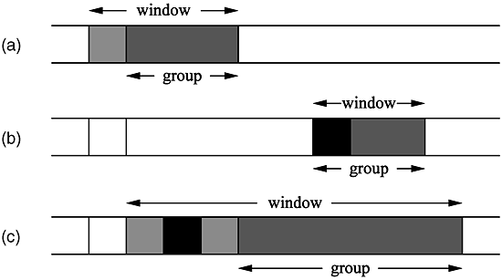

# 进程地址空间

# 地址空间
* **进程地址空间** 由进程可寻址的虚拟内存组成，内核允许进程使用这种虚拟内存中的地址。
* **内存地址** 是在地址空间范围之内的一个给定值，表示的是进程地址空间中的一个特定的字节。
* **内存区域（memory areas）** 可被访问的合法地址空间。
* **BSS（block started by symbol）**
  * 未初始化全局变量没有对应的值，无需存放在可执行目标文件中。
  * C标准强制规定未初始化的全局变量要被赋予特殊的默认值（基本上是0）。
  * 内核的做法是，将未赋值的变量从可执行代码载入到内存中，然后将零页映射到该片内存上，于是这些未初始化变量被赋0。
  * 避免在目标文件中显示地进行初始化，减少了空间的浪费。

# 内存描述符


* 内核用`struct mm_struct`表示进程的地址空间，该结构包含了和进程地址空间有关的全部信息。
* include/linux/mm_types.h
```c
struct mm_struct {
    struct vm_area_struct *mmap;        /* list of VMAs */
    struct rb_root mm_rb;               /*VMA形成的红黑树*/
    u32 vmacache_seqnum;                   /* per-thread vmacache */
#ifdef CONFIG_MMU
    unsigned long (*get_unmapped_area) (struct file *filp,
                unsigned long addr, unsigned long len,
                unsigned long pgoff, unsigned long flags);
#endif
    unsigned long mmap_base;        /* base of mmap area */
    unsigned long mmap_legacy_base;         /* base of mmap area in bottom-up allocations */
    unsigned long task_size;        /* size of task vm space */
    unsigned long highest_vm_end;       /* highest vma end address */
    pgd_t * pgd;                /*页全局目录*/
    atomic_t mm_users;          /* How many users with user space? */
    atomic_t mm_count;          /* How many references to "struct mm_struct" (users count as 1) */
    atomic_long_t nr_ptes;          /* PTE page table pages */
#if CONFIG_PGTABLE_LEVELS > 2
    atomic_long_t nr_pmds;          /* PMD page table pages */
#endif
    int map_count;              /* number of VMAs */

    spinlock_t page_table_lock;     /* Protects page tables and some counters */
    struct rw_semaphore mmap_sem;   /*VMA的信号量*/

    struct list_head mmlist;        /* List of maybe swapped mm's.  These are globally strung
                         * together off init_mm.mmlist, and are protected
                         * by mmlist_lock
                         */


    unsigned long hiwater_rss;  /* High-watermark of RSS usage */
    unsigned long hiwater_vm;   /* High-water virtual memory usage */

    unsigned long total_vm;     /* Total pages mapped */
    unsigned long locked_vm;    /* Pages that have PG_mlocked set */
    unsigned long pinned_vm;    /* Refcount permanently increased */
    unsigned long data_vm;      /* VM_WRITE & ~VM_SHARED & ~VM_STACK */
    unsigned long exec_vm;      /* VM_EXEC & ~VM_WRITE & ~VM_STACK */
    unsigned long stack_vm;     /* VM_STACK */
    unsigned long def_flags;
    unsigned long start_code, end_code, start_data, end_data; /*代码段的开始和结束地址，数据段的开始和结束地址*/
    unsigned long start_brk, brk, start_stack; /*堆的开始地址和尾地址，进程栈的首地址*/
    unsigned long arg_start, arg_end, env_start, env_end; /*命令行参数的开始和结束地址，环境变量的开始和结束地址*/

    unsigned long saved_auxv[AT_VECTOR_SIZE]; /* for /proc/PID/auxv */
    /*
     * Special counters, in some configurations protected by the
     * page_table_lock, in other configurations by being atomic.
     */
    struct mm_rss_stat rss_stat;

    struct linux_binfmt *binfmt;

    cpumask_var_t cpu_vm_mask_var;

    /* Architecture-specific MM context */
    mm_context_t context;

    unsigned long flags; /* Must use atomic bitops to access the bits */

    struct core_state *core_state; /* coredumping support */
#ifdef CONFIG_AIO
    spinlock_t          ioctx_lock;  /* AIO I/O 链表锁 */
    struct kioctx_table __rcu   *ioctx_table;
#endif
#ifdef CONFIG_MEMCG
    /*
     * "owner" points to a task that is regarded as the canonical
     * user/owner of this mm. All of the following must be true in
     * order for it to be changed:
     *
     * current == mm->owner
     * current->mm != mm
     * new_owner->mm == mm
     * new_owner->alloc_lock is held
     */
    struct task_struct __rcu *owner;
#endif

    /* store ref to file /proc/<pid>/exe symlink points to */
    struct file __rcu *exe_file;
#ifdef CONFIG_MMU_NOTIFIER
    struct mmu_notifier_mm *mmu_notifier_mm;
#endif
#if defined(CONFIG_TRANSPARENT_HUGEPAGE) && !USE_SPLIT_PMD_PTLOCKS
    pgtable_t pmd_huge_pte; /* protected by page_table_lock */
#endif
#ifdef CONFIG_CPUMASK_OFFSTACK
    struct cpumask cpumask_allocation;
#endif
#ifdef CONFIG_NUMA_BALANCING
    /*
     * numa_next_scan is the next time that the PTEs will be marked
     * pte_numa. NUMA hinting faults will gather statistics and migrate
     * pages to new nodes if necessary.
     */
    unsigned long numa_next_scan;

    /* Restart point for scanning and setting pte_numa */
    unsigned long numa_scan_offset;

    /* numa_scan_seq prevents two threads setting pte_numa */
    int numa_scan_seq;
#endif
#if defined(CONFIG_NUMA_BALANCING) || defined(CONFIG_COMPACTION)
    /*
     * An operation with batched TLB flushing is going on. Anything that
     * can move process memory needs to flush the TLB when moving a
     * PROT_NONE or PROT_NUMA mapped page.
     */
    bool tlb_flush_pending;
#endif
    struct uprobes_state uprobes_state;
#ifdef CONFIG_X86_INTEL_MPX
    /* address of the bounds directory */
    void __user *bd_addr;
#endif
#ifdef CONFIG_HUGETLB_PAGE
    atomic_long_t hugetlb_usage;
#endif
};        
```
* `mm_users` 记录的是正在使用该地址空间的进程数目。比如两个线程共享同一进程地址空间。
* `mm_count` 记录的是`struct mm_struct`的主引用计数。
  * 当`mm_users`的值减为0（即所有使用该地址空间的线程退出）时，`mm_count`的值才变为0。
  * 当内核在一个地址空间上操作，并需要使用与该地址相关联的引用计数时，内核便增加`mm_count`。
* `mmap`和`mm_rb`描述的对象是相同的：该地址空间中的全部内存区域。只是[组织（存放）的方式不同](#VMA的树形结构和链表结构)。
  * `mmap` 链表的方式，按起始虚拟地址排序
  * `mm_rb` 红黑树的方式。方便内核快速找到一个给定虚拟地址所在VMA
* `mmlist` 链接点。所有的`struct mm_struct`对象都通过`mmlist`域连接成双向链表。
  * 该链表首元素是`init_mm`，代表init进程的地址空间。
  * 操作该链表需加`mmlist_lock`锁来防止并发访问。

## 分配内存描述符
* `struct task_struct`的`mm`域就指向`struct mm_struct`。
* `fork()`利用`copy_mm()`复制父进程的内存描述符给其子进程。
* 子进程的`struct mm_struct`是从`mm_cachep` slab缓存分配得来的：
  * `_do_fork()` --> `copy_process()` --> `copy_mm()` --> `dup_mm()` --> `allocate_mm()` == `kmem_cache_alloc(mm_cachep, GFP_KERNEL)` --> `slab_alloc()`
* 通常，每个进程都有唯一的`struct mm_struct`对象，即唯一的地址空间。
* 如果父子进程共享地址空间，则在调用`clone()`时设置`CLONE_VM`标志，此时进程为我们通常所说的线程。
  * 此时`copy_mm()`不再调用`dup_mm()`-->`allocate_mm()`
  * kernel/fork.c
```c
static int copy_mm(unsigned long clone_flags, struct task_struct *tsk)
{
...
    /*   
     * Are we cloning a kernel thread?
     *
     * We need to steal a active VM for that..
     */
    oldmm = current->mm;
    if (!oldmm)
        return 0;
...
    if (clone_flags & CLONE_VM) {
        atomic_inc(&oldmm->mm_users);
        mm = oldmm;
        goto good_mm;
    }    

    retval = -ENOMEM;
    mm = dup_mm(tsk);
    if (!mm)
        goto fail_nomem;
...
}
```

## 撤销内存描述符
```c
do_exit()
-> exit_mm(tsk)
   -> mmput(mm)
      if (atomic_dec_and_test(&mm->mm_users))
          mmdrop(mm);
          
if (unlikely(atomic_dec_and_test(&mm->mm_count)))
      __mmdrop(mm);
          |
          V
       free_mm(mm) == (kmem_cache_free(mm_cachep, (mm)))
```

## mm_struct与内核线程
* **内核线程没有进程地址空间**，也没有相关的内存描述符，对应的`struct task_struct`中的`mm`域为空。
* 内核线程的真实含义——没有用户上下文。
* 内核线程不需要访问任何用户空间的内存，在用户空间没有任何页，所以实际上它们并不需要有自己的`struct mm_struct`和（映射用户空间）页表。
  * 然而，内核线程还是需要使用一些数据的，比如（映射内核的）页表。
  * 内核线程直接使用前一个进程的`struct mm_struct`
    * 避免内核线程为内存描述符和页表浪费内存
    * 新内核线程运行时，避免浪费处理器周期向新地址空间切换
* kernel/sched/core.c
```c
/*
 * context_switch - switch to the new MM and the new thread's register state.
 */
static __always_inline struct rq *
context_switch(struct rq *rq, struct task_struct *prev,
           struct task_struct *next)
{
    struct mm_struct *mm, *oldmm;
...
    mm = next->mm;           /*mm指向将被调度的进程的内存描述符*/
    oldmm = prev->active_mm; /*oldmm指向前一进程（即当前进程）的active_mm*/
...
    if (!mm) {  /*如果被调度进程是内核线程*/
      /*保留前一进程的地址空间，这样在需要时内核线程可以使用前一进程的页表。
        内核线程不访问用户空间的内存，仅仅使用地址空间中和内核内存相关的信息，
        这些信息的含义和普通进程完全相同。*/
        next->active_mm = oldmm;
        atomic_inc(&oldmm->mm_count);
        enter_lazy_tlb(oldmm, next);
    } else
        switch_mm(oldmm, mm, next);  /*体系架构相关的实现*/

    if (!prev->mm) {  /*如果前一进程（即当前进程）是内核线程*/
      /*这里为什么active_mm置为空？ active_mm != mm 是类似flush TLB或mmdrop()判断条件。
        下次该线程被调度回来时，该空值会被上面的赋值语句被直接覆盖掉。*/
        prev->active_mm = NULL;
        rq->prev_mm = oldmm;
    }    
...
    /* Here we just switch the register state and the stack. */
    switch_to(prev, next, prev);
    barrier();

    return finish_task_switch(prev);
}
```
### 进程切换时刷新 TLB
* `mov` to `CR3` 可能会 invalidate TLB entry。分多种情况：
  * 如果 PCID 关闭的话（`CR4.PCIDE = 0`），会 flush（invalidate）掉所有的 TLB entry
  * 如果 PCID 开启的话（`CR4.PCIDE = 1`），
    * 当 `NOFLUSH` bit（`CR3` 最高位，`63` bit）设置时，不会进行 flush 操作；
    * 当 `NOFLUSH` bit（`CR3` 最高位，`63` bit）未设置时，会 flush（invalidate）掉当前 PCID（`CR3` 低 `12` bit）对应的 TLB entry。
* 进程切换时 `context_switch() -> switch_mm_irqs_off()` 去切换 `mm_struct`，还是 `load_new_mm_cr3()` 往 `CR3` 中 load 新进程的 PGD
* arch/x86/mm/tlb.c
```cpp
#ifdef CONFIG_X86_64
/* Mask off the address space ID and SME encryption bits. */
#define CR3_ADDR_MASK   __sme_clr(PHYSICAL_PAGE_MASK)
#define CR3_PCID_MASK   0xFFFull
#define CR3_NOFLUSH BIT_ULL(63)
#else
...
#endif

static inline unsigned long build_cr3(pgd_t *pgd, u16 asid, unsigned long lam)
{
    unsigned long cr3 = __sme_pa(pgd) | lam;

    if (static_cpu_has(X86_FEATURE_PCID)) {
        cr3 |= kern_pcid(asid);
    } else {
        VM_WARN_ON_ONCE(asid != 0);
    }

    return cr3;
}
//CR3 的 63 bit 为 1，即 CR3_NOFLUSH，不会进行 flush 操作
static inline unsigned long build_cr3_noflush(pgd_t *pgd, u16 asid,
                          unsigned long lam)
{
    /*
     * Use boot_cpu_has() instead of this_cpu_has() as this function
     * might be called during early boot. This should work even after
     * boot because all CPU's the have same capabilities:
     */
    VM_WARN_ON_ONCE(!boot_cpu_has(X86_FEATURE_PCID));
    return build_cr3(pgd, asid, lam) | CR3_NOFLUSH;
}
...
//新进程的 PGD 写入 CR3
static void load_new_mm_cr3(pgd_t *pgdir, u16 new_asid, unsigned long lam,
                bool need_flush)
{
    unsigned long new_mm_cr3;

    if (need_flush) {
        invalidate_user_asid(new_asid);
        new_mm_cr3 = build_cr3(pgdir, new_asid, lam);
    } else {
        new_mm_cr3 = build_cr3_noflush(pgdir, new_asid, lam);
    }

    /*
     * Caution: many callers of this function expect
     * that load_cr3() is serializing and orders TLB
     * fills with respect to the mm_cpumask writes.
     */
    write_cr3(new_mm_cr3);
}
```
# 虚拟内存区域（vm_area_struct）


* `struct vm_area_struct` 描述了指定地址空间内连续区间上的一个独立内存范围。
* 内核将每个VMA作为一个单独的内存对象管理，每个VMA都拥有一致的属性，比如访问权限等，另外，相应的操作也一致。
* 按照这样的方式，每一个VMA就可以代表不同类型的内存区域，对应于进程地址空间中的唯一区间。
* include/linux/mm_types.h
```c
/*
 * This struct defines a memory VMM memory area. There is one of these
 * per VM-area/task.  A VM area is any part of the process virtual memory
 * space that has a special rule for the page-fault handlers (ie a shared
 * library, the executable area etc).
 */
struct vm_area_struct {
    /* The first cache line has the info for VMA tree walking. */

    unsigned long vm_start;     /* Our start address within vm_mm. */
    unsigned long vm_end;       /* The first byte after our end address
                       within vm_mm. */

    /* linked list of VM areas per task, sorted by address */
    struct vm_area_struct *vm_next, *vm_prev;

    struct rb_node vm_rb; /*红黑树上该VMA的节点*/

    /*  
     * Largest free memory gap in bytes to the left of this VMA.
     * Either between this VMA and vma->vm_prev, or between one of the
     * VMAs below us in the VMA rbtree and its ->vm_prev. This helps
     * get_unmapped_area find a free area of the right size.
     */
    unsigned long rb_subtree_gap;

    /* Second cache line starts here. */

    struct mm_struct *vm_mm;    /* The address space we belong to. */
    pgprot_t vm_page_prot;      /* Access permissions of this VMA. */
    unsigned long vm_flags;     /* Flags, see mm.h. */

    /*  
     * For areas with an address space and backing store,
     * linkage into the address_space->i_mmap interval tree.
     */
    struct {
        struct rb_node rb;
        unsigned long rb_subtree_last;
    } shared;

    /*  
     * A file's MAP_PRIVATE vma can be in both i_mmap tree and anon_vma
     * list, after a COW of one of the file pages.  A MAP_SHARED vma
     * can only be in the i_mmap tree.  An anonymous MAP_PRIVATE, stack
     * or brk vma (with NULL file) can only be in an anon_vma list.
     */
    struct list_head anon_vma_chain; /* Serialized by mmap_sem &
                       * page_table_lock */
    struct anon_vma *anon_vma;  /* Serialized by page_table_lock */

    /* Function pointers to deal with this struct. */
    const struct vm_operations_struct *vm_ops;

    /* Information about our backing store: */
    unsigned long vm_pgoff;     /* Offset (within vm_file) in PAGE_SIZE
                       units */
    struct file * vm_file;      /* File we map to (can be NULL). */
    void * vm_private_data;     /* was vm_pte (shared mem) */

#ifndef CONFIG_MMU
    struct vm_region *vm_region;    /* NOMMU mapping region */
#endif
#ifdef CONFIG_NUMA
    struct mempolicy *vm_policy;    /* NUMA policy for the VMA */
#endif
    struct vm_userfaultfd_ctx vm_userfaultfd_ctx;
};
```
* `vm_start`这个地址在区间之 *内*，`vm_end`这个地址在区间之 *外*。
* `vm_end - vm_start`的大小即区间的长度。
* 同一个地址空间内的不同VMA **不能重叠**。
* 注意，每个VMA对其相关的`struct mm_struct`的对象来说都是唯一的。
  * 即使两个独立的进程将同一个文件映射到各自的地址空间，它们分别都会有一个`vm_area_struct`来标志的内存区域。
  * 如果两个线程共享同一个地址空间，那么它们也同时共享其中的所有`vm_area_struct`。

## VMA Flags
* `struct vm_area_struct`的`vm_flags`域标志了VMA所包含的页面的行为和信息。
* 和物理页的访问权限不同，VMA flags反映了内核处理页面所需遵守的行为准则，而不是硬件要求。
* `vm_flags`也包含了VMA中 *每个页面的信息*，或内存区域的整体信息，而不是独立的具体页面。
* 见 include/linux/mm.h

### vm_flags

Flag | Effect on the VMA and Its Pages
---|---
VM_READ | Pages can be read from.
VM_WRITE | Pages can be written to.
VM_EXEC | Pages can be executed.
VM_SHARED | Pages are shared.
VM_MAYREAD | The VM_READ flag can be set.
VM_MAYWRITE | The VM_WRITE flag can be set.
VM_MAYEXEC | The VM_EXEC flag can be set.
VM_MAYSHARE | The VM_SHARE flag can be set.
VM_GROWSDOWN | The area can grow downward.
VM_GROWSUP | The area can grow upward.
VM_SHM | The area is used for shared memory.
VM_DENYWRITE | The area maps an unwritable file.
VM_EXECUTABLE | The area maps an executable file.
VM_LOCKED | The pages in this area are locked.
VM_IO | The area maps a device’s I/O space.
VM_SEQ_READ | The pages seem to be accessed sequentially.
VM_RAND_READ | The pages seem to be accessed randomly.
VM_DONTCOPY | This area must not be copied on `fork()`.
VM_DONTEXPAND | This area cannot grow via `mremap()`.
VM_RESERVED | This area must not be swapped out.
VM_ACCOUNT | This area is an accounted VM object.
VM_HUGETLB | This area uses hugetlb pages.
VM_NONLINEAR | This area is a nonlinear mapping.

* `VM_SHARED` 指明了内存区域包含的映射是否可以在多进程之间共享。
  * 如果该标志被设置，则我们称其为 **共享映射**。
  * 如果未被设置，而仅仅只有一个进程可以使用该映射的内容，我们称它为 **私有映射**。
* `VM_IO`标志内存区域中包含对设备I/O空间的映射。
  * 该标志通常在设备驱动程序执行`mmap()`函数进行I/O空间映射时才被设置。
  * 该标志也表示该VMA不能包含在任何进程的内存转储（core dump）中。
* `VM_RESERVED`标志规定了该VMA不能被换出，在设备驱动程序进行映射时被设置。
* `VM_SEQ_READ`标志暗示内核，应用程序对映射内容执行有序的（线性的和连续的）读操作；这样内核可以有选择性地执行预读文件。
* `VM_RAND_READ`标志暗示应用程序对映射内容执行随机的（非有序的）读操作。内核可以有选择性地减少或者彻底取消文件预读。
* 系统调用`madvise(2)`可以设置`VM_SEQ_READ`和`VM_RAND_READ`标志。
  * 设置参数分别是`MADV_SEQUENTIAL`和`MADV_RANDOM`。
* **文件预读（read-ahead）** 是指在读取数据时有意地按顺序多读取一些本次请求以外的数据——希望多读的数据很快就能够被用到。
  * 关于文件预读的算法简介可以看 [这里](http://www.penglixun.com/tech/system/linux_cache_discovery.html#3_Cache) 。
  * 还有一篇相关的论文，但比较旧 [The Performance Impact of Kernel Prefetching on Buffer Cache Replacement Algorithms](http://www.cs.arizona.edu/projects/dream/papers/sigm05_prefetch.pdf)
  * 相关的函数 [readahead(2)](http://man7.org/linux/man-pages/man2/readahead.2.html)



## VMA操作
* `struct vm_area_struct`中的`vm_ops`域指向与指定内存区域相关的操作函数表。内核使用表中的方法操作VMA。
* `struct vm_area_struct`作为通用对象代表了任何类型的VMA。
* `struct vm_operations_struct`则描述针对特定对象实例的特定方法。
* include/linux/mm.h
```c
/*
 * These are the virtual MM functions - opening of an area, closing and
 * unmapping it (needed to keep files on disk up-to-date etc), pointer
 * to the functions called when a no-page or a wp-page exception occurs.
 */
struct vm_operations_struct {
    void (*open)(struct vm_area_struct * area); /*指定内存区域被加入到一个地址空间时调用*/
    void (*close)(struct vm_area_struct * area); /*指定内存区域从地址空间删除时调用*/
    int (*mremap)(struct vm_area_struct * area);
    int (*fault)(struct vm_area_struct *vma, struct vm_fault *vmf); /*当没有出现在物理内存中的页面被访问时，该函数被缺页处理函数调用*/
    int (*pmd_fault)(struct vm_area_struct *, unsigned long address,
                        pmd_t *, unsigned int flags);
    void (*map_pages)(struct vm_area_struct *vma, struct vm_fault *vmf);

    /* notification that a previously read-only page is about to become
     * writable, if an error is returned it will cause a SIGBUS */
    int (*page_mkwrite)(struct vm_area_struct *vma, struct vm_fault *vmf); /*当某个页面为只读页面时，被缺页处理函数调用*/

    /* same as page_mkwrite when using VM_PFNMAP|VM_MIXEDMAP */
    int (*pfn_mkwrite)(struct vm_area_struct *vma, struct vm_fault *vmf);

    /* called by access_process_vm when get_user_pages() fails, typically
     * for use by special VMAs that can switch between memory and hardware
     */
    int (*access)(struct vm_area_struct *vma, unsigned long addr,
              void *buf, int len, int write);

    /* Called by the /proc/PID/maps code to ask the vma whether it
     * has a special name.  Returning non-NULL will also cause this
     * vma to be dumped unconditionally. */
    const char *(*name)(struct vm_area_struct *vma);

#ifdef CONFIG_NUMA
    /*
     * set_policy() op must add a reference to any non-NULL @new mempolicy
     * to hold the policy upon return.  Caller should pass NULL @new to
     * remove a policy and fall back to surrounding context--i.e. do not
     * install a MPOL_DEFAULT policy, nor the task or system default
     * mempolicy.
     */
    int (*set_policy)(struct vm_area_struct *vma, struct mempolicy *new);

    /*
     * get_policy() op must add reference [mpol_get()] to any policy at
     * (vma,addr) marked as MPOL_SHARED.  The shared policy infrastructure
     * in mm/mempolicy.c will do this automatically.
     * get_policy() must NOT add a ref if the policy at (vma,addr) is not
     * marked as MPOL_SHARED. vma policies are protected by the mmap_sem.
     * If no [shared/vma] mempolicy exists at the addr, get_policy() op
     * must return NULL--i.e., do not "fallback" to task or system default
     * policy.
     */
     struct mempolicy *(*get_policy)(struct vm_area_struct *vma,
                     unsigned long addr);
 #endif
     /*
      * Called by vm_normal_page() for special PTEs to find the
      * page for @addr.  This is useful if the default behavior
      * (using pte_page()) would not find the correct page.
      */
     struct page *(*find_special_page)(struct vm_area_struct *vma,
                       unsigned long addr);
 };
```

## VMA的树形结构和链表结构
* 可通过`struct mm_struct`的`mmap`和`mm_rb`域之一访问VMA。
  * 这两个域 *各自独立地* 指向与内存描述符相关的 *全体VMA对象*。
  * 包含完全相同的`struct vm_area_struct`的指针，仅仅组织方法不同。
* `mmap`域用单链表连接所有的VMA。
  * 每个`struct vm_area_struct`通过自身的`vm_next`域被连入链表。
  * 所有的区域按照地址增长的方向排序。
  * `mmap`域指向链表中的第一个VMA，最后一个结构体指针指向空。
* `mm_rb`域用红黑树连接所有的VMA。
  * `mm_rb`指向红黑树的根结点。
  * 每个`struct vm_area_struct`通过自身的`vm_rb`域连接到树中。
* 链表用于 **遍历**，红黑树用于 **定位** 特定VMA。

# 操作内存区域

## find_vma()
* `find_vma()`在给定地址空间内找出 **第一个**`vm_end`大于`addr`的VMA。
  * 注意，返回的VMA的首地址可能大于`addr`，所以`addr`并不一定在返回的VMA中。
* mm/mmap.c
```c
/* Look up the first VMA which satisfies  addr < vm_end,  NULL if none. */
struct vm_area_struct *find_vma(struct mm_struct *mm, unsigned long addr)
{
    struct rb_node *rb_node;
    struct vm_area_struct *vma;

    /* Check the cache first. */
    /*首先从该mm的mmap_cache中去找，如果找到了就返回。
      struct task_struct有成员vm_area_struct *vmacache[VMACACHE_SIZE]存的vma cache。*/
    vma = vmacache_find(mm, addr);
    if (likely(vma))
        return vma;
    /*如果找不到，则在红黑树中找。*/
    rb_node = mm->mm_rb.rb_node;

    while (rb_node) {
        struct vm_area_struct *tmp;
        /*红黑树中取出VMA*/
        tmp = rb_entry(rb_node, struct vm_area_struct, vm_rb);

        if (tmp->vm_end > addr) { /*找到一个，但我们要的是第一个*/
            vma = tmp;            /*不管是不是，先记录下来*/
            if (tmp->vm_start <= addr) /*addr落在区间内，必然是第一个*/
                break;                 /*结束查找*/
            /*addr比vm_start还小，不在区间内，可能还有vm_end更小的VMA，还得继续找*/
            rb_node = rb_node->rb_left;
        } else
            /*当前VMA的vm_end已然比addr小了，向红黑树的右方向继续查找。
              如果右边节点为空，则上一次循环已经记录的vma就是要找的VMA。
              否则重复这个过程。*/
            rb_node = rb_node->rb_right;
    }

    if (vma)
        vmacache_update(addr, vma);
    return vma;
}

EXPORT_SYMBOL(find_vma);
```

## find_vma_prev()
* `find_vma_prev()`与`find_vma()`一样，不同之处在于`find_vma_prev()`还会在参数`pprev`中返回第一个小于`addr`的VMA。
* mm/mmap.c
```c
/*
 * Same as find_vma, but also return a pointer to the previous VMA in *pprev.
 */
struct vm_area_struct *
find_vma_prev(struct mm_struct *mm, unsigned long addr,
            struct vm_area_struct **pprev)
{
    struct vm_area_struct *vma;

    vma = find_vma(mm, addr);
    if (vma) {
        *pprev = vma->vm_prev;
    } else {
        /*当没有比addr大的vm_end时，树的最右节点就是第一个小于addr的VMA*/
        struct rb_node *rb_node = mm->mm_rb.rb_node;
        *pprev = NULL;
        while (rb_node) {
            *pprev = rb_entry(rb_node, struct vm_area_struct, vm_rb);
            rb_node = rb_node->rb_right;
        }
    }
    return vma;
}
```
* **注意**：当没有比`addr`大的`vm_end`时，此时`find_vma_prev()`返回值为空，树的最右节点就是第一个小于`addr`的VMA，`pprev`会指向它。

# mmap()和do_mmap()：创建地址区间

* `do_mmap()` 加入一个新的线性地址空间到进程的地址空间中。
  * 如果新的地址空间有已存在的地址空间，且它们有相同的权限，则两个区间合并。
  * 否则创建一个新的VMA地址空间。
  ```c
  unsigned long do_mmap(struct file *file, unsigned long addr,
              unsigned long len, unsigned long prot,
              unsigned long flags, vm_flags_t vm_flags,
              unsigned long pgoff, unsigned long *populate)
  ```
  * `file`指定文件， `pgoff`开始映射的页面偏移的位置。
    * **匿名映射（anonymous mapping）** `file`为空，`pgoff`为0的情况，表示没有文件相关。
    * **文件映射（file-backed mapping）** 指定了`file`和`pgoff`的映射。
    * 使用页面偏移而不是文件偏移，可以映射更大的文件和更大的偏移位置。
  * `prot` VMA中页面的访问权限

Page Protection Flags | Flag Effect on the Pages in the New Interval
---|---
PROT_READ | Corresponds to VM_READ
PROT_WRITE | Corresponds to VM_WRITE
PROT_EXEC | Corresponds to VM_EXEC
PROT_NONE | Cannot access page

* `flags` 对应到VMA的标志

Map Type Flags | Flag Effect on the New Interval
---|---
MAP_SHARED | The mapping can be shared.
MAP_PRIVATE | The mapping cannot be shared.
MAP_FIXED | The new interval must start at the given address addr.
MAP_ANONYMOUS | The mapping is not file-backed, but is anonymous.
MAP_GROWSDOWN | Corresponds to `VM_GROWSDOWN`.
MAP_DENYWRITE | Corresponds to `VM_DENYWRITE`.
MAP_EXECUTABLE | Corresponds to `VM_EXECUTABLE`.
MAP_LOCKED | Corresponds to `VM_LOCKED`.
MAP_NORESERVE | No need to reserve space for the mapping.
MAP_POPULATE | Populate (prefault) page tables.
MAP_NONBLOCK | Do not block on I/O.

* 如果没能与相邻区域合并，则会：
  * 从`vm_area_cachep`（slab）缓存中分配一个`struct vm_area_struct`。
  * 使用`vma_link()`将新分配的内存区域添加到地址空间的内存区域链表和红黑树中。
  * 更新`struct mm_struct`的`total_vm`域。
  * 返回新分配地址区间的起始地址。
* 对应的系统调用为`mmap2()`：
  ```c
  void *mmap2(void *addr, size_t length, int prot,
                      int flags, int fd, off_t pgoffset);
  ```
* POSIX定义的`mmap()`仍然保留，但底层是基于`mmap2()`实现的。

# munmap()和do_munmap()：删除地址空间

* `do_munmap()` 从特定的进程地址空间中删除指定地址区间。
  ```c
  int do_munmap(struct mm_struct *mm, unsigned long start, size_t len)
  ```
* 对应的系统调用为`munmap()`
  ```c
  int munmap(void *addr, size_t length);
  ```

# 题外话
## 共享库、静态链接和二进制程序在运行时对内存消耗有怎样的影响？
* 这里要明确的一点是，共享库对减小存储器（硬盘、flash）的消耗肯定是有一定帮助的。
  * 比如说printf.o的实现不需要copy给程序A和程序B，链接到 libc.so 就可以了。
  * 但使用共享库肯定会增加符号表和其他sections的一些开支，但跟上一点比起来，这些开支微不足道了。
* 对于运行期间来说，共享库节约对内存消耗的主要体现在运行不同程序的时候。
  * 对于 **同一程序** 来说，磁盘上的文件在运行时都对应到同一page cache，不管它是二进制程序还是和它相关的共享库。比如，运行多个bash，bash程序的`.text`的内容不会在物理内存中存在多个物理页。所以这里共享库对节约内存没什么意义。
  * 对于链接到同一共享库的 **不同程序** 来说，则可以从共享库的映射中获得好处，因为同一共享库的`.text`只会映射到同一物理页。如，bash 和 vi 都链接到的 libc.so 共享同一物理页。
  * 用静态链接显然就没有这一好处了，静态链接实际上把内容合并到程序的二进制文件中，在运行不同程序时无法区分这些相同的内容，因此必然会消耗更多的内存。


# 参考资料

* [How the Kernel Manages Your Memory](http://duartes.org/gustavo/blog/post/how-the-kernel-manages-your-memory/)
* [How Linux Kernel Manages Application Memory](http://techblog.cloudperf.net/2016/07/how-linux-kernel-manages-application_18.html)
* [The Performance Impact of Kernel Prefetching on Buffer Cache Replacement Algorithms](http://www.cs.arizona.edu/projects/dream/papers/sigm05_prefetch.pdf)
* [Linux Cache 机制探究](http://www.penglixun.com/tech/system/linux_cache_discovery.html)
* [Using the Microprocessor MMU for Software Protection in Real-Time Systems](http://www.lynx.com/using-the-microprocessor-mmu-for-software-protection-in-real-time-systems/)
