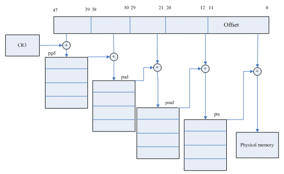
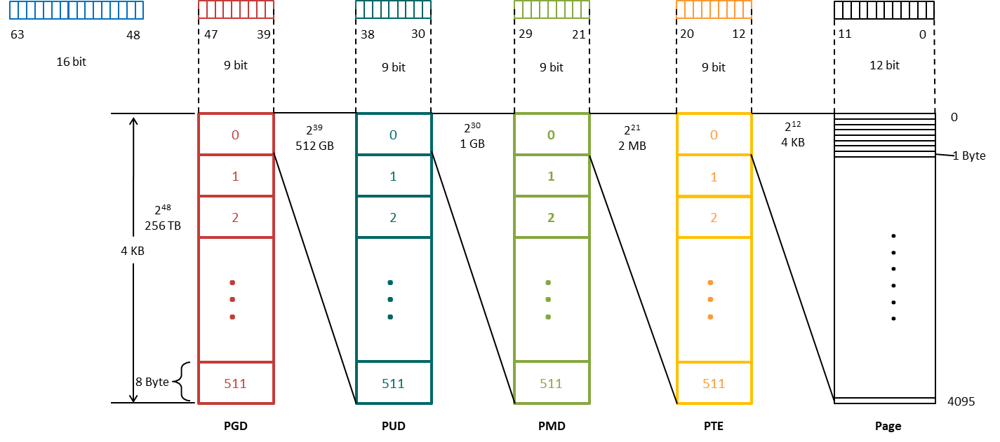
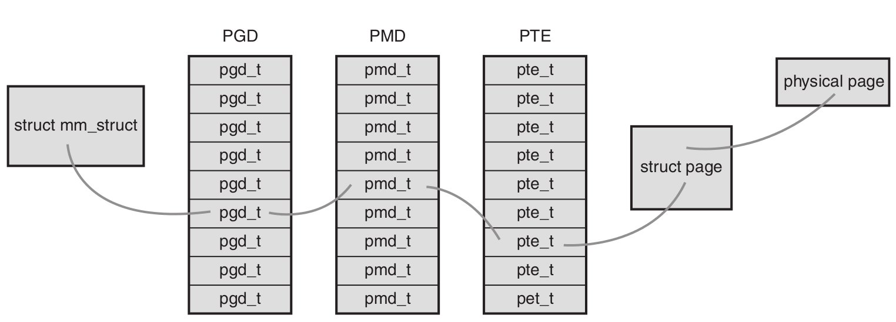
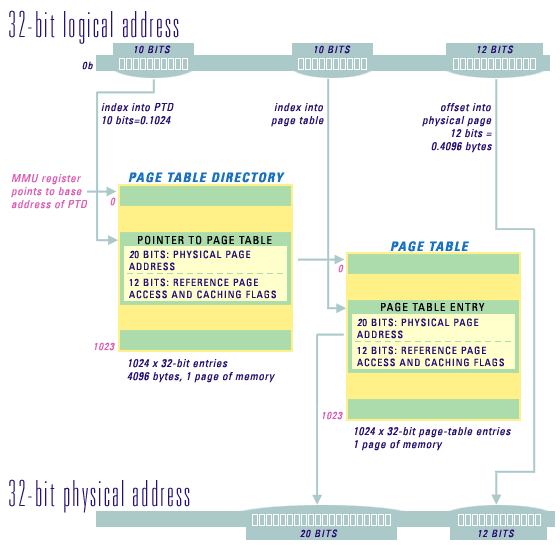

# 页表

* *应用程序操作的对象* 是映射到物理内存之上的 *虚拟内存*。
* CPU 直接操作的是 *物理内存*。
* 应用程序访问一个虚拟地址时，MMU 先将虚拟地址转换成物理地址，然后处理器才能解析地址访问请求。
* 地址转换需要通过查询 **[页表](https://en.wikipedia.org/wiki/Page_table)** 才能完成。
  * 地址转换需要将虚拟地址分段，每段虚拟地址作为一个索引指向页表
  * 页表项指出下一级别的页表所在的物理地址或者指向最终的物理页面。


## 页表为什么要分级？
* [Linux内核4级页表的演进](http://larmbr.com/2014/01/19/the-evolution-of-4-level-page-talbe-in-linux/)讲的蛮好
* 简单地说，分级的目的是为了 **节省内存**
  * 如果采用一个简单的大页表一对一映射虚拟地址到物理地址，需要较多的 **连续的物理页面(phsical page)**，因为是 **一对一** 映射，此时又未分级，所以必须是 **连续的**。
  * 如果进程比较多，则需要大量的连续物理页，这不现实。
  * 然而，在现实中，程序存在局部化特征, 这意味着在特定的时间内只有部分内存会被频繁访问，具体点，进程空间中的`.text`段(即程序代码), 堆， 共享库，栈都是固定在进程空间的某个特定部分，这样导致进程空间其实是非常稀疏的。
  * 所谓 **分级** 简单说就是，把整个进程空间分成区块（block），区块下面可以再细分，这样在内存中只要常驻某个区块的页表即可，这样可以大量节省内存。
  * 这里的套路是：
    * 区块中的条目存的是下一级区块的 **基址** （物理地址）
    * 将虚拟地址的不同位分别作为不同级别区块的 **索引**（可转化为 **偏移**）
    * 只要提供 *最上级页目录的基址* 和 *虚拟地址*，即可采用 **基址 + 偏移** 的方式逐级索引至物理地址。
  * 每个区块所需的空间并不大，而进程空间中未使用的地址无需建立对应的区块，因此每个进程的页表用的空间并不多，这样目的就达到了。

## 四级页表

* Linux x86-64 默认用的四级页表完成地址转换
* x86-64 的四级页表用到了 48 位虚拟地址，虚拟地址段的划分是 **9-9-9-9-12**
* 总共可管理 256 TB 的虚拟地址空间
* 一个页表项的长度与`unsigned long`一致，在 64 位平台为 **8 Byte**
* 顶级页表——**页全局目录（page global directory，PDG）**
  * 包含一个`pdg_t`类型的数组
  * 表项指向二级页目录 *PUD* 的物理基址
  * 每个 PGD 页表项可管理 512 GB 虚拟地址
* 二级页表——**PUD**
  * `pud_t`类型数组
  * 表项指向三级页目录 *PMD* 的物理基址
  * 每个 PUD 页表项可管理 1 GB 虚拟地址
* 三级页表——**中间页目录（page middle directory，PMD）**
  * `pmd_t`类型数组
  * 表项指向四级页目录 *PTE* 的物理基址
  * 每个 PMD 页表项可管理 2 MB 虚拟地址
* 四级页表——**PTE**
  * 包含`pte_t`类型的页表项
  * 页表项指向物理页面的基址
  * 每个 PTE 页表项可管理 4 KB 虚拟地址
* 由于默认采用的是 4KB（4096 = 2<sup>12</sup> = 2<<12）大小的 page，因此页分配时对齐到 4KB，这样页帧的首地址的低 12 位必然是 0
* 注意不要将 **页帧** 与`struct page`混淆，`struct page`是 *页帧* 的管理结构，大小通常为 64 Byte
* 页表项的内容是物理基址，因此没有用上的低 12 位可以用来作为标志位
* 目前，最高位也被用作标志位了，`_PAGE_NX` not-execuable 标志位

### 实例：四级页表寻址
* 略微改造了一下 `arch/x86/mm/pageattr.c::print_pte()`打印虚拟地址 `0xffffffffff5ff0a8` 的寻址过程
* 得到结果如下：
  ```
  address: 0xffffffffff5ff0a8
  pgd: 0x1e0e067
  pud: 0x1e10067
  pmd: 0x1e11067
  kernel pte for 0xffffffffff5ff0a8: va:ffff880001e11ff8 val:0x8000000001ee4165 level:1
  address: 0xffffffffff5ff0a8
  pgd: 0x16d05067
  pud: 0x16d0a067
  pmd: 0x16d0b067
  shadow pte for 0xffffffffff5ff0a8: va:ffff880016d0bff8 val:0x8000000001ee4065 level:1
  ```
#### 以 pmd -> pte 的过程为例

##### 基址部分
* PMD 页表项的内容为 PTE 页的物理基址，这里我们看到该物理页的基址为`0x1e11000`，记住，低 12 位是页表项标志位
* 页表必然是一致映射，虚拟地址为 **物理地址加上偏移**，在未启用内核地址随机化时该偏移为`PAGE_OFFSET`，因此该 PTE 页的虚拟地址为`0xffff880001e11000`
* arch/x86/include/asm/page.h
  ```c
  #ifndef __va
  #define __va(x)         ((void *)((unsigned long)(x)+PAGE_OFFSET))
  #endif
  ```
* arch/x86/include/asm/page_types.h
  ```c
  #define PAGE_OFFSET     ((unsigned long)__PAGE_OFFSET)
  ```
* arch/x86/include/asm/page_64_types.h
  ```c
  #ifdef CONFIG_X86_5LEVEL
  #define __PAGE_OFFSET_BASE      _AC(0xff10000000000000, UL)
  #else
  #define __PAGE_OFFSET_BASE      _AC(0xffff880000000000, UL)
  #endif

  #ifdef CONFIG_RANDOMIZE_MEMORY
  #define __PAGE_OFFSET           page_offset_base
  #else
  #define __PAGE_OFFSET           __PAGE_OFFSET_BASE
  #endif /* CONFIG_RANDOMIZE_MEMORY */
  ...__```
  ```

##### 偏移部分
* 虚拟地址的低 48 位为 `0xffffff5ff0a8`，二进制为`1111 1111 1111 1111` `1111 1111 0101 1111` `1111 0000 1010 1000`
* 其中，从 0 算起第 12-20 位为该地址在 PTE 页中的索引，也就是 `1 1111 1111`，注意，该值只是目录项索引，要想得到 PTE 页表项的虚拟地址，还需要用索引乘以页表项的长度得到该虚拟地址到基址的偏移，x86-64 的页表项长度为 8 Byte，可以将索引左移三位得到`1111 1111 1000`，即`0xff8`

##### pte 页表项虚拟地址
* 之前说过，分页寻址都是 **基址 + 偏移** 的套路，因此这里 pte 页表项虚拟地址为 `0xffff880001e11000 + 0xff8 = 0xffff880001e11ff8`
* 可以看到，其内容为`0x8000000001ee4165`，其中
  * 最高位的`0x8000000000000000`是`_PAGE_NX`标志位
  * 低 12 位`0x165`是页表项的标志位
  * `0x1ee4000`是 page 的物理基址，该地址偏移`0x0a8 Byte`处的内容即为虚拟地址 `0xffffffffff5ff0a8`最后要访问的内容


## 五级页表

* Linux x86-64 从 v4.14 开始支持五级页表完成地址转换
* x86-64 的五级页表用到了 57 位虚拟地址，虚拟地址段的划分是 **9-9-9-9-9-12**
* 总共可管理 128 PB 的虚拟地址空间
* 顶级页表
  * 每个 PGD 页表项可管理 256 TB 虚拟地址
* 二级页表——新增的 **P4D**
  * `p4d_t`类型数组
  * 每个 P4D 页表项可管理 512 GB 虚拟地址
* 三、四、五级页表 PUD、PMD、PTE，每级页表项可管理的虚拟地址空间范围与采用四级页表时的一致


## MMU 和 缺页


* 多数体系结构中，搜索页表的工作由硬件（如MMU）完成（至少某种程度上），但前提是内核正确设置页表。
* 每个进程都有自己的页表，当然，线程会共享页表。
  * `struct mm_struct`的`pgd_t *pgd`域指向进程的页全局目录 **PDG**。
  * 注意：操作和检索页表使必须使用`struct mm_struct`中的`page_table_lock`锁，以防竞争。
  * 当进程切换发生的时候，进程的给 **用户空间** 的页表也会随之切换。
* **[翻译后缓冲器（translation lookaside buffer，TLB）](https://en.wikipedia.org/wiki/Translation_lookaside_buffer)**——为了加快从虚拟内存中页面到物理内存中对应地址的搜索，多数体系结构都实现了一个将虚拟地址映射到物理地址的硬件缓存。
  * 当访问一个虚拟地址时，CPU的MMU先检查TLB中是否缓存了该虚拟地址到物理地址的映射，如果在缓存中直接命中，物理地址立刻返回。
  * 否则，通过页表搜索需要的物理地址。
  * TLB中缓冲的是映射关系，而不是物理页。因此如果 TLB 命中直接将结果返回给MMU后，节省了MMU去查询页表的时间，仍然需要通过cache/memory去获取内容。
* **[MMU](https://en.wikipedia.org/wiki/Memory_management_unit)** 是一种负责处理中央处理器（CPU）的内存访问请求的计算机硬件。它的功能包括：
  * 虚拟地址到物理地址的转换（即虚拟内存管理）
  * 内存保护、CPU cache的控制
  * 在较为简单的计算机体系结构中，负责总线的仲裁以及存储体切换（bank switching，尤其是在8位的系统上）
*  **[缺页（page fault）](https://en.wikipedia.org/wiki/Page_fault)**

> A **page fault** (sometimes called #PF, PF or hard fault[a]) is a type of interrupt, called trap, raised by computer hardware when a running program accesses a memory page that is mapped into the virtual address space, but not actually loaded into main memory. The hardware that detects a page fault is the processor's memory management unit (MMU), while the exception handling software that handles page faults is generally a part of the operating system kernel. When handling a page fault, the operating system generally tries to make the required page accessible at the location in physical memory, or terminates the program in case of an illegal memory access.

* MMU 在缺页中的角色：
  * *MMU* 作为活动的主体，查询 *页表*。
  * 当发生缺页时，（硬件）引发缺页异常，将控制权交回内核（软件）处理。
* 从页表的角度来说，发生 page fault 时，PTE 的状态可能是：
  * PTE 是有的，虚拟地址曾经被使用过，但已被换出，PTE 的 *Present* flag 已被清除。
  * 该虚拟地址从未被映射过，PTE 完全为空（全零）。
* arch/x86/include/asm/pgtable.h
```c
static inline int pte_present(pte_t a)
{
    return pte_flags(a) & (_PAGE_PRESENT | _PAGE_PROTNONE);
}
```
* arch/x86/include/asm/pgtable_types.h
```c
#define _PAGE_BIT_PRESENT   0   /* is present */
...
#define _PAGE_PRESENT   (_AT(pteval_t, 1) << _PAGE_BIT_PRESENT)
...
static inline pteval_t native_pte_val(pte_t pte)
{
    return pte.pte;
}

static inline pteval_t pte_flags(pte_t pte)
{
    return native_pte_val(pte) & PTE_FLAGS_MASK;
}
..._```
```

###### Classic page-table format used on the Intel x86, Pentium, and Pentium Pro family, as well as on the PowerPC 821 and 860 PowerQUICC processors.

* 这里只采用了两级页表。


## Dump 页表
### CONFIG_PTDUMP_DEBUGFS
```python
config PTDUMP_DEBUGFS
    bool "Export kernel pagetable layout to userspace via debugfs"
    depends on DEBUG_KERNEL
    depends on DEBUG_FS
    depends on GENERIC_PTDUMP
    select PTDUMP_CORE
    help
      Say Y here if you want to show the kernel pagetable layout in a
      debugfs file. This information is only useful for kernel developers
      who are working in architecture specific areas of the kernel.
      It is probably not a good idea to enable this feature in a production
      kernel.

      If in doubt, say N.
```
* 启用`CONFIG_PTDUMP_DEBUGFS`可以通过读取`/sys/kernel/debug/page_tables`目录下的`kernel`和`current_kernel`文件 dump 页表
* 老版本该选项由不同 arch 分别设置
  * x86 的`CONFIG_X86_PTDUMP`
  * ARM64 的`CONFIG_ARM64_PTDUMP_DEBUGFS`
* x86 开启`CONFIG_PAGE_TABLE_ISOLATION`会增加`current_user`文件用于 dump 影子页表

### 参考实现
#### x86
* arch/x86/mm/dump_pagetables.c
#### ARM64
* arch/arm64/mm/ptdump_debugfs.c
* arch/arm64/mm/dump.c

# 参考资料

* [Using the Microprocessor MMU for Software Protection in Real-Time Systems](http://www.lynx.com/using-the-microprocessor-mmu-for-software-protection-in-real-time-systems/)
* [Linux内核4级页表的演进](http://larmbr.com/2014/01/19/the-evolution-of-4-level-page-talbe-in-linux/)
* [地址空间的归纳总结](http://alanwu.blog.51cto.com/3652632/1082195)
* [PCI设备的地址空间](http://www.cnblogs.com/zszmhd/archive/2012/05/08/2490105.html)
* [Linux内核追踪[4.14] X86的5级页表管理](http://blog.csdn.net/lovelycheng/article/details/78545502)
* [lwn: Five-level page tables](https://lwn.net/Articles/717293/)
* [lwn: x86: 5-level paging enabling for v4.12](https://lwn.net/Articles/716916/)
* [x86 Paging Tutorial](https://cirosantilli.com/x86-paging)
