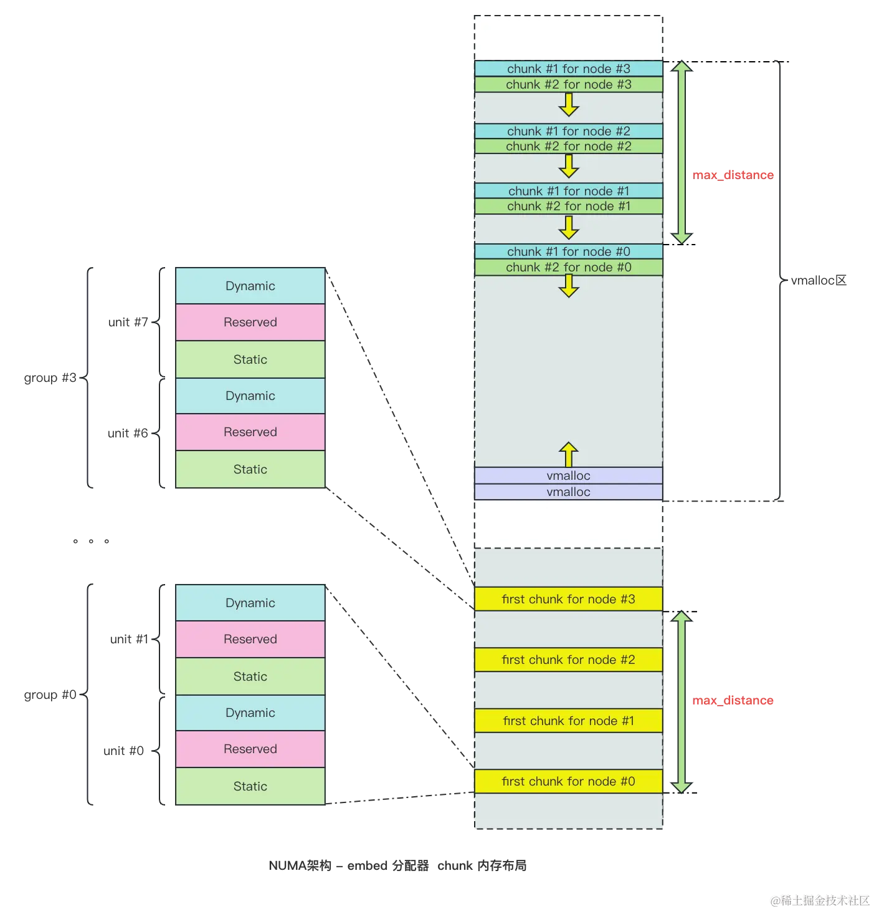

# Per-CPU

* 对于给定处理器，Per-CPU的数据是唯一的。
* 虽然访问 Per-CPU 数据不需要锁同步，但是禁止内核抢占还是需要的，防止出现伪并发。
* `get_cpu()` 和 `put_cpu()` 包含了对内核抢占的禁用和重新激活。
* 2.6 Per-CPU 相关文件：
  * include/linux/percpu.h
  * arch/x86/include/asm/percpu.h
  * include/linux/percpu-defs.h
  * mm/slab.c
  * mm/percpu.c

## 编译时 Per-CPU 数据

* 声明 Per-CPU 变量
  ```c
  DECLARE_PER_CPU(type, name)
  ```
* 定义 Per-CPU 变量
  ```c
  DEFINE_PER_CPU(type, name)
  ```
* `get_cpu_var(var)`，`put_cpu_var(var)`和`per_cpu(name, cpu)`宏
  ```c
  #define per_cpu(var, cpu)   (*per_cpu_ptr(&(var), cpu))

  /*
   * Must be an lvalue. Since @var must be a simple identifier,
   * we force a syntax error here if it isn't.
   */
  #define get_cpu_var(var)                        \
  (*({                                    \
      preempt_disable();                      \
      this_cpu_ptr(&var);                     \
  }))

  /*
   * The weird & is necessary because sparse considers (void)(var) to be
   * a direct dereference of percpu variable (var).
   */
  #define put_cpu_var(var)                        \
  do {                                    \
      (void)&(var);                           \
      preempt_enable();                       \
  } while (0)
  ...'
  ```
### 注意
* `per_cpu(name, cpu)`既不禁止抢占，也不提供锁保护。

  > Another subtle note:These compile-time per-CPU examples **do not work for modules** because the linker actually creates them in a unique executable section (for the curious, `.data.percpu` ). If you need to access per-CPU data from modules, or if you need to create such data dynamically, there is hope.

## 运行时 Per-CPU 数据

* 运行时创建和释放Per-CPU接口
  ```c
  void *alloc_percpu(type); /* a macro */
  void *__alloc_percpu(size_t size, size_t align);
  void free_percpu(const void *);
  ```
* `__alignof__` 是gcc的一个功能，它返回指定类型或 lvalue 所需的（或建议的，要知道有些古怪的体系结构并没有字节对齐的要求） 对齐 **字节数**。
  * 如果指定一个 lvalue，那么将返回 lvalue 的最大对齐字节数。
* 使用运行时的 Per-CPU 数据
  ```c
  get_cpu_var(ptr); /* return a void pointer to this processor’s copy of ptr */
  put_cpu_var(ptr); /* done; enable kernel preemption */
  ```
## 使用 Per-CPU 数据的原因

* 减少数据锁定
  * 记住“只有这个处理器能访问这个数据”的规则是编程约定。
  * 并不存在措施禁止你从事欺骗活动。
  * 有越界的可能？
* 大大减少缓存失效
  * 失效发生在处理器试图使它们的缓存保持同步时。
    * 如果一个处理器操作某个数据，而该数据又存放在其他处理器缓存中，那么存放该数据的那个处理器必须清理或刷新自己的缓存。
    * 持续不断的缓存失效称为 **缓存抖动**。这样对系统性能影响颇大。
  * 使用 Per-CPU 将使得缓存影响降至最低，因为理想情况下只会访问自己的数据。
  * *percpu* 接口 **cache-align** 所有数据，以便确保在访问一个处理器的数据时，不会将另一个处理器的数据带入同一个cache line上。
* 注意：**不能在访问 Per-CPU 数据过程中睡眠**，否则，醒来可能在其他CPU上。
* Per-CPU 的新接口并不兼容之前的内核。

## Per-CPU 的原理
* 读以下两篇文章就够了，讲得足够详细了：
  * [Linux Kernel 源码学习：PER_CPU 变量、swapgs及栈切换（一）本文采用 Linux 内核 v3.1 - 掘金](https://juejin.cn/post/7332067091368263732)
  * [Linux Kernel 源码学习：PER_CPU 变量、swapgs及栈切换（二）说明： 在 Linux Kernel - 掘金](https://juejin.cn/post/7368413086954668068)
* 以下插图全部来自于以上两篇文章，有助于理解 Per-CPU 数据的内存布局和分配原理





## Per-CPU 的延申阅读
* x86-64 的 Per-CPU 变量的访问借助 `%gs` 寄存器，即 `IA32_GS_BASE` MSR 中保存的基地址 + 偏移实现，而 `%gs` 又和 `swapgs` 指令密切关联
  * 因为 `IA32_GS_BASE` MSR 是 Per-CPU 的，因此可以将每个 CPU 专属的 Per-CPU 区域的基地址保存在这里
* 推荐阅读以下文章了解 Per-CPU 的更多细节：
* [花费了5年时间才合入Linux内核的FSGSBASE特性](https://zhuanlan.zhihu.com/p/434821566)
  - [FSGSBASE特性需求分析](https://zhuanlan.zhihu.com/p/435760348)
  - [FS/GS寄存器的用途](https://zhuanlan.zhihu.com/p/435518616)（**重点**）
  - [Linux内核态是如何使用GS寄存器引用进程的stack canary的？](https://zhuanlan.zhihu.com/p/435667117)
  - [Linux用户态是如何使用FS寄存器引用glibc TLS的？](https://zhuanlan.zhihu.com/p/435756186)
  - [Linux内核态是如何使用GS寄存器引用percpu变量的？](https://zhuanlan.zhihu.com/p/435757639)
  - [GCC编译器对FSGSBASE特性的支持](https://zhuanlan.zhihu.com/p/435758039)
  - [FSGSBASE特性在SGX中的使用场景](https://zhuanlan.zhihu.com/p/435758439)
  - [FSGSBASE特性与Spectre v1 SWAPGS处理器侧信道漏洞](https://zhuanlan.zhihu.com/p/435759096)
* [x86 PerCPU变量基址(gs寄存器)的原理](https://blog.csdn.net/pwl999/article/details/106930732)
* [gcc inline assembly using modifier "P" and constraint "p" over "m" in Linux kernel](https://stackoverflow.com/questions/20965114/gcc-inline-assembly-using-modifier-p-and-constraint-p-over-m-in-linux-kern)
* [Extended Asm (Using the GNU Compiler Collection (GCC))](https://gcc.gnu.org/onlinedocs/gcc/Extended-Asm.html)
