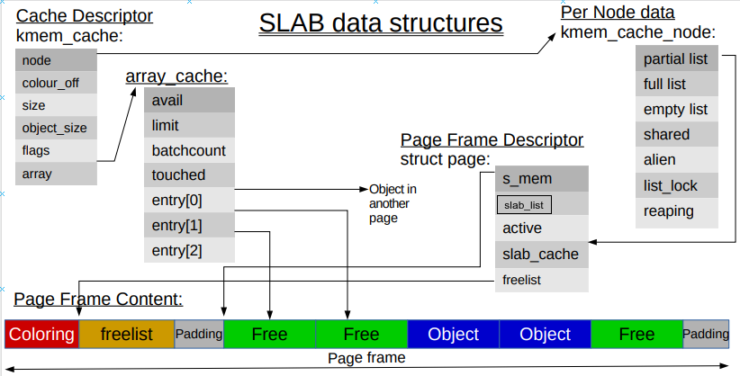
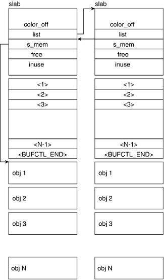

# slab层（Slab Layer）

* slab分配器扮演了 **通用数据结构缓存** 的角色。
* slab分配器试图在几个基本原则之间寻求一种平衡：
  * 频繁使用的数据结构也会频繁分配和释放，因此应当缓存它们。
  * 频繁地分配和回收必然会导致内存碎片（难以找到大块连续可用的内存）。为了避免这种现象，空闲链表的缓存会连续地存放。因为已经释放的数据结构又会放回空闲链表，因此不会导致碎片。
  * 回收的对象可以立即投入下一次分配，因此，对于频繁的分配和释放，空闲链表能够提高其性能。
  * 如果分配器知道对象大小，页大小和总的高速缓存的大小这样的概念，它会作出更明智的决策。
  * 如果让部分缓存专属于单个处理器（对系统上的每个处理器独立而唯一），那么，分配和释放就可以在不加SMP锁的情况下运行。
  * 如果分配器是与NUMA相关的，它就可以从相同的内存结点为请求者进行分配。
  * 对存放的对象进行着色（color），以防止多个对象映射到相同的高速缓存行（cache line）。

## slab层的设计

* 不同对象划分为 **高速缓存组**，其中每个高速缓存组都存放 **不同类型** 的对象。**每种对象类型** 对应一个高速缓存。
* `kmalloc()`接口建立在slab层之上，使用了一组通用高速缓存。
* 高速缓存被划分为 **slab**，slab由一个或多个物理上连续的页组成。
* 一般情况下，slab 也就仅仅由一页组成。每个高速缓存可以由多个 slab 组成。
* 每个 slab 都包含一些被缓存的数据结构。
* 每个 slab 处于三种状态之一：满，部分使用，空。
* 当内核某一部分需要一个新对象时：
  * 先从 *部分使用* 的slab中进行分配。
  * 没有 *部分使用*，则从 *空* slab中进行分配。
  * 没有 *空* slab，则创建一个slab。
* 注意 slabs_empty 链表中的 slab 是进行 **回收（reaping）** 的主要备选对象。正是通过此过程，slab 所使用的内存被返回给操作系统供其他用户使用。
* slab 链表中的每个 slab 都是一个连续的内存块（一个或多个连续页），它们被划分成一个个对象。这些对象是从特定缓存中进行分配和释放的基本元素。
* 注意 slab 是 slab 分配器进行操作的最小分配单位，因此如果需要对 slab 进行扩展，这也就是所扩展的最小值。
* 由于对象是从 slab 中进行分配和释放的，因此单个 slab 可以在 slab 链表之间进行移动。
  * 例如，当一个 slab 中的所有对象都被使用完时，就从 slabs_partial 链表中移动到 slabs_full 链表中。
  * 当一个 slab 完全被分配并且有对象被释放后，就从 slabs_full 链表中移动到 slabs_partial 链表中。
  * 当所有对象都被释放之后，就从 slabs_partial 链表移动到 slabs_empty 链表中。

### slab 背后的动机
与传统的内存管理模式相比， slab 缓存分配器提供了很多优点。
* 首先，内核通常依赖于对小对象的分配，它们会在系统生命周期内进行无数次分配。slab 缓存分配器通过对类似大小的对象进行缓存而提供这种功能，从而避免了常见的碎片问题。
* slab 分配器还支持通用对象的初始化，从而避免了为同一目而对一个对象重复进行初始化。
* 最后，slab 分配器还可以支持硬件缓存对齐和着色，这允许不同缓存中的对象占用相同的缓存行，从而提高缓存的利用率并获得更好的性能。



### 高速缓存结构 kmem_cache

* 每个高速缓存都用`kmem_cache`结构表示。
* include/linux/slab_def.h
```c
/*
 * Definitions unique to the original Linux SLAB allocator.
 */

struct kmem_cache {
    /*per-cpu数据，每次分配/释放期间都会访问*/
    struct array_cache __percpu *cpu_cache;

/* 1) Cache tunables. Protected by slab_mutex */
    unsigned int batchcount;
    unsigned int limit;
    unsigned int shared;

    unsigned int size;
    struct reciprocal_value reciprocal_buffer_size;
/* 2) touched by every alloc & free from the backend */

    unsigned int flags;     /* constant flags */
    unsigned int num;       /* # of objs per slab */

/* 3) cache_grow/shrink */
    /* order of pgs per slab (2^n) */
    unsigned int gfporder;

    /* force GFP flags, e.g. GFP_DMA */
    gfp_t allocflags;

    size_t colour;          /* cache colouring range */
    unsigned int colour_off;    /* colour offset */
    struct kmem_cache *freelist_cache;
    unsigned int freelist_size;

    /* constructor func */
    void (*ctor)(void *obj);

/* 4) cache creation/removal */
    const char *name;
    struct list_head list;
    int refcount;
    int object_size;
    int align;

/* 5) statistics */
...

    struct kmem_cache_node *node[MAX_NUMNODES];
};
...__```
```
### Slab 空闲对象数组
#### v3.13 前空闲对象数组

* slab cache 在创建的时候会通过`calculate_slab_order() -> cache_estimate()`计算出`cachep->num`，即每个 slab 可存放的 object 数目
* slab 管理数据除了`struct slab`结构外，还包含一个有`cachep->num`个元素的数组来指示 slab object 的使用情况
* 数组元素只有对应的对象是空闲时才是有意义的，元素的值记录下一个空闲对象的位置，这就好像一个单向的“链表”，*链表头* 由`slabp->free`来指示
* 如下以表 2->3->0->1 （先不管最后一列）的顺序释放对象时`slab_bufctl(slabp)`数组的变化（以加粗方式突显每次 put 时变化的元素值）

`slab_bufctl(slabp)[n]`\put | full | 2 | 3 | 0 | 1 | 3
----------------------------|------|---|---|---|---|---
`slab_bufctl(slabp)[0]`     |   1  | 1 | 1 | **3** | 3 | 3
`slab_bufctl(slabp)[1]`     |   2  | 2 | 2 | 2 | **0** | 0
`slab_bufctl(slabp)[2]`     |   3  | **END** |END|END|END|END
`slab_bufctl(slabp)[3]`     | END  |END| **2** | 2 | 2 | **1**
`slabp->free`               | END  | 2 | 3 | 0 | 1 | 3

* 随后分配对象的时候会以 1->0->3->2 的顺序获得对象
* 这里用数组而不是位图来记录对象的使用情况，原因是要利用 LIFO 来更有效率地使用 CPU cache
* 但也给了 double free 破坏 slab 管理结构的机会，只要出现 double free，这个“链表”会形成环，这块 slab 就被破坏了
  * 比如上面的表的最后一列，double free 了第三个对象，形成了 3->1->0->3 的环
  * 使能`CONFIG_DEBUG_SLAB_LEAK`和`CONFIG_DEBUG_SLAB`会在对象被分配的时候将数组元素设置成`BUFCTL_FREE`，我们可以通过在 free 的时候先检测这个值来补获 double free 的第一现场
* 这个数组原来放在 `struct slab`结构之后，着色区之前
#### v3.13 后空闲对象数组组织方式的变化
* 然而这一切在 v3.13 后改变了，准确地说是以下 commit 之后开始发生一些变化
  ```
  commit b1cb0982bdd6f57fed690f796659733350bb2cae
  Author: Joonsoo Kim <iamjoonsoo.kim@lge.com>
  Date:   Thu Oct 24 10:07:45 2013 +0900

      slab: change the management method of free objects of the slab
  ```
* 简单地说就是，就是把“链表”改成了“栈”，`page->active`指示 *栈顶*
* 如下以表 2->3->0->1 的顺序释放对象时`page->freelist[]`数组的变化（以加粗方式突显每次 put 时变化的元素值）

`page->freelist[n]`\put | init | 2 | 3 | 0 | 1
------------------------|------|---|---|---|---
`page->freelist[0]`   |   0  | 0 | 0 | 0 | **1**
`page->freelist[1]`   |   1  | 1 | 1 | **0** | 0
`page->freelist[2]`   |   2  | 2 | **3** | 3 | 3
`page->freelist[3]`   |   3  | **2** | 2 | 2 | 2
`page->active`        |   4  | 3 | 2 | 1 | 0

* 随后分配对象的时候会依然是 1->0->3->2 的顺序获得对象
* 然而，这并没有解决 double free 对 slab 管理结构的破坏
  * `__free_one()`里对`ac->entry`的检查仅限于连续两次的 free，对于有间隔的 double free 无能为力
  * 随后`cache_flusharray()->free_block()->slab_put_obj()`里`page->active--`更是有可能让`active`发生下溢
  * 更严重的是后面`set_free_obj(page, page->active, objnr)`是类似`((freelist_idx_t *)(page->freelist))[page->active] = objnr`的操作，更不知道把`objnr`写到哪里去了！！！

#### v4.6 后空闲对象数组位置的变化
* v4.6 后，空闲数组的位置也发生了变化，准确地说是以下 commit 之后
  ```
  commit b03a017bebc403d40aa53a092e79b3020786537d
  Author: Joonsoo Kim <iamjoonsoo.kim@lge.com>
  Date:   Tue Mar 15 14:54:50 2016 -0700

      mm/slab: introduce new slab management type, OBJFREELIST_SLAB
  ```
* 这个改变是基于这样的考虑，只有当有空闲对象时才会用到空闲数组，所以我们可以用空闲对象自己来存储这个数组。
* 此后 slab 的管理类型由以下 4 个逻辑决定：
1. 如果管理数组的大小 **小于** 对象的大小，且没有构造函数，它属于`OBJFREELIST_SLAB`
2. 如果管理数组的大小小于 slab 在存放完对象后的剩余空间，它属于`NORMAL_SLAB`，且用剩余空间存储数组
3. 如果`OFF_SLAB`的方式比方式 4） 节省内存，那么它属于`OFF_SLAB`。这种类型需要从其他 cache 分配内存来存储管理数组，所以会有额外的内存消耗。
4. 其他的方式属于`NORMAL_SLAB`. 这种方式使用一个 slab 的专门的内部空间作为管理数组，因此也会有额外的内存消耗。
* 对应的判断在`__kmem_cache_create()`里由`set_objfreelist_slab_cache()`、`set_off_slab_cache()`和`set_on_slab_cache()`决定。
* 剩余空间`left_over`在`calculate_slab_order()->cache_estimate()`里计算。
#### 代码解析
* mm/slab.c
```c
/*
 * Get the memory for a slab management obj.
 *
 * For a slab cache when the slab descriptor is off-slab, the
 * slab descriptor can't come from the same cache which is being created,
 * Because if it is the case, that means we defer the creation of
 * the kmalloc_{dma,}_cache of size sizeof(slab descriptor) to this point.
 * And we eventually call down to __kmem_cache_create(), which
 * in turn looks up in the kmalloc_{dma,}_caches for the disired-size one.
 * This is a "chicken-and-egg" problem.
 *
 * So the off-slab slab descriptor shall come from the kmalloc_{dma,}_caches,
 * which are all initialized during kmem_cache_init().
 */
static void *alloc_slabmgmt(struct kmem_cache *cachep,
                   struct page *page, int colour_off,
                   gfp_t local_flags, int nodeid)
{
    void *freelist;
    void *addr = page_address(page); /*根据 struct page 指针得到该结构所管理的虚拟地址*/
    /*slab 的管理信息存储在 struct page里*/
    page->s_mem = addr + colour_off; /*该 slab 里的对象起始地址在着色区之后，由 s_mem 成员指出*/
    page->active = 0;

    if (OBJFREELIST_SLAB(cachep))
        /*对于空闲数组在空闲对象里的类型，这里先将空闲数组指针设为空，由后面 cache_init_objs() 处理*/
        freelist = NULL;
    else if (OFF_SLAB(cachep)) {
        /* Slab management obj is off-slab. */
        freelist = kmem_cache_alloc_node(cachep->freelist_cache,
                          local_flags, nodeid);
        if (!freelist)
            return NULL;
    } else {
        /*对于空闲数组大于一个对象大小的类型，从分配的边界往回找到偏移空闲数组大小的地址，作为空闲数组指针*/
        /* We will use last bytes at the slab for freelist */
        freelist = addr + (PAGE_SIZE << cachep->gfporder) -
                cachep->freelist_size;
    }

    return freelist;
}
...
static void cache_init_objs(struct kmem_cache *cachep,
                struct page *page)
{
    int i;
    void *objp;
    bool shuffled;

    cache_init_objs_debug(cachep, page);

    /* Try to randomize the freelist if enabled */
    shuffled = shuffle_freelist(cachep, page);

    if (!shuffled && OBJFREELIST_SLAB(cachep)) {
        /*index_to_obj(cachep, page, cachep->num - 1) 为 slab 最后一个对象。
          obj_offset(cachep) 指向对象的起始地址，在 slab debug 开启时会跳过填充区和警戒区。
          因此，对于空闲数组在空闲对象里的类型，空闲数组指针指向最后一个对象的起始地址*/
        page->freelist = index_to_obj(cachep, page, cachep->num - 1) +
                        obj_offset(cachep);
    }

    for (i = 0; i < cachep->num; i++) {
        objp = index_to_obj(cachep, page, i);
        objp = kasan_init_slab_obj(cachep, objp);

        /* constructor could break poison info */
        if (DEBUG == 0 && cachep->ctor) {
            kasan_unpoison_object_data(cachep, objp);
            cachep->ctor(objp);
            kasan_poison_object_data(cachep, objp);
        }

        if (!shuffled)
            set_free_obj(page, i, i); /*初始化空闲数组*/
    }
}

static void *slab_get_obj(struct kmem_cache *cachep, struct page *page)
{
    void *objp;

    objp = index_to_obj(cachep, page, get_free_obj(page, page->active));
    page->active++;
    /*这里只单纯地返回 object，调整链表的事留给 fixup_slab_list()*/
    return objp;
}
static void slab_put_obj(struct kmem_cache *cachep,
            struct page *page, void *objp)
{
    unsigned int objnr = obj_to_index(cachep, page, objp);
#if DEBUG
    unsigned int i;

    /* Verify double free bug */
    for (i = page->active; i < cachep->num; i++) {
        if (get_free_obj(page, i) == objnr) {
            pr_err("slab: double free detected in cache '%s', objp %px\n",
                   cachep->name, objp);
            BUG();
        }
    }
#endif
    page->active--;
    if (!page->freelist)
        /*只有 OBJFREELIST_SLAB 类型的 slab 才会有空的 freelist 域，
          此条件下 objp 指向最后一个空闲对象，所以用来存放空闲数组*/
        page->freelist = objp + obj_offset(cachep);

    set_free_obj(page, page->active, objnr);
}

/*
 * Map pages beginning at addr to the given cache and slab. This is required
 * for the slab allocator to be able to lookup the cache and slab of a
 * virtual address for kfree, ksize, and slab debugging.
 */
static void slab_map_pages(struct kmem_cache *cache, struct page *page,
               void *freelist)
{
    page->slab_cache = cache;
    page->freelist = freelist; /*对于 OBJFREELIST_SLAB 类型的 slab，freelist 这里还是空*/
}

/*
 * Grow (by 1) the number of slabs within a cache.  This is called by
 * kmem_cache_alloc() when there are no active objs left in a cache.
 */
static struct page *cache_grow_begin(struct kmem_cache *cachep,
                gfp_t flags, int nodeid)
{
    void *freelist;
    size_t offset;
    gfp_t local_flags;
    int page_node;
    struct kmem_cache_node *n;
    struct page *page;
    ...
    /* Get slab management. */
    freelist = alloc_slabmgmt(cachep, page, offset,
            local_flags & ~GFP_CONSTRAINT_MASK, page_node);
    if (OFF_SLAB(cachep) && !freelist)
        goto opps1; /*管理数据在外部的 slab，freelist 是额外分配的，为空表示分配不成功*/

    slab_map_pages(cachep, page, freelist);

    cache_init_objs(cachep, page);
    ...
    return page;

    opps1:
    ...
    return NULL;
}
...
/*slab_get_obj() 往往和 fixup_slab_list() 一起出现，该函数判断 slab 需不需要调整到 full
 或者  partial 链表*/
static inline void fixup_slab_list(struct kmem_cache *cachep,
                struct kmem_cache_node *n, struct page *page,
                void **list)
{
    /* move slabp to correct slabp list: */
    list_del(&page->slab_list);
    if (page->active == cachep->num) {
        list_add(&page->slab_list, &n->slabs_full);
        if (OBJFREELIST_SLAB(cachep)) {
#if DEBUG
...
#endif
            /*OBJFREELIST_SLAB 类型的 slab 在满的时候会把 freelist 域置为空，
              这就与 slab_put_obj() 那个判断对上了*/
            page->freelist = NULL;
        }
    } else
        list_add(&page->slab_list, &n->slabs_partial);
}
```

### 三个 slab 链表和 Per-CPU 的 array_cache

* mm/slab.h
```c
/*
 * struct array_cache
 *
 * Purpose:
 * - LIFO ordering, to hand out cache-warm objects from _alloc
 * - reduce the number of linked list operations
 * - reduce spinlock operations
 *
 * The limit is stored in the per-cpu structure to reduce the data cache
 * footprint.
 *
 */
struct array_cache {
    unsigned int avail;
    unsigned int limit;
    unsigned int batchcount;
    unsigned int touched;
    void *entry[];  /*
             * Must have this definition in here for the proper
             * alignment of array_cache. Also simplifies accessing
             * the entries.
             */
};
...
/*
 * The slab lists for all objects.
 */
struct kmem_cache_node {
    spinlock_t list_lock;

#ifdef CONFIG_SLAB
    struct list_head slabs_partial; /* partial list first, better asm code */
    struct list_head slabs_full;
    struct list_head slabs_free;
    unsigned long free_objects;
    unsigned int free_limit;
    unsigned int colour_next;   /* Per-node cache coloring */
    struct array_cache *shared; /* shared per node */
    struct alien_cache **alien; /* on other nodes */
    unsigned long next_reap;    /* updated without locking */
    int free_touched;       /* updated without locking */
#endif

#ifdef CONFIG_SLUB
    unsigned long nr_partial;
    struct list_head partial;
#ifdef CONFIG_SLUB_DEBUG
    atomic_long_t nr_slabs;
    atomic_long_t total_objects;
    struct list_head full;
#endif
#endif

};
...*```
```

* `kmem_getpages()`创建新的slab。
  * `kmem_getpages()`和`alloc_pages()`都会调用`__alloc_pages_nodemask()`来分配页。
* `kmem_freepages()`释放内存。
* slab 层只有当给定高速缓存部分中即 **没有满** 也 **没有空** 的 slab 的时才会调用页分配函数。
* 只有在下列情况下才会调用 *释放函数*：
  * 当可用内存变得紧缺时，系统试图释放出更多的内存以供使用；
  * 当高速缓存显示撤销时。
* slab 层的管理是在每个高速缓存的基础上，通过提供给整个系统一个简单的接口来完成的。通过接口就可以：
  * 创建和撤销新的高速缓存。
  * 在高速缓存内分配和释放对象。
* 创建一个高速缓存后，slab 层所起的作用就像一个专用的分配器，可以为具体的对象类型进行分配。
#### array_cache
* 每个 slab 会建立一个 Per-CPU 的`array_cache`，`kmem_cache`的`cpu_cache`域指向这个 Per-CPU 变量
  * 每个 Per-CPU 变量`array_cache`里又含有一个数组，数组有若干条目，指向该 slab 的对象
* 分配和释放对象都优先在`array_cache`里进行，减小开销和锁的使用
  * 通常 **分配对象** 会使`ac->avail`会减小
  * 通常 **释放对象** 会使`ac->avail`会增大
* 当请求 **分配 slab 对象** 的时候，如果`array_cache`里没有足够的空闲对象时，调用`cache_alloc_refill()`重填`array_cache`
  * 在 *部分使用* 和 *空闲* 链表上找到`batchcount`个对象，把对象的地址填到`array_cache`的数组里
  * 如果连 *空闲* 链表上都没有空闲对象，调用`cache_grow()`分配新的 slab
  * 也就是说，重填完后`array_cache`会有`batchcount-1`个空闲对象可用于下次分配，那减去的一个对象在本次分配返回时被使用
  * `cache_alloc_refill()`完成后`ac->avail`增加了（非通常情况）
* 当 **释放 slab 对象** 的时候，`array_cache`里的可用条目`ac->avail`比限定的`ac->limit`多（或等于）
  * 调用`cache_flusharray()`归还 **前`batchcount`** 个空闲对象到各自的 slab （LIFO，故前面的对象没那么热）
    * 先将该空闲对象所属的 slab 从链表上取下
    * 归还空闲对象给 slab
    * 如果 slab 全为空闲对象，根据情况看是要销毁 slab 还是将 slab 挂回到 *空闲链表* 上
    * 否则挂回 *部分使用链表* 上
    * 将空闲条目数目`ac->avail`减小`batchcount`（因为已经还回去了）
    * 将（减小后的）`ac->avail`个空闲条目移到前面
  * 然后再把要 free 的对象放到`array_cache`条目上
  * 所以`cache_flusharray()`完成后`ac->avail`反而减小了（非通常情况）

#### __SetPageSlab()宏
* include/linux/page-flags.h
```c
enum pageflags {
  PG_locked,      /* Page is locked. Don't touch. */
  PG_error,
  PG_referenced,
  PG_uptodate,
  PG_dirty,
  PG_lru,
  PG_active,
  PG_slab,
...
};
...
static inline struct page *compound_head(struct page *page)
{
    unsigned long head = READ_ONCE(page->compound_head);

    if (unlikely(head & 1))
        return (struct page *) (head - 1);
    return page;
}

static __always_inline int PageTail(struct page *page)
{
    return READ_ONCE(page->compound_head) & 1;
}
...
/*
 * Page flags policies wrt compound pages
 *
 * PF_ANY:
 *     the page flag is relevant for small, head and tail pages.
 *
 * PF_HEAD:
 *     for compound page all operations related to the page flag applied to
 *     head page.
 *
 * PF_NO_TAIL:
 *     modifications of the page flag must be done on small or head pages,
 *     checks can be done on tail pages too.
 *
 * PF_NO_COMPOUND:
 *     the page flag is not relevant for compound pages.
 */
#define PF_ANY(page, enforce)   page
#define PF_HEAD(page, enforce)  compound_head(page)
#define PF_NO_TAIL(page, enforce) ({                    \
        VM_BUG_ON_PGFLAGS(enforce && PageTail(page), page); \
        compound_head(page);})
#define PF_NO_COMPOUND(page, enforce) ({                \
        VM_BUG_ON_PGFLAGS(enforce && PageCompound(page), page); \
        page;})

/*
 * Macros to create function definitions for page flags
 */
#define TESTPAGEFLAG(uname, lname, policy)              \
static __always_inline int Page##uname(struct page *page)       \
    { return test_bit(PG_##lname, &policy(page, 0)->flags); }
...
#define __SETPAGEFLAG(uname, lname, policy)             \
static __always_inline void __SetPage##uname(struct page *page)     \
    { __set_bit(PG_##lname, &policy(page, 1)->flags); }

#define __CLEARPAGEFLAG(uname, lname, policy)               \
static __always_inline void __ClearPage##uname(struct page *page)   \
    { __clear_bit(PG_##lname, &policy(page, 1)->flags); }
...
#define __PAGEFLAG(uname, lname, policy)                \
    TESTPAGEFLAG(uname, lname, policy)              \
    __SETPAGEFLAG(uname, lname, policy)             \
    __CLEARPAGEFLAG(uname, lname, policy)

...
__PAGEFLAG(Slab, slab, PF_NO_TAIL)
```
* 宏展开后的函数定义
```c
/*__ arch/x86/include/asm/bitops.h*/
/**
 * __set_bit - Set a bit in memory
 * @nr: the bit to set
 * @addr: the address to start counting from
 *
 * Unlike set_bit(), this function is non-atomic and may be reordered.
 * If it's called on the same region of memory simultaneously, the effect
 * may be that only one operation succeeds.
 */
static __always_inline void __set_bit(long nr, volatile unsigned long *addr)
{
    asm volatile("bts %1,%0" : ADDR : "Ir" (nr) : "memory");
}

static __always_inline void __SetPageSlab(struct page *page)
    { __set_bit(PG_slab, &({
      do {
        if (unlikely(1 && PageTail(page))) {
            dump_page(page, "VM_BUG_ON_PAGE(" __stringify(1 && PageTail(page))")");
            BUG();
        }
      } while (0);
      compound_head(page);})->flags); }
...___```
```

## slab分配器的接口

* `kmem_cache_create()`创建一个新的高速缓存。
  * `SLAB_HWCACHE_LINE` slab 层把一个 slab 内的所有对象和硬件 cache line 对齐。可以提高性能，但增加了内存开销，空间换时间。
  * `SLAB_POISON` 内存毒化标志，用已知的值填充 slab。
  * `SLAB_RED_ZONE` 在已分配的内存周围插入“红色警界区”以探测缓冲越界。
  * `SLAB_PANIC` 分配失败时提醒 slab 层。这在要求分配只能成功的时候非常有用。
  * `SLAB_CACHE_DMA` 命令 slab 层用 *可以执行 DMA 的内存* 给每个 slab 分配空间。
    * 只在 *分配的对象用于 DMA*，且 *必须驻留在`ZONE_DMA`区`时* 才需要这个标志。
    * 否则不需要，也不应该设置。
  * **不能用于中断上下文**，会睡眠。
* `kmem_cache_destory()`撤销给定的高速缓存。
  * **不能用于中断上下文**，会睡眠。
  * 除此之外还需确保：
    * 高速缓存中所有的 slab 都必须为空。
    * 在调用`kmem_cache_destory()`过程中（更别提之后了）不再访问这个高速缓存。调用者必须确保同步。
* `kmem_cache_alloc()`从给定的高速缓存中分配对象。
  * 如果高速缓存中所有的 slab 中都没有空闲对象，slab 层必须通过`kmem_getpages()`获取新的页。
* `kmem_cache_free()`释放一个对象，并返还给原先的 slab。
* slab层负责内存紧缺情况下所有底层的对齐，着色，分配，释放，回收等。
* 如果要频繁创建很多相同类型的对象，应该考虑使用 slab 高速缓存，而不是自己实现空闲链表。

## 查看slab信息
* [`cat /proc/slabinfo`](http://man7.org/linux/man-pages/man5/slabinfo.5.html)
  * `limit` 字段表示每个 CPU 可以缓存的对象的最大数量。
  * `batchcount` 字段是当缓存为空时，转换到每个 CPU 缓存中全局缓存对象的最大数量。
  * `shared` 参数说明了 SMP 系统的共享行为。
* [`slbtop`](http://man7.org/linux/man-pages/man1/slabtop.1.html)

# 参考资料
* [Linux slab 分配器剖析](https://www.ibm.com/developerworks/cn/linux/l-linux-slab-allocator/)
* [The Slab Allocator in the Linux kernel](https://hammertux.github.io/slab-allocator)
* [Section 4.4. Slab Allocator _ The Linux Kernel Primer. A Top-Down Approach for x86 and PowerPC Architectures](https://flylib.com/books/en/4.454.1.55/1/)
