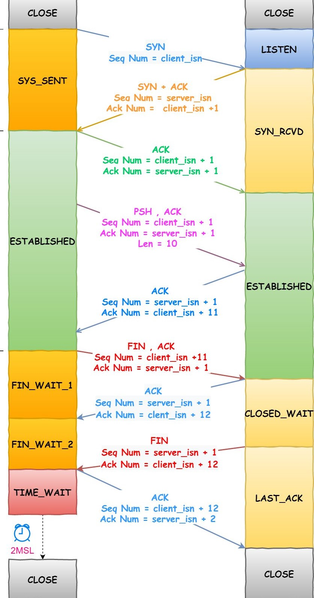

# TCP




## Listen
* 当连接的一端收到`SYN`，回复`SYN/ACK`后，状态由`LISTEN`变为`SYN RECEIVED`
* 当收到连接的另一端回的`ACK`后，状态才变为`ESTABLISHED`，此时应用程序调用`accept()`才会返回这个连接。

### [`listen()`](https://linux.die.net/man/2/listen)系统调用的`backlog`参数所指的队列长度指的是什么？
* 监听 socket 其实是有两个队列：
  * 完全建立连接，等待被`accept`的socket的队列，长度由`listen()`的`backlog`参数指定，应用程序来设定；
    * `backlog`能支持的最大队列长度受`/proc/sys/net/core/somaxconn`的限制，超过限制会被悄然截断。
  * 未完成的连接请求队列，长度由`/proc/sys/net/ipv4/tcp_max_syn_backlog`指定，系统级的设定。
    * 具体到某个 socket 则是由 `min(backlog, somaxconn, tcp_max_syn_backlog) + 1` 再上取整到 2 的幂次，但最小不能小于 `16`。

### 当 *接受队列* 满了，还有连接收到对端的 `ACK` 而需从 *未完成队列* 移入时的行为
* 比如说，服务器端没有及时调用`accept()`消耗掉 *接收队列* 里的连接，又有新的连接连入并回复`ACK`时。
* `net/ipv4/tcp_ipv4.c:tcp_v4_syn_recv_sock()`会增加`/proc/net/netstat`中的`ListenOverflows`和`ListenDrops`计数；
* `net/ipv4/tcp_minisocks.c:tcp_check_req()`会看`/proc/sys/net/ipv4/tcp_abort_on_overflow`的设置：
	* 如果`sysctl_tcp_abort_on_overflow`已设置，发回`RST`包；
	* 否则什么都不做，该`ACK`包被忽略。后续的处理在另一个过程中：
		* `SYN RECEIVED`状态下有个关联的定时器，如果未收到`ACK`应答（或者被忽略），TCP 实现会重发`SYN/ACK`（抓包的时候注意这个特征，尽管服务器收到了`ACK`仍然不停地重发`SYN/ACK`）
		* 重发次数由`/proc/sys/net/ipv4/tcp_synack_retries`指定，采用[指数回退算法](http://en.wikipedia.org/wiki/Exponential_backoff)
		* 到达重发次数限制后，发送`RST`重置连接。
* 从客户端的角度来看，当收到服务器端的第一个`SYN/ACK`后，状态就变为`ESTABLISHED`，此时如果开始发送数据，会造成数据的重传。[TCP slow-start](http://en.wikipedia.org/wiki/Slow-start) 会限制此期间发送的 segments 的数目。

### 当 *接受队列* 满了，还有连接收到对端的 `SYN` 时的行为
* 见`net/ipv4/tcp_ipv4.c:tcp_v4_conn_request()`的处理。
* 增加`/proc/net/netstat`中的`ListenOverflows`和`ListenDrops`计数。
* 如果收到太多的`SYN`包，会丢掉它们中的一些。

### 如果在慢速网络连接中，客户端和服务器端的round-trip时间很长，但服务器端有足够的能力accept连接，此时可做什么样的优化调整？
* 增加应用程序的 backlog 是可以的，相当于给足够的时间让报文完成传输。
* 这种情况下更优的方案是调整`/proc/sys/net/ipv4/tcp_max_syn_backlog`，让系统保持更多的未完成连接。

## /proc接口
### /proc/sys/net/ipv4
#### /proc/sys/net/ipv4/tcp_mem
* 三个整型值 `low`，`pressure`，`high`
* 这些限制被 TCP 用于跟踪它的内存使用
* 以系统 page size 为单位表示
* 缺省值在启动时根据可用内存进行计算
	* 在 32 位系统上 TCP 只能用较少的内存，因此被限制在大约 900 MB 左右
	* 在 64 位系统上则不受此限制
* **low**
	* 当 TCP 使用了低于该值的内存页面数时，TCP 不会考虑释放内存
* **pressure**
	* 当 TCP 使用了超过该值的内存页面数量时，TCP 试图稳定其内存使用，进入`pressure`模式，当内存消耗低于`low`值时则退出`pressure`状态
* **high**
	* TCP 将会分配的全局的最大的页面数
	* 该值覆盖任何其他的被内核强加的限制

#### /proc/sys/net/ipv4/tcp_rmem
* 三个整型值 `min`，`default`，`max`
* 这些参数被 TCP 用于管理接收缓冲区
* TCP 从这三个缺省值开始，动态调整接收缓冲的大小，范围在这些值之间，取决于可用内存的多少
* **min**
  * 每个 TCP socket 接收缓冲的最小 size
  * 缺省值为系统的 *page size*
  * 该值用于确保即使在`pressure`模式下，低于该值的分配依然会成功（真实作用）
  * 而不是用于约束用`SO_RCVBUF`可设的 socket 接收缓冲的大小（容易被误认的作用）
* **default**
	* TCP socket 接收缓冲的缺省 size
	* 该值覆盖通用目的，对所有协议的初始的缺省缓冲区大小`net.core.rmem_default`的定义
	* 缺省值是 87380 字节
	* 如果希望增加接收缓冲区的大小，应该增大该值（影响所有 sockets）
	* 使用大的 TCP 窗口时，`net.ipv4.tcp_window_scaling`必须开启（缺省开启）
* **max**
	* 用于每个 TCP socket 接收缓冲的最大 size
	* 该值不覆盖全局的 `net.core.rmem_max`
	* 不用于限制用`SO_RCVBUF`可设的 socket 接收缓冲的大小（容易被误认的作用）
	* 缺省值采用如下公式计算
		* `max(87380, min(4MB, tcp_mem[1]*PAGE_SIZE/128))`

#### /proc/sys/net/ipv4/tcp_wmem
* 三个整型值 `min`，`default`，`max`
* 这些参数被 TCP 用于管理发送缓冲区
* TCP 从这三个缺省值开始，动态调整发送缓冲的大小，范围在这些值之间，取决于可用内存的多少
* **min**
  * 每个 TCP socket 发送缓冲的最小 size
  * 缺省值为系统的 *page size*
  * 该值用于确保即使在`pressure`模式下，低于该值的分配依然会成功（真实作用）
  * 而不是用于约束用`SO_SNDBUF`可设的 socket 发送缓冲的大小（容易被误认的作用）
* **default**
	* TCP socket 发送缓冲的缺省 size
	* 该值覆盖通用目的，对所有协议的初始的缺省缓冲区大小`net.core.wmem_default`的定义
	* 缺省值是 16 KB 字节
	* 如果希望增加发送缓冲区的大小，应该增大该值（影响所有 sockets）
	* 使用大的 TCP 窗口时，`net.ipv4.tcp_window_scaling`必须设置位非零值（即开启，缺省开启）
* **max**
	* 用于每个 TCP socket 发送缓冲的最大 size
	* 该值不覆盖全局的 `net.core.wmem_max`
	* 不用于限制用`SO_SNDBUF`可设的 socket 发送缓冲的大小（容易被误认的作用）
	* 缺省值采用如下公式计算
		* `max(65536, min(4MB, tcp_mem[1]*PAGE_SIZE/128))`

## TCP 收包 call trace
```c
2315.979009: funcgraph_entry:                   |  ip_rcv() {
2315.979020: funcgraph_entry:                   |    ip_rcv_finish() {
2315.979020: funcgraph_entry:                   |      tcp_v4_early_demux() {
2315.979020: funcgraph_entry:                   |        __inet_lookup_established() {
2315.979021: funcgraph_entry:        0.084 us   |          inet_ehashfn();
2315.979021: funcgraph_entry:        0.044 us   |          __rcu_read_lock();
2315.979022: funcgraph_entry:        0.047 us   |          __rcu_read_unlock();
2315.979022: funcgraph_exit:         1.847 us   |        }
2315.979023: funcgraph_entry:        0.047 us   |        ipv4_dst_check();
2315.979023: funcgraph_exit:         3.028 us   |      }
2315.979024: funcgraph_entry:                   |      ip_local_deliver() {
2315.979024: funcgraph_entry:                   |        ip_local_deliver_finish() {
2315.979024: funcgraph_entry:        0.035 us   |          __rcu_read_lock();
2315.979025: funcgraph_entry:        0.072 us   |          raw_local_deliver();
2315.979025: funcgraph_entry:                   |          tcp_v4_rcv() {
2315.979026: funcgraph_entry:                   |            tcp_filter() {
2315.979026: funcgraph_entry:                   |              sk_filter_trim_cap() {
2315.979026: funcgraph_entry:        0.040 us   |                __rcu_read_lock();
2315.979027: funcgraph_entry:        0.040 us   |                __rcu_read_unlock();
2315.979027: funcgraph_exit:         1.081 us   |              }
2315.979027: funcgraph_exit:         1.668 us   |            }
2315.979028: funcgraph_entry:                   |            _raw_spin_lock() {
2315.979028: funcgraph_entry:        0.042 us   |              preempt_count_add();
2315.979028: funcgraph_exit:         0.558 us   |            }
2315.979029: funcgraph_entry:        0.061 us   |            tcp_prequeue();
2315.979029: funcgraph_entry:                   |            tcp_v4_do_rcv() {
2315.979030: funcgraph_entry:        0.038 us   |              ipv4_dst_check();
2315.979030: funcgraph_entry:                   |              tcp_rcv_established() {
2315.979031: funcgraph_entry:        0.042 us   |                tcp_parse_aligned_timestamp.part.6();
2315.979031: funcgraph_entry:                   |                tcp_ack() {
2315.979031: funcgraph_entry:        0.038 us   |                  get_seconds();
2315.979032: funcgraph_exit:         0.674 us   |                }
2315.979032: funcgraph_entry:        0.044 us   |                tcp_urg();
2315.979033: funcgraph_entry:                   |                tcp_data_queue() {
2315.979033: funcgraph_entry:                   |                  tcp_try_rmem_schedule() {
2315.979034: funcgraph_entry:        0.056 us   |                    __sk_mem_schedule();
2315.979034: funcgraph_exit:         0.644 us   |                  }
2315.979034: funcgraph_entry:        0.136 us   |                  tcp_queue_rcv();
2315.979035: funcgraph_entry:        0.203 us   |                  tcp_event_data_recv();
2315.979036: funcgraph_entry:                   |                  sock_def_readable() {
2315.979036: funcgraph_entry:        0.035 us   |                    __rcu_read_lock();
2315.979037: funcgraph_entry:        0.038 us   |                    __rcu_read_unlock();
2315.979037: funcgraph_exit:         1.094 us   |                  }
2315.979038: funcgraph_exit:         4.565 us   |                }
2315.979038: funcgraph_entry:        0.041 us   |                tcp_check_space();
2315.979039: funcgraph_entry:                   |                __tcp_ack_snd_check() {
2315.979039: funcgraph_entry:                   |                  tcp_send_ack() {
2315.979039: funcgraph_entry:                   |                    __alloc_skb() {
2315.979040: funcgraph_entry:                   |                      kmem_cache_alloc_node() {
2315.979040: funcgraph_entry:        0.444 us   |                        __slab_alloc.isra.22();
2315.979041: funcgraph_exit:         0.975 us   |                      }
2315.979041: funcgraph_entry:                   |                      __kmalloc_reserve.isra.5() {
2315.979041: funcgraph_entry:                   |                        __kmalloc_node_track_caller() {
2315.979042: funcgraph_entry:        0.047 us   |                          kmalloc_slab();
2315.979042: funcgraph_exit:         0.650 us   |                        }
2315.979042: funcgraph_exit:         1.176 us   |                      }
2315.979043: funcgraph_entry:        0.149 us   |                      ksize();
2315.979043: funcgraph_exit:         3.869 us   |                    }
2315.979044: funcgraph_entry:                   |                    tcp_transmit_skb() {
2315.979044: funcgraph_entry:        0.039 us   |                      skb_push();
2315.979045: funcgraph_entry:        0.050 us   |                      __tcp_select_window();
2315.979045: funcgraph_entry:        0.052 us   |                      tcp_options_write();
2315.979046: funcgraph_entry:                   |                      tcp_v4_send_check() {
2315.979046: funcgraph_entry:        0.052 us   |                        __tcp_v4_send_check();
2315.979047: funcgraph_exit:         0.569 us   |                      }
2315.979047: funcgraph_entry:                   |                      ip_queue_xmit() {
2315.979047: funcgraph_entry:        0.040 us   |                        __rcu_read_lock();
2315.979048: funcgraph_entry:                   |                        __sk_dst_check() {
2315.979048: funcgraph_entry:        0.037 us   |                          ipv4_dst_check();
2315.979049: funcgraph_exit:         0.578 us   |                        }
2315.979049: funcgraph_entry:        0.038 us   |                        skb_push();
2315.979050: funcgraph_entry:                   |                        ip_local_out_sk() {
2315.979050: funcgraph_entry:                   |                          __ip_local_out_sk() {
2315.979050: funcgraph_entry:        0.044 us   |                            ip_send_check();
2315.979051: funcgraph_exit:         0.630 us   |                          }
2315.979051: funcgraph_entry:                   |                          ip_output() {
2315.979052: funcgraph_entry:                   |                            ip_finish_output() {
2315.979052: funcgraph_entry:        0.054 us   |                              ipv4_mtu();
2315.979053: funcgraph_entry:        0.061 us   |                              __local_bh_disable_ip();
2315.979053: funcgraph_entry:                   |                              neigh_resolve_output() {
2315.979054: funcgraph_entry:                   |                                eth_header() {
2315.979054: funcgraph_entry:        0.043 us   |                                  skb_push();
2315.979055: funcgraph_exit:         0.624 us   |                                }
2315.979055: funcgraph_entry:                   |                                dev_queue_xmit_sk() {
2315.979055: funcgraph_entry:                   |                                  __dev_queue_xmit() {
2315.979056: funcgraph_entry:        0.055 us   |                                    __local_bh_disable_ip();
2315.979056: funcgraph_entry:        0.066 us   |                                    netdev_pick_tx();
2315.979057: funcgraph_entry:                   |                                    _raw_spin_lock() {
2315.979057: funcgraph_entry:        0.045 us   |                                      preempt_count_add();
2315.979057: funcgraph_exit:         0.553 us   |                                    }
2315.979058: funcgraph_entry:                   |                                    sch_direct_xmit() {
2315.979058: funcgraph_entry:                   |                                      _raw_spin_unlock() {
2315.979058: funcgraph_entry:        0.047 us   |                                        preempt_count_sub();
2315.979059: funcgraph_exit:         0.566 us   |                                      }
2315.979059: funcgraph_entry:                   |                                      validate_xmit_skb_list() {
2315.979059: funcgraph_entry:                   |                                        validate_xmit_skb.isra.31.part.32() {
2315.979060: funcgraph_entry:                   |                                          netif_skb_features() {
2315.979060: funcgraph_entry:        0.038 us   |                                            passthru_features_check();
2315.979061: funcgraph_entry:        0.044 us   |                                            skb_network_protocol();
2315.979061: funcgraph_exit:         1.137 us   |                                          }
2315.979061: funcgraph_exit:         1.759 us   |                                        }
2315.979062: funcgraph_exit:         2.355 us   |                                      }
2315.979062: funcgraph_entry:                   |                                      _raw_spin_lock() {
2315.979062: funcgraph_entry:        0.042 us   |                                        preempt_count_add();
2315.979063: funcgraph_exit:         0.554 us   |                                      }
2315.979063: funcgraph_entry:                   |                                      dev_hard_start_xmit() {
2315.979063: funcgraph_entry:                   |                                        e1000_xmit_frame() {
2315.979064: funcgraph_entry:        0.059 us   |                                          e1000_maybe_stop_tx();
2315.979065: funcgraph_entry:        0.038 us   |                                          e1000_maybe_stop_tx();
2315.979065: funcgraph_exit:         1.590 us   |                                        }
2315.979065: funcgraph_exit:         2.233 us   |                                      }
2315.979066: funcgraph_entry:                   |                                      _raw_spin_unlock() {
2315.979066: funcgraph_entry:        0.044 us   |                                        preempt_count_sub();
2315.979066: funcgraph_exit:         0.542 us   |                                      }
2315.979067: funcgraph_entry:                   |                                      _raw_spin_lock() {
2315.979067: funcgraph_entry:        0.044 us   |                                        preempt_count_add();
2315.979067: funcgraph_exit:         0.539 us   |                                      }
2315.979068: funcgraph_exit:         9.720 us   |                                    }
2315.979068: funcgraph_entry:                   |                                    _raw_spin_unlock() {
2315.979068: funcgraph_entry:        0.043 us   |                                      preempt_count_sub();
2315.979069: funcgraph_exit:         0.558 us   |                                    }
2315.979069: funcgraph_entry:                   |                                    __local_bh_enable_ip() {
2315.979069: funcgraph_entry:        0.036 us   |                                      preempt_count_sub();
2315.979070: funcgraph_entry:        0.052 us   |                                      preempt_count_sub();
2315.979070: funcgraph_exit:         1.038 us   |                                    }
2315.979070: funcgraph_exit:       + 14.906 us  |                                  }
2315.979071: funcgraph_exit:       + 15.436 us  |                                }
2315.979071: funcgraph_exit:       + 17.189 us  |                              }
2315.979071: funcgraph_entry:                   |                              __local_bh_enable_ip() {
2315.979071: funcgraph_entry:        0.043 us   |                                preempt_count_sub();
2315.979072: funcgraph_entry:        0.047 us   |                                preempt_count_sub();
2315.979072: funcgraph_exit:         1.075 us   |                              }
2315.979073: funcgraph_exit:       + 20.776 us  |                            }
2315.979073: funcgraph_exit:       + 21.392 us  |                          }
2315.979073: funcgraph_exit:       + 23.249 us  |                        }
2315.979073: funcgraph_entry:        0.037 us   |                        __rcu_read_unlock();
2315.979074: funcgraph_exit:       + 26.635 us  |                      }
2315.979074: funcgraph_exit:       + 30.372 us  |                    }
2315.979074: funcgraph_exit:       + 35.364 us  |                  }
2315.979075: funcgraph_exit:       + 35.945 us  |                }
2315.979075: funcgraph_exit:       + 44.626 us  |              }
2315.979075: funcgraph_exit:       + 45.728 us  |            }
2315.979075: funcgraph_entry:                   |            _raw_spin_unlock() {
2315.979076: funcgraph_entry:        0.049 us   |              preempt_count_sub();
2315.979076: funcgraph_exit:         0.608 us   |            }
2315.979077: funcgraph_exit:       + 51.183 us  |          }
2315.979077: funcgraph_entry:        0.038 us   |          __rcu_read_unlock();
2315.979077: funcgraph_exit:       + 53.305 us  |        }
2315.979078: funcgraph_exit:       + 53.839 us  |      }
2315.979078: funcgraph_exit:       + 57.984 us  |    }
2315.979078: funcgraph_exit:       + 58.839 us  |  }
...__```
```
## Reference
* [How TCP backlog works in Linux](http://veithen.github.io/2014/01/01/how-tcp-backlog-works-in-linux.html)
* [man listen](https://linux.die.net/man/2/listen)
* [man proc](https://linux.die.net/man/5/proc)
* [man tcp](http://man7.org/linux/man-pages/man7/tcp.7.html)
* [proc/sys/net/ipv4/下各项的意义](http://lijichao.blog.51cto.com/67487/308509)
* [Linux之TCPIP内核参数优化](http://www.cnblogs.com/fczjuever/archive/2013/04/17/3026694.html)
* [TCP/IP重传超时--RTO](http://www.orczhou.com/index.php/2011/10/tcpip-protocol-start-rto/)
* [TCP的超时与重传](http://blog.csdn.net/sjin_1314/article/details/10254779)
* [为什么服务端程序都需要先 listen 一下？](https://mp.weixin.qq.com/s/hv2tmtVpxhVxr6X-RNWBsQ)
