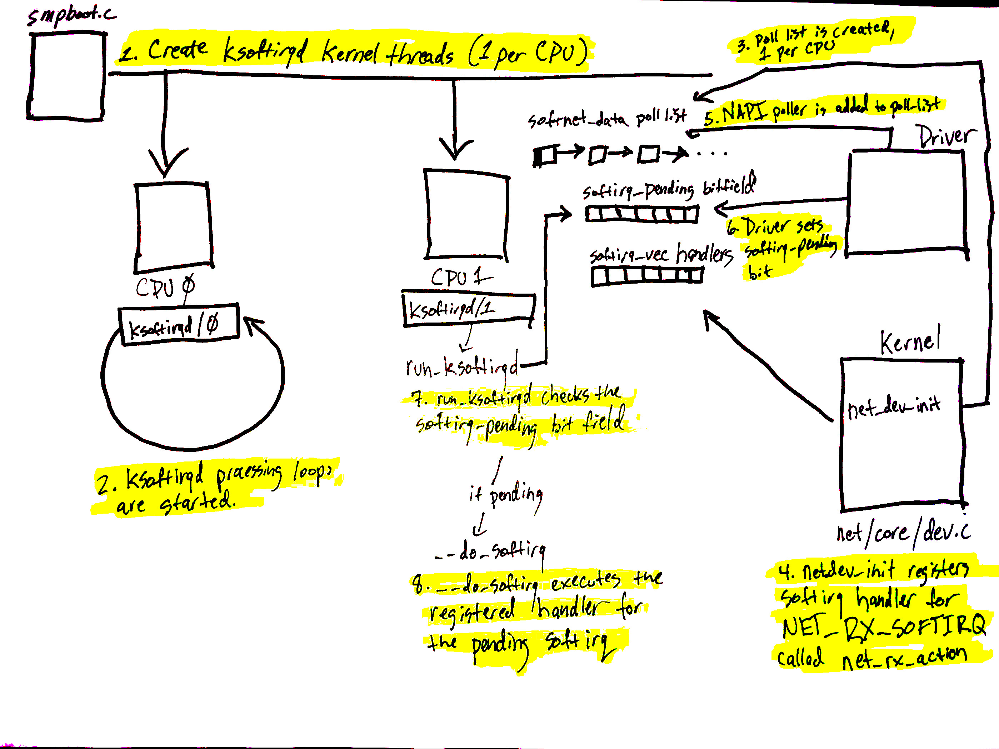
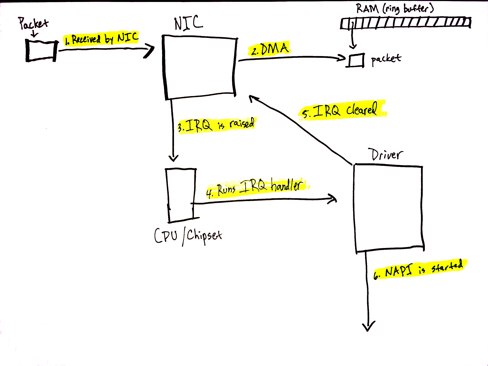
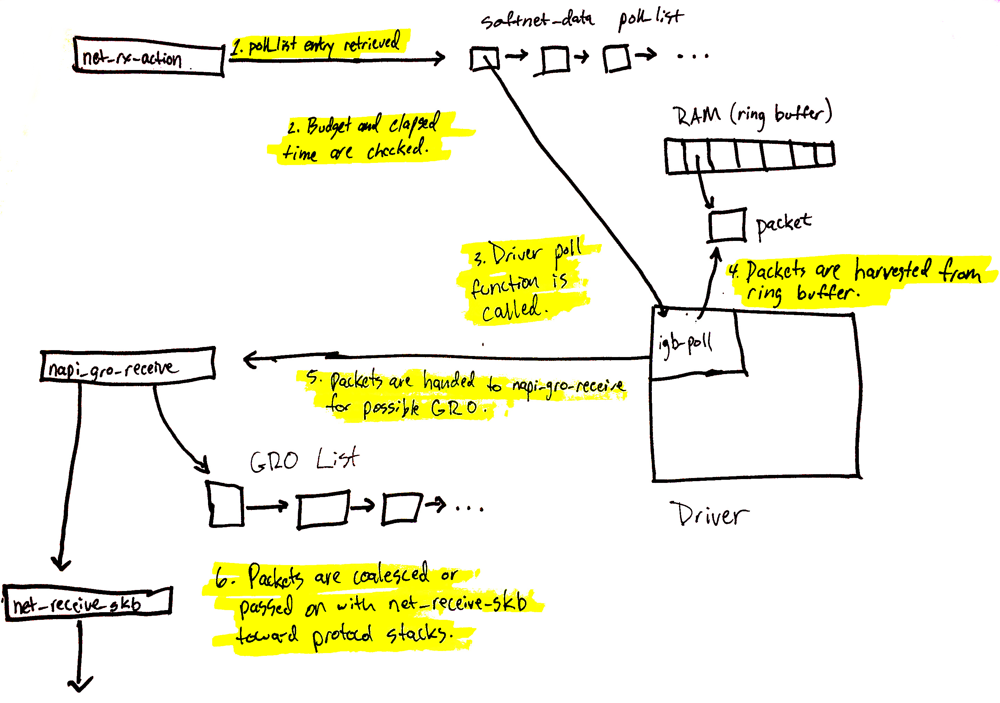
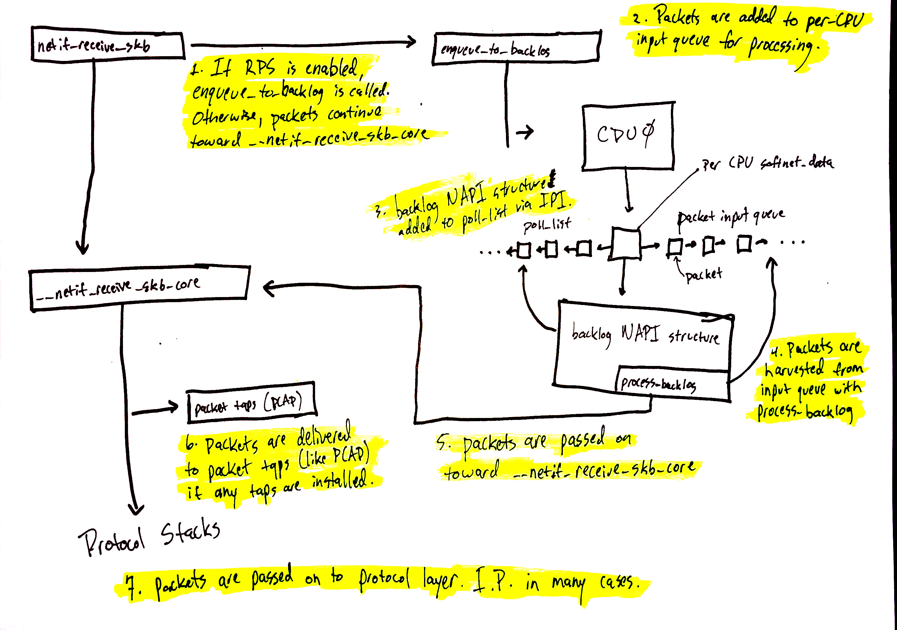

# 概览

* 高层次上看一个包从到达至socket receive buffer的路径如下：
  1. 驱动被加载和初始化。
  2. 包从网络到达网卡（NIC）。
  3. 包（经由DMA）拷贝至内核内存中的一个ring buffer。
  4. 产生硬件中断，让系统知道有一个包在内存中。
  5. 驱动调用进入[NAPI](http://www.linuxfoundation.org/collaborate/workgroups/networking/napi)，如果还没有轮询循环的话，则开始一个新的。
  6. `ksoftirqd`进程运行在系统的每个CPU上。它们在启动时注册。`ksoftirqd`进程通过调用设备驱动在初始化期间注册的NAPI `poll` 函数把包从ring buffer里拉过来。
  7. 之前网络数据写入的ring buffer里的内存regions被unmap。
  8. 被DMA到内存里的数据作为一个“skb”向上传递给网络层做进一步的处理。
  9. 如果packet steering开启，或者，NIC有多个接收队列，进来的网络数据帧会被分发给多个CPU。
  10. 网络数据帧从队列交给协议层。
  11. 协议层处理数据。
  12. 数据被添加到被协议层附着在socket上的receive buffer中。

# 详细查看

## 网络设备驱动

### 初始化

#### PCI 初始化

#### PCI probe

* 绝大部分驱动有许多让设备能够投入使用的代码。确切要做的事情则因设备而异。
* 一些典型的操作包括：
  1. 使能PCI设备。
  2. 请求内存范围和[IO端口](http://wiki.osdev.org/I/O_Ports)。
  3. 设置 [DMA](https://en.wikipedia.org/wiki/Direct_memory_access) mask。
  4. 注册驱动支持的 ethtool（下面详述）函数。
  5. 任何需要的 watchdog 任务（例如，e1000e有一个 watchdog 任务去检查硬件是不是被挂住了）。
  6. 其他设备相关的事情，像 workaround 或 处理设备相关的 quirks 或 类似的事情。
  7. 创建、初始化、注册一个`struct net_device_ops`结构。这个结构包含指向各种需要的操作的函数指针，如打开设备、发送数据到网络、设置MAC地址等等。
  8. 创建、初始化、注册一个高层次的`struct net_device`，表示一个网络设备。

#### NAPI

* NAPI 和以往的收取数据的方法有几个重要的不同。NAPI 允许一个设备驱动注册一个`poll`函数，NAPI子系统会调用该函数收取数据帧。
* 在网络设备驱动中使用NAPI的目的：
* NAPI
> NAPI (“New API”) is an extension to the device driver packet processing framework, which is designed to improve the performance of high-speed networking. NAPI works through:

> **Interrupt mitigation**
>
> High-speed networking can create thousands of interrupts per second, all of which tell the system something it already knew: it has lots of packets to process. NAPI allows drivers to run with (some) interrupts disabled during times of high traffic, with a corresponding decrease in system load.

> **Packet throttling**
>
> When the system is overwhelmed and must drop packets, it's better if those packets are disposed of before much effort goes into processing them. NAPI-compliant drivers can often cause packets to be dropped in the network adaptor itself, before the kernel sees them at all.
>
> New drivers should use NAPI if the hardware can support it. However, NAPI additions to the kernel do not break backward compatibility and drivers may still process completions directly in interrupt context if necessary.

#### igb驱动中NAPI的初始化

### 唤起一个网络设备

* 当一个网络设备被唤起时（例如，用`ifconfig eth0 up`），附着在结构`net_device_ops`的`ndo_open`域的函数被调用。
* 一个典型的`ndo_open`函数会做以下一些事情：
  1. 分配RX和TX队列的内存
  2. 使能NAPI
  3. 注册一个中断处理函数
  4. 使能硬件中断
  5. 其他一些事情

##### 准备从网络接受数据
* 如今绝大部分网卡都采用 DMA 将数据写到内存中，操作系统从该处获取数据做进一步处理。大部分网卡把用于这个目的的数据结构构建成一个 ring buffer。
* 为了达到这个目的，设备驱动必须和操作系统配合工作，保留一块网卡硬件也能使用的内存。
* 一旦该区域被保留好，硬件会被告知该区域的位置，进来的数据会被写到该块内存，随后由网络子系统去接受和做进一步的处理。
* 如果收到的包很多，一个 CPU 处理不过来所有进来的包，由于 ring buffer 是一个块固定长度区域的内存，所以一些进来数据可能会被丢弃。
* [Receive Side Scaling (RSS)](https://en.wikipedia.org/wiki/Network_interface_controller#RSS) 或者 *多队列* 在这种情况下可能会有所帮助。
	* 有的设备有将收到的包同时写到几个不同内存区域的能力；
	* 每个区域是一个分离的队列；
	* 这可以让操作系统从硬件级别上开始，用多个 CPU 并行地处理收到的包。
* RX队列的大小的数值可以通过`ethtool`工具调整，调整这些值会显著地影响处理帧数和丢帧数。
* NIC使用一个哈希函数利用包头域（如源、目的、端口）计算的结果来决定数据应该被导向哪个队列。
* 一些NIC可以让你调整RX队列的权重，从而让你可以发送更多的通信量到特定的队列。
* 极少数的NIC可以让你调整哈希函数。

##### 使能NAPI

##### 注册一个中断处理函数
* MSI-X中断是优先考虑的方法，特别是那些支持多RX队列的NIC。
  * 这是因为每个RX队列可以有属于自己的硬件中断指派。
  * 这样中断可以（通过`irqbalance`或者修改`/proc/irq/IRQ_NUMBER/smp_affinity`）被特定的CPU处理。
  * 如此，处理中断的CPU将会是处理包的CPU，这样到达的包从硬件中断直到网络层都可以被CPU分别处理。
* 关于MSI-X和MSI，更多的信息看[这里](https://en.wikipedia.org/wiki/Message_Signaled_Interrupts)。
* drivers/net/ethernet/intel/igb/igb_main.c
```c
static int igb_request_irq(struct igb_adapter *adapter)
{
  struct net_device *netdev = adapter->netdev;
  struct pci_dev *pdev = adapter->pdev;
  int err = 0;

  if (adapter->msix_entries) {
    err = igb_request_msix(adapter);
    if (!err)
      goto request_done;
    /*fall back to MSI*/

    /*...*/
  }

  /*...*/

  if (adapter->flags & IGB_FLAG_HAS_MSI) {
    err = request_irq(pdev->irq, igb_intr_msi, 0,
          netdev->name, adapter);
    if (!err)
      goto request_done;

    /*fall back to legacy interrupts*/

    /*...*/
  }

  err = request_irq(pdev->irq, igb_intr, IRQF_SHARED,
        netdev->name, adapter);

  if (err)
    dev_err(&pdev->dev, "Error %d getting interrupt\n", err);

request_done:
  return err;
}
```

##### 使能中断

### 监视网络设备
* `ethtool -S eth0`
* `cat /sys/class/net/eth0/statistics/xxx`
* `cat /proc/net/dev`

* `/sys/class/net/eth0/statistics/xxx`的实现见`net/core/net-sysfs.c::netstat_show()`
* `/proc/net/dev`的实现见`net/core/net-procfs.c::dev_seq_show()`
* net/core/net-procfs.c
```c
dev_proc_net_init()
 -> proc_create("dev", S_IRUGO, net->proc_net, &dev_seq_fops)
  -> dev_seq_fops.open = dev_seq_open
	 -> seq_open_net(inode, file, &dev_seq_ops, sizeof(struct seq_net_private))
	  -> dev_seq_ops.show = dev_seq_show
		 -> dev_seq_printf_stats()
		  -> net/core/dev.c::dev_get_stats()
			 -> drivers/net/ethernet/intel/ixgbe/ixgbe_main.c
			   ::ixgbe_netdev_ops.ndo_get_stats64 = ixgbe_get_stats64
				 -> ixgbe_get_stats64()
```

* net/core/dev.c
```c
/**
 *      dev_get_stats   - get network device statistics
 *      @dev: device to get statistics from
 *      @storage: place to store stats
 *
 *      Get network statistics from device. Return @storage.
 *      The device driver may provide its own method by setting
 *      dev->netdev_ops->get_stats64 or dev->netdev_ops->get_stats;
 *      otherwise the internal statistics structure is used.
 */
struct rtnl_link_stats64 *dev_get_stats(struct net_device *dev,
                                        struct rtnl_link_stats64 *storage)
{
        const struct net_device_ops *ops = dev->netdev_ops;

        if (ops->ndo_get_stats64) {
                memset(storage, 0, sizeof(*storage));
                ops->ndo_get_stats64(dev, storage);
        } else if (ops->ndo_get_stats) {
                netdev_stats_to_stats64(storage, ops->ndo_get_stats(dev));
        } else {
                netdev_stats_to_stats64(storage, &dev->stats);
        }
        storage->rx_dropped += atomic_long_read(&dev->rx_dropped);
        storage->tx_dropped += atomic_long_read(&dev->tx_dropped);
        return storage;
}
EXPORT_SYMBOL(dev_get_stats);
/**/```
```

### 调节网络设备

## Linux网络设备子系统

### 网络设备子系统的初始化

* 网络设备（netdev）子系统在`net_dev_init`函数中初始化。

#### 初始化`struct softnet_data`结构体

* `net_dev_init`会为系统里的每个CPU创建一组`struct softnet_data`结构。
* 这些结构里有处理网络数据的几件重要的事情的指针：
  * 被注册到这个CPU上的NAPI结构的列表
  * 用于数据处理backlog
  * 处理`weight`
  * [receive offload](https://en.wikipedia.org/wiki/Large_receive_offload)结构列表
  * [Receive packet steering](https://lwn.net/Articles/362339/)设置
  * 其他

#### 初始化softirq处理函数

* net/core/dev.c
```c
static int __init net_dev_init(void)
{
  /*...*/

  open_softirq(NET_TX_SOFTIRQ, net_tx_action);
  open_softirq(NET_RX_SOFTIRQ, net_rx_action);

 /*...*/
}

subsys_initcall(net_dev_init);
```

### 数据到达

#### 中断处理函数

* drivers/net/ethernet/intel/igb/igb_main.c
```c
static irqreturn_t igb_msix_ring(int irq, void *data)
{
  struct igb_q_vector *q_vector = data;

  /*Write the ITR value calculated from the previous interrupt.*/
  igb_write_itr(q_vector);

  napi_schedule(&q_vector->napi);

  return IRQ_HANDLED;
}
```
* 如果NAPI处理循环没有激活，`napi_schedule`负责唤醒它。
* NAPI处理循环在softirq中执行，而不是由中断处理函数执行。

#### NAPI和`napi_schedule`
* NAPI特地为了收取网络数据，但无需由NIC产生的中断来通知数据已经准备好了，而存在。
* NAPI是关闭的，直到第一个包到达，NIC发起一个中断的那一个点，然后NAPI被使能并且开始。
* NAPI可以被关闭，在它再次启动之前需要一个硬件中断唤醒。
* net/core/dev.c
```c
/* Called with irq disabled */
static inline void ____napi_schedule(struct softnet_data *sd,
                     struct napi_struct *napi)
{   
    list_add_tail(&napi->poll_list, &sd->poll_list);
    __raise_softirq_irqoff(NET_RX_SOFTIRQ);
}

/*...*/

/**
 * __napi_schedule - schedule for receive
 * @n: entry to schedule
 *
 * The entry's receive function will be scheduled to run.
 * Consider using __napi_schedule_irqoff() if hard irqs are masked.
 */
void __napi_schedule(struct napi_struct *n)
{
    unsigned long flags;

    local_irq_save(flags);
    ____napi_schedule(this_cpu_ptr(&softnet_data), n);
    local_irq_restore(flags);
}
EXPORT_SYMBOL(__napi_schedule);
/*...____```*/
```

* `____napi_schedule()`完成两件重要的事情：
  1. 从设备驱动的中断处理函数代码传上来的`struct napi_struct`被添加到附在与当前CPU关联的`softnet_data`结构的`poll_list`。
  2. `__raise_softirq_irqoff`被用来“唤醒”（或触发）一个`NET_RX_SOFTIRQ` softirq。如果网络设备子系统初始化期间注册的`net_rx_action`没有被执行的话，这会导致它被执行。

#### 关于CPU和网络数据处理要注意的一点
* 驱动的中断处理函数本身作的事情非常少，软中断的处理函数会与驱动的中断处理函数同一CPU上执行。
* 这就是为什么设置一个特定的IRQ由那个CPU处理这么重要：该CPU不但执行驱动的中断处理函数，而且相同的CPU会被用于通过NAPI在一个softirq中收取包。
* [Receive Packet Steering](https://lwn.net/Articles/362339/)可以用来分发一些工作到其他CPU，之后上升到网络协议栈。

#### 监视网络数据的到达

#### 调整网络数据的到达
##### 中断合并（Interrupt coalescing）
* [Interrupt coalescing](https://en.wikipedia.org/wiki/Interrupt_coalescing)是一种阻止从设备发起的中断到CPU的方法，直至一个特定的工作量或者挂起的事件数到达后。
* 可以防止中断风暴，能帮助增加吞吐量或延迟。

> **Note**: while interrupt coalescing seems to be a very useful optimization at first glance, the rest of the networking stack internals also come into the fold when attempting to optimize. Interrupt coalescing can be useful in some cases, but you should ensure that the rest of your networking stack is also tuned properly. Simply modifying your coalescing settings alone will likely provide minimal benefit in and of itself.


##### 调整IRQ亲和性
* 调整IRQ亲和性首先要检查`irqbalance`守护进程是否在运行。
  * 该守护进程会尝试将IRQ均衡到每个CPU，有可能会覆盖你的设置。
  * 要么关闭`irqbalance`，要么用`--banirq`和`IRQBALANCE_BANNED_CPUS`来让`irqbalance`知道不要去碰那些你指派给自己用的IRQ集合和CPU。
* 其次检查`/proc/interrupts`里，你的NIC给每个网络RX队列的IRQ号的列表。
* 最后，为那些IRQ通过`/proc/irq/IRQ_NUMBER/smp_affinity`逐个调整，哪个CPU处理这些中断。
  * 例子：设置中断亲和性，IRQ 8 由 CPU 0处理
  ```
  $ sudo bash -c 'echo 1 > /proc/irq/8/smp_affinity'
  ```

### 网络数据处理开始

#### `net_rx_action`处理循环
* `net_rx_action`开启由设备DMA到内存的包的处理。
* 该函数迭代在当前CPU上排队的NAPI结构的列表，从队列上取下每个结构并操作它。
* 该循环处理的边界是被注册的`poll`函数所消耗的工作量和执行时间：
  1. 通过跟踪一个工作`budget`和
  2. 检查逝去的时间
* net/core/dev.c
```c
while (!list_empty(&sd->poll_list)) {
    struct napi_struct *n;
    int work, weight;

    /* If softirq window is exhausted then punt.
     * Allow this to run for 2 jiffies since which will allow
     * an average latency of 1.5/HZ.
     */
    if (unlikely(budget <= 0 || time_after_eq(jiffies, time_limit)))
      goto softnet_break;
/*...__`*/
```
* `budget`是在每个注册到这个CPU的可用的NAPI结构所消耗的所有可用budget。
* 如果你没有足够的CPU去分布处理你网卡中断，你可以考虑增加`net_rx_action`里的`budget`，让每个CPU处理更多的包。
* 增加budget会增加CPU的使用量（特别是`top`程序的`sitime`或`si`，或其他程序），但应该会减小延迟，因为数据会被更迅速地处理。

> **Note**: the CPU will still be bounded by a time limit of 2 jiffies, regardless of the assigned budget.

#### NAPI`poll`函数和weight

#### NAPI/网络设备驱动契约
* NAPI子系统与设备驱动之间一个重要的约定——关于关闭NAPI的需求。
  * 如果驱动的`poll`函数用完了它所有的weight，它一定 **不要** 修改NAPI状态，`net_rx_action`循环会接管过来。
  * 如果驱动的`poll`函数 **没有** 用完它所有的weight，它必须关闭NAPI。NAPI会在收到下一个中断，驱动的IRQ处理函数调用`napi_schedule`的时候重新开启。

#### 结束`net_rx_action`循环

#### 当到达限制的时候退出循环
* `net_rx_action`循环在以下情况时退出：
  * 注册在该CPU上的poll列表没有更多的NAPI结构（`!list_empty(&sd->poll_list)`），或者
  * 剩余`budget`<=0，或者
  * 2个jiffies的时间限制到了。
* net/core/dev.c
```c
/* If softirq window is exhausted then punt.
 * Allow this to run for 2 jiffies since which will allow
 * an average latency of 1.5/HZ.
 */
if (unlikely(budget <= 0 || time_after_eq(jiffies, time_limit)))
  goto softnet_break;
```
* 跟踪label `softnet_break`：
  * `struct softnet_data`结构有一些统计数值的增加
  * softirq `NET_RX_SOFTIRQ`关闭
```c
softnet_break:
  sd->time_squeeze++;
  __raise_softirq_irqoff(NET_RX_SOFTIRQ);
  goto out;
```
* `time_squeeze`域是出现这种情况的次数的度量：`net_rx_action`还有更多工作要做，但在它完成之前`budget`已耗尽或者到达时间限制。
  * 这是一个理解在网络处理过程中的瓶颈的非常有用的计数。
* 关闭`NET_RX_SOFTIRQ`软中断释放处理器时间给其他任务，虽然有很多工作还可以做，但我们不想垄断CPU。
* 如果没有更多的NAPI结构需要处理，则跳到`out`标签。
  * budget比网络活动多，所有的驱动关闭NAPI，没什么留给`net_rx_action`去做的。
  * `out`部分，`net_rx_action`返回前，做了一件重要的事情：调用`net_rps_action_and_irq_enable()`。
    * 如果[Receive Packet Steering](https://lwn.net/Articles/362339/)开启的话，该函数有个重要的目的：唤醒远程的CPU处理网络数据。

#### NAPI poll
* 设备驱动的责任：
  * 分配内存区域给DMA
  * unmap这些区域
  * 收取数据
  * 上交数据给网络协议栈

#### 监视网络数据处理
##### `/proc/net/softnet_stat`
* net/core/net-procfs.c::`softnet_seq_show()`
```c
seq_printf(seq,
       "%08x %08x %08x %08x %08x %08x %08x %08x %08x %08x %08x\n",
       sd->processed, sd->dropped, sd->time_squeeze, 0,
       0, 0, 0, 0, /*was fastroute*/
       sd->cpu_collision, sd->received_rps, flow_limit_count);
```
* 每行对应到一个每个CPU都有的`struct softnet_data`结构
* `sd->processed` 处理的网络数据帧数。ethernet bonding（以太网绑定是一个有用的 Linux 特性，它提供多种将多个网络接口合并为一个逻辑接口的方法）会使同一个包被处理多次，因此这个统计值可能会比实际收到的包多。
* `sd->dropped` 因处理队列上没有足够的空间而丢弃的网络帧数。
* `sd->time_squeeze` 因budget消耗或到达时间限制而中断`net_rx_action`循环但实际还有更多的工作的次数。
* `sd->cpu_collision` 发包时尝试获取一个设备锁而发生冲突的次数。
* `sd->received_rps` 该CPU通过[Inter-processor Interrupt](https://en.wikipedia.org/wiki/Inter-processor_interrupt)唤醒去处理包的次数。
* `sd->flow_limit_count` 到达流限制的次数。Flow limiting是[Receive Packet Steering](https://lwn.net/Articles/362339/)的一个可选feature。

#### 调节网络数据处理
* 调整`net_rx_action`budget
```
$ cat /proc/sys/net/core/netdev_budget
300
$ sudo sysctl -w net.core.netdev_budget=600
```

### Generic Receive Offloading (GRO)

* Generic Receive Offloading （GRO）是一个被称为Large Receive Offloading （LRO）的硬件优化的软件实现。
* 两种方法背后的主要思想：通过将“足够相似”的包合并在一起以减少传给网络栈的包的数目，从而减少 CPU 的使用。
* 如果你曾经用`tcpdump`看到过不切实际的进来的大包，很可能就是因为你的系统开启了 GRO。
* 包捕捉的时机在更深一层的栈，在 GRO 已经发生之后。

#### 调整：用`ethtool`调节GRO设置

```
# Use ethtool -k to check your GRO settings.
$ ethtool -k eth0 | grep generic-receive-offload
generic-receive-offload: on

# Use ethtool -K to enable (or disable) GRO.
$ sudo ethtool -K eth0 gro on
```
> **Note**: making these changes will, for most drivers, take the interface down and then bring it back up; connections to this interface will be interrupted. This may not matter much for a one-time change, though.

#### `napi_gro_receive`

##### `dev_gro_receive`

#### `napi_skb_finish`

## Receive Packet Steering (RPS)

* Receive Side Scaling (RSS)
    * 一些网卡支持硬件级别的多队列。这意味着进来的包能够被DMA到一个对每个队列独立的内存区域，也会有一个独立的NAPI结构来管理对这个区polling。
    * 因此多个CPU会处理来自设备的中断，也包括包的处理。
    * 该feature被称为Receive Side Scaling (RSS)
* [Receive Packet Steering](https://lwn.net/Articles/362339/)是RSS的一个软件实现。
  * 软件实现也意味着它可以被用于任何网卡，即便网卡仅有一个RX队列。
  * 但也意味着，RPS 进入流程只能发生在一个包被从 DMA 内存收取上来之后。
  * 这意味着，你不会注意到花在 IRQ 处理或 NAPI poll 循环上的 CPU 时间的减少，而是你可以分散包收取之后处理的负载和传上网络栈减少的 CPU 时间。
* RPS 通过给每个进来的数据计算一个 hash 值，来决定那个 CPU 应该处理数据。接着数据被排入 per-CPU 的接收网络 backlog 等待被处理。
* 一个[Inter-processor Interrupt (IPI)](https://en.wikipedia.org/wiki/Inter-processor_interrupt)会被递交给 CPU 拥有的 backlog。

### 调节：开启RPS
* RPS能工作起来需要：
  * 必须在kernel配置中开启。
  * 一个描述某个给定的接口和RX队列应该由那个CPU处理包的位掩码。
  ```
  /sys/class/net/DEVICE_NAME/queues/QUEUE/rps_cpus
  /sys/class/net/eth0/queues/rx-0/rps_cpus
  ```

> **Note**: enabling RPS to distribute packet processing to CPUs which were previously not processing packets will cause the number of `NET_RX` softirqs to increase for that CPU, as well as the `si` or `sitime` in the CPU usage graph. You can compare before and after of your softirq and CPU usage graphs to confirm that RPS is configured properly to your liking.

## Receive Flow Steering (RFS)

* Receive flow steering (RFS) 与RPS连同使用。
* RPS尝试在多CPU之间分布进来的包的负载，但没有考虑任何CPU缓存命中率有关的数据位置问题。
* 用RFS有助于增加缓存命中率，通过把相同的流的包定向到相同的CPU处理增加缓存命中率。

### 调节：开启RFS
* RFS持续跟踪一个所有流的全局的hash表，并且hash表的大小可以通过`net.core.rps_sock_flow_entries`的sysctl来调整。
```
# Increase the size of the RFS socket flow hash by setting a sysctl.
$ sudo sysctl -w net.core.rps_sock_flow_entries=32768

#Example: increase the number of flows for RX queue 0 on eth0 to 2048.
$ sudo bash -c 'echo 2048 > /sys/class/net/eth0/queues/rx-0/rps_flow_cnt'
```

## 硬件加速的 Receive Flow Steering (aRFS)

## 由`netif_receive_skb`上移至网络栈
* `netif_receive_skb`在多处调用，两个最常见的地方：
  * `napi_skb_finish` 如果包不会被 merge 到一个已存在的 GRO 流，或者
  * `napi_gro_complete` 如果协议层指明是时候 flush 流。

> *提醒*： `netif_receive_skb`和它的后续操作是在一个softirq处理循环的上下文中，你会看到这的时间开销被计入如`top`工具的`sitime`或`si`项。

### 调节：RX包时间戳
* 你可以通过调整一个名为`net.core.netdev_tstamp_prequeue`的sysctl项来调节什么时候包被打上时间戳。
```
# Disable timestamping for RX packets by adjusting a sysctl
$ sudo sysctl -w net.core.netdev_tstamp_prequeue=0
```

## `netif_receive_skb`

* 打上时间戳后，`netif_receive_skb`会因为RPS是否使能而有不同的操作。

### Without RPS (default setting)

```
netif_receive_skb()
  |
  +--> netif_receive_skb_internal()
         |
         +--> __netif_receive_skb()
               |
               +--> __netif_receive_skb_core()
                     |
                     +--> protocol stacks
```

### With RPS enabled

```c
/*perform some computations to determine which CPU’s backlog queue should be used.*/
cpu = get_rps_cpu(skb->dev, skb, &rflow);

if (cpu >= 0) {
  ret = enqueue_to_backlog(skb, cpu, &rflow->last_qtail);
  rcu_read_unlock();
  return ret;
}
```
* `get_rps_cpu`会考虑RFS和aRFS设置，调用`enqueue_to_backlog`，确保数据排到想要的CPU backlog里。

#### `enqueue_to_backlog`
```c
qlen = skb_queue_len(&sd->input_pkt_queue);
if (qlen <= netdev_max_backlog && !skb_flow_limit(skb, qlen)) {
/*...*/
}
```
* 不符合已上两个限制条件的包会被丢弃。`struct softnet_data`结构的丢弃计数会增加（参看`/proc/net/softnet_stat`）。
* `enqueue_to_backlog`并不会在多处被调用。它会被调用：
  * 使能RPS包处理
  * `netif_rx`，绝大部分驱动不应该用`netif_rx`而该用`netif_receive_skb`。

> **Note**: You need to check the driver you are using. If it calls netif_receive_skb and you are not using RPS, increasing the netdev_max_backlog will not yield any performance improvement because no data will ever make it to the input_pkt_queue.

#### 流限制
* 防止单个大的流垄断CPU处理时间造成较小的流饥饿。
* `skb_flow_limit()`

#### 监控：监视由于`input_pkt_queue`队列满或流限制造成的丢包
* `/proc/net/softnet_stat`的`dropped`域

#### 调节
##### 调节`netdev_max_backlog`防止丢包
```
# Example: increase backlog to 3000 with sysctl.
$ sudo sysctl -w net.core.netdev_max_backlog=3000
```
* 缺省值为1000。

##### 调节backlog `poll` 循环的NAPI权重
* 通过设置`net.core.dev_weight` sysctl项，调整backlog的轮询者的权重。
* 调整该值决定了backlog `poll` 循环可以消耗的总体的budget有多少（参考之前的`net.core.netdev_budget`）。
```
# Example: increase the NAPI poll backlog processing loop with sysctl.
$ sudo sysctl -w net.core.dev_weight=600
```
* 缺省值为64。
* 记住，在softirq上下文中运行的backlog和驱动程序注册的`poll`相似，会受全局`budget`和时间的限制。

##### 开启流限制和调节流限制hash表大小
```
# Set the size of the flow limit table with a sysctl.
$ sudo sysctl -w net.core.flow_limit_table_len=8192
```
* 缺省值是4096。
* 修改只影响新分配的流限制hash表。
* 开启流限制`/proc/sys/net/core/flow_limit_cpu_bitmap`

### backlog 队列 NAPI 轮询者

### `process_backlog`

### `__netif_receive_skb_core`递交数据给包taps和协议层
* `__netif_receive_skb_core`承担递交数据包给协议层的重任。
* 在此之前，它需要检查是否安装了任何包taps，以捕捉所有进来的包。
  * 例如，`AF_PACKET`地址族，典型地被[libpcap library](http://www.tcpdump.org/manpages/pcap.3pcap.html)使用。
* 如果有，则先把数据提交到那儿，再到协议层。

### Packet tap delivery
* net/core/dev.c
```c
static int __netif_receive_skb_core(struct sk_buff *skb, bool pfmemalloc)
{
  /*...*/
  list_for_each_entry_rcu(ptype, &ptype_all, list) {
    if (!ptype->dev || ptype->dev == skb->dev) {
      if (pt_prev)
        ret = deliver_skb(skb, pt_prev, orig_dev);
      pt_prev = ptype;
    }
  }
  /*...`*/
}
```
* 数据怎么通过pcap，见 net/packet/af_packet.c。

### Protocol layer delivery
* net/core/dev.c
```c
static int __netif_receive_skb_core(struct sk_buff *skb, bool pfmemalloc)
{
  /*...*/
  type = skb->protocol;
  list_for_each_entry_rcu(ptype,
                  &ptype_base[ntohs(type) & PTYPE_HASH_MASK], list) {
          if (ptype->type == type &&
              (ptype->dev == null_or_dev || ptype->dev == skb->dev ||
               ptype->dev == orig_dev)) {
                  if (pt_prev)
                          ret = deliver_skb(skb, pt_prev, orig_dev);
                  pt_prev = ptype;
          }
  }
  /*...`*/
}
```
* 根据数据的协议域，迭代注册的协议类型的提交函数。

```c
struct list_head ptype_base[PTYPE_HASH_SIZE] __read_mostly;
```
* 每个协议层添加一个过滤器到给定的hash表的一个槽中。

```c
static inline struct list_head *ptype_head(const struct packet_type *pt)
{
        if (pt->type == htons(ETH_P_ALL))
                return &ptype_all;
        else
                return &ptype_base[ntohs(pt->type) & PTYPE_HASH_MASK];
}
/*...`*/
```
* 计算的方式。
* 添加过滤器`dev_add_pack()`

## 协议层注册

### IP协议层
* net/ipv4/af_inet.c

```c
static struct packet_type ip_packet_type __read_mostly = {
    .type = cpu_to_be16(ETH_P_IP),
    .func = ip_rcv,
};

static int __init inet_init(void)
{
  /*...*/
  dev_add_pack(&ip_packet_type);
  /*...*/
}
```
* `__netif_receive_skb_core` 调用 `deliver_skb` 调用 `func` （这里是 `ip_rcv`）.

#### ip_rcv
* `ip_rcv`最终通过 [netfilter](https://en.wikipedia.org/wiki/Netfilter) 的方式把包传给`ip_rcv_finish`。
* 这么做是为了任何应该在IP协议层匹配的 [iptables](https://en.wikipedia.org/wiki/Iptables) 规则在它继续处理之前可以看一看在这些包。
* net/ipv4/ip_input.c
```
return NF_HOOK(NFPROTO_IPV4, NF_INET_PRE_ROUTING, skb, dev, NULL, ip_rcv_finish);
```

#### netfilter和iptables
* 记住：如果你有很多的或非常复杂的 netfilter 或 iptables 规则，这些规则会在 softirq 上下文中被执行，并会导致你网络栈的延迟。尽管这样，但如果你需要安装一个特定规则的集合，这可能是不可避免的。

#### `ip_rcv_finish`
* 一旦网络过滤器有机会看一眼数据包，并且决定对它做些什么，`ip_rcv_finish`会被调用。
* 当然，这只发生在数据不被 netfilter 丢弃的情况下。
* 先从优化开始，尝试调用来自上层协议的`early_demux`函数来决定包的去向。
* `early_demux`例程通过检查`dst_entry`是否在socket结构里cached，来找`dst_entry`。
* net/ipv4/ip_input.c
```c
if (sysctl_ip_early_demux && !skb_dst(skb) && skb->sk == NULL) {
  const struct net_protocol *ipprot;
  int protocol = iph->protocol;

  ipprot = rcu_dereference(inet_protos[protocol]);
  if (ipprot && ipprot->early_demux) {
    ipprot->early_demux(skb);
    /* must reload iph, skb->head might have changed */
    iph = ip_hdr(skb);
  }
}
/*...``*/
```
* 如果没有cached条目的话（第一个包到达），包会被交给内核里的路由子系统，在那里计算和赋予`dst_entry`。
* 一旦路由层完成，统计计数会更新，函数以调用`dst_input(skb)`结束。
  * 轮到`dst_input(skb)`调用包的被路由系统附着的`dst_entry`的输入函数指针。
  * 如果包的目的地址是本地系统，路由子系统会把`ip_local_deliver`函数附着在包的`dst_entry`的输入函数指针上。

##### 调节：调整IP协议 early demux
```
# Disable the early_demux optimization by setting a sysctl.
$ sudo sysctl -w net.ipv4.ip_early_demux=0
```
* 缺省值是 1。

#### `ip_local_deliver`
* `ip_local_deliver`的处理模式和`ip_rcv`的类似。
* net/ipv4/ip_input.c
```c
/*
 *      Deliver IP Packets to the higher protocol layers.
 */
int ip_local_deliver(struct sk_buff *skb)
{
        /*
         *      Reassemble IP fragments.
         */

        if (ip_is_fragment(ip_hdr(skb))) {
                if (ip_defrag(skb, IP_DEFRAG_LOCAL_DELIVER))
                        return 0;
        }

        return NF_HOOK(NFPROTO_IPV4, NF_INET_LOCAL_IN, skb, skb->dev, NULL,
                       ip_local_deliver_finish);
}
/*...`*/
```
#### `ip_local_deliver_finish`
* `ip_local_deliver_finish`从包中获得协议，查找一个为该协议注册的`net_protocol`结构，调用`net_protocol`结构中的`handler`函数指针。

#### 监控: IP协议层统计
* 读取`/proc/net/snmp`监控详细的IP协议统计
```
$ cat /proc/net/snmp
Ip: Forwarding DefaultTTL InReceives InHdrErrors InAddrErrors ForwDatagrams InUnknownProtos InDiscards InDelivers OutRequests OutDiscards OutNoRoutes ReasmTimeout ReasmReqds ReasmOKs ReasmFails FragOKs FragFails FragCreates
Ip: 1 64 25922988125 0 0 15771700 0 0 25898327616 22789396404 12987882 51 1 10129840 2196520 1 0 0 0
...
```
* include/uapi/linux/snmp.h
```c
enum
{
  IPSTATS_MIB_NUM = 0,
/*frequently written fields in fast path, kept in same cache line*/
  IPSTATS_MIB_INPKTS,     /* InReceives */
  IPSTATS_MIB_INOCTETS,     /* InOctets */
  IPSTATS_MIB_INDELIVERS,     /* InDelivers */
  IPSTATS_MIB_OUTFORWDATAGRAMS,   /* OutForwDatagrams */
  IPSTATS_MIB_OUTPKTS,      /* OutRequests */
  IPSTATS_MIB_OUTOCTETS,      /* OutOctets */

  /*...*/
}
/*...`*/
```

* 读取`/proc/net/netstat`监控扩展的IP协议统计

```
$ cat /proc/net/netstat | grep IpExt
IpExt: InNoRoutes InTruncatedPkts InMcastPkts OutMcastPkts InBcastPkts OutBcastPkts InOctets OutOctets InMcastOctets OutMcastOctets InBcastOctets OutBcastOctets InCsumErrors InNoECTPkts InECT0Pktsu InCEPkts
IpExt: 0 0 0 0 277959 0 14568040307695 32991309088496 0 0 58649349 0 0 0 0 0
```

* `InReceives`: The total number of IP packets that reached ip_rcv before any data integrity checks.
* `InHdrErrors`: Total number of IP packets with corrupted headers. The header was too short, too long, non-existent, had the wrong IP protocol version number, etc.
* `InAddrErrors`: Total number of IP packets where the host was unreachable.
* `ForwDatagrams`: Total number of IP packets that have been forwarded.
* `InUnknownProtos`: Total number of IP packets with unknown or unsupported protocol specified in the header.
* `InDiscards`: Total number of IP packets discarded due to memory allocation failure or checksum failure when packets are trimmed.
* `InDelivers`: Total number of IP packets successfully delivered to higher protocol layers. Keep in mind that those protocol layers may drop data even if the IP layer does not.
* `InCsumErrors`: Total number of IP Packets with checksum errors.

* `/proc/net/netstat`的实现见`net/ipv4/proc.c::netstat_seq_show()`

### 高层协议注册
* net/ipv4/af_inet.c
```c
static const struct net_protocol tcp_protocol = {
        .early_demux    =       tcp_v4_early_demux,
        .handler        =       tcp_v4_rcv,
        .err_handler    =       tcp_v4_err,
        .no_policy      =       1,
        .netns_ok       =       1,
};

static const struct net_protocol udp_protocol = {
        .early_demux =  udp_v4_early_demux,
        .handler =      udp_rcv,
        .err_handler =  udp_err,
        .no_policy =    1,
        .netns_ok =     1,
};

static const struct net_protocol icmp_protocol = {
        .handler =      icmp_rcv,
        .err_handler =  icmp_err,
        .no_policy =    1,
        .netns_ok =     1,
};

static int __init inet_init(void)
{
   /*...*/
   /*
    *      Add all the base protocols.
    */

   if (inet_add_protocol(&icmp_protocol, IPPROTO_ICMP) < 0)
           pr_crit("%s: Cannot add ICMP protocol\n", __func__);
   if (inet_add_protocol(&udp_protocol, IPPROTO_UDP) < 0)
           pr_crit("%s: Cannot add UDP protocol\n", __func__);
   if (inet_add_protocol(&tcp_protocol, IPPROTO_TCP) < 0)
           pr_crit("%s: Cannot add TCP protocol\n", __func__);
   /*...`*/
}
```

* `handler`作为上一层协议的入口点。

### UDP协议层
#### `udp_rcv`
#### `__udp4_lib_rcv`
* `__udp4_lib_rcv` 函数
  * 确认包是合法的
  * 获取UDP头，UDP数据报长度，源地址和目的地址
  * 额外的完整性检查和校验和验证
* net/ipv4/udp.c
```c
ret = udp_queue_rcv_skb(sk, skb);
sock_put(sk);
```
#### `udp_queue_rcv_skb`

* 该函数的初始部分如下：
  1. 判断数据报关联的socket是不是一个[加密](https://tools.ietf.org/html/rfc3948)的socket，如果是，在处理前把包上传给那一层的处理函数。
  2. 判断数据报是不是一个UDP-Lite数据报并且做一些完整新检查。
  3. 验证数据报的UDP校验和，如果校验失败则丢弃它。
* 最后，到达接收队列逻辑，从检查该socket的接收队列的是否满了开始。
* net/ipv4/udp.c
```c
if (sk_rcvqueues_full(sk, skb, sk->sk_rcvbuf))
  goto drop;
```

#### `sk_rcvqueues_full`
* `sk_rcvqueues_full`检查 **socket的backlog长度和socket的`sk_rmem_alloc`的和** 是否大于该socket的`sk_rcvbuf`。
```c
/*
 * Take into account size of receive queue and backlog queue
 * Do not take into account this skb truesize,
 * to allow even a single big packet to come.
 */
static inline bool sk_rcvqueues_full(const struct sock *sk, const struct sk_buff *skb,
                                     unsigned int limit)
{
        unsigned int qsize = sk->sk_backlog.len + atomic_read(&sk->sk_rmem_alloc);

        return qsize > limit;
}
/*...``*/
```

##### 调节：socket接收队列内存
* `sk->sk_rcvbuf`的值可以增加
```
# Increase the maximum receive buffer size by setting a sysctl.
$ sudo sysctl -w net.core.rmem_max=8388608
```
* `sk->sk_rcvbuf`的起始值可以调整
```
# Adjust the default initial receive buffer size by setting a sysctl.
$ sudo sysctl -w net.core.rmem_default=8388608
```

* 应用程序可以通过[`setsockopt()`](http://www.manpagez.com/man/2/setsockopt/)的`SO_RCVBUF`设置`sk->sk_rcvbuf`的大小，但你能设置的最大值是`net.core.rmem_max`。
* 你可以覆写`net.core.rmem_max`的限制，通过调用`setsockopt()`的`SO_RCVBUFFORCE`参数，但需要运行程序的用户有`CAP_NET_ADMIN`的能力。
* `sk->sk_rmem_alloc`的值可以通过调用`skb_set_owner_r()`增加，该函数设置一个数据报的拥有者的socket。
* `sk->sk_backlog.len`也可以通过调用`sk_add_backlog()`增加。

#### 回到`udp_queue_rcv_skb`
* net/ipv4/udp.c
```c
bh_lock_sock(sk);
if (!sock_owned_by_user(sk))
  rc = __udp_queue_rcv_skb(sk, skb);
else if (sk_add_backlog(sk, skb, sk->sk_rcvbuf)) {
  bh_unlock_sock(sk);
  goto drop;
}
bh_unlock_sock(sk);

return rc;
```
If it does, the datagram is queued to the backlog with a call to sk_add_backlog.
* 第一步是判断是否有来自用户态的程序针对当前socket的系统调用。
  * 如果没有，数据报可以用`__udp_queue_rcv_skb()`加到接收队列。
  * 如果有，则数据报通过调用`sk_add_backlog()`加到backlog队列。
    * 该数据报通过调用内核里的`release_sock()`函数释放socket。

#### `__udp_queue_rcv_skb`
* net/ipv4/udp.c
```c
static int __udp_queue_rcv_skb(struct sock *sk, struct sk_buff *skb)
{
    int rc;

    if (inet_sk(sk)->inet_daddr) {
        sock_rps_save_rxhash(sk, skb);
        sk_mark_napi_id(sk, skb);
        sk_incoming_cpu_update(sk);
    }

    rc = sock_queue_rcv_skb(sk, skb);
    if (rc < 0) {
        int is_udplite = IS_UDPLITE(sk);

        /* Note that an ENOMEM error is charged twice */
        if (rc == -ENOMEM)
            UDP_INC_STATS_BH(sock_net(sk), UDP_MIB_RCVBUFERRORS,
                     is_udplite);
        UDP_INC_STATS_BH(sock_net(sk), UDP_MIB_INERRORS, is_udplite);
        kfree_skb(skb);
        trace_udp_fail_queue_rcv_skb(rc, sk);
        return -1;
    }

    return 0;

}
/*...`*/
```
* `__udp_queue_rcv_skb()`调用`sock_queue_rcv_skb()`将数据报添加到接收队列。
* 如果不能添加到接收队列则更新统计计数。

#### 监视：UDP协议层统计

##### /proc/net/snmp
```
# Monitor detailed UDP protocol statistics by reading /proc/net/snmp.
$ cat /proc/net/snmp | grep Udp\:
Udp: InDatagrams NoPorts InErrors OutDatagrams RcvbufErrors SndbufErrors
Udp: 16314 0 0 17161 0 0
```
* `InDatagrams`: Incremented when `recvmsg` was used by a userland program to read datagram. Also incremented when a UDP packet is encapsulated and sent back for processing.
* `NoPorts`: Incrememnted when UDP packets arrive destined for a port where no program is listening.
* `InErrors`: Incremented in several cases: no memory in the receive queue, when a bad checksum is seen, and if `sk_add_backlog` fails to add the datagram.
* `OutDatagrams`: Incremented when a UDP packet is handed down without error to the IP protocol layer to be sent.
* `RcvbufErrors`: Incremented when `sock_queue_rcv_skb` reports that no memory is available; this happens if `sk->sk_rmem_alloc` is greater than or equal to `sk->sk_rcvbuf`.
* `SndbufErrors`: Incremented if the IP protocol layer reported an error when trying to send the packet, if there’s no kernel memory, or no send buffer space.
* `InCsumErrors`: Incremented when a UDP checksum failure is detected. Note that in all cases I could find, `InCsumErrors` is incrememnted at the same time as `InErrors`. Thus, `InErrors` - `InCsumErros` should yield the count of memory related errors.

##### /proc/net/udp
* 实现见net/ipv4/udp.c:`udp4_seq_show()`
```
# Monitor UDP socket statistics by reading /proc/net/udp
$ cat /proc/net/udp
  sl  local_address rem_address   st tx_queue rx_queue tr tm->when retrnsmt   uid  timeout inode ref pointer drops
  515: 00000000:B346 00000000:0000 07 00000000:00000000 00:00000000 00000000   104        0 7518 2 0000000000000000 0
  558: 00000000:0371 00000000:0000 07 00000000:00000000 00:00000000 00000000     0        0 7408 2 0000000000000000 0
  588: 0100007F:038F 00000000:0000 07 00000000:00000000 00:00000000 00000000     0        0 7511 2 0000000000000000 0
  769: 00000000:0044 00000000:0000 07 00000000:00000000 00:00000000 00000000     0        0 7673 2 0000000000000000 0
  812: 00000000:006F 00000000:0000 07 00000000:00000000 00:00000000 00000000     0        0 7407 2 0000000000000000 0
```
* `sl`: Kernel hash slot for the socket
* `local_address`: Hexadecimal local address of the socket and port number, separated by `:`.
* `rem_address`: Hexadecimal remote address of the socket and port number, separated by `:`.
* `st`: The state of the socket. Oddly enough, the UDP protocol layer seems to use some TCP socket states. In the example above, `7` is `TCP_CLOSE`.
* `tx_queue`: The amount of memory allocated in the kernel for outgoing UDP datagrams.
* `rx_queue`: The amount of memory allocated in the kernel for incoming UDP datagrams.
* `tr`, `tm->when`, `retrnsmt`: These fields are unused by the UDP protocol layer.
* `uid`: The effective user id of the user who created this socket.
* `timeout`: Unused by the UDP protocol layer.
* `inode`: The inode number corresponding to this socket. You can use this to help you determine which user process has this socket open. Check `/proc/[pid]/fd`, which will contain symlinks to `socket[:inode]`.
* `ref`: The current reference count for the socket.
* `pointer`: The memory address in the kernel of the `struct sock`.
* `drops`: The number of datagram drops associated with this socket.

### 到一个socket的数据排队
* 网络数据通过调用`sock_queue_rcv()`排到一个socket的队列里。
* 该函数将数据添加到队列之前做以下一些事情：
  1. socket分配内存会被检查，看它是否超出了接收缓冲区的大小。如果是，socket的丢包计数增加。
  2. 接着，`sk_filter`被用于处理所有应用到该socket上的 Berkeley Packet Filter 过滤器。
  3. 运行`sk_rmem_schedule`确保接收缓冲区有足够的空间接受这个数据报。
  4. 接着，数据报的大小（的内存？）通过调用`skb_set_owner_r`兑现给socket，增加`sk->sk_rmem_alloc`。
  5. 通过调用`__skb_queue_tail`将数据添加到队列。
  6. 最后，所有所有等待数据到达该socket的进程会得到一个通知，调用`sk_data_ready`通知处理函数发送该通知。

## 额外内容

### 时间戳

### 低延迟socket的忙轮询
* 有可能用`SO_BUSY_POLL` socket选项在阻塞接收完成没有数据的时候，让kernel忙轮询新数据。
* 需要设备驱动的支持。实现`struct net_device_ops`结构的`ndo_busy_poll`。
* 设置sysctl的`net.core.busy_poll`微秒值，作为`poll`和`select`忙轮询等待新数据到来的时间。
* 减少延迟，但会增加CPU使用量和能源消耗。

### Netpoll：在关键的上下文中的网络支持
* Linux提供当kernel crash时仍可用设备驱动在网卡上收发数据。
* 该API即 Netpoll，尤其是被用于 [kgdb](http://sysprogs.com/VisualKernel/kgdboe/launch/), [netconsole](https://github.com/torvalds/linux/blob/v3.13/Documentation/networking/netconsole.txt)
* 绝大部分驱动支持 Netpoll。
* 需要实现`ndo_poll_controller`函数并attach到probe期间注册的`struct net_device_ops`结构。
* 当网络设备子系统在进来和发出的数据上执行操作的时候，netpoll系统会首先判定一下这些包是不是给netpoll的。
* net/dev/core.c
```c
static int __netif_receive_skb_core(struct sk_buff *skb, bool pfmemalloc)
{

  /* ... */

  /* if we've gotten here through NAPI, check netpoll */
  if (netpoll_receive_skb(skb))
    goto out;

  /* ...` */
}
```
* Netpoll检查早于绝大部分处理发送和接收网络数据的Linux网络设备子系统的代码。
* Netpoll API的消费者可以通过调用`netpoll_setup`注册`struct netpoll`结构。
* `struct netpoll`结构有attaching到接收hook的函数指针和API给发送数据导出的一个函数。
* [netconsole driver](https://github.com/torvalds/linux/blob/v3.13/drivers/net/netconsole.c)
* [include/linux/netpoll.h](https://github.com/torvalds/linux/blob/v3.13/include/linux/netpoll.h)
* [Programming with the Netpoll API](http://people.redhat.com/~jmoyer/netpoll-linux_kongress-2005.pdf)

### `SO_INCOMING_CPU`
* `SO_INCOMING_CPU` flag直到 Linux 3.19才被引入。
* 用`getsockopt`的`SO_INCOMING_CPU`选项可以断定哪个CPU在给某个特定的socket处理网络包。
* 然后应用程序可以用这些信息把socket交给跑在期望的CPU上的线程，从而帮助增加数据的本地性和CPU cache命中。

### DMA引擎
* A [DMA](https://en.wikipedia.org/wiki/Direct_memory_access) engine is a piece of hardware that allows the CPU to offload large copy operations.
* Linux内核提供一个通用的 [DMA引擎接口](https://github.com/torvalds/linux/blob/v3.13/Documentation/dmaengine.txt)，DMA引擎驱动的作者可以以此介入。

#### Intel的I/O加速技术（IOAT）

##### 直接cache访问（DCA）
* 该feature允许网路设备（通过它们的驱动）把网络数据直接放到CPU cache里。这如何工作的，准确的说，是驱动相关的。

##### 监控 IOAT DMA 引擎
```
# Monitor the total number of offloaded memcpy operations for a DMA channel.
$ cat /sys/class/dma/dma0chan0/memcpy_count
123205655
```
```
# Monitor total number of bytes transferred for a DMA channel.
$ cat /sys/class/dma/dma0chan0/bytes_transferred
131791916307
```

##### 调节 IOAT DMA 引擎
* IOAT DMA引擎仅在包大小超过一定阈值的时候使用。该阈值称为`copybreak`。
```
# Adjust the DMA engine copybreak with a sysctl.
$ sudo sysctl -w net.ipv4.tcp_dma_copybreak=2048
```
* 缺省值为4096。

# 结论

# Initial setup

# Data arrives

# Network data processing begins

# Network data processing continues


# 参考资料
* [Monitoring and Tuning the Linux Networking Stack: Receiving Data](http://blog.packagecloud.io/eng/2016/06/22/monitoring-tuning-linux-networking-stack-receiving-data/)
* [Illustrated Guide to Monitoring and Tuning the Linux Networking Stack: Receiving Data](http://blog.packagecloud.io/eng/2016/10/11/monitoring-tuning-linux-networking-stack-receiving-data-illustrated/)
