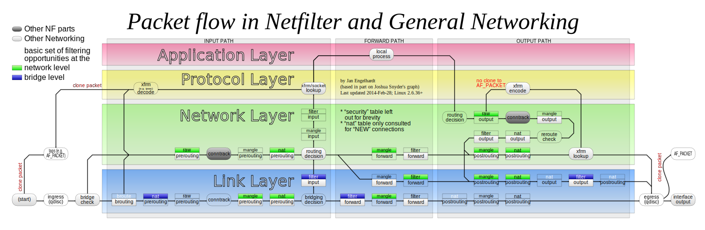
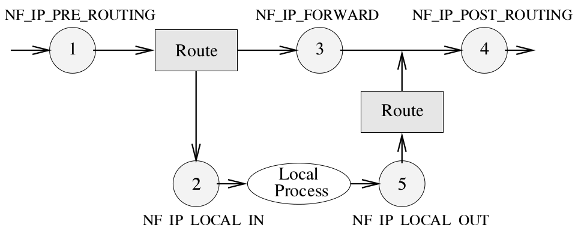
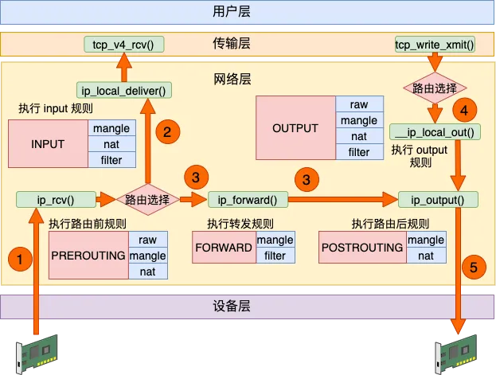
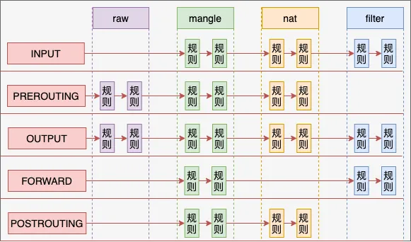

## Hooks与回调函数



* **PREROUTING**
  * 所有的包，如果没有异常，都会命中的 hook
  * 该 hook 在所有有的 IP 头 sanity checks 满足之后
  * 该 hook 在作出路由决定之前
  * **Port Address Translation (NAPT)** 和重定向，也就是 **Destination Network Translation (DNAT)**， 在这个 hook 实现
* **FORWARD**
  * 不会递交给本机的包（例如，经过防火墙的包）会到达这个 hook
* **LOCAL INPUT**
  * 所有到本机的 IP 包会到达这个 hook
  * 这是本机通信的收包路径上的最后一个 hook
* **LOCAL OUTPUT**
  * 发包路径上的第一个 hook
  * 从本机发出的 IP 包总会命中这个 hook
* **POSTROUTING**
  * 该 hook 实现在作出路由决定之后
  * **Source Network Address Translation (SNAT)** 注册到这个 hook
  * 所有从本机离开的 IP 包（包括`FORWARD`的包）都会到达这个 hook

## 注册和调用Hooks



* net/ipv4/ip_input.c
```c
int ip_rcv(struct sk_buff *skb, struct net_device *dev, struct packet_type *pt, struct net_device *orig_dev)
{
  ...
  /*最常用的`PREROUTING` hook 在`ip_rcv()` IPv4 收包处*/
  return NF_HOOK(NFPROTO_IPV4, NF_INET_PRE_ROUTING,
                 net, NULL, skb, dev, NULL,
                 ip_rcv_finish);
  ...
}  
```
* net/netfilter/core.c
```c
static LIST_HEAD(nf_hook_list);
/*netfilter hook 注册的实现*/
static int _nf_register_hook(struct nf_hook_ops *reg)
{
        struct net *net, *last;
        int ret;

        for_each_net(net) {
                ret = nf_register_net_hook(net, reg);
                if (ret && ret != -ENOENT)
                        goto rollback;
        }
        list_add_tail(&reg->list, &nf_hook_list);

        return 0;
rollback:
        last = net;
        for_each_net(net) {
                if (net == last)
                        break;
                nf_unregister_net_hook(net, reg);
        }
        return ret;
}
/*netfilter hook 的注册函数*/
int nf_register_hook(struct nf_hook_ops *reg)
{
        int ret;

        rtnl_lock();
        ret = _nf_register_hook(reg);
        rtnl_unlock();

        return ret;
}
EXPORT_SYMBOL(nf_register_hook);
...
/* Returns 1 if okfn() needs to be executed by the caller,
 * -EPERM for NF_DROP, 0 otherwise.  Caller must hold rcu_read_lock. */
int nf_hook_slow(struct sk_buff *skb, struct nf_hook_state *state,
                 struct nf_hook_entry *entry)
{
        unsigned int verdict;
        int ret;
        /*逐一调用 hook 链表上的各个条目的回调，回调依据 policy 以裁定下一步的动作*/
        do {
                verdict = nf_hook_entry_hookfn(entry, skb, state);
                switch (verdict & NF_VERDICT_MASK) {
                case NF_ACCEPT:
                        entry = rcu_dereference(entry->next);
                        break;
                case NF_DROP:
                        kfree_skb(skb);
                        ret = NF_DROP_GETERR(verdict);
                        if (ret == 0)
                                ret = -EPERM;
                        return ret;
                case NF_QUEUE:
                        ret = nf_queue(skb, state, &entry, verdict);
                        if (ret == 1 && entry)
                                continue;
                        return ret;
                default:
                        /* Implicit handling for NF_STOLEN, as well as any other
                         * non conventional verdicts.
                         */
                        return 0;
                }   
        } while (entry);

        return 1;
}
EXPORT_SYMBOL(nf_hook_slow);
```
* include/linux/netfilter.h
```c
struct nf_hook_state {
        unsigned int hook;
        u_int8_t pf;
        struct net_device *in;
        struct net_device *out;
        struct sock *sk;
        struct net *net;
        int (*okfn)(struct net *, struct sock *, struct sk_buff *);
};

typedef unsigned int nf_hookfn(void *priv,
                               struct sk_buff *skb,
                               const struct nf_hook_state *state);
struct nf_hook_ops {
        struct list_head        list;

        /* User fills in from here down. */
        nf_hookfn               *hook;
        struct net_device       *dev;
        void                    *priv;
        u_int8_t                pf;
        unsigned int            hooknum;
        /* Hooks are ordered in ascending priority. */
        int                     priority;
};

struct nf_hook_entry {
        struct nf_hook_entry __rcu      *next;
        nf_hookfn                       *hook;
        void                            *priv;
        const struct nf_hook_ops        *orig_ops;
};
...
static inline int
nf_hook_entry_hookfn(const struct nf_hook_entry *entry, struct sk_buff *skb,
                     struct nf_hook_state *state)
{
        return entry->hook(entry->priv, skb, state);
}
...
/**
 *      nf_hook - call a netfilter hook
 *
 *      Returns 1 if the hook has allowed the packet to pass.  The function
 *      okfn must be invoked by the caller in this case.  Any other return
 *      value indicates the packet has been consumed by the hook.
 */
static inline int nf_hook(u_int8_t pf, unsigned int hook, struct net *net,
                          struct sock *sk, struct sk_buff *skb,
                          struct net_device *indev, struct net_device *outdev,
                          int (*okfn)(struct net *, struct sock *, struct sk_buff *))
{
        struct nf_hook_entry *hook_head;
        int ret = 1;
        ...
        rcu_read_lock();
        hook_head = rcu_dereference(net->nf.hooks[pf][hook]);/*某一类型 hook 的链表表头*/
        if (hook_head) {
                struct nf_hook_state state;

                nf_hook_state_init(&state, hook, pf, indev, outdev,
                                   sk, net, okfn);
                /*此处是调用某一类型 hook 的入口点*/
                ret = nf_hook_slow(skb, &state, hook_head);
        }
        rcu_read_unlock();

        return ret;
}
...
static inline int
NF_HOOK(uint8_t pf, unsigned int hook, struct net *net, struct sock *sk, struct sk_buff *skb,
        struct net_device *in, struct net_device *out,
        int (*okfn)(struct net *, struct sock *, struct sk_buff *))
{       /*如果 netfilter 的 hook 返回 1，调用 OK 回调函数 - okfn()*/
        int ret = nf_hook(pf, hook, net, sk, skb, in, out, okfn);
        if (ret == 1)
                ret = okfn(net, sk, skb);
        return ret;
}
...```
```

## Hooks的返回值
* **ACCEPT** 让包继续协议栈上的旅行
* **DROP** 悄悄的把包丢弃
* **QUEUE** 把包通过`nf_queue`功能传给用户空间。因此一个用户空间的程序将会为我们处理该包。
* **STOLEN** 为了临时不让一个包继续通过协议栈，悄悄的持有一个包直到某事发生。这通常用于收集 IP 包分片。
* **REPEAT** 强制该包重新进入 hook

## Rules



## References
- [Linux netfilter Hacking HOWTO](http://www.netfilter.org/documentation/HOWTO//netfilter-hacking-HOWTO.txt)
