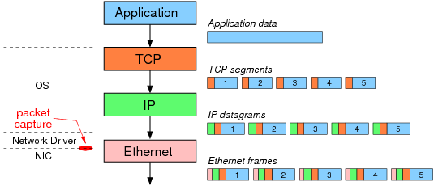
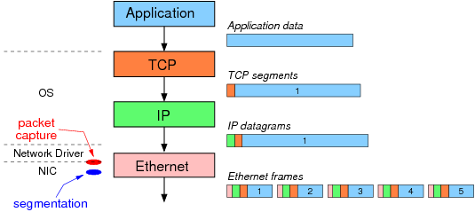

# SCTP

# GSO

## SCTP vs TCP
### TCP是以字节为单位传输的，SCTP是以数据块为单位传输的

TCP接收端确认的是收到的字节数，SCTP接收端确认的是接收到的数据块。SCTP的这种数据块（被称为 **data chunk**）通常会携带应用的一个数据包，或者说是应用要发送的一个消息。

在实际的应用中，TCP发送方的可以将应用程序需要发送的多个消息打包到一个TCP包里面发出去。比如，应用程序连续调用两次send()向对端发送两条消息，TCP协议可能把这两条消息都打包放在同一个TCP包中。接收端在收到这个TCP包时，回给对端的ACK只是表明自己接收到了多少个字节，TCP协议本身并不会把收到的数据重新拆散分成两条应用层消息并通知应用程序去接收。事实上，应用程序可能只需要调用一次 `receive()`，就会把两条消息都收上来，然后应用需要根据应用程序自己定义的格式去拆成两条消息。

与TCP不同，SCTP是将应用程序的每次调用`sendmsg()`发送的数据当作一个整体，放到一个被称为 data chunk 的数据块里面，接收端也是以 data chunk 为单位接收数据，并重新组包，通知应用程序接收。通常，应用程序每次调用`recvmesg()`都会收到一条完整的消息。

在 SCTP 的发送端，多条短的应用层消息可以被 SCTP 协议打包放在同一个 SCTP 包中，此时在 SCTP 包中可以看到多个 data chunk。另一方面，一条太长（比如，超过了路径MTU）的应用层消息也可能被 SCTP 协议拆分成多个片段，分别放在多个 data chunk 并通过不同的 SCTP 包发送给对端。这两种情况下，SCTP 的接收端都能重新组包，并通知应用程序去接收。

### TCP通常是单路径传输，SCTP可以多路径传输
* TCP的两端都只能用一个IP来建立连接，连接建立之后就只能用这一对IP来相互收发消息了。如果这一对IP之间的路径出了问题，那这条TCP连接就不可用了。
* SCTP不一样的地方是，两端都可以绑定到多个IP上，只要有其中一对IP能通，这条SCTP连接就还可以用。
* 体现在 socket API 中，TCP 只能 bind 一个 IP，而 SCTP 可以 bind 到多个IP。

### TCP是单流有序传输，SCTP可以多流独立有序/无序传输
* 一条 SCTP 连接里面，可以区分多条不同的流（stream），不同的流之间的数据传输互不干扰。
  * 这样做理论上的好处是，如果其中某一条流由于丢包阻塞了，那只会影响到这一条流，其他的流并不会被阻塞。
  * 但是实际上，如果某一条流由于丢包阻塞，其他的流通常也会丢包，被阻塞，最后导致所有的流都被阻塞，SCTP连接中断。
* 在同一条 stream 里面，SCTP 支持有序/无序两种传输方式。应用程序在调用`sendmsg()`的时候，需要指定
  * 用哪一条 stream 传输
  * 指定这条要发送的消息是需要有序传输还是无序传输的
* 如果在传输过程中丢包，
  * 有序传递模式可能会在接收端被阻塞
  * 无序传输模式不会在接收端被阻塞

### TCP连接的建立过程需要三步握手，SCTP连接的建立过程需要四步握手

* TCP 连接建立过程，容易受到DoS攻击。在建立连接的时候，client 端需要发送`SYN`给 server 端，server 端需要将这些连接请求缓存下来。通过这种机制，攻击者可以发送大量伪造的`SYN`包到一个 server 端，导致 server 端耗尽内存来缓存这些连接请求，最终无法服务。
* SCTP 的建立过程需要四步握手，
  1. client 端发送连接请求
  2. server 端在收到连接请求时，不会立即分配内存缓存起来，而是返回一个 cookie
  3. client 端需要回送这个 cookie
  4. server 端校验之后，从 cookie 中重新获取有效信息（比如对端地址列表），才会最终建立这条连接。
  这样，可以避免类似 TCP 的 SYN 攻击。
* 应用程序对此感知不到，对应用程序来说，不管是 TCP 还是 SCTP，都只需要在 server 端 listen 一个 socket，client 调用`connect()`去连接到一个 server 端。

###  SCTP有heartbeat机制来管理路径的可用性

* SCTP协议本身有 heartbeat 机制来监控连接/路径的可用性。
* 前面说过，SCTP 两端都可以 bind 多个 IP，因此同一条 SCTP 连接的数据可以采用不同的 IP 来传输。不同的 IP 传输路径对应一条 path，不同的 path 都可以由 heartbeat 或者是数据的传输/确认来监控其状态。
  * 如果 heartbeat 没响应，或者是数据在某条 path 超时没收到确认导致重传，则认为该 path 有一次传输失败。
  * 如果该 path 的连续传输失败次数超过 path 的连续重传次数，则认为该 path 不可用，并通知应用程序。
  * 如果一条连接的连续传输次数超过设定的 **“连接最大重传次数”**，则该连接被认为不可用，该连接会被关闭并通知应用程序。

## 用 GSO 加速 SCTP
尽管缺乏硬件的支持，SCTP 仍然能够用 GSO 给网络栈传递一个大的包，而不是多个小的包。

这需要和其他 offloads 不同的方式，因为 SCTP 包不能只根据 (P)MTU 来分片。当然，chucks 必须包含在 IP 分段中，并且做相应的填充。所以不像常规的 GSO，SCTP 不能只是生成一个大`skb`，设置`gso_size`为分片点并交付给 IP 层。

SCTP 协议层构建一个正确填充的分片的`skb`，并且以链式 skbs 的方式存储，`skb_segment()`以此作为拆分的依据。为了标识，`gso_size`设置为特定的值`GSO_BY_FRAGS`。

Therefore, any code in the core networking stack must be aware of the possibility that gso_size will be GSO_BY_FRAGS and handle that case appropriately.

There are some helpers to make this easier:

* skb_is_gso(skb) && skb_is_gso_sctp(skb) is the best way to see if an skb is an SCTP GSO skb.
* For size checks, the `skb_gso_validate_*_len` family of helpers correctly considers GSO_BY_FRAGS.
* For manipulating packets, skb_increase_gso_size and skb_decrease_gso_size will check for GSO_BY_FRAGS and WARN if asked to manipulate these skbs.

This also affects drivers with the NETIF_F_FRAGLIST & NETIF_F_GSO_SCTP bits set. Note also that NETIF_F_GSO_SCTP is included in NETIF_F_GSO_SOFTWARE.

# References
- [SCTP协议详解](https://www.zybuluo.com/ju1900/note/803645)
- [Stream Control Transmission Protocol - Wikipedia](https://en.wikipedia.org/wiki/Stream_Control_Transmission_Protocol)
- [SCTP报文格式](http://www.023wg.com/message/message/cd_feature_sctp.html)
- [SCTP协议详解 - CSDN](https://blog.csdn.net/wuxing26jiayou/article/details/79743683)
- [Segmentation and Checksum Offloading: Turning Off with ethtool](https://sandilands.info/sgordon/segmentation-offloading-with-wireshark-and-ethtool)
- [Segmentation Offloads](https://01.org/linuxgraphics/gfx-docs/drm/networking/segmentation-offloads.html#)
