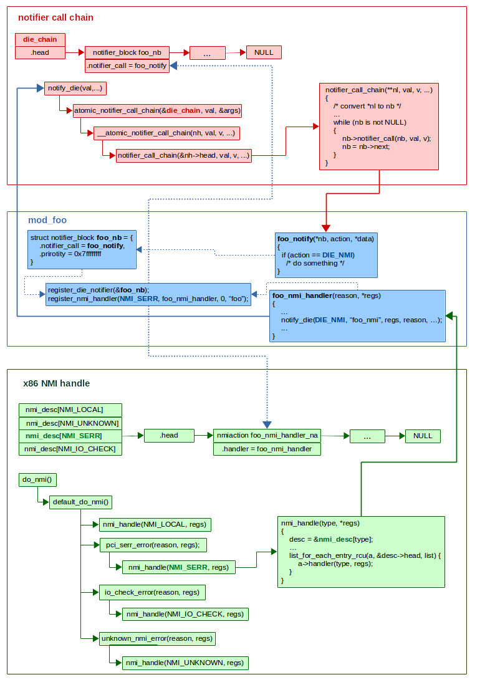

# NMI - x86

## 6.3 中断的来源
* 处理器从两个来源接收中断
  * 外部（硬件生成的）中断
  * 软件生成的中断

### 6.3.1 外部中断
* 通过 **处理器上的引脚** 或通过 **local APIC** 接收外部中断
* Pentium 4、Intel Xeon、P6 系列和 Pentium 处理器上的主要中断引脚是 `LINT[1:0]` 引脚，它们连接到 local APIC
  * 当启用 local APIC 时，可以通过 APIC 的 **本地向量表（LVT）** 对 `LINT[1:0]` 引脚进行编程，使其与任何处理器的异常或中断向量相关联
* 当 local APIC 全局/硬件禁用时，这些引脚分别配置为 `INTR` 和 `NMI` 引脚
  * Assert `INTR` 引脚会向处理器发出外部中断已发生的信号
  * 处理器从系统总线读取由外部中断控制器提供的中断向量编号，例如 8259A（请参阅第 6.2 节“异常和中断向量”）
  * Assert `NMI` 引脚会发出不可屏蔽中断（NMI）信号，该中断被分配给中断向量 `2`

## 6.4 异常的来源
* 处理器从三个来源接收异常：
  * 处理器检测到的程序错误异常
  * 软件生成的异常
  * Machine-check 异常

### 6.5 异常的分类
* 异常被分类为 **faults**、**traps** 或 **aborts**，具体取决于异常的报告方式以及导致异常的指令是否可以在不丢失程序或任务连续性的情况下重新启动。
* **Faults**
  * Fault 是一种通常可以纠正的异常，并且一旦纠正，就可以重新启动程序而不会失去连续性。
  * 当报告 fault 时，处理器将机器状态恢复到开始执行 faulting 指令之前的状态。
  * Fault 处理程序的返回地址（`CS` 和 `EIP` 寄存器的保存内容）指向 faulting 指令，而不是指向 faulting 指令之后的指令。
* **Traps**
  * Trap 是在执行 trapping 指令后立即报告的异常。
  * Traps 允许继续执行程序或任务，而不会丢失程序的连续性。
  * Trap 处理程序的返回地址指向 trapping 指令之后要执行的指令。
* **Aborts**
  * Abort 是一种异常，它并不总是报告导致异常的指令的精确位置，并且不允许重新启动导致异常的程序或任务。
  * Aborts 用于报告严重错误，例如硬件错误以及系统表中的不一致或非法值。
* **注意**
  * 通常报告为 fault 的一个异常子集是不可重新启动的。此类异常会导致某些处理器状态丢失。
  * 例如，执行栈帧越过栈段末尾的 `POPAD` 指令会导致报告 fault。在这种情况下，异常处理程序发现指令指针（`CS:EIP`）已恢复，就好像 `POPAD` 指令尚未执行一样。然而，内部处理器状态（通用寄存器）将被修改。此类情况被视为编程错误。引起此类异常的应用程序应由操作系统终止。

## 6.7 不可屏蔽中断 (NMI)
* 可以通过以下两种方式之一生成不可屏蔽中断 (NMI)：
  * 外部硬件 assert NMI 引脚
  * 处理器在系统总线（Pentium 4、Intel Core Duo、Intel Core 2、Intel Atom 和 Intel Xeon 处理器）或 APIC 串行总线（P6 系列和 Pentium 处理器）上收到 delivery mode 为 NMI 的消息
* 当处理器从这些来源中的任何一个接收到 NMI 时，处理器会立即通过调用编号为 `2` 的中断向量指向的 NMI 处理程序来处理它
* 处理器还会调用某些硬件条件以确保不会接收到其他中断，包括 NMI 中断，直到 NMI 处理程序完成执行（请参阅“处理多个 NMI”）
* 此外，当从上述任一来源接收到 NMI 时，它不能被 `RFLAGS` 寄存器中的 `IF` 标志屏蔽
* 可以向向量 `2` 发出可屏蔽硬件中断（通过 `INTR` 引脚）以调用 NMI 中断处理程序；然而，这个中断并不是真正的 NMI 中断。激活处理器的 NMI 处理硬件的真正 NMI 中断只能通过上面列出的机制之一来传递

### 6.7.1 处理多个 NMI
* 当 NMI 中断处理程序正在执行时，处理器会阻止后续 NMI 的传送，直到下一次执行 `IRET` 指令为止
  * NMI 的这种屏蔽阻止了 NMI 处理程序的嵌套执行
* 建议通过中断门访问 NMI 中断处理程序以禁用可屏蔽硬件中断（请参阅“Masking Maskable Hardware Interrupts”）
* 执行 `IRET` 指令会取消对 NMI 的屏蔽，即使该指令会导致错误
  * 例如，如果 `IRET` 指令在 `EFLAGS.VM = 1` 且 `IOPL` 小于 `3` 的情况下执行，则会生成 general-protection 异常。在这种情况下，NMI 在异常处理程序被调用之前被取消屏蔽

## 6.8 启用和禁用中断
* 处理器会根据处理器的状态以及 `EFLAGS` 寄存器中的 `IF` 和 `RF` 标志的状态来禁止某些中断的生成，如以下各节所述。

### 6.8.1 屏蔽可屏蔽的硬件中断
* `IF` 标志可以禁用处理器 `INTR` 引脚上或通过 local APIC 接收到的可屏蔽硬件中断的服务（请参见第 6.3.2 节 “可屏蔽硬件中断”）。
  * 当 `IF` 标志清零时，处理器禁止递交到 `INTR` 引脚或通过 local APIC 生成内部中断请求的中断；
  * 当 `IF` 标志置位时，递交到 `INTR` 或通过 local APIC 引脚传送的中断将作为正常外部中断进行处理。
* `IF` 标志不会影响传送到 NMI 引脚的不可屏蔽中断（NMI）或通过 local APIC 递交的 delivery mode 的 NMI 消息，也不会影响处理器生成的异常。
  * 与 `EFLAGS` 寄存器中的其他标志一样，处理器会清除 `IF` 标志以响应硬件复位。
* 可屏蔽硬件中断组包括保留中断和异常向量 `0` 到 `32`，这一事实可能会导致混乱。
  * 从架构上来说，当 `IF` 标志被设置时，从 `0` 到 `32` 的任何向量的中断都可以通过 `INTR` 引脚传递到处理器，并且从 `16` 到 `32` 的任何向量可以通过 local APIC 递交。然后处理器将生成一个中断并调用向量号指向的中断或异常处理程序。
  * 例如，可以通过 `INTR` 引脚（通过向量 `14`）调用缺页处理程序；然而，这并不是真正的缺页异常。这是一个中断。
  * 与 `INT n` 指令一样（请参见第 6.4.2 节“软件生成的异常”），当通过 `INTR` 引脚生成异常向量中断时，处理器不会将错误代码推送到栈上，因此异常处理程序可能无法正常运行。
* `IF` 标志可以分别使用 `STI`（设置中断使能标志）和 `CLI`（清除中断使能标志）指令来设置或清除。
  * 仅当 `CPL` 等于或小于 `IOPL` 时，才可以执行这些指令。如果在 `CPL` 大于 `IOPL` 时执行它们，则会生成一般 general-protection exception（`#GP`）。
* 如果 `IF = 0`，则在执行 `STI` 后，可屏蔽硬件中断在指令边界上保持禁止状态。
  * 不可屏蔽中断和系统管理中断（SMI）也可以在执行 `STI` 之后的指令边界上被禁止。
* 禁止在以下时间结束：递交另一个事件（例如异常）或执行下一条指令。