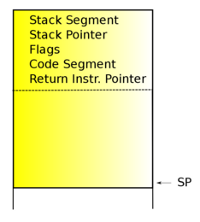
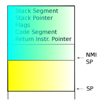
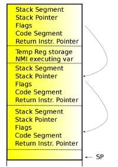
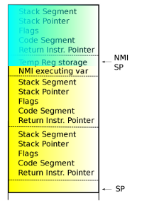
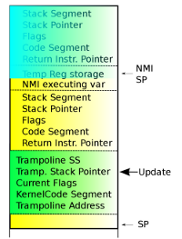
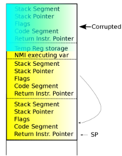

# [翻译] x86 NMI 的 iret 问题
中断是不可预测的并发性的根源，可能会给内核开发人员带来无穷无尽的麻烦。不过，即使是大多数内核黑客也不需要处理不可屏蔽中断（NMI），这本身就带来了一些额外的挑战。 x86 处理器中 NMI 实现的一些缺点长期以来一直限制着 NMI 处理程序的功能。最近，这些限制已被取消（lifted）。本文描述了 NMI 带来的困难，介绍了相关限制为何会造成阻碍，并详细讨论了解决方案。

## 正常中断
计算机的 CPU 是一种复杂的图灵兼容机器，它似乎按照指令在内存中的排列顺序来处理指令。硬件可以优化读取指令的实际顺序，但实际上，CPU 的行为就好像它正在按照程序员放置指令的方式读取指令（从当前处理器的角度来看）。当外部设备上发生事件时，例如 USB 驱动器、网卡或计时器，它需要通知 CPU 必须停止当前的指令序列并跳转到另一组指令来处理新事件。 这个新的指令序列称为 *处理程序*，设备使用中断来通知 CPU。

如果 CPU 当前正在处理的指令使用的数据在中断到来时也被中断处理程序使用，则中断处理程序可能会污染 CPU 正在修改的数据。为了防止这种情况发生，程序员在使用易受攻击的数据的关键路径期间禁用中断。通过正常中断，程序员可以使用禁用中断的功能将 CPU 正常工作流程中的指令处理与中断处理程序中的指令同步。

## 不可屏蔽中断
即使 CPU 禁用了中断，也可以触发一些特殊中断。这些不可屏蔽中断由 profiling 和看门狗等工具使用。对于 profiling，记录有关 CPU 将时间花在哪里的信息，并且通过忽略禁用的中断，profiler 可以记录禁用中断所花费的时间。如果 profiling 使用正常中断，则无法报告该时间。同样，看门狗需要检测内核是否卡在禁用中断的位置。同样，如果看门狗使用正常中断，则在这种情况下它不会有用，因为当中断被禁用时它永远不会触发。

正如你可以想象的那样，可以随时触发的代码是有的，这些代码需要在编写时进行特殊考虑。一方面，它不能获取在其他任何地方使用的任何锁（尽管它可以获取仅在 NMI 上下文中使用的锁来跨 CPU 同步 NMI，但如果可能的话应该避免这种情况）。理想情况下，NMI 处理程序应尽可能简单，以防止由不希望重入的代码引起的竞争条件。

虽然 NMI 可以在中断被禁用时触发，甚至在 CPU 正在处理正常中断时触发，但 NMI 在一个特殊的时候不会触发：当 CPU 正在处理另一个 NMI 时。在大多数架构上，CPU 在第一个 NMI 完成之前不会处理第二个 NMI。当 NMI 触发并调用 NMI 处理程序时，新的 NMI 必须等待，直到第一个 NMI 的处理程序完成。NMI 处理程序不需要担心嵌套，Linux NMI 处理程序在编写时就考虑到了这一事实。

## x86 NMI `iret` 流程
在 x86 上，与其他架构一样，CPU 在第一个 NMI 完成之前不会执行另一个 NMI。x86 架构的 NMI 问题是，当执行 `iret` 指令时，一次 NMI 被认为是完成了。`iret` 是 x86 指令，用于从中断或异常返回。当中断或异常触发时，硬件将自动将信息加载到栈上，这将允许处理程序返回到中断时的状态。`iret` 指令将使用栈上的信息来重置状态。


**First NMI on x86_64**

x86 上的缺陷是，如果在 NMI 处理程序期间发生异常，NMI 将被视为完成，因为异常将以一个 `iret` 返回。如果 NMI 处理程序触发 *缺页* 或 *断点*，则用于从这些异常返回的 `iret` 将重新使能 NMI。NMI 处理程序不会返回到异常触发时的状态，而是返回到一个允许新 NMI 抢占正在运行的 NMI 处理程序的状态。如果另一个 NMI 进来，它将跳转到不是为可重入而设计的代码中。更糟糕的是，在 x86_64 上，当 NMI 触发时，栈指针被设置为一个（per CPU 的）固定地址。如果在第一个 NMI 处理程序完成之前另一个 NMI 进入，则新的 NMI 的所有写入将在被抢占的 NMI 栈上。结果是返回原始 NMI 处理程序时发生非常严重的崩溃。i386 的 NMI 处理程序使用当前的内核栈，就像普通中断一样，并且不存在这个特定问题。


**Nested NMI on x86_64**

可以看到这一点的常见示例是将 task 的 stack dump 添加到 NMI 处理程序中。为了调试 lockups，内核开发人员可以将 `show_state()`（像 `sysrq-t` 一样显示所有 tasks 的状态）放入 NMI 看门狗处理程序中。当看门狗检测到系统被锁定时，`show_state()` 会触发，显示所有 tasks 的 stack trace。所有 tasks 的 stack 读取都要小心完成，因为栈帧可能指向错误的内存区域，这将触发一次缺页。

内核预计这里可能会发生故障并进行适当的处理。但缺页处理程序仍然执行 `iret` 指令。这将重新使能 NMI。所有任务的打印输出可能需要一些时间，尤其是通过串口输出时。这使得在输出完成之前很有可能触发另一个 NMI，从而导致系统崩溃。留给可怜的开发人员的将是一部分 dump，并且没有所有 tasks 的回溯。很有可能导致问题的 task 不会显示，开发人员将不得不想出另一种方法来调试问题。

由于这个 x86 NMI `iret` 缺陷，NMI 处理程序既不能触发缺页，也不能命中断点。听起来缺页不应该成为问题，但此限制会阻止 NMI 处理程序使用 `vmalloc()` 分配的内存。内核中的 `vmalloc()` 代码将虚拟内存映射到内核地址空间中。问题是内存在第一次使用时才被映射到 task 的页表中。如果 NMI 处理程序使用内存，并且恰好是当前 task（NMI 发生时执行的任务）第一次引用内存，则会触发缺页。

`vmalloc()` 缺页不需要获取锁，因为它所做的只是填充 task 的页表，因此在 NMI 处理程序中使用 `vmalloc()` 内存应该没有问题。但由于缺页导致的 `iret` 会再次启用 NMI，因此必须避免在 NMI 中使用 `vmalloc()` 内存，以防止上述竞争。内核模块使用 `vmalloc()` 加载，加载模块的文本部分位于虚拟内存中，在使用时出现缺页。如果模块要注册 NMI 处理程序回调，则该回调可能会导致 NMI 变得可重入。

> 译注：因为此时回调函数所在的文本段还未完全从磁盘加载到内存。

由于断点也以 `iret` 返回，因此也不能将它们放置在 NMI 处理程序中。这可以防止 kprobe 被放置在 NMI 处理程序中。ftrace、perf 和其他几个跟踪工具使用 Kprobes 将动态跟踪点插入内核。但是，如果将 kprobe 添加到 NMI 处理程序调用的函数中，则由于断点处理程序调用的 `iret`，它可能会变得可重入。

## 我们为什么关心？

多年来，NMI 不允许出现缺页或命中断点；为什么我们今天需要它们？2010 年 7 月，Linux 内核上出现了这个问题，当时 Mathieu Desnoyers 提出解决在 NMI 中使用 `vmalloc()` 内存的问题。Desnoyers 的[解决方案](https://lkml.org/lkml/2010/7/14/204)是让缺页处理程序能够感知 NMI。从缺页返回时，处理程序将检查它是否在 NMI 上下文中触发，如果是，则不执行 `iret`，而是使用普通的 `ret` 指令。`ret` 指令是用于从函数返回的 x86 汇编命令。与 `iret` 不同，`ret` 仅将其必须跳到的返回地址从栈上弹出，并不将系统恢复到原始状态。在 Desnoyers 的解决方案中，状态将通过添加的指令直接恢复，以便从缺页返回到 NMI 处理程序，而不需要 `iret`。

Linus Torvalds 对这个解决方案并不满意。NMI 由于可以发生在任何地方，因此需要与内核其他区域不同的特殊处理。Torvalds 不希望这种处理[蔓延到内核的其他区域](https://lkml.org/lkml/2010/7/18/103)，例如缺页处理程序。他更喜欢即便让 NMI 代码更加复杂，但至少只将其包含在 NMI 处理程序中。无论如何，NMI 是一种特殊情况，不用于内核的正常操作，而缺页是内核中的关键热路径，不应该被不重要的 NMI 处理所阻碍（原文：encumbered）。

直接的解决方案是更改 perf，使其不必在其 NMI 处理程序中使用 `vmalloc()` 内存。当然，Desnoyers 的目标不仅仅是修复 perf，而是让 LTTng 能够在 NMI 处理程序中使用 `vmalloc()` 内存。但在 NMI 处理程序中处理缺页并不是解决 x86 NMI `iret` 问题的唯一原因。还有充分的理由允许 NMI 处理程序使用断点。

## 移除 stop machine
内核中有一些地方需要使用 `stop_machine()`，这是内核可以对系统执行的最具侵入性的操作之一。简而言之，调用 `stop_machine()` 会停止所有其他 CPU 上的执行，以便调用 CPU 具有对整个系统的独占访问权限。对于具有数千个 CPU 的机器，对 `stop_machine()` 的单次调用可能会导致非常大的延迟。目前使用 `stop_machine()` 的领域之一是代码的运行时修改。

Linux 内核有使用自修改代码的历史。也就是说，代码在运行时会自行更改。例如，发行版不喜欢发布多个内核，因此使用自修改代码在启动时更改内核以针对其环境进行优化。在过去，发行版会为单处理器机器提供一个单独的内核，为多处理器机器提供另一个内核。对于类虚拟内核（只能作为 guest 运行）和在真实硬件上运行的内核也是如此。因为支持多内核的维护工作相当高，所以在启动时修改内核的工作已经完成，如果发现它运行在单处理器机器上则进行更改（自旋锁和其他多处理器同步更改为 `nops`）。如果内核作为类虚拟化环境的虚拟 guest 加载，它将转换内核低级指令以使用 hypercalls。

在启动时修改代码并不那么困难。这些修改是在其他处理器初始化之前以及其他服务启动之前尽早执行的。在启动过程的这个阶段，系统就像一个单处理器系统。更改指令文本很简单，因为无需担心需要刷新其他处理器的缓存。

如今，Linux 内核中有几个实用程序可以在启动后修改代码。这些修改可能随时发生，通常是由于系统管理员的操作所致。ftrace 函数跟踪器可以将几乎每个函数开头的 `nops` 更改为跟踪这些函数的调用。iptables 使用的 Netfilter 用 [跳转标签](https://lwn.net/Articles/484527/) 来启用和禁用网络数据包的过滤。perf 和 ftrace 使用的跟踪点还使用跳转标签，以在未启用跟踪点时将其影响降至最低。Kprobes 使用断点将动态跟踪点放入代码中，但在可能的情况下，它会将代码修改为直接跳转以优化探测。

在运行时修改代码比在启动期间修改代码要小心得多。在 x86 和其他一些架构上，如果在一个 CPU 上修改代码，同时在另一个 CPU 上执行该代码，则可能会在执行修改代码的 CPU 上生成 General Protection Fault（GPF）。这通常会导致系统崩溃。解决这个问题的方法是调用 `stop_machine()` 让所有 CPU 停止它们正在做的事情，以便让单个 CPU 像单处理器一样修改代码。处理已停止的 CPU 上发生的 NMI 会稍微复杂一些，但这超出了本文的范围。

能够在不使用 `stop_machine()` 的情况下修改代码是一个非常理想的结果。恰好有一种方法可以进行修改，而不需要系统的其余部分停止正在执行的操作并等待修改完成。该解决方案需要使用断点。

它的工作方式是在要更改的位置插入断点。x86 上的断点（`int3`）只有一个字节。而被修改的指令通常为 5 个字节，因为它是跳转到某个位置或 5 个字节的 `nop`。断点是一个字节，可以被替换为指令的第一个字节，而不会干扰其他 CPU。断点插入在指令的第一个字节上，如果另一个 CPU 命中该指令，它将触发断点，断点处理程序将简单地返回到下一条指令，跳过正在更改的指令。

#### Ftrace nop
```c
     55                      push   %rbp
     48 89 e5                mov    %rsp,%rbp
     0f 1f 44 00 00          nop (5 bytes)
     65 48 8b 04 25 80 c8    mov    %gs:0xc880,%rax
```

#### 添加断点
```c
     55                      push   %rbp
     48 89 e5                mov    %rsp,%rbp
     cc 1f 44 00 00          <brk> nop
     65 48 8b 04 25 80 c8    mov    %gs:0xc880,%rax
```

> 译注：`int3` 指令的字节码就是 `cc`。上面 5 个字节的 `nop` 指令在插入断点后第一个字节被从 `0f` 替换成了 `cc`。

插入断点后，需要同步所有 CPU，以确保可以跨 CPU 看到断点。为了同步 CPU，发送一个处理程序是空函数的处理器间中断（IPI）到所有其他 CPU。CPU 上的中断将刷新指令流水线。当另一个 CPU 读取断点时，它将跳转到断点的处理程序，而不处理即将更新的指令的其他 4 个字节。处理程序将设置指令指针（`%RIP`）以返回到被修改后的指令。这使得其余指令的修改不被其他 CPU 看到。

当所有其他 CPU 的流水线被发送给它们的 IPI 刷新后，指令的其余部分（4 个字节）可能会被修改：

#### 替换指令的结尾
```c
     55                      push   %rbp
     48 89 e5                mov    %rsp,%rbp
     cc af 71 00 00          <brk> <mcount>
     65 48 8b 04 25 80 c8    mov    %gs:0xc880,%rax
```

另一次同步是跨 CPU 调用的。然后断点被删除并替换为新指令的第一个字节：

#### 用新指令移除断点
```c
     55                      push   %rbp
     48 89 e5                mov    %rsp,%rbp
     e8 af 71 00 00          callq   <mcount>
     65 48 8b 04 25 80 c8    mov    %gs:0xc880,%rax
```

这么做是可行的，因为在代码中添加和删除断点不会导致其他 CPU 上出现 GPF。每个步骤之间都需要同步，因为其他 CPU 仍必须对指令的其余部分具有一致的视图。由于跟踪点和函数跟踪会更改 NMI 处理程序中的代码，因此处理程序中必须允许断点。

## 处理 x86 NMI `iret` 的缺陷
Torvalds 不是仅仅拒绝了 Desnoyers 的提议且让我们没有解决方案而已。相反，他[自己想出了一个解决方案](https://lkml.org/lkml/2010/7/14/264)。Torvalds 的解决方案是创建一个指向要使用的 NMI 栈帧的 per-CPU 指针。当 NMI 进来时，它会检查 per-CPU 的 NMI 栈帧指针。如果为 `NULL`，则 NMI 不嵌套；它将更新指针以保存其返回栈帧，并继续运行 NMI 处理程序。NMI 的这一部分永远不会有嵌套的危险，因为这里不会发生断点或缺页。相反，如果栈帧指针已设置，则新 NMI 是嵌套 NMI。也就是说，先前的 NMI（译注：曾经）触发了一次异常，该异常返回时带有 `iret`，（译注：导致）允许另一个 NMI 嵌套。然后，嵌套的 NMI 将更新 per-CPU NMI 帧指针里的数据，以便被中断的 NMI 在返回时出现故障。

然后，嵌套的 NMI 将返回到先前的 NMI，而不执行 `iret` 并将 CPU 保持在 NMI 上下文中（例如，防止新的 NMI）。当第一个 NMI 返回时，会触发故障。在硬件中，如果在 CPU 处理先前的 NMI 处理程序时（发出 `iret` 之前）触发 NMI，则 NMI 将触发锁存器，该锁存器将在发出 `iret` 时释放。这将导致 CPU 再次运行 NMI 处理程序。在 Torvalds 的解决方案中，来自 `iret` 的故障将像软件锁存器一样起作用，并且故障处理程序将重新运行 NMI 处理程序。`iret` 的原子性质也会阻止从第一个 NMI 返回的竞争。

在付诸实现之前，Torvalds 的解决方案似乎是完美的解决方法。Torvalds 建议让嵌套 NMI 处理程序引起被抢占的 NMI 处理程序在发出 `iret` 时产生故障，然后让 `iret` 的故障处理程序重复 NMI，因为只有发生嵌套 NMI 时它才会发生故障。不幸的是，这种情况并非如此。

所有异常（包括 NMI）的 `iret` 都已经有一个错误处理程序。用户空间应用程序可以将其栈指针设置为任意值。只要应用程序不引用栈指针，它就能正常运行。但是，如果出现中断或 NMI，当它通过 `iret` 重置栈指针时，`iret` 可能会出现故障，因为用户空间应用程序曾设置了一个坏掉的栈指针。因此，`iret` 已经有一个故障处理程序来处理这种情况，并且从 `iret` 进入故障处理程序不仅是由嵌套 NMI 引起的，而且对于其他情况也是如此。确定实际发生的情况并不是一项简单的任务。

另一个问题是它需要访问 per-CPU 的数据。由于 Linux 在 x86 上实现 per-CPU 数据的方式，这对于 NMI 处理程序来说有点棘手。该数据由 `%gs` 寄存器引用。由于 NMI 可以在任何地方触发，因此需要做一些工作来验证 `%gs` 寄存器。仅仅为了知道 NMI 是否嵌套就会浪费太多精力。

因此，在提出问题的解决方案时，最好不要采取错误的方法。相反，NMI 处理程序可以使用其他技巧。由于 NMI 栈是 per-CPU 的，Peter Zijlstra 建议使用栈的一部分来保存变量，这实际上使该变量成为穷人的 per-CPU 变量。当第一个 NMI 进入时，它会将其中断栈帧（返回到被中断时的状态所需的信息）复制到其栈上。不只是一次，而是会复印两份！然后它将在栈上设置特殊变量。当 NMI 处理其处理程序时，将设置此变量。**返回时，它将清除变量** 并调用 `iret` 返回到它中断时的状态。



现在，如果 NMI 触发缺页或遇到断点，则异常的 `iret` 会重新启用 NMI。如果此后有另一个 NMI 进来，它会首先检查栈上的特殊变量。如果设置了该变量，那么这肯定是一个嵌套 NMI 处理程序，并且会跳转到代码以处理嵌套 NMI。精明的读者会意识到这还不够。如果嵌套 NMI 在第一个 NMI 清除变量之后但在它随 `iret` 返回之前触发，会发生什么情况？

如果嵌套 NMI 继续下去，就好像它没有嵌套一样，它仍然会损坏第一个 NMI 的栈，并且第一个 NMI `iret` 会错误地读取嵌套 NMI 的栈帧。（译注：因此 NMI 处理程序发现）如果未设置该变量，则检查（译注：由硬件压入）*栈上保存的栈指针*。如果该栈指针位于当前栈（per-CPU NMI 栈）内，则可以将其视为嵌套 NMI。请注意，仅检查栈可能还不够，因为在某些情况下，NMI 处理程序可能会更改其栈指针。（译注：所以）在确定这是一个嵌套 NMI 之前，*检查特殊的栈变量* 和 *被中断的栈的位置* 都需要检查。

## 处理嵌套的 NMI



OK，这样就确定进来的 NMI 是嵌套的，那现在怎么办？为了模拟硬件的行为，必须以某种方式通知第一个 NMI 它必须重复 NMI 处理程序。为了以原子方式执行此操作，第一个 NMI 的返回栈将更新为指向一个 trampoline。这与 Torvalds 的提议类似，只是不使用错误 `iret` 的异常处理（译注：来重复 NMI 处理程序），而是更新栈上的信息，以便 `iret` 简单地跳转到代码来处理嵌套的 NMI。



请注意，如果前一个 NMI 在此 trampoline 区域中执行，则嵌套 NMI 必须不要更新前一个 NMI。指令指针（译注：`%RIP`）由嵌套的 NMI 检查，如果确定它在 trampoline 上的时候抢占了先前的 NMI，则它只是返回而不执行任何操作。无论如何，之前的 NMI 将触发另一个 NMI 处理程序。这仍然与硬件的做法类似，就好像当 CPU 处理一个 NMI 时触发多个 NMI 一样，只会重复一个 NMI。如果第一个 NMI 之前被嵌套的 NMI 中断过，则第一个 NMI 只能位于 trampoline 上，因此第一个 NMI 位于 trampoline 上时发生的第二个 NMI 可能会被丢弃，就像硬件处理前一个 NMI 时，又触发了两个 NMI ，硬件对第二个 NMI 所做的那样。

请记住，初始 NMI 保存了其栈帧两次，这意味着它具有中断栈帧的三个副本。第一帧由硬件在进入 NMI 时写入。但是如果有嵌套的 NMI，这个帧将被嵌套的 NMI 覆盖。（译注：第三帧）一份副本用于从 NMI 处理程序返回。但是，如果存在嵌套的 NMI，它将更新该副本，使其不返回到触发的位置，而是返回到设置 NMI 重复的 trampoline。在这种情况下，我们需要将中断栈帧的第三个副本（译注：第二帧）复制回一个位置，NMI 将用它来返回到第一个 NMI 的触发的位置（译注：即被第一个 NMI 中断的位置）。



Trampoline 将再次在栈上设置特殊变量，以通知新进入的 NMI 正在进行一个 NMI 的处理，然后跳回再次启动下一个 NMI。这次 NMI 仍然启用，因为嵌套 NMI 仍然使用 `iret`，并且不使用 `ret` 技巧将 CPU 保持在 NMI 上下文中。不这样做的原因是因为它会使代码变得更加复杂。既然有一种安全的方法来处理嵌套 NMI，那么在先前的 NMI 被触发后就没有理由阻止新的 NMI 了。未来的代码可能会更改一些内容，以在从嵌套 NMI 返回第一个 NMI 时保留 NMI 上下文。

> 译注：总结一下这个过程。
> 1. NMI 处理程序需要检查栈上的特殊变量
>    1.1. 如果不为 `0`，说明这是嵌套 NMI
>    1.2. 如果为 `0`，继续检查硬件压入的 `%RSP` 是否在 NMI 栈区？
>         1.2.1. 如果在，说明这是嵌套 NMI
>         1.2.2. 如果不在，说明这是正常 NMI，将 CPU 压的栈复制三份，如果没有嵌套 NMI 的发生，将来会利用第三个栈的信息返回，此外还需设置栈上的特殊变量
> 2. 对于确定自己是嵌套 NMI，还需判断 `%RIP` 在不在 trampoline？
>    2.1. 如果在，说明这是第三个 NMI，无任何操作返回，丢弃
>    2.2. 如果不在，说明这还是第二个 NMI，即嵌套 NMI，需要做以下事情
> 3. 对于嵌套 NMI 需要更新第三帧为 trampoline 栈，其中 `%RIP` 需为 trampoline 代码的起始地址
>    3.1. 嵌套 NMI 利用被硬件覆盖的第一帧的信息，`iret` 返回被打断的 NMI 的现场，即第一个 NMI 的现场
> 4. 被打断的 NMI，即第一个 NMI 得以继续执行，由于第三帧已被修改为 trampoline 的栈，所以它 `iret` 返回的时候其实是返回到了 trampoline
> 5. Trampoline 需要做以下操作：
>    5.1. 将第二帧覆盖回第一帧
>    5.2. 设置栈上的特殊变量
>    5.3. 跳到 NMI 的入口重复 NMI（其实是做第二个 NMI 本该做的事情）
> 6. 重复 NMI 如果能顺利执行，将通过还原后的第一帧的内容回到被第一个 NMI 打断时的现场；如果再被其他 NMI 打断，将重复以上步骤

上面的疯狂是 [x86_64 的解决方案](http://git.kernel.org/?p=linux/kernel/git/torvalds/linux-2.6.git;a=commitdiff;h=3f3c8b8c4b2a34776c3470142a7c8baafcda6eb0)。i386（x86_32）怎么样？嗯，由于 i386 没有针对 NMI 的单独的 per-CPU 栈，并且仅使用被它中断的当前内核栈，因此解决[方案](http://git.kernel.org/?p=linux/kernel/git/torvalds/linux-2.6.git;a=commitdiff;h=ccd49c2391773ffbf52bb80d75c4a92b16972517)非常简单，甚至更好的是，它是在 C 代码中处理的。在进入 NMI C 处理程序（从汇编调用）时，将针对 per_cpu 变量进行检查以查看它是否嵌套。如果是，则将该变量切换为 `NMI_LATCHED` 并返回，否则将其设置为 `NMI_EXECUTING`。NMI 退出时，使用 `cmpxchg()` 以原子方式将 per-CPU 变量从 `NMI_EXECUTING` 更新为 `NMI_NOT_RUNNING`。如果更新失败，则意味着出现了嵌套 NMI，并且需要重复 C 处理程序。

## 结论

NMI 处理一直是内核开发的祸根。它们是一种异常现象，导致许多优秀的开发人员彻夜难眠。 Linus Torvalds 是正确的，最好是控制住这头野兽。这段代码听起来像是一个可怕的 hack，但因为它与 NMI 源9代码紧密包含在一起，所以它实际上是一个优雅的解决方案。如果整个内核的关键代码需要容纳 NMI，那么内核很快就会成为无法维护的灾难。将 NMI 代码保存在一个位置还可以让我们知道问题出在哪里（如果出现问题）。所有这些工作都是非常值得的，因为它为消除内核源代码的另一个祸根：`stop_machine()` 打开了大门。

## References
- [The x86 NMI iret problem - LWN.net](https://lwn.net/Articles/484932/)