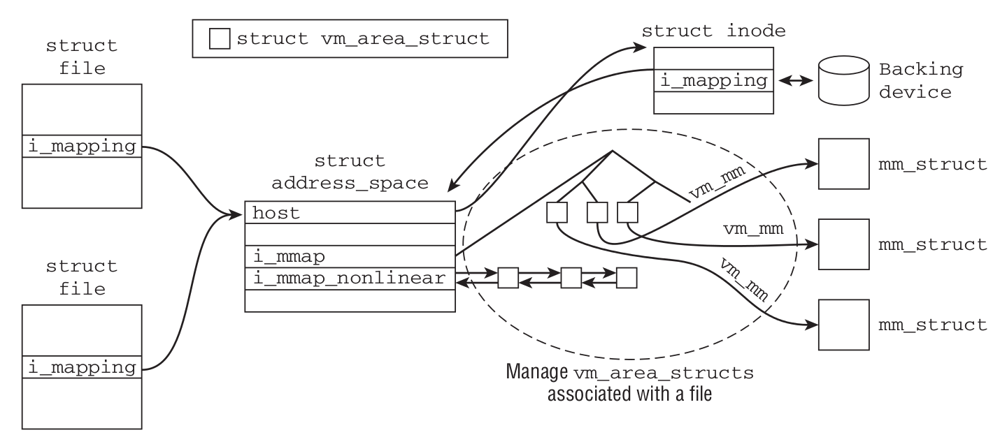
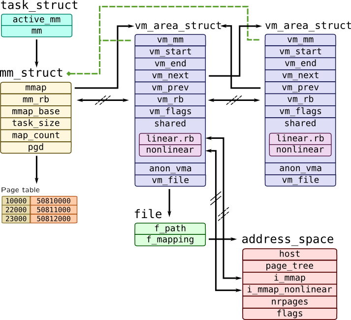
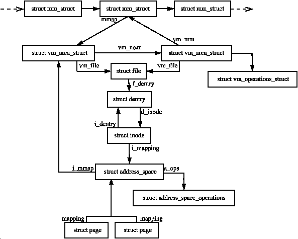
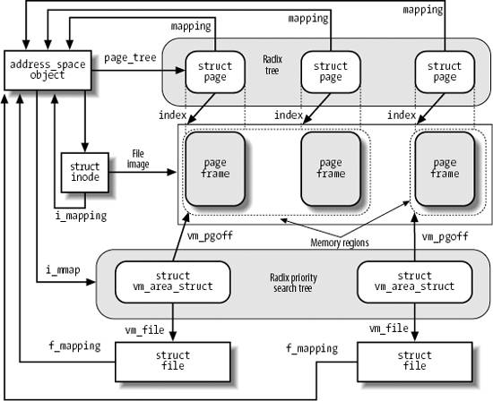

# 页缓存和页回写

* **页缓存（page cache）** Linux内核实现磁盘缓存，主要用来 **减少磁盘I/O操作**。
  * 把磁盘中的数据缓存到物理内存中，把对磁盘的访问变为对物理内存的访问。
  * 从层次结构上来看，page cache还在BIO之上。
  * page cache是在RAM中的page的缓存，来自对常规文件系统文件、块设备文件和内存映射文件的读写。
* **页回写（page writeback)** 将page cache中变更的数据刷新回磁盘的操作。

## 缓存的手段

* Page cache由 **内存中的物理页面组成**，其内容对应磁盘上的物理块。
* **后备存储（backing store）**： 正被缓存的存储设备（如磁盘？）。
* **缓存命中（cache hit）**：当内核开始一个读操作，会首先检查需要的数据是否在page cache中，如果在，则放弃访问磁盘，而直接从内存中读取的行为。
* **缓存未命中（cache miss）**：需要的数据未在page cache中。
  * 如果缓存未命中，那么内核必须调度block I/O （BIO）操作从磁盘中读取数据。
  * 读来的数据放入page cache中，则任何后续相同的读操作都可以命中缓存了。
* 注意：系统并不一定要将整个文件都缓存。
  * 可以是文件的全部内容，或者一页或几页。
  * 缓存谁取决于谁被访问到。

## 写缓存及其策略

* **不缓存（nowrite）** cache不缓存任何写操作，当对一个缓存中的数据片写时，直接跳过缓存，写到磁盘，同时也使缓存中的数据失效。
  * 很少使用，需要额外开销去使缓存数据失效。
* **写透缓存（write-through cache）** 写操作自动更新cache，同时也更新磁盘文件。
  * 对保持缓存一致性（cache coherent）很有好处——缓存数据时刻与后备存储保持同步。
  * 无需让缓存失效，实现简单。
* **回写（write-back）** 写操作直接写到cache中，后备存储不会立刻直接更新，而是将page cache中被写入的page标记成“脏”，并且被加入到脏页链表中。
  * 回写进程周期性将脏页链表中的page写回磁盘，从而让磁盘中的数据和内存中最终一致。
  * 最后清理“脏”页标识。
  * 这里“脏”的不是cache中的数据（它们是干干净净的），而是磁盘中的数据（它们已经过时）。
  * write-back比起write-through，通过延迟写磁盘，方便合并更多的数据一起刷新。代价是实现复杂度高。

## 缓存回收（cache eviction）
* cache中的数据需要被清除
  * 为更重要的缓存项腾出位置
  * 收缩缓存大小，腾出内存给其他地方使用
* **缓存回收策略** 决定cache中什么内容将被清除的策略。
* **最近最少使用（Least Recently Used，LRU）回收策略** 需要跟踪每个页面的访问踪迹（或者至少按照访问时间为序的页链表），以便回收最老是时间戳的页面（或者回收排序链表头所指的页面）。
* **双链（Two-List Strategy）策略** 维护的不再是一个LRU链表，而是维护两个链表：活跃链表和非活跃链表
  * 活跃链表上的page被认为是 *hot* 的且不会被换出，非活跃链表上的page则是可以被换出的。
  * 活跃链表上的page必须在其被访问时就处于非活跃链表中。
  * 两个链表都被伪LRU规则伪维护：page尾部入，头部出，如同队列。
  * 两个链表需要维持平衡——如果活跃链表变得过多而超过了非活跃链表，则活跃链表的头page被重新移回到非活跃链表中，以便能再被回收。
  * 这种双链表策略也称为 **LRU/2**。更普遍的，n个链表称为 **LRU/n**。

# Linux页缓存



## address_space结构

* page cache中缓存的page包含了多个不连续的物理磁盘块。
  * 比如说x86的一个物理页大小为4KB，而大多数文件系统块大小为512B，八个块才能填满一个page。
  * 且文件本身可能分布在磁盘的各个位置，所以page中映射的块也不需要连续。
  * 因此，不能用设备名称和块号作为page cache中数据的索引。
* Linux page cache的目标是缓存任何基于page的对象，而不仅限于文件，包含各种类型的文件和各种类型的内存映射。
  * Linux page cache用`struct address_space`对象来管理 *缓存项* 和 *页I/O操作*。
  * 文件可以有多个虚拟地址，但只能在物理内存有一份。
* 更贴切的名称：`page_cache_entity`或`physical_pages_of_a_file`
* include/linux/fs.h
```c
struct address_space {
    struct inode        *host;          /* owner: inode, block_device */
    struct radix_tree_root  page_tree;  /* radix tree of all pages */
    spinlock_t          tree_lock;      /* and lock protecting it */
    atomic_t            i_mmap_writable;/* count VM_SHARED mappings */
    struct rb_root      i_mmap;         /* tree of private and shared mappings */
    struct rw_semaphore i_mmap_rwsem;   /* protect tree, count, list */
    /* Protected by tree_lock together with the radix tree */
    unsigned long       nrpages;        /* number of total pages */
    /* number of shadow or DAX exceptional entries */
    unsigned long       nrexceptional;
    pgoff_t             writeback_index;/* writeback starts here */
    const struct address_space_operations *a_ops;   /* methods */
    unsigned long       flags;          /* error bits/gfp mask */
    spinlock_t          private_lock;   /* for use by the address_space */
    struct list_head    private_list;   /* ditto */
    void                *private_data;  /* ditto */
} __attribute__((aligned(sizeof(long))));
```
* `i_mmap` 一个优先搜索树，它的搜索范围包含了在`address_space`中所有共享的 *私有的* 映射页面。
  * 一个缓存的文件只和一个`struct address_space`对象关联，但它可以有多个`struct vm_area_struct`对象——一个物理页到虚拟页是一个一对多的映射。
  * `i_mmap`帮助内核高效地找到被关联的被缓存文件。



## address_space_operations
* include/linux/fs.h
```c
struct address_space_operations {
    int (*writepage)(struct page *page, struct writeback_control *wbc);
    int (*readpage)(struct file *, struct page *);

    /* Write back some dirty pages from this mapping. */
    int (*writepages)(struct address_space *, struct writeback_control *);

    /* Set a page dirty.  Return true if this dirtied it */
    int (*set_page_dirty)(struct page *page);

    int (*readpages)(struct file *filp, struct address_space *mapping,
            struct list_head *pages, unsigned nr_pages);

    int (*write_begin)(struct file *, struct address_space *mapping,
                loff_t pos, unsigned len, unsigned flags,
                struct page **pagep, void **fsdata);
    int (*write_end)(struct file *, struct address_space *mapping,
                loff_t pos, unsigned len, unsigned copied,
                struct page *page, void *fsdata);

    /* Unfortunately this kludge is needed for FIBMAP. Don't use it */
    sector_t (*bmap)(struct address_space *, sector_t);
    void (*invalidatepage) (struct page *, unsigned int, unsigned int);
    int (*releasepage) (struct page *, gfp_t);
    void (*freepage)(struct page *);
    ssize_t (*direct_IO)(struct kiocb *, struct iov_iter *iter, loff_t offset);
    /*
     * migrate the contents of a page to the specified target. If
     * migrate_mode is MIGRATE_ASYNC, it must not block.
     */
    int (*migratepage) (struct address_space *,
            struct page *, struct page *, enum migrate_mode);
    int (*launder_page) (struct page *);
    int (*is_partially_uptodate) (struct page *, unsigned long,
                    unsigned long);
    void (*is_dirty_writeback) (struct page *, bool *, bool *);
    int (*error_remove_page)(struct address_space *, struct page *);

    /* swapfile support */
    int (*swap_activate)(struct swap_info_struct *sis, struct file *file,
                sector_t *span);
    void (*swap_deactivate)(struct file *file);
};
```
* 每个后备存储都通过自己的`struct address_space_operations`来描述自己如何与page cache交互。
  * 所以通常文件系统会实现它的inode的`struct address_space_operations`操作表。



* 读操作的一般步骤：
  1. 内核试图在 page cache 中找到需要的数据。
  2. 如果搜索的 page 不在 page cache 中，则内核分配一个新 page，然后将之前搜索的 page 加入到 page cache 中。
  3. 需要的数据从磁盘被读入，再被加入 page cache，然后返回给用户。
* 写操作的一般步骤：
  1. 在 page cache 中搜索需要的 page。
  2. 如果需要的 page 不在 page cache 中，则在 page cache 中分配一个空闲项。
  3. 内核创建一个写请求。
  4. 数据被从用户空间拷贝到了内核缓冲。
  5. 数据写入磁盘。



## Radix Tree / Xarray
* 因为任何页 I/O 操作前内核都要检查 page 是否已在 page cache 中，内核通过 **radix tree** 数据结构来快速检索希望得到的 page。
* 每个`struct address_space`对象的都有唯一的 radix tree。
  * radix tree 即`struct radix_tree_root page_tree`域。
* 在 v4.20 后，radix tree 已被改为 xarray。
  * include/linux/xarray.h
  ```c
  /*
   * @count is the count of every non-NULL element in the ->slots array
   * whether that is a value entry, a retry entry, a user pointer,
   * a sibling entry or a pointer to the next level of the tree.
   * @nr_values is the count of every element in ->slots which is
   * either a value entry or a sibling of a value entry.
   */
  struct xa_node {
      unsigned char   shift;      /* Bits remaining in each slot */
      unsigned char   offset;     /* Slot offset in parent */
      unsigned char   count;      /* Total entry count */
      unsigned char   nr_values;  /* Value entry count */
      struct xa_node __rcu *parent;   /* NULL at top of tree */
      struct xarray   *array;     /* The array we belong to */
      union {
          struct list_head private_list;  /* For tree user */
          struct rcu_head rcu_head;   /* Used when freeing node */
      };
      void __rcu  *slots[XA_CHUNK_SIZE];
      union {
          unsigned long   tags[XA_MAX_MARKS][XA_MARK_LONGS];
          unsigned long   marks[XA_MAX_MARKS][XA_MARK_LONGS];
      };
  };
  ```
  * `shift` 定义了当前节点在树状结构中所处的层级高度，直接决定了该节点管理的索引范围大小，由于是 2<sup>6</sup> = `64` 叉树，可能的取值是 0、6、12、18……，分别管理的索引为 1、64、4096、524288……
* slot 里存储的指针的最后两位指示该 node 的类型
  * `00`：node 为数据指针（叶子节点）
  * `10`：node 指向下一级 node，老版本为`01`
    * 老版本的`10`：node 为 exceptional entry，用于存储 shmem/tmpfs 的 swap entries
  * include/linux/radix-tree.h
  ```c
  /*
   * The bottom two bits of the slot determine how the remaining bits in the
   * slot are interpreted:
   *
   * 00 - data pointer
   * 10 - internal entry
   * x1 - value entry
   *
   * The internal entry may be a pointer to the next level in the tree, a
   * sibling entry, or an indicator that the entry in this slot has been moved
   * to another location in the tree and the lookup should be restarted.  While
   * NULL fits the 'data pointer' pattern, it means that there is no entry in
   * the tree for this index (no matter what level of the tree it is found at).
   * This means that storing a NULL entry in the tree is the same as deleting
   * the entry from the tree.
   */
  #define RADIX_TREE_ENTRY_MASK       3UL
  #define RADIX_TREE_INTERNAL_NODE    2UL

  static inline bool radix_tree_is_internal_node(void *ptr)
  {
      return ((unsigned long)ptr & RADIX_TREE_ENTRY_MASK) ==
                  RADIX_TREE_INTERNAL_NODE;
  }
  ```
* 这样在使用 node 前需要用函数`entry_to_node()`转换一下，存储 entry 前需要做相反的操作
  * lib/radix-tree.c
  ```c
  static inline struct radix_tree_node *entry_to_node(void *ptr)
  {
      return (void *)((unsigned long)ptr & ~RADIX_TREE_INTERNAL_NODE);
  }

  static inline void *node_to_entry(void *ptr)
  {
      return (void *)((unsigned long)ptr | RADIX_TREE_INTERNAL_NODE);
  }
  ```
### 清除 tag
```c
static void node_tag_clear(struct radix_tree_root *root,
                struct radix_tree_node *node,
                unsigned int tag, unsigned int offset)
{
    while (node) {
        if (!tag_get(node, tag, offset)) /*如果当前 node 的第 offset 个 slot 对应的 tag 类型未设置*/
            return;  /*说明已经清除完成了，返回*/
        tag_clear(node, tag, offset); /*否则清除位置为 offset 的 slot 对应的 tag*/
        if (any_tag_set(node, tag)) /*关键在这，如果该 node 的其他 slot 还有该 tag，无需向上清除 tag*/
            return;

        offset = node->offset; /*记下 node 在父节点中的槽位，因为 node 在下一条语句被覆盖了*/
        node = node->parent;   /*node 指向父节点*/
    }

    /* clear the root's tag bit */
    if (root_tag_get(root, tag)) /*如果向上清除到了根节点，并且根结点的 tag 也设置了*/
        root_tag_clear(root, tag); /*清除根结点的 tag*/
}
```

# The Buffer Cache
* 独立的磁盘块通过 block I/O buffer 也要被存入 page cache 中。
  * 一个 buffer 是一个物理磁盘块在内存里的表示，buffer 的作用就是映射内存中的 page 到磁盘块。
  * 这样 page cache 在 block I/O 时也减少了磁盘访问，因为它缓存磁盘块和减少 block I/O 操作。
  * 这个缓存通常称为 **缓冲区高速缓存（buffer cache）**，它没有作为独立缓存，而是作为 page cache 的一部分。
  * buffer 是用 page 来映射 block 的，所以它正好在 page cache 中。

* 这里所说的 buffer cache 与`free`命令观测到的`buffers`不同，`free`命令的`buffers`解释见[此处](http://linuxperf.com/?p=32)：
  ```
  >free
               total       used       free     shared    buffers     cached
  Mem:      16340212   15223624    1116588    1153504     216356    4967596
  -/+ buffers/cache:   10039672    6300540
  Swap:     16680956     123448   16557508
  ```
  * “Buffers” 来自于`nr_blockdev_pages()`的返回值。
  * “Cached” 来自于以下公式：
  ```
  global_page_state(NR_FILE_PAGES) – total_swapcache_pages – i.bufferram
  ```
  * 以上计算cached的公式中，`global_page_state(NR_FILE_PAGES)`来自`vmstat[NR_FILE_PAGES]`，表示所有的缓存页(page cache)的总和，它包括：
    * Cached
    * buffers
    * 交换区缓存(swap cache)

# flusher线程

* 由于page cache的作用，写操作实际上会被延迟，但内存中累积起来的脏页最终必须被写回磁盘。
* 脏页回写发生在以下三种情况：
  1. 当 **空闲内存** 低于一个特定的阈值时，内核必须将脏页回写磁盘以便释放内存，因为只有干净（不脏的）内存才可以被回收。当内存干净后，内核就可以从缓存清理数据，然后收缩缓存，最终释放出更多的内存。
  2. 当脏页在内存中 **驻留时间** 超过一个特定的阈值时，内核必须将超时的脏页写回磁盘，以确保脏页不会无限期驻留在内存中。
  3. 当用户进程调用`sync()`和`fsync()`系统调用时，内核按要求执行回写。
* 在2.6内核中，由一群flusher线程执行这三种工作。
* 特定的空闲内存可以通过`vm.dirty_background_ratio`设置：
  ```
  > sysctl vm.dirty_background_ratio
  vm.dirty_background_ratio = 5
  ```
* `/proc/sys/vm`中可设置回写的相关参数：

Variable | Description
---|---
dirty_background_ratio | As a percentage of total memory, the number of pages at which the flusher threads begin writeback of dirty data.
dirty_expire_interval | In milliseconds, how old data must be to be written out the next time a flusher thread wakes to perform periodic writeback.
dirty_ratio | As a percentage of total memory, the number of pages a process generates before it begins writeback of dirty data.
dirty_writeback_interval | In milliseconds, how often a flusher thread should wake up to write data back out to disk.
laptop_mode | A Boolean value controlling laptop mode. See the following section.

* 为了避免拥塞，内核采用了 **每个磁盘对应一个flusher线程** 的策略。

# VFS, Filesystem and page cache

* VFS，文件系统和page cache这三者关系简述如下：

> How the registered file system call-backs would eventually manage the inode, dentry and the page data cache buffers would depend on its own inherent logic. So here there is a kind of loop where the VFS calls the file system module call-backs and those modules would in turn call other kernel helper functions to handle specific cache buffer operations like clean, flush, write-back etc. In the end when the file system call-backs return the control back to VFS the associated caches should be already configured and ready for use.


# 参考资料
* Professional Linux Kernel Architecture, Wolfgang Mauerer
* Understanding The Linux Kernel 3rd Edition, Daniel P. Bovet, Marco Cesati
* [Linux Cache 机制探究](http://www.penglixun.com/tech/system/linux_cache_discovery.html)
* [Dynamic Tracing with DTrace & SystemTap - Virtual memory](http://myaut.github.io/dtrace-stap-book/kernel/virtmem.html)
* [How the Kernel Manages Your Memory](http://duartes.org/gustavo/blog/post/how-the-kernel-manages-your-memory/)
* [Linux Storage Cache](https://msreekan.com/2015/04/24/linux-storage-cache/)
* [How Linux Kernel Manages Application Memory](http://techblog.cloudperf.net/2016/07/how-linux-kernel-manages-application_18.html)
* [FREE命令显示的BUFFERS与CACHED的区别](http://linuxperf.com/?p=32)
* [The XArray data structure - LWN.net](https://lwn.net/Articles/745073/)
* [详解Linux内核Radix树算法的实现](http://sourcelink.top/2019/09/26/linux-kernel-radix-tree-analysis/)
* [LWN 495543: 一种更好的平衡 active/inactive 链表长度的算法（Refault Distance 算法）](http://tinylab.org/lwn-495543/)
* [LWN 712467: 页缓存（page cache）的未来](http://tinylab.org/lwn-712467/)
