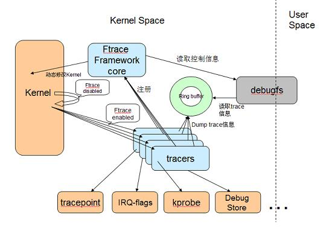

# Ftrace

* 旧版本的 kernel 在使用 ftrace 之前需挂载 debugfs
```
# mkdir /debug
# mount -t debugfs nodev /debug
```
* 新版本的 kernel 无需挂载 debugfs，控制接口在`/sys/kernel/debug/tracing`目录下。
* 检查可用的跟踪器`available_tracers`和当前的跟踪器`current_tracer`
```
# cat /sys/kernel/debug/tracing/available_tracers
blk mmiotrace branch function_graph wakeup_dl wakeup_rt wakeup preemptirqsoff preemptoff irqsoff function nop
# cat /sys/kernel/debug/tracing/available_tracers
nop
```

# 传统 tracer

## function tracer

#### 设定函数跟踪器
```
echo 0 > /sys/kernel/debug/tracing/tracing_on
echo function > /sys/kernel/debug/tracing/current_tracer
```

#### 设定跟踪特定的函数
```
echo do_page_fault > /sys/kernel/debug/tracing/set_ftrace_filter
```
* 当然可以不设置，那样会跟踪所有能跟踪的函数。

#### 指定跟踪特定的CPU
```
echo "cpu-id" > /sys/kernel/debug/tracing/tracing_cpumask
```

#### 开始跟踪
```
echo 1 > /sys/kernel/debug/tracing/tracing_on
cat /sys/kernel/debug/tracing/trace_pipe | tee /tmp/ftrace.log
```

#### 输出示例
```
            TASK-PID CPU irqs-off need-resched hardirq/softirq preempt-depth delay TIMESTAMP FUNCTION
            lttng-879   [000] d..1 2437395.004331: do_page_fault <-do_PrefetchAbort
            lttng-879   [000] d..1 2437395.004331: do_page_fault <-do_PrefetchAbort
            lttng-879   [000] d..1 2437395.004346: do_page_fault <-do_DataAbort
            lttng-879   [000] d..1 2437395.004362: do_page_fault <-do_PrefetchAbort
            lttng-879   [000] d..1 2437395.004377: do_page_fault <-do_PrefetchAbort
```

## irqsoff/preemptoff/preemptirqsoff
* **Irqsoff tracer** 当中断被禁止时，系统无法相应外部事件，比如键盘和鼠标，时钟也无法产生 tick 中断。这意味着系统响应延迟，`irqsoff` 这个 tracer 能够跟踪并记录内核中哪些函数禁止了中断，对于其中中断禁止时间最长的，`irqsoff` 将在 log 文件的第一行标示出来，从而使开发人员可以迅速定位造成响应延迟的罪魁祸首。
* **Preemptoff tracer** 和前一个 tracer 类似，`preemptoff` tracer 跟踪并记录 **禁止内核抢且关闭中断占期间** 的函数，并清晰地显示出禁止抢占时间最长的内核函数。
* **Preemptirqsoff tracer** 同上，跟踪和记录禁止中断或者禁止抢占的内核函数，以及禁止时间最长的函数。

### `preemptoff`与`irqsoff`跟踪器
* `preemptoff`与`irqsoff`跟踪器用的跟踪函数是相同的，都是`irqsoff_tracer_call()`。
* `preemptoff`与`irqsoff`跟踪器的不同之处
	* `irqsoff`跟踪器的 start 点在开启或关闭中断的地方，如 `local_irq_disable()`；
	* `preemptoff`跟踪器的 start 点在开启或关闭抢占的地方，如 `preempt_disable()`。
	* 老版本的`preemptoff`跟踪器不会记录 **中断开启期间的函数，尽管抢占计数不为 0**；目前版本（4.9）的`preemptoff`跟踪器不会记录 **中断开启且抢占计数为 0 时的函数**（好像是废话）。

#### `preemptoff`跟踪器的开启和关闭
```
include/linux/preempt.h
preempt_disable()
  -> preempt_count_inc() -> preempt_count_add(1)
```
* kernel/sched/core.c
```c
/*
 * If the value passed in is equal to the current preempt count
 * then we just disabled preemption. Start timing the latency.
 */
static inline void preempt_latency_start(int val)
{
				/*仅在抢占计数与要改变的递增值相等时才调用函数去动态改变插桩，不相等时是不需要去改变
					插桩的。我们需要记录的是抢占关闭到抢占开启期间的 trace，在此期间增加禁止抢占的深度
					并不改变不能被抢占的状况。*/
        if (preempt_count() == val) {
                unsigned long ip = get_lock_parent_ip();
...
                trace_preempt_off(CALLER_ADDR0, ip);
        }    
}

void preempt_count_add(int val)
{
...
        __preempt_count_add(val);
...
        preempt_latency_start(val);
}
EXPORT_SYMBOL(preempt_count_add);
NOKPROBE_SYMBOL(preempt_count_add);

/*
 * If the value passed in equals to the current preempt count
 * then we just enabled preemption. Stop timing the latency.
 */
static inline void preempt_latency_stop(int val)
{
				/*仅在抢占计数与要改变的递减值相等时才调用函数去动态改变插桩，不相等时是不需要去改变
				  插桩的。我们需要记录的是抢占关闭到抢占开启期间的 trace，在此期间减少禁止抢占的深度
					并不改变不能被抢占的状况。*/
        if (preempt_count() == val)
                trace_preempt_on(CALLER_ADDR0, get_lock_parent_ip());
}

void preempt_count_sub(int val)
{
...
        preempt_latency_stop(val);
        __preempt_count_sub(val);
}
EXPORT_SYMBOL(preempt_count_sub);
NOKPROBE_SYMBOL(preempt_count_sub);
...
```
* kernel/trace/trace_irqsoff.c
```c
static DEFINE_PER_CPU(int, tracing_cpu);
...
static inline int
preempt_trace(void)
{				/*preemptoff跟踪器开启且抢占计数不为 0*/
        return ((trace_type & TRACER_PREEMPT_OFF) && preempt_count());
}
...
static inline int
irq_trace(void)
{       /*irqsoff跟踪器开启且在中断上下文*/
        return ((trace_type & TRACER_IRQS_OFF) &&
                irqs_disabled());
}
...
static inline void
start_critical_timing(unsigned long ip, unsigned long parent_ip)
{
        int cpu;
        struct trace_array *tr = irqsoff_trace;
        struct trace_array_cpu *data;
        unsigned long flags;
				/*如果当前跟踪器未使能或跟踪功能没开启，直接返回*/
        if (!tracer_enabled || !tracing_is_enabled())
                return;

        cpu = raw_smp_processor_id();
				/*tracing_cpu是个 Per-CPU 变量，它仅在该函数下面置 1，也就是说该函数下面的部分
				  只在开启跟踪的时候运行一次。*/
        if (per_cpu(tracing_cpu, cpu))
                return;

        data = per_cpu_ptr(tr->trace_buffer.data, cpu);
				/*data->disabled 控制是否同时 trace_function*/
        if (unlikely(!data) || atomic_read(&data->disabled))
                return;
				/*不允许伪并发的 trace_function，注意，这是 Per-CPU 的*/
        atomic_inc(&data->disabled);

        data->critical_sequence = max_sequence;
        data->preempt_timestamp = ftrace_now(cpu);
        data->critical_start = parent_ip ? : ip;
				/*将 flags 寄存器的信息取出来*/
        local_save_flags(flags);
				/*写当前跟踪信息*/
        __trace_function(tr, ip, parent_ip, flags, preempt_count());
				/*此处将 tracing_cpu 置 1，不会因为伪并发而被运行两次start*/
        per_cpu(tracing_cpu, cpu) = 1;
				/*写完信息了，放开保护允许继续 trace*/
        atomic_dec(&data->disabled);
}
...
#ifdef CONFIG_PREEMPT_TRACER
void trace_preempt_on(unsigned long a0, unsigned long a1)
{
        if (preempt_trace() && !irq_trace())
                stop_critical_timing(a0, a1);
}

void trace_preempt_off(unsigned long a0, unsigned long a1)
{
        if (preempt_trace() && !irq_trace())
                start_critical_timing(a0, a1);
}
#endif /* CONFIG_PREEMPT_TRACER */
```
* include/linux/ftrace.h
```c
/* Archs may use other ways for ADDR1 and beyond */
#ifndef ftrace_return_address
# ifdef CONFIG_FRAME_POINTER
#  define ftrace_return_address(n) __builtin_return_address(n)
# else
#  define ftrace_return_address(n) 0UL
# endif
#endif

#define CALLER_ADDR0 ((unsigned long)ftrace_return_address0)
#define CALLER_ADDR1 ((unsigned long)ftrace_return_address(1))
#define CALLER_ADDR2 ((unsigned long)ftrace_return_address(2))
#define CALLER_ADDR3 ((unsigned long)ftrace_return_address(3))
#define CALLER_ADDR4 ((unsigned long)ftrace_return_address(4))
#define CALLER_ADDR5 ((unsigned long)ftrace_return_address(5))
#define CALLER_ADDR6 ((unsigned long)ftrace_return_address(6))

static inline unsigned long get_lock_parent_ip(void)
{
        unsigned long addr = CALLER_ADDR0;

        if (!in_lock_functions(addr)) /*如果地址不在锁函数的.text段范围内*/
                return addr;          /*返回该地址*/
        addr = CALLER_ADDR1;          /*否则向上走一层*/
        if (!in_lock_functions(addr))
                return addr;
        return CALLER_ADDR2;
}
...__```
```

#### `irqsoff`跟踪器的开启和关闭
* 还是之前提到的，与`preemptoff`最大的不同之处就是起始点：
* include/linux/irqflags.h
```c
#define local_irq_enable() \
        do { trace_hardirqs_on(); raw_local_irq_enable(); } while (0)
#define local_irq_disable() \
        do { raw_local_irq_disable(); trace_hardirqs_off(); } while (0)
```

* kernel/trace/trace_irqsoff.c
```c
/*
 * We are only interested in hardirq on/off events:
 */
void trace_hardirqs_on(void)
{
        if (!preempt_trace() && irq_trace())
                stop_critical_timing(CALLER_ADDR0, CALLER_ADDR1);
}
EXPORT_SYMBOL(trace_hardirqs_on);

void trace_hardirqs_off(void)
{
        if (!preempt_trace() && irq_trace())
                start_critical_timing(CALLER_ADDR0, CALLER_ADDR1);
}
EXPORT_SYMBOL(trace_hardirqs_off);
```

### 控制接口文件
* **set_graph_function** 设置要清晰显示调用关系的函数，显示的信息结构类似于 C 语言代码，这样在分析内核运作流程时会更加直观一些。在使用 `function_graph` 跟踪器时使用；缺省为对所有函数都生成调用关系序列，可以通过写该文件来指定需要特别关注的函数。
* **buffer_size_kb** 用于设置单个 CPU 所使用的跟踪缓存的大小。跟踪器会将跟踪到的信息写入缓存，每个 CPU 的跟踪缓存是一样大的。跟踪缓存实现为环形缓冲区的形式，如果跟踪到的信息太多，则旧的信息会被新的跟踪信息覆盖掉。注意，要更改该文件的值需要先将 `current_tracer` 设置为 `nop` 才可以。
* **available_filter_functions** 只读文件，记录了当前可以跟踪的内核函数。对于不在该文件中列出的函数，无法跟踪其活动。
* **set_ftrace_filter** 和 **set_ftrace_notrace** 在编译内核时配置了动态 ftrace （选中 `CONFIG_DYNAMIC_FTRACE` 选项）后使用。
	* 前者用于显示指定要跟踪的函数，后者则作用相反，用于指定不跟踪的函数。
	* 如果一个函数名同时出现在这两个文件中，则这个函数的执行状况不会被跟踪。
	* 这些文件还支持简单形式的含有通配符的表达式，这样可以用一个表达式一次指定多个目标函数。
	* 注意，要写入这两个文件的函数名必须可以在文件 `available_filter_functions` 中看到。
	* 缺省为可以跟踪所有内核函数，文件 `set_ftrace_notrace` 的值则为空。

# Non-Tracer Tracer
* 从 2.6.30 开始，ftrace 还支持几种 Non-tracer tracer，所谓 Non-tracer tracer 主要包括以下几种：
	* Max Stack Tracer
	* Profiling (branches / unlikely / likely / Functions)
	* Event tracing

## Max Stack Tracer
* 这个 tracer 记录内核函数的堆栈使用情况
* 用如下命令打开该 tracer
	```
	echo 1 > /proc/sys/kernel/stack_tracer_enabled
	```
* 从此，ftrace 便留心记录内核函数的堆栈使用。 Max Stack Tracer 的输出在 stack_trace 文件中：
```
# cat /sys/kernel/debug/tracing/stack_trace                                                                                                    
        Depth    Size   Location    (25 entries)
        -----    ----   --------
  0)     2912     216   update_group_capacity+0x33/0x2b0
  1)     2696      64   msecs_to_jiffies+0x5/0x20
  2)     2632     120   update_group_capacity+0x33/0x2b0
  3)     2512     368   find_busiest_group+0x103/0x9a0
  4)     2144     288   load_balance+0x1bd/0xaa0
  5)     1856     128   pick_next_task_fair+0x2df/0x4f0
  6)     1728     112   __schedule+0x6c4/0xf60
  7)     1616      32   schedule+0x35/0xa0
  8)     1584     176   schedule_timeout+0x234/0x300
  9)     1408      64   io_schedule_timeout+0xa4/0x110
 10)     1344      96   wait_for_common_io.constprop.2+0x94/0x110
 11)     1248      16   wait_for_completion_io+0x18/0x20
 12)     1232     176   blk_execute_rq+0x7c/0x100
 13)     1056      80   scsi_execute+0x131/0x1b0
 14)      976     112   scsi_execute_req_flags+0x8e/0x100
 15)      864     128   scsi_test_unit_ready+0x84/0x140
 16)      736      48   sd_check_events+0x10e/0x150
 17)      688     112   disk_check_events+0x51/0x160
 18)      576      16   disk_events_workfn+0x16/0x20
 19)      560     112   process_one_work+0x2e9/0x750
 20)      448     128   worker_thread+0x420/0x800
 21)      320       0   return_to_handler+0x0/0x28
 22)      320     144   kthread+0xc9/0xe0
 23)      176       0   return_to_handler+0x0/0x28
 24)      176     176   ret_from_fork+0x42/0x70
 ```
* 从上例中可以看到内核堆栈最满的情况如下，有 25 层函数调用，堆栈使用大小为 2912 字节。此外还可以在 Location 这列中看到整个的 calling stack 情况。

# ftrace 的实现



## Function tracer的实现
* Ftrace 采用 GCC 的 profile 特性在所有内核函数的开始部分加入一段 stub 代码，ftrace 重载这段代码来实现 trace 功能。
* gcc 的 `-pg` 选项将在每个函数入口处加入对 `mcount` 的调用代码。
* 增加 `-pg` 选项后，gcc 在函数的入口处加入了对 `mcount` 的调用：`call _mcount`。
* 原本 `mcount` 由 libc 实现，但您知道内核不会连接 libc 库，因此 ftrace 编写了自己的 `mcount` stub 函数，并借此实现 trace 功能。
* 在每个内核函数入口加入 trace 代码，必然会影响内核的性能，为了减小对内核性能的影响，ftrace 支持动态 trace 功能。
* 当未 `CONFIG_DYNAMIC_FTRACE` 选中时：
	* 每个函数调用都会根据不同的体系结构的实现调用`mcount`函数，
	* 如果 ftrace 使能了某些跟踪器，`ftrace_trace_function`指针不再指向`ftrace_stub`，而是指向具体的跟踪函数。
	* 否则就执行到体系结构相关的`ftrace_stub`从函数返回。
* 当 `CONFIG_DYNAMIC_FTRACE` 被选中后：
	* 内核编译时会调用一个 perl 脚本：`recordmcount.pl` 将每个函数的地址写入一个特殊的段：`__mcount_loc`
	* 在内核初始化的初期，ftrace 查询 `__mcount_loc` 段，得到每个函数的入口地址，并将 `mcount` 替换为 `nop` 指令。这样在默认情况下，ftrace 不会对内核性能产生影响。
	* 当用户打开 ftrace 功能时，ftrace 将这些 `nop` 指令动态替换为 `ftrace_caller`，该函数将调用用户注册的 trace 函数。

## ftrace 依赖的`-pg`编译器选项
* Makefile
```makefile
ifdef CONFIG_FUNCTION_TRACER
ifndef CC_FLAGS_FTRACE
CC_FLAGS_FTRACE := -pg
endif
export CC_FLAGS_FTRACE
...
KBUILD_CFLAGS	+= $(CC_FLAGS_FTRACE) ...
```

* 对于tracer自身而言，是不需要`-pg`选项的，因此我们可以看到在`kernel/tracing/Makefile`中将`-pg`从该模块的`CFLAGS`中剔除了。
* kernel/tracing/Makefile
```makefile
# Do not instrument the tracer itself:

ifdef CONFIG_FUNCTION_TRACER
ORIG_CFLAGS := $(KBUILD_CFLAGS)
KBUILD_CFLAGS = $(subst $(CC_FLAGS_FTRACE),,$(ORIG_CFLAGS))

ifdef CONFIG_FTRACE_SELFTEST
# selftest needs instrumentation 如自测功能开启单独给 trace_selftest_dynamic.c 文件插桩。
CFLAGS_trace_selftest_dynamic.o = $(CC_FLAGS_FTRACE)
obj-y += trace_selftest_dynamic.o
endif
endif

```
* 对于不希望被 ftrace 跟踪的模块也可以如法炮制。

## ftrace跟踪函数
* `ftrace_trace_function`是个函数指针，`call mcount`时会调用该指针指向的函数。
* 原型
* include/linux/ftrace.h
```c
typedef void (*ftrace_func_t)(unsigned long ip, unsigned long parent_ip,
                              struct ftrace_ops *op, struct pt_regs *regs);
```
* 定义和初始值
* kernel/trace/ftrace.c
```c
ftrace_func_t ftrace_trace_function __read_mostly = ftrace_stub;
```
* `ftrace_stub`则是一个与体系结构相关函数，通常是用汇编实现的一条简单的 **从函数返回** 的指令：
	* arch/powerpc/kernel/entry_64.S: `blr`
	* arch/powerpc/kernel/entry_32.S: `blr`
	* arch/arm/kernel/entry-ftrace.S: `ret     lr`
	* arch/arm64/kernel/entry-ftrace.S: `ret`
	* arch/x86/entry/entry_32.S: `ret`
	* arch/x86/kernel/mcount_64.S: `retq`

## ftrace跟踪函数的 x86 64 实现
* arch/x86/kernel/mcount_64.S
```c
#ifdef CC_USING_FENTRY
# define function_hook  __fentry__
EXPORT_SYMBOL(__fentry__)
#else
# define function_hook  mcount
EXPORT_SYMBOL(mcount)
#endif
```
* 在该文件里，用`function_hook`来替换`mcount`。

### `CONFIG_DYNAMIC_FTRACE`未开启
* 对于`CONFIG_DYNAMIC_FTRACE`没有开启的情况，当然，在不开启 ftrace 的时候也会有性能损失。
* 具体表现在，总是至少会多执行两条指令，即使`ftrace_trace_function`没有被指向某个跟踪函数。
* arch/x86/kernel/mcount_64.S
```nasm
ENTRY(function_hook)
        cmpq $ftrace_stub, ftrace_trace_function ; cmpq: compare quad words，比较 ftrace_stub 和指针 ftrace_trace_function
        jnz trace ; 如果上面比较结果不为 0，即不相等，跳转到标签 trace ，开始跟踪

fgraph_trace:
#ifdef CONFIG_FUNCTION_GRAPH_TRACER
        ...
#endif

GLOBAL(ftrace_stub)
        retq

trace:
        /* save_mcount_regs fills in first two parameters */
        save_mcount_regs ; 一个汇编宏，目的是填入前两个参数：ip 和 parent_ip

        /*
         * When DYNAMIC_FTRACE is not defined, ARCH_SUPPORTS_FTRACE_OPS is not
         * set (see include/asm/ftrace.h and include/linux/ftrace.h).  Only the
         * ip and parent ip are used and the list function is called when
         * function tracing is enabled.
         */
        call   *ftrace_trace_function ; 调用 ftrace_trace_function 指向的 C 实现的函数

        restore_mcount_regs ; 另一个汇编宏，恢复一些寄存器的值

        jmp fgraph_trace ; 跳转到标签 fgraph_trace 处，并执行至 retq 返回调用者
END(function_hook)
```

### 开启`CONFIG_DYNAMIC_FTRACE`
* 最初`mcount`的作用是直接从函数返回。
* arch/x86/kernel/mcount_64.S
```nasm
ENTRY(function_hook)
        retq
END(function_hook)
```

# Reference

* [ftrace 简介](https://www.ibm.com/developerworks/cn/linux/l-cn-ftrace/)
* [使用 ftrace 调试 Linux 内核，第 1 部分](http://www.ibm.com/developerworks/cn/linux/l-cn-ftrace1/)
* [使用 ftrace 调试 Linux 内核，第 2 部分](https://www.ibm.com/developerworks/cn/linux/l-cn-ftrace2/)
* [使用 ftrace 调试 Linux 内核，第 3 部分](http://www.ibm.com/developerworks/cn/linux/l-cn-ftrace3/)
