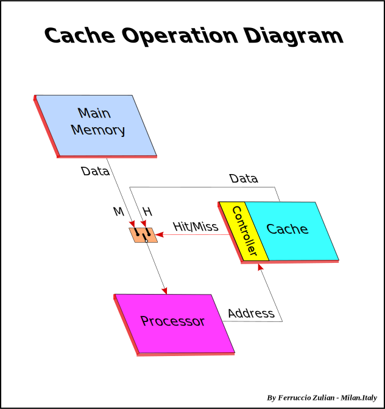
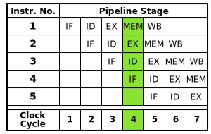
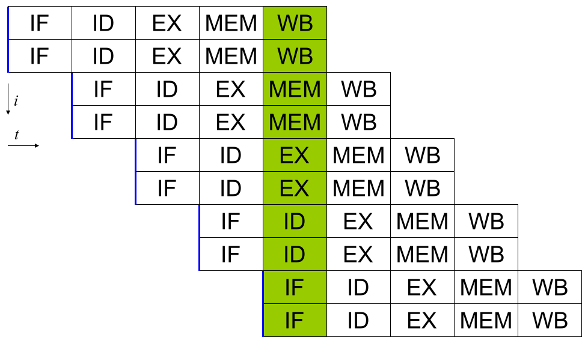
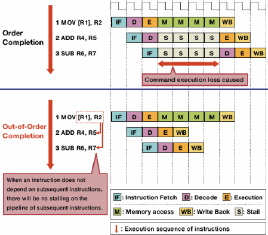
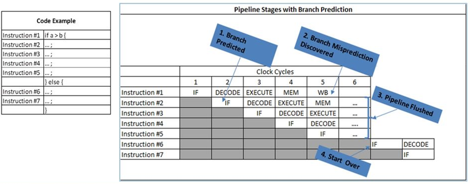
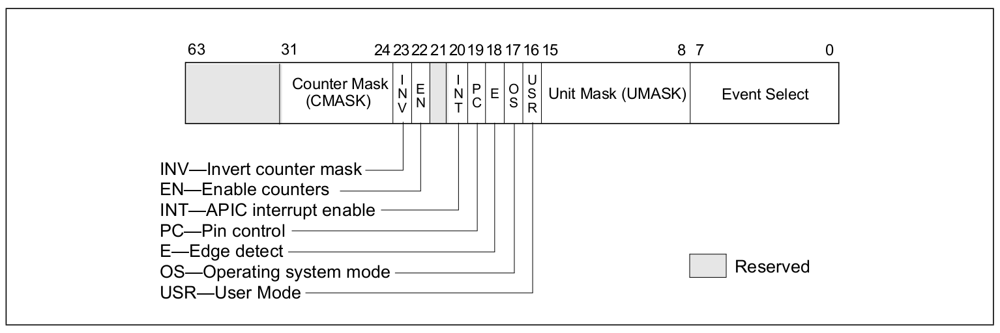
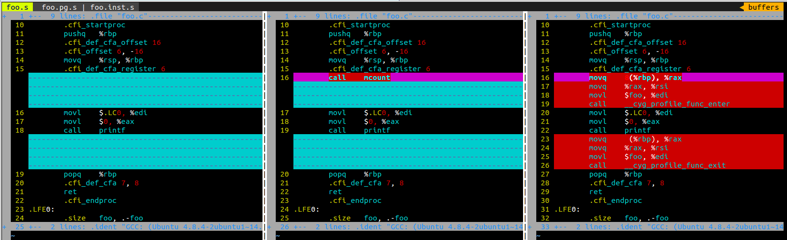
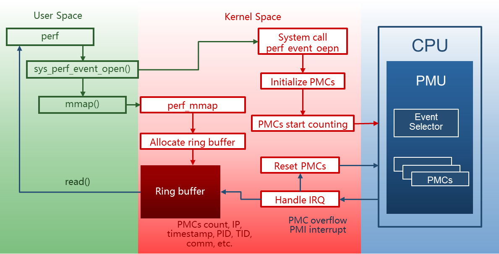
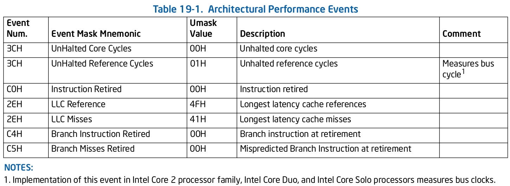
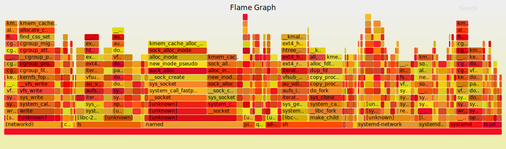

# Perf

- [Perf的功能](#perf的功能)
- [概念](#概念)
	- [CPU cache](#cpu-cache)
	- [Instruction pipelining](#instruction-pipelining)
	- [Superscalar processor](#superscalar-processor)
	- [Out-of-order execution](#out-of-order-execution)
	- [Branch predication](#branch-predication)
	- [Performance Monitor Unit](#performance-monitor-unit)
		- [Hardware performance counter](#hardware-performance-counter)
		- [Model-Specific Registers](#model-specific-registers)
		- [Intel IA32_PERFEVTSELx MSRs](#intel-ia32perfevtselx-msrs)
		- [其他硬件提供的特性](#其他硬件提供的特性)
	- [Tracepoints](#tracepoints)
		- [编译器插桩选项](#编译器插桩选项)
- [Perf Event](#perf-event)
	- [Perf Event的分类](#perf-event的分类)
		- [Software Events](#software-events)
		- [Hardware Events](#hardware-events)
		- [Hardware Cache Events](#hardware-cache-events)
		- [Tracepoint Events](#tracepoint-events)
- [Perf原理](#perf原理)
	- [以cycles事件为例观察采样原理](#以cycles事件为例观察采样原理)
	- [性能分析的计数模式](#性能分析的计数模式)
	- [基于事件采样的采样周期](#基于事件采样的采样周期)
	- [基于时间的性能分析受 CPU idle 的限制](#基于时间的性能分析受-CPU-idle-的限制)
	- [依赖可屏蔽中断的性能分析的限制](#依赖可屏蔽中断的性能分析的限制)
	- [Performance Monitoring Interrupts (PMI)](#Performance-Monitoring-Interrupts-(PMI))
	- [Intel处理器的PEBS机制](#Intel处理器的PEBS机制)
		- [性能事件的精度级别](#性能事件的精度级别)
- [内核选项](#内核选项)
	- [配置perf](#配置perf)
	- [配置内核代码的符号表](#配置内核代码的符号表)
	- [栈跟踪功能相关的选项](#栈跟踪功能相关的选项)
	- [perf lock命令依赖的选项](#perf-lock命令依赖的选项)
	- [perf probe命令依赖的选项](#perf-probe命令依赖的选项)
- [用例](#用例)
- [References](#references)
	- [Knowledge](#knowledge)
	- [Examples](#examples)
	- [wikipedia](#wikipedia)

## Perf的功能

* 评估程序对硬件资源的使用情况
	* 各级 cache 访问次数
	* 各级 cache 丢失次数
	* 流水线停顿周期
	* 前端总线访问次数
	* 更多
* 评估程序对操作系统资源的使用情况
	* 系统调用次数
	* Page Fault 次数
	* 上下文切换次数
	* 任务迁移次数
	* 更多
* 评估内核性能
	* Benchmarks
	* 调度器性能分析
	* 系统行为记录与重演
	* 动态添加探测点
	* 更多

* `perf` 命令以子命令结合的方式提供相应的功能
```
# perf help

 usage: perf [--version] [--help] [OPTIONS] COMMAND [ARGS]

 The most commonly used perf commands are:
   annotate        Read perf.data (created by perf record) and display annotated code
   archive         Create archive with object files with build-ids found in perf.data file
   bench           General framework for benchmark suites
   buildid-cache   Manage build-id cache.
   buildid-list    List the buildids in a perf.data file
   data            Data file related processing
   diff            Read perf.data files and display the differential profile
   evlist          List the event names in a perf.data file
   inject          Filter to augment the events stream with additional information
   kmem            Tool to trace/measure kernel memory properties
   kvm             Tool to trace/measure kvm guest os
   list            List all symbolic event types
   lock            Analyze lock events
   mem             Profile memory accesses
   record          Run a command and record its profile into perf.data
   report          Read perf.data (created by perf record) and display the profile
   sched           Tool to trace/measure scheduler properties (latencies)
   script          Read perf.data (created by perf record) and display trace output
   stat            Run a command and gather performance counter statistics
   test            Runs sanity tests.
   timechart       Tool to visualize total system behavior during a workload
   top             System profiling tool.
   trace           strace inspired tool
   probe           Define new dynamic tracepoints

 See 'perf help COMMAND' for more information on a specific command.
```

## 概念

### CPU cache
> A **CPU cache** is a hardware cache used by the central processing unit (CPU) of a computer to reduce the average cost (time or energy) to access data from the main memory. A cache is a smaller, faster memory, closer to a processor core, which stores copies of the data from frequently used main memory locations. Most CPUs have different independent caches, including instruction and data caches, where the data cache is usually organized as a hierarchy of more cache levels (L1, L2, etc.).



### Instruction pipelining
> **Instruction pipelining** is a technique that implements a form of parallelism called instruction-level parallelism within a single processor. It therefore allows faster CPU throughput (the number of instructions that can be executed in a unit of time) than would otherwise be possible at a given clock rate. The basic instruction cycle is broken up into a series called a pipeline. Rather than processing each instruction sequentially (finishing one instruction before starting the next), each instruction is split up into a sequence of dependent steps so different steps can be executed in parallel and instructions can be processed concurrently (starting one instruction before finishing the previous one).


* Basic five-stage pipeline
* **IF** = Instruction Fetch, **ID** = Instruction Decode, **EX** = Execute, **MEM** = Memory access, **WB** = Register write back
* In the fourth clock cycle (the green column), the earliest instruction is in MEM stage, and the latest instruction has not yet entered the pipeline

### Superscalar processor
> A **superscalar processor** is a CPU that implements a form of parallelism called instruction-level parallelism within a single processor. It therefore allows for more throughput (the number of instructions that can be executed in a unit of time) than would otherwise be possible at a given clock rate. A superscalar processor can execute more than one instruction during a clock cycle by simultaneously dispatching multiple instructions to different execution units on the processor. Each execution unit is not a separate processor (or a core if the processor is a multi-core processor), but an execution resource within a single CPU such as an arithmetic logic unit.


* Simple superscalar pipeline
* By fetching and dispatching two instructions at a time, a maximum of two instructions per cycle can be completed
* **IF** = Instruction Fetch, **ID** = Instruction Decode, **EX** = Execute, **MEM** = Memory access, **WB** = Register write back, **i** = Instruction number, **t** = Clock cycle [i.e., time]

### Out-of-order execution
> In computer engineering, **out-of-order execution** (or more formally **dynamic execution**) is a paradigm used in most high-performance microprocessors to make use of instruction cycles that would otherwise be wasted by a certain type of costly delay. In this paradigm, a processor executes instructions in an order governed by the availability of input data, rather than by their original order in a program. In doing so, the processor can avoid being idle while waiting for the preceding instruction to complete to retrieve data for the next instruction in a program, processing instead the next instructions that are able to run immediately and independently.


* 数据相关（data dependency)：下一条指令会用到这一条指令计算出的结果
* 控制相关（control dependency)：一条指令要确定下一条指令的位置，如在执行跳转、调用或返回指令
* 流水线冒险
	* 数据冒险（data hazard）
	* 控制冒险（control hazard）
* 用流水线停顿（stalling）来避免冒险
* 用数据转发（data forwarding），有时也称为旁路（bypass）来避免停顿。
* 加载/使用冒险（load/use hazard）
* 加载互锁（load interlock）来处理加载/使用冒险

### Branch predication
> In computer science, **predication** is an architectural feature that provides an alternative to conditional branch instructions. Predication works by executing instructions from both paths of the branch and only permitting those instructions from the taken path to modify architectural state. The instructions from the taken path are permitted to modify architectural state because they have been associated (predicated) with a predicate, a Boolean value used by the instruction to control whether the instruction is allowed to modify the architectural state or not.



### Performance Monitor Unit

> **Performance Monitoring Unit**, or the **PMU**, is found in all high end processors these days. The PMU is basically hardware built inside a processor to measure it's performance parameters. We can measure parameters like instruction cycles, cache hits, cache misses, branch misses and many others depending on the support i.e. hardware provide by the processor. And as the measurement is done by the hardware there is very limited overhead.

* PMU 允许软件针对某种硬件事件设置 counter，此后处理器便开始统计该事件的发生次数，当发生的次数超过 counter 内设置的值后，便产生中断。
* 比如 cache miss 达到某个值后，PMU 便能产生相应的中断。捕获这些中断，便可以考察程序对这些硬件特性的利用效率。

#### Hardware performance counter

> In computers, **hardware performance counters**, or hardware counters are a set of special-purpose registers built into modern microprocessors to store the counts of hardware-related activities within computer systems. Advanced users often rely on those counters to conduct low-level performance analysis or tuning.

#### Model-Specific Registers
* Intel IA-32 架构里的 PMU 由两种类型的寄存器（或者说 **Model-Specific Registers (MSRs)**）组成。
	* Performance Event Select Registers
		* 度量一个 *性能事件* 需要对 Event Select Registers 编程
	* Performance Monitoring Counters (PMC)
		* *性能事件* 在 PMC 中计数
* 因此度量性能事件同时需要 event selector 和 PMC
* **Model-Specific**： 即使是来自同一公司的处理器，每个处理器模型有一些和其他模型不同的寄存器。

#### Intel IA32_PERFEVTSELx MSRs


* **Event select field (bits 0 through 7)**
	* 选择要探测性能监测事件的逻辑单元
	* 填充到该域的值取决于体系架构
* **Unit mask (UMASK) fields (bits 8-15)**
	* 被 Event Select field 选中的逻辑单元可能会有监测多个事件的能力。因此该 UMASK 域可以用于从这些事件中选择其中一个让逻辑单元来监控。
	* 根据选中的逻辑单元，UMASK 域可能有固定的值或者多个值，取决于体系结构
* **CMASK (Counter mask) field (bits 24 through 31)**
	* 如果该域的值大于零，那么该值会与一个时钟周期内产生的事件数进行比较。
		* 如果产生的事件数大于 CMASK 的值，那么计数器加一；
		* 否则计数器的值不增加。

#### 其他硬件提供的特性
* Fixed function performance counter register and associated control register
	* 还有一些计数器只能度量某一特定的事件，而不像那些可以配置成 *度量不同的事件的* 通用目的的计数器。

* Global Control Registers
	* 一些架构还提供了可以被用于控制所有的或者一组 *控制寄存器或者计数器* 的 *全局控制寄存器*。
	* 减少修改控制寄存器需要的指令数，因此易于编程。

### Tracepoints

> A **tracepoint** placed in code provides a hook to call a function (probe) that you can provide at runtime. A tracepoint can be "on" (a probe is connected to it) or "off" (no probe is attached).
>
> You can put tracepoints at important locations in the code. They are lightweight hooks that can pass an arbitrary number of parameters, which *prototypes* are described in a tracepoint declaration placed in a *header file*.
>
> They can be used for *tracing* and *performance accounting*.

* Tracepoint 关闭
	* 极小的 **时间惩罚** （检查一个分支的条件）
	* 极小的 **空间惩罚** （在被 instrumented 函数的末尾添加一些代码以调用函数，并且在一个独立的 section 中添加一些数据结构）。
* Tracepoint 开启
  * 在调用者的执行上下文中，每次 tracepoint 被执行的时候，提供的函数都会被调用到。
  * 当提供的函数运行结束后，会返回到它的调用者（从 tracepoint 被调用的地方继续执行）。

#### 编译器插桩选项
* `-pg`
> Generate extra code to write profile information suitable for the analysis program gprof. You must use this option when compiling the source files you want data about, and you must also use it when linking.

* `-finstrument-functions`
> Generate instrumentation calls for entry and exit to functions. Just after function entry and just before function exit, the following profiling functions are called with the address of the current function and its call site.



* https://gcc.gnu.org/onlinedocs/gcc/Instrumentation-Options.html


## Perf Event

* **性能事件 （Perf Event）** 是指在处理器或操作系统中发生的，可能影响到程序性能的硬件事件或软件事件。
	* 比如 cache 丢失，流水线停顿，页面交换等。
	* 这些事件会对程序的执行时间造成较大的负面影响。在优化代码时,应尽可能减少此类事件发生。

* 查看 Perf Event
```
# perf-list

List of pre-defined events (to be used in -e):

  branch-instructions OR branches                    [Hardware event]
  branch-misses                                      [Hardware event]
  bus-cycles                                         [Hardware event]
  cache-misses                                       [Hardware event]
  cache-references                                   [Hardware event]
  cpu-cycles OR cycles                               [Hardware event]
  instructions                                       [Hardware event]
  ref-cycles                                         [Hardware event]

  alignment-faults                                   [Software event]
  context-switches OR cs                             [Software event]
  cpu-clock                                          [Software event]
  cpu-migrations OR migrations                       [Software event]
  dummy                                              [Software event]
  emulation-faults                                   [Software event]
  major-faults                                       [Software event]
  minor-faults                                       [Software event]
  page-faults OR faults                              [Software event]
  task-clock                                         [Software event]

  L1-dcache-load-misses                              [Hardware cache event]
  L1-dcache-loads                                    [Hardware cache event]
  L1-dcache-prefetches                               [Hardware cache event]
  L1-dcache-store-misses                             [Hardware cache event]
  L1-dcache-stores                                   [Hardware cache event]
  L1-icache-load-misses                              [Hardware cache event]
  L1-icache-loads                                    [Hardware cache event]
  LLC-load-misses                                    [Hardware cache event]
  LLC-loads                                          [Hardware cache event]
  LLC-store-misses                                   [Hardware cache event]
  LLC-stores                                         [Hardware cache event]
  branch-load-misses                                 [Hardware cache event]
  branch-loads                                       [Hardware cache event]
  dTLB-load-misses                                   [Hardware cache event]
  dTLB-loads                                         [Hardware cache event]
  dTLB-store-misses                                  [Hardware cache event]
  dTLB-stores                                        [Hardware cache event]
  iTLB-load-misses                                   [Hardware cache event]
  iTLB-loads                                         [Hardware cache event]

	branch-instructions OR cpu/branch-instructions/    [Kernel PMU event]
  branch-misses OR cpu/branch-misses/                [Kernel PMU event]
  bus-cycles OR cpu/bus-cycles/                      [Kernel PMU event]
  cache-misses OR cpu/cache-misses/                  [Kernel PMU event]
  cache-references OR cpu/cache-references/          [Kernel PMU event]
  cpu-cycles OR cpu/cpu-cycles/                      [Kernel PMU event]
  instructions OR cpu/instructions/                  [Kernel PMU event]
  intel_bts//                                        [Kernel PMU event]
  msr/aperf/                                         [Kernel PMU event]
  msr/mperf/                                         [Kernel PMU event]
  msr/tsc/                                           [Kernel PMU event]

  rNNN                                               [Raw hardware event descriptor]
  cpu/t1=v1[,t2=v2,t3 ...]/modifier                  [Raw hardware event descriptor]
   (see 'man perf-list' on how to encode it)

  mem:<addr>[/len][:access]                          [Hardware breakpoint]

  block:block_bio_backmerge                          [Tracepoint event]
  block:block_bio_bounce                             [Tracepoint event]
  block:block_bio_complete                           [Tracepoint event]
  block:block_bio_frontmerge                         [Tracepoint event]
...
```

### Perf Event的分类

* perf 工具和内核的 perf_events 接口可以接受和度量来自不同来源的 perf events。


#### Software Events
* 来源自纯内核的计数器，例如：
	* context-switches
	* page-faults
	* cpu-migrations
* 不同版本的内核提供的软件性能事件不尽相同

#### Hardware Events
* 来源自处理器自身的一些事件和它的 PMU
* 提供了一系列用来度量微体系结构的事件，例如：
	* number of cycles
	* instructions retired
	* branch-misses
	* cache-misses
* 不同型号的 CPU 支持的硬件性能事件不尽相同

#### Hardware Cache Events
* perf_events 接口也提供了一个小的通用 hardware events 的集合
	* 在每个处理器上，如果这些事件存在的话，就映射到一个 CPU 提供的事件
	* 否则事件无法使用

#### Tracepoint Events
* 静态内核级的 instrumentation points
* hardcoded 在内核各出值得关注的地方
* 基于`ftrace`的框架实现
* 内核中所有的 tracepoint，都可以作为 perf 的性能事件
* 不同版本的内核提供的 tracepoint events 不尽相同
* 现在不再通过`perf list`命令列出所有 tracepoint，可以通过 ftrace 的接口文件查看：
  ```
  /sys/kernel/debug/tracing/available_events
  ```


## Perf原理

### 以cycles事件为例观察采样原理



* perf 会通过系统调用`sys_perf_event_open`在内核中注册一个监测 “cycles” 事件的性能计数器
* 内核根据 perf 提供的信息在 PMU 上初始化一个 *硬件性能计数器（Hardware performance counter）*
* 硬件性能计数器随着 CPU 周期的增加而自动累加
* 在硬件性能计数器溢出时，PMU 触发一个 PMI（Performance Monitoring Interrupt）中断
* 内核在 PMI 中断的处理函数中保存以下信息，这些信息统称为一个 **采样（sample）**
	* 硬件性能计数器的计数值
	* 触发中断时的指令地址（Register IP:Instruction Pointer）
	* 当前时间戳
	* 当前进程的 PID,TID,comm 等信息
* 内核会将收集到的 sample 放入用于跟用户空间通信的 ring buffer
* 用户空间里的 perf 分析程序采用 mmap 机制从 ring buffer 中读入采样,并对其解析
* perf 根据 pid,comm 等信息可以找到对应的进程
* perf 根据 IP 与 ELF 文件中的符号表可以查到触发 PMI 中断的指令所在的函数
	* 为了能够使 perf 读到函数名，我们的目标程序必须具备 **符号表**
	* perf 的分析结果中只看到一串地址，而没有对应的函数名时，通常是由于用 `strip` 删除了 ELF 文件中的符号表

### 函数接口
* tools/perf/perf-sys.h::`sys_perf_event_open()`
* kernel/events/core.c::`perf_event_open()`
```c
static const struct file_operations perf_fops = {
        .llseek                 = no_llseek,
        .release                = perf_release,
        .read                   = perf_read,
        .poll                   = perf_poll,
        .unlocked_ioctl         = perf_ioctl,
        .compat_ioctl           = perf_compat_ioctl,
        .mmap                   = perf_mmap,
        .fasync                 = perf_fasync,
};

static int perf_mmap(struct file *file, struct vm_area_struct *vma)
{
	...
	if (!rb) {
		rb = rb_alloc(nr_pages,
			event->attr.watermark ? event->attr.wakeup_watermark : 0,
			event->cpu, flags);

		if (!rb) {
			ret = -ENOMEM;
			goto unlock;
		}

		atomic_set(&rb->mmap_count, 1);
		rb->mmap_user = get_current_user();
		rb->mmap_locked = extra;

		ring_buffer_attach(event, rb);

		perf_event_init_userpage(event);
		perf_event_update_userpage(event);
	} else {
		ret = rb_alloc_aux(rb, event, vma->vm_pgoff, nr_pages,
			event->attr.aux_watermark, flags);
		if (!ret)
			rb->aux_mmap_locked = extra;
	}
	...
}

**
 * sys_perf_event_open - open a performance event, associate it to a task/cpu
 *
 * @attr_uptr:  event_id type attributes for monitoring/sampling
 * @pid:                target pid
 * @cpu:                target cpu
 * @group_fd:           group leader event fd
 */
SYSCALL_DEFINE5(perf_event_open,
                struct perf_event_attr __user *, attr_uptr,
                pid_t, pid, int, cpu, int, group_fd, unsigned long, flags)
{
	...
	event_file = anon_inode_getfile("[perf_event]", &perf_fops, event,
																	f_flags);
	...
}
...*```
```

### 性能分析的计数模式
* 基于计数
	* 给定时间内的事件发生的次数会被记录下来
	* 随后通过`read()`将当前计数器中的值读出来
	* 特征：`struct perf_event_attr`的`irq_period = 0`
	* `perf stat`
* 基于事件采样
	* 设置事件每发生 N 次产生一次中断，中断处理函数记录相关信息
	* 随后 perf 采用 `mmap()` 的方式读取采样信息并解析
	* 特征：`struct perf_event_attr`的`irq_period = N`
	* `perf top`
	* `perf record`
* 在没有硬件性能度量的体系结构上，仍然可以基于 **hrtimers** 的通用软件计数器来进行采样

### 基于事件采样的采样周期
* perf_events 接口允许使用两种模式来表示 **采样周期**：
	* 事件发生的次数 （周期）
		* 采样周期由用户指定
		* 样本之间的采样周期固定
		```
		# Sample CPU stack traces, once every 10,000 Level 1 data cache misses, for 5 seconds:
		perf record -e L1-dcache-load-misses -c 10000 -ag -- sleep 5
		```
	* 每秒采样的平均速率（频率）
		* perf 的缺省方式
		* 缺省为 `1000Hz`，即 *1000次采样/秒*
		* 内核动态调整采样周期以达到目标平均速率
		```
		# Sample on-CPU functions for the specified command, at 99 Hertz:
		perf record -F 99 command
		```
* 目前尚不支持采样周期随机化

### 基于事件采样模式的问题
* 运行时间越 **多** 的函数，被中断击中的机会越 **大**，从而推测，那个函数（或者`pid`等）的CPU占用率就越 **高**
* 如果某个进程/函数运气特别好，它每次都刚好躲过你发起探测的位置，则统计结果可能就完全是错的。这是所有采样统计都有可能遇到的问题。
* 如何可以获得更精确的采样结果
	* 延长采样的事件以获得更多的样本
	* 提高采样的频率，然而对系统而言也会有额外的开销

### 基于时间的性能分析受 CPU idle 的限制
* 现代 CPU 基本上已经不用 *忙等待* 的方式进入等待了
	* 如果 CPU 在 idle 状态（也就是没有任务调度），击中任务也会停止
	* 因此，在 idle 期间是没有样本的（你看到 idle 函数本身的点并非 CPU idle的点，而是准备进入 idle 前后花的时间）
* 结论：perf 的统计不能用来分析 CPU 占用率

### 依赖可屏蔽中断的性能分析的限制
* 如果 perf 事件依赖的是可屏蔽中断，关中断以后，就无法击中关中断期间的点
	* 性能事件产生的中断会被延迟到开中断的时候，所以，在这样的平台上，会看到很多开中断之后的函数被密集击中
	* 如果在关中断的时候，发生了多个事件，由于中断控制器会合并相同的中断，会失去多次事件，让统计发生错误
* 现代的 Intel 平台，基本上已经把 PMU 中断都切换为 NMI 中断了（不可屏蔽），所以前面这个问题不存在
* 但在大部分 ARM/ARM64 平台上，这个问题都没有解决，所以看这种平台的报告，都要特别小心，特别是看到`_raw_spin_unlock()`一类的函数击中极高，就要怀疑一下测试结果了

### Performance Monitoring Interrupts (PMI)
```
# cat /proc/interrupts
           CPU0       CPU1       
  0:        173          0   IO-APIC-edge      timer
  1:          3          0   IO-APIC-edge      i8042
  4:       3276          0   IO-APIC-edge      serial
  8:          0          0   IO-APIC-edge      rtc0
  9:          0          0   IO-APIC-fasteoi   acpi
 12:          5          0   IO-APIC-edge      i8042
 17:        517          0   IO-APIC  17-fasteoi   snd_hda_intel
 20:        347          0   IO-APIC  20-fasteoi   PCIe PME, pciehp, pata_via, uhci_hcd:usb2
 21:        279          0   IO-APIC  21-fasteoi   0000:00:0f.0, uhci_hcd:usb4
 22:      18614          0   IO-APIC  22-fasteoi   PCIe PME, pciehp, ehci_hcd:usb1, uhci_hcd:usb3
 23:          0          0   IO-APIC  23-fasteoi   uhci_hcd:usb5
 24:          0          0   IO-APIC   3-fasteoi   PCIe PME, pciehp
 25:          0          0   IO-APIC   7-fasteoi   PCIe PME, pciehp
 26:       2941          0   IO-APIC   4-fasteoi   eth0
NMI:       1450        111   Non-maskable interrupts
LOC:      20930      12254   Local timer interrupts
SPU:          0          0   Spurious interrupts
PMI:       1450        111   Performance monitoring interrupts
IWI:          2          0   IRQ work interrupts
RTR:          0          0   APIC ICR read retries
RES:       1556       2236   Rescheduling interrupts
CAL:         32          9   Function call interrupts
TLB:        106        137   TLB shootdowns
TRM:          0          0   Thermal event interrupts
THR:          0          0   Threshold APIC interrupts
MCE:          0          0   Machine check exceptions
MCP:          1          1   Machine check polls
ERR:          0
MIS:          0
```
* 与 PMU 无关的事件并不会导致 PMI 中断计数的增加
```
# cat /proc/interrupts | grep -i pmi
PMI:       6642      10581   Performance monitoring interrupts
# perf top -e page-faults
# cat /proc/interrupts | grep -i pmi
PMI:       6642      10581   Performance monitoring interrupts
# perf top
# cat /proc/interrupts | grep -i pmi
PMI:       6859      11637   Performance monitoring interrupts
```

### Intel处理器的PEBS机制
* 由于现代处理器的主频非常高，再加上深度流水线机制，从 **性能事件被触发** 到 **处理器响应 PMI 中断**，流水线上可能已处理过数百条指令
* 那么 PMI 中断采到的指令地址就不再是触发性能事件的那条指令的地址了，而且可能具有非常严重的偏差
* 为了解决这个问题，Intel 处理器通过 **PEBS 机制** 实现了高精度事件采样
* PEBS 通过硬件在 **计数器溢出时** 将处理器现场直接保存到内存，而 **不是在响应中断时** 才保存寄存器现场，从而使得 perf 能够采到真正触发性能事件的那条指令的地址，提高了采样精度
* 在默认条件下，perf 不使用 PEBS 机制。用户如果想要使用高精度采样,需要在指定性能事件时，在事件名后添加后缀 **:p** 或 **:pp**
	```
	perf top ‐e cycles:pp
	```
* perf 在采样精度上定义了 4 个级别

#### 性能事件的精度级别

精度级别 | 描述
---|---
0 | 无精度保证
1 | 采样指令与触发性能事件的指令之间的偏差为常数（`:p`）
2 | 需要尽量保证采样指令与触发性能事件的指令之间的偏差为 0（`:pp`）
3 | 保证采样指令与触发性能事件的指令之间的偏差必须为 0（`:ppp`）

* 目前的 X86 处理器,包括 Intel 处理器与 AMD 处理器均仅能实现前 3 个精度级别

## 内核选项
### 配置perf
* perf_events 开关
	```
	CONFIG_PERF_EVENTS=y
	```
* 在没有硬件性能度量的体系结构上，仍然可以基于 **hrtimers** 的通用软件计数器来进行采样。
	* 在这种情况下需要开启以下选项：
		```
		CONFIG_HAVE_PERF_EVENTS=y
		```
	* 并且至少需要以下实现：
		- asm/perf_event.h - 首先需要满足的基本的 stub
		- atomic64 类型（以及相关的 helper functions）的支持
* 有 d-cache aliassing 问题的体系结构，如 Sparc 和 ARM 需要开启以下选项以避免 perf `mmap()`
	```
	CONFIG_PERF_USE_VMALLOC=y
	```

### 配置内核代码的符号表
* 使用跟踪功能需要开启以下选项以显示符号，否则只能显示地址
```
# kernel symbols:
CONFIG_KALLSYMS=y
CONFIG_KALLSYMS_ALL=y
CONFIG_KALLSYMS_EXTRA_PASS=y
```

### 栈跟踪功能相关的选项
* 想愉快地使用栈跟踪功能需要开启以下选项，否则栈回溯不完整
```
CONFIG_FRAME_POINTER=y
```
* 对于用户空间的程序而言，需要在编译时加入`-fno-omit-frame-pointer`选项
* 从 kernel 3.9 开始，perf_events 支持一种 workaround 可以处理在用户级别栈中的丢失的栈指针：**libunwind**
	* 编译 perf 时包含`libunwind`和`-g dwarf`

### perf lock命令依赖的选项
```
# kernel lock tracing:
CONFIG_LOCKDEP=y
# kernel lock statistic:
CONFIG_LOCK_STAT=y
```

### perf probe命令依赖的选项
* 动态跟踪
	```
	# kernel-level dynamic tracing:
	CONFIG_KPROBES=y
	CONFIG_KPROBE_EVENTS=y
	# user-level dynamic tracing:
	CONFIG_UPROBES=y
	CONFIG_UPROBE_EVENTS=y
	```
* 在动态跟踪中打印内核变量的值
	```
	# full kernel debug info:
	CONFIG_DEBUG_INFO=y
	```

## 用例

### Perf event修饰符

* perf event 的修饰符（modifiers）在各子命令之间比较通用

修饰符 | 描述
---|---
u | 仅统计用户空间程序触发的性能事件。
k | 仅统计内核触发的性能事件。
h | 仅统计 Hypervisor 触发的性能事件。
G | 在 KVM 虚拟机中,仅统计 Guest 系统触发的性能事件。
H | 仅统计 Host 系统触发的性能事件。
p | 精度级别

* 采样用户空间的 CPU cycles 5 秒，并且采用 PEBS 机制指定精度
	```
	perf record -e cycles:up -a -- sleep 5
	```

### perf stat
* `perf stat` 采用计数的模式收集性能计数统计
```
# perf stat -a
^C
 Performance counter stats for 'system wide':

      11478.833177      task-clock (msec)         #    2.000 CPUs utilized            (100.00%)
               450      context-switches          #    0.039 K/sec                    (100.00%)
                52      cpu-migrations            #    0.005 K/sec                    (100.00%)
                 7      page-faults               #    0.001 K/sec                  
          12977818      cycles                    #    0.001 GHz                      (100.00%)
   <not supported>      stalled-cycles-frontend  
   <not supported>      stalled-cycles-backend   
           7031016      instructions              #    0.54  insns per cycle          (100.00%)
           1335042      branches                  #    0.116 M/sec                    (100.00%)
             42794      branch-misses             #    3.21% of all branches        

       5.739110466 seconds time elapsed

```

* `-e <event>`：指定性能事件（可以是多个，用`,`分隔列表）
* `-p <pid>`：指定待分析进程的 `pid`（可以是多个，用`,`分隔列表）
* `-t <tid>`：指定待分析线程的 `tid`（可以是多个，用`,`分隔列表）
* `-a`：从所有 CPU 收集系统数据
* `-d`：打印更详细的信息，可重复 3 次
	* `-d`：L1 和 LLC data cache
	* `-d -d`：dTLB 和 iTLB events
	* `-d -d -d`：增加 prefetch events
* `-r <n>`：重复运行命令 n 次，打印平均值。n 设为 0 时无限循环打印
* `-c <cpu-list>`：只统计指定 CPU 列表的数据，如：`0,1,3`或`1-2`
* `-A`：与`-a`选项联用，不要将 CPU 计数聚合

```
# perf stat -a -A ls
perf.data

 Performance counter stats for 'system wide':

CPU0              1.870288      task-clock (msec)         #    1.213 CPUs utilized            (99.88%)
CPU1              1.874507      task-clock (msec)         #    1.216 CPUs utilized            (99.90%)
CPU0                     5      context-switches          #    0.003 M/sec                    (99.95%)
CPU1                     5      context-switches          #    0.003 M/sec                    (99.93%)
CPU0                     1      cpu-migrations            #    0.535 K/sec                    (99.97%)
CPU1                     0      cpu-migrations            #    0.000 K/sec                    (99.97%)
CPU0                    13      page-faults               #    0.007 M/sec                  
CPU1                    55      page-faults               #    0.029 M/sec                  
CPU0                977488      cycles                    #    0.523 GHz                      (99.78%)
CPU1               2865718      cycles                    #    1.529 GHz                      (99.78%)
CPU0       <not supported>      stalled-cycles-frontend  
CPU1       <not supported>      stalled-cycles-frontend  
CPU0       <not supported>      stalled-cycles-backend   
CPU1       <not supported>      stalled-cycles-backend   
CPU0                282451      instructions              #    0.29  insns per cycle          (99.84%)
CPU1               1387559      instructions              #    0.48  insns per cycle          (99.84%)
CPU0                 55449      branches                  #   29.647 M/sec                    (99.91%)
CPU1                285164      branches                  #  152.127 M/sec                    (99.91%)
CPU0                  2422      branch-misses             #    4.37% of all branches        
CPU1                 13365      branch-misses             #    4.69% of all branches        

			 0.001541503 seconds time elapsed
```
* `-I <N msecs>`：每隔 N 毫秒打印一次计数器的变化，N 最小值为 100 毫秒
```
# perf stat -I 1000 -e cycles -a sleep 10
#           time             counts unit events
     1.000142994            5921332      cycles                   
     2.000439620            1810534      cycles                   
     3.000607543            1629384      cycles                   
     4.000749496            1830569      cycles                   
     5.000891207            1706591      cycles                   
     6.001032630            1757895      cycles                   
     7.001174290            1794262      cycles                   
     8.001317199            2227926      cycles                   
     9.001459143            2174530      cycles                   
    10.001345184            2480511      cycles
```

### perf record
* `perf record` 收集一段时间内的性能事件到文件 `perf.data`，随后需要用`perf report`命令分析
* `-e <event>`：指定性能事件（可以是多个，用`,`分隔列表）
* `-p <pid>`：指定待分析进程的 `pid`（可以是多个，用`,`分隔列表）
* `-t <tid>`：指定待分析线程的 `tid`（可以是多个，用`,`分隔列表）
* `-u <uid>`：指定收集的用户数据，`uid`为名称或数字
* `-a`：从所有 CPU 收集系统数据
* `-g`：开启 **call-graph (stack chain/backtrace)** 记录
* `-C <cpu-list>`：只统计指定 CPU 列表的数据，如：`0,1,3`或`1-2`
* `-r <RT priority>`：perf 程序以`SCHED_FIFO`实时优先级`RT priority`运行
	* 这里填入的数值越大，进程优先级越高（即 `nice` 值越小）
* `-c <count>`： 事件每发生 `count` 次采一次样
* `-F <n>`：每秒采样 `n` 次
* `-o <output.data>`：指定输出文件`output.data`，默认输出到`perf.data`

### 使用原始的 PMC 性能事件
* 没有预定义字符描述的性能事件，也可以通过特殊方式使用
* 这时,就需要根据 CPU 的手册,通过性能事件的标号配置 PMU 的性能计数器
	```
	perf top ‐e r[Umask:EventSelect]
	```
* 查阅 Intel 的手册可知处理器不在 halt 状态的 cycles 计数掩码和事件选择位
	
* 通过如下方式使用该事件：
	```
	# perf stat -e r003c -a sleep 5

	Performance counter stats for 'system wide':

		 26,086,011,863 r003c                                                       

		5.001757790 seconds time elapsed
	```

### FlameGraph
* 利用 FlameGraph 分析`kmem`事件
1. 对某目标机器发起 TCP SYN flood 攻击
	```
	hyenae -I 1 -a tcp -f s -s %-%@%%%% -d 00:1A:64:3C:01:26-128.224.158.167@%%%% -e 1 -E 10
	```
2. 在目标机器上收集`kmem`的性能事件
	```
	perf record -e kmem:* -ag
	```
	如果目标机器上此时负载比较严重，可以考虑加`-F 99`参数降低采样频率
3. 在目标机器上可以用以下命令查看收集到的信息
	```
	# perf report
	Available samples
	2K kmem:kmalloc
	18K kmem:kmem_cache_alloc
	4K kmem:kmalloc_node
	4K kmem:kmem_cache_alloc_node
	11K kmem:kfree
	22K kmem:kmem_cache_free
	5K kmem:mm_page_free
	4K kmem:mm_page_free_batched
	10K kmem:mm_page_alloc
	5K kmem:mm_page_alloc_zone_locked
	1 kmem:mm_page_pcpu_drain
	0 kmem:mm_page_alloc_extfrag

	ESC: exit, ENTER|->: Browse histograms
	```
	在对应的项目上按回车键可以查看详细信息：
	```
	Samples: 4K of event 'kmem:kmem_cache_alloc_node', Event count (approx.): 4275
	  Children      Self  Command          Shared Object          Symbol
	+   90.69%     0.00%  swapper          [kernel.kallsyms]      [k] cpu_startup_entry
	+   90.69%     0.00%  swapper          [kernel.kallsyms]      [k] arch_cpu_idle
	+   90.69%     0.00%  swapper          [kernel.kallsyms]      [k] irq_exit
	+   90.69%     0.00%  swapper          [kernel.kallsyms]      [k] __do_softirq
	+   90.69%     0.00%  swapper          [kernel.kallsyms]      [k] __alloc_skb
	-   90.69%    90.69%  swapper          [kernel.kallsyms]      [k] kmem_cache_alloc_node
	     kmem_cache_alloc_node
	   - __alloc_skb
	      - 98.48% sock_wmalloc
	         - __ip_append_data.isra.2
	           ip_append_data.part.3
	           ip_send_unicast_reply
	           tcp_v4_send_reset
	           tcp_v4_rcv
	           ip_local_deliver_finish
	           ip_local_deliver
	           ip_rcv_finish
	           ip_rcv
	           __netif_receive_skb_core
	           __netif_receive_skb
	           netif_receive_skb_internal
	           napi_gro_receive
	           tg3_poll_work
	           tg3_poll
	           net_rx_action
	           __do_softirq
	           irq_exit
	           do_IRQ
	           ret_from_intr
	           arch_cpu_idle
	           cpu_startup_entry
	           rest_init
	           start_kernel
	           x86_64_start_reservations
	           x86_64_start_kernel
	      + 0.88% inet6_rt_notify
	      + 0.57% __neigh_notify
	+   89.89%     0.00%  swapper          [kernel.kallsyms]      [k] x86_64_start_kernel
	+   89.89%     0.00%  swapper          [kernel.kallsyms]      [k] x86_64_start_reservations
	+   89.89%     0.00%  swapper          [kernel.kallsyms]      [k] start_kernel
	+   89.89%     0.00%  swapper          [kernel.kallsyms]      [k] rest_init
	+   89.78%     0.00%  swapper          [kernel.kallsyms]      [k] ret_from_intr
	+   89.78%     0.00%  swapper          [kernel.kallsyms]      [k] do_IRQ
	+   89.78%     0.00%  swapper          [kernel.kallsyms]      [k] net_rx_action
	+   89.78%     0.00%  swapper          [kernel.kallsyms]      [k] tg3_poll
	+   89.78%     0.00%  swapper          [kernel.kallsyms]      [k] tg3_poll_work
	+   89.78%     0.00%  swapper          [kernel.kallsyms]      [k] napi_gro_receive
	+   89.78%     0.00%  swapper          [kernel.kallsyms]      [k] netif_receive_skb_internal
	+   89.78%     0.00%  swapper          [kernel.kallsyms]      [k] __netif_receive_skb
	+   89.78%     0.00%  swapper          [kernel.kallsyms]      [k] __netif_receive_skb_core
	+   89.31%     0.00%  swapper          [kernel.kallsyms]      [k] sock_wmalloc
	+   89.26%     0.00%  swapper          [kernel.kallsyms]      [k] ip_rcv
	+   89.26%     0.00%  swapper          [kernel.kallsyms]      [k] ip_rcv_finish
	+   89.26%     0.00%  swapper          [kernel.kallsyms]      [k] ip_local_deliver
	+   89.26%     0.00%  swapper          [kernel.kallsyms]      [k] ip_local_deliver_finish
	+   89.26%     0.00%  swapper          [kernel.kallsyms]      [k] tcp_v4_rcv
	+   89.19%     0.00%  swapper          [kernel.kallsyms]      [k] tcp_v4_send_reset
	+   89.19%     0.00%  swapper          [kernel.kallsyms]      [k] ip_send_unicast_reply
	+   89.19%     0.00%  swapper          [kernel.kallsyms]      [k] ip_append_data.part.3
	+   89.19%     0.00%  swapper          [kernel.kallsyms]      [k] __ip_append_data.isra.2
	+    4.33%     0.00%  ls               [kernel.kallsyms]      [k] sock_wmalloc
	+    4.33%     0.00%  ls               [kernel.kallsyms]      [k] __alloc_skb
	+    4.33%     4.33%  ls               [kernel.kallsyms]      [k] kmem_cache_alloc_node
	[...]
	Press '?' for help on key bindings
	```

4. 将`perf.data`转成`perf script`输出，方便离线分析。
	```
	perf script > perf.data.script
	```
5. 将输出文件拷贝到主机上，转成 FlameGraph
	```
	git clone https://github.com/brendangregg/FlameGraph
	cat perf.data.script | FlameGraph/stackcollapse-perf.pl > perf.data.sc
	FlameGraph/flamegraph.pl perf.data.sc > perf.data.fmg.svg
	```
	

### 事件过滤
* 只跟踪事件`kmem:kmalloc`分配内存得到 64 字节内存的事件
1. 首先，查看支持的`kmem:*` tracepoints 事件

	```
	# perf list | grep -i kmem
	  kmem:kfree                                         [Tracepoint event]
	  kmem:kmalloc                                       [Tracepoint event]
	  kmem:kmalloc_node                                  [Tracepoint event]
	  kmem:kmem_cache_alloc                              [Tracepoint event]
	  kmem:kmem_cache_alloc_node                         [Tracepoint event]
	  kmem:kmem_cache_free                               [Tracepoint event]
	  kmem:mm_page_alloc                                 [Tracepoint event]
	  kmem:mm_page_alloc_extfrag                         [Tracepoint event]
	  kmem:mm_page_alloc_zone_locked                     [Tracepoint event]
	  kmem:mm_page_free                                  [Tracepoint event]
	  kmem:mm_page_free_batched                          [Tracepoint event]
	  kmem:mm_page_pcpu_drain                            [Tracepoint event]
	```

	或者用命令`perf list kmem:*`

2. 然后在内核源代码内`include/trace/events/[subsys].h`找到想要跟踪的事件声明和定义，这里 subsys 为 kmem
	include/trace/events/kmem.h
	```c
	DECLARE_EVENT_CLASS(kmem_alloc,

        TP_PROTO(unsigned long call_site,
                 const void *ptr,
                 size_t bytes_req,
                 size_t bytes_alloc,
                 gfp_t gfp_flags),

        TP_ARGS(call_site, ptr, bytes_req, bytes_alloc, gfp_flags),

        TP_STRUCT__entry(
                __field(        unsigned long,  call_site       )
                __field(        const void *,   ptr             )
                __field(        size_t,         bytes_req       )
                __field(        size_t,         bytes_alloc     )   
                __field(        gfp_t,          gfp_flags       )
        ),

        TP_fast_assign(
                __entry->call_site      = call_site;
                __entry->ptr            = ptr;
                __entry->bytes_req      = bytes_req;
                __entry->bytes_alloc    = bytes_alloc;
                __entry->gfp_flags      = gfp_flags;
        ),

        TP_printk("call_site=%lx ptr=%p bytes_req=%zu bytes_alloc=%zu gfp_flags=%s",
                __entry->call_site,
                __entry->ptr,
                __entry->bytes_req,
                __entry->bytes_alloc,
                show_gfp_flags(__entry->gfp_flags))
	);

	DEFINE_EVENT(kmem_alloc, kmalloc,

	        TP_PROTO(unsigned long call_site, const void *ptr,
	                 size_t bytes_req, size_t bytes_alloc, gfp_t gfp_flags),

	        TP_ARGS(call_site, ptr, bytes_req, bytes_alloc, gfp_flags)
	);
	```
	* 这里声明了一个`kmem_alloc`类/模版，定义了一个`kmalloc` 的 tracepoint 事件
	* 注意这里的参数名，`bytes_req`是请求的字节数，`bytes_alloc`是实际分配的字节数，参数名是`--filter`参数要用到的
3. 这样，代码里调到`trace_kmalloc()`的地方都会被 perf 跟踪到
	* mm/slab.c
	```c
	void *
	kmem_cache_alloc_trace(struct kmem_cache *cachep, gfp_t flags, size_t size)
	{
	        void *ret;

	        ret = slab_alloc(cachep, flags, _RET_IP_);

	        kasan_kmalloc(cachep, ret, size, flags);
	        trace_kmalloc(_RET_IP_, ret,
	                      size, cachep->size, flags); /*注意：与声明时的参数是对应的*/
	        return ret;
	}
	EXPORT_SYMBOL(kmem_cache_alloc_trace);
	...
	void *__kmalloc(size_t size, gfp_t flags)
	{               
	        struct kmem_cache *s;
	        void *ret;

	        if (unlikely(size > KMALLOC_MAX_CACHE_SIZE))
	                return kmalloc_large(size, flags);

	        s = kmalloc_slab(size, flags);

	        if (unlikely(ZERO_OR_NULL_PTR(s)))
	                return s;

	        ret = slab_alloc(s, flags, _RET_IP_);
					/*注意：与声明时的参数是对应的*/
	        trace_kmalloc(_RET_IP_, ret, size, s->size, flags);

	        kasan_kmalloc(s, ret, size, flags);

	        return ret;
	}
	...
	```
4. 开始跟踪
	```
	perf record -e kmem:kmalloc -ag --filter 'bytes_alloc == 64'
	```
5. 用上面的步骤得到 FlameGraph



## References

### Knowledge
* [Intel® 64 and IA-32 Architectures Software Developer’s Manual Combined Volumes: 1, 2A, 2B, 2C, 3A, 3B, 3C and 3D](64-ia-32-architectures-software-developer-system-programming-manual-325384-vol-3.pdf)
* [Perf -- Linux下的系统性能调优工具，第 1 部分](https://www.ibm.com/developerworks/cn/linux/l-cn-perf1/)
* [Perf -- Linux下的系统性能调优工具，第 2 部分](https://www.ibm.com/developerworks/cn/linux/l-cn-perf2/)
* [源码分析：动态分析 Linux 内核函数调用关系](http://tinylab.org/source-code-analysis-dynamic-analysis-of-linux-kernel-function-calls/)
* [Kernel Line Tracing: Linux perf Rides the Rocket](http://www.brendangregg.com/blog/2014-09-11/perf-kernel-line-tracing.html)
* [man PERF-KMEM(1)](http://man7.org/linux/man-pages/man1/perf-kmem.1.html)
* [man PERF-RECORD(1)](http://man7.org/linux/man-pages/man1/perf-record.1.html)
* [man PERF-REPORT(1)](http://man7.org/linux/man-pages/man1/perf-report.1.html)
* [perf kmem: Implement page allocation analysis (v8)](https://lwn.net/Articles/641187/)
* [Tracing and Profiling](https://wiki.yoctoproject.org/wiki/Tracing_and_Profiling)
* [perf.wiki: Perf Main Page](https://perf.wiki.kernel.org/index.php/Main_Page)
* [perf.wiki: Tutorial](https://perf.wiki.kernel.org/index.php/Tutorial)
* [LWN: 'perf sched': Utility to capture, measure and analyze scheduler latencies and behavior](https://lwn.net/Articles/353295/?cm_mc_uid=02964680288914742721405&cm_mc_sid_50200000=1490766881)
* [How to monitor the full range of CPU performance events](http://www.bnikolic.co.uk/blog/hpc-prof-events.html)
* [在Linux下做性能分析3：perf](https://zhuanlan.zhihu.com/p/22194920)
* [Linux下做性能分析4：怎么开始](https://zhuanlan.zhihu.com/p/22202885)
* [perf 性能分析实例——使用perf优化cache利用率](http://blog.csdn.net/trochiluses/article/details/17346803)
* [Using the Linux Kernel Tracepoints](https://www.kernel.org/doc/Documentation/trace/tracepoints.txt)
* [Notes on Analysing Behaviour Using Events and Tracepoints](https://www.kernel.org/doc/Documentation/trace/tracepoint-analysis.txt)
* [PMU性能分析系列1 - 相关概念](http://blog.csdn.net/gengshenghong/article/details/7383438)
* [PMU性能分析系列1 - 相关事件的理解 - Basic Performance Tuning Events](http://blog.csdn.net/gengshenghong/article/details/7384862)
* [Program Instrumentation Options](https://gcc.gnu.org/onlinedocs/gcc/Instrumentation-Options.html)
* [NO_HZ: Reducing Scheduling-Clock Ticks](https://www.kernel.org/doc/Documentation/timers/NO_HZ.txt)
* [linux内核的nohz与hres](http://blog.csdn.net/dog250/article/details/5303240)
* [Linux时间管理](http://www.programgo.com/article/46562533148/)
* [关于CPU Cache -- 程序猿需要知道的那些事](http://cenalulu.github.io/linux/all-about-cpu-cache/)

### Examples
* [perf Examples](http://www.brendangregg.com/perf.html)
* [Linux/tools/perf/Documentation/examples.txt](http://lxr.free-electrons.com/source/tools/perf/Documentation/examples.txt)
* [perf.wiki: Perf examples](https://perf.wiki.kernel.org/index.php/Perf_examples)
* [Linux 性能诊断 perf使用指南](https://yq.aliyun.com/articles/65255)

### wikipedia
* [CPU cache](https://en.wikipedia.org/wiki/CPU_cache)
* [Cache memory](https://en.wikipedia.org/wiki/Cache_memory)
* [Instruction pipelining](https://en.wikipedia.org/wiki/Instruction_pipelining)
* [Superscalar processor](https://en.wikipedia.org/wiki/Superscalar_processor)
* [Branch predication](https://en.wikipedia.org/wiki/Branch_predication)
* [Branch predictor](https://en.wikipedia.org/wiki/Branch_predictor)
* [Branch misprediction](https://en.wikipedia.org/wiki/Branch_misprediction)
* [Hardware performance counter](https://en.wikipedia.org/wiki/Hardware_performance_counter)
* [Superscalar processor](https://en.wikipedia.org/wiki/Superscalar_processor)
