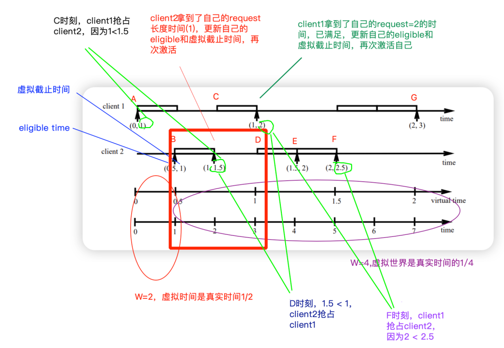

# EEVDF

## EEVDF 简介

### 动机：CFS 的不足之处
> CFS 有一个需要改进的地方就是对于那些有明确 latency 要求的工作的处理。一些进程可能不需要大量的 CPU 时间，但当它们确实需要 CPU 时，要求能尽快拿到。其他进程可能需要更多的 CPU 时间，但如果有必要的话，可以等待一会儿再拿到 CPU。CFS 并没有给进程提供什么方法可以表达他们的 latency 要求；nice 值（优先级）可以用来给进程更多的 CPU 时间，但这不是一回事。实时调度类（realtime scheduling class）可以用在对延迟要求很高的工作上，但如果希望采用 realtime class 来调度运行，这需要有特权才可以实现，而且实时进程会严重影响系统其他部分的运行。
>
> 现在缺少的是一种方法，可以确保一些进程能够快速访问 CPU，而不一定让这些进程会获得超过其公平份额的 CPU 时间。

### EEVDF 涉及的几个基本概念
> EEVDF 全称 “**Earliest Eligible Virtual Deadline First**” 调度算法，它并不是什么新事物，是在 1995 年由 Ion Stoica 和 Hussein Abdel-Wahab 在 1995 年的论文中描述过。它的名字就暗示，它是跟内核的 deadline scheduler 所使用的 Earliest Deadline First algorithm 很类似。但是这里的差异是，EEVDF 不是一个 realtime 时调度程序，所以工作方式不一样。理解 EEVDF 需要掌握几个（相对）简单的概念。
>
> EEVDF 跟 CFS 一样，试图把可用的 CPU 时间公平地分配给正在争夺它的那些进程。例如，如果有五个进程试图在一个 CPU 上运行，那么每个进程应该得到 20% 的可用时间。每个进程的 nice 值可以用来调整其公平时间的计算结果，nice 值较低（因此优先级较高）的进程有权获得更多的 CPU 时间，而牺牲那些具有较高 nice 值的进程。这些内容都是以前就有的概念。
>
> 我们来考虑一下一秒钟时长的一个时间段；在这段时间内，我们的五个进程中，每个进程应该得到 200ms 的 CPU 时间。由于一些原因，没能按照安排来做到，其中一些进程得到了过多的时间，而另一些进程则被缩短了。EEVDF 会对每个进程计算出该进程应该得到的时间和它实际得到的时间之间的差异。这个差异被称为 "**lag（滞后）**"。lag 值为 **正** 的进程就 **没有** 得到公平的份额，应该比 lag 值为负的过程要更早调度。

```c
lag = 任务应该得到的虚拟运行时间 - 任务实际得到的虚拟运行时间
```

> 事实上，当且仅当计算出的 **lag 值大于或等于零** 时，才认为这个进程是 "**合格的（eligible）**"；任何具有负值的 lag 值的进程都都没有资格运行。对于任何 **不合格** 的过程，在未来的某个时间，它有权得到的时间逐渐增长，赶上它实际得到的时间，于是可以再次成为合格的进程；这个时间就被称为 "**合格时间（eligible time）**"。
>
> 因此，lag 值的计算是 EEVDF 调度器中的一个关键部分，大部分的 patch set 都是为了能正确得到这个值。即使使没有完整的 EEVDF 算法，也可以利用一个进程的 lag 值来将其公平地放在运行队列中；lag 值较高的进程应该先运行，从而以使整个系统的 lag 值比较均匀。
>
> 另一个起作用的因素是 "**虚拟截止日期（virtual deadline）**"，它是一个进程应该得到其应有的 CPU 时间的最早时间。这个期限的计算方法是 **将一个进程分配的时间片与它的合格时间值相加**。一个拥有 10ms 时间片的进程，如果其合格时间（eligible time）是未来 20ms，那么它的 virtual deadline 就是未来 30ms

```c
virtual deadline = 任务的 slice / 任务的 weight + 任务再次 eligible 的虚拟时间
```

> EEVDF 的核心理念就可以从它的名字中看出，它将 **首先运行那些具有最早的 virtual deadline 的进程**。因此，调度选择是结合了 fairness（用于计算合格时间的 lag 值）以及每个进程当前有用的时间值来共同决定的。

### 定位延迟的问题

> 有了这个框架之后，对 latency 敏感的进程的优先调度就自然而然地实现好了。当调度器在计算每个进程的时间片时，它会考虑到该进程分配的 latency-nice 值；一个具有较低的 latency-nice 值的进程（也就意味着更严格的 latency 要求）的进程将得到一个更短的时间片。对 latency 相对漠不关心的进程将得到较长的时间片。请注意，给任何两个进程的 CPU 时间（具有相同的 nice 值）将是相同的，但低延迟的进程将获得更多更短小的时间片段。
>
> 前面说过，virtual deadline 是通过将时间片加上 eligible time 而计算出来的。这将导致具有较短时间片的进程可以具有更近的 virtual deadline，因此也会被首先执行。对延迟敏感的进程，通常不需要大量的 CPU 时间，而是希望能快速响应事件；而没有延迟要求的进程将被给予更长的运行时间片，这可以帮助提高吞吐量。不再需要那些启发式的复杂规则来解决这个问题。

### 一个简单的例子

> 举个例子可能有助于理解滞后是如何在决策中起作用的。假设有三个 CPU 密集型任务，分别称为 A、B 和 C，它们都在同一时间开始。在它们中任何一个运行之前，它们的滞后值都为零：

Task | A   | B   | C
-----|-----|-----|----
Lag: | 0ms | 0ms | 0ms

> 由于没有任务的 lag 值为负，所有任务都是可运行的。如果调度器选择 A 作为第一个运行的任务，并且使用 30 毫秒的时间片（随便选择一个数字），如果 A 运行直到时间片用尽，滞后情况将如下所示：

Task | A     | B    | C
-----|-------|------|------
Lag: | -20ms | 10ms | 10ms

> 在这 30ms 内，每个任务都本应得到 10ms（总时间的三分之一）的 CPU 时间。A实际上获得了 30ms，因此它积累了-20ms 的滞后值；其他两个任务由于没有获得任何 CPU 时间，所以滞后了 10ms，反映了它们应该获得的 10ms CPU 时间。
>
> 任务 A 不再是可运行的，所以调度器将不得不选择其他任务中的一个。如果给 B 一个 30ms 的时间片，并且 B 使用它，情况变为：

Task | A     | B     | C
-----|-------|-------|------
Lag: | -10ms | -10ms | 20ms

> 再次，每个任务都赚得了对应于其应得 CPU 时间的 10ms 的滞后值，并且 B 运行了 30ms。现在只有 C 是可运行的，所以调度器的下一个决定是很容易的。
>
> 可以从上面的表格中看到 EEVDF 调度器的一个特性，即 **系统中所有滞后值的总和始终为零**。

### 滞后和睡眠

> 滞后计算仅跟可运行的任务相关；如果一个 task 睡眠了一天，那实际上也并没有错过它的虚拟运行时间（因为它没有），因此它不会积累出巨大的滞后值。然而，当任务入睡时，调度器会保留任务的当前滞后值，并在任务唤醒时从该值开始继续。因此，如果一个任务在入睡前已经超出了其分配的时间，那么它将在之后被唤醒时为此付出代价。
>
> 然而，会有这样一种情况，此时保留任务的滞后值可能没有意义。那个刚睡了一天的任务真的应该因为昨天被允许运行得有点超过其分配而受到惩罚吗？很明显，迟早，任务的滞后值应该恢复为零。但是何时恢复并不完全清楚。正如 Zijlstra 在 [这个](https://lwn.net/ml/linux-kernel/20240405110010.631664251@infradead.org/) 系列的补丁中指出的，在睡眠时立即把滞后值忘掉，就能使任务能够在时间片结束时（其滞后可能为负）短暂入睡，结果是它们获得了更多的 CPU 时间。简单地随时间来对滞后值进行衰减也不会有多大作用，他总结说，因为滞后值与虚拟运行时间相关，而虚拟运行时间以不同（并且变化的）速度在流逝。
>
> 解决方案是 **在虚拟运行时间内对正在睡眠的任务的滞后值进行衰减**。在补丁集中，这个想法的实现挺有趣的。当一个任务入睡时，它通常会从运行队列中被删除，以便调度器无需再考虑它。但是，通过这个新的补丁，一个去睡觉的/不合格的/进程将会留在队列中，但被标记为“**延迟出队（deferred dequeue）**”。由于它是不合格的，所以它不会被选择执行，但它的滞后值将根据经过的虚拟运行时间而增加。一旦滞后变为正数，调度器将注意到任务并将其从运行队列中移除。
>
> 这个实现的结果是，**短暂入睡的任务将无法摆脱负的滞后值**，但长时间入睡的任务最终将被免除其滞后值的债务。有趣的是，**正的滞后值将被无限期地保留**，直到任务再次运行。

### 时间片控制
> 如上所述，具有较短时间片的任务将具有更早的虚拟截止时间，导致调度器更早地选择它们。但是，在当前的内核中，当调度器寻找要运行的新任务时，这种隐式的优先级只有在实际任务醒来时才会生效。如果一个具有较短时间片的延迟敏感任务醒来，它可能仍然必须等待当前任务用尽其时间片（可能很长）才能运行。然而，Zijlstra 的补丁系列通过允许一个任务在其虚拟截止时间更早时抢占另一个任务来改变这一点。这种改变为短时间片任务提供一致性更好的执行节奏，同时可能稍微降低了长时间运行任务的速度。
>
> 然而，还有一个问题：如何指定某个任务应该获得较短的时间片？在当前的内核中，非实时进程无法告诉内核其时间片应该是多少，因此这组补丁系列添加了这个能力。具体来说，一个任务可以使用 [sched_setattr() 系统调用](https://man7.org/linux/man-pages/man2/sched_setattr.2.html)，在 `sched_attr` 结构的 `sched_runtime` 字段中传递所需的片段时间（以纳秒为单位）。在当前的内核中，这个字段只用于 [deadline scheduling](https://lwn.net/Articles/743740/)。通过这个补充，任何任务都可以请求更短的时间片，这将导致它更早地运行，可能更频繁地运行。然而，如果请求的时间片太短，任务将经常被抢占，总体运行速度会变慢。
>
> 时间片的允许范围为 *100 微秒（us）到 100 毫秒（ms）*。

* 如果任务没有设置 `sched_runtime`，则系统采用默认值。EEVDF 里面有个一个配置参数叫：`sysctl_sched_base_slice`（由 CFS 的`sysctl_sched_min_granularity` 更名而来），默认情况下为 `0.70 msec * (1 + ilog(ncpus))`：

```c
/*
 * Minimal preemption granularity for CPU-bound tasks:
 *
 * (default: 0.70 msec * (1 + ilog(ncpus)), units: nanoseconds)
 */
unsigned int sysctl_sched_base_slice            = 700000ULL;
static unsigned int normalized_sysctl_sched_base_slice  = 700000ULL;

/*
 * Increase the granularity value when there are more CPUs,
 * because with more CPUs the 'effective latency' as visible
 * to users decreases. But the relationship is not linear,
 * so pick a second-best guess by going with the log2 of the
 * number of CPUs.
 *
 * This idea comes from the SD scheduler of Con Kolivas:
 */
static unsigned int get_update_sysctl_factor(void)
{
    unsigned int cpus = min_t(unsigned int, num_online_cpus(), 8);
    unsigned int factor;

    switch (sysctl_sched_tunable_scaling) {
    case SCHED_TUNABLESCALING_NONE:
        factor = 1;
        break;
    case SCHED_TUNABLESCALING_LINEAR:
        factor = cpus;
        break;
    case SCHED_TUNABLESCALING_LOG:
    default:
        factor = 1 + ilog2(cpus);
        break;
    }

    return factor;
}

static void update_sysctl(void)
{
    unsigned int factor = get_update_sysctl_factor();

#define SET_SYSCTL(name) \
    (sysctl_##name = (factor) * normalized_sysctl_##name)
    SET_SYSCTL(sched_base_slice);
#undef SET_SYSCTL
}
```

* 关于 `get_update_sysctl_factor()` 函数和 `sysctl_sched_tunable_scaling` 参数的介绍，见 [CFS 调度器-1](sched_cfs-1.md)
* 假设系统有 8 个核，那么 `factor=4`，最终的 `base_slice` 就为 `0.70ms * 4 = 2.8ms`

### 调度周期
* 在 EEVDF 的情况下，调度周期 P 的计算方法如下：
  * `W` 是所有任务的权重累计
  * s<sub>i</sub> 是任务 `i` 的时间片（slice）
  * w<sub>i</sub> 是任务 `i` 的权重（weight）

$$
P = W * max(\frac {s_i} {w_i})
$$

* 某个特定任务 `i` 的平均周期 P<sub>i</sub> 是：

$$
P_i = W * (\frac {s_i} {w_i})
$$

* 由此可见，整个 EEVDF 的调度周期，也是所有任务中平均调度周期最大的那个任务的平均调度周期。
* 每个任务公平地获得调度周期中的如下时间：

$$
s_i = P * \frac {w_i} {W}
$$

### 论文中推演的例子



* 上图中 D 时刻的描述有一个错误，virtual deadline 应该是 `1.5 < 2`，client 2 抢占 client 1，而不是 `1.5 < 1` 
* Eligible time 不是个 delta，而是 per-task 的某个时刻，它的计算跟权重（weight）有关，和请求的时间片（slice）无关。因此在权重一样的情况下，对时间的占用是公平的
  * 后面可以看到，其实它就是每个调度实体的 `vruntime`。选择任务的时候会通过 `vruntime_eligible()` 进行合格性检查，其实就是与应得的虚拟运行时间做个比较（相当于算了个 delta），所以与之前的理论并不冲突。这一点大部分文章没有点明，是不是纠结了这么久，知道真相后是不是眼泪都要掉下来了
* Virtual deadline 的计算跟请求的时间片有关，请求的时间片越小，计算出来的 virtual deadline 会越接近

### 加权平均虚拟运行时间

* **cfs_rq.avg_vruntime** 是 CFS 运行队列中所有调度实体的加权 **相对** 虚拟运行时间“`(se->vruntime - cfs_rq.min_vruntime) × se->load.weight`”（相对的基准是 `cfs_rq.min_vruntime`）的总和
  * `se->vruntime` 是调度实体 `se` 的虚拟运行时间
  * `cfs_rq.min_vruntime` 是 CFS 运行队列的最小虚拟运行时间
  * `se->load.weight` 是调度实体 `se` 的权重

$$
avg\_vruntime = \sum_{i=1}^{n} (v_i - v_{min}) * w_i
$$

* **cfs_rq.avg_load** 是所有调度实体的权重总和
* `cfs_rq.avg_vruntime / cfs_rq.avg_load` 是 CFS 运行队列的 **加权平均相对虚拟运行时间**，加上 `cfs_rq.min_vruntime` 以后就是 CFS 运行队列的 **加权平均虚拟运行时间**
* **加权平均虚拟运行时间是每个进程应得的虚拟运行时间**，是理想化的
* 从 per-task 的服务数字计算虚拟时间：
* 完全公平调度器保证 lag 的总和为零

$$
\sum lag_i = 0
$$

* lag<sub>i</sub> 按如下方式获得：
  * `S` 是理想的服务时间
  * `V` 是它对应的虚拟时间
$$
lag_i = S - s_i = w_i * (V - v_i)
$$

* 因此：

$$
\sum lag_i = 0
$$
$$
\sum w_i * (V - v_i) = 0
$$
$$
\sum w_i * V - w_i * v_i = 0
$$

* 从这我们可以推导出一个从 v<sub>i</sub>（我们已知 `se->vruntime`）到 `V` 的表达式

$$
V = \frac {\sum v_i * w_i}{\sum w_i} = \frac {\sum v_i * w_i}{W}        
$$

* 特别是，这是所有实体虚拟运行时间的加权平均值
* 注意：只有在加入/离开操作发生在 lag<sub>i</sub> = 0 的条件下，这才等于理想的调度器，否则虚拟时间会有不连续的摆动，相当于：

$$
V +-= \frac {lag_i}{W}
$$

* 也看看在 `place_entity()` 中处理此事的注释
* 然而，由于 v<sub>i</sub> 类型是 `u64`，并且乘法运算很容易溢出，将其转换为使用较小数量的相对形式：
* 替换：$v_i == (v_i - v0) + v0$

$$
V = \frac {\sum ((v_i - v0) + v0) * w_i}{W} = \frac {\sum (v_i - v0) * w_i} {W} + v0                                        
$$

* 我们用以下变量来跟踪：
  * $v0 :=$ `cfs_rq->min_vruntime`
  * $\sum (v_i - v0) * w_i :=$ `cfs_rq->avg_vruntime`
  * $\sum w_i := W =$ `cfs_rq->avg_load`
* 由于 `min_vruntime` 是一个单调递增的变量，它密切跟踪 per-task 服务，因此这些 $\Delta$：$(v_i - v)$ 将按照系统中由于量化而引起的最大（虚拟） lag 的顺序排列
* 同样，我们使用 `scale_load_down()` 来减小大小
* 据测量，对于内核构建，`max(key * weight)`值为 `~44` 位

## EEVDF 的实现
* 前面理论知识了解的差不多了，后面看看这么将理论变成实现

### 从 CFS 运行队列添加或删除调度实体
* 当有调度实体进入或退出 CFS 运行队列时，会影响到以下两个求和公式中的值
  * $\sum (v_i - v0) * w_i :=$ `cfs_rq->avg_vruntime`
  * $\sum w_i := W =$ `cfs_rq->avg_load`
* 相关的几个宏定义
  * kernel/sched/sched.h
```c
# define SCHED_FIXEDPOINT_SHIFT     10
# define SCHED_FIXEDPOINT_SCALE     (1L << SCHED_FIXEDPOINT_SHIFT)

#ifdef CONFIG_64BIT
# define NICE_0_LOAD_SHIFT  (SCHED_FIXEDPOINT_SHIFT + SCHED_FIXEDPOINT_SHIFT)
# define scale_load(w)      ((w) << SCHED_FIXEDPOINT_SHIFT)
# define scale_load_down(w)                 \
({                              \
    unsigned long __w = (w);                \
                                \
    if (__w)                        \
        __w = max(2UL, __w >> SCHED_FIXEDPOINT_SHIFT);  \
    __w;                            \
})
#else
# define NICE_0_LOAD_SHIFT  (SCHED_FIXEDPOINT_SHIFT)
# define scale_load(w)      (w)
# define scale_load_down(w) (w)
#endif
```
* kernel/sched/fair.c
```c
static inline s64 entity_key(struct cfs_rq *cfs_rq, struct sched_entity *se)
{
    return (s64)(se->vruntime - cfs_rq->min_vruntime);
}
```

* 把调度实体添加到 CFS 运行队列的时候，作为求和公式中的项需要加上
```cpp
enqueue_task_fair()
-> enqueue_entity()
   -> __enqueue_entity()
      -> avg_vruntime_add()

static void
avg_vruntime_add(struct cfs_rq *cfs_rq, struct sched_entity *se)
{
    unsigned long weight = scale_load_down(se->load.weight);
    s64 key = entity_key(cfs_rq, se);

    cfs_rq->avg_vruntime += key * weight;
    cfs_rq->avg_load += weight;
}

static void __enqueue_entity(struct cfs_rq *cfs_rq, struct sched_entity *se)
{
    avg_vruntime_add(cfs_rq, se); //处理对 V 和 W 的影响
    se->min_vruntime = se->vruntime; //预设 se 的最小虚拟运行时间
    se->min_slice = se->slice;       //预设 se 的最小时间片
    rb_add_augmented_cached(&se->run_node, &cfs_rq->tasks_timeline,
                __entity_less, &min_vruntime_cb);
}
```
* 把调度实体从 CFS 运行队列删除的时候，作为求和公式中的项需要减掉
```c
dequeue_task_fair()
-> dequeue_entities()
   -> dequeue_entity()
      -> __dequeue_entity()
         -> avg_vruntime_sub()

static void
avg_vruntime_sub(struct cfs_rq *cfs_rq, struct sched_entity *se)
{
    unsigned long weight = scale_load_down(se->load.weight);
    s64 key = entity_key(cfs_rq, se);

    cfs_rq->avg_vruntime -= key * weight;
    cfs_rq->avg_load -= weight;
}

static void __dequeue_entity(struct cfs_rq *cfs_rq, struct sched_entity *se)
{
    rb_erase_augmented_cached(&se->run_node, &cfs_rq->tasks_timeline,
                  &min_vruntime_cb);
    avg_vruntime_sub(cfs_rq, se); //处理对 V 和 W 的影响
}
```

### 增强型红黑树
#### 1. 基本概念
* 普通的红黑树是一种自平衡的二叉搜索树，它通过着色和旋转规则来保持树的平衡，从而确保基本操作（插入、删除、查找）的时间复杂度为 `O(log n)`
* 增强型红黑树则在每个节点上存储额外的信息（称为“augment”），这些信息是从该节点的子树中计算得来的
* 在 EEVDF 调度器中，这个额外信息就是子树中的最小 `vruntime` 值
#### 2. 为什么需要增强
* 在 EEVDF 调度器中，我们需要快速找到满足条件（eligible）且具有最早虚拟截止时间（deadline）的任务。如果使用普通的红黑树，我们只能通过遍历树来找到这样的任务，这可能需要 `O(n)`时间
* 通过在每个节点上维护子树的最小 `vruntime`，我们可以在搜索过程中利用这个信息来跳过不满足条件的子树（例如，如果某个子树的最小 `vruntime` 大于当前队列的 `min_vruntime`，那么该子树中就没有 eligible 的任务），从而将搜索时间降到 `O(log n)`
#### 3. 操作中的维护
* 当插入或删除一个节点时，不仅需要调整树的结构以保持红黑树的性质，还需要更新从该节点到根节点路径上所有节点的增强信息（min_vruntime）
* 由于树的高度是 `O(log n)`，因此这些操作仍然可以在 `O(log n)` 时间内完成
#### 4. EEVDF 中的使用
* 在 EEVDF 的 `pick_eevdf()` 函数中，我们利用增强信息（`min_vruntime`）来指导搜索方向，见后面详解
1. 内核中的实现：
   * Linux 内核提供了通用的增强型红黑树接口。定义节点时，需要指定如何计算增强信息。例如，在调度器中，节点定义为：
```c   
struct sched_entity {
...
    struct rb_node rb_node;
    u64 min_vruntime;   // 该节点子树的min_vruntime（包括自身）
...
};
```
   * 然后，需要提供一个回调函数，用于在节点改变时更新增强信息。例如：
     * include/linux/rbtree_augmented.h
```c
/*
 * Template for declaring augmented rbtree callbacks (generic case)
 *
 * RBSTATIC:    'static' or empty
 * RBNAME:      name of the rb_augment_callbacks structure
 * RBSTRUCT:    struct type of the tree nodes
 * RBFIELD:     name of struct rb_node field within RBSTRUCT
 * RBAUGMENTED: name of field within RBSTRUCT holding data for subtree
 * RBCOMPUTE:   name of function that recomputes the RBAUGMENTED data
 */

#define RB_DECLARE_CALLBACKS(RBSTATIC, RBNAME,              \
                 RBSTRUCT, RBFIELD, RBAUGMENTED, RBCOMPUTE) \
```
* 声明一个用于更新红黑树上 `se->min_vruntime` 的增强计算回调函数 `min_vruntime_cb()`
  * kernel/sched/fair.c
```c
RB_DECLARE_CALLBACKS(static, min_vruntime_cb, struct sched_entity,
             run_node, min_vruntime, min_vruntime_update);
```
* 红黑树遍历节点信息时会调用增强计算回调函数 `min_vruntime_update()`
```c
#define vruntime_gt(field, lse, rse) ({ (s64)((lse)->field - (rse)->field) > 0; })

static inline void __min_vruntime_update(struct sched_entity *se, struct rb_node *node)
{
    if (node) {
        struct sched_entity *rse = __node_2_se(node); //左或右子树的调度实体
        if (vruntime_gt(min_vruntime, se, rse))   //如果本节点的最小虚拟运行时间大于左或右子树的
            se->min_vruntime = rse->min_vruntime; //更新本节点的最小虚拟运行时间为子树的
    }
}
...
/*
 * se->min_vruntime = min(se->vruntime, {left,right}->min_vruntime)
 */
static inline bool min_vruntime_update(struct sched_entity *se, bool exit)
{
    u64 old_min_vruntime = se->min_vruntime; //记录下旧的最小虚拟运行时间
    u64 old_min_slice = se->min_slice;       //记录下旧的最小时间片
    struct rb_node *node = &se->run_node;

    se->min_vruntime = se->vruntime; //更新本节点的最小虚拟运行时间为当前的虚拟运行时间
    //如果本节点的最小虚拟运行时间大于左子树的，用左子树的最小虚拟运行时间作为本 se 的最小虚拟运行时间
    __min_vruntime_update(se, node->rb_right);
    //如果本节点此时的最小虚拟运行时间（包含左子树的）大于右子树的，
    //用右子树的最小虚拟运行时间作为本 se 的最小虚拟运行时间
    __min_vruntime_update(se, node->rb_left);
    //这就实现了 se->min_vruntime = min(se->vruntime, {left,right}->min_vruntime)
    se->min_slice = se->slice;
    __min_slice_update(se, node->rb_right);
    __min_slice_update(se, node->rb_left);
    //最小时间片同理
    return se->min_vruntime == old_min_vruntime &&
           se->min_slice == old_min_slice; //发生变化返回 true，向上传播更新
}
```
   * 内核的红黑树增强框架会自动在插入、删除等操作后调用这个计算函数来更新路径上的节点
2. 增强的更新：
   * 增强计算回调函数返回 `true` 表示向上传播更新
   * 在旋转操作（左旋或右旋）后，会调用回调函数重新计算受影响节点的增强信息
3. 性能：
   * 由于每次搜索都可以根据子树的信息跳过部分子树，因此整个搜索过程的时间复杂度为 `O(log n)`
* 涉及的两个增强红黑树接口 `rb_add_augmented_cached()` 和 `rb_erase_augmented_cached()`

### `cfs_rq.min_vruntime` 单调递增时
* `cfs_rq.min_vruntime` 单调递增的时候，需要把 `cfs_rq.avg_vruntime` 减去 `cfs_rq.avg_load × delta`
* 对于 $\sum (v_i - v0) * w_i := avg\_vruntime$，`v0` 单调递增 $\Delta$，于是递增后有 `avg_vruntime'`：
$$
avg\_vruntime' = \sum (v_i - (v0 + \Delta)) * w_i
$$
$$
avg\_vruntime' = \sum (v_i - v0) * w_i - \Delta * \sum w_i
$$
$$
avg\_vruntime' = avg\_vruntime - \Delta * W
$$

```c
static inline
void avg_vruntime_update(struct cfs_rq *cfs_rq, s64 delta)
{
    /*
     * v' = v + d ==> avg_vruntime' = avg_runtime - d*avg_load
     */
    cfs_rq->avg_vruntime -= cfs_rq->avg_load * delta;
}
```

### 虚拟 lag 和虚拟截止时间
#### 计算 CFS 运行队列的加权平均虚拟运行时间（V）
```c
/*
 * Specifically: avg_runtime() + 0 must result in entity_eligible() := true
 * For this to be so, the result of this function must have a left bias.
 */
u64 avg_vruntime(struct cfs_rq *cfs_rq)
{
    struct sched_entity *curr = cfs_rq->curr;
    s64 avg = cfs_rq->avg_vruntime;
    long load = cfs_rq->avg_load;
    //如果当前进程在运行，也要把它计算在加权相对虚拟运行时间的总和之内
    if (curr && curr->on_rq) {
        unsigned long weight = scale_load_down(curr->load.weight);

        avg += entity_key(cfs_rq, curr) * weight;
        load += weight;
    }
    //计算加权平均相对虚拟运行时间
    if (load) {
        /* sign flips effective floor / ceiling */
        if (avg < 0)
            avg -= (load - 1);
        avg = div_s64(avg, load);
    }
    //返回加权平均虚拟运行时间
    return cfs_rq->min_vruntime + avg;
}
```
#### 计算虚拟 lag
* 任务 **应该** 得到的虚拟运行时间就是 **CFS 运行队列的加权平均虚拟运行时间**，即 `V`
* 任务 **实际** 得到的虚拟运行时间就是 **调度实体的虚拟运行时间**，即 v<sub>i</sub>
  ```c
  se->vlag = (cfs_rq.min_vruntime + (cfs_rq.avg_vruntime / cfs_rq.avg_load)) - se->vruntime
  ```
  * `n` 取“2倍时间片”和 `TICK_NSEC`（1个 tick 对应的纳秒值）的最大值
  * `limit` 是 `(n × 1024) / se->load.weight`
  * `se->vlag` 的取值范围是 `[-limit, limit]`
```c
/*
 * lag_i = S - s_i = w_i * (V - v_i)
 *
 * However, since V is approximated by the weighted average of all entities it
 * is possible -- by addition/removal/reweight to the tree -- to move V around
 * and end up with a larger lag than we started with.
 *
 * Limit this to either double the slice length with a minimum of TICK_NSEC
 * since that is the timing granularity.
 *
 * EEVDF gives the following limit for a steady state system:
 *
 *   -r_max < lag < max(r_max, q)
 *
 * XXX could add max_slice to the augmented data to track this.
 */
static void update_entity_lag(struct cfs_rq *cfs_rq, struct sched_entity *se)
{
    s64 vlag, limit;

    WARN_ON_ONCE(!se->on_rq);
    //虚拟 lag = CFS 运行队列的加权平均虚拟运行时间 - 调度实体的虚拟运行时间
    vlag = avg_vruntime(cfs_rq) - se->vruntime;
    limit = calc_delta_fair(max_t(u64, 2*se->slice, TICK_NSEC), se); //转成虚拟时间
    //限定虚拟 lag 的范围在 [-limit, limit]
    se->vlag = clamp(vlag, -limit, limit);
}
```

#### 合格的调度实体
* **合格的调度实体** 是虚拟 lag `se->vlag` 大于等于 `0` 的调度实体
  * 即 *CFS 运行队列的加权平均虚拟运行时间* 大于或等于 *调度实体的虚拟运行时间*
  * 即符合条件 `se->vruntime <= (cfs_rq.min_vruntime + (cfs_rq.avg_vruntime / cfs_rq.avg_load))` 的调度实体
* 根据 $lag_i = S - s_i = w_i*(V - v_i)$，合格的调度实体如需符合 $lag_i >= 0$，则需符合 $V >= v_i$
* 根据 $V = \frac {\sum (v_i - v0) * w_i} {W} + v0$，且 $lag_i >= 0$，可以推导出需满足的条件为：

$$
\sum (v_i - v0)*w_i >= (v_i - v0)*(\sum w_i)
$$

* **注意**：直接使用 `avg_vruntime() > se->vruntime` 的对比结果是不精确的，因为 `avg_vruntime()` 里用到的除法会造成精度的丢失，用以上公式可以转变为乘法的比较

```c
//看之前的推导，这里直接用虚拟的运行时间比较即可知道调度实体是否合格，无需用实际的时间去比较
static int vruntime_eligible(struct cfs_rq *cfs_rq, u64 vruntime)
{
    struct sched_entity *curr = cfs_rq->curr;
    s64 avg = cfs_rq->avg_vruntime;
    long load = cfs_rq->avg_load;
    //如果当前进程在运行，也要把它计算在加权相对虚拟运行时间的总和之内
    if (curr && curr->on_rq) {
        unsigned long weight = scale_load_down(curr->load.weight);

        avg += entity_key(cfs_rq, curr) * weight;
        load += weight;
    }

    return avg >= (s64)(vruntime - cfs_rq->min_vruntime) * load;
}
//调度实体是否合格？
int entity_eligible(struct cfs_rq *cfs_rq, struct sched_entity *se)
{
    return vruntime_eligible(cfs_rq, se->vruntime);
}
```

#### 计算虚拟截止时间
* `se->slice` 是时间片长度，由于是计算虚拟的截止时间，所以还要转换成加权之后的值
* `se->vruntime` 就是上面推演图里的 eligible time
  ```c
  se->deadline = se->vruntime + ((se->slice × 1024) / se->load.weight)
  ```
* 严格地说：$vd_i += \frac {N * s_i}{w_i}$，所以：$vd_i > v_i$ 时，这很可能足够好了，不需要更新调度实体的虚拟截止时间
  * kernel/sched/fair.c
```c
/*
 * XXX: strictly: vd_i += N*r_i/w_i such that: vd_i > ve_i
 * this is probably good enough.
 */
static bool update_deadline(struct cfs_rq *cfs_rq, struct sched_entity *se)
{   //虚拟运行时间小于虚拟截止时间，不需要更新该调度实体的虚拟截止时间
    if ((s64)(se->vruntime - se->deadline) < 0)
        return false; //虚拟截止时间没变，不需要重新调度
    //如果没有定制过时间片，则用基础时间片
    /*
     * For EEVDF the virtual time slope is determined by w_i (iow.
     * nice) while the request time r_i is determined by
     * sysctl_sched_base_slice.
     */
    if (!se->custom_slice)
        se->slice = sysctl_sched_base_slice;
    //虚拟截止时间 = 虚拟运行时间 + 加权的时间片
    /*
     * EEVDF: vd_i = ve_i + r_i / w_i
     */
    se->deadline = se->vruntime + calc_delta_fair(se->slice, se);
    //虚拟截止时间发生改变，需要重新调度
    /*
     * The task has consumed its request, reschedule.
     */
    return true;
}
```

### 时间片长度
* `sched_entity.slice` 是普通进程的时间片长度
  * 默认值是 `sysctl_sched_base_slice`，前面已经讲过了，可以通过文件 `/sys/kernel/debug/sched/base_slice_ns` 修改基本时间片
* 通过系统调用 `sched_setattr()` 使用结构体 `sched_attr` 的字段 `sched_runtime` 为普通进程设置时间片，单位是纳秒，取值范围是 `[0.1, 100] ms`
* `se->custom_slice` 为 `1` 表示使用定制的时间片，也就是进程设置了时间片
```c
SYSCALL_DEFINE3(sched_setattr)
-> sched_setattr()
   -> __sched_setscheduler(p, attr, true, true)
      -> __setscheduler_params()
         -> __setparam_fair()

void __setparam_fair(struct task_struct *p, const struct sched_attr *attr)
{
    struct sched_entity *se = &p->se;
    //设置静态优先级
    p->static_prio = NICE_TO_PRIO(attr->sched_nice);
    if (attr->sched_runtime) { //如果用户设置了 sched_attr.sched_runtime 字段
        se->custom_slice = 1;  //使用定制的时间片
        se->slice = clamp_t(u64, attr->sched_runtime,
                      NSEC_PER_MSEC/10,   /* HZ=1000 * 10 */
                      NSEC_PER_MSEC*100); /* HZ=100  / 10 */
    } else { //否则时间片采用基本时间片
        se->custom_slice = 0;
        se->slice = sysctl_sched_base_slice;
    }
}
...
static void __setscheduler_params(struct task_struct *p,
        const struct sched_attr *attr)
{
    int policy = attr->sched_policy; //将要设置的调度策略
    //如果将要要设置的调度策略是 SETPARAM_POLICY 表示不修改调度策略
    if (policy == SETPARAM_POLICY)
        policy = p->policy;
    //更新调度策略，如果需要的话
    p->policy = policy;
    //根据调度策略更新参数
    if (dl_policy(policy))
        __setparam_dl(p, attr);
    else if (fair_policy(policy))
        __setparam_fair(p, attr);
...
}
```
### 进程选择
* `entity_before(a, b)` 比较两个调度实体的虚拟截止时间，`a` 在 `b` 之前返回 `true`，反之返回 `false`
```c
static inline bool entity_before(const struct sched_entity *a,
                 const struct sched_entity *b)
{
    /*
     * Tiebreak on vruntime seems unnecessary since it can
     * hardly happen.
     */
    return (s64)(a->deadline - b->deadline) < 0;
}
```
* 调度实体 `struct sched_entity` 的 `struct rb_node run_node` 域挂在红黑树上的，提供 `node` 的地址，返回其所属的调度实体的地址
```c
#define __node_2_se(node) \
    rb_entry((node), struct sched_entity, run_node)
```
* 为了保证不同请求大小的延迟，EEVDF 从两个标准中选择最佳的可运行任务：
  1. 任务必须是合格的（必须是欠服务）
  2. 从满足 1 的任务中，我们选择虚拟截止时间最早的任务
* 我们可以在 `O(log n)` 的时间内完成，因为有增强的红黑树。红黑树根据虚拟截止时间对条目进行排序，但也可以基于 `vruntime` 作为堆，通过保持以下条件允许通过合格性来修剪树木（快速跳过不合格子树）
  * `se->min_vruntime` 是以 `se` 为根的子树的最小虚拟运行时间，等于 `se->vruntime`、`left->min_vruntime` 和 `right->min_vruntime` 的最小值
  * `left` 是 `se` 的左孩子，`right` 是 `se` 的右孩子
    ```c
    se->min_vruntime = min(se->vruntime, se->{left,right}->min_vruntime)
    ```
* 红黑树增强结构：
  * 每个节点维护 `min_vruntime`（从其子树中各个节点的 `vruntime` 中选出的最小虚拟运行时间），通过比较 `cfs_rq->min_vruntime` 与子树 `min_vruntime`，快速跳过不合格子树
  * `vruntime_eligible(cfs_rq, vruntime)` 本来用来判断某个实体的 vlag 是否合法，但这里将 `se->min_vruntime` 作为 `vruntime` 参数，快速判断整个子树是否合格 
* 可见这里调度实体有双重属性，`min_runtime` 关乎合格性，`deadline` 关乎紧迫性，前者是前提，但这两个属性又是有内在关联的
  * `deadline` 来自 `vruntime` 与加权过的时间片的和，随着任务的不断运行，`vruntime` 不断增加，必然推后任务在红黑树上的位置
  * 同时，随着 `vruntime` 的不断增加，任务可能不再影响其父节点的 `min_runtime` 的变化，而是由子树上其他 `vruntime` 的影响，当整个子树的 `vruntime` 都变大了 `min_runtime` 自然也就水涨船高，最后导致整个子树都不合格 
* 函数的 **核心思想** 是：
  * 在红黑树中，按照截止时间排序（最左边是最早截止时间），同时每个节点维护一个 `min_vruntime`（子树中最小的虚拟运行时间）
  * 我们尝试在红黑树中找到最佳节点 `best`
    * 首先尝试选择最左边的符合条件的实体，
    * 如果不符合条件，则通过比较子树的最小虚拟运行时间来决定是否进入左子树（因为左子树的截止时间更早，所以如果有符合条件的，则一定在左子树中），
    * 否则检查当前节点，
    * 最后再检查右子树。
  * 最后，如果当前任务 `curr` 比我们找到的 `best` 更好（即截止时间更早），则选择当前任务。这是因为在遍历树的过程中，当前任务可能不在树中（因为它正在运行），所以需要单独比较。
    * 需要注意的是，当前任务可能因为不在运行队列（`on_rq`）或者不符合条件而被排除，但如果它在运行队列且符合条件，并且没有在树中被选中（因为树中存储的是等待运行的任务，而当前任务正在运行，但可能被抢占），那么我们仍然需要将它与树中找到的候选者进行比较。
  * 因此，该函数返回的是符合条件且具有最早虚拟截止时间的任务，这个任务可能是树中的一个任务，也可能是当前任务（如果当前任务符合条件且截止时间更早的话）。

```c
/*
 * Earliest Eligible Virtual Deadline First
 *
 * In order to provide latency guarantees for different request sizes
 * EEVDF selects the best runnable task from two criteria:
 *
 *  1) the task must be eligible (must be owed service)
 *
 *  2) from those tasks that meet 1), we select the one
 *     with the earliest virtual deadline.
 *
 * We can do this in O(log n) time due to an augmented RB-tree. The
 * tree keeps the entries sorted on deadline, but also functions as a
 * heap based on the vruntime by keeping:
 *
 *  se->min_vruntime = min(se->vruntime, se->{left,right}->min_vruntime)
 *
 * Which allows tree pruning through eligibility.
 */
static struct sched_entity *pick_eevdf(struct cfs_rq *cfs_rq)
{
    struct rb_node *node = cfs_rq->tasks_timeline.rb_root.rb_node; //CFS 运行队列红黑树的根节点
    struct sched_entity *se = __pick_first_entity(cfs_rq); //缓存的红黑树最左的节点
    struct sched_entity *curr = cfs_rq->curr; //获取当前正在运行的调度实体
    struct sched_entity *best = NULL; //声明一个 best 变量用于存储最终选择的实体
    //如果当前运行队列上只有一个任务在排队且不在树上，跳过合格性检查，直接返回这个任务，否则返回调度实体（在树上）
    /*
     * We can safely skip eligibility check if there is only one entity
     * in this cfs_rq, saving some cycles.
     */
    if (cfs_rq->nr_queued == 1)
        return curr && curr->on_rq ? curr : se; //直接返回唯一任务
    //当前任务存在，不在运行，或者在运行但已不合格，curr 指向 NULL；否则它会参与和树上选出的最佳实体做最终的比较
    if (curr && (!curr->on_rq || !entity_eligible(cfs_rq, curr)))
        curr = NULL;
    //如果启用了 RUN_TO_PARITY 调度特性，并且当前任务存在，并且需要保护其时间片（见详解），
    //则直接返回当前任务。这是为了避免在当前任务的时间片用完之前被抢占
    if (sched_feat(RUN_TO_PARITY) && curr && protect_slice(curr))
        return curr;
    //缓存的红黑树最左的节点（虚拟截止时间最近），如果 vlag 合格，那就是最佳选择
    /* Pick the leftmost entity if it's eligible */
    if (se && entity_eligible(cfs_rq, se)) {
        best = se;
        goto found;
    }
    //如果最左节点不合格，从 CFS 运行队列红黑树的根节点开始搜索
    /* Heap search for the EEVD entity */
    while (node) {
        struct rb_node *left = node->rb_left;
        //优先搜索左子树（因其有更早的截止时间），se.min_vruntime 记录其子树最小的虚拟运行时间，
        //如果它不合格，整个子树都不合格了；如果合格，在子树中继续搜寻截止时间最近的节点
        /*
         * Eligible entities in left subtree are always better
         * choices, since they have earlier deadlines.
         */
        if (left && vruntime_eligible(cfs_rq,
                    __node_2_se(left)->min_vruntime)) {
            node = left;
            continue;
        }
        //当前节点任务
        se = __node_2_se(node);
        //左子树为空或者没有合格的实体，检查当前节点，因为它的虚拟截止时间排在所有左子数后面，
        //如果它的 vlag 合格，那么它就是最佳选择了
        /*
         * The left subtree either is empty or has no eligible
         * entity, so check the current node since it is the one
         * with earliest deadline that might be eligible.
         */
        if (entity_eligible(cfs_rq, se)) {
            best = se;
            break;
        }
        //转向右子树搜索
        node = node->rb_right;
    }
found:
    //如果之前没找到最佳实体，或者找到了，但当前任务的虚拟截止时间比从树上找到的实体更小
    if (!best || (curr && entity_before(curr, best)))
        best = curr; //仍然选择当前任务
    //如果树上找到的最佳实体虚拟截止时间比当前任务小，它是真正的最佳选择
    return best;
}
```
* 任务选择方法的实现
```c
__pick_next_task_fair()
-> pick_next_task_fair(rq, prev, NULL)
   -> pick_task_fair(rq)
      -> pick_next_entity(rq, cfs_rq)

static struct sched_entity *
pick_next_entity(struct rq *rq, struct cfs_rq *cfs_rq)
{
    struct sched_entity *se;
    //队列上的下一个调度实体被指定，只要其合格就调度，不在乎公平性
    /*
     * Picking the ->next buddy will affect latency but not fairness.
     */
    if (sched_feat(PICK_BUDDY) &&
        cfs_rq->next && entity_eligible(cfs_rq, cfs_rq->next)) {
        /* ->next will never be delayed */
        WARN_ON_ONCE(cfs_rq->next->sched_delayed); //->next 绝不会被推迟
        return cfs_rq->next;
    }
    //如果 ->next 不合格还得从队列上选
    se = pick_eevdf(cfs_rq);
    if (se->sched_delayed) { //选中延迟出队的进程的时候把它从运行队列删除
        dequeue_entities(rq, se, DEQUEUE_SLEEP | DEQUEUE_DELAYED);
        /*
         * Must not reference @se again, see __block_task().
         */
        return NULL;
    }
    return se;
}
```

#### `RUN_TO_PARITY` 特性保护时间片 `protect_slice()`
* `SCHED_FEAT(RUN_TO_PARITY)` 调度特性的字面意思是“跑到平等”，意为禁止（唤醒）抢占，直到当前任务
  * 运行到 0-lag 的点（不再亏欠或多跑的虚拟运行时间）
  * 或者耗尽其时间片
```c
/*
 * Inhibit (wakeup) preemption until the current task has either matched the
 * 0-lag point or until is has exhausted it's slice.
 */
SCHED_FEAT(RUN_TO_PARITY, true)
```
* `set_protect_slice()` 在选取任务的点将虚拟截止时间的拷贝暂存在虚拟 lag 中，它不会被使用直到被移出队列
```c
/*
 * HACK, stash a copy of deadline at the point of pick in vlag,
 * which isn't used until dequeue.
 */
static inline void set_protect_slice(struct sched_entity *se)
{
    se->vlag = se->deadline;
}
```
* 在根据虚拟截止时间选取任务的时候，如果启用了 `RUN_TO_PARITY` 调度特性，根据这个特殊的条件，仍然选中当前任务，避免其时间片用完之前被抢占
```c
static inline bool protect_slice(struct sched_entity *se)
{
    return se->vlag == se->deadline;
}
```
* `cancel_protect_slice()` 取消对当前任务的保护，简单地让 `se->vlag` 和 `se->deadline` 不一致即可
```c
static inline void cancel_protect_slice(struct sched_entity *se)
{
    if (protect_slice(se))
        se->vlag = se->deadline + 1;
}
```

### 入队时设置虚拟运行时间和虚拟截止时间
* 普通进程睡眠或迁移到其它处理器，把它从 CFS 运行队列删除的时候保留它的虚拟 lag（$vl'_i$），而不参考虚拟运行时间（$v_i$）
* 普通进程被唤醒或迁移到当前处理器，把它添加到 CFS 运行队列的时候，
  * 把它的虚拟运行时间设置为 CFS 运行队列的加权平均虚拟运行时间减去进程的虚拟 lag：$vlag_i = V - v_i => v_i = V - vlag_i$
  * 默认开启调度特性 `PLACE_LAG`，把新队列中的虚拟 lag（$vl_i$）修正为 `se->vlag × (weight_sum + se->load.weight) / weight_sum`
    * `weight_sum` 是 CFS 运行队列的权重总和
    * `se->vlag` 是从就队列中删除时记录下的虚拟 lag（$vl'_i$）
  * 把它的虚拟截止时间设置为虚拟运行时间加上虚拟时间片：$vd_i = v_i + s_i/w_i$
* 由于 `V` 被构建为实体的加权平均值，添加具有 *正 lag（欠服务）* 的任务或删除具有 *负 lag（跑超了）* 的任务将使“时间”向后移动，这可能会影响其他任务的 lag
* 如果我们想放置一个任务并保持 lag，我们必须考虑新实体对加权平均值的影响并对此进行补偿，否则 lag 会很快消失。
* Lag 的定义为：$lag_i = S - s_i = w_i * (V - v_i)$
* 为了避免到处都是 $w_i$ 这个术语，我们只跟踪虚拟 lag：$vl_i = V - v_i <=> v_i = V - vl_i$
* 我们取 `V` 为所有 `v` 的加权平均值：$V = (\sum w_j*v_j) / W$，其中 `W` 是 $\sum w_j$
* 然后，添加一个 lag 值为 $vl_i$ 的实体后的加权平均值为：

$$
V' = \frac {(\sum w_j*v_j + w_i*v_i)}{(W + w_i)}
= \frac {(W*V + w_i*(V - vl_i))}{(W + w_i)}
$$
$$
= \frac {(W*V + w_i*V - w_i*vl_i)}{(W + w_i)}
= \frac {(V*(W + w_i) - w_i*vl_i)}{(W + w_i)}
$$
$$
= V - \frac {w_i*vl_i}{(W + w_i)}
$$
* 使用 $vl_i$ 添加实体后的实际的 lag 是：
$$
vl'_i = V' - v_i
= V - \frac {w_i*vl_i}{(W + w_i)} - (V - vl_i)
= vl_i - \frac {w_i*vl_i}{(W + w_i)}
$$

* $vl'_i$ 严格小于 $vl_i$。所以为了保持 lag，我们应该在放置前增加 lag，这样放置后的有效 lag 就会出现
* 因此，$vl'_i$ 就是我们在出队前计算出的 lag，倒置 $vl'_i$ 的上述关系以获得我们需要放置后使用的 $vl_i$，

$$
vl'_i = vl_i - \frac {w_i*vl_i}{(W + w_i)}
= \frac {((W + w_i)*vl_i - w_i*vl_i)}{(W + w_i)}
$$
$$
(W + w_i)*vl'_i = (W + w_i)*vl_i - w_i*vl_i
= W*vl_i
$$
$$
vl_i = \frac {(W + w_i)*vl'_i}{W}
$$
* 从以上推导过程我们可以看到调度实体在新队列中的虚拟 lag（$vl_i$）是借助旧队列中删除时保存的虚拟 lag（$v'l_i$）计算出来的，不需要借助旧队列上的虚拟运行时间，因为新旧队列的虚拟运行时间 base 不一样

```c
enqueue_task_fair()
-> enqueue_entity()
   -> place_entity()
   -> __enqueue_entity(cfs_rq, se)

static void
place_entity(struct cfs_rq *cfs_rq, struct sched_entity *se, int flags)
{
    u64 vslice, vruntime = avg_vruntime(cfs_rq); //加权平均虚拟运行时间 V
    s64 lag = 0;
    //如果没定制过时间片，则采用基础时间片
    if (!se->custom_slice)
        se->slice = sysctl_sched_base_slice;
    vslice = calc_delta_fair(se->slice, se); //时间片经过加权运算后成为虚拟时间片

    /*
     * Due to how V is constructed as the weighted average of entities,
     * adding tasks with positive lag, or removing tasks with negative lag
     * will move 'time' backwards, this can screw around with the lag of
     * other tasks.
     *
     * EEVDF: placement strategy #1 / #2
     */ //调度实体原来出列的时候是带着 lag 的（欠服务或跑超了的）
    if (sched_feat(PLACE_LAG) && cfs_rq->nr_queued && se->vlag) {
        struct sched_entity *curr = cfs_rq->curr;
        unsigned long load;
        //se 出队时计算得到的虚拟 lag：vl'_i
        lag = se->vlag;

        /*
         * If we want to place a task and preserve lag, we have to
         * consider the effect of the new entity on the weighted
         * average and compensate for this, otherwise lag can quickly
         * evaporate.
         *
         * Lag is defined as:
         *
         *   lag_i = S - s_i = w_i * (V - v_i)
         *
         * To avoid the 'w_i' term all over the place, we only track
         * the virtual lag:
         *
         *   vl_i = V - v_i <=> v_i = V - vl_i
         *
         * And we take V to be the weighted average of all v:
         *
         *   V = (\Sum w_j*v_j) / W
         *
         * Where W is: \Sum w_j
         *
         * Then, the weighted average after adding an entity with lag
         * vl_i is given by:
         *
         *   V' = (\Sum w_j*v_j + w_i*v_i) / (W + w_i)
         *      = (W*V + w_i*(V - vl_i)) / (W + w_i)
         *      = (W*V + w_i*V - w_i*vl_i) / (W + w_i)
         *      = (V*(W + w_i) - w_i*l) / (W + w_i)
         *      = V - w_i*vl_i / (W + w_i)
         *
         * And the actual lag after adding an entity with vl_i is:
         *
         *   vl'_i = V' - v_i
         *         = V - w_i*vl_i / (W + w_i) - (V - vl_i)
         *         = vl_i - w_i*vl_i / (W + w_i)
         *
         * Which is strictly less than vl_i. So in order to preserve lag
         * we should inflate the lag before placement such that the
         * effective lag after placement comes out right.
         *
         * As such, invert the above relation for vl'_i to get the vl_i
         * we need to use such that the lag after placement is the lag
         * we computed before dequeue.
         *
         *   vl'_i = vl_i - w_i*vl_i / (W + w_i)
         *         = ((W + w_i)*vl_i - w_i*vl_i) / (W + w_i)
         *
         *   (W + w_i)*vl'_i = (W + w_i)*vl_i - w_i*vl_i
         *                   = W*vl_i
         *
         *   vl_i = (W + w_i)*vl'_i / W
         */
        load = cfs_rq->avg_load; //CFS 队列的权重总和 W
        if (curr && curr->on_rq) //如果当前任务还在运行，把当前任务的权重也计算在总和内
            load += scale_load_down(curr->load.weight);
        //(W + w_i)*vl'_i
        lag *= load + scale_load_down(se->load.weight);
        if (WARN_ON_ONCE(!load))
            load = 1;
        lag = div_s64(lag, load); //得到 vl_i = (W + w_i)*vl'_i / W
    }
    //计算入队任务在新队列中的虚拟运行时间 v_i = V - vlag_i
    se->vruntime = vruntime - lag;
    //调度器特性 SCHED_FEAT(PLACE_REL_DEADLINE, true) ，任务迁移时用相对虚拟截止时间
    if (se->rel_deadline) {
        se->deadline += se->vruntime;
        se->rel_deadline = 0;
        return;
    }
    //当加入竞争时；平均而言，现有的任务的时间片过一半，因为新建的任务将虚拟时间片减半，以轻松加入竞争
    /*
     * When joining the competition; the existing tasks will be,
     * on average, halfway through their slice, as such start tasks
     * off with half a slice to ease into the competition.
     */
    if (sched_feat(PLACE_DEADLINE_INITIAL) && (flags & ENQUEUE_INITIAL))
        vslice /= 2;
    //vslice 是时间片经过加权运算后得到的虚拟时间片，最终计算出入队任务的虚拟截止时间
    /*
     * EEVDF: vd_i = ve_i + r_i/w_i
     */
    se->deadline = se->vruntime + vslice;
}
```
#### 调度器特性 `PLACE_LAG`
* 调度器特性 `PLACE_LAG` 使用 `avg_vruntime()` 计算出的 `V` 在任务跨越睡眠和唤醒周期中做正确的事情且保留虚拟 lag
```c
/*
 * Using the avg_vruntime, do the right thing and preserve lag across
 * sleep+wake cycles. EEVDF placement strategy #1, #2 if disabled.
 */
SCHED_FEAT(PLACE_LAG, true)
```
#### 调度器特性 `PLACE_REL_DEADLINE`
* 任务因迁移而不是睡眠被移出队列的时候，将相对的虚拟截止时间保存在 `se->deadline` 域，即 `se->deadline -= se->vruntime`，其实就是其加权后的时间片
```c
static bool
dequeue_entity(struct cfs_rq *cfs_rq, struct sched_entity *se, int flags)
{
...
    if (sched_feat(PLACE_REL_DEADLINE) && !sleep) {
        se->deadline -= se->vruntime;
        se->rel_deadline = 1;
    }
...
}
```
* 在迁移到新队列放置时，以相反的方式恢复虚拟截止时间，即 `se->deadline += se->vruntime`
```c
/*
 * Preserve relative virtual deadline on 'migration'.
 */
SCHED_FEAT(PLACE_REL_DEADLINE, true)
```
#### 调度器特性 `PLACE_DEADLINE_INITIAL`
* 调度器特性 `PLACE_DEADLINE_INITIAL` 将新建任务的虚拟时间片减少一半，以使其可以轻松和现在跑着的任务竞争
```c
/*
 * Give new tasks half a slice to ease into the competition.
 */
SCHED_FEAT(PLACE_DEADLINE_INITIAL, true)
```
### `update_curr()`
* 更新调度实体的执行时间相关的信息
```c
static s64 update_curr_se(struct rq *rq, struct sched_entity *curr)
{
    u64 now = rq_clock_task(rq); //获取所在队列的时钟
    s64 delta_exec;
    //exec_start 记录的是上一次调用 update_curr() 的时间，我们用当前时间减去 exec_start
    //就得到了从上次更新 vruntime 到现在任务又运行的实际时间
    delta_exec = now - curr->exec_start;
    if (unlikely(delta_exec <= 0))
        return delta_exec;
    //实际流逝的时间计算完了，更新 exec_start 以备下次使用
    curr->exec_start = now;
    curr->sum_exec_runtime += delta_exec; //sum_exec_runtime 是进程累计使用的 CPU 时间，因此是实际时间。在此处更新
    //更新统计信息
    if (schedstat_enabled()) {
        struct sched_statistics *stats;

        stats = __schedstats_from_se(curr);
        __schedstat_set(stats->exec_max,
                max(delta_exec, stats->exec_max));
    }
    //返回任务运行的实际时间
    return delta_exec;
}
```
* 更新当前任务的运行时统计
```c
static void update_curr(struct cfs_rq *cfs_rq)
{
    struct sched_entity *curr = cfs_rq->curr; //当前任务
    struct rq *rq = rq_of(cfs_rq); //当前队列
    s64 delta_exec;
    bool resched;
    //如果没有当前任务，无需更新什么，直接返回
    if (unlikely(!curr))
        return;
    //任务运行的实际时间
    delta_exec = update_curr_se(rq, curr);
    if (unlikely(delta_exec <= 0))
        return; //从上次更新到现在任务没真正得到运行，直接返回
    //vruntime 是进程累计使用的虚拟时间，需要将 delta_exec 经过加权运算后得到
    curr->vruntime += calc_delta_fair(delta_exec, curr);
    resched = update_deadline(cfs_rq, curr); //更新调度实体的虚拟截止时间
    update_min_vruntime(cfs_rq);             //更新队列的最小运行时间
    //如果调度实体是任务，不是调度组
    if (entity_is_task(curr)) {
        struct task_struct *p = task_of(curr);
        //更新任务的统计信息
        update_curr_task(p, delta_exec);
...
    }
    //更新 CFS 运行队列的统计信息
    account_cfs_rq_runtime(cfs_rq, delta_exec);
    //如果 CFS 队列上就一个任务在排队，直接返回
    if (cfs_rq->nr_queued == 1)
        return;
    //调度实体的虚拟截止时间发生改变或者可以以一个更短的时间片去抢占当前任务，则设置重新调度
    if (resched || did_preempt_short(cfs_rq, curr)) {
        resched_curr_lazy(rq);
        clear_buddies(cfs_rq, curr);
    }
}
```

#### 调度特性 `PREEMPT_SHORT`
* 调度特性 `PREEMPT_SHORT` 允许以一个更短的时间片去唤醒的任务，以取消 `SCHED_FEAT(RUN_TO_PARITY)` 对任务的保护
```c
/*
 * Allow wakeup of tasks with a shorter slice to cancel RUN_TO_PARITY for
 * current.
 */
SCHED_FEAT(PREEMPT_SHORT, true)
```
* `did_preempt_short()` 目前仅被 `update_curr()` 调用，判断当前任务是否被 `SCHED_FEAT(PREEMPT_SHORT)` 任务抢占过
```c
static inline bool did_preempt_short(struct cfs_rq *cfs_rq, struct sched_entity *curr)
{   //未启用该特性，不抢占
    if (!sched_feat(PREEMPT_SHORT))
        return false;
    //当前任务受 RUN_TO_PARITY 保护，不抢占
    if (curr->vlag == curr->deadline)
        return false;
    //当前任务不合格，抢占；反之则不抢占
    return !entity_eligible(cfs_rq, curr);
}
```
* `do_preempt_short()` 目前仅被 `check_preempt_wakeup_fair()` 调用，判断新任务是否可取消 `SCHED_FEAT(RUN_TO_PARITY)` 对任务的保护
```c
static inline bool do_preempt_short(struct cfs_rq *cfs_rq,
                    struct sched_entity *pse, struct sched_entity *se)
{   //未启用该特性，不取消
    if (!sched_feat(PREEMPT_SHORT))
        return false;
    //新任务的时间片大于当前任务的时间片，不取消
    if (pse->slice >= se->slice)
        return false;
    //新任务不合格，不取消
    if (!entity_eligible(cfs_rq, pse))
        return false;
    //新任务的虚拟截止时间早于当前任务，可取消
    if (entity_before(pse, se))
        return true;
    //当前任务已然不合格，可取消
    if (!entity_eligible(cfs_rq, se))
        return true;
    //否则不取消对当前任务的保护
    return false;
}
```

#### 更新队列的最小运行时间
* 如果 `vruntime` 小于 `min_vruntime`，则更新 `min_vruntime` 为 `vruntime` 的值，然后返回 `min_vruntime` 的值
```c
static inline __maybe_unused u64 min_vruntime(u64 min_vruntime, u64 vruntime)
{
    s64 delta = (s64)(vruntime - min_vruntime);
    if (delta < 0)
        min_vruntime = vruntime;

    return min_vruntime;
}
```
* `__update_min_vruntime()` 返回最小虚拟运行时间
  * 如果传入的虚拟运行时间 `vruntime` 比 CFS 队列记录的最小虚拟运行时间 `min_vruntime` 大，
    * 更新 **加权相对虚拟运行时间 `cfs_rq->avg_vruntime`**，见前面 [cfs_rq.min_vruntime 单调递增时](#cfs_rqmin_vruntime-单调递增时)
    * 更新记录的 `min_vruntime`
  * 返回最小虚拟运行时间
```c
static u64 __update_min_vruntime(struct cfs_rq *cfs_rq, u64 vruntime)
{
    u64 min_vruntime = cfs_rq->min_vruntime;
    /*
     * open coded max_vruntime() to allow updating avg_vruntime
     */
    s64 delta = (s64)(vruntime - min_vruntime);
    if (delta > 0) {
        avg_vruntime_update(cfs_rq, delta);
        min_vruntime = vruntime;
    }
    return min_vruntime;
}

static void update_min_vruntime(struct cfs_rq *cfs_rq)
{
    struct sched_entity *se = __pick_root_entity(cfs_rq); //红黑树的根节点对应的调度实体
    struct sched_entity *curr = cfs_rq->curr; //当前任务的调度实体
    u64 vruntime = cfs_rq->min_vruntime; //记录当前 CFS 队列的最小虚拟运行时间

    if (curr) { //如果 CFS 队列上当前有任务在运行
        if (curr->on_rq) //如果当前任务正在运行
            vruntime = curr->vruntime; //将虚拟运行时间更新为当前正在运行任务的虚拟运行时间
        else //否则将记录当前任务调度实体的指针清空
            curr = NULL;
    }
    //如果当前红黑树根节点不为空
    if (se) {
        if (!curr) //如果当前没有任务在运行
            vruntime = se->min_vruntime; //那么虚拟运行时间为根节点的最小虚拟运行时间
        else //如果当前有任务在运行，虚拟运行时间为当前任务的虚拟运行时间和红黑树根节点的最小虚拟运行时间中的较小者
            vruntime = min_vruntime(vruntime, se->min_vruntime);
    }
    //更新 CFS 队列的最小虚拟运行时间，确保 CFS 队列的最小运行时间单调递增
    /* ensure we never gain time by being placed backwards. */
    cfs_rq->min_vruntime = __update_min_vruntime(cfs_rq, vruntime);
}
```

### 睡眠进程的虚拟 lag
* 原理方面见 [前面“滞后和睡眠”](#滞后和睡眠)
* 不合格进程睡眠的时候标记为延迟出队 
```c
//kernel/sched/core.c
__schedule()
   if (!preempt && prev_state) //如果不是抢占且状态不是 TASK_RUNNING
->    try_to_block_task(rq, prev, &prev_state) //进程阻塞
         if (unlikely(is_special_task_state(task_state)))
            flags |= DEQUEUE_SPECIAL;
      -> block_task(rq, p, flags)
         -> dequeue_task(rq, p, DEQUEUE_SLEEP | flags)
            -> p->sched_class->dequeue_task(rq, p, flags)
               //kernel/sched/fair.c
            => dequeue_entities(rq, &p->se, flags)
               -> for_each_sched_entity(se)
                  -> dequeue_entity(cfs_rq, se, flags)
                     -> update_entity_lag(cfs_rq, se)
                        se->on_rq = 0;
                     -> __dequeue_entity()
                        -> rb_erase_augmented_cached(&se->run_node, &cfs_rq->tasks_timeline, &min_vruntime_cb);
                        -> avg_vruntime_sub(cfs_rq, se)
                     -> update_cfs_group(se)
                        -> reweight_entity(cfs_rq_of(se), se, shares)
                     -> update_min_vruntime(cfs_rq)
                        if (flags & DEQUEUE_DELAYED)
                     ->    finish_delayed_dequeue_entity(se)
```
* 调度实体的延迟出列标志是用 `set_delayed()/clear_delayed()` 来设置或清除的
* `set_delayed()` 时如果 `cfs_rq` 的延迟 `se` 上没有任务排队。不要调整 `h_nr_runnable`，因为 `dequeue_entities()` 会将其计算为阻塞的任务
* `clear_delayed()` 时如果`cfs_rq` 的延迟 `se` 上没有任务排队。不要调整 `h_nr_runnable`，因为出队列已经对它进行了计算，或者在它下面的进程的入队将在 `enqueue_task_fair()` 中对它进行计算
```c
static void set_delayed(struct sched_entity *se)
{   //设置调度实体的延迟出列标志
    se->sched_delayed = 1;

    /*
     * Delayed se of cfs_rq have no tasks queued on them.
     * Do not adjust h_nr_runnable since dequeue_entities()
     * will account it for blocked tasks.
     */
    if (!entity_is_task(se))
        return;
    //如果调度实体是任务，调整 h_nr_runnable
    for_each_sched_entity(se) {
        struct cfs_rq *cfs_rq = cfs_rq_of(se);

        cfs_rq->h_nr_runnable--;
        if (cfs_rq_throttled(cfs_rq))
            break;
    }
}
static void clear_delayed(struct sched_entity *se)
{   //清除调度实体的延迟出列标志
    se->sched_delayed = 0;

    /*
     * Delayed se of cfs_rq have no tasks queued on them.
     * Do not adjust h_nr_runnable since a dequeue has
     * already accounted for it or an enqueue of a task
     * below it will account for it in enqueue_task_fair().
     */
    if (!entity_is_task(se))
        return;

    for_each_sched_entity(se) {
        struct cfs_rq *cfs_rq = cfs_rq_of(se);

        cfs_rq->h_nr_runnable++;
        if (cfs_rq_throttled(cfs_rq))
            break;
    }
}
```
* 如果 vlag 从负的衰减到 `0` 或者说合格了，结束延迟出列实体的延迟状态，清除相关标志。如果开启了 `DELAY_ZERO` 调度特性，将正 vlag 清零
```c
static inline void finish_delayed_dequeue_entity(struct sched_entity *se)
{
    clear_delayed(se);
    if (sched_feat(DELAY_ZERO) && se->vlag > 0)
        se->vlag = 0;
}

static bool
dequeue_entity(struct cfs_rq *cfs_rq, struct sched_entity *se, int flags)
{
    bool sleep = flags & DEQUEUE_SLEEP; //是否因睡眠而出列？
    int action = UPDATE_TG;
    //更新时间相关的信息，看上面的分析
    update_curr(cfs_rq);
    clear_buddies(cfs_rq, se);

    if (flags & DEQUEUE_DELAYED) {
        WARN_ON_ONCE(!se->sched_delayed);
    } else {
        bool delay = sleep;//将睡眠信息传递给是否延迟出列
        /*
         * DELAY_DEQUEUE relies on spurious wakeups, special task
         * states must not suffer spurious wakeups, excempt them.
         */
        if (flags & DEQUEUE_SPECIAL)
            delay = false;
        //如果之前已经设置延迟出列了，这次又进来，警告一次
        WARN_ON_ONCE(delay && se->sched_delayed);
        //如果开启了延迟出列特性，且是因睡眠出列，调度实体不合格，则设置延迟出列标志
        if (sched_feat(DELAY_DEQUEUE) && delay &&
            !entity_eligible(cfs_rq, se)) {
            update_load_avg(cfs_rq, se, 0);
            set_delayed(se);
            return false;
        }
    }
...
    //否则可以出列，出列前更新 vlag
    update_entity_lag(cfs_rq, se);
    if (sched_feat(PLACE_REL_DEADLINE) && !sleep) { //因迁移而出列，前面讲过
        se->deadline -= se->vruntime;
        se->rel_deadline = 1;
    }
    //出列
    if (se != cfs_rq->curr)
        __dequeue_entity(cfs_rq, se);
    se->on_rq = 0; //调度实体不在运行队列
    account_entity_dequeue(cfs_rq, se);

    /* return excess runtime on last dequeue */
    return_cfs_rq_runtime(cfs_rq);

    update_cfs_group(se);

    /*
     * Now advance min_vruntime if @se was the entity holding it back,
     * except when: DEQUEUE_SAVE && !DEQUEUE_MOVE, in this case we'll be
     * put back on, and if we advance min_vruntime, we'll be placed back
     * further than we started -- i.e. we'll be penalized.
     */
    if ((flags & (DEQUEUE_SAVE | DEQUEUE_MOVE)) != DEQUEUE_SAVE)
        update_min_vruntime(cfs_rq);
    //如果 vlag 从负的衰减到 `0` 或者说合格了，结束延迟出列实体的延迟状态，清除相关标志
    if (flags & DEQUEUE_DELAYED)
        finish_delayed_dequeue_entity(se);

    if (cfs_rq->nr_queued == 0)
        update_idle_cfs_rq_clock_pelt(cfs_rq);

    return true;
}
```

#### 权重重新计算函数 `reweight_entity()`
* 这个函数的主要作用是在改变调度实体权重（优先级）时，重新计算其相关参数（如 vlag、deadline）并更新其在运行队列中的位置，以反映权重的变化，保证调度的公平性
* 因为 `vlag` 定义为 $V - v_i$，`V` 是应得的虚拟时间，v<sub>i</sub> 是实体的虚拟运行时间，而实体的 $lag_i = w_i * (V - v_i) = w_i * vlag$
  * 当权重 w<sub>i</sub> 改变时，为了保持 lag<sub>i</sub> 不变，需要按比例调整 vlag
  ```c
  新的 vlag = (旧的 vlag * 旧的权重) / 新的权重
  ```
* 同样，相对 deadline（`se->rel_deadline` 为 `true`）也要按相同比例调整（回忆之前的推演图，deadline 是受权重影响的）：
  ```c
  新的 deadline = (旧的 deadline * 旧的权重) / 新的权重
  ```
  * 在重新加入队列 `place_entity()` 时，可以根据新的权重和当前的 `vruntime` 重新计算一个合适的绝对 `deadline`
* 这样，权重的变化不会破坏该调度实体已经积累的滞后（lag）值，保证了公平性
```cpp
static void reweight_entity(struct cfs_rq *cfs_rq, struct sched_entity *se,
                unsigned long weight)
{
    bool curr = cfs_rq->curr == se; //实体是否是当前运行的调度实体？
    //如果该调度实体在运行队列上
    if (se->on_rq) {
        /* commit outstanding execution time */
        update_curr(cfs_rq); //更新当前运行队列的记账信息，计算当前任务的运行时间，并更新 vruntime 等
        update_entity_lag(cfs_rq, se); //更新该调度实体的 vlag 值
        //将 deadline 转换为相对于 vruntime 的值，表示 deadline 现在是相对于 vruntime 的
        //这样在权重调整后重新计算绝对 deadline 时，可以基于新的 vruntime 重新定位
        se->deadline -= se->vruntime;
        se->rel_deadline = 1; //设置 deadline 是相对值的标志
        cfs_rq->nr_queued--;  //运行队列中的任务数量减一
        if (!curr) //如果该实体在运行队列上，但不是当前正在运行的任务，则将其从运行队列的红黑树中移除
            __dequeue_entity(cfs_rq, se);
        update_load_sub(&cfs_rq->load, se->load.weight); //从运行队列的总负载中减去该实体原来的权重
    }
    dequeue_load_avg(cfs_rq, se); //将该调度实体从运行队列的负载平均值中移除
    //注释见上面
    /*
     * Because we keep se->vlag = V - v_i, while: lag_i = w_i*(V - v_i),
     * we need to scale se->vlag when w_i changes.
     */
    se->vlag = div_s64(se->vlag * se->load.weight, weight);
    if (se->rel_deadline)
        se->deadline = div_s64(se->deadline * se->load.weight, weight);
    //更新调度实体的权重
    update_load_set(&se->load, weight);

#ifdef CONFIG_SMP
    do { //更新调度实体的负载平均值（load_avg）
        //计算 PELT（Per-Entity Load Tracking）的除数（divider），它取决于上一次更新时间与当前时间的差值
        u32 divider = get_pelt_divider(&se->avg);
        //然后根据新的权重重新计算负载平均值：load_avg = (新权重 * load_sum) / divider
        se->avg.load_avg = div_u64(se_weight(se) * se->avg.load_sum, divider);
    } while (0);
#endif
    //将调度实体重新加入运行队列的负载平均值
    enqueue_load_avg(cfs_rq, se);
    if (se->on_rq) { //如果该调度实体原本在运行队列上
        //根据 EEVDF 的策略，将该实体重新放入运行队列。这会重新设置实体的 vruntime
        //和 deadline，确保它在正确的位置（可能根据新的权重调整位置）
        place_entity(cfs_rq, se, 0);
        update_load_add(&cfs_rq->load, se->load.weight); //将新的权重加到运行队列的总负载上
        if (!curr) //如果该实体在运行队列上，但不是当前正在运行的任务，则将其重新加入到运行队列的红黑树中
            __enqueue_entity(cfs_rq, se);
        cfs_rq->nr_queued++; //运行队列中的任务数量加一
        //由于调度实体的 vruntime 可能被 place_entity() 调整了，需要更新运行队列的 min_vruntime
        /*
         * The entity's vruntime has been adjusted, so let's check
         * whether the rq-wide min_vruntime needs updated too. Since
         * the calculations above require stable min_vruntime rather
         * than up-to-date one, we do the update at the end of the
         * reweight process.
         */
        update_min_vruntime(cfs_rq);
    }
}
```

#### 进程的特殊状态
* 当阻塞进程不能使用常规的基于条件的等待循环时，应该使用 `set_special_state()`，在这种情况下，我们必须对唤醒进行序列化，以便任何可能正在进行的 `TASK_RUNNING` 写入不会与我们的状态更改发生冲突
```c
/*
 * Special states are those that do not use the normal wait-loop pattern. See
 * the comment with set_special_state().
 */
#define is_special_task_state(state)                    \
    ((state) & (__TASK_STOPPED | __TASK_TRACED | TASK_PARKED |  \
            TASK_DEAD | TASK_FROZEN))
...
/*
 * set_special_state() should be used for those states when the blocking task
 * can not use the regular condition based wait-loop. In that case we must
 * serialize against wakeups such that any possible in-flight TASK_RUNNING
 * stores will not collide with our state change.
 */
#define set_special_state(state_value)                  \
    do {                                \
        unsigned long flags; /* may shadow */           \
                                    \
        raw_spin_lock_irqsave(&current->pi_lock, flags);    \
        debug_special_state_change((state_value));      \
        trace_set_current_state(state_value);           \
        WRITE_ONCE(current->__state, (state_value));        \
        raw_spin_unlock_irqrestore(&current->pi_lock, flags);   \
    } while (0)
```

#### 调度特性 `DELAY_DEQUEUE`
* 调度特性 `DELAY_DEQUEUE` 延迟退出队列的任务，直到它们被选中或唤醒。
  * 通过延迟不符合条件的任务的出队，它们可以继续参与竞争，并消除它们的负 lag
  * 当他们被选中时，根据定义，他们会有正 lag
* 调度特性 `DELAY_ZERO` 将出队（或唤醒）时的延迟缩短为 `0`
```c
/*
 * Delay dequeueing tasks until they get selected or woken.
 *
 * By delaying the dequeue for non-eligible tasks, they remain in the
 * competition and can burn off their negative lag. When they get selected
 * they'll have positive lag by definition.
 *
 * DELAY_ZERO clips the lag on dequeue (or wakeup) to 0.
 */
SCHED_FEAT(DELAY_DEQUEUE, true)
SCHED_FEAT(DELAY_ZERO, true)
```

### 任务唤醒
* `check_preempt_wakeup_fair()` 实现了 CFS 的 `.wakeup_preempt` 方法，即原来的 `.check_preempt_curr` 方法 
```c
/*
 * Preempt the current task with a newly woken task if needed:
 */
static void check_preempt_wakeup_fair(struct rq *rq, struct task_struct *p, int wake_flags)
{
    struct task_struct *donor = rq->donor; //当前运行队列的捐赠者（通常指当前运行任务）
    struct sched_entity *se = &donor->se, *pse = &p->se; //se：当前任务的调度实体；pse：新唤醒任务 p 的调度实体
    struct cfs_rq *cfs_rq = task_cfs_rq(donor);
    int cse_is_idle, pse_is_idle;
    //如果 se 和 pse 相同（即当前任务和新唤醒任务是同一个任务），则直接返回
    if (unlikely(se == pse))
        return;
    //检查新唤醒任务的调度实体 pse 所在的 CFS 运行队列是否被限流（throttled）。
    //如果是，则返回，因为被限流的队列不能参与调度
    /*
     * This is possible from callers such as attach_tasks(), in which we
     * unconditionally wakeup_preempt() after an enqueue (which may have
     * lead to a throttle).  This both saves work and prevents false
     * next-buddy nomination below.
     */
    if (unlikely(throttled_hierarchy(cfs_rq_of(pse))))
        return;
    //如果调度特性 NEXT_BUDDY 启用，且唤醒标志不是由 fork 产生（WF_FORK），并且 pse 没有被延迟调度（sched_delayed），
    //则设置 pse 为下一个伙伴（next buddy）。这有助于在下一个调度点优先考虑该任务
    if (sched_feat(NEXT_BUDDY) && !(wake_flags & WF_FORK) && !pse->sched_delayed) {
        set_next_buddy(pse);
    }
    //如果当前任务已经设置了重调度标志（TIF_NEED_RESCHED），则直接返回（因为已经需要重调度，无需再设置）
    /*
     * We can come here with TIF_NEED_RESCHED already set from new task
     * wake up path.
     *
     * Note: this also catches the edge-case of curr being in a throttled
     * group (e.g. via set_curr_task), since update_curr() (in the
     * enqueue of curr) will have resulted in resched being set.  This
     * prevents us from potentially nominating it as a false LAST_BUDDY
     * below.
     */
    if (test_tsk_need_resched(rq->curr))
        return;
    //如果调度特性 WAKEUP_PREEMPTION 没有启用，则返回（即不允许唤醒抢占）
    if (!sched_feat(WAKEUP_PREEMPTION))
        return;
    //找到匹配的调度实体（可能是跨组的，比如在组调度中，需要找到同一层次的可比较的实体）。确保 pse 非空（否则警告）
    find_matching_se(&se, &pse);
    WARN_ON_ONCE(!pse);
    //当前任务和新唤醒任务是否是 idle 的调度策略
    cse_is_idle = se_is_idle(se);  //实体是任务且调度策略是 idle，或实体所在运行队列已空闲
    pse_is_idle = se_is_idle(pse);
    //抢占规则 1：如果当前任务（se）是 idle 策略，而新唤醒任务（pse）不是 idle 策略，则取消当前任务的 slice 保护，
    //因为 idle 策略任务不应该占用完整的 slice，并跳转到 preempt 标签进行抢占
    /*
     * Preempt an idle entity in favor of a non-idle entity (and don't preempt
     * in the inverse case).
     */
    if (cse_is_idle && !pse_is_idle) {
        /*
         * When non-idle entity preempt an idle entity,
         * don't give idle entity slice protection.
         */
        cancel_protect_slice(se);
        goto preempt;
    }
    //抢占规则 2：如果当前任务（se）不是 idle 策略，而新唤醒任务（pse）是 idle 策略
    // （即上一步的反向情况），则返回（不抢占）
    if (cse_is_idle != pse_is_idle)
        return;
    //如果都不是 idle，或者都是 idle，往下走
    //如果新唤醒任务的策略不是普通策略（比如是 BATCH 或 IDLE），则返回（这些策略的任务不抢占其他任务）
    /*
     * BATCH and IDLE tasks do not preempt others.
     */
    if (unlikely(!normal_policy(p->policy)))
        return;
    //更新当前任务所在 CFS 运行队列的当前任务运行时间
    cfs_rq = cfs_rq_of(se);
    update_curr(cfs_rq);
    //检查短任务抢占：如果新唤醒任务 p 的剩余 slice 比当前任务短，并且 p 是eligible（有资格运行），
    //则取消当前任务的 slice 保护（允许被抢占）。
    //注意：即使 p 不是当前最 eligible 的任务，当前任务的 slice 保护也会被取消（这样后续其他任务可能抢占它）
    /*
     * If @p has a shorter slice than current and @p is eligible, override
     * current's slice protection in order to allow preemption.
     *
     * Note that even if @p does not turn out to be the most eligible
     * task at this moment, current's slice protection will be lost.
     */
    if (do_preempt_short(cfs_rq, pse, se))
        cancel_protect_slice(se);
    //选择当前运行队列中最应该运行的任务。如果选中的是 pse（新唤醒的任务），则跳转到 preempt 标签进行抢占
    /*
     * If @p has become the most eligible task, force preemption.
     */
    if (pick_eevdf(cfs_rq) == pse)
        goto preempt;
    //否则不抢占
    return;
    //设置重调度标志，以便在适当的时候进行任务切换
preempt:
    resched_curr_lazy(rq);
}
```

### 周期性调度

```c
task_tick_fair()
-> for_each_sched_entity(se)
->    entity_tick(cfs_rq, se, queued)
      -> update_curr(cfs_rq)
      -> update_load_avg(cfs_rq, curr, UPDATE_TG)
      -> update_cfs_group(curr)
         if (queued)
         -> resched_curr_lazy(rq_of(cfs_rq))
-> task_tick_numa()
-> task_tick_core(rq, curr) //和 core scheduling 相关
```

## References
- [LWN：Linux 新的 EEVDF 调度器！](https://mp.weixin.qq.com/s/MqAzzGU8JCV90wUUWUJbyQ)
- [LWN：补全EEVDF调度器！](https://mp.weixin.qq.com/s/4_2BJuJIp6M4AQQpSmiOyA)
- [公平调度类的延伸：EEVDF](https://mp.weixin.qq.com/s/G38BSkSdH63JbjgOqOl4Iw)
- [解读Linux内核的EEVDF调度器](https://mp.weixin.qq.com/s/jYJJOL75Gfq_b4z9wFZ2qQ)
- [LWN: An EEVDF CPU scheduler for Linux (March 9, 2023)](https://lwn.net/Articles/925371/)
- [LWN: Completing the EEVDF scheduler (April 11, 2024)](https://lwn.net/Articles/969062/)
- [LWN: Reports from OSPM 2024, part 1 (July 11, 2024)](https://lwn.net/Articles/981371/)