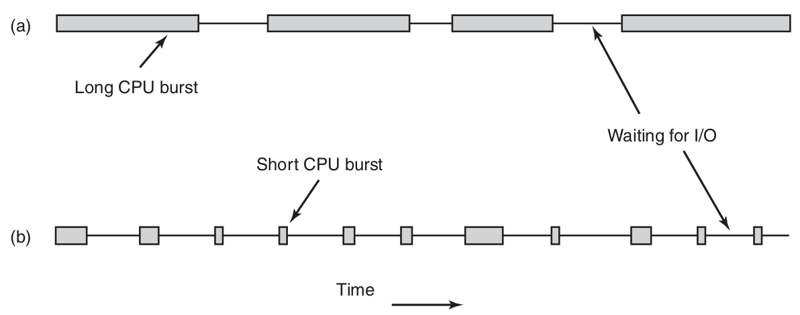
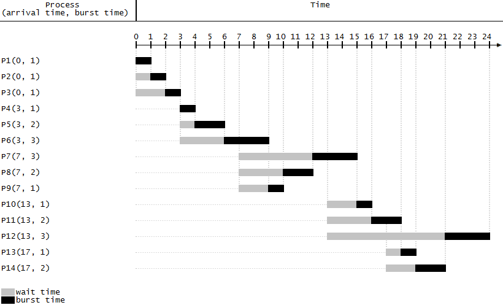
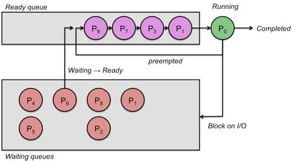
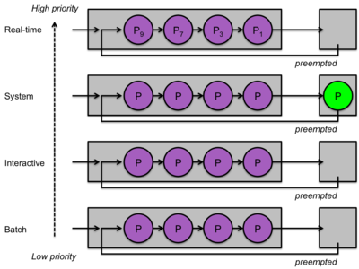
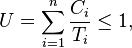

# 进程调度
***

# 目录
* [进程状态](#进程状态)
* [进程的类型](#进程的类型)
* [调度程序（scheduler）的主要工作](#调度程序（scheduler）的主要工作)
* [进程切换的代价](#进程切换的代价)
* [何时调度](#何时调度)
* [非抢占式调度与抢占式调度（Non-Preemptive Vs Preemptive Scheduling）](#非抢占式调度与抢占式调度)
* [调度算法分类](#调度算法分类)
* [调度算法的目标](#调度算法的目标)
* [批处理调度算法](#批处理调度算法)
* [交互式系统调度算法](#交互式系统调度算法)
* [实时系统中的调度](#实时系统中的调度)
* [参考资料](#参考资料)

# 进程状态

# 进程的类型

* CPU密集型（CPU-bound or compute-bound）
* I/O密集型（I/O-bound）

# 调度程序（scheduler）的主要工作
* 运行 **哪个** 进程
* **何时** 调度
* 运行 **多长** 时间

# 进程切换的代价
* 用户态切换到核心态
* 保护当前进程状态
  * 寄存器值
  * 内存映像
* 运行调度算法
* 新进程内存映像装入MMU
* 运行新进程
* 整个内存高速缓存失效，强迫高速缓存从主存中动态重新装入两次

# 何时调度
* fork
* exit
* block (I/O, signal, other)
* I/O interrupt complete
* Clock interrupt

# 非抢占式调度与抢占式调度（Non-Preemptive Vs Preemptive Scheduling）

* 非抢占式调度算法，不会在时钟中断发生时进行调度
* 抢占式调度算法，在时间间隔的末端发生时钟中断，把CPU控制返回给Scheduler

# 调度算法分类
* 批处理
* 交互式
* 实时
  * 有实时限制的系统中抢占有时并不需要。
  * 实时系统与交互式系统的差别：
    * 实时系统只运行那些用来推进现有应用的程序
    * 交互式系统可以运行任意的非协作甚至是有恶意的程序

# 调度算法的目标
不同环境下衡量好的调度算法的目标并不相同。

### 所有系统
* 公平——给每个（同类）进程的CPU份额
* 策略强制执行——看到所宣布的策略执行
* 平衡——保持系统所有部分都忙碌

### 批处理系统
* 吞吐量（throughout）——每小时最大作业数
* 周转时间（turnaround time）——从提交到终止间的最小时间，小就是好的
* CPU利用率——保持CPU始终忙碌

### 交互式系统
* 响应时间——快速响应请求
* 均衡性——满足用户的期望

### 实时系统
* 满足截止时间——避免丢失数据，满足所有的（或大多数）截止时间要求
* 可预测性——在多媒体系统中避免品质降低

# 批处理调度算法
### 先来先服务（First-come First-served，FCFS）
 

### 最短作业优先（Shortest job first）

* Shortest job next (SJN), Shortest Process Next (SPN)
* https://en.wikipedia.org/wiki/Shortest_job_next

### 最短剩余时间优先（Shortest remaining time next）

* preemptive版本的SJF
* https://en.wikipedia.org/wiki/Shortest_remaining_time

# 交互式系统调度算法
### 轮转调度（Round robin）
* **时间片（time slice/quantum）** 每个进程被分配一个时间段，允许该进程运行的时间。

* 假设所有进程同等重要
* https://en.wikipedia.org/wiki/Round-robin_scheduling

### 优先级调度（Priority scheduling）

* 调度程序在每个时钟滴答降低当前进程优先级
* 当前进程优先级低于次高优先级进程，则进行进程切换
* 可将进程分类，各类之间采用优先级调度，各类进程内部采用轮转调度
* 缺点：低优先级进程很可能会产生饥饿现象

### 多级队列（Multi-level Queues）

* 根据预定的算法插入不同的队列
* 不能在不同级别之间任意移动
* 每个级别间的调度算法可以任意选择
* https://en.wikipedia.org/wiki/Multilevel_queue

### 其他调度算法
* 最短进程优先（Shortest Process Next）——老化技术（aging）
* 保证调度——选择获得CPU比率最低的进程
* 彩票调度——重要的进程获得更多的彩票
* 公平共享调度——考虑进程拥有者的因素

# 实时系统中的调度

### 实时系统分类
* **硬实时**（hard real time）
  * 必须满足绝对的deadline
* **软实时**（soft real time）
  * 偶尔错失deadline是可容忍的

### 实时系统可调度的条件

有n 个周期事件，事件 *i* 以周期 _Pi_ 发生，并需要 _Ci_ 秒CPU时间处理一个事件，可处理负载的条件。

### 实时系统调度算法分类
* 静态调度
  * 系统开始运行之前做出调度决策
  * 只有在可以提前掌握所需完成工作以及必须满足的deadline等全部信息时才能工作
* 动态调度
  * 在运行过程中进行调度决策
  * 最早deadline优先算法 **Earliest deadline first (EDF)**
    * https://en.wikipedia.org/wiki/Earliest_deadline_first_scheduling

# 参考资料
* Modern Operating Systems (4th Edition), Andrew S. Tanenbaum, Herbert Bos
* Linux Kernel Development (3rd Edition), Robert Love
* https://en.wikipedia.org/wiki/Scheduling_%28computing%29
* http://www.cs.rutgers.edu/~pxk/416/notes/07-scheduling.html
* http://orzhovgilden.site11.com/projects/CPU.html
* https://en.wikipedia.org/wiki/Cooperative_multitasking
