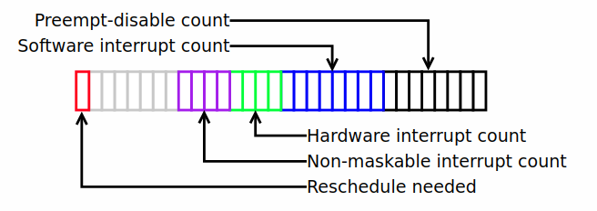

# 内核抢占

# 目录

- [内核抢占发生的时机](#内核抢占发生的时机)
- [是否能被抢占？](#是否能被抢占？)
- [抢占计数preempt_count](#抢占计数preempt_count)
	- [x86的preempt_count](#x86的preempt_count)
	- [ARM的preempt_count](#ARM的preempt_count)
- [中断返回时的内核抢占](#中断返回时的内核抢占)
	- [x86-64的实现](#x86-64的实现)
	- [PowerPC-32的实现](#PowerPC-32的实现)
	- [preempt_schedule_irq()函数](#preempt_schedule_irq()函数)

## 用户抢占发生的时机
* 从系统调用返回用户空间时（在执行系统调用期间被抢占属于内核抢占，这里说的是执行用户态的代码时发生的抢占，比如说用户态的程序 A 切换到了用户态程序 B）
* 从中断处理程序返回用户空间时

## 非内核抢占
* 只有在主动放弃 CPU 或者进程返回用户态时（系统调用返回时）才发生进程切换
* 进程进入内核态后（例如系统调用）即使时间片用完（例如在系统调用期间发生了时钟中断，并且计算发现其时间片用完）也不立即切换，而是等到返回用户态时（例如系统调用返回）。

## 内核抢占发生的时机
* 中断处理程序正在执行，且返回内核空间之前（需要 `CONFIG_PREEMPTION=y`）。
* 内核代码再一次具有可抢占性的时候（例如，调用`preempt_enable()`的时候。需要 `CONFIG_PREEMPTION=y`）。
* 如果内核中的任务阻塞（例如 mutex、semaphore、waitqueue，这同样也会导致调用`schedule()`）。
* 除了以上场景，如果内核中的任务显式调用`schedule()`。

## 是否能被抢占？
* `preemptable()`
* include/linux/preempt.h
	```c
	...
	#ifdef CONFIG_PREEMPT_COUNT

	#define preempt_disable() \
	do { \
	    preempt_count_inc(); \
	    barrier(); \
	} while (0)
	...
	#define preemptible()   (preempt_count() == 0 && !irqs_disabled())

	#ifdef CONFIG_PREEMPT
	#define preempt_enable() \
	do { \
	    barrier(); \
	    if (unlikely(preempt_count_dec_and_test())) \
	        __preempt_schedule(); \
	} while (0)

	...
	#else /* !CONFIG_PREEMPT */
	#define preempt_enable() \
	do { \
	    barrier(); \
	    preempt_count_dec(); \
	} while (0)

	...
	#endif /* CONFIG_PREEMPT */
	...
	#else /* !CONFIG_PREEMPT_COUNT */
	/*
	 * Even if we don't have any preemption, we need preempt disable/enable
	 * to be barriers, so that we don't have things like get_user/put_user
	 * that can cause faults and scheduling migrate into our preempt-protected
	 * region.
	 */
	#define preempt_disable()           barrier()
	...
	#define preempt_enable()            barrier()
	...
	#define preemptible()               0

	#endif /* CONFIG_PREEMPT_COUNT */
	```

* `___preempt_schedule()`的实现x86平台进行了重载，其他平台则采用通用的宏替换成`preempt_schedule()`。
* 内核抢占前会先通过`preemptible()`判断能否进行抢占。
* kernel/sched/core.c
	```c
	/*
	 * this is the entry point to schedule() from in-kernel preemption
	 * off of preempt_enable. Kernel preemptions off return from interrupt
	 * occur there and call schedule directly.
	 */
	asmlinkage __visible void __sched notrace preempt_schedule(void)
	{
	    /*
	     * If there is a non-zero preempt_count or interrupts are disabled,
	     * we do not want to preempt the current task. Just return..
	     */
	    if (likely(!preemptible()))
	        return;

	    preempt_schedule_common();
	}
	NOKPROBE_SYMBOL(preempt_schedule);
	EXPORT_SYMBOL(preempt_schedule);
	```

## 抢占计数 preempt_count



* include/linux/preempt.h
  ```c
  /*
   * We put the hardirq and softirq counter into the preemption
   * counter. The bitmask has the following meaning:
   *
   * - bits 0-7 are the preemption count (max preemption depth: 256)
   * - bits 8-15 are the softirq count (max # of softirqs: 256)
   *
   * The hardirq count could in theory be the same as the number of
   * interrupts in the system, but we run all interrupt handlers with
   * interrupts disabled, so we cannot have nesting interrupts. Though
   * there are a few palaeontologic drivers which reenable interrupts in
   * the handler, so we need more than one bit here.
   *
   *         PREEMPT_MASK:    0x000000ff
   *         SOFTIRQ_MASK:    0x0000ff00
   *         HARDIRQ_MASK:    0x000f0000
   *             NMI_MASK:    0x00f00000
   * PREEMPT_NEED_RESCHED:    0x80000000
   */
  #define PREEMPT_BITS    8
  #define SOFTIRQ_BITS    8
  #define HARDIRQ_BITS    4
  #define NMI_BITS    4
  //根据上面定义的各个域的位宽生成域的位移
  #define PREEMPT_SHIFT   0
  #define SOFTIRQ_SHIFT   (PREEMPT_SHIFT + PREEMPT_BITS)
  #define HARDIRQ_SHIFT   (SOFTIRQ_SHIFT + SOFTIRQ_BITS)
  #define NMI_SHIFT   (HARDIRQ_SHIFT + HARDIRQ_BITS)
  ...
  #define INIT_PREEMPT_COUNT  PREEMPT_OFFSET
  ```
### 增减抢占计数
* `preempt_count_add()`和`preempt_count_sub()`调用可重载的`__preempt_count_add()`和`__preempt_count_sub()`
* 目前就 x86 重载`__preempt_count_add()`和`__preempt_count_sub()`的实现
* 非 Debug 版本的`preempt_count_add()`和`preempt_count_sub()`
  * include/linux/preempt.h
	```c
	#if defined(CONFIG_DEBUG_PREEMPT) || defined(CONFIG_PREEMPT_TRACER)
	extern void preempt_count_add(int val);
	extern void preempt_count_sub(int val);
	...
	#else
	#define preempt_count_add(val)  __preempt_count_add(val)
	#define preempt_count_sub(val)  __preempt_count_sub(val)
	...
	#endif
	```

### x86 的 preempt_count
* x86 的`thread_info`结构里并没有`preempt_count`成员，而是通过 Per-CPU 变量`__preempt_count`存储的。
* 但进程需要被调度的标志位 `TIF_NEED_RESCHED` 是设置在 `thread_info.flags` 域的
  * arch/x86/include/asm/thread_info.h
	```c
	struct thread_info {
	    struct task_struct  *task;      /* main task structure */
	    __u32           flags;      /* low level flags */
	    __u32           status;     /* thread synchronous flags */
	    __u32           cpu;        /* current CPU */
	    mm_segment_t        addr_limit;
	    unsigned int        sig_on_uaccess_error:1;
	    unsigned int        uaccess_err:1;  /* uaccess failed */
	};
	```
* x86 重载的`preempt_count`相关的实现
  * arch/x86/include/asm/preempt.h
    ```c
    DECLARE_PER_CPU_CACHE_HOT(int, __preempt_count); //声明 Per-CPU 的 __preempt_count
    //注意：这个标志位与其语义是相反的
    /* We use the MSB mostly because its available */
    #define PREEMPT_NEED_RESCHED    0x80000000
    //我们将 PREEMPT_NEED_RESCHED bit 用作反转的 NEED_RESCHED，这样减量达到 0 意味着我们可以并且应该重新调度。
    /*
     * We use the PREEMPT_NEED_RESCHED bit as an inverted NEED_RESCHED such
     * that a decrement hitting 0 means we can and should reschedule.
     */
    #define PREEMPT_ENABLED (0 + PREEMPT_NEED_RESCHED)
    //用 preempt_count() 返回抢占计数时要屏蔽 PREEMPT_NEED_RESCHED bit，以免让所有当前用户感到困惑，认为非零值表示我们无法抢占。
    /*
     * We mask the PREEMPT_NEED_RESCHED bit so as not to confuse all current users
     * that think a non-zero value indicates we cannot preempt.
     */
    static __always_inline int preempt_count(void)
    {
        return raw_cpu_read_4(__preempt_count) & ~PREEMPT_NEED_RESCHED;
    }

    static __always_inline void preempt_count_set(int pc)
    {
        int old, new;

        old = raw_cpu_read_4(__preempt_count);
        do {
            new = (old & PREEMPT_NEED_RESCHED) | //提取旧的 bit
                (pc & ~PREEMPT_NEED_RESCHED);    //屏蔽传入的 bit
        } while (!raw_cpu_try_cmpxchg_4(__preempt_count, &old, new));
    }
    ...
    /*
     * The various preempt_count add/sub methods
     */
    static __always_inline void __preempt_count_add(int val)
    {   //给抢占计数增加 val
        raw_cpu_add_4(__preempt_count, val);
    }
    static __always_inline void __preempt_count_sub(int val)
    {   //给抢占计数减小 val
        raw_cpu_add_4(__preempt_count, -val);
    }
    ```
* 定义 Per-CPU 的抢占计数 `__preempt_count`
  * arch/x86/kernel/cpu/common.c
    ```c
    DEFINE_PER_CPU_CACHE_HOT(int, __preempt_count) = INIT_PREEMPT_COUNT;
    ```
#### `PREEMPT_NEED_RESCHED` 标志位
* 比较诡吊的是 `__preempt_count` 中的 `PREEMPT_NEED_RESCHED` 标志位，它的 **置位与否** 和它的字面含义是 **相反的**
  * 当希望该 CPU 重新调度时，`set_preempt_need_resched()` 清除该 bit，`__preempt_count` 才有可能为 `0`，从而允许调度
  * 当不希望该 CPU 重新调度时，`clear_preempt_need_resched()` 设置该 bit，`__preempt_count` 不为 `0`，不需要被调度
  * arch/x86/include/asm/preempt.h
    ```c
    /*
     * We fold the NEED_RESCHED bit into the preempt count such that
     * preempt_enable() can decrement and test for needing to reschedule with a
     * single instruction.
     *
     * We invert the actual bit, so that when the decrement hits 0 we know we both
     * need to resched (the bit is cleared) and can resched (no preempt count).
     */

    static __always_inline void set_preempt_need_resched(void)
    {   //清除：表示此时需要被调度
        raw_cpu_and_4(__preempt_count, ~PREEMPT_NEED_RESCHED);
    }

    static __always_inline void clear_preempt_need_resched(void)
    {   //置位：表示此时不需要被调度
        raw_cpu_or_4(__preempt_count, PREEMPT_NEED_RESCHED);
    }

    static __always_inline bool test_preempt_need_resched(void)
    {
        return !(raw_cpu_read_4(__preempt_count) & PREEMPT_NEED_RESCHED);
    }
    ```
* 这么做的原因是：将 `NEED_RESCHED` bit 合并（fold）到抢占计数中，以便 `preempt_enable()` 可以递减计数，并用一条指令测试是否需要重新调度。
  * 将实际的位反转，这样当递减计数达到 `0` 时，我们就知道既需要重新调度（该 bit 被清除），又可以重新调度（无抢占计数）。

### ARM 的 preempt_count
* ARM的`thread_info`结构有`preempt_count`成员，这和x86的不一样。
  * arch/arm/include/asm/thread_info.h
	```c
	/*
	 * low level task data that entry.S needs immediate access to.
	 * __switch_to() assumes cpu_context follows immediately after cpu_domain.
	 */
	struct thread_info {
	    unsigned long       flags;      /* low level flags */
	    int         preempt_count;  /* 0 => preemptable, <0 => bug */
	    mm_segment_t        addr_limit; /* address limit */
	    struct task_struct  *task;      /* main task structure */
	    __u32           cpu;        /* cpu */
	    __u32           cpu_domain; /* cpu domain */
	    struct cpu_context_save cpu_context;    /* cpu context */
	    __u32           syscall;    /* syscall number */
	    __u8            used_cp[16];    /* thread used copro */
	    unsigned long       tp_value[2];    /* TLS registers */
	#ifdef CONFIG_CRUNCH
	    struct crunch_state crunchstate;
	#endif
	    union fp_state      fpstate __attribute__((aligned(8)));
	    union vfp_state     vfpstate;
	#ifdef CONFIG_ARM_THUMBEE
	    unsigned long       thumbee_state;  /* ThumbEE Handler Base register */
	#endif
	};
	...
	/*
	 * how to get the current stack pointer in C
	 */
	register unsigned long current_stack_pointer asm ("sp");

	/*
	 * how to get the thread information struct from C
	 */
	static inline struct thread_info *current_thread_info(void) __attribute_const__;

	static inline struct thread_info *current_thread_info(void)
	{
	    return (struct thread_info *)
	        (current_stack_pointer & ~(THREAD_SIZE - 1));
	}
	...*```
	```

* ARM用的是通用的`__preempt_count_add()`和`__preempt_count_sub()`实现
	* include/asm-generic/preempt.h
	```c
	static __always_inline int preempt_count(void)
	{   /*返回抢占计数*/
	    return current_thread_info()->preempt_count;
	}

	static __always_inline int *preempt_count_ptr(void)
	{
	    return &current_thread_info()->preempt_count;
	}

	static __always_inline void preempt_count_set(int pc)
	{   /*设置抢占计数*/
	    *preempt_count_ptr() = pc;
	}
	...
	/*
	 * The various preempt_count add/sub methods
	 */

	static __always_inline void __preempt_count_add(int val)
	{
	    *preempt_count_ptr() += val;
	}

	static __always_inline void __preempt_count_sub(int val)
	{
	    *preempt_count_ptr() -= val;
	}
	```

* `preempt_count_ptr()`仅在以下函数中被调用，x86`thread_info`没有`preempt_count`成员，因此以下函数也是独立实现的：
  * `preempt_count_set()`
  * `__preempt_count_add()`
  * `__preempt_count_sub()`
  * `__preempt_count_dec_and_test()`

## 中断返回时的内核抢占
* 内核抢占可能发生在处理完硬件中断请求之后。
* 如果处理器在处理中断请求后返回内核态（返回用户态则没有影响），特定体系结构的汇编实现会检查：
	* 抢占计数值是否为 **0**，即是否允许抢占，
	* 以及是否设置了重新调度标志。
* 如果以上两个条件满足，则通过函数`preempt_schedule_irq()`调用调度器。
* `preempt_schedule_irq()`与`preempt_schedule()`本质区别是，`preempt_schedule_irq()`在调用时中断必须是禁止的，防止中断造成递归调用。
* 当然，在`preempt_schedule_irq()`调用`schedule()`前必须要调用`local_irq_enable()`开启中断，完成后必须调用`local_irq_disable()`恢复调用前中断的状态。

### x86-64的实现
* arch/x86/entry/entry_64.S
```nasm
/*
 * Build the entry stubs with some assembler magic.
 * We pack 1 stub into every 8-byte block.
 */
        .align 8
ENTRY(irq_entries_start)  /*中断入口点*/
    vector=FIRST_EXTERNAL_VECTOR
    .rept (FIRST_SYSTEM_VECTOR - FIRST_EXTERNAL_VECTOR)
        pushq   $(~vector+0x80)                 /* Note: always in signed byte range */
    vector=vector+1
        jmp     common_interrupt
        .align  8
    .endr
END(irq_entries_start)
        /*
         * The interrupt stubs push (~vector+0x80) onto the stack and
         * then jump to common_interrupt.
         */
        .p2align CONFIG_X86_L1_CACHE_SHIFT
common_interrupt:
        ASM_CLAC
        addq    $-0x80, (%rsp)                  /* Adjust vector to [-256, -1] range */
        interrupt do_IRQ  /*中断进入 C 处理的入口点*/
        /* 0(%rsp): old RSP */
ret_from_intr:            /* 注意，这里是连着的，do_IRQ返回后会接着执行后面的指令 */
        DISABLE_INTERRUPTS(CLBR_NONE)
        TRACE_IRQS_OFF
        decl    PER_CPU_VAR(irq_count)  /*Per-CPU 的 irq_count 减 1*/

        /* Restore saved previous stack */
        popq    %rsp

        testb   $3, CS(%rsp)
        jz      retint_kernel    /*测试结果为0，中断发生时在内核空间，跳到retint_kernel*/

        /* Interrupt came from user space */
GLOBAL(retint_user)              /*测试结果不为0，中断发生在用户空间*/
        mov     %rsp,%rdi
        call    prepare_exit_to_usermode
        TRACE_IRQS_IRETQ
        SWAPGS
        jmp     restore_regs_and_iret

/* Returning to kernel space */
retint_kernel:
#ifdef CONFIG_PREEMPT
        /* Interrupts are off */
        /* Check if we need preemption */
        bt      $9, EFLAGS(%rsp)  /* were interrupts off? */ /*测试 EFLAGS 的 bit 9，即 IF 的值存入 CF*/
        jnc     1f  /*检查 CF 即检查 IF，中断是否关闭。如果 CF=0，表示中断关闭，则前跳至 1，不抢占；否则往下执行*/
0:      cmpl    $0, PER_CPU_VAR(__preempt_count)
        jnz     1f  /*检查上面比较结果是否不为 0。如果不为 0，抢占是关闭状态，则前跳至 1，不抢占；否则抢占发生*/
        call    preempt_schedule_irq /*中断关闭状态下调用函数 preempt_schedule_irq()*/
        jmp     0b
1:
#endif
```
### PowerPC-32的实现
* arch/powerpc/kernel/entry_32.S
```nasm
        .globl  ret_from_except
ret_from_except:
        /* Hard-disable interrupts so that current_thread_info()->flags
         * can't change between when we test it and when we return
         * from the interrupt. */
        /* Note: We don't bother telling lockdep about it */
        LOAD_MSR_KERNEL(r10,MSR_KERNEL)
        SYNC                    /* Some chip revs have problems here... */
        MTMSRD(r10)             /* disable interrupts */

        lwz     r3,_MSR(r1)     /* Returning to user mode? */
        andi.   r0,r3,MSR_PR    /*立即数MSR_PR与寄存器r3的值比较，结果存入寄存器r0*/
        beq     resume_kernel   /*如果比较结果相等，中断返回内核空间，跳到resume_kernel*/

user_exc_return:                /* r10 contains MSR_KERNEL here */
        /* Check current_thread_info()->flags */
        CURRENT_THREAD_INFO(r9, r1)
        lwz     r9,TI_FLAGS(r9)
        andi.   r0,r9,_TIF_USER_WORK_MASK
        bne     do_work

restore_user:
#if defined(CONFIG_4xx) || defined(CONFIG_BOOKE)
        /* Check whether this process has its own DBCR0 value.  The internal
           debug mode bit tells us that dbcr0 should be loaded. */
        lwz     r0,THREAD+THREAD_DBCR0(r2)
        andis.  r10,r0,DBCR0_IDM@h
        bnel-   load_dbcr0
#endif
#ifdef CONFIG_VIRT_CPU_ACCOUNTING_NATIVE
        CURRENT_THREAD_INFO(r9, r1)
        ACCOUNT_CPU_USER_EXIT(r9, r10, r11)
#endif

        b       restore      /*返回用户空间的函数*/

/* N.B. the only way to get here is from the beq following ret_from_except. */
resume_kernel:
        /* check current_thread_info, _TIF_EMULATE_STACK_STORE */
        CURRENT_THREAD_INFO(r9, r1) /*取当前进程 thread_info*/
        lwz     r8,TI_FLAGS(r9)     /*取当前进程 thread_info 中的TI_FLAGS，存入r8*/
        andis.  r0,r8,_TIF_EMULATE_STACK_STORE@h /*注意，andis的结果放到寄存器r0*/
        beq+    1f                  /*向前跳转到1*/

        addi    r8,r1,INT_FRAME_SIZE    /* Get the kprobed function entry */

        lwz     r3,GPR1(r1)
        subi    r3,r3,INT_FRAME_SIZE    /* dst: Allocate a trampoline exception frame */
        mr      r4,r1                   /* src:  current exception frame */
        mr      r1,r3                   /* Reroute the trampoline frame to r1 */

        /* Copy from the original to the trampoline. */
        li      r5,INT_FRAME_SIZE/4     /* size: INT_FRAME_SIZE */
        li      r6,0                    /* start offset: 0 */
        mtctr   r5
2:      lwzx    r0,r6,r4
        stwx    r0,r6,r3
        addi    r6,r6,4
        bdnz    2b

        /* Do real store operation to complete stwu */
        lwz     r5,GPR1(r1)
        stw     r8,0(r5)

        /* Clear _TIF_EMULATE_STACK_STORE flag */
        lis     r11,_TIF_EMULATE_STACK_STORE@h
        addi    r5,r9,TI_FLAGS
0:      lwarx   r8,0,r5
        andc    r8,r8,r11
#ifdef CONFIG_IBM405_ERR77
        dcbt    0,r5
#endif
        stwcx.  r8,0,r5
        bne-    0b
1:

#ifdef CONFIG_PREEMPT
        /* check current_thread_info->preempt_count */
        lwz     r0,TI_PREEMPT(r9)  /*取当前进程thread_info里的抢占计数到r0*/
        cmpwi   0,r0,0          /* if non-zero, just restore regs and return */
        bne     restore         /*如果非 0，抢占目前处于关闭状态，恢复寄存器并返回中断前的函数*/
        andi.   r8,r8,_TIF_NEED_RESCHED /*检查TI_FLAGS是否设置重新调度位，结果存入r8*/
        beq+    restore         /*如果为 0，没有进程要求重新调度，恢复寄存器并返回中断前的函数，否则执行下一条指令*/
        lwz     r3,_MSR(r1)     /*取中断计数到r3。下面会判断中断是否关闭，如果没关闭则不调度*/
        andi.   r0,r3,MSR_EE    /* interrupts off? */
        beq     restore         /* don't schedule if so */
#ifdef CONFIG_TRACE_IRQFLAGS
        /* Lockdep thinks irqs are enabled, we need to call
         * preempt_schedule_irq with IRQs off, so we inform lockdep
         * now that we -did- turn them off already
         */
        bl      trace_hardirqs_off
#endif
1:      bl      preempt_schedule_irq    /*中断关闭状态下调用函数preempt_schedule_irq()*/
        CURRENT_THREAD_INFO(r9, r1)     /*取当前进程 thread_info*/
        lwz     r3,TI_FLAGS(r9)         /*取当前进程 thread_info 中的TI_FLAGS到r3*/
        andi.   r0,r3,_TIF_NEED_RESCHED /*检查TI_FLAGS是否设置重新调度位，结果在r0*/
        bne-    1b                      /*结果不相等，说明设置了重新调度位，往后跳至1，重新调度*/
#ifdef CONFIG_TRACE_IRQFLAGS
        /* And now, to properly rebalance the above, we tell lockdep they
         * are being turned back on, which will happen when we return
         */
        bl      trace_hardirqs_on
#endif
#endif /* CONFIG_PREEMPT */
```

### preempt_schedule_irq()函数
* 最后再来看看`preempt_schedule_irq()`函数
* kernel/sched/core.c
	```c
	/*
	 * this is the entry point to schedule() from kernel preemption
	 * off of irq context.
	 * Note, that this is called and return with irqs disabled. This will
	 * protect us against recursive calling from irq.
	 */
	 /*这是内核抢占在中断上下文的入口点。
	   注意，该函数会在中断禁止的状态下调用，返回时也得是中断禁止的。这会防止中断造成递归调用。*/
	asmlinkage __visible void __sched preempt_schedule_irq(void)
	{
	        enum ctx_state prev_state;

	        /* Catch callers which need to be fixed */
	        /*抢占计数不为 0，或者中断开启，直接 crash。因为该函数仅在中断返回的最后调用，此时仍
	          属于中断上下文，如果不满足这两个条件系统肯定出问题了。*/
	        BUG_ON(preempt_count() || !irqs_disabled());

	        prev_state = exception_enter();

	        do {
	                preempt_disable();  /*先禁止抢占*/
	                local_irq_enable(); /*schedule()前一刻中断必然要打开*/
	                __schedule(true);
	                local_irq_disable(); /*schedule()完成后中断立即关闭*/
	                sched_preempt_enable_no_resched(); /*非调度方式开抢占*/
	        } while (need_resched());

	        exception_exit(prev_state);
	}
	```

# References
* [Revisiting the kernel's preemption model, part 2 - LWN](https://lwn.net/Articles/945422/)