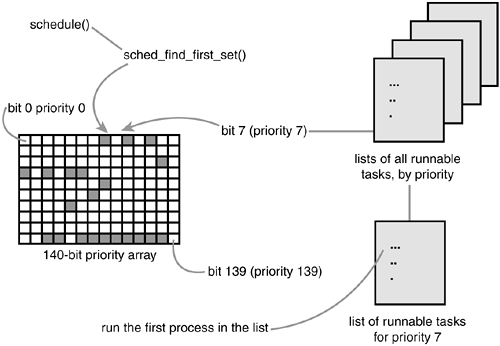
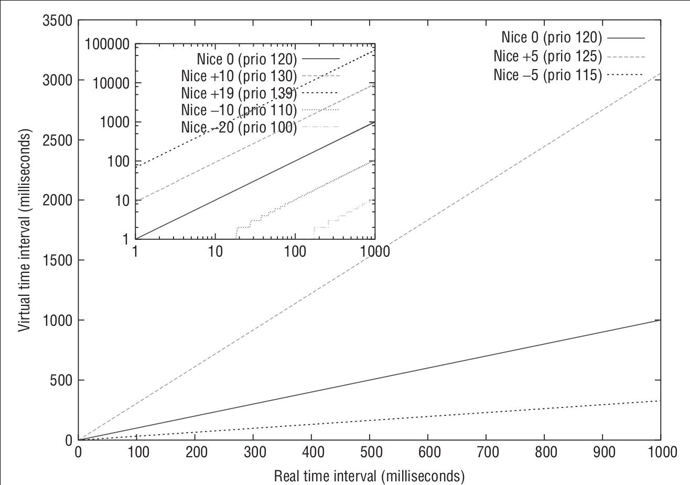
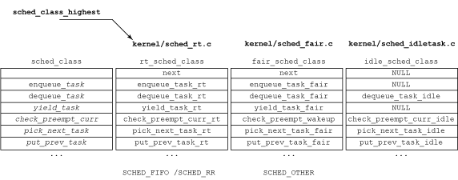
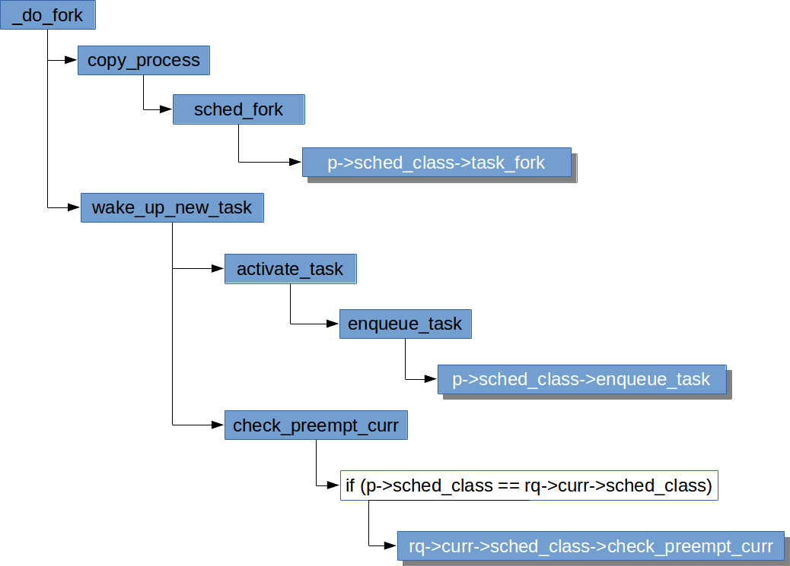
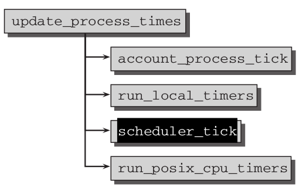

# Linux进程调度（Linux Process Scheduling)
***

# 目录
* [Linux缺省调度器](#linux%E7%BC%BA%E7%9C%81%E8%B0%83%E5%BA%A6%E5%99%A8)
* [O(1)调度](#o1%E8%B0%83%E5%BA%A6)
* [完全公平调度（Completely Fair Scheduler）](#%E5%AE%8C%E5%85%A8%E5%85%AC%E5%B9%B3%E8%B0%83%E5%BA%A6completely-fair-scheduler)
  * [调度的目标](#调度的目标)
  * [算术级数几何级数与增长率](#算术级数几何级数与增长率)
  * [基本原理](#基本原理)
  * [原理解析](#原理解析)
* [核心调度器](#核心调度器)
  * [调度器类](#调度器类)
  * [调度策略](#调度策略)
  * [调度相关的数据结构](#调度相关的数据结构)
  * [优先级](#优先级)
  * [周期性调度](#周期性调度)
  * [创建进程](#创建进程)
  * [进程唤醒](#进程唤醒)
  * [主调度函数schedule()](#主调度函数schedule())
* [参考资料](#%E5%8F%82%E8%80%83%E8%B5%84%E6%96%99)

# Linux缺省调度器
Operating System | Algorithm
------------ | -------------
Linux kernel before 2.6.0 | [O(n) scheduler](https://en.wikipedia.org/wiki/O(1)%5fscheduler)
Linux kernel 2.6.0–2.6.23 | [O(1) scheduler](https://en.wikipedia.org/wiki/O(n)%5fscheduler)
Linux kernel after 2.6.23 | [Completely Fair Scheduler](https://en.wikipedia.org/wiki/Completely_Fair_Scheduler)

# O(1)调度
### 运行队列
```c
struct runqueue {
    spinlock_t lock; /* spin lock that protects this runqueue */
    unsigned long nr_running; /* number of runnable tasks */
    unsigned long nr_switches; /* context switch count */
    unsigned long expired_timestamp; /* time of last array swap */
    unsigned long nr_uninterruptible; /* uninterruptible tasks */
    unsigned long long timestamp_last_tick; /* last scheduler tick */
    struct task_struct *curr; /* currently running task */
    struct task_struct *idle; /* this processor's idle task */
    struct mm_struct *prev_mm; /* mm_struct of last ran task */
    struct prio_array *active; /* active priority array */
    struct prio_array *expired; /* the expired priority array */
    struct prio_array arrays[2]; /* the actual priority arrays */
    struct task_struct *migration_thread; /* migration thread */
    struct list_head migration_queue; /* migration queue */
    atomic_t nr_iowait; /* number of tasks waiting on I/O */
};
```

### 优先级数组
```c
struct prio_array {
    int nr_active; /* number of tasks in the queues */
    unsigned long bitmap[BITMAP_SIZE]; /* priority bitmap */
    struct list_head queue[MAX_PRIO]; /* priority queues */
};
```


### 优先级位图映射


### O(1)调度算法的问题
1. 将nice值映射到时间片，就必须将nice值对应到绝对的处理器时间，这会导致进程切换无法最优化进行。例如，两个高nice值（低优先级）的后台进程，往往是CPU密集型，分配到的时间片太短，导致频繁切换。
2. nice值变化的效果极大的取决于nice的初始值。
3. 时间片受定时器节拍的影响比较大。
4. 为提高交互进程性能的优化有可能被利用，打破公平原则，获得更多的处理器时间。

# 完全公平调度（Completely Fair Scheduler）

## 调度的目标
* 任何进程获得的处理器时间是由它自己和其他所有可运行进程nice值的相对差值决定的
* 任何nice值对应的时间不再是一个绝对值，而是**处理器的使用比**
* nice值对时间片的作用不再是算术级增加，而是几何级增加
* 公平调度，确保每个进程有公平的处理器使用比

## 算术级数、几何级数与增长率

### 增长率


_V<sub>f</sub>_：最终值

_V<sub>i</sub>_：初始值


### 算术级数
数列中每一个数跟前一个数的差额是固定的。每期增长率不一样。如增长幅度是正的，越往后增长率越小。

数列|2|4|6|8|10|12
---|---|---|---|---|---|---
增长率|-|100%|50%|33%|25%|16.67%

如果采用算术级数，比如相邻两个 nice 值之间差额是 5ms，
* 进程 A 的 nice 值为 0，进程 B 的 nice 值为 1，则它们分别映射到时间片 100ms 和 95ms，差别并不大
* 进程 A 的 nice 值为 18，进程 B 的 nice 值为 19，则它们分别映射到时间片 10ms 和 5ms，前者比后者多了 100% 的处理器时间

### 几何级数
数列中的数按固定的增长率增长。如增长率是正的，越往后增长幅度越大。

数列|2|4|8|16|32|64
---|---|---|---|---|---|---
增长率|-|100%|100%|100%|100%|100%

如果采用几何级数，比如说，增长率约为 -20%，目标延迟是 20ms，
* 进程 A 的 nice 值为 0，进程 B 的 nice 值为 5，则它们分别获得的处理器时间 15ms 和 5ms
* 进程 A 的 nice 值为 10，进程 B 的 nice 值为 15，它们分别获得的处理器时间仍然是 15ms 和 5ms

> **目标延迟（targeted latency）**
> Each process then runs for a “timeslice” proportional to its weight divided by the total
> weight of all runnable threads. To calculate the actual timeslice, CFS sets a target for its
> approximation of the “infinitely small” scheduling duration in perfect multitasking. This
> target is called the **targeted latency**.
> Smaller targets yield better interactivity and a closer approximation to perfect
> multitasking, at the expense of higher switching costs and thus worse overall throughput.

> **时间片的最小粒度（minimum granularity）**
> Note as the number of runnable tasks approaches infinity, the proportion of allotted
> processor and the assigned timeslice approaches zero. As this will eventually result in
> unacceptable switching costs, CFS imposes a floor on the timeslice assigned to each
> process. This floor is called the minimum granularity. By default it is 1 millisecond. Thus,
> even as the number of runnable processes approaches infinity, each will run for at least 1
> millisecond, to ensure there is a ceiling on the incurred switching costs.

## 基本原理
* 设定一个调度周期（`sched_latency_ns`），目标是让每个进程在这个周期内至少有机会运行一次。换一种说法就是每个进程等待 CPU 的时间最长不超过这个调度周期。
* 根据进程的数量，大家平分这个调度周期内的 CPU 使用权，由于进程的优先级即 nice 值不同，分割调度周期的时候要加权。
* 每个进程的经过加权后的累计运行时间保存在自己的`vruntime`字段里。
* 哪个进程的`vruntime`最小就获得本轮运行的权利。

## 原理解析

### 静态优先级与权重
* 将进程的 nice 值映射到对应的权重
  * 数组项之间的乘数因子为`1.25`，这样概念上可以使进程每降低一个 nice 值可以多获得 10% 的 CPU 时间，每升高一个 nice 值则放弃 10% 的CPU时间。
  * kernel/sched/core.c
```c
const int sched_prio_to_weight[40] = {
 /* -20 */     88761, 71755, 56483, 46273, 36291,
 /* -15 */     29154, 23254, 18705, 14949, 11916,
 /* -10 */      9548,  7620,  6100,  4904,  3906,
 /*  -5 */      3121,  2501,  1991,  1586,  1277,
 /*   0 */      1024,   820,   655,   526,   423,
 /*   5 */       335,   272,   215,   172,   137,
 /*  10 */       110,    87,    70,    56,    45,
 /*  15 */        36,    29,    23,    18,    15,
};
```

  由此可见，**nice 值越小, 进程的权重越大**。

* 静态优先级与权重之间的关系，分普通和实时进程两种情况


### CFS里的调度周期
* CFS 调度器的调度周期由`sysctl_sched_latency`变量保存。
  * 该变量可以通过`sysctl`调整，见 kernel/sysctl.c
```sh
       $ sysctl kernel.sched_latency_ns
       kernel.sched_latency_ns = 24000000
       $ sysctl kernel.sched_min_granularity_ns
       kernel.sched_min_granularity_ns = 3000000
```

  * 任务过多的时候调度周期会延长，见 kernel/sched/fair.c
```c
/*
 * The idea is to set a period in which each task runs once.
 *
 * When there are too many tasks (sched_nr_latency) we have to stretch
 * this period because otherwise the slices get too small.
 *
 * p = (nr <= nl) ? l : l*nr/nl
 */
static u64 __sched_period(unsigned long nr_running)
{
    if (unlikely(nr_running > sched_nr_latency))
        return nr_running * sysctl_sched_min_granularity;
    else
        return sysctl_sched_latency;
}
```
### CFS里关于时间计算的两个公式

#### 公式1
* 一个进程在一个调度周期中的运行时间为:
```js
    分配给进程的运行时间 = 调度周期 * 进程权重 / 所有可运行进程权重之和
```

  可以看到, 进程的权重越大，分到的运行时间越多。

#### 公式2
* 一个进程的实际运行时间和虚拟运行时间之间的关系为:
```js
    vruntime = 实际运行时间 * NICE_0_LOAD / 进程权重
             = 实际运行时间 * 1024 / 进程权重
             (NICE_0_LOAD = 1024, 表示 nice 值为 0 的进程权重)
```


* 可以看到, **进程权重越大, 运行同样的实际时间, `vruntime` 增长的越慢**。

### 关于CFS的公平性的推理
* 一个进程在一个调度周期内的虚拟运行时间大小为:
  ```js
    vruntime = 进程在一个调度周期内的实际运行时间 * NICE_0_LOAD / 进程权重
             = (调度周期 * 进程权重 / 所有进程总权重) * NICE_0_LOAD / 进程权重
             = 调度周期 * NICE_0_LOAD / 所有可运行进程总权重
  ```
  * 可以看到，一个进程在一个调度周期内的`vruntime`值大小是不和该进程自己的权重相关的，所以所有进程的`vruntime`值大小都是一样的。
* 在非常短的时间内，也许看到的`vruntime`值并不相等。
  * `vruntime`值小，说明它以前占用 CPU 的时间较短，受到了“不公平”对待。
  * 但为了确保公平，我们**总是选出`vruntime`最小的进程来运行**，形成一种“追赶”的局面。
  * 这样既能公平选择进程，又能保证高优先级进程获得较多的运行时间。
* 理想情况下，由于`vruntime`与进程自身的权重是不相关的，所有进程的`vruntime`值是一样的。
* 怎么解释进程间的实际执行时间与它们的权重是成比例的？
  * 假设有进程 A，其虚拟运行时间为`vruntime_A`，其实际运行的时间为`delta_exec_A`，权重为`weight_A`，于是`vruntime_A = delta_exec_A * NICE_0_LOAD / weight_A`
  * 假设有进程 B，其虚拟运行时间为`vruntime_B`，其实际运行的时间为`delta_exec_B`，权重为`weight_B`，于是`vruntime_B = delta_exec_B * NICE_0_LOAD / weight_B`
  * 由于进程虚拟运行时间相同，即 `vruntime_A == vruntime_B`，
  * 则 `delta_exec_A * NICE_0_LOAD / weight_A == vruntime_B = delta_exec_B * NICE_0_LOAD / weight_B`
  * 也就是 `delta_exec_A : delta_exec_B == weight_A : weight_B`
  可见进程间的实际执行时间和它们的权重也是成比例的。
* 各个进程追求的公平时间`vruntime`其实就是一个 nice 值为 `0` 的进程在一个调度周期内应分得的时间，就像是一个基准。

# 核心调度器

## 调度器类

### 调度器类
* fair (Completely_Fair_Scheduler)
* real-time
* stop-task (sched_class_highest)
* Deadline Scheduling: Earliest Deadline First (EDF) + Constant Bandwidth Server (CBS)
* idle-task



### 调度器类的顺序
* stop-task --> deadline --> real-time --> fair --> idle
* 编译时期就已决定，不能动态扩展
* 在过去，在各调度器类定义的时候通过 `next` 指针定义好了下一级调度器类
  * 遍历时，通过宏 `#define sched_class_highest (&stop_sched_class)` 将 `stop-task` 指定为优先级最高的调度器类
```cpp
#define sched_class_highest (&stop_sched_class)
#define for_each_class(class) \
   for (class = sched_class_highest; class; class = class->next)
...
const struct sched_class stop_sched_class = {
    .next           = &dl_sched_class,
    ...
}
```
* 现在调度器类的顺序则通过 `__sched_class_highest[]` 和 `__sched_class_lowest[]` 两个全局数组来标识，在 include/asm-generic/vmlinux.lds.h 就固定好了
```cpp
/*
 * The order of the sched class addresses are important, as they are
 * used to determine the order of the priority of each sched class in
 * relation to each other.
 */
#define SCHED_DATA              \
    STRUCT_ALIGN();             \
    __sched_class_highest = .;      \
    *(__stop_sched_class)           \
    *(__dl_sched_class)         \
    *(__rt_sched_class)         \
    *(__fair_sched_class)           \
    *(__ext_sched_class)            \
    *(__idle_sched_class)           \
    __sched_class_lowest = .;
```
* kernel/sched/sched.h
```cpp
/*
 * Helper to define a sched_class instance; each one is placed in a separate
 * section which is ordered by the linker script:
 *
 *   include/asm-generic/vmlinux.lds.h
 *
 * *CAREFUL* they are laid out in *REVERSE* order!!!
 *
 * Also enforce alignment on the instance, not the type, to guarantee layout.
 */
#define DEFINE_SCHED_CLASS(name) \
const struct sched_class name##_sched_class \
    __aligned(__alignof__(struct sched_class)) \
    __section("__" #name "_sched_class")

/* Defined in include/asm-generic/vmlinux.lds.h */
extern struct sched_class __sched_class_highest[];
extern struct sched_class __sched_class_lowest[];

#define for_class_range(class, _from, _to) \
    for (class = (_from); class < (_to); class++)

#define for_each_class(class) \
    for_class_range(class, __sched_class_highest, __sched_class_lowest)

#define sched_class_above(_a, _b)   ((_a) < (_b))
```
* 这样做的目的无疑是为了“快”。较之用 `next` 指针索引，利用数组元素索引可以让编译器生成更简单的代码。因为这是调度决策时的热点路径。
* 从此比较调度器类的优先级也更简单了，比较调度器类的地址就可以了，见 `sched_class_above()` 的定义

## 调度策略
* include/uapi/linux/sched.h
```c
/*
 * Scheduling policies
 */
#define SCHED_NORMAL        0
#define SCHED_FIFO      1
#define SCHED_RR        2
#define SCHED_BATCH     3
/* SCHED_ISO: reserved but not implemented yet */
#define SCHED_IDLE      5
#define SCHED_DEADLINE      6
```
* 调度策略与调度器类是多对一的映射关系

调度器类 | 调度策略 |
---|---
fair|SCHED_NORMAL
... |SCHED_BATCH
... |SCHED_IDLE
real-time|SCHED_FIFO
... |SCHED_RR
deadline|SCHED_DEADLINE

## stop-task，idle-task 与 SCHED_IDLE

* `stop`任务是系统中优先级最高的任务，它可以抢占所有的进程并且不会被任何进程抢占，其专属调度器类即`stop-task`。
* `idle-task`调度器类与 CFS 里要处理的`SCHED_IDLE`没有关系。
* `idle`任务会被任意进程抢占，其专属调度器类为`idle-task`。
* `idle-task`和`stop-task`没有对应的调度策略。
* 采用`SCHED_IDLE`调度策略的任务其调度器类为 **CFS**。

> The stop task is the highest priority task in the system, it preempts
> everything and will be preempted by nothing.
* stop_task.c Comment

> NOTE: these are not related to SCHED_IDLE tasks which are handled in sched/fair.c
* idle_task.c Comment

> The stop_sched_class is to stop cpu, using on SMP system, for load balancing
> and cpu hotplug. This class have the highest scheduling priority.
* http://stackoverflow.com/questions/15399782/what-is-the-use-of-stop-sched-class-in-linux-kernel

> Idle is used to schedule the per-cpu idle task (also called *swapper* task)
> which is run if no other task is runnable.

## idle 进程
* 启动时会把启动线程的调度器类设置为 idle-task
```c
#define INIT_TASK_COMM "swapper"
//BSP
//init/main.c
start_kernel()
   //kernel/sched/core.c
-> sched_init()
   -> init_idle(current, smp_processor_id())
      -> idle->sched_class = &idle_sched_class; //当前进程的调度器类设置为 idle_sched_class
      -> sprintf(idle->comm, "%s/%d", INIT_TASK_COMM, cpu); //进程名为 [swapper/*]
-> rest_init()
   -> cpu_startup_entry(CPUHP_ONLINE)

//APs
//arch/x86/kernel/smpboot.c
start_secondary()
-> cpu_startup_entry(CPUHP_AP_ONLINE_IDLE)
```
* `ps` 命令看不到这些 `[swapper/*]` 进程，但 `crash` 工具是可以看到，他们共享 `PID 0`，运行在每个 CPU 上：
```cpp
crash> ps
      PID    PPID  CPU       TASK        ST  %MEM      VSZ      RSS  COMM
>       0       0   0  ffffffff8560f340  RU   0.0        0        0  [swapper/0]
>       0       0   1  ff110001080ec380  RU   0.0        0        0  [swapper/1]
>       0       0   2  ff110001080ea1c0  RU   0.0        0        0  [swapper/2]
>       0       0   3  ff110001087121c0  RU   0.0        0        0  [swapper/3]
...
crash> task 0
PID: 0        TASK: ffffffff8560f340  CPU: 0    COMMAND: "swapper/0"
struct task_struct {
...
  comm = "swapper/0\000\000\000\000\000\000",
...
  sched_class = 0xffffffff84df4040 <idle_sched_class>,
...
}
...
PID: 0        TASK: ff110001080ec380  CPU: 1    COMMAND: "swapper/1"
...
```
* kernel/sched/idle.c
```c
void cpu_startup_entry(enum cpuhp_state state)
{
    current->flags |= PF_IDLE;
    arch_cpu_idle_prepare(); /*留给平台相关的代码做cpu_idle的准备工作。*/
    cpuhp_online_idle(state);
    while (1)
        do_idle();
}
```

## 调度相关的数据结构

### 进程结构 task_struct
* include/linux/sched.h::task_struct
```c
struct task_struct {
...
  int prio, static_prio, normal_prio;
  unsigned int rt_priority;
  const struct sched_class *sched_class;
  struct sched_entity se;
  struct sched_rt_entity rt;
  struct sched_dl_entity dl;
...
  unsigned int policy;
  int nr_cpus_allowed;
  cpumask_t cpus_allowed;
...
}
```
* 优先级 `prio`, `static_prio`, `normal_prio`
  * **静态优先级**`static_prio` 进程启动时的优先级，除非用`nice`或`sched_setscheduler`修改，否则进程运行期间一直保持恒定。
  * **普通优先级**`normal_prio` 基于进程静态优先级和调度策略计算出的优先级。进程 fork 时，子进程继承的是普通优先级。
  * **动态优先级**`prio` 暂时的，非持久的优先级，调度器考虑的是这个优先级。
* **实时进程优先级**`rt_priority` 值 **越大** 表示优先级 **越高**（后面会到看计算的时候用的是减法）。
* `sched_class` 指向调度器类。在 fork 的时候会根据优先级决定进程该采用哪种调度策略。
* 调度实体`se`, `rt`, `dl`
  * 调度器调度的是*可调度实体*，而不限于进程
  * 一组进程可以构成一个*可调度实体*，实现*组调度*
  * 注意：这里用的都是实体而不是指针
* `SCHED_IDLE`进程**不负责**调度空闲进程。空闲进程由内核提供单独的机制来处理。

### 调度器类 sched_class
* kernel/sched/sched.h::sched_class
```c
struct sched_class {
    const struct sched_class *next;

    void (*enqueue_task) (struct rq *rq, struct task_struct *p, int flags);
    void (*dequeue_task) (struct rq *rq, struct task_struct *p, int flags);
    void (*yield_task) (struct rq *rq);
    bool (*yield_to_task) (struct rq *rq, struct task_struct *p, bool preempt);

    void (*check_preempt_curr) (struct rq *rq, struct task_struct *p, int flags);

    /*   
     * It is the responsibility of the pick_next_task() method that will
     * return the next task to call put_prev_task() on the @prev task or
     * something equivalent.
     *
     * May return RETRY_TASK when it finds a higher prio class has runnable
     * tasks.
     */
    struct task_struct * (*pick_next_task) (struct rq *rq,
                        struct task_struct *prev);
    void (*put_prev_task) (struct rq *rq, struct task_struct *p);

    void (*set_curr_task) (struct rq *rq);
    void (*task_tick) (struct rq *rq, struct task_struct *p, int queued);
    void (*task_fork) (struct task_struct *p);
    void (*task_dead) (struct task_struct *p);
#ifdef CONFIG_SMP
...
#endif
    /*   
     * The switched_from() call is allowed to drop rq->lock, therefore we
     * cannot assume the switched_from/switched_to pair is serliazed by
     * rq->lock. They are however serialized by p->pi_lock.
     */
    void (*switched_from) (struct rq *this_rq, struct task_struct *task);
    void (*switched_to) (struct rq *this_rq, struct task_struct *task);
    void (*prio_changed) (struct rq *this_rq, struct task_struct *task,
                 int oldprio);

    unsigned int (*get_rr_interval) (struct rq *rq,
                     struct task_struct *task);

    void (*update_curr) (struct rq *rq);
#ifdef CONFIG_FAIR_GROUP_SCHED
...
#endif
```
* `next` 指向下一个调度器类，现在已经没这个域了。
* `enqueue_task` 向运行队列添加新进程。
* `dequeue_task` 从运行队列删除进程。
* `yield_task` 进程自愿放弃对处理器的控制权，相应的系统调用为`sched_yield`。
* `yield_to_task` 让出处理器，并期望将控制权交给指定的进程。
* `pick_next_task` 选择下一个将要运行的进程。
* `put_prev_task` 用另外一个进程**替换当前进程之前**调用。
* `set_next_task` 与`put_prev_task`配对使用，或者改变当前进程的调度策略时调用。
* `task_tick` 每次激活周期性调度器时，由周期性调度器调用。
* `task_fork` 用于建立`fork`系统调用和调度器之间的关联，在`sched_fork()`函数中被调用。
* `get_rr_interval` 返回进程的缺省时间片，对于 CFS 返回的是该调度周期内分配的实际时间片。相关系统调用为`sched_rr_get_interval`。
* `update_curr` 更新当前进程的运行时间统计。
* `wakeup_preempt` 即原来的 `check_preempt_curr` 检查进程是否需要被重新调度，改为现在的名字明确表明用于唤醒抢占。

### 运行队列 rq
* 每个 CPU 有各自的运行队列
* 各个活动进程只出现在一个运行队列中。在多个CPU上运行同一个进程是不可能的
* 发源于同一进程的线程可以在不同 CPU 上执行
* **注意**：特定于调度器类的子运行队列是实体，而不是指针
* kernel/sched/sched.h::rq
```c
/*
 * This is the main, per-CPU runqueue data structure.
   ...
 */
struct rq {
...
    unsigned int nr_running;
...
    struct cfs_rq cfs;
    struct rt_rq rt;
    struct dl_rq dl;
...
    union {
        struct task_struct __rcu *donor; /* Scheduler context */
        struct task_struct __rcu *curr;  /* Execution context */
    };
    struct task_struct *idle, *stop;
...
    u64 clock;
}
```
* `nr_running` 队列上可运行进程的数目，**不考虑优先级或调度类**。
* `curr` 指向当前运行进程的`task_struct`实例。
* `idle` 指向空闲进程的`task_struct`实例。该进程在没有其他可运行进程时执行。
* `clock` 每个运行队列的时钟。每次周期性调度器被调用的时候会更新这个值。
* ~~`load` 运行队列当前的累计权重，~~ 已被移除，因为只有 CFS 用到，见 commit f2bedc470565 ("sched/fair: Remove rq->load")。

#### scheduling context 和 execution context
* **scheduling context 调度上下文**：定义为 `task_struct` 中待选运行任务（我们称之为 donor task）的所有调度器状态。
* **execution context 执行上下文**：定义为实际运行该任务所需的所有状态。
* 目前，两者在 `task_struct` 中交织在一起。我们希望在逻辑上将它们拆分，以便我们可以使用选择被调度的 donor task 的调度上下文，但使用实际运行的另一个 task 的执行上下文。
* 为此，引入 **`rq->donor`** 域，指向调度器从运行队列中选择的 `task_struct`，该结构将用于调度器状态，并保留 **`rq->curr`** 域，以指示将要实际运行的任务的执行上下文。
* Commit af0c8b2bf67b ("sched: Split scheduler and execution contexts") 引入了 `donor` 域，作为与 `curr` 的 `union`，因此它不会导致上下文拆分，但添加了单独处理所有上下文的逻辑。

#### Per-CPU 全局变量 runqueues
* 系统的所有运行队列都在`runqueues`数组中，该数组中的每一个元素对应于系统中的一个 CPU
* kernel/sched/core.c
```c
DEFINE_PER_CPU_SHARED_ALIGNED(struct rq, runqueues);
```
在SMP开启的情况下该宏展开为：
```c
__percpu __attribute__((section(".data..percpu..shared_aligned"))) \
  __typeof__(struct rq) runqueues \
  ____cacheline_aligned_in_smp;
```
关于kernel的Per-CPU变量值得用一篇文章来详叙，这里不深入讲解。
Per-CPU相关代码见：
* include/linux/percpu-defs.h
* include/asm-generic/percpu.h
* include/linux/compiler-gcc.h
* arch/x86/kernel/setup_percpu.c
* include/asm-generic/vmlinux.lds.h

### 调度实体
不同的调度器类分别使用各自的调度实体，谈具体调度器类的时候再详细讨论。
* sched_entity
* sched_rt_entity
* sched_dl_entity
* sched_ext_entity

## 优先级


### 计算优先级
* `static_prio` 通常是优先级计算的起点
* `prio` 是调度器关心的优先级，通常由`effective_prio()`计算，计算时考虑当前的优先级的值
* `prio` 有可能会因为 *非实时进程* 要使用 *实时互斥量（RT-Mutex）* 而临时提高优先级至实时优先级
* `normal_prio` 通常由`normal_prio()`计算，计算时考虑调度策略的因素

```c
static inline int __normal_prio(int policy, int rt_prio, int nice)
{
    int prio;

    if (dl_policy(policy))
        prio = MAX_DL_PRIO - 1;
    else if (rt_policy(policy))
        prio = MAX_RT_PRIO - 1 - rt_prio;
    else
        prio = NICE_TO_PRIO(nice);

    return prio;
}

/*
 * Calculate the expected normal priority: i.e. priority
 * without taking RT-inheritance into account. Might be
 * boosted by interactivity modifiers. Changes upon fork,
 * setprio syscalls, and whenever the interactivity
 * estimator recalculates.
 */
static inline int normal_prio(struct task_struct *p)
{   /*基于进程静态优先级和调度策略计算优先级，不考虑优先级继承*/
    return __normal_prio(p->policy, p->rt_priority, PRIO_TO_NICE(p->static_prio));
}

/*
 * Calculate the current priority, i.e. the priority
 * taken into account by the scheduler. This value might
 * be boosted by RT tasks, or might be boosted by
 * interactivity modifiers. Will be RT if the task got
 * RT-boosted. If not then it returns p->normal_prio.
 */
static int effective_prio(struct task_struct *p)
{
    p->normal_prio = normal_prio(p);
    /*
     * If we are RT tasks or we were boosted to RT priority,
     * keep the priority unchanged. Otherwise, update priority
     * to the normal priority:
     */
    if (!rt_or_dl_prio(p->prio))
        return p->normal_prio;
    return p->prio; /*返回继承的 RT boosted 优先级*/
}
```
* `fork`子进程时
  * 子进程的静态优先级`static_prio`继承自父进程
  * 动态优先级`prio`设置为父进程的普通优先级`normal_prio`。这是为了确保实时互斥量引起的优先级提高 **不会** 传递到子进程


## 创建进程


* v6.15
```c
//kernel/fork.c
kernel_clone()
-> copy_process(NULL, trace, NUMA_NO_NODE, args)
      //kernel/sched/core.c
   -> sched_fork(clone_flags, p) //这个函数会根据 normal_prio 算得的 prio 设置新任务的调度器类
      -> __sched_fork(clone_flags, p)
   -> sched_cgroup_fork(p, args)
         if (p->sched_class->task_fork)
         -> p->sched_class->task_fork(p)
-> wake_up_new_task(p) //唤醒新创建的任务
   -> activate_task(rq, p, ENQUEUE_NOCLOCK | ENQUEUE_INITIAL)
      -> enqueue_task(rq, p, flags) //新任务放入运行队列
         -> p->sched_class->enqueue_task(rq, p, flags)
   -> wakeup_preempt(rq, p, wake_flags) //新任务能否抢占当前任务
        if (p->sched_class == donor->sched_class) //如果新任务的调度器类和运行队列当前运行任务的调度器类一样
           donor->sched_class->wakeup_preempt(rq, p, flags); //委托给具体的调度器类决定
        else if (sched_class_above(p->sched_class, donor->sched_class)) //如果新任务的调度器类高于运行队列当前运行任务的调度器类
           resched_curr(rq); //设置抢占标志
```

* 涉及到特定调度器类相关的工作需根据新进程使用的调度器类，委托给具体调度器类的方法处理。
* 在创建进程过程中与调度器密切相关的任务
  * 进程优先级的初始化
  * 进程放入队列
  * 检查进程是否需要调度

#### sched_fork
* kernel/sched/core.c
```c
/*
 * fork()/clone()-time setup:
 */
int sched_fork(unsigned long clone_flags, struct task_struct *p)
{
    unsigned long flags;
    int cpu = get_cpu();

    __sched_fork(clone_flags, p);
    /*   
     * We mark the process as running here. This guarantees that
     * nobody will actually run it, and a signal or other external
     * event cannot wake it up and insert it on the runqueue either.
     */
    /*这里之所以要将进程的状态置为TASK_RUNNING，是为了防止内核的其他部分试图
      将进程的状态从非运行改为运行，并且在进程的设置彻底完成之前调度进程。
     */
    p->state = TASK_RUNNING;

    /*   
     * Make sure we do not leak PI boosting priority to the child.
     */
    /* 这里就是之前提到的，确保fork后父进程提高的优先级不会泄漏到子进程 */
    p->prio = current->normal_prio;

    /*   
     * Revert to default priority/policy on fork if requested.
     */
    /* sched_reset_on_fork参数对policy和priority的影响 */
    if (unlikely(p->sched_reset_on_fork)) {
        if (task_has_dl_policy(p) || task_has_rt_policy(p)) {
            p->policy = SCHED_NORMAL;
            p->static_prio = NICE_TO_PRIO(0);
            p->rt_priority = 0;
        } else if (PRIO_TO_NICE(p->static_prio) < 0)
            p->static_prio = NICE_TO_PRIO(0);

        p->prio = p->normal_prio = __normal_prio(p);
        set_load_weight(p);

        /*   
         * We don't need the reset flag anymore after the fork. It has
         * fulfilled its duty:
         */
        p->sched_reset_on_fork = 0;
    }
    /* 根据动态优先级决定该采用哪个调度器类，这就是之前为什么说：动态优先级是调度器考虑的优先级 */
    if (dl_prio(p->prio)) {
        put_cpu();
        return -EAGAIN;
    } else if (rt_prio(p->prio)) {
        p->sched_class = &rt_sched_class;
    } else {
        p->sched_class = &fair_sched_class;
    }

    if (p->sched_class->task_fork)
        p->sched_class->task_fork(p);

    /*
     * The child is not yet in the pid-hash so no cgroup attach races,
     * and the cgroup is pinned to this child due to cgroup_fork()
     * is ran before sched_fork().
     *
     * Silence PROVE_RCU.
     */
    raw_spin_lock_irqsave(&p->pi_lock, flags);
    set_task_cpu(p, cpu);
    raw_spin_unlock_irqrestore(&p->pi_lock, flags);

...
#if defined(CONFIG_SMP)
    p->on_cpu = 0;
#endif
    init_task_preempt_count(p);
...
    put_cpu();
    return 0;
}
```

#### check_preempt_curr()
* kernel/sched/core.c
```c
void check_preempt_curr(struct rq *rq, struct task_struct *p, int flags)
{
    const struct sched_class *class;
    /*同一调度器类之间的进程是否需要被重新调度，交由该调度器类内部去决定*/
    if (p->sched_class == rq->curr->sched_class) {
        rq->curr->sched_class->check_preempt_curr(rq, p, flags);
    } else {
        /*由高到低检查不同调度器类之间的进程是否需要重新调度*/
        for_each_class(class) {
            /*低级别的调度器类的进程无法抢占高级别的调度器类的进程。
              例如rq->curr->sched_class是实时调度器类，而p->sched_class是CFS，
              则循环会在class等于&rt_sched_class时break。*/
            if (class == rq->curr->sched_class)
                break; /*队列当前任务的调度器类优先级高于检查的进程的，无法抢占，跳出循环*/
            /*反之，高级别的调度器类的进程可以抢占低级别的调度器类的进程。
              例如p->sched_class是实时调度器类，而rq->curr->sched_class是CFS，
              则循环会在class等于&rt_sched_class时设置标志位后break。*/
            if (class == p->sched_class) {
                resched_curr(rq); /*设置重新调度标志位*/
                break;
            }
        }
    }
...
}
```
* 这里可以看到就的链表方式维护调度器类劣势很明显，作为热点路径需要迭代和最差情况比较两次

## 周期性调度
* 每次周期性的时钟中断，时钟中断处理函数会地调用`update_process_times()`
  * kernel/time/timer.c

 

* `scheduler_tick()`函数为周期性调度的入口，
  1. 管理内核中与整个系统和各个进程的调度相关的统计量
  2. 调用当前进程所属调度器类的周期性调度方法
  * kernel/sched/core.c
```c
/*
 * This function gets called by the timer code, with HZ frequency.
 * We call it with interrupts disabled.
 */
void scheduler_tick(void)
{
    int cpu = smp_processor_id();
    struct rq *rq = cpu_rq(cpu);
    struct task_struct *curr = rq->curr;

    sched_clock_tick();  /* 更新sched_clock_data */

    raw_spin_lock(&rq->lock);
    update_rq_clock(rq); /* 更新rq->clock */
    curr->sched_class->task_tick(rq, curr, 0); /*调用调度器类的周期性调度方法*/
...
    raw_spin_unlock(&rq->lock);
...
}
```
* 如果需要重新调度，`curr->sched_class->task_tick()`会在`task_struct`（更准确的说是在`thread_info`）中设置`TIF_NEED_RESCHED`标志位表示请求重新调度
* 但**并不意味着立即抢占**，仍然需要等待内核在适当的时间完成该请求（参考[这里](http://www.linuxinternals.org/blog/2016/03/20/tif-need-resched-why-is-it-needed/)）


## 进程唤醒


* 进程唤醒的时候，将`enqueue_task`和`check_preempt_curr`等工作 *委托* 给具体的调度器类。
* 进程唤醒过程中与调度器相关的任务
  * 进程重新放入运行队列
  * 进程是否需要重新调度


## 主调度函数 schedule()

* `__schedule()`是主调度函数，其主要任务是：
  * 选出下一个将要调度的进程
  * 切换到要调度的进程
  * kernel/sched/core.c
```c
/*
 * __schedule() is the main scheduler function.
 *
 * The main means of driving the scheduler and thus entering this function are:
 * 驱动调度程序并进入该函数的主要方式是：
 *   1. Explicit blocking: mutex, semaphore, waitqueue, etc.
 *      显式地阻塞（内核抢占点 1）
 *   2. TIF_NEED_RESCHED flag is checked on interrupt and userspace return
 *      paths. For example, see arch/x86/entry_64.S.
 *      在中断和用户空间返回路径上检查到 TIF_NEED_RESCHED 标志位置位
 *      To drive preemption between tasks, the scheduler sets the flag in timer
 *      interrupt handler scheduler_tick().
 *      为了驱动任务之间的抢占，调度程序在定时器中断处理程序 scheduler_tick() 中设置标志。
 *   3. Wakeups don't really cause entry into schedule(). They add a
 *      task to the run-queue and that's it.
 *      唤醒实际上并不会导致进入 schedule()。它们只是将任务添加到运行队列中，仅此而已。
 *      Now, if the new task added to the run-queue preempts the current
 *      task, then the wakeup sets TIF_NEED_RESCHED and schedule() gets
 *      called on the nearest possible occasion:
 *      现在，如果添加到运行队列的新任务抢占了当前任务，则唤醒将设置 TIF_NEED_RESCHED 并在最近的可能场合调用 schedule()：
 *       - If the kernel is preemptible (CONFIG_PREEMPT=y):
 *         如果内核是可抢占的：
 *         - in syscall or exception context, at the next outmost
 *           preempt_enable(). (this might be as soon as the wake_up()'s
 *           spin_unlock()!)
 *           在系统调用或异常上下文中，在下一个最外层的 preempt_enable()。（这可能就在 wake_up() 的 spin_unlock() 的时候！）（内核抢占点 2）
 *         - in IRQ context, return from interrupt-handler to
 *           preemptible context
 *           在中断上下文，从中断处理函数返回可抢占的上下文之前（内核抢占点 3）
 *       - If the kernel is not preemptible (CONFIG_PREEMPT is not set)
 *         then at the next:
 *         如果内核是不可抢占的：
 *          - cond_resched() call（内核抢占点 4.1）
 *          - explicit schedule() call（内核抢占点 4.2）
 *          - return from syscall or exception to user-space（用户抢占点 1）
 *          - return from interrupt-handler to user-space（用户抢占点 2）
 *
 * WARNING: must be called with preemption disabled!
 */
 static void __sched notrace __schedule(bool preempt)
 {
     struct task_struct *prev, *next;
     unsigned long *switch_count;
     struct rq *rq;
     int cpu;

     cpu = smp_processor_id();
     rq = cpu_rq(cpu);
     prev = rq->curr;
     ...
     local_irq_disable();
     ...
     raw_spin_lock(&rq->lock);
     lockdep_pin_lock(&rq->lock);

     rq->clock_skip_update <<= 1; /* promote REQ to ACT */

     switch_count = &prev->nivcsw;
     if (!preempt && prev->state) {
         /* 如果不是内核抢占，且进程状态不是TASK_RUNNING，比如说因为要睡眠而被调度出去 */
         if (unlikely(signal_pending_state(prev->state, prev))) {
           /* 当前进程原来处于可中断睡眠状态，现在接收到信号，则需提升为运行进程 */
           prev->state = TASK_RUNNING;
         } else {
           /* 否则委托相应调度器类的方法停止进程的活动 */
           deactivate_task(rq, prev, DEQUEUE_SLEEP);
           prev->on_rq = 0;
           ...
         }
         switch_count = &prev->nvcsw;
     }
     /* 反之，如果是因为发生了内核抢占而调用__schedule()，则无需停止当前进程的活动，
      * 这样是为了确保能尽快选择下一个进程。如果此时一个高优先级进程在等待调度，则调度器类
      * 会选择该进程，使其运行。
      */

     /* 更新就绪队列的时钟 */
     /* 这里会根据rq->clock_skip_update决定要不要更新时钟，如果是RQCF_ACT_SKIP则不更新。
      * 通常在yeild_task的时候会将rq->clock_skip_update置为RQCF_REQ_SKIP,
      * 这样，在上面将rq->clock_skip_update移位的操作会使其变为RQCF_ACT_SKIP。
      */
     if (task_on_rq_queued(prev))
         update_rq_clock(rq);
     /* 调度最重要的任务 - 选出下一个要执行的进程 */
     next = pick_next_task(rq, prev);
     clear_tsk_need_resched(prev); /*清除重新调度标志 TIF_NEED_RESCHED*/
     clear_preempt_need_resched(); /*清除（其实是置位）抢占计数中的重新调度位，不需要重新调度了*/
     rq->clock_skip_update = 0;

     if (likely(prev != next)) {
         /* 选择了一个新的进程 */
         rq->nr_switches++; //运行队列的进程切换计数 +1
         rq->curr = next;   //更新运行队列的当前运行进程指针
         ++*switch_count;   //更新被抢占进程的上下文切换计数，可能是非自愿的 nivcsw/自愿的 nvcsw

         trace_sched_switch(preempt, prev, next);
         /* 执行硬件级的进程切换 */
         rq = context_switch(rq, prev, next); /* unlocks the rq */
     } else {
         /*仍然是当前进程，最常见的情况是当前队列其他进程都在睡，只有一个进程能运行*/
         lockdep_unpin_lock(&rq->lock);
         raw_spin_unlock_irq(&rq->lock);
     }
     /* 调用做负载均衡时添加到列表里的回调 */
     balance_callback(rq);
}
```
* 调完`__schedule()`后，都需要重新调用`need_resched()`检查`TIF_NEED_RESCHED`标志看是否需要重新调度。
* `context_switch()`调用特定于体系结构的方法，由后者负责执行底层的上下文切换。
* 上下文切换通过调用两个特定于处理器的函数完成：
  * **switch_mm**： 更换通过`task_struct->mm`描述的内存管理单元。
  * **switch_to**： 切换处理器寄存器内容和内核栈。
  * **惰性FPU模式** (Lazy FPU mode)
* 更多关于内核抢占的内容可以看[这里](sched_kernel_preempt.md)

### 选择下一个进程
* `pick_next_task()`完成选择下一个进程的工作
  * kernel/sched/core.c::pick_next_task
```c
/*
 * Pick up the highest-prio task:
 */
static inline struct task_struct *
pick_next_task(struct rq *rq, struct task_struct *prev)
{
    const struct sched_class *class = &fair_sched_class;
    struct task_struct *p;

    /*
     * Optimization: we know that if all tasks are in
     * the fair class we can call that function directly:
     */
    if (likely(prev->sched_class == class &&
           rq->nr_running == rq->cfs.h_nr_running)) {
        p = fair_sched_class.pick_next_task(rq, prev);
        if (unlikely(p == RETRY_TASK))
            goto again;

        /* assumes fair_sched_class->next == idle_sched_class */
        if (unlikely(!p))
            p = idle_sched_class.pick_next_task(rq, prev);

        return p;
    }

again:
    for_each_class(class) {
        p = class->pick_next_task(rq, prev);
        if (p) {
            if (unlikely(p == RETRY_TASK))
                goto again;
            return p;
        }
    }
    /*当所有调度器类都选不出可运行的进程时，会运行idle task，并且总是一个可运行的任务*/
    BUG(); /* the idle class will always have a runnable task */
}
```

* `pick_next_task()`对所有进程都是 CFS class 的情况做了些优化
* 主要工作还是 *委托* 给各调度器类去完成

## Core scheduling
* 值得一提的是现在社区引入的 Core scheduling 与这里说到的“核心调度器”不是一个概念，更多信息见[这里](https://lwn.net/Kernel/Index/#Scheduler-Core_scheduling)
* Core scheduling 试图解决的是一个安全问题，simultaneous multithreading（SMT）场景下存在基于 cache 的侧信道的顾虑，在不关闭超线程的情况下，是否信任另外一个进程调度到同一个 core 的另一个 logic processor 上？
* 从概念上讲，这很简单。
  * 在启用核心调度的内核中，会在 task structure 中添加一个 `core_cookie` 域；它是一个 `unsigned long` 的值。
  * 这些 cookie 用于定义信任边界；两个具有相同 cookie 值的进程相互信任，并允许在同一 core 上同时运行。
* 默认情况下，所有进程的 cookie 值均为零，从而将它们全部置于同一个信任组中。
  * Control groups 通过添加到 CPU controller 的新 `tag` 域来管理 cookie 值。
  * 通过将一组进程放入其自己的组中并适当设置 `tag`，系统管理员可以确保该组不会与组外的任何进程共享 core。
* 它将 SMT core 中的 CPU 视为一个单元，在所有同级 CPU 上查找优先级最高的任务；该任务将驱动调度决策。
  * 如果能找到与高优先级任务兼容的另一个任务，则该任务能够在同级 CPU 上运行；
  * 否则，该同级 CPU 必须强制空闲。
* CPU 调度器会尽力避免在远距离 CPU 之间移动进程，以最大限度地提高 cache 效率。负载平衡偶尔会启动，以平衡整个系统的负载。不过，在使用 core scheduling 时，计算方式会略有变化；
  * 如果进程可以在原本空闲的 CPU 上运行，则移动该进程更有意义，即使移动的进程会留下热的 cache。
  * 因此，如果某个 SMT CPU 由于 cookie 排除而被迫空闲，新的负载平衡算法会在其他 core 中查找具有匹配 Cookie 的进程，并将其移动到空闲的 CPU 上。

## 参考资料
* Linux Kernel Development (3rd Edition), Robert Love
* Professional Linux Kernel Architecture, Wolfgang Mauerer
* https://en.wikipedia.org/wiki/Scheduling_%28computing%29
* https://en.wikipedia.org/wiki/O(n)%5fscheduler
* https://en.wikipedia.org/wiki/O(1)%5fscheduler
* https://en.wikipedia.org/wiki/Completely_Fair_Scheduler
* https://en.wikipedia.org/wiki/Brain_Fuck_Scheduler
* https://en.wikipedia.org/wiki/Strategy_pattern
* https://sourcemaking.com/design_patterns/strategy
* http://www.ibm.com/developerworks/cn/linux/l-cn-scheduler/index.html
* http://linuxperf.com/?p=42
* [TIF_NEED_RESCHED: Why Is It Needed](http://www.linuxinternals.org/blog/2016/03/20/tif-need-resched-why-is-it-needed/)
* [What Does an Idle CPU Do?](http://duartes.org/gustavo/blog/post/what-does-an-idle-cpu-do/)
### Core scheduling Indexes
- [[PATCH 00/19] sched: Core Scheduling](https://lore.kernel.org/all/20210422123308.557559654@infradead.org/T/#m9c9b7723de251fd56776de7e937855ba32c9fc97)
- [LWN: Core scheduling (February 28, 2019)](https://lwn.net/Articles/780703/)
- [LWN: Many uses for Core scheduling (September 20, 2019)](https://lwn.net/Articles/799454/)
- [LWN: Completing and merging core scheduling (May 13, 2020)](https://lwn.net/Articles/820321/)
- [LWN: Core scheduling lands in 5.14 (July 1, 2021)](https://lwn.net/Articles/861251/)