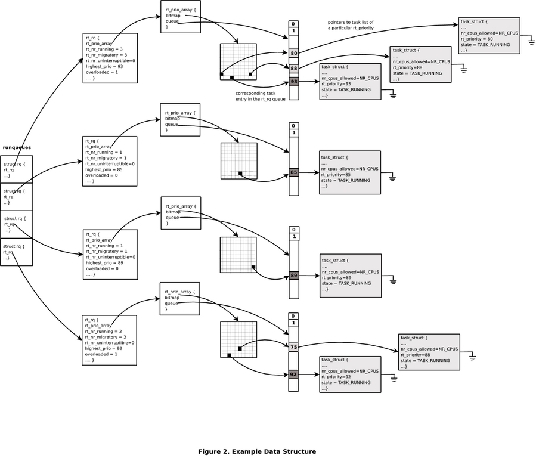
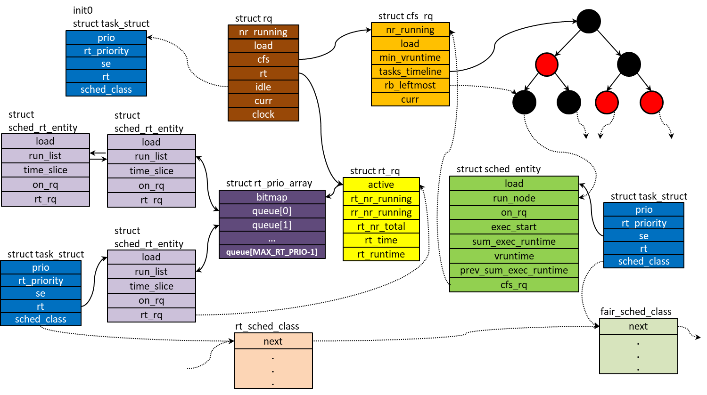
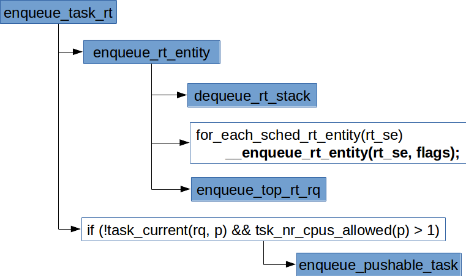
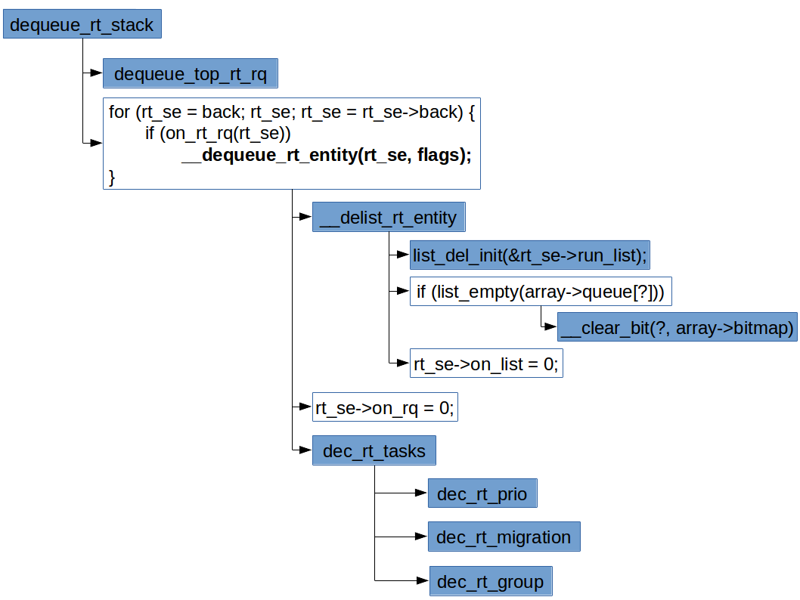
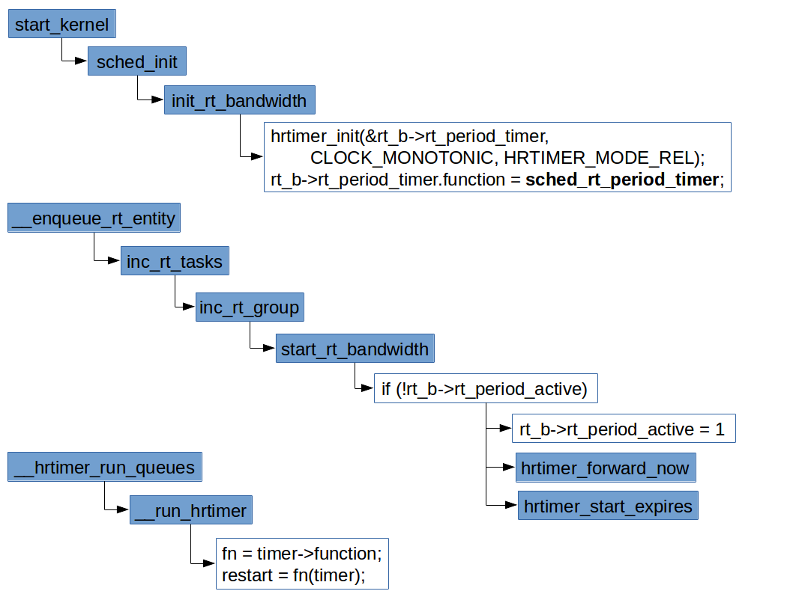
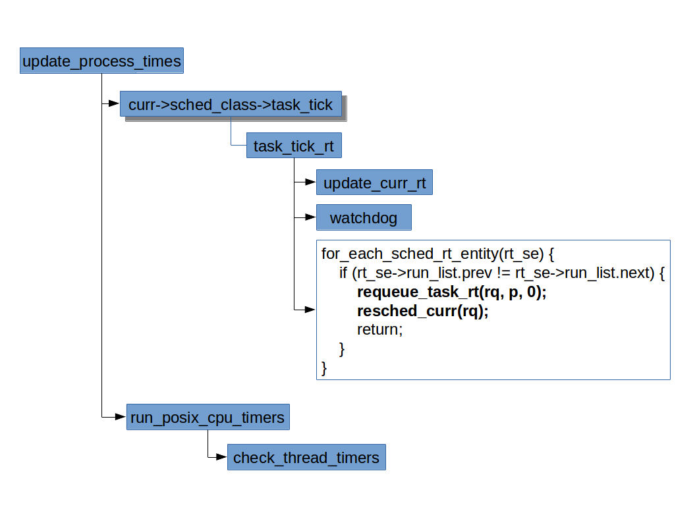

# Linux 实时调度
***
# 目录

- [概述](#概述)
- [实时调度数据结构](#实时调度数据结构)
    - [实时调度队列 rt_rq](#实时调度队列-rtrq)
    - [实时调度优先级队列 rt_prio_array](#实时调度优先级队列-rtprioarray)
    - [实时调度实体 sched_rt_entity](#实时调度实体-schedrtentity)
    - [实时调度器类 rt_sched_class](#实时调度器类-rtschedclass)
    - [数据结构间的关联](#数据结构间的关联)
       - [多核视角](#多核视角)
       - [单核视角](#单核视角)
- [创建进程](#创建进程)
  - [新进程进入队列](#新进程进入队列)
    - [自顶向下将实时任务出列](#自顶向下将实时任务出列)
    - [实时任务加入队列](#实时任务加入队列)
    - [处理实时任务入列对运行队列rq的影响](#处理实时任务入列对运行队列rq的影响)
  - [新进程能否抢占当前进程](#新进程能否抢占当前进程)
- [Real Time Scheduler Throttling](#Real-Time-Scheduler-Throttling)
- [周期性调度](#周期性调度)
  - [实时调度的update_curr_rt](#实时调度的update_curr_rt)
    - [运行队列rq的rt_avg](#运行队列rq的rt_avg)
      - [sched_time_avg_ms](#sched_time_avg_ms)
      - [sched_rt_avg_update()](#sched_rt_avg_update())
    - [实时带宽限流的检测](#实时带宽限流的检测)
      - [均衡最大运行时间balance_runtime()](#均衡最大运行时间balance_runtime())
    - [实时带宽限流的放开](#实时带宽限流的放开)
  - [实时调度的watchdog](#实时调度的watchdog)
    - [RLIMIT_RTTIME](#RLIMIT_RTTIME)
    - [实时调度的watchdog的实现](#实时调度的watchdog的实现)
- [进程唤醒](#进程唤醒)
- [选择下一个进程](#选择下一个进程)
- [进程退出](#进程退出)
- [相关API和命令](#相关API和命令)
- [参考资料](#参考资料)

# 概述
* Linux 支持`SCHED_RR`和`SCHED_FIFO`两种实时调度策略。
  * **先进先出（`SCHED_FIFO`）** 没有时间片，被调度器选择后只要不被抢占，阻塞，或者自愿放弃处理器，可以运行任意长的时间。
  * **轮转调度（`SCHED_RR`）** 有时间片，其值在进程运行时会减少。时间片用完后，该值重置，进程置于队列末尾。
* 两种调度策略都是静态优先级，内核不为这两种实时进程计算动态优先级。
* 这两种实现都属于 *软实时*。
* 实时优先级的范围：**0 ~ MAX_RT_PRIO-1**
  * `MAX_RT_PRIO`默认值为 **100**
  * 故默认实时优先级范围：**0 ~ 99**。

# 实时调度数据结构

## 实时调度队列 rt_rq
* kernel/sched/sched.h
```c
/* Real-Time classes' related field in a runqueue: */
struct rt_rq {
        struct rt_prio_array active;
        unsigned int rt_nr_running;
        unsigned int rr_nr_running;
#if defined CONFIG_SMP || defined CONFIG_RT_GROUP_SCHED
        struct {
                int curr; /* highest queued rt task prio */
#ifdef CONFIG_SMP
                int next; /* next highest */
#endif
        } highest_prio;
#endif
#ifdef CONFIG_SMP
        unsigned long rt_nr_migratory;
        unsigned long rt_nr_total;
        int overloaded;
        struct plist_head pushable_tasks;
#ifdef HAVE_RT_PUSH_IPI
        int push_flags;
        int push_cpu;
        struct irq_work push_work;
        raw_spinlock_t push_lock;
#endif
#endif /* CONFIG_SMP */
        int rt_queued;

        int rt_throttled;
        u64 rt_time;
        u64 rt_runtime;
        /* Nests inside the rq lock: */
        raw_spinlock_t rt_runtime_lock;

#ifdef CONFIG_RT_GROUP_SCHED
        unsigned long rt_nr_boosted;

        struct rq *rq;
        struct task_group *tg;
#endif
};
```
* 关联到 Per-CPU 的`struct rq`调度队列的 *实时调度队列*（当然也是每个CPU只有一个），有对应的`struct rt_rq rt`成员。
* 当多核环境`CONFIG_SMP`或`CONFIG_RT_GROUP_SCHED`特性开启时，会有`highest_prio`成员
  * 其子成员`curr`指示最高的已排队的实时任务的优先级，但未必就是当前队列上正在执行的任务的优先级。
  * 在多核环境时会有子成员`next`指示可被负载均衡的任务的最高优先级。
* `rt_nr_running` 队列上可运行的实时任务的数量。
* `rt_nr_total` 队列上的实时任务的数量。
* `rt_nr_migratory` 队列上可以被迁移到其他运行队列的实时任务的数量。
* `overloaded` 当运行队列上有多于一个实时任务且它们中至少有一个可以被迁移到其他运行队列时设置。
* `rt_queued` 实时调度队列在运行队列`rq`上的标志。
* `rt_throttled` 该实时调度队列的实时限流是否已经触发。
* `rt_time` 该实时调度队列的实时任务的所消耗的总时间。
* `rt_runtime` 该实时调度队列上实时任务允许使用的 CPU 总带宽。
  * 该值在`sched_init()`时由全局变量`struct rt_bandwidth def_rt_bandwidth`初始化。
  * `def_rt_bandwidth`的值也是在`sched_init()`设置的。
    ```c
    init_rt_bandwidth(&def_rt_bandwidth,
                global_rt_period(), global_rt_runtime());
    ```
  * `global_rt_period()`和`global_rt_runtime()`的返回值对应到`sysctl_sched_rt_period`和`sysctl_sched_rt_runtime`。
* `rt_nr_boosted` 队列上优先级提升的任务数。这里涉及“*优先级反转（priority inversion）*”问题。
  * 引入该参数的commit：[sched: rt-group: deal with PI](http://git.kernel.org/cgit/linux/kernel/git/torvalds/linux.git/commit/?id=23b0fdfc9299b137bd126e9dc22f62a59dae546d)。

## 实时调度优先级队列 rt_prio_array
* kernel/sched/sched.h
```c
/*
 * This is the priority-queue data structure of the RT scheduling class:
 */
struct rt_prio_array {
        DECLARE_BITMAP(bitmap, MAX_RT_PRIO+1); /* include 1 bit for delimiter */
        struct list_head queue[MAX_RT_PRIO];
};
```
* 每个`struct rt_rq` 有一个 *实时调度优先级队列*。
* 实时调度优先级队列是一组链表，每个实时优先级有一个对应的链表。
* 实时调度中，运行进程根据 *优先级* 放到对应的队列里。
* 对于相同优先级的进程，后面来的进程追加到同一优先级队列的队尾。

## 实时调度实体 sched_rt_entity
* include/linux/sched.h
```c
struct sched_rt_entity {
        struct list_head run_list;
        unsigned long timeout;
        unsigned long watchdog_stamp;
        unsigned int time_slice;
        unsigned short on_rq;
        unsigned short on_list;

        struct sched_rt_entity *back;
#ifdef CONFIG_RT_GROUP_SCHED
        struct sched_rt_entity  *parent;
        /* rq on which this entity is (to be) queued: */
        struct rt_rq            *rt_rq;
        /* rq "owned" by this entity/group: */
        struct rt_rq            *my_q;
#endif
};
```
* 调度器操作的是挂在实时调度优先级队列上的 *实时调度实体*，而不是直接操作`struct task_struct`所代表的进程。
* `struct task_struct`内嵌一个`struct sched_rt_entity`类型的`rt`成员，同理，对应 CFS 有`se`成员，对应 Deadline 有`dl`成员。
* `on_rq` 调度实体在运行队列上的标志。
* `on_list` 调度实体在实时调度优先级队列的数组列表上的标志。
* `time_slice` 实时调度任务的时间片。
* `watchdog_stamp` watchdog的时间戳，每次时钟中断会更新为`jiffies`的值，仅在`RLIMIT_RTTIME`软限制启用时更新。
* `timeout` 记录该调度实体的运行次数，每次时钟中断加 1，仅在`RLIMIT_RTTIME`软限制启用时更新。
* `parent` 指向调度实体的父实体。
* `rt_rq` 指向调度实体所在的实时运行队列，即调度实体属于谁。
* `my_q` 指向调度实体所拥有的实时运行队列，即谁属于调度实体。如果调度单元是`task_group`，`my_q`才会有值；如果当前调度单元是task，那么`my_q`自然为`NULL`。


## 实时调度器类 rt_sched_class
* kernel/sched/rt.c
```c
const struct sched_class rt_sched_class = {
        .next                   = &fair_sched_class,
        .enqueue_task           = enqueue_task_rt,
        .dequeue_task           = dequeue_task_rt,
        .yield_task             = yield_task_rt,

        .check_preempt_curr     = check_preempt_curr_rt,

        .pick_next_task         = pick_next_task_rt,
        .put_prev_task          = put_prev_task_rt,

#ifdef CONFIG_SMP
        .select_task_rq         = select_task_rq_rt,

        .set_cpus_allowed       = set_cpus_allowed_common,
        .rq_online              = rq_online_rt,
        .rq_offline             = rq_offline_rt,
        .task_woken             = task_woken_rt,
        .switched_from          = switched_from_rt,
#endif

        .set_curr_task          = set_curr_task_rt,
        .task_tick              = task_tick_rt,

        .get_rr_interval        = get_rr_interval_rt,

        .prio_changed           = prio_changed_rt,
        .switched_to            = switched_to_rt,

        .update_curr            = update_curr_rt,
};
```
* `struct task_struct`内有一个`const struct sched_class *sched_class;`指针，指向该进程的调度器类。
* 注意：没有实现`struct sched_class`的`task_fork`，`task_dead`等方法。

## 数据结构间的关联

### 多核视角

* 注意：此图尚未引入`struct sched_rt_entity`结构体，现在内核的实现是通过嵌在`strct task_struct`结构里的`struct sched_rt_entity rt`成员来将任务挂在任务链表上的。

### 单核视角

* 注意：此图尚未引入`struct sched_rt_entity`和`struct rt_prio_array`结构体。
* 现在内核的实现将原来在`struct task_struct`里的`run_list`成员移到了内嵌在`struct task_struct`结构里的`struct sched_rt_entity rt`成员里。
* 原来在`struct rt_rq`里的`bitmap`和`queue`成员放到了新的`struct rt_prio_array`结构体中。

# 创建进程
* `struct sched_class`没有实现`task_fork`方法，所以核心调度器在执行`sched_fork()`函数时实时调度器并不需要做什么。

## 新进程进入队列
* 简单地说，实时进程入列是一个将任务从原来的队列里删除，然后再挂到队列尾部的过程。
* 先从`enqueue_task_rt()`开始看起。



* kernel/sched/rt.c
```c
...
#define for_each_sched_rt_entity(rt_se) \
        for (; rt_se; rt_se = rt_se->parent)
...
#ifdef CONFIG_SMP
...
static void enqueue_pushable_task(struct rq *rq, struct task_struct *p)
{       /*任务从当前队列的实时队列的可推任务列表中先删除，再初始化，再重新添加*/
        plist_del(&p->pushable_tasks, &rq->rt.pushable_tasks);
        plist_node_init(&p->pushable_tasks, p->prio);
        plist_add(&p->pushable_tasks, &rq->rt.pushable_tasks);

        /* Update the highest prio pushable task */
        /*prio的值越小优先级越高，所以当任务的优先级高于可推送链表上的优先级时，需更新
				  可推送任务链表的高优先级记录*/
        if (p->prio < rq->rt.highest_prio.next)
                rq->rt.highest_prio.next = p->prio;
}
#else
...
#endif /* CONFIG_SMP */
...
static void enqueue_rt_entity(struct sched_rt_entity *rt_se, unsigned int flags)
{
        struct rq *rq = rq_of_rt_se(rt_se);

        dequeue_rt_stack(rt_se, flags); /*先将任务出列，后面有详细解释*/
        for_each_sched_rt_entity(rt_se)            /*根据 parent 指针自底向上*/
                __enqueue_rt_entity(rt_se, flags); /*将调度实体加入实时调度队列*/
        enqueue_top_rt_rq(&rq->rt);     /*处理实时任务入列对运行队列rq的影响*/
}
...
static void
enqueue_task_rt(struct rq *rq, struct task_struct *p, int flags)
{
        struct sched_rt_entity *rt_se = &p->rt;

        if (flags & ENQUEUE_WAKEUP)
                rt_se->timeout = 0;
        /*完成入列的实际工作*/
        enqueue_rt_entity(rt_se, flags);
        /*入列之后，如果入列任务不是当前任务，且允许运行该任务的 CPU 多于一个，将该任务加入rq
          队列的rt队列的可推任务链表，可被用于实时进程的负载均衡*/
        if (!task_current(rq, p) && tsk_nr_cpus_allowed(p) > 1)
                enqueue_pushable_task(rq, p);
}
...
```
* 在组调度中，调度单元的优先级则是组内优先级最高的调度单元的优先级值，也就是说调度单元的优先级受子调度单元影响，如果一个进程进入了调度单元，那么它所有的父调度单元的调度队列都要重排。
* 实际上我们看到的结果是，调度器总是选择优先级最高的实时进程调度。
* `plist_`前缀函数为 **递减优先级排序双链表(Descending-priority-sorted double-linked list)** 函数，实现见`include/linux/plist.h`和`lib/plist.c`。
* 相关的原理可见这里：[Skip_list](https://en.wikipedia.org/wiki/Skip_list)

### 自顶向下将实时任务出列


* 因为一个上层的条目的优先级依赖于底层的条目，所以出列时必须自顶向下移除。
* kernel/sched/rt.c
```c
...
static void
dequeue_top_rt_rq(struct rt_rq *rt_rq)
{
        struct rq *rq = rq_of_rt_rq(rt_rq);
        /*运行队列里的 rt 域与 rt_rq 所指的不是同一个实时调度队列是一个bug
          也就是说，该函数只用于最顶层的实时调度队列*/
        BUG_ON(&rq->rt != rt_rq);
        /*如果实时调度队列不在可运行队列上，则无需做什么事情*/
        if (!rt_rq->rt_queued)
                return;
        /*rq 记录的可运行任务数为 0 肯定是bug*/
        BUG_ON(!rq->nr_running);
        /*运行队列的可运行任务数减去实时调度队列上的可运行任务数*/
        sub_nr_running(rq, rt_rq->rt_nr_running);
        rt_rq->rt_queued = 0;        /*实时调度队列在可运行队列上的标志清零*/
}
...
static void
dec_rt_prio(struct rt_rq *rt_rq, int prio)
{
        int prev_prio = rt_rq->highest_prio.curr;
        /*如果实时调度队列上有可运行进程*/
        if (rt_rq->rt_nr_running) {
                /*出列的任务优先级比记录的最高优先级还高，警告*/
                WARN_ON(prio < prev_prio);

                /*
                 * This may have been our highest task, and therefore
                 * we may have some recomputation to do
                 */
                /*出列的如果是队列上优先级最高的进程需要更新队列的最高优先级记录*/
                if (prio == prev_prio) {
                        struct rt_prio_array *array = &rt_rq->active;
                        /*找到位映射中第一个被设置的位的位置作为最高优先级记录下来*/
                        rt_rq->highest_prio.curr =
                                sched_find_first_bit(array->bitmap);
                }
                /*如果出列的不是最高优先级任务，则最高优先级记录维持不变*/
        } else        /*否则，队列最高优先级记录设置为最低实时优先级*/
                rt_rq->highest_prio.curr = MAX_RT_PRIO;
        /*涉及CPU优先级管理的更新*/
        dec_rt_prio_smp(rt_rq, prio, prev_prio);
}
...
static inline
void dec_rt_tasks(struct sched_rt_entity *rt_se, struct rt_rq *rt_rq)
{
        WARN_ON(!rt_prio(rt_se_prio(rt_se))); /*调度实体优先级不是实时的，警告*/
        WARN_ON(!rt_rq->rt_nr_running);       /*实时调度队列的可运行任务为0，警告*/
        /*实时调度队列的可运行任务减小，对于实时组调度减小的数目包含调度组的任务数*/
        rt_rq->rt_nr_running -= rt_se_nr_running(rt_se);
        /*实时调度队列的可轮转运行任务减小，对于实时组调度减小的数目包含调度组的可轮转任务数*/
        rt_rq->rr_nr_running -= rt_se_rr_nr_running(rt_se);
        /*调度实体出列时，更新实时调度队列的优先级记录*/
        dec_rt_prio(rt_rq, rt_se_prio(rt_se));
        dec_rt_migration(rt_se, rt_rq);
        /*调度实体出列时组调度相关参数的更新，这里是目前唯一减小 rt_rq->rt_nr_boosted 的*/
        dec_rt_group(rt_se, rt_rq);
}
...
static void __delist_rt_entity(struct sched_rt_entity *rt_se, struct rt_prio_array *array)
{
        list_del_init(&rt_se->run_list); /*将调度实体从对应数组列表上移除*/
        /*移除之后，如果该数组列表为空，则将数组对应的位映射也清空*/
        if (list_empty(array->queue + rt_se_prio(rt_se)))
                __clear_bit(rt_se_prio(rt_se), array->bitmap);
        /*调度实体在列表上的标志清零*/
        rt_se->on_list = 0;
}
...
/*
 * Change rt_se->run_list location unless SAVE && !MOVE
 *
 * assumes ENQUEUE/DEQUEUE flags match
 */
static inline bool move_entity(unsigned int flags)
{
        if ((flags & (DEQUEUE_SAVE | DEQUEUE_MOVE)) == DEQUEUE_SAVE)
                return false;

        return true;
}

static void __dequeue_rt_entity(struct sched_rt_entity *rt_se, unsigned int flags)
{
        struct rt_rq *rt_rq = rt_rq_of_se(rt_se);
        struct rt_prio_array *array = &rt_rq->active;
        /*除非 DEQUEUE_SAVE flag被设置，否则该实体在队列中的位置是可移动的*/
        if (move_entity(flags)) {
                WARN_ON_ONCE(!rt_se->on_list); /*调度实体不在列表上，警告一次*/
                __delist_rt_entity(rt_se, array);/*将调度实体从数组列表中移除*/
        }
        rt_se->on_rq = 0; /*调度实体在运行队列的标志清零*/
        /*调度实体出列时，实时调度队列相关的处理*/
        dec_rt_tasks(rt_se, rt_rq);
}
...
/*
 * Because the prio of an upper entry depends on the lower
 * entries, we must remove entries top - down.
 */
static void dequeue_rt_stack(struct sched_rt_entity *rt_se, unsigned int flags)
{
        struct sched_rt_entity *back = NULL;
        /*将 back 指针随着任务的 parent 指针逐渐指向最顶层的任务*/
        for_each_sched_rt_entity(rt_se) {
                rt_se->back = back;
                back = rt_se;
        }
        /*将实时任务出列会对运行队列rq造成一些影响，这里要处理一下，
          此时back必须是最顶层的实时调度队列上的调度实体*/
        dequeue_top_rt_rq(rt_rq_of_se(back));
        /*自顶向下将在队列上的实时调度实体移出队列*/
        for (rt_se = back; rt_se; rt_se = rt_se->back) {
                if (on_rt_rq(rt_se))
                        __dequeue_rt_entity(rt_se, flags);
        }
}
...
```

### 实时任务加入队列
* kernel/sched/rt.c
```c
...
#if defined CONFIG_SMP || defined CONFIG_RT_GROUP_SCHED
static void
inc_rt_prio(struct rt_rq *rt_rq, int prio)
{
        int prev_prio = rt_rq->highest_prio.curr;
        /*如果入队的任务优先级高于时是调度队列的最高优先级记录，则更新该记录*/
        if (prio < prev_prio)
                rt_rq->highest_prio.curr = prio;
        /*涉及CPU优先级管理的更新*/
        inc_rt_prio_smp(rt_rq, prio, prev_prio);
}
...
#endif
...
static inline
void inc_rt_tasks(struct sched_rt_entity *rt_se, struct rt_rq *rt_rq)
{
        int prio = rt_se_prio(rt_se);

        WARN_ON(!rt_prio(prio));
        /*实时调度队列的可运行任务增加，对于实时组调度增加的数目包含调度组的任务数*/
        rt_rq->rt_nr_running += rt_se_nr_running(rt_se);
        /*实时调度队列的可轮转运行任务增加，对于实时组调度增加的数目包含调度组的可轮转任务数*/
        rt_rq->rr_nr_running += rt_se_rr_nr_running(rt_se);
        /*调度实体入列时，更新实时调度队列的优先级记录*/
        inc_rt_prio(rt_rq, prio);
        inc_rt_migration(rt_se, rt_rq);
        /*调度实体入列时组调度相关参数的更新，这里是目前唯一增加 rt_rq->rt_nr_boosted 的*/
        inc_rt_group(rt_se, rt_rq);
}
...
static void __enqueue_rt_entity(struct sched_rt_entity *rt_se, unsigned int flags)
{
        struct rt_rq *rt_rq = rt_rq_of_se(rt_se);
        struct rt_prio_array *array = &rt_rq->active;
        struct rt_rq *group_rq = group_rt_rq(rt_se);
        struct list_head *queue = array->queue + rt_se_prio(rt_se);

        /*
         * Don't enqueue the group if its throttled, or when empty.
         * The latter is a consequence of the former when a child group
         * get throttled and the current group doesn't have any other
         * active members.
         */
        /*如果调度组已限流或者调度组为空，则不要将调度实体加入该组。
          当一个子调度组限流且当前调度组没有任何活跃的成员时，后者是由前者导致的结果*/
        if (group_rq && (rt_rq_throttled(group_rq) || !group_rq->rt_nr_running)) {
                /*由于已经限流了，如果此时调度实体在列表上，还需要将它拿出来。*/
                if (rt_se->on_list)
                        __delist_rt_entity(rt_se, array);
                return;
        }
        /*对于可移动的调度实体，进行以下处理*/
        if (move_entity(flags)) {
                WARN_ON_ONCE(rt_se->on_list);
                if (flags & ENQUEUE_HEAD)    /*如果要求插入队列头*/
                        list_add(&rt_se->run_list, queue);
                else                         /*否则插入队尾*/
                        list_add_tail(&rt_se->run_list, queue);
                /*实时调度优先级队列的数组位映射置位*/
                __set_bit(rt_se_prio(rt_se), array->bitmap); /*__*/
                rt_se->on_list = 1;          /*调度实体在列表上了*/
        }
        /*不可移动的调度实体无需出列入列，rt_se->on_list成员也不会变*/
        rt_se->on_rq = 1;        /*调度实体在运行队列的标志置为 1*/
        /*调度实体入列时，实时调度队列相关的处理*/
        inc_rt_tasks(rt_se, rt_rq);
}
```
### 处理实时任务入列对运行队列rq的影响
* kernel/sched/rt.c
```c
static void
enqueue_top_rt_rq(struct rt_rq *rt_rq)
{
        struct rq *rq = rq_of_rt_rq(rt_rq);
        /*运行队列里的 rt 域与 rt_rq 所指的不是同一个实时调度队列是一个bug，
          也就是说，该函数只用于最顶层的实时调度队列*/
        BUG_ON(&rq->rt != rt_rq);
        /*如果实时调度队列已经在可运行队列上，则无需做什么事情*/
        if (rt_rq->rt_queued)
                return;
        /*如同__enqueue_rt_entity()，如果调度组已限流或者调度组为空，则不做进一步处理*/
        if (rt_rq_throttled(rt_rq) || !rt_rq->rt_nr_running)
                return;
        /*运行队列的可运行任务数加上实时调度队列上的可运行任务数*/
        add_nr_running(rq, rt_rq->rt_nr_running);
        rt_rq->rt_queued = 1;        /*实时调度队列在可运行队列上的标志置 1*/
}
```

## 新进程能否抢占当前进程
* 当核心调度器在属于不同调度器类之间的任务做完判断，无法决定能否抢占，需要进一步由各调度器进行判断。
* 具体到实时调度器，就是`check_preempt_curr_rt()`的实现。
* kernel/sched/rt.c
```c
...
#ifdef CONFIG_SMP
...
static void
requeue_rt_entity(struct rt_rq *rt_rq, struct sched_rt_entity *rt_se, int head)
{       /*如果调度实体在运行队列上，之前 enqueue 的时候会把它放把放在队列上*/
        if (on_rt_rq(rt_se)) {
                struct rt_prio_array *array = &rt_rq->active;
                struct list_head *queue = array->queue + rt_se_prio(rt_se);
                /*head 非 0，插入列表的头部; head 为 0，插入列表的尾部。
                  之前在check_preempt_equal_prio()里传的 head 值为 1*/
                if (head)
                        list_move(&rt_se->run_list, queue);
                else
                        list_move_tail(&rt_se->run_list, queue);
        }
}

static void requeue_task_rt(struct rq *rq, struct task_struct *p, int head)
{
        struct sched_rt_entity *rt_se = &p->rt;
        struct rt_rq *rt_rq;
        /*由下至上给实时调度优先级调度队列重新排队*/
        for_each_sched_rt_entity(rt_se) {
                rt_rq = rt_rq_of_se(rt_se);
                requeue_rt_entity(rt_rq, rt_se, head);
        }
}
...
static void check_preempt_equal_prio(struct rq *rq, struct task_struct *p)
{
        /*
         * Current can't be migrated, useless to reschedule,
         * let's hope p can move out.
         */
        /*允许运行当前任务任务的CPU只有一个，即不能迁移，无法被抢占，无需重新调度*/
        if (tsk_nr_cpus_allowed(rq->curr) == 1 ||
            !cpupri_find(&rq->rd->cpupri, rq->curr, NULL))
                return;

        /*
         * p is migratable, so let's not schedule it and
         * see if it is pushed or pulled somewhere else.
         */
        /*任务 p 是可迁移的，则看看能不能把它推或者拉到其他地方*/
        if (tsk_nr_cpus_allowed(p) != 1
            && cpupri_find(&rq->rd->cpupri, p, NULL))
                return;

        /*
         * There appears to be other cpus that can accept
         * current and none to run 'p', so lets reschedule
         * to try and push current away:
         */
        /*其他 CPU 能接受当前任务且没有能运行 'p' 的CPU，则另其重新调度，尝试把当前任务推走
          注意，这里第三个参数 head 的值是 1，会导致把 p 排在列表前面，表示会抢占*/
        requeue_task_rt(rq, p, 1);
        resched_curr(rq); /*设置重新调度标志*/
}

#endif /* CONFIG_SMP */

/*
 * Preempt the current task with a newly woken task if needed:
 */
static void check_preempt_curr_rt(struct rq *rq, struct task_struct *p, int flags)
{       /*唤醒的任务比运行队列的当前任务的优先级高，设置当前进程需要重新调度。
          由于实时调度必须保证更高优先级的任务能得到运行，所以这个条件比较简单。*/
        if (p->prio < rq->curr->prio) {
                resched_curr(rq);  /*注意：这里不是立即调度，只是设置重新调度标志*/
                return;
        }

#ifdef CONFIG_SMP
        /*
         * If:
         *
         * - the newly woken task is of equal priority to the current task
         * - the newly woken task is non-migratable while current is migratable
         * - current will be preempted on the next reschedule
         *
         * we should check to see if current can readily move to a different
         * cpu.  If so, we will reschedule to allow the push logic to try
         * to move current somewhere else, making room for our non-migratable
         * task.
         */
        /*假如：
          - 新唤醒的任务和当前任务的优先级相等
          - 新唤醒任务是不可迁移的，而当前任务是可迁移的
          - 当前任务在下次重新调度时将要被抢占

          我们应该检查看当前任务是否能被容易地移到一个不同的CPU。如果这样的话，我们应该重新
          调度以允许（迁移的）推逻辑可以将当前任务移到其他地方，给我们不可迁移的任务腾出空间。*/

        /*注意第二个条件，如果当前进程不需要重新调度，还需要进一步检查新进程能否抢占；
          如果当前进程需要重新调度，则无需检查，随后核心调度器检查到这一情况会重新调度。*/
        if (p->prio == rq->curr->prio && !test_tsk_need_resched(rq->curr))
                check_preempt_equal_prio(rq, p); /*在优先级相等的前提下看能否抢占*/
#endif
}
```
* 可见，即便在优先级相同的条件下，想要抢占当前实时进程并不是件容易的事。如果不是`SCHED_RR`的进程，且没有被阻塞等原因放弃处理器，则极有可能处于不需重新调度的状态，这时需检查新进程与当前进程的迁移情况才能决定能否抢占。

# Real Time Scheduler Throttling

* 在介绍实时任务的周期性调度之前需要先了解一下 *Real Time Scheduler Throttling*，如果除去这部分内容和负载均衡，实时进程的周期性调度做的事情非常简单。
* 实时进程是根据优先级抢占运行的。当没有更高优先级的实时进程抢占，而此进程如果有 bug 等原因长时间运行，不调度其它进程，系统就会出现无响应。
* **Real Time Scheduler Throttling** 是为了防止出现这种情况的防护机制，它允许管理员给实时任务分配带宽。

* Realtime throttling 可以通过两个 sysctl 参数进行控制
  * **/proc/sys/kernel/sched_rt_period_us**

  > Defines the period in μs (microseconds) to be considered as 100% of CPU bandwidth. The default value is 1,000,000 μs (1 second). Changes to the value of the period must be very well thought out as a period too long or too small are equally dangerous.

  * **/proc/sys/kernel/sched_rt_runtime_us**

  > The total bandwidth available to all realtime tasks. The default values is 950,000 μs (0.95 s) or, in other words, 95% of the CPU bandwidth. **Setting the value to -1 means that realtime tasks may use up to 100% of CPU times.** This is only adequate when the realtime tasks are well engineered and have no obvious caveats such as unbounded polling loops.

* Realtime throttling 机制缺省定义为 95% 的 CPU 时间可以被用于实时任务，剩余 5% 会被分给非实时任务。
* 需要特别注意的是，如果某个实时任务占据了 95% 的 CPU 时间，在那个 CPU 上剩下的 **实时任务** 将不会运行，而余下的 5% 的 CPU 时间只被用于 **非实时任务**。
* 该功能的两面性：
  * 有问题的实时任务不会造成系统的锁定，让非实时任务得不到运行
  * 实时任务分配到的 CPU 时间的减少会影响它们的性能
* kernel/sysctl.c
```c
static struct ctl_table kern_table[] = {
  ...
  {
          .procname       = "sched_rt_period_us",
          .data           = &sysctl_sched_rt_period,
          .maxlen         = sizeof(unsigned int),
          .mode           = 0644,
          .proc_handler   = sched_rt_handler,
  },
  {
          .procname       = "sched_rt_runtime_us",
          .data           = &sysctl_sched_rt_runtime,
          .maxlen         = sizeof(int),
          .mode           = 0644,
          .proc_handler   = sched_rt_handler,
  },
  ...
};
```

# 周期性调度
* 周期性调度指的是由时钟中断引起的是否可调度的检查。当前任务被时钟中断运行后，中断处理程序会调用任务的调度器类的`task_tick(rq, curr, 0)`方法看是否需要重新调度。
* 对于实时调度，我们先看`task_tick_rt()`的实现。
* kernel/sched/rt.c
```c
int sched_rr_timeslice = RR_TIMESLICE;
...
static void task_tick_rt(struct rq *rq, struct task_struct *p, int queued)
{       
        struct sched_rt_entity *rt_se = &p->rt;
        /*先不看这个复杂的函数，可以先把它理解成，更新实时任务的统计信息。*/
        update_curr_rt(rq);
        /*实时调度的 watchdog，后面会详细解释*/
        watchdog(rq, p);

        /*      
         * RR tasks need a special form of timeslice management.
         * FIFO tasks have no timeslices.
         */
        /*RR 任务是有时间片的，而 FIFO 任务没有，所以如果上面两种情况没有引发重新调度的话，
          周期性调度是不会造成 FIFO 任务被抢占的。*/
        if (p->policy != SCHED_RR)
                return;
        /*RR 任务每个时钟 tick 时间片减 1，如果还有时间片会继续运行*/
        if (--p->rt.time_slice)
                return;
        /*RR 任务时间片用完了，重置为 RR 任务的时间片*/
        p->rt.time_slice = sched_rr_timeslice;

        /*      
         * Requeue to the end of queue if we (and all of our ancestors) are not
         * the only element on the queue
         */
        /*如果 RR 任务的时间片用完了，我们（和我们所有的祖先）不是列表上唯一的元素，则排入队
          尾*/
        for_each_sched_rt_entity(rt_se) {
                if (rt_se->run_list.prev != rt_se->run_list.next) { /*列表不为空*/
                        requeue_task_rt(rq, p, 0); /*参数 0，插入到队尾*/
                        resched_curr(rq);          /*时间片用完，重新调度其他RR任务*/
                        return;
                }
        }
}
```
* `SCHED_RR`任务的缺省时间片为 *100 毫秒*。
  * include/linux/sched/rt.h
  ```c
  /*
   * default timeslice is 100 msecs (used only for SCHED_RR tasks).
   * Timeslices get refilled after they expire.
   */
  #define RR_TIMESLICE            (100 * HZ / 1000)
  ```
  * kernel/sysctl.c
  ```c
  static struct ctl_table kern_table[] = {
    ...
    {
          .procname       = "sched_rr_timeslice_ms",
          .data           = &sched_rr_timeslice,
          .maxlen         = sizeof(int),
          .mode           = 0644,
          .proc_handler   = sched_rr_handler,
    },
    ...
  };
  ```
* `SCHED_RR`任务的时间片可以通过`sysctl`修改。
  ```
  >cat /proc/sys/kernel/sched_rr_timeslice_ms
  25
  ```
* **所以这里尤其需要注意**：即使某一优先级的`SCHED_RR`任务只有一个，即使它的时间片用完了，比它优先级低的实时任务并不会被调度，而是该进程获得新的时间片继续运行。
* 在不考虑`update_curr_rt()`和`watchdog()`的情况下，我们可以看到对于周期性调度的处理非常简单：
  * `SCHED_FIFO`会一直运行。
  * `SCHED_RR`会看时间片是否用完：
    * 如果没用完则继续执行；
    * 否则重置时间片，如果包括它祖先的这一条链上如果有其他`SCHED_RR`任务的话，调度其他的`SCHED_RR`任务。

## 实时调度的update_curr_rt
* `update_curr_rt()`函数主要负责进程时间相关的更新，它也是实时调度器类的`update_curr`方法的实现，因此会被核心调度器用到。
* 除此之外，实时调度器也会在内部多处调用`update_curr_rt()`更新时间相关的信息：
  * `dequeue_task_rt()`————进程移出运行队列之时
  * `pick_next_task_rt()`————进程被选为下一个要被调度的任务之时
  * `put_prev_task_rt()`————进程要被抢占换出之时
  * `task_tick_rt()`————时钟中断发生之时
* kernel/sched/rt.c
```c
/*
 * Update the current task's runtime statistics. Skip current tasks that
 * are not in our scheduling class.
 */
static void update_curr_rt(struct rq *rq)
{
        struct task_struct *curr = rq->curr;
        struct sched_rt_entity *rt_se = &curr->rt;
        u64 delta_exec;
        /*因为会被核心调度器用到，当前任务如果不是正在使用实时调度器，则跳过*/
        if (curr->sched_class != &rt_sched_class)
                return;
        /*- rq_clock_task(rq)：获取所在队列的时钟
          - curr->se.exec_start：记录的是上一次调用 update_curr_rt() 的时钟
          - delta_exec：以上二者的差，从上次上一次调用 update_curr_rt() 到现在进程运行的时间
          这一段时间任务处于正在运行状态。*/
        delta_exec = rq_clock_task(rq) - curr->se.exec_start;
        if (unlikely((s64)delta_exec <= 0))
                return;

        /* Kick cpufreq (see the comment in kernel/sched/sched.h). */
        cpufreq_update_this_cpu(rq, SCHED_CPUFREQ_RT);
        /*更新一些统计值*/
        schedstat_set(curr->se.statistics.exec_max,
                      max(curr->se.statistics.exec_max, delta_exec));
        /*sum_exec_runtime是进程累计使用的CPU时间，不断累加。*/
        curr->se.sum_exec_runtime += delta_exec;
        account_group_exec_runtime(curr, delta_exec); /*运行时间记账*/
        /*实际流逝的时间计算完了，更新 exec_start 以备下次 update_curr_rt() 使用*/
        curr->se.exec_start = rq_clock_task(rq);
        cpuacct_charge(curr, delta_exec); /*charge执行时间到记账组*/
        /*更新rq->rt_avg，该值反映目前系统中实时任务平均被分配到的执行时间*/
        sched_rt_avg_update(rq, delta_exec);
        /*如果实时带宽限制功能没有开启，update_curr_rt()的任务到此结束
          这里检查的是 sysctl_sched_rt_runtime 的值。*/
        if (!rt_bandwidth_enabled())
                return;
        /*如果 Real Time Scheduler Throttling 功能开启，由下至上遍历调度实体*/
        for_each_sched_rt_entity(rt_se) {
                struct rt_rq *rt_rq = rt_rq_of_se(rt_se);
                /*如果该队列的实时带宽不是 RUNTIME_INF，说明该实时调度队列对带宽有限制。
                  这里检查的是 rt_rq->rt_runtime。*/
                if (sched_rt_runtime(rt_rq) != RUNTIME_INF) {
                        raw_spin_lock(&rt_rq->rt_runtime_lock);
                        rt_rq->rt_time += delta_exec; /*增加到队列的实时进程运行时间*/
                        if (sched_rt_runtime_exceeded(rt_rq))
                                resched_curr(rq); /*设置重新调度标志位*/
                        raw_spin_unlock(&rt_rq->rt_runtime_lock);
                }
        }
}
```

### 运行队列rq的rt_avg
* `struct rq`的`rt_avg`成员用于统计目前实时任务执行时间的平均值。
* 通过`update_curr_rt()`中得到的执行时间的增量`delta_exec`，再由`sched_rt_avg_update()`把该值与运行队列的`rt_avg`取平均值，得到新的`rt_avg`。
* 可以回溯函数调用`scale_rt_capacity() -> update_cpu_capacity() -> update_group_capacity()`看到`rt_avg`与`age_stamp`在负载均衡中的作用。

#### sched_time_avg_ms
* `sched_time_avg_ms`解释看[这里](https://www.suse.com/documentation/sles-12/book_sle_tuning/data/sec_tuning_taskscheduler_cfs.html#)
  * 该参数设置计算 *花在运行实时任务的时间的平均值* 的周期。
  * 这个值协助 CFS 做出负载均衡的决定，并且给出一个有高优先实时任务的CPU有多忙的指征。
  * 对该值的优化设置高度工作负载相关，且取决于实时任务运行多频繁和运行多长时间。
* 用`sysctl`或`proc`文件系统下参数`sched_time_avg_ms`调节
  ```
  $ cat /proc/sys/kernel/sched_time_avg_ms
  1000
  ```

#### sched_rt_avg_update()
* kernel/sched/sched.h
```c
static inline void sched_rt_avg_update(struct rq *rq, u64 rt_delta)
{
        rq->rt_avg += rt_delta * arch_scale_freq_capacity(NULL, cpu_of(rq));
        /*该函数负责更新加上执行时间增量之后的队列实时任务执行时间平均值*/
        sched_avg_update(rq);
}
```

* kernel/sched/core.c
```c
void sched_avg_update(struct rq *rq)
{
        s64 period = sched_avg_period(); /*取得周期的值，单位已转成纳秒*/
        /*并不是每次 update_curr_rt() 都会进入这个循环，仅当过队列时钟走过一个周期的时间后
          才会重新计算平均值。*/
        while ((s64)(rq_clock(rq) - rq->age_stamp) > period) {
                /*
                 * Inline assembly required to prevent the compiler
                 * optimising this loop into a divmod call.
                 * See __iter_div_u64_rem() for another example of this.
                 */
                /*__内联汇编为了防止编译器将该循环优化成除模运算__*/
                asm("" : "+rm" (rq->age_stamp)); /*其实没做什么事情，只是为了防止优化*/
                rq->age_stamp += period; /*更新 age_stamp 的值，否则会继续循环下去*/
                rq->rt_avg /= 2; /*时钟走过一个周期了，可以再次计算平均值了，逝去的时间已经累加进 rt_avg了*/
        }
}
```
* kernel/sched/sched.h
```c
static inline u64 sched_avg_period(void)
{       /* 周期的值是设定的 sysctl_sched_time_avg 的1/2 */
        return (u64)sysctl_sched_time_avg * NSEC_PER_MSEC / 2;
}
```
* `sysctl_sched_time_avg`就是通过`/proc/sys/kernel/sched_time_avg_ms`设置，单位是 **毫秒**。
* 该 feature 最初由以下 commit 引入：
  ```
  commit e9e9250bc78e7f6342517214c0178a529807964b
  Author: Peter Zijlstra <a.p.zijlstra@chello.nl>
  Date:   Tue Sep 1 10:34:37 2009 +0200

      sched: Scale down cpu_power due to RT tasks

      Keep an average on the amount of time spend on RT tasks and use
      that fraction to scale down the cpu_power for regular tasks.
  ```

### 实时带宽限流的检测
* 之前介绍过的 *Real Time Scheduler Throttling* 功能的检测在`update_curr_rt()`的`sched_rt_runtime_exceeded()`函数。
* `sched_rt_runtime_exceeded()`返回值为 **1** 时，`update_curr_rt()`会设置重新调度标志，表示需要限流。
* `sched_rt_runtime_exceeded()`返回值为 **0** 时，实时任务至少不会因为 RT Throttling 的原因被抢占（当然，还有其他别的原因而被抢占）。
* `rt_rq->rt_queued` 作为实时调度队列的标志位，大于 0 时表示未被限流。
* 被限流的是调度实体是进程是比较简单，只是简单地关闭 `rt_rq->rt_queued = 0`，不会改变进程状态。
* 被限流的调度实体是调度组的情况比较复杂。调度实体会被移出所属调度组的实时调度队列，但也不会处于任何一个睡眠队列，因为它并不是真正睡眠，而且它也不是一个进程。
  * 实时调度队列 `rt_rq->rt_queued = 0`
  * 等到限流被放开时，它会被放回实时调度队列
* kernel/sched/rt.c
```c
...
#ifdef CONFIG_RT_GROUP_SCHED
...
static void sched_rt_rq_dequeue(struct rt_rq *rt_rq)
{
        /*对于实时组调度的情况要复杂一些*/
        struct sched_rt_entity *rt_se;
        int cpu = cpu_of(rq_of_rt_rq(rt_rq)); /*实时调度队列所在的 CPU*/
        /*rt_se 为该实时调度队列所属的 task_group 的实时调度实体*/
        rt_se = rt_rq->tg->rt_se[cpu];
        /*如果该调度实体不是调度组，而是进程，则简单地关闭 rt_rq->rt_queued = 0*/
        if (!rt_se)
                dequeue_top_rt_rq(rt_rq);
        /*如果该调度实体是调度组，则将该调度组移出队列，且把它的 rt_queued = 0，这样就不会
          被 pick 到，并且还要将它的父调度实体放回队列*/
        else if (on_rt_rq(rt_se))
                dequeue_rt_entity(rt_se, 0);
}
#else /* !CONFIG_RT_GROUP_SCHED */
...
static inline void sched_rt_rq_dequeue(struct rt_rq *rt_rq)
{
        /*对于不是实时组调度的情况，只是简单地关闭 rt_rq->rt_queued = 0，
          这样 pick_next_task_rt() 的时候 sched_rt_runnable() 就会返回 false*/
        dequeue_top_rt_rq(rt_rq);
}
...
#endif /* CONFIG_RT_GROUP_SCHED */

static inline int rt_rq_throttled(struct rt_rq *rt_rq)
{       /*在队列已经被实时限流的仍要检查该队列上是否有需要被提升优先级的任务
          如果有，即使已被限流，仍然要被认为不限流；
          如果没有，才被认为该队列已被限流。*/
        return rt_rq->rt_throttled && !rt_rq->rt_nr_boosted;
}
...
static int sched_rt_runtime_exceeded(struct rt_rq *rt_rq)
{
        u64 runtime = sched_rt_runtime(rt_rq); /*获得给当前队列分配的实时任务最大运行时间*/
        /*由于要解决优先级反转的问题，只看 rt_throttled 的情况并不足以判断该队列是否已超出
          了运行时间，在优先级反转的情况下，需要提升优先级尽快完成任务，因此此时不能对其限流。*/
        if (rt_rq->rt_throttled)
                return rt_rq_throttled(rt_rq);
        /*如果分配的最大运行时间比设定的当前队列的实时周期还大，视为不对实时带宽限流*/
        if (runtime >= sched_rt_period(rt_rq))
                return 0;
        /*该功能用于 RT_RUNTIME_SHARE feature，当该功能开启时，当前队列的运行时间超过了最
          大运行时间时，则可以从其他 CPU 上借用时间。*/
        balance_runtime(rt_rq);
        runtime = sched_rt_runtime(rt_rq); /*再次获得当前队列的实时任务最大运行时间*/
        if (runtime == RUNTIME_INF) /*均衡runtime之后，runtime变为无限制了，不限流*/
                return 0;
        /*该实时队列上累计的运行时间超过了分配的实时任务最大运行时间*/
        if (rt_rq->rt_time > runtime) {
                struct rt_bandwidth *rt_b = sched_rt_bandwidth(rt_rq);

                /*
                 * Don't actually throttle groups that have no runtime assigned
                 * but accrue some time due to boosting.
                 */
                /*rt_b 为运行队列 rt_rq 的进程组带宽控制结构体指针，如果 rt_runtime 即
                  此进程组的任务运行时间额度值有效，则设置 rt_throttled 为 1，表明此队列
                  的实时调度受到限制。
                  对于 runtime 没指定的组，实际上没有限流，因此不需要设置 rt_throttled*/
                if (likely(rt_b->rt_runtime)) {
                        /*此处是唯一能找到将 rt_throttled 设为 1 的地方*/
                        rt_rq->rt_throttled = 1;
                        /*著名的打印输出，实时带宽用完的标志*/
                        printk_deferred_once("sched: RT throttling activated\n");
                } else {
                        /*
                         * In case we did anyway, make it go away,
                         * replenishment is a joke, since it will replenish us
                         * with exactly 0 ns.
                         */
                        /*但 PI boosting 的队列 rt_time 仍然会因此累积，这会导致再次被
                          限流。由于 runtime 是 0，补充 rt_time 无济于事，因此这里将
                          rt_time 清零，跳过限流。*/
                        rt_rq->rt_time = 0;
                }
                /*上面有可能更改了 rt_throttled，需要再次判断是否限流，且考虑优先级提升因素*/
                if (rt_rq_throttled(rt_rq)) {
                        sched_rt_rq_dequeue(rt_rq); /*调度实体移出调度队列，不再被调度*/
                        return 1;
                }
        }

        return 0;
}
```
* 关于此处将队列累积运行时间`rt_rq->rt_time`清零，见此commit：[sched/rt: Do not throttle when PI boosting](http://git.kernel.org/cgit/linux/kernel/git/torvalds/linux.git/commit/?id=7abc63b1bd412f7655b62ef3e35c3c11c5134636)

#### 均衡最大运行时间balance_runtime()
* 前面讲到当前队列运行时间超过最大运行时间后，可以尝试用`balance_runtime()`从其他 CPU 上借用时间，以避免被限流。
* 该功能需要开启`RT_RUNTIME_SHARE`特性，管理员可以通过`/sys/kernel/debug/sched_features`查看和设置。
* `RT_RUNTIME_SHARE`默认是使能的(见`kernel/sched/features.h`文件)。
* 毫无疑问，该功能会造成各队列`rt_rq`上的`rt_runtime`与预设的`sysctl_sched_rt_runtime`不一致。
* kernel/sched/rt.c
```c
/*
 * We ran out of runtime, see if we can borrow some from our neighbours.
 */
static void do_balance_runtime(struct rt_rq *rt_rq)
{        /*取本队列所属任务组的实时带宽数据*/
        struct rt_bandwidth *rt_b = sched_rt_bandwidth(rt_rq);
         /*取实时调度队列所属的 root domain*/
        struct root_domain *rd = rq_of_rt_rq(rt_rq)->rd;
        int i, weight;
        u64 rt_period;
        /*rd->span 表示此 root domain 的 rq 可运行的 CPU 的一个 mask。
          cpumask_weight()就是计算该 mask 里被设置的位的 CPU 个数，*/
        weight = cpumask_weight(rd->span);

        raw_spin_lock(&rt_b->rt_runtime_lock);
        rt_period = ktime_to_ns(rt_b->rt_period); /*任务组的实时运行周期，转成纳秒*/
        /*以下 for 循环就是遍历该 root domain 上的每个 CPU*/
        for_each_cpu(i, rd->span) {
                struct rt_rq *iter = sched_rt_period_rt_rq(rt_b, i);
                s64 diff;
                /*是自己，跳过*/
                if (iter == rt_rq)
                        continue;
                /*偷的是别的队列，所以加的是别的队列的 rt_runtime_lock 锁*/
                raw_spin_lock(&iter->rt_runtime_lock);
                /*
                 * Either all rqs have inf runtime and there's nothing to steal
                 * or __disable_runtime() below sets a specific rq to inf to
                 * indicate its been disabled and disalow stealing.
                 */
                /*如果所有的运行队列都设置无穷大的最大运行时间（这里表示关闭 RT throttling），
                  那没什么可偷的。或者通过 __disable_runtime() 把某个运行队列的
                  runtime 设成无穷大（表示关闭 rt_throttling）且不允许偷。
                  如此，跳过这个队列。*/
                if (iter->rt_runtime == RUNTIME_INF)
                        goto next;

                /*
                 * From runqueues with spare time, take 1/n part of their
                 * spare time, but no more than our period.
                 */
                /*最大运行时间 - 累计运行时间 = 该队列上可用的运行时间（diff）*/
                diff = iter->rt_runtime - iter->rt_time;
                if (diff > 0) { /*该队列还有可用实时运行时间*/
                        /*取可用时间的 1/weight*/
                        diff = div_u64((u64)diff, weight);
                        /*如果出现借的太多，甚至超过实时运行周期，那就少借点*/
                        if (rt_rq->rt_runtime + diff > rt_period)
                                diff = rt_period - rt_rq->rt_runtime;
                        iter->rt_runtime -= diff;  /*借出队列上扣除最大运行时间*/
                        rt_rq->rt_runtime += diff; /*扣除的时间给借入队列*/
                        /*如果借到的时间仍不足以填满此任务组的实时运行周期，则继续去其他
                          CPU 的队列去借，直到：
                          - 没有队列可以借了
                          - 或者借到的时间达到此任务组的实时运行周期了*/
                        if (rt_rq->rt_runtime == rt_period) {
                                raw_spin_unlock(&iter->rt_runtime_lock);
                                break;
                        }
                }
next:
                raw_spin_unlock(&iter->rt_runtime_lock);
        }
        raw_spin_unlock(&rt_b->rt_runtime_lock);
}
...
static void balance_runtime(struct rt_rq *rt_rq)
{       /*需开启调度器的 RT_RUNTIME_SHARE 特性，否则啥也不做*/
        if (!sched_feat(RT_RUNTIME_SHARE))
                return;
        /*队列实时任务的累计时间超过了分配的最大运行时间*/
        if (rt_rq->rt_time > rt_rq->rt_runtime) {
                raw_spin_unlock(&rt_rq->rt_runtime_lock);
                do_balance_runtime(rt_rq);  /*均衡各队列的最大可运行时间*/
                raw_spin_lock(&rt_rq->rt_runtime_lock);
        }
}
```
* 实时进程所在的 CPU 占用超时，可以向其他的 CPU 借用，将其他 CPU 的时间借用过来，这样此实时进程所在的CPU占有率达到100%。这样做的目的是为了避免实时进程由于缺少 CPU 时间而向其他的 CPU 迁移，减少不必要的迁移成本。
* 即便从别的队列偷取可运行时间，本队列的实时进程的可运行时间`rt_rq->rt_runtime`无法超过初始设定的实时运行周期`rt_rq->tg->rt_bandwidth->rt_period`。
* 此 CPU 上为绑定核的普通进程可以迁移到其他CPU上，这样就会得到调度。但是如果此 CPU 上有进程绑定核了，那么就会造成饥饿。
* 注意：时间借用仅限于同一 root domain 的 CPU 之间。

##### cpumask_weight计算
* CPU 权重的计算`cpumask_weight()`入参为类型为`struct cpumask`的 CPU 掩码，它会根据当前系统的 CPU 个数算出提供的位码里有多少个位被设置了，作为返回值。
* include/linux/cpumask.h
```c
/* Don't assign or return these: may not be this big! */
typedef struct cpumask { DECLARE_BITMAP(bits, NR_CPUS); } cpumask_t;

/**
 * cpumask_bits - get the bits in a cpumask
 * @maskp: the struct cpumask *
 *
 * You should only assume nr_cpu_ids bits of this mask are valid.  This is
 * a macro so it's const-correct.
 */
#define cpumask_bits(maskp) ((maskp)->bits)

#if NR_CPUS == 1
#define nr_cpu_ids              1
#else
extern int nr_cpu_ids;
#endif

#ifdef CONFIG_CPUMASK_OFFSTACK
/* Assuming NR_CPUS is huge, a runtime limit is more efficient.  Also,
 * not all bits may be allocated. */
#define nr_cpumask_bits nr_cpu_ids
#else
#define nr_cpumask_bits NR_CPUS
#endif
...
/**
 * cpumask_weight - Count of bits in *srcp
 * @srcp: the cpumask to count bits (< nr_cpu_ids) in.
 */
static inline unsigned int cpumask_weight(const struct cpumask *srcp)
{
        return bitmap_weight(cpumask_bits(srcp), nr_cpumask_bits);
}
```
* `cpumask_bits(srcp)`很简单，就是返回`struct cpumask`结构的`bits`成员。
* `nr_cpumask_bits`在 *SMP* 系统中就是 CPU 的数目，注意其值与`NR_CPUS`和`nr_cpu_ids`的关联，在上面列出。通常情况下，会走上面的分支，被替换为`nr_cpu_ids`，系统中实际支持的 CPU 数。
* 重点看`bitmap_weight()`
* include/linux/bitmap.h
```c
#define BITMAP_LAST_WORD_MASK(nbits) (~0UL >> (-(nbits) & (BITS_PER_LONG - 1)))

#define small_const_nbits(nbits) \
        (__builtin_constant_p(nbits) && (nbits) <= BITS_PER_LONG) /*__*/
...
static __always_inline int bitmap_weight(const unsigned long *src, unsigned int nbits)
{
        if (small_const_nbits(nbits))
                return hweight_long(*src & BITMAP_LAST_WORD_MASK(nbits));
        return __bitmap_weight(src, nbits);
}
...
```
* 假设是 32 位平台，`BITS_PER_LONG`的值为 32，64 位的类推。
* 假设当前系统有 8 个 CPU，则`nr_cpu_ids`为 8，即`bitmap_weight()`的入参`nbits`的值为 8。
* 难理解的地方在`BITMAP_LAST_WORD_MASK()`的实现，这个宏的目的是，根据给定的 *位数* 返回 *位掩码*，比如，`nbits`为 8，返回位掩码为 `00000000 00000000 00000000 11111111`，即将`~0UL`右移 24 位得到。这 24 位怎么得来的呢？
  * `-(nbits) & (BITS_PER_LONG - 1))`就是用来算右移的位数的，与`BITS_PER_LONG - nbits`的结果一致。
  * 正整数对应的负整数的二进制表示为：正整数的反码（按位取反）加一（即为补码）。这也是为了保证它们相加的结果为零。
  * 这也导致这样的一个特性：一个 **正整数对应的负整数的二进制表示** 与 **它所属类型的极限值与它的差加一所得的无符号整数值** 一致
	* `x + (-x) = 0 = MAX + 1` => `-x = MAX + 1 - x`
* 比如下面的序列：

short int | bit code | unsigned short int | 5 bit maximum = 31
---|---|---|---
 1 | 0000 0000 0000 0001 | 1 | 1
 -1 | 1111 1111 1111 1111 | 65535 | 31
 2 | 0000 0000 0000 0010 | 2 | 2
 -2 | 1111 1111 1111 1110 | 65534 | 30
 5 | 0000 0000 0000 0101 | 5 | 5
 -5 | 1111 1111 1111 1011 | 65531 | 27
 8 | 0000 0000 0000 1000 | 8 | 8
 -8 | 1111 1111 1111 1000 | 65528 | 24

* 当类型为`unsigned short int`时，16 bit 整数的极限值为`65536 - 1= 65535`。我们没有 65535 这么多个 CPU，也不需要一个最多 65535 个 bit 的位掩码。
* 依据之前的假设 32 位平台，`BITS_PER_LONG`的值为 32，如果我们当前支持的最大 CPU 数少于或等于 32 个（`if (small_const_nbits(nbits))`），我们计算时采用一个极限值为`BITS_PER_LONG - 1 = 31`的整数就够了，其二进制为`1 1111`，只有 5 个 bit 有效的位掩码，此时`-(nbits)`得到`nbits`所对应的负整数的二进制位码，再与 5 bit 所能表示的整数的极限值`BITS_PER_LONG - 1`做`&`运算去掉高位（因为我们没有这么多 CPU），如前所述，这个二进制的位码与`(BITS_PER_LONG - 1) + 1 - nbits = BITS_PER_LONG - nbits`的结果是一致的。
* 比如说，当`nbits`为 8，那么`-(nbits) = -8 = 1 1000`作为无符号整数的解释结果为 24，也就是上表的第四列，5 bit的位宽。将`~0UL`右移 24 位得到`00000000 00000000 00000000 11111111`的位掩码。
* 这个位掩码和`rd->span`里的 CPU 范围的`&` 运算的结果再交给`hweight_long()`计算里面被置位的数目。
* 当 64 位平台`BITS_PER_LONG`的值为 64 的时候，且多于 64 个有效 CPU 的时候，`__bitmap_weight()`其实是做了个拆分计算，余数部分还是会用到`BITMAP_LAST_WORD_MASK()`得到余数部分的位掩码。

### 实时带宽限流的放开
* RT throttling 一旦出现什么时候会结束呢？换句话来说，实时调度队列积累的实时任务运行时间`rt_rq->rt_time`什么时候会减小？这是我们接下来要观察的问题。
* 这里主要依赖的机制是高精度定时器，基本过程如下：
  * 该定时器在内核初始化时，由`sched_init()`根据不同的条件调用`init_rt_bandwidth()`初始化定时器，回调函数为`sched_rt_period_timer()`。
  * 该定时器在该任务组没有进程时并不会工作，通过`/proc/timer_list`无法看到该定时器在排队。
  * 在有进程进入队列时，如果该队列的任务组的周期性定时器尚未启动，则会在此时启动。
  * 当定时器到期时调用注册的回调函数`sched_rt_period_timer()`进行检查。



* kernel/sched/core.c
```c
void __init sched_init(void)
{
...
        init_rt_bandwidth(&def_rt_bandwidth,
                        global_rt_period(), global_rt_runtime());
...
#ifdef CONFIG_RT_GROUP_SCHED
        init_rt_bandwidth(&root_task_group.rt_bandwidth,
                        global_rt_period(), global_rt_runtime());
#endif /*CONFIG_RT_GROUP_SCHED*/
...
}
```

* kernel/sched/rt.c
```c
void init_rt_bandwidth(struct rt_bandwidth *rt_b, u64 period, u64 runtime)
{
        rt_b->rt_period = ns_to_ktime(period);
        rt_b->rt_runtime = runtime;

        raw_spin_lock_init(&rt_b->rt_runtime_lock);

        hrtimer_init(&rt_b->rt_period_timer,
                        CLOCK_MONOTONIC, HRTIMER_MODE_REL);
        rt_b->rt_period_timer.function = sched_rt_period_timer;
}

static void start_rt_bandwidth(struct rt_bandwidth *rt_b)
{
        if (!rt_bandwidth_enabled() || rt_b->rt_runtime == RUNTIME_INF)
                return;

        raw_spin_lock(&rt_b->rt_runtime_lock);
        if (!rt_b->rt_period_active) {
                rt_b->rt_period_active = 1;
                /*
                 * SCHED_DEADLINE updates the bandwidth, as a run away
                 * RT task with a DL task could hog a CPU. But DL does
                 * not reset the period. If a deadline task was running
                 * without an RT task running, it can cause RT tasks to
                 * throttle when they start up. Kick the timer right away
                 * to update the period.
                 */
                hrtimer_forward_now(&rt_b->rt_period_timer, ns_to_ktime(0));
                hrtimer_start_expires(&rt_b->rt_period_timer, HRTIMER_MODE_ABS_PINNED);
        }
        raw_spin_unlock(&rt_b->rt_runtime_lock);
}
...
#ifdef CONFIG_RT_GROUP_SCHED

static void
inc_rt_group(struct sched_rt_entity *rt_se, struct rt_rq *rt_rq)
{
        if (rt_se_boosted(rt_se))
                rt_rq->rt_nr_boosted++;

        if (rt_rq->tg)
                start_rt_bandwidth(&rt_rq->tg->rt_bandwidth);
}
...
#else /* CONFIG_RT_GROUP_SCHED */

static void
inc_rt_group(struct sched_rt_entity *rt_se, struct rt_rq *rt_rq)
{
        start_rt_bandwidth(&def_rt_bandwidth);
}
...
#endif /* CONFIG_RT_GROUP_SCHED */
...
```

* `rt_b->rt_period_active`是 *该队列的任务组的周期性定时器* 有没有激活的标志，它会在后面要提到的回调函数中根据情况关闭。
* 重点观察的是，回调函数`sched_rt_period_timer()`以及其调用的`do_sched_rt_period_timer()`的实现。
* kernel/sched/rt.c
```c
static enum hrtimer_restart sched_rt_period_timer(struct hrtimer *timer)
{
        struct rt_bandwidth *rt_b =
                container_of(timer, struct rt_bandwidth, rt_period_timer);
        int idle = 0;
        int overrun;

        raw_spin_lock(&rt_b->rt_runtime_lock);
        /*这里采用 for 死循环是为了保证定时器不会被跳过。主要是两个 cases：
        假设这里周期 P 为 8，
        a) 某时刻 T1 为 12，此时旧定时器时刻 timer1 为 6，那么调用 hrtimer_forward_now()，
           新定时器时刻 timer2 为 6 + 8 = 14，overrun = 1。
           do_sched_rt_period_timer() 返回时，时刻 T2 为 13，T2 在 timer2 之前，
           hrtimer_forward_now() 返回 overrun = 0，循环结束。
        b) 某时刻 T1 为 12，此时旧定时器时刻 timer1 为 6，那么调用 hrtimer_forward_now()，
           新定时器时刻 timer2 为 6 + 8 = 14，overrun = 1。
           由于某种原因 do_sched_rt_period_timer() 得到运行的时间过长（注意，它不在
           rt_b->rt_runtime_lock 保护的临界区），返回时时刻 T2 为 16，
           T2 在 timer2 之后，新定时器时间已经错过了，这种情况也需要处理。再次调用
           hrtimer_forward_now()，将更新定时器 14 + 8 = 22，返回 overrun = 1，需要下
           次循环。且此期间的时间还要调用 do_sched_rt_period_timer() 再次处理。
           直至 do_sched_rt_period_timer() 返回时间在新定时器之前，也即是 case a）。*/
        for (;;) {
                /*将定时器超时推后到当前时刻（now）之后，间隔为一个周期，
                  overrun 是从旧的到期时间需要几个周期才能到当前时刻（now）之后*/
                overrun = hrtimer_forward_now(timer, rt_b->rt_period);
                if (!overrun)
                        break;

                raw_spin_unlock(&rt_b->rt_runtime_lock);
                idle = do_sched_rt_period_timer(rt_b, overrun);
                raw_spin_lock(&rt_b->rt_runtime_lock);
        }
        if (idle)
                rt_b->rt_period_active = 0;
        raw_spin_unlock(&rt_b->rt_runtime_lock);

        return idle ? HRTIMER_NORESTART : HRTIMER_RESTART;
}
...
static int do_sched_rt_period_timer(struct rt_bandwidth *rt_b, int overrun)
{
        int i, idle = 1, throttled = 0;
        const struct cpumask *span;
        /*得到当前 CPU 所属 root domain 的可用 CPU 的范围，掩码形式*/
        span = sched_rt_period_mask();
#ifdef CONFIG_RT_GROUP_SCHED
        /*
         * FIXME: isolated CPUs should really leave the root task group,
         * whether they are isolcpus or were isolated via cpusets, lest
         * the timer run on a CPU which does not service all runqueues,
         * potentially leaving other CPUs indefinitely throttled.  If
         * isolation is really required, the user will turn the throttle
         * off to kill the perturbations it causes anyway.  Meanwhile,
         * this maintains functionality for boot and/or troubleshooting.
         */
        if (rt_b == &root_task_group.rt_bandwidth)
                span = cpu_online_mask;
#endif
        /*以下 for 循环就是遍历该 root domain 上的每个 CPU*/
        for_each_cpu(i, span) {
                int enqueue = 0;
                 /*rt_rq 指向该 CPU 所在实时调度队列*/
                struct rt_rq *rt_rq = sched_rt_period_rt_rq(rt_b, i);
                /*rq 指向运行实时调度队列所在运行队列*/
                struct rq *rq = rq_of_rt_rq(rt_rq);

                raw_spin_lock(&rq->lock);
                if (rt_rq->rt_time) {
                        /*如果当前队列的实时任务累计运行时间不为零，这应该是常见的情况*/
                        u64 runtime;

                        raw_spin_lock(&rt_rq->rt_runtime_lock);
                        /*如果当前队列已限流，尝试从其他队列借取一些时间*/
                        if (rt_rq->rt_throttled)
                                balance_runtime(rt_rq);
                        runtime = rt_rq->rt_runtime; /*这是均衡过后的时间*/
                        /*这里是唯一减少实时队列累计的运行时间的地方（清零的情况除外）。
                          通过之前 balance_runtime() 的分析我们可以知道，即使是借时间，
                          rt_rq->rt_runtime最多也不会超过rt_rq->rt_period。可以想象
                          两种场景：
                          1. 队列没有被限流，每个定时器运行周期 rt_b->rt_period，min()
                             的结果是 rt_rq->rt_time，相当于累计运行时间重新计算，无碍
                             实时任务的继续运行。
                          2. 队列上的实时任务因为某种原因累计了很长的运行时间导致被限流了，
                             特别是那种超过了一个定时器周期的情况，当然不能一次清零，否则
                             太不公平了，也无法达到按比例分配带宽的设计初衷。所以此时 min()
                             的结果为后者，对该实时调度队列进行惩罚，每次减少的累计运行时
                             间的量为均衡过的最大运行时间。当然，可能由于定时器被推迟了超过
                             一个周期，因此这里得用与 overrun 的乘积。
                             在惩罚期间，也就是限流期间，我们之前也看到被限流的队列是无法
                             再运行实时任务的（CFS的倒是可以），直至累计运行时间降下来。*/
                        rt_rq->rt_time -= min(rt_rq->rt_time, overrun*runtime);
                        if (rt_rq->rt_throttled && rt_rq->rt_time < runtime) {
                                /*如果被惩罚了一段时间，累计运行时间降下来了会进入这个分支*/
                                /*惩罚结束，将限流关闭。
                                  对应到sched_rt_runtime_exceeded()将限流打开。*/
                                rt_rq->rt_throttled = 0;
                                enqueue = 1; /*这个标志后面会用到，该队列可以重新入列了*/

                                /*
                                 * When we're idle and a woken (rt) task is
                                 * throttled check_preempt_curr() will set
                                 * skip_update and the time between the wakeup
                                 * and this unthrottle will get accounted as
                                 * 'runtime'.
                                 */
                                /*如果当前队列正在运行的任务是 idle 任务，一个醒来的
                                  （实时）任务被限流，在check_preempt_curr()会设置
                                  skip_update标志，从醒来到解除限流的这段时间要被记账
                                  为‘运行时间’。*/
                                if (rt_rq->rt_nr_running && rq->curr == rq->idle)
                                        rq_clock_skip_update(rq, false);
                        }
                        /*如果没被限流，rt_time 在上面清零，但实时任务还在跑着；
                          或者正在被惩罚且时间还没降下来，定时器还需要继续发挥作用不能闲着；
                          看调用它的 sched_rt_period_timer() 可以知道 idle = 0 会让
                          定时器重启。*/
                        if (rt_rq->rt_time || rt_rq->rt_nr_running)
                                idle = 0;
                        raw_spin_unlock(&rt_rq->rt_runtime_lock);
                } else if (rt_rq->rt_nr_running) {
                        /*队列的实时任务累计运行时间为 0，但有实时任务在队列上。比如说，有
                          进程刚加入到队列但还没来得及得到机会运行。此时当然是需要定时器的，
                          将 idle 设成 0。
                          也就是说，调度组里有任一实时任务在队列上，即使还没开始运行，定时
                          器也需要激活。*/
                        idle = 0;
                        /*如果该队列没有限流，设置入列标志*/
                        if (!rt_rq_throttled(rt_rq))
                                enqueue = 1;
                }
                /*调度组里有任一实时任务在限流，定时器需要激活*/
                if (rt_rq->rt_throttled)
                        throttled = 1;
                /*之前的一些情况发生了改变，重新调整让该 CPU 上的实时进程入列*/
                if (enqueue)
                        sched_rt_rq_enqueue(rt_rq);
                raw_spin_unlock(&rq->lock);
        }
        /*如果之前的检查发现已经不需限流了，且系统实时带宽功能关闭或者该实时调度组不限流，
          返回 1，查看 sched_rt_period_timer() 可知该定时器不再需要重启。*/
        if (!throttled && (!rt_bandwidth_enabled() || rt_b->rt_runtime == RUNTIME_INF))
                return 1;
        /*只要调度组里有任一实时任务在队列上，不管有没有运行，定时器都需要激活。
          只有当所有范围内的 CPU 的运行队列上都没有实时进程时，定时器才需要关闭。
          等到有新的实时进程进入队列时，定时器会被再次激活。*/
        return idle;
}
...`_
```

## 实时调度的watchdog

### RLIMIT_RTTIME
* 关于`RLIMIT_RTTIME`参看[`setrlimit(2)`](https://linux.die.net/man/2/setrlimit)
* 以 **微秒** 为单位，指定一个采用实时调度策略的进程在没有因系统调用造成的阻塞下可以运行的CPU时间限制。
* 为了达到限制的目的，每次一个进程进行阻塞式的系统调用的时候，它消耗的CPU时间的计数会被清零。
* CPU时间计数在以下情况不会清零：
  * 进程继续尝试使用CPU，但被抢占了；
  * 它的时间片超时了；
  * 它调用[`sched_yield(2)`](https://linux.die.net/man/2/sched_yield)。
* 到达软限制之后，进程会收到一个`SIGXCPU`信号。如果进程捕捉或忽略这个信号并且继续消耗 CPU 时间，那么`SIGXCPU`会每秒产生一次直到到达硬限制，那时进程会收到一个`SIGKILL`信号。
* 使用这个限制的目的是在一个锁住的系统中停止一个失控的实时进程。
* 有关进程的`RLIMIT_RTTIME`可以通过`proc`文件系统查看：


  ```
  $ cat /proc/self/limits
  Limit                     Soft Limit           Hard Limit           Units     
  Max cpu time              unlimited            unlimited            seconds   
  Max file size             unlimited            unlimited            bytes     
  Max data size             unlimited            unlimited            bytes     
  Max stack size            8388608              unlimited            bytes     
  Max core file size        0                    unlimited            bytes     
  Max resident set          unlimited            unlimited            bytes     
  Max processes             127482               127482               processes
  Max open files            1024                 4096                 files     
  Max locked memory         65536                65536                bytes     
  Max address space         unlimited            unlimited            bytes     
  Max file locks            unlimited            unlimited            locks     
  Max pending signals       127482               127482               signals   
  Max msgqueue size         819200               819200               bytes     
  Max nice priority         0                    0                    
  Max realtime priority     0                    0                    
  Max realtime timeout      unlimited            unlimited            us
  ```

### 实时调度的watchdog的实现

* kernel/sched/rt.c
```c
static void watchdog(struct rq *rq, struct task_struct *p)
{
        unsigned long soft, hard;

        /* max may change after cur was read, this will be fixed next tick */
        soft = task_rlimit(p, RLIMIT_RTTIME);  /*取得进程的RLIMIT_RTTIME的软限制*/
        hard = task_rlimit_max(p, RLIMIT_RTTIME);/*取进程的RLIMIT_RTTIME的硬限制*/
        /*如果软限制不是无限制*/
        if (soft != RLIM_INFINITY) {
                unsigned long next;
                /*如果过去了数个 jiffies，更新 timeout 和 watchdog 时间戳*/
                if (p->rt.watchdog_stamp != jiffies) {
                        p->rt.timeout++;
                        p->rt.watchdog_stamp = jiffies;
                }
                /*- USEC_PER_SEC：硬编码为 1000000L
                  - USEC_PER_SEC/HZ：每次 tick 逝去了多少微秒，不同体系结构 HZ 有差异
                  - min(soft, hard)：取软硬限制中的最小值，微秒为单位
                  - DIV_ROUND_UP(n,d)：向上取整
                  - next：到达下次 RLIMIT_RTTIME 限制经过的 tick 数*/
                next = DIV_ROUND_UP(min(soft, hard), USEC_PER_SEC/HZ);
                /*当实时进程的运行 tick 数超过 RLIMIT_RTTIME 限制的 tick 数，更新进程的
                  总CPU消耗时间*/
                if (p->rt.timeout > next)
                        p->cputime_expires.sched_exp = p->se.sum_exec_runtime;
        }
}
```
* 可以看到，这里并没有发送信号，只是更新了一些值。发送信号的操作在随后的`run_posix_cpu_timers()`调用的`check_thread_timers()`中完成。



* kernel/time/posix-cpu-timers.c
```c
/*
 * Check for any per-thread CPU timers that have fired and move them off
 * the tsk->cpu_timers[N] list onto the firing list.  Here we update the
 * tsk->it_*_expires values to reflect the remaining thread CPU timers.
 */
static void check_thread_timers(struct task_struct *tsk,
                                struct list_head *firing)
{
        ...
        struct signal_struct *const sig = tsk->signal;
        ...
        unsigned long long expires;
        unsigned long soft;
        ...
        /*   
         * Check for the special case thread timers.
         */
        soft = READ_ONCE(sig->rlim[RLIMIT_RTTIME].rlim_cur); /*读取软限制*/
        if (soft != RLIM_INFINITY) {
                unsigned long hard =
                        READ_ONCE(sig->rlim[RLIMIT_RTTIME].rlim_max);/*读取硬限制*/
                /*如果 watchdog() 更新后 timeout（tick）超过了硬限制所需 tick 数*/
                if (hard != RLIM_INFINITY &&
                    tsk->rt.timeout > DIV_ROUND_UP(hard, USEC_PER_SEC/HZ)) {
                        /*
                         * At the hard limit, we just die.
                         * No need to calculate anything else now.
                         */
                        /*在此处发送 SIGKILL 信号，跳出函数*/
                        __group_send_sig_info(SIGKILL, SEND_SIG_PRIV, tsk);
                        return;
                }
                /*如果 watchdog() 更新后 timeout（tick）没有超过了硬限制所需 tick 数，
                  但超过软限制所需 tick 数。到达软限制后，每秒发送一次 SIGXCPU 信号。
                  每次进入这个条件，且(soft < hard)都会将软限制增大 USEC_PER_SEC微秒，
                  结果是，下次进入该条件会是 1 秒以后，从而达到目的。*/
                if (tsk->rt.timeout > DIV_ROUND_UP(soft, USEC_PER_SEC/HZ)) {
                        /*
                         * At the soft limit, send a SIGXCPU every second.
                         */
                        if (soft < hard) {
                                soft += USEC_PER_SEC;
                                sig->rlim[RLIMIT_RTTIME].rlim_cur = soft;
                        }
                        printk(KERN_INFO
                                "RT Watchdog Timeout: %s[%d]\n",
                                tsk->comm, task_pid_nr(tsk));
                        /*在此处发送 SIGXCPU 信号*/
                        __group_send_sig_info(SIGXCPU, SEND_SIG_PRIV, tsk);
                }
        }
        ...
}
```

# 进程唤醒
* 进程唤醒时，实时调度器要做的事情和进程入列时的类似，主要是`enqueue_task_rt()`和`check_preempt_curr_rt(）`完成核心调度器交给的`enqueue_task`和`check_preempt_curr`等工作，这两个函数在分析新进程入列时已经展示过了。
* 不同之处在于，核心调度器在调用`ttwu_do_wakeup()`时，除了调用`check_preempt_curr()`，还会调用`p->sched_class->task_woken`方法。
* CFS 并未实现`task_woken`方法，但实时调度器实现了该方法。对于实时进程，在这里要做的事情是：如果 *被唤醒* 的实时任务不是正在运行的任务，并且也不会很快被调度，这种情况要把它推到别的队列上。
* kernel/sched/rt.c
```c
/*
 * If we are not running and we are not going to reschedule soon, we should
 * try to push tasks away now
 */
static void task_woken_rt(struct rq *rq, struct task_struct *p)
{
        if (!task_running(rq, p) &&
            !test_tsk_need_resched(rq->curr) &&
            tsk_nr_cpus_allowed(p) > 1 &&
            (dl_task(rq->curr) || rt_task(rq->curr)) &&
            (tsk_nr_cpus_allowed(rq->curr) < 2 ||
             rq->curr->prio <= p->prio))
                push_rt_tasks(rq);
}
```

* kernel/sched/sched.h
```c
static inline int task_current(struct rq *rq, struct task_struct *p)
{
        return rq->curr == p;
}

static inline int task_running(struct rq *rq, struct task_struct *p)
{
#ifdef CONFIG_SMP
        return p->on_cpu;
#else
        return task_current(rq, p);
#endif
}
```
* 任务需要被 *推走* 的五个判断条件缺一不可：
  * 被唤醒的任务不是正在运行的任务，如何判断见`task_current()`
  * 当前队列上正在运行的任务重新调度的标志位`TIF_NEED_RESCHED`没有被设置
  * 被唤醒的任务可在多于一个的 CPU 上运行
  * 当前队列上正在运行的任务的有效优先级是实时优先级（deadline或者RT）
  * 当前队列上正在运行的任务 **只能在一个 CPU 上运行** 或者 **当前任务优先级高于被唤醒的任务**
* 关于最后一个条件看这里：
  * [Using KernelShark to analyze the real-time scheduler](https://lwn.net/Articles/425583/)
  * [sched: Try not to migrate higher priority RT tasks](https://git.kernel.org/pub/scm/linux/kernel/git/torvalds/linux.git/commit/?id=43fa5460fe60dea5c610490a1d263415419c60f6)
  * 这个 commit 改变了一个实时任务在一个跑着另一个实时任务的 CPU 上唤醒的时，该迁移哪个线程的决策。
  * 在此 commit 之前，如果有一个可用的 CPU 正运行着一个比这二者优先级都低的任务时，总是会移动正在被唤醒的那个任务。
  * 在此 commit 之后，如果唤醒的任务比正在运行的任务优先级高时，可以不迁移，因为移到别的队列也会因为同样的原因被推走，造成任务弹跳，特别是，唤醒的进程原来是因为等待锁而放弃的 CPU，此时 cache 对它来说很可能还是热的，再在这个 CPU 上运行没有什么问题。
  * 结果是，最高优先级迁移的次数减少了，从而提高调度的精确性。

# 选择下一个进程
* `pick_next_task_rt()`需要完成核心调度器委托的 *选出下一个需要调度的进程* 的任务，先从这个函数开始看起。
* kernel/sched/rt.c
```c
static inline bool need_pull_rt_task(struct rq *rq, struct task_struct *prev)
{
        /* Try to pull RT tasks here if we lower this rq's prio */
        /*当前实时队列上的最高优先级的任务还没有当前正在运行的任务优先级高，把其他实时任务拉到这*/
        return rq->rt.highest_prio.curr > prev->prio;
}
...
static inline struct rt_rq *group_rt_rq(struct sched_rt_entity *rt_se)
{       /*返回调度实体拥有的实时运行队列*/
        return rt_se->my_q;
}
...
static struct sched_rt_entity *pick_next_rt_entity(struct rq *rq,
                                                   struct rt_rq *rt_rq)
{
        struct rt_prio_array *array = &rt_rq->active;
        struct sched_rt_entity *next = NULL;
        struct list_head *queue;
        int idx;
        /*找到队列位映射中第一个被置位的索引*/
        idx = sched_find_first_bit(array->bitmap);
        BUG_ON(idx >= MAX_RT_PRIO);
        /*根据索引找到所在列表*/
        queue = array->queue + idx;
        next = list_entry(queue->next, struct sched_rt_entity, run_list);
        /*列表的第一个调度实体即为选中的进程，如不考虑迁移等复杂情况，列表上的任务逐个顺序被调度*/
        return next;
}

static struct task_struct *_pick_next_task_rt(struct rq *rq)
{
        struct sched_rt_entity *rt_se;
        struct task_struct *p;
        struct rt_rq *rt_rq  = &rq->rt;

        do {    /*从队列的优先级列表中找到调度实体*/
                rt_se = pick_next_rt_entity(rq, rt_rq);
                BUG_ON(!rt_se);
                /*得到调度实体所拥有的实时调度队列*/
                rt_rq = group_rt_rq(rt_se);
                /*该函数要找的调度实体是具体的任务而不是调度组的一个调度队列，因此这个循环会
                  一直递归到调度实体所拥有的调度队列为空为止，这样的调度实体是一个任务而不会
                  再是调度组的一个成员了。*/
        } while (rt_rq);

        p = rt_task_of(rt_se); /*由调度实体结构得到指向 task_struct 结构的指针*/
        p->se.exec_start = rq_clock_task(rq); /*任务开始执行的时间最初从这里开始了*/

        return p;
}

static struct task_struct *
pick_next_task_rt(struct rq *rq, struct task_struct *prev, struct pin_cookie cookie)
{
        struct task_struct *p;
        struct rt_rq *rt_rq = &rq->rt;
        /*当前实时队列上的最高优先级的任务还没有当前正在运行的任务优先级高，把其他实时任务拉到这*/
        if (need_pull_rt_task(rq, prev)) {
                /*
                 * This is OK, because current is on_cpu, which avoids it being
                 * picked for load-balance and preemption/IRQs are still
                 * disabled avoiding further scheduler activity on it and we're
                 * being very careful to re-start the picking loop.
                 */
                /*这是可以的，因为 current 是 on_cpu 的，这就避免了它因为负载均衡而被选中，
                  并且由于抢占/中断仍然被禁止，避免了调度器在它上面的进一步活动，且我们已经非
                  常小心地重启选取循环了。*/
                lockdep_unpin_lock(&rq->lock, cookie);
                pull_rt_task(rq); /*这是一个负载均衡实时任务的时机*/
                lockdep_repin_lock(&rq->lock, cookie);
                /*
                 * pull_rt_task() can drop (and re-acquire) rq->lock; this
                 * means a dl or stop task can slip in, in which case we need
                 * to re-start task selection.
                 */
                /*pull_rt_task() 会丢掉（和重新获取）rq->lock；这意味着 deadline 或
                  stop 任务会利用这间隙插入，这种情况我们需要重启任务选取*/
                if (unlikely((rq->stop && task_on_rq_queued(rq->stop)) ||
                             rq->dl.dl_nr_running))
                        return RETRY_TASK;
        }

        /*      
         * We may dequeue prev's rt_rq in put_prev_task().
         * So, we update time before rt_nr_running check.
         */
        if (prev->sched_class == &rt_sched_class)
                update_curr_rt(rq);
        /*实时任务队列没有在 rq 队列上，返回 NULL*/
        if (!rt_rq->rt_queued)
                return NULL;
        /*注意，prev不一定是实时进程，因此调的是回调函数把 prev 放回它所属的队列
          prev->sched_class->put_prev_task(rq, prev)*/
        put_prev_task(rq, prev);
        /*真正地到实时队列里去选*/
        p = _pick_next_task_rt(rq);
        /*此时，选出的进程没资格再被推走了，需从可推链表里删除*/
        /* The running task is never eligible for pushing */
        dequeue_pushable_task(rq, p);
        /*该函数目前的作用是调用 queue_balance_callback()，把 push_rt_tasks() 作为
          per CPU 的 rt_push_head 的回调，这样一来，当任何调用 balance_callback() 的
          时候，实时调度的负载均衡函数 push_rt_tasks() 都会被调用。*/
        queue_push_tasks(rq);

        return p;
}

static void put_prev_task_rt(struct rq *rq, struct task_struct *p)
{
        update_curr_rt(rq);

        /*
         * The previous task needs to be made eligible for pushing
         * if it is still active
         */
        /*如果前一个任务仍然是活跃的，并且能在多于一个 CPU 上运行，那么它依然有资格被推走，
          把它放入可推任务链表*/
        if (on_rt_rq(&p->rt) && tsk_nr_cpus_allowed(p) > 1)
                enqueue_pushable_task(rq, p);
}
```

* 判断一个实时调度实体是不是任务，而不是组调度的一个成员也是根据`my_q`是否为空来判断的。
* 调度实体是任务时，`my_q`成员会一直保持初始化时的空值，不会被设置。
```c
#define rt_entity_is_task(rt_se) (!(rt_se)->my_q)
```

### 问题：如果一个`SCHED_FIFO`进程被中断打断，抢占是开启的，不考虑进程迁移情况，也没有新的高优先级实时进程插进运行队列，中断退出时会否因为内核抢占而被换走？
* 之所以会有这样一个疑问是因为在普通任务调度上会存在这样的情况：
  * 对于普通任务调度来说，正在执行的任务是不在运行队列（红黑树）上的（尽管它的`sched_entity->on_rq`域的值 > 0）。
  * 在`__schedule()`时，普通任务调度的`put_prev_task_fair()`会有一个入列后再遴选的动作，由于`vruntime`的增加，原进程很可能不再是最合适的任务了。
* 对于实时调度，这个问题涉及到的一个关键细节是，正在执行的实时进程在不在实时运行队列上？
  * 对于实时任务调度来说，正在执行的任务还在实时运行队列上，并没被移出过队列。
  * 在`__schedule()`时，实时调度的`put_prev_task_rt()`并没有操作实时运行队列。
  * 所以如果不考虑进程迁移和新的高优先级实时进程插进运行队列的情况，`pick_next_rt_entity()`选中的仍然是原来位置上的任务，也就是原进程。
* 如果抢占是关闭的，无论是普通任务还是实时任务，即使有更合适的任务（对于普通任务调度，有`vruntime`更小的任务；对于实时调度，有高优先的任务进入运行队列），也不会发生内核抢占。
  * 记得，`preempt_enable()`是内核抢占的一个点，所以高优先任务会在低优先级任务开启抢占的时候被调度。

# 进程退出
* 实时任务的退出队列时从`dequeue_task_rt()`开始看起。
```c
static void dequeue_pushable_task(struct rq *rq, struct task_struct *p)
{       /*任务从当前队列的实时队列的可推任务列表中先删除*/
        plist_del(&p->pushable_tasks, &rq->rt.pushable_tasks);

        /* Update the new highest prio pushable task */
        if (has_pushable_tasks(rq)) {
                p = plist_first_entry(&rq->rt.pushable_tasks,
                                      struct task_struct, pushable_tasks);
                rq->rt.highest_prio.next = p->prio;
        } else
                rq->rt.highest_prio.next = MAX_RT_PRIO;
}
...
static void dequeue_rt_entity(struct sched_rt_entity *rt_se, unsigned int flags)
{
        struct rq *rq = rq_of_rt_se(rt_se);
        /*在介绍进程入列时已经讲过了，该函数自顶向下将在队列上的实时调度实体移出队列*/
        dequeue_rt_stack(rt_se, flags);

        for_each_sched_rt_entity(rt_se) { /*根据 parent 指针自底向上遍历*/
                struct rt_rq *rt_rq = group_rt_rq(rt_se); /*取得调度实体拥有的调度队列*/
                 /*在组调度场景，如果调度实体还拥有调度队列，该调度实体不能贸然删除，还须把
                   它的父调度实体所在的调度队列的。*/
                if (rt_rq && rt_rq->rt_nr_running)
                        __enqueue_rt_entity(rt_se, flags);
        }
        enqueue_top_rt_rq(&rq->rt); /*处理实时任务入列对运行队列rq的影响*/
}
...
static void dequeue_task_rt(struct rq *rq, struct task_struct *p, int flags)
{
        struct sched_rt_entity *rt_se = &p->rt;
        /*移出队列前先更新一下时间*/
        update_curr_rt(rq);
        dequeue_rt_entity(rt_se, flags); /*完成出列的实际工作*/
        /*将任务从可推队列中移除*/
        dequeue_pushable_task(rq, p);
}
```
* 大部分函数在分析进程入列的时候都说过，尤其需要注意的是`dequeue_rt_entity()`中提到的细节，这是进程入列时很不一样的一个地方。

# 相关API和命令

# 参考资料
- [Real-Time Linux Kernel Scheduler](http://www.linuxjournal.com/magazine/real-time-linux-kernel-scheduler)
- [linux进程调度](http://lib.csdn.net/article/linux/39622)
- [Linux Kernel 排程機制介紹](http://blog.csdn.net/hlchou/article/details/7425416)
- [RT throttling分析](http://tiandiyao.com/it109/004657MYM019571/)
- [Linux进程组调度机制分析](http://www.oenhan.com/task-group-sched)
- [linux组调度浅析](http://blog.csdn.net/ctthuangcheng/article/details/8914825)
