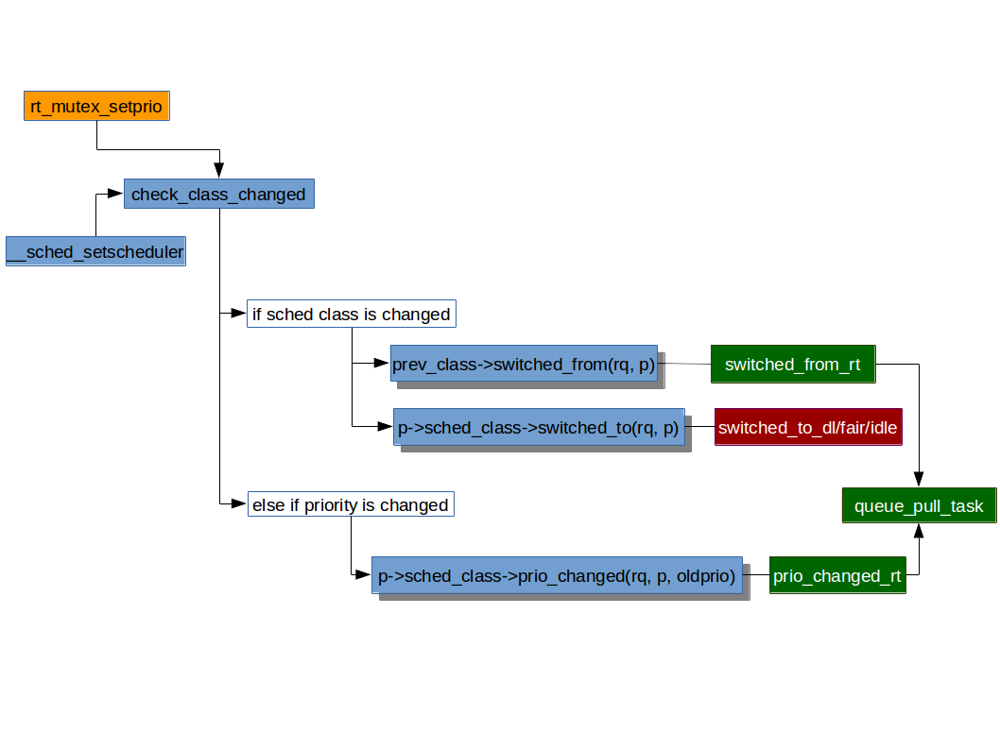

# 实时调度负载均衡
***
# 目录

- [Root Domain](#Root-Domain)
- [CPU优先级管理](#CPU优先级管理)
- [推任务迁移](#推任务迁移)
- [拉任务迁移](#拉任务迁移)
- [balance_callback()调用](#balance_callback()调用)
- [RT_PUSH_IPI](#RT_PUSH_IPI)
- [参考资料](#参考资料)

# Root Domain
* 实时调度器需要几个全局的，或者说系统范围的资源作出调度决定，以及 CPU 数量的增加而出现的可伸缩性瓶颈（由于锁保护的这些资源的竞争）。
* *Root Domain* 引入的目的就是为了减少这样的竞争以改善可伸缩性。
* cpuset 提供了一个把 CPU 分成子集被一个进程或者或一组进程使用的机制。
* 几个 cpuset 可以重叠。
* 如果没有其他的 cpuset 包含重叠的 CPU，这个 cpuset 被称为“*互斥的（exclusive）*”，。
* 每个互斥的 cpuset 定义了一个与其他 cpuset 或 CPU 分离的 **孤岛域（isolated domain，也叫作 root domain）**。
* 与每个 root domian 有关的信息存在 `struct root_domain` 结构（对象）中：
* kernel/sched/sched.h
```c
#ifdef CONFIG_SMP

/*
 * We add the notion of a root-domain which will be used to define per-domain
 * variables. Each exclusive cpuset essentially defines an island domain by
 * fully partitioning the member cpus from any other cpuset. Whenever a new
 * exclusive cpuset is created, we also create and attach a new root-domain
 * object.
 *
 */
struct root_domain {
        atomic_t refcount;
        atomic_t rto_count;  /*rto 为 Real-Time Overload 的缩写*/
        struct rcu_head rcu;
        cpumask_var_t span;
        cpumask_var_t online;

        /* Indicate more than one runnable task for any CPU */
        bool overload;

        /*
         * The bit corresponding to a CPU gets set here if such CPU has more
         * than one runnable -deadline task (as it is below for RT tasks).
         */
        cpumask_var_t dlo_mask;  /*dlo 为 Deadline Overload 的缩写*/
        atomic_t dlo_count;
        struct dl_bw dl_bw;
        struct cpudl cpudl;

        /*
         * The "RT overload" flag: it gets set if a CPU has more than
         * one runnable RT task.
         */
        cpumask_var_t rto_mask;
        struct cpupri cpupri;

        unsigned long max_cpu_capacity;
};

extern struct root_domain def_root_domain;

#endif /* CONFIG_SMP */
```
* `refcount` root domain 的引用计数，当 root domain 被运行队列引用时加一，反之减一。
* `span` *属于该 root domain 的运行队列* 的 *可用 CPU* 的范围，`cpumask_var_t`掩码。
* `overload` 表明该 root domain 有任一 CPU 有多于一个的可运行任务。
* `rto_mask` 某 CPU 有多于一个的可运行实时任务，对应的位被设置，`cpumask_var_t`掩码。
* `rto_count` 过载的（overload）的 CPU 的数目。
* `cpupri` 包含在 root domain 中的 *CPU 优先级管理* 结构成员，详见下文。
* 这些 root domain 被用于减小 per-domain 变量的全局变量的范围。
* 无论何时一个互斥 cpuset 被创建，一个新 root domain 对象也会被创建，信息来自 CPU 成员。
* 缺省情况下，一个单独的高层次的 root domain 被创建，并把所有 CPU 作为成员。
* 所有的实时调度决定只在一个 root domain 的范围内作出决定。

# CPU优先级管理
* CPU 优先级管理（CPU Priority Management）跟踪系统中每个 CPU 的优先级，为了让进程迁移的决定更有效率。
* CPU 优先级有 102 个:

cpupri | prio
---|---
CPUPRI_INVALID (-1) | -1
CPUPRI_IDLE (0) | MAX_PRIO (140)
CPUPRI_NORMAL (1) | MAX_RT_PRIO ~ MAX_PRIO-1 (100~139)
2~101 | 99~0

* `prio`转`cpupri`的函数如下：
  * kernel/sched/cpupri.c
```c
/* Convert between a 140 based task->prio, and our 102 based cpupri */
static int convert_prio(int prio)
{
        int cpupri;

        if (prio == CPUPRI_INVALID)
                cpupri = CPUPRI_INVALID;
        else if (prio == MAX_PRIO)
                cpupri = CPUPRI_IDLE;
        else if (prio >= MAX_RT_PRIO)
                cpupri = CPUPRI_NORMAL;
        else
                cpupri = MAX_RT_PRIO - prio + 1;

        return cpupri;
}
```
* `cpupri` 数值越大表示优先级越高（用的是减法）。
* 处于`CPUPRI_INVALID`状态的 CPU 没有资格参与 task routing。
* `cpupri` 属于 root domain level 的范围。每个互斥的 cpuset 由一个含有 cpupri 数据的 root momain 组成。
* 系统从两个维度的位映射来维护这些 CPU 状态：
  1. CPU 的优先级，由任务优先级映射而来
  2. 在某个优先级上的 CPU
* 通过`cpupri_find()`和`cpupri_set()`来查找和设置 CPU 优先级是实时负载均衡快速找到要迁移的任务的关键。
* kernel/sched/cpupri.h
```c
#define CPUPRI_NR_PRIORITIES    (MAX_RT_PRIO + 2)
...
struct cpupri_vec {
        atomic_t        count;
        cpumask_var_t   mask;
};

struct cpupri {
        struct cpupri_vec pri_to_cpu[CPUPRI_NR_PRIORITIES];
        int *cpu_to_pri;
};
```
#### `struct cpupri`
* `pri_to_cpu` 持有关于一个 cpuset 在 *某个特定的优先级上的* 所有 CPU 的信息。
* `cpu_to_pri` 指示一个 CPU 的优先级。注意与任务的优先级区分。

#### `struct cpupri_vec`
* `count` 在这个优先级上的 CPU 的数量。
* `mask` 在这个优先级上的 CPU 位码。

## cpupri_find()
* `cpupri_find()` 查找系统（root domain）中最佳（优先级最低）的 CPU。
* 成功找到返回 1，找不到返回 0，结果通过`lowest_mask`返回。
* kernel/sched/cpupri.c
```c
/**
 * cpupri_find - find the best (lowest-pri) CPU in the system
 * @cp: The cpupri context
 * @p: The task
 * @lowest_mask: A mask to fill in with selected CPUs (or NULL)
 *
 * Note: This function returns the recommended CPUs as calculated during the
 * current invocation.  By the time the call returns, the CPUs may have in
 * fact changed priorities any number of times.  While not ideal, it is not
 * an issue of correctness since the normal rebalancer logic will correct
 * any discrepancies created by racing against the uncertainty of the current
 * priority configuration.
 *
 * Return: (int)bool - CPUs were found
 */
int cpupri_find(struct cpupri *cp, struct task_struct *p,
                struct cpumask *lowest_mask)
{
        int idx = 0;
        int task_pri = convert_prio(p->prio); /*将任务的有效优先级转为 CPU 优先级*/
        /*给定任务的 CPU 优先级不能超过 CPU 优先级的合理范围*/
        BUG_ON(task_pri >= CPUPRI_NR_PRIORITIES);
        /*从最低优先级开始检查，因为跑着低优先级任务的 CPU 更适合被 routing。
          为什么是从 0 开始？
          还记得 idle 状态的 CPU 和运行普通任务的 CPU 优先级分别是：
          CPUPRI_IDLE (0)、CPUPRI_NORMAL (1)。
          所以这个查找涵盖了空闲的 CPU 和运行普通任务的 CPU。*/
        for (idx = 0; idx < task_pri; idx++) {
                struct cpupri_vec *vec  = &cp->pri_to_cpu[idx];
                int skip = 0;
                /*跳过在某个优先级上没有 CPU 的向量*/
                if (!atomic_read(&(vec)->count))
                        skip = 1;
                /*
                 * When looking at the vector, we need to read the counter,
                 * do a memory barrier, then read the mask.
                 *
                 * Note: This is still all racey, but we can deal with it.
                 *  Ideally, we only want to look at masks that are set.
                 *
                 *  If a mask is not set, then the only thing wrong is that we
                 *  did a little more work than necessary.
                 *
                 *  If we read a zero count but the mask is set, because of the
                 *  memory barriers, that can only happen when the highest prio
                 *  task for a run queue has left the run queue, in which case,
                 *  it will be followed by a pull. If the task we are processing
                 *  fails to find a proper place to go, that pull request will
                 *  pull this task if the run queue is running at a lower
                 *  priority.
                 */
                /*当访问向量的时候，我们需要先读计数器，做内存屏障，然后读掩码。

                  注意：这里仍然是有竞争的，但我们可以处理它。理想的情况下，我们只想看那些
                  被设置的掩码。

                  如果一个掩码没有被设置，那么唯一错误的事情是，我们多做了一些没必要的工作。

                  如果由于内存屏障的缘故，我们读到一个零计数，但掩码却被设置了，那只能发生
                  在当运行队列的最高优先级的任务离开运行队列的时候，在这种情况下，它会紧跟
                  着一个拉操作。如果我们正在处理的任务没能找到一个合适的去处，且运行队列正
                  运行在一个更低的优先级，那么拉请求将会把这个任务拉过来。*/
                smp_rmb();

                /* Need to do the rmb for every iteration */
                if (skip)
                        continue;
                /*任务亲和的 CPU 掩码与向量的掩码 “与” 运算，看有没有合适的 CPU。
                  如果没有 CPU 被设置，cpumask_any_and()结果 >= nr_cpu_ids*/
                if (cpumask_any_and(tsk_cpus_allowed(p), vec->mask) >= nr_cpu_ids)
                        continue;

                if (lowest_mask) {
                        /*任务亲和的 CPU 掩码与向量的掩码 “与” 运算赋给 lowest_mask*/
                        cpumask_and(lowest_mask, tsk_cpus_allowed(p), vec->mask);

                        /*
                         * We have to ensure that we have at least one bit
                         * still set in the array, since the map could have
                         * been concurrently emptied between the first and
                         * second reads of vec->mask.  If we hit this
                         * condition, simply act as though we never hit this
                         * priority level and continue on.
                         */
                        /*我们不得不确保在数组中我们至少有一个位仍然被设置，因为映射有可能
                          在第一次和第二次读取 vec->mask 之间被并发地清空。 如果我们命中
                          该条件，简单地穿过，就好像我们没有命中该级别的优先级并继续往前走。
                          这里并没有打算彻底解决竞态，而是通过两次检查减小错误的概率，目
                          的还是为了减小锁争用。
                          再次确保 lowest_mask 非空，
                          1) 如果 lowest_mask 为空，cpumask_any()返回结果 >= nr_cpu_ids，
                              表示该轮查找不成功，进行下一次循环；
                          2) 如果 lowest_mask 不为空，表示有合适的 cpu，则通过下面的
                              return 跳出循环并使函数返回。*/
                        if (cpumask_any(lowest_mask) >= nr_cpu_ids)
                                continue;
                }

                return 1;
        }

        return 0;
}
```

## cpupri_set()
* 设置 CPU 的优先级
* kernel/sched/cpupri.c
```c
/**
 * cpupri_set - update the cpu priority setting
 * @cp: The cpupri context
 * @cpu: The target cpu
 * @newpri: The priority (INVALID-RT99) to assign to this CPU
 *
 * Note: Assumes cpu_rq(cpu)->lock is locked
 *
 * Returns: (void)
 */
void cpupri_set(struct cpupri *cp, int cpu, int newpri)
{
	int *currpri = &cp->cpu_to_pri[cpu]; /*根据 CPU 找到 CPU 的优先级*/
	int oldpri = *currpri;
	int do_mb = 0;

	newpri = convert_prio(newpri); /*进程优先级转为 CPU 优先级*/
	/*超出范围的 CPU 优先级是bug*/
	BUG_ON(newpri >= CPUPRI_NR_PRIORITIES);
	/*CPU 优先级未改变，直接返回*/
	if (newpri == oldpri)
		return;

	/*
	 * If the cpu was currently mapped to a different value, we
	 * need to map it to the new value then remove the old value.
	 * Note, we must add the new value first, otherwise we risk the
	 * cpu being missed by the priority loop in cpupri_find.
	 */
	/*如果 cpu 当前被映射到一个不同的值，我们需要把它映射到 pri_to_cpu 优先级向量里的掩码
	  对应的位，然后把旧向量里的掩码位清除。注意，我们必须先添加新的值，否则我们会有在
		cpupri_find 循环优先级时错过该 cpu 的风险*/
	if (likely(newpri != CPUPRI_INVALID)) { /*新优先级的值是有效值*/
		struct cpupri_vec *vec = &cp->pri_to_cpu[newpri]; /*取将要设置的优先级向量*/

		cpumask_set_cpu(cpu, vec->mask); /*设置向量的 cpu 位掩码*/
		/*
		 * When adding a new vector, we update the mask first,
		 * do a write memory barrier, and then update the count, to
		 * make sure the vector is visible when count is set.
		 */
		/*当新增加一个向量的时候，我们先更新掩码，做一个写屏障，然后再更新计数，这样确保当计数被
		  设置的时候该向量是可见的*/
		smp_mb__before_atomic();
		atomic_inc(&(vec)->count); /*该向量的计数加 1*/
		do_mb = 1;
	}
	if (likely(oldpri != CPUPRI_INVALID)) { /*旧优先级的值是有效值*/
		struct cpupri_vec *vec  = &cp->pri_to_cpu[oldpri]; /*取将要移除的优先级向量*/

		/*
		 * Because the order of modification of the vec->count
		 * is important, we must make sure that the update
		 * of the new prio is seen before we decrement the
		 * old prio. This makes sure that the loop sees
		 * one or the other when we raise the priority of
		 * the run queue. We don't care about when we lower the
		 * priority, as that will trigger an rt pull anyway.
		 *
		 * We only need to do a memory barrier if we updated
		 * the new priority vec.
		 */
		/*因为修改 vec->count 的顺序是重要的，我们必须确保新优先级的更新在我们减小旧优先级前被
		  看到。这确保当我们提高运行队列的优先级的时候，循环能看到一个或其他的优先级。当我们降低
		  优先级的时候我们并不关心，因为那总会触发一次实时拉操作。

		  如果我们更新新的优先级向量，我们只需要做一个内存屏障*/
		if (do_mb)
			smp_mb__after_atomic();

		/*
		 * When removing from the vector, we decrement the counter first
		 * do a memory barrier and then clear the mask.
		 */
		/*当从向量移除的时候，我们先减小计数器，再做一个内存屏障，然后才清除位掩码*/
		atomic_dec(&(vec)->count); /*该向量的计数减 1*/
		smp_mb__after_atomic();
		cpumask_clear_cpu(cpu, vec->mask); /*清除向量的 cpu 位掩码*/
	}

	*currpri = newpri; /*最后才是 cpu 优先级的值的更新*/
}
```

# 推任务迁移

## 推任务基本思想
* **推任务** 搜索一个运行队列，转移它的一个任务到另一个运行队列的操作。
* `push_rt_task()` 算法着眼于运行队列上优先级最高的不在运行的可运行实时任务，考虑所有运行队列，找到一个它能运行的 CPU。
* 它搜索一个优先级更低的队列，就是当前正在运行的任务可以被 *正被推送的任务* 抢占的队列。
* 如前所述，CPU 优先级管理基础结构就是被用于找到一个有最低优先级运行队列的 CPU 掩码。从所有的候选者中选择唯一的最佳 CPU 很重要。
  * 该算法最先考虑的是把任务给最后在上面执行的 CPU，由于它的 cache 很可能还是热的。
  * 如果不行，当前执行推任务的 CPU 如果在找到的最低优先级 CPU 掩码里，且在同一调度域的分支上，则被选中。
  * 否则，这说明当前执行推任务的 CPU 不在同一调度域的分支上，那么在 "最低优先级CPU掩码" 与 "调度域的 CPU span" 的交集中选第一个 CPU 作为最佳 CPU。
  * 如果在调度域里没有匹配 *最低优先级 CPU 掩码* 的 CPU，那么就把这个在 *最低优先级 CPU 掩码* 里，但不在同一调度域分支上的执行推任务的当前 CPU 返回，这意味此时当前 CPU （就调度域划分而言）是远程的。
  * 如果也失败了，从掩码中随机选择一个 CPU。
* 推操作被执行直至：
  * 一个实时任务迁移失败
  * 或者没有任务可以被推送
* 因为算法总是选择优先级最高的非运行任务来推送，那这个假设就是，如果它不能迁移，那么最有可能的低一点的实时任务也不能被迁移，于是搜索被中断。
* 当扫描最低优先级运行队列的时候是不加锁的。
  * 当目标运行队列被找到时，只锁定那个队列，之后做一个检查来验证它是否仍旧是一个推任务的候选（由于目标队列可能被一个在其他 CPU 上并行的调度操作修改）。
  * 如果不再合适被推送，重复搜索最多三次，之后搜索被中断。

## 推任务的时机
* `push_rt_task()`函数会在以下时间点被调用：
  1. 非正在运行的普通进程变成实时进程时（比如通过`sched_setscheduler`系统调用）；
  2. 发生调度之后（这时候可能有一个实时进程被更高优先级的实时进程抢占了）；
  3. 实时进程被唤醒之后，如果不能马上在当前 CPU 上运行（它不是当前 CPU 上优先级最高的进程）；

## 推任务的实现
* 先从`push_rt_tasks()`的实现看起。
* kernel/sched/rt.c
```c
/* Only try algorithms three times */
#define RT_MAX_TRIES 3
...
static DEFINE_PER_CPU(cpumask_var_t, local_cpu_mask);
/*返回值为 CPU id，出错时返回 -1*/
static int find_lowest_rq(struct task_struct *task)
{
        struct sched_domain *sd;
        struct cpumask *lowest_mask = this_cpu_cpumask_var_ptr(local_cpu_mask);
        int this_cpu = smp_processor_id(); /*当前 CPU*/
        int cpu      = task_cpu(task);     /*task 所在 CPU*/

        /* Make sure the mask is initialized first */
        if (unlikely(!lowest_mask))
                return -1;
        /*task 设置为只允许在一个 CPU 上运行，对于其他目标队列来说是不能迁移的，返回 -1。*/
        if (tsk_nr_cpus_allowed(task) == 1)
                return -1; /* No other targets possible */
        /*用之前提到的 cpupri_find() 在 task 所属的 root domain 中找优先级最低的 CPU*/
        if (!cpupri_find(&task_rq(task)->rd->cpupri, task, lowest_mask))
                return -1; /* No targets found */

        /*
         * At this point we have built a mask of cpus representing the
         * lowest priority tasks in the system.  Now we want to elect
         * the best one based on our affinity and topology.
         *
         * We prioritize the last cpu that the task executed on since
         * it is most likely cache-hot in that location.
         */
        /*此时，我们建立了一个系统中运行最低优先级任务的 CPU 的掩码。现在我们想根据我们的
          亲和性和拓扑结构选出最佳的那个。
          我们优先选择上一次执行任务的 CPU，因为它的 cache 很可能还是热的。*/
        if (cpumask_test_cpu(cpu, lowest_mask)) /*测试 task 的 CPU 是否在掩码中*/
                return cpu; /*如果在掩码中，优先选择该 CPU*/

        /*
         * Otherwise, we consult the sched_domains span maps to figure
         * out which cpu is logically closest to our hot cache data.
         */
        /*否则，我们根据调度域的范围映射来找出那个 CPU 在逻辑上最接近我们的热缓存数据。*/
        if (!cpumask_test_cpu(this_cpu, lowest_mask))
                this_cpu = -1; /* Skip this_cpu opt if not among lowest */
        /*如果当前 CPU 不在掩码给出的 CPU 里，标记成 -1 跳过它。*/
        rcu_read_lock(); /*domain tree 有 RCU quiescent state transition 的保护*/
        for_each_domain(cpu, sd) { /*由下至上遍历调度域，优先选择邻近的*/
                if (sd->flags & SD_WAKE_AFFINE) {
                        int best_cpu;

                        /*
                         * "this_cpu" is cheaper to preempt than a
                         * remote processor.
                         */
                        /*抢占 "this_cpu" 比抢占一个远程的处理器开销更低。
                          当前 CPU 如果在之前的最低优先级掩码里，且在同一调度域的分支上，
                          则有可能被选中，原因如上所述*/
                        if (this_cpu != -1 &&
                            cpumask_test_cpu(this_cpu, sched_domain_span(sd))) {
                                rcu_read_unlock();
                                return this_cpu;
                        }
                        /*如果当前 CPU 不在同一调度域的分支上，在 "最低优先级掩码" 与
                          "调度域的 CPU span" 的交集中选第一个 CPU 作为最佳 CPU*/
                        best_cpu = cpumask_first_and(lowest_mask,
                                                     sched_domain_span(sd));
                        if (best_cpu < nr_cpu_ids) {
                                rcu_read_unlock();
                                return best_cpu;
                        }
                }
        }
        rcu_read_unlock();

        /*
         * And finally, if there were no matches within the domains
         * just give the caller *something* to work with from the compatible
         * locations.
         */
        /*最后，如果在调度域里没有匹配 lowest_mask 的 CPU，那么就把这个在 lowest_mask
          掩码里，但不在同一调度域分支上的当前 CPU 返回。
          这意味此时当前 CPU （就调度域划分而言）是远程的。*/
        if (this_cpu != -1)
                return this_cpu;
        /*如果当前 CPU 既不在 lowest_mask 掩码里，也不在同一调度域分支上。
          从最低优先级掩码给定的 CPU 中随机选择一个 CPU 返回。*/
        cpu = cpumask_any(lowest_mask);
        if (cpu < nr_cpu_ids)
                return cpu;
        return -1; /*这样的 CPU 如果是非法值，那只能说找不到了。*/
}

/* Will lock the rq it finds */
/*返回值为指向运行队列的指针 - *rq，找不到时返回 NULL
  该函数的主要工作：
    1. 调用 find_lowest_rq() 去查找
    2. 解决好锁的问题
    3. 尝试 3 次
  */
static struct rq *find_lock_lowest_rq(struct task_struct *task, struct rq *rq)
{
        struct rq *lowest_rq = NULL; /*指向要返回的优先级最低队列*/
        int tries;
        int cpu;
        /*目前只尝试三次*/
        for (tries = 0; tries < RT_MAX_TRIES; tries++) {
                cpu = find_lowest_rq(task);
                /*如果找不到一个合适的队列，或者找到的队列就是当前队列，则跳出循环，用已有的
                  lowest_rq 的值。*/
                if ((cpu == -1) || (cpu == rq->cpu))
                        break;
                /*否则认为找到了优先级最低队列，更新 lowest_rq 的值为该 CPU 所属 rq*/
                lowest_rq = cpu_rq(cpu);
                if (lowest_rq->rt.highest_prio.curr <= task->prio) {
                        /*
                         * Target rq has tasks of equal or higher priority,
                         * retrying does not release any lock and is unlikely
                         * to yield a different result.
                         */
                        /*如果目标运行队列所记录的最高优先级高于或等于要推走的任务，重试不
                          释放任何锁，因此不可能导致不同的结果。
                          所以这里设置为无法找到队列就跳出循环了。
                          记住，highest_prio记录的是该队列上的最高优先级，但不一定是该
                          队列上正在运行的任务，有可能是该加入队列的还未被调度的高优先级
                          任务，因此是有可能与 CPU 优先级的记录不一致的。*/
                        lowest_rq = NULL;
                        break;
                }

                /* if the prio of this runqueue changed, try again */
                /*因为要在当前队列和目标队列之间迁移，因此需要同时锁定这两个队列*/
                if (double_lock_balance(rq, lowest_rq)) {
                        /*   
                         * We had to unlock the run queue. In
                         * the mean time, task could have
                         * migrated already or had its affinity changed.
                         * Also make sure that it wasn't scheduled on its rq.
                         */
                        /*double_lock_balance()会有个先解锁再加锁的过程，这个间隙有可
                          能会发生一些改变，因此需要重新做以下检查：
                          - 之前从 rq 里选出来的 task 现在其 rq 域不再指向 rq 了
                          - 进程的亲和性被修改导致不再在最低优先级队列的 CPU 里了
                          - 当前队列正在运行的任务就是该task
                          - 任务的调度器不再是实时调度器
                          - 任务不在运行队列上了
                          以上任何一种情况出现都被认为查找失败。*/
                        if (unlikely(task_rq(task) != rq ||
                                     !cpumask_test_cpu(lowest_rq->cpu,
                                                       tsk_cpus_allowed(task)) ||
                                     task_running(rq, task) ||
                                     !rt_task(task) ||
                                     !task_on_rq_queued(task))) {

                                double_unlock_balance(rq, lowest_rq);
                                lowest_rq = NULL;
                                break;
                        }    
                }    
                /* If this rq is still suitable use it. */
                /*如果能锁定成功且能通过以上一系列检查，这时才认为该运行队列是合适被推给任务
                  的，可以跳出循环了，此时返回值 lowest_rq 具备有效值。
                  解除 double_unlock_balance(rq, lowest_rq) 的地方在 push_rt_task()，
                  因为在这期间要一直锁定着两个队列。*/
                if (lowest_rq->rt.highest_prio.curr > task->prio)
                        break;

                /* try again */
                /*否则进行重试*/
                double_unlock_balance(rq, lowest_rq);
                lowest_rq = NULL;
        }

        return lowest_rq;
}

static struct task_struct *pick_next_pushable_task(struct rq *rq)
{
        struct task_struct *p;

        if (!has_pushable_tasks(rq))
                return NULL;
        /*plist是按照优先级由高到底进行排序的，所以 first entry 是链表里优先级最高的*/
        p = plist_first_entry(&rq->rt.pushable_tasks,
                              struct task_struct, pushable_tasks);
        /*返回前检查一些不该存在的错误*/
        BUG_ON(rq->cpu != task_cpu(p)); /*任务 CPU 与 队列 CPU 不是同一个*/
        BUG_ON(task_current(rq, p)); /*选出的任务竟然是当前任务*/
        BUG_ON(tsk_nr_cpus_allowed(p) <= 1); /*选出的任务仅允许在一个CPU上运行*/

        BUG_ON(!task_on_rq_queued(p)); /*选出的任务不在可运行队列上*/
        BUG_ON(!rt_task(p)); /*选出的任务不是实时任务*/

        return p;
}

/*
 * If the current CPU has more than one RT task, see if the non
 * running task can migrate over to a CPU that is running a task
 * of lesser priority.
 */
/*如果当前 CPU 有超过一个实时任务，看有没有非运行态任务可以被迁移到另一个运行着优先级低一些的
  任务的 CPU*/
static int push_rt_task(struct rq *rq)
{
        struct task_struct *next_task;
        struct rq *lowest_rq;
        int ret = 0;
        /*如果该队列没有过载，即没有一个可以被迁移的实时任务，则没有实时任务可以被推走*/
        if (!rq->rt.overloaded)
                return 0;
        /*首先在该队列的可推链表里找有没有合适的任务，如果没有则返回。
          之前任务入列的时候会通过 enqueue_pushable_task() 把可能的任务加进可推队列。*/
        next_task = pick_next_pushable_task(rq);
        if (!next_task)
                return 0;

retry:
        if (unlikely(next_task == rq->curr)) { /*选出的任务竟然是 rq 的当前任务*/
                WARN_ON(1);
                return 0; /*这种情况不是期望的行为，但也没可以推走的任务*/
        }

        /*
         * It's possible that the next_task slipped in of
         * higher priority than current. If that's the case
         * just reschedule current.
         */
        /*从可推队列里选出的任务可能是一个刚溜进的来的高优先级任务，如果是这种情况，重新调度
          当前任务即可，也不需要推给别人了。*/
        if (unlikely(next_task->prio < rq->curr->prio)) {
                resched_curr(rq);
                return 0;
        }

        /* We might release rq lock */
        get_task_struct(next_task);

        /* find_lock_lowest_rq locks the rq if found */
        /*在比选出来的任务优先级低的队列中，找到优先级最低的队列。
          如果找到的话，当前队列 rq 和最低优先级队列 lowest_rq 都会处于锁定状态*/
        lowest_rq = find_lock_lowest_rq(next_task, rq);
        if (!lowest_rq) { /*如果没找到优先级最低的队列*/
                struct task_struct *task;
                /*
                 * find_lock_lowest_rq releases rq->lock
                 * so it is possible that next_task has migrated.
                 *
                 * We need to make sure that the task is still on the same
                 * run-queue and is also still the next task eligible for
                 * pushing.
                 */
                /*因为 find_lock_lowest_rq() 会释放 rq->lock 锁，所以之前选中的
                  next_task 有已经被迁移的可能。*/
                task = pick_next_pushable_task(rq);
                if (task_cpu(next_task) == rq->cpu && task == next_task) {
                        /*
                         * The task hasn't migrated, and is still the next
                         * eligible task, but we failed to find a run-queue
                         * to push it to.  Do not retry in this case, since
                         * other cpus will pull from us when ready.
                         */
                        /*next_task 的 CPU 仍然是当前队列的 CPU，还没有被迁移，且仍然是
                         下一个具备被迁移资格的任务，但我们找不到一个合适的运行队列来接纳它。
                         这种情况不需要重试，直到其他 CPU 在合适的时候拉走它。*/
                        goto out;
                }

                if (!task)
                        /* No more tasks, just exit */
                        /*找不到优先级最低的队列，也没有其他任务可以推，直接退出*/
                        goto out;

                /*
                 * Something has shifted, try again.
                 */
                /*找不到优先级最低的队列，且之前选中的 next_task 已经被迁移走了，那么把刚
                  选出的 task 作为新的 next_task 进行下一次重试*/
                put_task_struct(next_task); /*对应到之前的 get_task_struct()*/
                next_task = task;
                goto retry;
        }
        /*如果找到优先级最低的队列，开始迁移 next_task*/
        /*选中的任务从当前队列 rq 中出列*/
        deactivate_task(rq, next_task, 0);
        /*选中的任务 cpu 设置为将要迁移至的最低优先级队列的 cpu*/
        set_task_cpu(next_task, lowest_rq->cpu);
        /*选中的任务进入最低优先级队列*/
        activate_task(lowest_rq, next_task, 0);
        ret = 1; /*返回值设置为 1 表示成功*/
        /*把最低优先级队列的当前任务设置为“需要被立即重新调度”*/
        resched_curr(lowest_rq);
        /*同时解锁当前队列 rq 和最低优先级队列 lowest_rq*/
        double_unlock_balance(rq, lowest_rq);

out:
        put_task_struct(next_task); /*对应到之前的 get_task_struct()*/

        return ret;
}

static void push_rt_tasks(struct rq *rq)
{
        /* push_rt_task will return true if it moved an RT */
        /*push_rt_task()如果移动了一个实时任务将会返回 1。
          这个循环会一直执行到给定队列没有任务可以推走*/
        while (push_rt_task(rq))
                ;
}
...`_
```

# 拉任务迁移

## 拉任务基本思想
* `pull_rt_task()`算法着眼于一个 root domain 中所有过载的运行队列，检查它们是否有一个实时任务能运行在目标运行队列（就是说，目标 CPU 在 `task->cpus_allowed_mask` 中）且其优先级高于将要被调度的运行队列的任务。
* 除非该实时任务刚被唤醒且优先级比它所在的队列正在运行的任务优先级高，但还未来得及被调度。
* 如果符合条件，将任务拉到目标运行队列。
* 该搜索会在扫描 root domain 中所有过载的运行队列之后终结。因此，拉操作可能拉多于一个任务到目标运行队列。
* 如果算法在第一遍的时候只选择一个要被拉的候选任务，但还要进行两次比较才决定是不是真的要拉过来，有一种可能是，被选择的最高优先级任务不再是候选（由于在其他 CPU 上的并行调度操作）。
* 为了避免这种在 *查找最高优先级队列* 和 *当实际去执行拉操作时最高优先级任务仍然在运行队列上* 的竞争，拉操作会继续去拉任务。
* 最坏的情况是，这可能导致许多被拉到目标运行队列的任务之后有可能被推到其他 CPU，导致任务弹跳。任务弹跳被任务是一种稀有事件。

## 实时运行队列进程迁移相关的成员
* 是时候观察进程进入或移出实时运行队列时，对`rt_rq`相关成员的处理了
* 在进程进入`rt_rq`时会调用`inc_rt_migration()`
```
__enqueue_rt_entity()
	-> inc_rt_tasks()
		-> inc_rt_prio()
		-> inc_rt_migration()
			-> update_rt_migration()
		-> inc_rt_group()
```
* 在进程移出`rt_rq`时会调用`dec_rt_migration()`
* kernel/sched/rt.c
```
__dequeue_rt_entity()
	-> dec_rt_tasks()
		-> dec_rt_prio()
		-> dec_rt_migration()
			-> update_rt_migration()
		-> dec_rt_group()
```
* `inc_rt_migration()`和`dec_rt_migration()`会更新实时运行队列`rt_rq`的下面几个域
	* `rt_nr_total`：增加或减小该实时运行队列`rt_rq`的 **实时任务数**
	* `rt_nr_migratory`：如果该任务允许在多于一个 CPU 上运行，增加或减小该实时运行队列`rt_rq`的 **可迁移的实时任务数**
	* `overloaded`：调用共用函数`update_rt_migration()`更新 **队列过载标志**
	* `rt_nr_running`在`inc_rt_tasks()`或`dec_rt_tasks()`时已经更新过了
* kernel/sched/rt.c
```c
static inline void rt_set_overload(struct rq *rq)
{
  if (!rq->online)
    return;
  /*把运行队列所在 CPU 加入到运行队列所在 root_domain 上过载的 CPU 掩码*/
  cpumask_set_cpu(rq->cpu, rq->rd->rto_mask);
  /*   
   * Make sure the mask is visible before we set
   * the overload count. That is checked to determine
   * if we should look at the mask. It would be a shame
   * if we looked at the mask, but the mask was not
   * updated yet.
   *
   * Matched by the barrier in pull_rt_task().
   */
  smp_wmb();
  atomic_inc(&rq->rd->rto_count); /*增加运行队列所在 root_domain 上过载 CPU 的计数*/
}

static inline void rt_clear_overload(struct rq *rq)
{
  if (!rq->online)
    return;

  /* the order here really doesn't matter */
  atomic_dec(&rq->rd->rto_count); /*减小运行队列所在 root_domain 上过载 CPU 的计数*/
  cpumask_clear_cpu(rq->cpu, rq->rd->rto_mask); /*清除对应的过载的 CPU 的掩码*/
}

static void update_rt_migration(struct rt_rq *rt_rq)
{ /*如果有可迁移实时进程，且实时进程数量多于一个*/
  if (rt_rq->rt_nr_migratory && rt_rq->rt_nr_total > 1) {
    if (!rt_rq->overloaded) { /*如果过载标志还没设置，需要做相应的设置*/
      rt_set_overload(rq_of_rt_rq(rt_rq));
      rt_rq->overloaded = 1;
    }    
  } else if (rt_rq->overloaded) { /*如果上一个条件未满足，且过载标志设成已过载，需要清理*/
    rt_clear_overload(rq_of_rt_rq(rt_rq));
    rt_rq->overloaded = 0;
  }    
}
```

## 拉任务的实现
* 先从`pull_rt_task()`的实现看起。
* kernel/sched/rt.c
```c
static inline int rt_overloaded(struct rq *rq)
{ /*返回运行队列所在 root_domain 上过载的 CPU 数*/
  return atomic_read(&rq->rd->rto_count);
}

static int pick_rt_task(struct rq *rq, struct task_struct *p, int cpu)
{ /*选中的任务不能是正在运行的任务，而且还允许在目标 CPU 上运行*/
  if (!task_running(rq, p) &&
    cpumask_test_cpu(cpu, tsk_cpus_allowed(p)))
      return 1;
  return 0;
}

/*
 * Return the highest pushable rq's task, which is suitable to be executed
 * on the cpu, NULL otherwise
 */
static struct task_struct *pick_highest_pushable_task(struct rq *rq, int cpu)
{
  struct plist_head *head = &rq->rt.pushable_tasks;
  struct task_struct *p;
  /*如果运行队列的实时运行队列的可推任务链表为空，返回 NULL*/
  if (!has_pushable_tasks(rq))
    return NULL;
  /*遍历可推任务链表上的任务，选出优先级最高的任务返回。因为可推任务链表是按优先级顺序排序的，
    因此排在前面的任务优先级更高*/
  plist_for_each_entry(p, head, pushable_tasks) {
    if (pick_rt_task(rq, p, cpu))
      return p;
  }

  return NULL;
}

static void pull_rt_task(struct rq *this_rq)
{
	int this_cpu = this_rq->cpu, cpu;
	bool resched = false;
	struct task_struct *p;
	struct rq *src_rq;
	/*如果当前队列的 root_domain 的 rto_count 不为 0，说明已经过载了，无需拉任务进来*/
	if (likely(!rt_overloaded(this_rq)))
		return;

	/*
	 * Match the barrier from rt_set_overloaded; this guarantees that if we
	 * see overloaded we must also see the rto_mask bit.
	 */
	smp_rmb();
	/*这个 feature 容我们稍后阐述，很多情况下不会开启这个 feature*/
#ifdef HAVE_RT_PUSH_IPI
	if (sched_feat(RT_PUSH_IPI)) {
		tell_cpu_to_push(this_rq); /*告诉过载的 CPU 将任务推给我们（this_rq）*/
		return;
	}
#endif
	/*逐个遍历当前队列所属 root_domain 的实时过载 CPU 掩码上的 CPU*/
	for_each_cpu(cpu, this_rq->rd->rto_mask) {
		if (this_cpu == cpu) /*如果是当前 CPU，则跳过，因为不用把自己队列上的任务拉给自己*/
			continue;
		/*记录这次迭代拉任务的源运行队列*/
		src_rq = cpu_rq(cpu);

		/*
		 * Don't bother taking the src_rq->lock if the next highest
		 * task is known to be lower-priority than our current task.
		 * This may look racy, but if this value is about to go
		 * logically higher, the src_rq will push this task away.
		 * And if its going logically lower, we do not care
		 */
		/*如果源运行队列的可推送任务链表上的最高优先级任务优先级低于或等于当前队列的最高优先级任务
		  优先级，跳过该源队列。源运行队列的已排队最高优先级任务马上有机会被调度，不需要拉过来。
			因为它比当前队列排第一的任务优先级还低，拉过来也是要等。
			注意这里取源运行队列数据的时候没有占用 src_rq->lock 的锁，原因见上面注释。主要的意思是，
			即便是在临界区时优先级变高了，源队列会推过来，而不是拉。如果变低了，那也不用拉。*/
		if (src_rq->rt.highest_prio.next >=
		    this_rq->rt.highest_prio.curr)
			continue;

		/*
		 * We can potentially drop this_rq's lock in
		 * double_lock_balance, and another CPU could
		 * alter this_rq
		 */
		/*double_lock_balance()潜在地会丢失 this_rq 的锁，其他 CPU 有可能趁此修改了 this_rq*/
		double_lock_balance(this_rq, src_rq);

		/*
		 * We can pull only a task, which is pushable
		 * on its rq, and no others.
		 */
		/*我们一次只拉一个任务，该任务在它的运行队列（源队列）上是可推的，没有其他的了。
		  注意，第二个参数是 this_cpu*/
		p = pick_highest_pushable_task(src_rq, this_cpu);

		/*
		 * Do we have an RT task that preempts
		 * the to-be-scheduled task?
		 */
		/*如果将要拉过来的任务优先级比当前队列的最高优先级高。这里需要再次比较是因为
		  double_lock_balance()会先释放 this_rq 的锁再加锁，因此有变化的可能*/
		if (p && (p->prio < this_rq->rt.highest_prio.curr)) {
			WARN_ON(p == src_rq->curr); /*将要拉的任务是源队列上当前运行的任务，警告*/
			WARN_ON(!task_on_rq_queued(p)); /*任务的状态不是“已排队”，警告*/

			/*
			 * There's a chance that p is higher in priority
			 * than what's currently running on its cpu.
			 * This is just that p is wakeing up and hasn't
			 * had a chance to schedule. We only pull
			 * p if it is lower in priority than the
			 * current task on the run queue
			 */
			/*有一个 p 的优先级比它在的 CPU 上正在运行的任务的优先级高的机会。这就是 p 正好被唤醒
			  但还没有来得及被调度到。我们只在 p 的优先级比它当前运行队列上正在运行的任务优先级低的
				时候去拉。
				因为马上有机会被调度的进程没必要拉，所以这里 skip 该进程*/
			if (p->prio < src_rq->curr->prio)
				goto skip;
			/*否则，开始下面的迁移操作*/
			resched = true; /*设置函数本地的重调度标志*/

			deactivate_task(src_rq, p, 0); /*从源队列摘下任务*/
			set_task_cpu(p, this_cpu);     /*设置任务 CPU 为本 CPU*/
			activate_task(this_rq, p, 0);  /*任务放到本队列*/
			/*
			 * We continue with the search, just in
			 * case there's an even higher prio task
			 * in another runqueue. (low likelihood
			 * but possible)
			 */
			/*注意，这里没有 break 而是继续遍历当前 root_domain 的实时过载 CPU 掩码上的 CPU*/
			/*我们继续搜索，以防万一在其他的运行队列上有更高优先级的任务。（可能性低，但是是可能的）*/
		}
skip:
		double_unlock_balance(this_rq, src_rq); /*在此次迭代的最后解锁*/
	}
	/*如果迭代过程中拉到了任务，毫无疑问要重新调度*/
	if (resched)
		resched_curr(this_rq);
}
```

## 拉任务的时机
### 直接调用
* `pull_rt_task()`仅会在以下时机被直接调用：
	* `pick_next_task_rt()` —— 选择下一个要调度的实时进程的时候，这个时候拉一把，是比较合适的。
### 回调调用
* `pull_rt_task()`还会被`queue_pull_task()`放入`balance_callback()`的链表，以间接的方式触发
* 采用间接方式调用总要等到调用`balance_callback()`的时候才会进行拉负载均衡
1. 当通过系统调用`sched_setscheduler`，`sched_setparam`或`sched_setattr`引起任务调度器参数变化的时候，例如
	```
	SYSCALL_DEFINE3(sched_setscheduler, ...)
		-> do_sched_setscheduler()
			-> sched_setscheduler()
				-> _sched_setscheduler()
					+->__sched_setscheduler()
					|		-> check_class_changed()
					|				-> p->sched_class->prio_changed()
					|				= prio_changed_rt()
					|					-> queue_pull_task()
					|						-> queue_balance_callback(..., pull_rt_task)
					+-> balance_callback
	```
2. `normalize_rt_tasks()` —— 通过 sysrq 将实时进程变为普通进程的时候。
	* `SysRq`+`Alt`+ `n` —— `nice-all-RT-tasks(n)`
	* drivers/tty/sysrq.c
	```c
	static void sysrq_handle_unrt(int key)
	{
	    normalize_rt_tasks();
	}
	static struct sysrq_key_op sysrq_unrt_op = {
	    .handler        = sysrq_handle_unrt,
	    .help_msg       = "nice-all-RT-tasks(n)",
	    .action_msg     = "Nice All RT Tasks",
	    .enable_mask    = SYSRQ_ENABLE_RTNICE,
	};
	```
	* `normalize_rt_tasks()` -> `__sched_setscheduler()` -> `check_class_changed()`
3. 通过实时互斥量 RT Mutex 设置优先级的时候。
	```
	rt_mutex_setprio()
		-> check_class_changed()
		-> balance_callback()
	```
### 几个关键函数



#### check_class_changed()
* `switched_from`，`switched_from`和`prio_changed`绝不能丢掉`rq->lock`，如果想进行负载均衡，用`balance_callback()`链表的方式
* 这就意味着任何调用`check_class_changed()`的地方都必须紧接着调用`balance_callback()`
* 回忆`pull_rt_task()`或`push_rt_tasks()`期间，调用`double_lock_balance()`函数的时候有可能会丢掉`rq->lock`锁
* 如果进程调度器类和优先级同时改变，也只会调用一次`queue_pull_task()`，注意，用的是`if ... else if ...`
* kernel/sched/core.c
```c
/*
 * switched_from, switched_to and prio_changed must _NOT_ drop rq->lock,
 * use the balance_callback list if you want balancing.
 *
 * this means any call to check_class_changed() must be followed by a call to
 * balance_callback().
 */
static inline void check_class_changed(struct rq *rq, struct task_struct *p,
                                       const struct sched_class *prev_class,
                                       int oldprio)
{       /*如果进程的调度器类发生了改变，需要
          1. 先调用进程原调度器类的 switched_from 指向的函数；
          2. 再调用进程新调度器类的 switched_to 指向的函数*/
        if (prev_class != p->sched_class) {
                if (prev_class->switched_from)
                        prev_class->switched_from(rq, p);
                /*如果这里 switched_to 不会指向 switched_to_rt()*/
                p->sched_class->switched_to(rq, p);
        } else if (oldprio != p->prio || dl_task(p)) /*如果是进程优先级发生了改变*/
                p->sched_class->prio_changed(rq, p, oldprio);
}
```

#### switched_from_rt()
* 当进程从实时队列切换出去的时候，可以 *有条件地* 考虑从其他运行队列拉一些实时进程过来
* kernel/sched/rt.c
```c
/*
 * When switch from the rt queue, we bring ourselves to a position
 * that we might want to pull RT tasks from other runqueues.
 */
static void switched_from_rt(struct rq *rq, struct task_struct *p)
{
        /*
         * If there are other RT tasks then we will reschedule
         * and the scheduling of the other RT tasks will handle
         * the balancing. But if we are the last RT task
         * we may need to handle the pulling of RT tasks
         * now.
         */
        /*如果任务 p 不在排队，调度器类发生改变，可以忽略；
          或者该实时运行队列上还有其他实时任务，不需要迁移*/
        if (!task_on_rq_queued(p) || rq->rt.rt_nr_running)
                return;
        /*如果实时运行队列上没有其他任务了，可以安排一次间接的拉负载均衡*/
        queue_pull_task(rq);
}
```
#### switched_to_rt()
* 通常是从别的调度器类换成实时调度器类才会调用这个函数，可能会造成该运行队列的过载
* 如果发生这种情况，我们尽可能把过载的进程推到其他运行队列去
* 可见，提升进程的调度策略有可能造成进程被迁移到其他 CPU 上运行
* kernel/sched/rt.c
```c
/*
 * When switching a task to RT, we may overload the runqueue
 * with RT tasks. In this case we try to push them off to
 * other runqueues.
 */
static void switched_to_rt(struct rq *rq, struct task_struct *p)
{
        /*
         * If we are already running, then there's nothing
         * that needs to be done. But if we are not running
         * we may need to preempt the current running task.
         * If that current running task is also an RT task
         * then see if we can move to another run queue.
         */
        /*如果我们已经在运行了，那么什么也不用做。
          但如果我们还未运行，我们可能需要抢占当前正在运行的任务。
          如果那个正在运行的任务也是实时任务（什么场景？RT Mutex提升了调度策略？
          还是从 deadline 降到 RT？），那么看我们能否迁移到其他运行队列。*/
        if (task_on_rq_queued(p) && rq->curr != p) {
#ifdef CONFIG_SMP
                /*对于多核情况，进程允许在其他 CPU 上运行，且当前队列过载，排队推任务*/
                if (tsk_nr_cpus_allowed(p) > 1 && rq->rt.overloaded)
                        queue_push_tasks(rq);
#else
                /*对于单核情况，进程优先级高于当前正在运行的进程，抢占它*/
                if (p->prio < rq->curr->prio)
                        resched_curr(rq);
#endif /* CONFIG_SMP */
        }
}
```

#### prio_changed_rt()
* 任务优先级的改变会 *有条件地* 引起一次负载均衡
```c
/*
 * Priority of the task has changed. This may cause
 * us to initiate a push or pull.
 */
static void
prio_changed_rt(struct rq *rq, struct task_struct *p, int oldprio)
{       /*对于不在排队的任务 p 优先级发生改变，什么都不做*/
        if (!task_on_rq_queued(p))
                return;
        /*如果是正在运行的进程发生优先级改变*/
        if (rq->curr == p) {
#ifdef CONFIG_SMP
                /*
                 * If our priority decreases while running, we
                 * may need to pull tasks to this runqueue.
                 */
                /*对于多核情况，如果优先级降低，则排上一个拉负载均衡操作，而不是同步进行*/
                if (oldprio < p->prio)
                        queue_pull_task(rq);

                /*
                 * If there's a higher priority task waiting to run
                 * then reschedule.
                 */
                /*如果实时队列上有优先级更高的任务在等待运行，则触发重新调度*/
                if (p->prio > rq->rt.highest_prio.curr)
                        resched_curr(rq);
#else
                /* For UP simply resched on drop of prio */
                /*对于单核的情况，如果 p 优先级降低则简单地触发重新调度*/
                if (oldprio < p->prio)
                        resched_curr(rq);
#endif /* CONFIG_SMP */
        } else {
                /*
                 * This task is not running, but if it is
                 * greater than the current running task
                 * then reschedule.
                 */
                /*如果 p 不是正在运行的进程，它的优先级变得比当前正在运行的进程优先级高，
                  触发重新调度*/
                if (p->prio < rq->curr->prio)
                        resched_curr(rq);
        }
}
...
```

# balance_callback()调用

## 数据结构
* `struct callback_head`
	* include/linux/types.h
	```c
	/**
	 * struct callback_head - callback structure for use with RCU and task_work
	 * @next: next update requests in a list
	 * @func: actual update function to call after the grace period.
	 *
	 * The struct is aligned to size of pointer. On most architectures it happens
	 * naturally due ABI requirements, but some architectures (like CRIS) have
	 * weird ABI and we need to ask it explicitly.
	 *
	 * The alignment is required to guarantee that bits 0 and 1 of @next will be
	 * clear under normal conditions -- as long as we use call_rcu(),
	 * call_rcu_bh(), call_rcu_sched(), or call_srcu() to queue callback.
	 *
	 * This guarantee is important for few reasons:
	 *  - future call_rcu_lazy() will make use of lower bits in the pointer;
	 *  - the structure shares storage spacer in struct page with @compound_head,
	 *    which encode PageTail() in bit 0. The guarantee is needed to avoid
	 *    false-positive PageTail().
	 */
	struct callback_head {
	        struct callback_head *next;
	        void (*func)(struct callback_head *head);
	} __attribute__((aligned(sizeof(void *))));
	#define rcu_head callback_head
	```
* 运行队列`struct rq`的`balance_callback`成员
	* kernel/sched/sched.h
	```c
	struct rq {
			...
			struct callback_head *balance_callback;
			...
	}
	```

## 回调函数链表
* `balance_callback()`调用时遍历的链表是 **per-CPU** 的
* `queue_push_tasks()`和`queue_pull_task()`可以将实时调度负载均衡函数`push_rt_tasks()`和`pull_rt_task()`放入`rq->balance_callback`链表
* 注意，如果 CPU A 上调用`queue_push_tasks()`或`queue_pull_task()`放入的时 A 所在运行队列的`rq->balance_callback`链表，而不是其他 CPU 的链表
* 这些链表上的负载均衡函数会等到调用`balance_callback()`时执行均衡负载，遍历的是调用函数时所在运行队列`balance_callback`链表上的操作，而不是遍历各个 CPU 上的`balance_callback`
* 尽管排队操作的是本运行队列，然而负载均衡结果却会影响到其他队列
* kernel/sched/rt.c
```c
static inline int has_pushable_tasks(struct rq *rq)
{
        return !plist_head_empty(&rq->rt.pushable_tasks);
}
/*balance_callback()链表是 per-CPU 的*/
static DEFINE_PER_CPU(struct callback_head, rt_push_head);
static DEFINE_PER_CPU(struct callback_head, rt_pull_head);

static void push_rt_tasks(struct rq *);
static void pull_rt_task(struct rq *);

static inline void queue_push_tasks(struct rq *rq)
{
        if (!has_pushable_tasks(rq))
                return;
        /*插入一个推操作到所在 rq->balance_callback 链表头*/
        queue_balance_callback(rq, &per_cpu(rt_push_head, rq->cpu), push_rt_tasks);
}

static inline void queue_pull_task(struct rq *rq)
{i      /*插入一个拉操作到所在 rq->balance_callback 链表头*/
        queue_balance_callback(rq, &per_cpu(rt_pull_head, rq->cpu), pull_rt_task);
}
```

* kernel/sched/sched.h
```c
static inline void
queue_balance_callback(struct rq *rq,
                       struct callback_head *head,
                       void (*func)(struct rq *rq))
{
        lockdep_assert_held(&rq->lock);

        if (unlikely(head->next))
                return;
        /*前插的方式加入链表*/
        head->func = (void (*)(struct callback_head *))func;
        head->next = rq->balance_callback;
        rq->balance_callback = head;
}
```
## balance_callback()
* kernel/sched/core.c
```c
/* rq->lock is NOT held, but preemption is disabled */
static void __balance_callback(struct rq *rq)
{
        struct callback_head *head, *next;
        void (*func)(struct rq *rq);
        unsigned long flags;

        raw_spin_lock_irqsave(&rq->lock, flags);
        head = rq->balance_callback;
        rq->balance_callback = NULL;
        while (head) {
                func = (void (*)(struct rq *))head->func;
                next = head->next;
                head->next = NULL; /*这个操作很重要，能确保链表中存在环时，不会出现死循环*/
                head = next;

                func(rq);
        }
        raw_spin_unlock_irqrestore(&rq->lock, flags);
}

static inline void balance_callback(struct rq *rq)
{       /*先判断一下 rq->balance_callback 指针是不是空*/
        if (unlikely(rq->balance_callback))
                __balance_callback(rq);
}
...
```

# RT_PUSH_IPI
* 简单地说就是，用 **IPI** 的方式触发实时任务的推迁移来代替拉迁移
* 使用场景，多个 CPU 因为优先级降低都试图向一个 CPU 上的运行队列拉任务，导致大量竞争该队列的锁；反之，如果只触发调度器 IPI 给该 CPU，让该队列自己推一个任务出来，就不会有大量锁争用的问题。
* **inter-processor interrupt (IPI) 处理器间中断** 的[说明](https://en.wikipedia.org/wiki/Inter-processor_interrupt)如下

> An **inter-processor interrupt (IPI)** is a special type of interrupt by which one processor may interrupt another processor in a multiprocessor system if the interrupting processor requires action from the other processor. Actions that might be requested include:
> * flushes of memory management unit caches, such as translation lookaside buffers, on other processors when memory mappings are changed by one processor;
> * stopping when the system is being shut down by one processor.

* Scheduler IPI (调度器处理器间中断) 的过程看[这里](http://oliveryang.net/2016/03/linux-scheduler-1/#322-调度器处理器间中断)
* 一些关于 IPI 的讨论：
  * [Cost of IPI (inter-processor interrupt) ?](https://software.intel.com/en-us/forums/intel-moderncode-for-parallel-architectures/topic/294289)
  * [Inter Processor Interrupt usage](http://stackoverflow.com/questions/15091165/inter-processor-interrupt-usage)
* `RT_PUSH_IPI` feature
  * kernel/sched/features.h
  ```c
  #ifdef HAVE_RT_PUSH_IPI
  /*
   * In order to avoid a thundering herd attack of CPUs that are
   * lowering their priorities at the same time, and there being
   * a single CPU that has an RT task that can migrate and is waiting
   * to run, where the other CPUs will try to take that CPUs
   * rq lock and possibly create a large contention, sending an
   * IPI to that CPU and let that CPU push the RT task to where
   * it should go may be a better scenario.
   */
  /*为了避免多个 CPU 同时降低其优先级的惊群攻击（回忆之前所说的，进程优先级降低
    的时候会引发拉迁移），且有一个 CPU 上有一个实时任务可以被迁移并等待运行，这样其
    他的 CPU 会尽可能尝试获取那个 CPU 的 `rq lock` 从而造成一次大型的争用，在这
    种场景下更好的方案是，发送一个 IPI 给那个 CPU，让它把那个实时任务推到它该去的
    地方*/
  SCHED_FEAT(RT_PUSH_IPI, true)
  #endif
  ```
* `RT_PUSH_IPI` 的引入 [[RFC,v4] sched/rt: Use IPI to trigger RT task push migration instead of pulling](https://patchwork.kernel.org/patch/5894821/)
* 开启或关闭该功能
  ```
  # mount -t debugfs nodev /sys/kernel/debug
  # echo RT_PUSH_IPI > /sys/kernel/debug/sched_features
  # echo NO_RT_PUSH_IPI > /sys/kernel/debug/sched_features
  ```
* 如果 IPI 请求发给所有 RT overload list 上的 CPU，我们还会遇到相同的问题，只不过方向相反
* 所以只把 IPI 发给第一个过载的 CPU，当它把所有能推出去的任务推走后，再找下一个能把任务推给源 CPU 的过载的 CPU
  * 对此表示怀疑，`try_to_push_tasks()`用的仅仅是`push_rt_task()`，然后就把 IPI 交给下一个 cpu 了，并没有把所有能推的任务都推走
* 当所有过载 CPU 的可推任务都比源 CPU 的任务优先级低的时候，IPI 停止
* 如果在这期间源 CPU 再次降低它的优先级，那么设置一个标志位，告诉 IPI 遍历需从源 CPU 之后的第一个 RT 过载 CPU 重新开始
* 这里的顺序是按 root domain 中 rto_mask 的位置为顺序，和 CPU 优先级没关系
* `struct rt_rq` 新增 4 个相关的成员
* kernel/sched/sched.h
```c
/* Real-Time classes' related field in a runqueue: */
struct rt_rq {
...
#ifdef HAVE_RT_PUSH_IPI
        int push_flags;
        int push_cpu;
        struct irq_work push_work;
        raw_spinlock_t push_lock;
#endif
...
};
```
* kernel/sched/rt.c
```c
/*
 * The search for the next cpu always starts at rq->cpu and ends
 * when we reach rq->cpu again. It will never return rq->cpu.
 * This returns the next cpu to check, or nr_cpu_ids if the loop
 * is complete.
 *
 * rq->rt.push_cpu holds the last cpu returned by this function,
 * or if this is the first instance, it must hold rq->cpu.
 */
/*搜索下一个 cpu 总是从 rq->cpu 开始并且当我们再次搜索 rq->cpu 时结束。它绝不会返回
  rq->cpu。它返回下一个要检查的 cpu，或者在循环结束时返回 nr_cpu_ids。

  rq->rt.push_cpu 记录最后一个由该函数返回的 cpu，或者作为第一个开始循环的实例，此时它必须
  是 rq->cpu。*/
static int rto_next_cpu(struct rq *rq)
{
        int prev_cpu = rq->rt.push_cpu; /*前次检查的 cpu 是本次搜索的起点*/
        int cpu;
        /*从 rq 的 root domain 的实时过载 CPU 掩码中选出下一个掩码位所代表的 cpu*/
        cpu = cpumask_next(prev_cpu, rq->rd->rto_mask);

        /*
         * If the previous cpu is less than the rq's CPU, then it already
         * passed the end of the mask, and has started from the beginning.
         * We end if the next CPU is greater or equal to rq's CPU.
         */
        /*如果前一个 cpu 小于 rq 的 CPU，那么表明此前已经越过了掩码的结束边界，并且这是一
          轮从掩码起始开始的搜索。我们在上面得到的 cpu 大于等于 rq 的 CPU 时结束搜索。*/
        if (prev_cpu < rq->cpu) {
                if (cpu >= rq->cpu) /*绕了一圈回到自己，结束搜索*/
                        return nr_cpu_ids; /*搜索结束标志为 nr_cpu_ids*/

        } else if (cpu >= nr_cpu_ids) {
                /*
                 * We passed the end of the mask, start at the beginning.
                 * If the result is greater or equal to the rq's CPU, then
                 * the loop is finished.
                 */
                /*我们到达掩码的边界，回绕到掩码的起始进行搜索。如果结果仍然大于或等于 rq
                  的 CPU，那么循环结束。*/
                cpu = cpumask_first(rq->rd->rto_mask); /*回绕到掩码起始*/
                if (cpu >= rq->cpu)
                        return nr_cpu_ids; /*示意搜索结束*/
        }
        rq->rt.push_cpu = cpu; /*记录下一个要检查推操作的 cpu*/

        /* Return cpu to let the caller know if the loop is finished or not */
        return cpu;
}

static int find_next_push_cpu(struct rq *rq)
{
        struct rq *next_rq;
        int cpu;

        while (1) {
                cpu = rto_next_cpu(rq);/*得到本次要检查的 cpu，该函数能处理回绕的情况*/
                if (cpu >= nr_cpu_ids) /*搜索结束标志为 nr_cpu_ids*/
                        break;
                next_rq = cpu_rq(cpu); /*得到要检查 cpu 所在运行队列*/

                /* Make sure the next rq can push to this rq */
                /*检查 cpu 所在运行队列的下一个要调度的实时任务优先级是否比当前队列实时
                  任务优先级最高的任务优先级高，如果优先级更高，则表示找到了，否则进行下一次
                  迭代找下一个，直到回到回绕到 rq->cpu 为止，此时返回 nr_cpu_ids*/
                if (next_rq->rt.highest_prio.next < rq->rt.highest_prio.curr)
                        break;
        }

        return cpu;
}

#define RT_PUSH_IPI_EXECUTING           1
#define RT_PUSH_IPI_RESTART             2

static void tell_cpu_to_push(struct rq *rq)
{
        int cpu;
        /*如果在 IPI 遍历过程中源 CPU 再次降低优先级，会进入以下条件*/
        if (rq->rt.push_flags & RT_PUSH_IPI_EXECUTING) {
                raw_spin_lock(&rq->rt.push_lock);
                /* Make sure it's still executing */
                if (rq->rt.push_flags & RT_PUSH_IPI_EXECUTING) {
                        /*
                         * Tell the IPI to restart the loop as things have
                         * changed since it started.
                         */
                        rq->rt.push_flags |= RT_PUSH_IPI_RESTART; /*设置重新遍历标志*/
                        raw_spin_unlock(&rq->rt.push_lock);
                        return;
                }
                raw_spin_unlock(&rq->rt.push_lock);
        }

        /* When here, there's no IPI going around */
        /*能走到这儿，说明还没有进行 IPI 遍历。
          push CPU 检查的开始为当前队列 CPU（它会被跳过），既是遍历的起点，也是遍历的终点*/
        rq->rt.push_cpu = rq->cpu;
        cpu = find_next_push_cpu(rq);
        if (cpu >= nr_cpu_ids) /*搜索结束标志为 nr_cpu_ids*/
                return;
        /*搜索未结束，或者一次搜索开始了，变更 push_flags*/
        rq->rt.push_flags = RT_PUSH_IPI_EXECUTING;
        /*把找到的 cpu 排入 irq 工作队列，工作内容为 rq->rt.push_work 指向的函数。
          这是一个异步的过程，目的是让找到的 cpu 把任务推到这里来。*/
        irq_work_queue_on(&rq->rt.push_work, cpu);
}
```
* kernel/irq_work.c
```c
/*
 * Enqueue the irq_work @work on @cpu unless it's already pending
 * somewhere.
 *
 * Can be re-enqueued while the callback is still in progress.
 */
bool irq_work_queue_on(struct irq_work *work, int cpu)
{
        /* All work should have been flushed before going offline */
        WARN_ON_ONCE(cpu_is_offline(cpu));

        /* Arch remote IPI send/receive backend aren't NMI safe */
        WARN_ON_ONCE(in_nmi());

        /* Only queue if not already pending */
        if (!irq_work_claim(work))
                return false;
        /*将工作放入指定的 cpu 的 raised_list 链表，通过体系结构相关的函数发送 ipi 到指定 cpu*/
        if (llist_add(&work->llnode, &per_cpu(raised_list, cpu)))
                arch_send_call_function_single_ipi(cpu);

        return true;
}
EXPORT_SYMBOL_GPL(irq_work_queue_on);
```
* `rq->rt.push_work`是在初始化实时任务运行队列的时候进行的初始化
  * kernel/sched/rt.c
  ```c
  void init_rt_rq(struct rt_rq *rt_rq)
  {
  ...
  #ifdef HAVE_RT_PUSH_IPI
          rt_rq->push_flags = 0;
          rt_rq->push_cpu = nr_cpu_ids; /*初始化 push_cpu*/
          raw_spin_lock_init(&rt_rq->push_lock);
          init_irq_work(&rt_rq->push_work, push_irq_work_func); /*在此初始化 irq work*/
  #endif
  ...
  }
  ```
* 当指定的推 CPU 收到触发的 IPI 后，会调用`raised_list`链表上的工作的回调函数处理 irq 工作
* `push_irq_work_func()`在执行推任务的 CPU 收到 IPI 后异步地调用
* kernel/sched/rt.c
```c
/* Called from hardirq context */
static void try_to_push_tasks(void *arg)
{
        struct rt_rq *rt_rq = arg; /*推的目标，即拉操作的那个实时运行队列*/
        struct rq *rq, *src_rq;
        int this_cpu;
        int cpu;

        this_cpu = rt_rq->push_cpu; /*发起推操作的 cpu 是被拉操作选中的*/

        /* Paranoid check */
        BUG_ON(this_cpu != smp_processor_id()); /*如果当前 cpu 不是选中 cpu 肯定是 bug*/

        rq = cpu_rq(this_cpu); /*推操作所在运行队列*/
        src_rq = rq_of_rt_rq(rt_rq); /*拉操作所在运行队列设为源队列*/

again:
        if (has_pushable_tasks(rq)) { /*如果推操作上有任务可推*/
                raw_spin_lock(&rq->lock);
                push_rt_task(rq);     /*从推队列上推一个任务出去*/
                raw_spin_unlock(&rq->lock);
        }

        /* Pass the IPI to the next rt overloaded queue */
        /*下面是把 IPI 发给下一个实时过载队列的过程*/
        raw_spin_lock(&rt_rq->push_lock);
        /*
         * If the source queue changed since the IPI went out,
         * we need to restart the search from that CPU again.
         */
        /*如果此时发现源队列又有拉操作发生（比如说，优先级又降低了），需要清除
          RT_PUSH_IPI_RESTART标志位，并重新开始 RT_PUSH_IPI*/
        if (rt_rq->push_flags & RT_PUSH_IPI_RESTART) {
                rt_rq->push_flags &= ~RT_PUSH_IPI_RESTART;
                rt_rq->push_cpu = src_rq->cpu; /*重新开始的起点是源队列 cpu*/
        }
        /*源队列上接着往下找推操作 cpu*/
        cpu = find_next_push_cpu(src_rq);
        /*如果找不到了，清除 RT_PUSH_IPI_EXECUTING 标志位，准备结束 RT_PUSH_IPI*/
        if (cpu >= nr_cpu_ids)
                rt_rq->push_flags &= ~RT_PUSH_IPI_EXECUTING;
        raw_spin_unlock(&rt_rq->push_lock);
        /*找不到推任务的 cpu 了，结束 RT_PUSH_IPI*/
        if (cpu >= nr_cpu_ids)
                return;

        /*
         * It is possible that a restart caused this CPU to be
         * chosen again. Don't bother with an IPI, just see if we
         * have more to push.
         */
        /*如果发生了拉操作 restart，又选中该 cpu 执行推操作，这种情况无需再次触发 IPI，只需
          看当前队列还有没有任务要推就可以了。*/
        if (unlikely(cpu == rq->cpu))
                goto again;
        /*否则，触发 IPI 给下一个推操作的 cpu，把拉操作的 push_work 又排入 irq 工作队列*/
        /* Try the next RT overloaded CPU */
        irq_work_queue_on(&rt_rq->push_work, cpu);
}

static void push_irq_work_func(struct irq_work *work)
{       /*这个 work 指向拉任务队列的 push_work，因此 rt_rq 是拉任务队列，也是我们要推的目标*/
        struct rt_rq *rt_rq = container_of(work, struct rt_rq, push_work);
        /*推任务 CPU 把任务往拉任务队列 rt_rq 上推*/
        try_to_push_tasks(rt_rq);
}
```
* 调用`push_irq_work_func()`的函数是`irq_work_run_list()`，它也是 irq 工作队列的遍历函数，比如，会在时钟中断的处理过程中被调用
  ```
  update_process_times()
    -> irq_work_tick()
        -> irq_work_run_list()
  ```
## 思考以下几个问题

#### `RT_PUSH_IPI` 将拉操作转为推操作，但推操作有其选定推目标 cpu 的方法，未必会将任务推给原来执行拉操作的 cpu ？

#### `RT_PUSH_IPI` 的效率问题
* `RT_PUSH_IPI` 是以 root domain 的 `rto_mask` 为顺序遍历的，如果攻击 CPU 同时降到同一优先级，那么 IPI 都会发到被攻击 CPU（即优先级最高的）上，这是理想的情况。
  * cpu[4] 为被攻击的 CPU，IPI 会发给它，它只需要把任务推出来就完了。
  ```
  RT priority
      ^
      |              
      |             *
      |             *
      |             *
      |             *
      |             *           
      |             *
      |             *
      | *  *  *  *  *  *  *  *  
      +-------------------------> cpu id
        0  1  2  3  4  5  6  7  
  ```
* 最坏的情况是，如果攻击 CPU 降到的是不同的优先级，且按顺序排列，而最先发起 `RT_PUSH_IPI` 遍历的恰好是优先级最低的 CPU，那么会不会又造成 *任务弹跳* 的问题？
  * 例如下面场景，cpu[5] 最先开始发起 `RT_PUSH_IPI`，会不会造成逐个发送 IPI，而且推算法都选中 cpu[5] 作为推的目标的情况？
  ```
  RT priority
      ^
      |              
      |             *
      |          *  *
      |       *  *  *
      |    *  *  *  *
      | *  *  *  *  *           
      | *  *  *  *  *        *  
      | *  *  *  *  *     *  *  
      | *  *  *  *  *  *  *  *  
      +-------------------------> cpu id
        0  1  2  3  4  5  6  7  
  ```

# 参考资料
- [Real-Time Linux Kernel Scheduler](http://www.linuxjournal.com/magazine/real-time-linux-kernel-scheduler)
- [Linux Kernel 排程機制介紹](http://blog.csdn.net/hlchou/article/details/7425416)
- [Oliver Yang - Linux Preemption - 1](http://oliveryang.net/2016/03/linux-scheduler-1/)
- [Inter-processor interrupt](https://en.wikipedia.org/wiki/Inter-processor_interrupt)
- [linux内核SMP负载均衡浅析](http://blog.csdn.net/ctthuangcheng/article/details/8914938)
