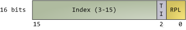
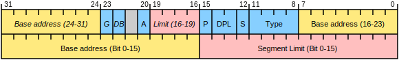
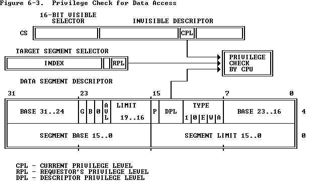
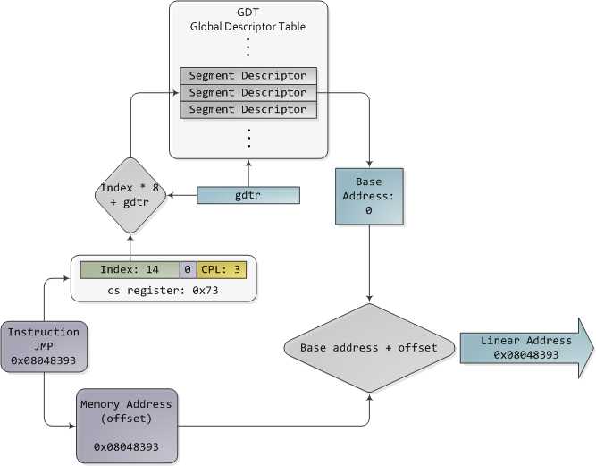

# Segmentation

* 段选择符 segment selector

* 段描述符 segment descriptors

* CPL,RPL,DPL

* 保护模式寻址


## 每个 CPU 的 GDT
* 每个 CPU 的 GDT 存储在 per-CPU 的 `gdt_page` 变量中，它会被映射到 CPU Entry Area 的 `.gdt` 域中，见 [x86 中的栈](stack_x86-64.md)
* 声明和接口函数
  * arch/x86/include/asm/desc.h
```c
struct gdt_page {
    struct desc_struct gdt[GDT_ENTRIES];
} __attribute__((aligned(PAGE_SIZE)));

DECLARE_PER_CPU_PAGE_ALIGNED(struct gdt_page, gdt_page);
//提供指定 CPU 的原始 gdt
/* Provide the original GDT */
static inline struct desc_struct *get_cpu_gdt_rw(unsigned int cpu)
{
    return per_cpu(gdt_page, cpu).gdt;
}
//提供当前 CPU 的原始 gdt
/* Provide the current original GDT */
static inline struct desc_struct *get_current_gdt_rw(void)
{
    return this_cpu_ptr(&gdt_page)->gdt;
}
//提供指定 CPU 的固定映射的 gdt 地址（在 CPU Entry Area 中）
/* Provide the fixmap address of the remapped GDT */
static inline struct desc_struct *get_cpu_gdt_ro(int cpu)
{
    return (struct desc_struct *)&get_cpu_entry_area(cpu)->gdt;
}
//提供当前 CPU 的固定映射的 gdt 地址（在 CPU Entry Area 中）
/* Provide the current read-only GDT */
static inline struct desc_struct *get_current_gdt_ro(void)
{
    return get_cpu_gdt_ro(smp_processor_id());
}
//提供指定 CPU 的 gdt 的物理地址（原始的和 CPU Entry Area 的虚拟地址指向同一物理地址
/* Provide the physical address of the GDT page. */
static inline phys_addr_t get_cpu_gdt_paddr(unsigned int cpu)
{
    return per_cpu_ptr_to_phys(get_cpu_gdt_rw(cpu));
}
```
* per-CPU `struct gdt_page gdt_page` 的定义
  * arch/x86/kernel/cpu/common.c
```c
DEFINE_PER_CPU_PAGE_ALIGNED(struct gdt_page, gdt_page) = { .gdt = {
#ifdef CONFIG_X86_64
    /*
     * We need valid kernel segments for data and code in long mode too
     * IRET will check the segment types  kkeil 2000/10/28
     * Also sysret mandates a special GDT layout
     *
     * TLS descriptors are currently at a different place compared to i386.
     * Hopefully nobody expects them at a fixed place (Wine?)
     */
    [GDT_ENTRY_KERNEL32_CS]     = GDT_ENTRY_INIT(DESC_CODE32, 0, 0xfffff),
    [GDT_ENTRY_KERNEL_CS]       = GDT_ENTRY_INIT(DESC_CODE64, 0, 0xfffff),
    [GDT_ENTRY_KERNEL_DS]       = GDT_ENTRY_INIT(DESC_DATA64, 0, 0xfffff),
    [GDT_ENTRY_DEFAULT_USER32_CS]   = GDT_ENTRY_INIT(DESC_CODE32 | DESC_USER, 0, 0xfffff),
    [GDT_ENTRY_DEFAULT_USER_DS] = GDT_ENTRY_INIT(DESC_DATA64 | DESC_USER, 0, 0xfffff),
    [GDT_ENTRY_DEFAULT_USER_CS] = GDT_ENTRY_INIT(DESC_CODE64 | DESC_USER, 0, 0xfffff),
#else
...
#endif
} };
EXPORT_PER_CPU_SYMBOL_GPL(gdt_page);
```
* 相关的声明和宏
  * arch/x86/include/asm/desc_defs.h
```c
/* 8 byte segment descriptor */
struct desc_struct {
    u16 limit0;
    u16 base0;
    u16 base1: 8, type: 4, s: 1, dpl: 2, p: 1;
    u16 limit1: 4, avl: 1, l: 1, d: 1, g: 1, base2: 8;
} __attribute__((packed));

#define GDT_ENTRY_INIT(flags, base, limit)          \
    {                           \
        .limit0     = ((limit) >>  0) & 0xFFFF, \
        .limit1     = ((limit) >> 16) & 0x000F, \
        .base0      = ((base)  >>  0) & 0xFFFF, \
        .base1      = ((base)  >> 16) & 0x00FF, \
        .base2      = ((base)  >> 24) & 0x00FF, \
        .type       = ((flags) >>  0) & 0x000F, \
        .s      = ((flags) >>  4) & 0x0001, \
        .dpl        = ((flags) >>  5) & 0x0003, \
        .p      = ((flags) >>  7) & 0x0001, \
        .avl        = ((flags) >> 12) & 0x0001, \
        .l      = ((flags) >> 13) & 0x0001, \
        .d      = ((flags) >> 14) & 0x0001, \
        .g      = ((flags) >> 15) & 0x0001, \
    }
```

### 加载 GDT
* 内核初始化时加载 GDT 的路径如下：
```c
//init/main.c
start_kernel()
   //arch/x86/kernel/setup_percpu.c
-> setup_per_cpu_areas()
   //arch/x86/kernel/cpu/common.c
   -> switch_gdt_and_percpu_base(cpu)
      -> load_direct_gdt(cpu)
            gdt_descr.address = (long)get_cpu_gdt_rw(cpu);
            gdt_descr.size = GDT_SIZE - 1;
         -> load_gdt(&gdt_descr)
            //arch/x86/include/asm/desc.h
         => native_load_gdt(dtr)
            -> asm volatile("lgdt %0"::"m" (*dtr))
      -> wrmsrq(MSR_GS_BASE, cpu_kernelmode_gs_base(cpu)) //初始化 GS 寄存器（kernel space 用）
```

# References
* [Global Descriptor Table - wikipedia](https://en.wikipedia.org/wiki/Global_Descriptor_Table)
* [LDT- OSDev Wiki](https://wiki.osdev.org/LDT)
* [CVE-2017-17053(Linux kernel LDT use after free) 漏洞分析](https://www.anquanke.com/post/id/90295)
* [Intel 80386 Reference Programmer's Manual](https://pdos.csail.mit.edu/6.828/2005/readings/i386/toc.htm)
* [Memory Translation and Segmentation](https://manybutfinite.com/post/memory-translation-and-segmentation/)
* [x86-64处理器的几种运行模式](https://zhuanlan.zhihu.com/p/69334474)
