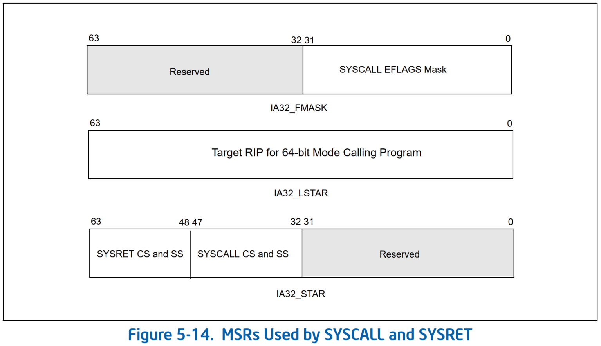

# x86-64 系统调用
* x86-64 位 flat 模式提供了快速系统调用硬件机制
  * 使用`syscall`指令触发系统调用，CPU 从用户态（Ring3）切换到特权态（Ring0）
  * 使用`sysret`指令，CPU 从内核态切换到用户态
* 注意：`sysret`指令和`iret`指令是 CPU 从内核态切换到用户态的两种方式

## syscall 指令
* 执行`syscall`指令，发生系统调用时，CPU 硬件执行以下动作：
  1. 把`MSR_LSTAR`寄存器中的值加载到`RIP`寄存器，并把当前程序运行的下一条指令（即`syscall`指令的下一条指令）保存在`RCX`寄存器中
  2. 把当前的`RFLAGS`寄存器的值保存在`R11`寄存器，并使用`MSR_FMASK`寄存器的值 mask 当前`RFLAGS`的值。一般通过这种方式关闭中断，保证进入系统调用后，CPU 的中断是关闭的
  3. 把`MSR_STAR`寄存器的·`47-32`位的`SYSCALL CS and SS`分别加载到 CPU 的`CS`和`SS`段寄存器，同时更新`CS`和`SS`的不可见部分
* 注意：`syscall`指令不会更新`RSP`寄存器的值，由操作系统去负责切换程序栈

> The `SYSCALL` instruction does not save the stack pointer (`RSP`). If the OS system-call handler will change the stack pointer, it is the responsibility of software to save the previous value of the stack pointer. This might be done prior to executing `SYSCALL`, with software restoring the stack pointer with the instruction following `SYSCALL` (which will be executed after `SYSRET`). Alternatively, the OS system-call handler may save the stack pointer and restore it before executing `SYSRET`.
>
> -- SDM, Vol. 2B, SYSCALL -Fast System Call

## sysret 指令
* 执行`sysret`指令，CPU 从内核特权态（Ring0）返回到用户态（Ring3），从`syscall`的指令的下一条指令处继续执行
* CPU硬件执行以下动作：
  1. 把`RCX`寄存器中的值加载到`RIP`寄存器
  2. 把`R11`寄存器中的值加载到`RFLAGS`寄存器
  3. 把`MSR_STAR`寄存器中的`SYSRET CS and SS`分别加载到`CS`和`SS`段寄存器
* 注意：`sysret`指令不修改`RSP`寄存器的值，操作系统负责切换程序栈

## 系统调用的初始化



* 系统启动过程中`cpu_init()`会调用 `syscall_init()`初始化系统调用的相关 MSRs
```cpp
/* May not be marked __init: used by software suspend */
void syscall_init(void)
{   // wrmsr() 第二个参数为低 32 位，第三个参数为高 32 位
    wrmsr(MSR_STAR, 0, (__USER32_CS << 16) | __KERNEL_CS);
    wrmsrl(MSR_LSTAR, (unsigned long)entry_SYSCALL_64);

#ifdef CONFIG_IA32_EMULATION
    ...
#endif

    /*
     * Flags to clear on syscall; clear as much as possible
     * to minimize user space-kernel interference.
     */
    wrmsrl(MSR_SYSCALL_MASK,
           X86_EFLAGS_CF|X86_EFLAGS_PF|X86_EFLAGS_AF|
           X86_EFLAGS_ZF|X86_EFLAGS_SF|X86_EFLAGS_TF|
           X86_EFLAGS_IF|X86_EFLAGS_DF|X86_EFLAGS_OF|
           X86_EFLAGS_IOPL|X86_EFLAGS_NT|X86_EFLAGS_RF|
           X86_EFLAGS_AC|X86_EFLAGS_ID);
}
```

## 系统调用的进入与退出
* arch/x86/entry/entry_64.S
```c
SYM_CODE_START(entry_SYSCALL_64)
    UNWIND_HINT_ENTRY
    ENDBR

    swapgs  //交换 GS:krnlGS 的值，否则无法访问 kernel 中的 per-CPU 变量
    /* tss.sp2 is scratch space. */
    movq    %rsp, PER_CPU_VAR(cpu_tss_rw + TSS_sp2)     //将用户态的栈暂存在 cpu_tss_rw.x86_tss.sp2
    SWITCH_TO_KERNEL_CR3 scratch_reg=%rsp               //KPTI 切换到进程在内核态的 CR3，利用 $rsp 做中转
    movq    PER_CPU_VAR(cpu_current_top_of_stack), %rsp //切换到进程的内核栈

SYM_INNER_LABEL(entry_SYSCALL_64_safe_stack, SYM_L_GLOBAL)
    ANNOTATE_NOENDBR                                    //CET/IBT 特性了解一下

    /* Construct struct pt_regs on stack */             //在进程的内核栈上构造 struct pt_regs 结构
    pushq   $__USER_DS              /* pt_regs->ss */
    pushq   PER_CPU_VAR(cpu_tss_rw + TSS_sp2)   /* pt_regs->sp */ //注意：用户态的栈地址也放在进程的内核栈上了！
    pushq   %r11                    /* pt_regs->flags */
    pushq   $__USER_CS              /* pt_regs->cs */
    pushq   %rcx                    /* pt_regs->ip */
SYM_INNER_LABEL(entry_SYSCALL_64_after_hwframe, SYM_L_GLOBAL)
    pushq   %rax                    /* pt_regs->orig_ax */

    PUSH_AND_CLEAR_REGS rax=$-ENOSYS

    /* IRQs are off. */
    movq    %rsp, %rdi //第一个参数是 struct pt_regs *，实例的内容在进程内核栈上
    /* Sign extend the lower 32bit as syscall numbers are treated as int */
    movslq  %eax, %rsi //第二个参数是系统调用号

    /* clobbers %rax, make sure it is after saving the syscall nr */
    IBRS_ENTER  //开启受限的分支预测，防止用户空间对 Indirect Branch Predictor 的训练，对内核内部的间接分支预测产生任何影响
    UNTRAIN_RET //清除 branch predictor 的 Return Stack Buffer 缓解针对返回时投机执行的攻击，可通过 retbleed=off 关闭
    CLEAR_BRANCH_HISTORY //清除 branch predictor 的 Branch History Buffer 缓解针对投机执行历史的攻击，可通过 spectre_bhi=off 关闭

    call    do_syscall_64       /* returns with IRQs disabled */

    /*
     * Try to use SYSRET instead of IRET if we're returning to
     * a completely clean 64-bit userspace context.  If we're not,
     * go to the slow exit path.
     * In the Xen PV case we must use iret anyway.
     */

    ALTERNATIVE "testb %al, %al; jz swapgs_restore_regs_and_return_to_usermode", \
        "jmp swapgs_restore_regs_and_return_to_usermode", X86_FEATURE_XENPV

    /*
     * We win! This label is here just for ease of understanding
     * perf profiles. Nothing jumps here.
     */
syscall_return_via_sysret:
    IBRS_EXIT
    POP_REGS pop_rdi=0 //从进程内核栈上恢复除 RDI 以外的用户态的寄存器的值
    //现在除了 RSP 和 RDI 以外的寄存器的值都恢复了。保存旧的栈指针（进程内核栈），切换到 trampoline 栈
    /*
     * Now all regs are restored except RSP and RDI.
     * Save old stack pointer and switch to trampoline stack.
     */
    movq    %rsp, %rdi //旧的栈指针（即进程内核栈）保存到 RDI
    movq    PER_CPU_VAR(cpu_tss_rw + TSS_sp0), %rsp //将栈从进程内核栈切换至 trampoline 栈
    UNWIND_HINT_END_OF_STACK

    pushq   RSP-RDI(%rdi)   /* RSP */ //从旧的栈指针（进程内核栈）上找到存用户态 RSP 的值的位置，将其压栈
    pushq   (%rdi)      /* RDI */     //从旧的栈指针（进程内核栈）上找到存用户态 RDI 的值的位置，将其压栈
    //我们现在在 trampoline 栈上。除 RDI 外，所有用户态寄存器都活过来了。我们可以在这里做未来的最后退出工作。
    /*
     * We are on the trampoline stack.  All regs except RDI are live.
     * We can do future final exit work right here.
     */
    STACKLEAK_ERASE_NOCLOBBER

    popq    %rdi //将刚才压入 trampoline 栈的用户态 RDI 的值弹出到 RDI
    popq    %rsp //将刚才压入 trampoline 栈的用户态 RSP 的值弹出到 RSP
SYM_INNER_LABEL(entry_SYSRETQ_unsafe_stack, SYM_L_GLOBAL)
    ANNOTATE_NOENDBR
    swapgs       //交换 GS:krnlGS 的值
    CLEAR_CPU_BUFFERS
    sysretq      //返回用户态，最后恢复的四个寄存器见前面的说明
SYM_INNER_LABEL(entry_SYSRETQ_end, SYM_L_GLOBAL)
    ANNOTATE_NOENDBR
    int3
SYM_CODE_END(entry_SYSCALL_64)
```
* **注意**：`pushq PER_CPU_VAR(cpu_tss_rw + TSS_sp2) /* pt_regs->sp */` 这行语句将用户态的栈指针也放在进程的内核栈上了！这样就不怕进程迁移到别的 CPU 后 `cpu_tss_rw.x86_tss.sp2` 没跟着走了，因为进程的内核栈总是跟着走的，即使迁移到别的 CPU 上将来返回用户态时还是从进程的内核栈上找回用户态的栈指针
* 返回用户态前先切换到统一的 per-CPU 的 trampoline stack，避免暴露某个进程内核栈的位置

## References
- [X86_64处理器系统调用机制在linux上的实现](https://codeantenna.com/a/zVXomEIQ1H)
- [What Makes System Calls Expensive_ A Linux Internals Deep Dive](https://blog.codingconfessions.com/p/what-makes-system-calls-expensive)