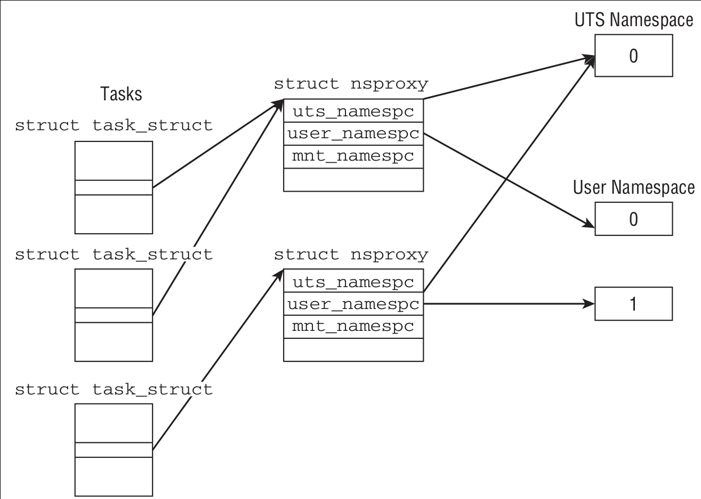

# 虚拟文件系统（VFS）


# 文件系统抽象层
* 为了支持多文件系统，VFS提供了一个通用文件系统模型，该模型囊括了任何文件系统的常用功能集和行为。
* VFS抽象层之所以能衔接各种各样的文件系统，是因为它定义了所有文件系统都支持的、基本的、概念上的接口和数据结构。
* UNIX使用的和文件系统相关的传统抽象概念：
  * 文件
  * 索引结点（inode）
  * 目录项
  * 挂载点
* 超级块（super block）-一种包含文件系统信息的数据结构。

# VFS对象及其数据结构
* VFS四个主要对象类型：
  * 超级块对象，代表一个具体的已挂载的文件系统。
  * 索引结点对象，代表一个具体的文件。
  * 目录项对象，代表一个目录项，是路径的一个组成部分。路径中的目录条目统称为目录项。
  * 文件对象，代表由进程打开的文件。
* 注意，因为VFS将目录作为一个普通文件来处理，所以不存在目录对象。目录项不同于目录。
* 四个主要对象类型分别对应四个操作对象，描述对象可以使用的方法：
  * `super_operations`
  * `inode_operations`
  * `dentry_operations`
  * `file_operations`
* 此外，`fs_struct`和`file`结构体也值得注意。

# super block对象和方法
* 各种文件系统都必须实现super block对象，用于存储特定文件系统的信息。
* 对应于存放在磁盘特定扇区中的文件系统super block或者文件系统控制块。
* 对于并非基于磁盘的文件系统（如基于内存的sysfs），它们会在现场（on-the-fly）创建超级块并将其保存到内存。
* include/linux/fs.h
```c
struct super_operations {
    struct inode *(*alloc_inode)(struct super_block *sb); /*在给定super block下创建和初始化一个inode对象*/
    void (*destroy_inode)(struct inode *); /*释放给定的inode结点*/

    void (*dirty_inode) (struct inode *, int flags); /*VFS在inode脏（被修改）时调用，日志文件系统执行该函数进行日志更新*/
    int (*write_inode) (struct inode *, struct writeback_control *wbc); /*给定inode写入磁盘*/
    int (*drop_inode) (struct inode *); /*最后一个指向inode的引用被释放后，VFS调用该函数*/
    void (*evict_inode) (struct inode *); /*从磁盘删除给定的inode*/
    void (*put_super) (struct super_block *); /*卸载文件系统时由VFS调用，用来释放super block。调用者须一直持有s_lock锁*/
    int (*sync_fs)(struct super_block *sb, int wait); /*使文件系统的数据元与磁盘上的文件系统同步。wait参数指定操作是否同步*/
    int (*freeze_super) (struct super_block *);
    int (*freeze_fs) (struct super_block *);
    int (*thaw_super) (struct super_block *);
    int (*unfreeze_fs) (struct super_block *);
    int (*statfs) (struct dentry *, struct kstatfs *); /*VFS籍此获取文件系统统计信息*/
    int (*remount_fs) (struct super_block *, int *, char *); /*当指定新的挂载选项挂载文件系统时，VFS调用。调用者须一直持有s_lock锁*/
    void (*umount_begin) (struct super_block *); /*VFS调用该函数中断挂载操作。该函数被网络文件系统使用，如NFS*/

    int (*show_options)(struct seq_file *, struct dentry *);
    int (*show_devname)(struct seq_file *, struct dentry *);
    int (*show_path)(struct seq_file *, struct dentry *);
    int (*show_stats)(struct seq_file *, struct dentry *);
#ifdef CONFIG_QUOTA
    ssize_t (*quota_read)(struct super_block *, int, char *, size_t, loff_t);
    ssize_t (*quota_write)(struct super_block *, int, const char *, size_t, loff_t);
    struct dquot **(*get_dquots)(struct inode *);
#endif
    int (*bdev_try_to_free_page)(struct super_block*, struct page*, gfp_t);
    long (*nr_cached_objects)(struct super_block *,
                  struct shrink_control *);
    long (*free_cached_objects)(struct super_block *,
                    struct shrink_control *);
};
```
* 这些操作 **由VFS在进程上下文中调用**。
* 除了`dirty_inode()`，其他函数在必要时都可以阻塞。

# inode对象和方法
* inode对象包含内核在操作文件或目录时需要的全部信息。
* 对UNIX风格的文件系统，这些信息可以从磁盘上的inode直接读入。
* 对于没有inode的文件系统，如需支持该文件系统，inode对象也须在内存中创建才能使用。
* 一个inode对象代表文件系统中的一个文件，或者是管道或设备这样的特殊文件。
* inode结点仅当文件被访问时才在内存中创建。
* include/linux/fs.h
```c
struct inode_operations {    
    struct dentry * (*lookup) (struct inode *,struct dentry *, unsigned int); /*在给定的目录中，根据提供的dentry文件名，查找inode*/
    const char * (*get_link) (struct dentry *, struct inode *, struct delayed_call *);
    int (*permission) (struct inode *inode, int mask); /*检查给定的inode所代表的文件是否允许特定的访问模式*/
    struct posix_acl * (*get_acl)(struct inode *, int);

    int (*readlink) (struct dentry *dentry, char __user *buffer,int buflen); /*被系统调用readlink()调用，拷贝数据到特定的buffer中。数据来自dentry，拷贝大小最大可达buflen字节*/

    int (*create) (struct inode *,struct dentry *, umode_t, bool); /*VFS通过系统调用create()和open()来调用该函数，为dentry对象创建一个新的inode结点*/
    int (*link) (struct dentry *old_dentry,struct inode *dir,struct dentry *dentry); /*硬链接名称由dentry指定，链接到dir目录中old_dentry代表的文件*/
    int (*unlink) (struct inode *,struct dentry *); /*从目录dir中删除由目录项dentry指定的inode对象*/
    int (*symlink) (struct inode *dir,struct dentry *dentry,const char *symname); /*创建符号链接，名称为symname，链接到dir目录中的dentry目录项*/
    int (*mkdir) (struct inode *,struct dentry *,umode_t); /*创建一个新目录*/
    int (*rmdir) (struct inode *dir,struct dentry *dentry); /*删除dir目录中dentry目录项代表的文件*/
    int (*mknod) (struct inode *,struct dentry *,umode_t,dev_t); /*创建特殊文件（设备，有名管道，socket）*/
    int (*rename) (struct inode *, struct dentry *,
            struct inode *, struct dentry *);  /*移动文件*/                   
    int (*rename2) (struct inode *, struct dentry *,
            struct inode *, struct dentry *, unsigned int);
    int (*setattr) (struct dentry *, struct iattr *); /*被notify_change()调用，在修改inode后，通知发生了“改变事件”*/
    int (*getattr) (struct vfsmount *mnt, struct dentry *, struct kstat *); /*VFS在通知inode需要从磁盘更新时调用*/
    int (*setxattr) (struct dentry *, const char *,const void *,size_t,int); /*VFS调用，给dentry指定的文件设置扩展属性*/
    ssize_t (*getxattr) (struct dentry *, const char *name, void *value, size_t); /*VFS调用，向value中拷贝给定文件扩展属性name对应的数值*/
    ssize_t (*listxattr) (struct dentry *dentry, char *list, size_t); /*将特定文件的所有属性列表拷贝到一个缓冲list中*/
    int (*removexattr) (struct dentry *, const char *); /*给定文件中删除指定的属性*/
    int (*fiemap)(struct inode *, struct fiemap_extent_info *, u64 start,
              u64 len);              
    int (*update_time)(struct inode *, struct timespec *, int);
    int (*atomic_open)(struct inode *, struct dentry *,
               struct file *, unsigned open_flag,
               umode_t create_mode, int *opened);
    int (*tmpfile) (struct inode *, struct dentry *, umode_t);
    int (*set_acl)(struct inode *, struct posix_acl *, int);
} ____cacheline_aligned;
...
```

# dentry对象
* VFS把 *目录* 当作 *文件* 对待。
* 为了方便查找操作，VFS引入目录项的概念。每个dentry代表路径中的一个特定部分。
* 必须明确一点：在路径中（包括普通文件在内），每一个部分都是dentry对象。
* dentry也可包括挂载点。VFS在执行目录操作时，如果需要的话，会现场（on-the-fly）创建dentry对象。
* include/linux/dcache.h
```c
struct dentry {
    /* RCU lookup touched fields */
    unsigned int d_flags;       /* protected by d_lock */
    seqcount_t d_seq;       /* per dentry seqlock */
    struct hlist_bl_node d_hash;    /* lookup hash list */
    struct dentry *d_parent;    /* parent directory */
    struct qstr d_name;
    struct inode *d_inode;      /* Where the name belongs to - NULL is
                     * negative */
    unsigned char d_iname[DNAME_INLINE_LEN];    /* small names */

    /* Ref lookup also touches following */
    struct lockref d_lockref;   /* per-dentry lock and refcount */
    const struct dentry_operations *d_op;
    struct super_block *d_sb;   /* The root of the dentry tree */
    unsigned long d_time;       /* used by d_revalidate */
    void *d_fsdata;         /* fs-specific data */

    struct list_head d_lru;     /* LRU list */
    struct list_head d_child;   /* child of parent list */
    struct list_head d_subdirs; /* our children */
    /*
     * d_alias and d_rcu can share memory
     */
    union {
        struct hlist_node d_alias;  /* inode alias list */
        struct rcu_head d_rcu;
    } d_u;
};
```
* **dentry对象没有对应的磁盘数据结构**，VFS根据字符串形式的路径名现场（on-the-fly）创建它。
* 由于dentry对象并非真正保存在磁盘上，所以dentry结构体没有 *是否被修改的标志*（即是否脏，是否需要写回磁盘的标志）。
* dentry对象释放后也可保存到slab对象缓存中去，此时任何VFS或文件系统代码都没有指向该dentry对象的有效引用。

## dentry状态
* 目录项的三种有效状态：
  * 被使用
  * 未被使用
  * 负状态

#### 被使用的dentry
* 一个被使用的dentry对应一个有效的inode（即`d_inode`指向相应的inode）。
* 该对象存在一个或者多个使用者。
* 一个dentry处于被使用状态，意味着它正被VFS使用并且指向有效数据，因此不能丢弃。

#### 未被使用的dentry
* 一个未使用的dentry对应一个有效的inode（即`d_inode`指向相应的inode）。
* 但VFS当前并未使用它。
* 该dentry对象仍然指向一个有效对象，而且保留在缓存中以便需要时再使用它。
* 由于该目录不会被过早地撤销，所以以后再需要它时不必重新创建。
* 与未缓存的dentry比，这样使路径查找更迅速。
* 如要回收内存，可以撤销未使用的dentry。

#### 负状态的dentry
* 一个负状态/无效的dentry没有对应有效的inode（即`d_inode`为NULL）。
* 因为inode已被删除，或路径不再正确，但dentry仍保留，以便快速解析以后的路径查询。
* 虽然负状态的dentry有些用处，但如果需要可以撤销它，因为毕竟实际上很少用到。

## 目录项缓存（dcache）
* 为减少VFS遍历路径中所有元素并解析成dentry对象的时间和工作，将dentry缓存在dcache中。
* dcache的三个主要部分：
  * “used” dentries链表。通过inode对象的`i_dentry`项连接相关的inode。
  * “last recently used”双向链表。含有未被使用的和负状态的dentry对象。
  * hash表和相应的hash函数。用来快速地将给定 *路径* 解析为相关的 *dentry对象*。
* 只要dentry被缓存，其相应的inode也就被缓存了。

## dentry方法
* include/linux/dcache.h
```c
struct dentry_operations {
    int (*d_revalidate)(struct dentry *, unsigned int); /*判断目录对象是否有效。VFS准备从dcache中使用一个dentry时会调用该函数。*/
    int (*d_weak_revalidate)(struct dentry *, unsigned int);
    int (*d_hash)(const struct dentry *, struct qstr *); /*为dentry生成hash值。当dentry需要加入到hash table时，VFS调用该函数*/
    int (*d_compare)(const struct dentry *, const struct dentry *,
            unsigned int, const char *, const struct qstr *); /*比较两个文件名。注意，使用该函数时需加dcache_lock*/
    int (*d_delete)(const struct dentry *); /*当dentry对象的d_count计数为0时，VFS调用该函数。注意，使用该函数时加dcache_lock和dentry的d_lock*/
    void (*d_release)(struct dentry *); /*dentry对象将要被释放时VFS调用。默认情况下什么也不做*/
    void (*d_prune)(struct dentry *);
    void (*d_iput)(struct dentry *, struct inode *); /*当一个dentry对象丢失了相关的inode（也就是说磁盘inode被删除），VFS调用。*/
    char *(*d_dname)(struct dentry *, char *, int);
    struct vfsmount *(*d_automount)(struct path *);
    int (*d_manage)(struct dentry *, bool);
    struct inode *(*d_select_inode)(struct dentry *, unsigned);
    struct dentry *(*d_real)(struct dentry *, struct inode *);
} ____cacheline_aligned;
```

# file对象
* file对象表示进程 **已打开** 的文件，是已打开的文件在内存中的表示。
* 多个进程可以同时打开和操作同一文件，所以同一个文件也可能存在多个对应的file对象。
* file对象仅仅在进程观点上代表打开文件，它反过来指向dentry对象（反过来指向inode结点），其实只有dentry对象才表示已打开的实际文件。
* 虽然一个文件对应的file对象不是唯一的，但对应的inode结点和dentry对象无疑是唯一的。
* **file对象实际上没有对应的磁盘数据**。所以在结构体中没有代表其对象是否为脏，是否需要写回磁盘的标志。
* inode结点会记录文件是否为脏。
* include/linux/fs.h
```c
struct file_operations {
    struct module *owner;
    loff_t (*llseek) (struct file *, loff_t, int); /*更新offset指针，由系统调用llseek()调用*/
    ssize_t (*read) (struct file *, char __user *, size_t, loff_t *); /*从给定文件的offset处读，同时更新文件指针，由系统调用read()调用*/
    ssize_t (*write) (struct file *, const char __user *, size_t, loff_t *); /*写入给定文件的offset处，同时更新文件指针，由系统调用write()调用*/
    ssize_t (*read_iter) (struct kiocb *, struct iov_iter *);
    ssize_t (*write_iter) (struct kiocb *, struct iov_iter *);
    int (*iterate) (struct file *, struct dir_context *);
    unsigned int (*poll) (struct file *, struct poll_table_struct *); /*睡眠等待给定文件活动。由系统调用poll()调用*/
    long (*unlocked_ioctl) (struct file *, unsigned int, unsigned long); /*实现与ioctl()类似的功能，只不过不需要调用者持有BKL*/
    long (*compat_ioctl) (struct file *, unsigned int, unsigned long); /*ioctl()的可移植变种，被32位应用程序用在64位系统上。不必持有BKL*/
    int (*mmap) (struct file *, struct vm_area_struct *); /*将文件映射到指定地址空间上。由系统调用mmap()调用*/
    int (*open) (struct inode *, struct file *); /*创建一个新的file对象，并把它和相应的inode关联起来*/
    int (*flush) (struct file *, fl_owner_t id); /*当已打开的文件引用计数减少时被VFS调用。作用根据具体文件系统而定*/
    int (*release) (struct inode *, struct file *); /*当文件最后一个引用被注销时，该函数被VFS调用。作用根据具体文件系统而定*/
    int (*fsync) (struct file *, loff_t, loff_t, int datasync); /*指定文件的所有被缓存数据写回磁盘。由系统调用fsync()调用*/
    int (*aio_fsync) (struct kiocb *iocb, int datasync); /*将iocb描述的文件的所有被缓存数据写回磁盘。由系统调用aio_fsync()调用*/
    int (*fasync) (int, struct file *, int); /*打开或关闭异步I/O的通告信号*/
    int (*lock) (struct file *, int, struct file_lock *); /*给指定文件上锁*/
    ssize_t (*sendpage) (struct file *, struct page *, int, size_t, loff_t *, int);
    unsigned long (*get_unmapped_area)(struct file *, unsigned long, unsigned long, unsigned long, unsigned long); /*用于获取未使用的地址空间来映射给定的文件*/
    int (*check_flags)(int); /*当给出SETFL命令时，用来检查传递给fcntl()系统调用的flags的有效性。大多数文件系统不必实现，目前只有NFS文件系统实现*/
    int (*flock) (struct file *, int, struct file_lock *); /*提供advisory locking，由系统调用flock()调用*/
    ssize_t (*splice_write)(struct pipe_inode_info *, struct file *, loff_t *, size_t, unsigned int);
    ssize_t (*splice_read)(struct file *, loff_t *, struct pipe_inode_info *, size_t, unsigned int);
    int (*setlease)(struct file *, long, struct file_lock **, void **);
    long (*fallocate)(struct file *file, int mode, loff_t offset,
              loff_t len);
    void (*show_fdinfo)(struct seq_file *m, struct file *f);
#ifndef CONFIG_MMU
    unsigned (*mmap_capabilities)(struct file *);
#endif
    ssize_t (*copy_file_range)(struct file *, loff_t, struct file *,
            loff_t, size_t, unsigned int);
    int (*clone_file_range)(struct file *, loff_t, struct file *, loff_t,
            u64);
    ssize_t (*dedupe_file_range)(struct file *, u64, u64, struct file *,
            u64);
};
```

# 文件系统相关的数据结构


* 每种文件系统由一个特殊的数据结构来描述其功能和行为，即`struct file_system_type`。
* **每种文件系统不管有多少个实例挂载到系统中，还是根本就没挂载到系统中，都只有一个`struct file_system_type`结构。**
* 当文件系统被挂载时，将有一个`struct mount`结构体（的对象）在挂载点被创建。该对象用来代表文件系统的实例。
* fs/mount.h
```c
struct mount {
    struct hlist_node mnt_hash;
    struct mount *mnt_parent;
    struct dentry *mnt_mountpoint;
    struct vfsmount mnt;
    union {
        struct rcu_head mnt_rcu;
        struct llist_node mnt_llist;
    };  
#ifdef CONFIG_SMP
    struct mnt_pcp __percpu *mnt_pcp;
#else
    int mnt_count;
    int mnt_writers;
#endif
    struct list_head mnt_mounts;    /* list of children, anchored here */
    struct list_head mnt_child; /* and going through their mnt_child */
    struct list_head mnt_instance;  /* mount instance on sb->s_mounts */
    const char *mnt_devname;    /* Name of device e.g. /dev/dsk/hda1 */
    struct list_head mnt_list;
    struct list_head mnt_expire;    /* link in fs-specific expiry list */
    struct list_head mnt_share; /* circular list of shared mounts */
    struct list_head mnt_slave_list;/* list of slave mounts */
    struct list_head mnt_slave; /* slave list entry */
    struct mount *mnt_master;   /* slave is on master->mnt_slave_list */
    struct mnt_namespace *mnt_ns;   /* containing namespace */
    struct mountpoint *mnt_mp;  /* where is it mounted */
    struct hlist_node mnt_mp_list;  /* list mounts with the same mountpoint */
#ifdef CONFIG_FSNOTIFY
    struct hlist_head mnt_fsnotify_marks;
    __u32 mnt_fsnotify_mask;
#endif
    int mnt_id;         /* mount identifier */
    int mnt_group_id;       /* peer group identifier */
    int mnt_expiry_mark;        /* true if marked for expiry */
    struct hlist_head mnt_pins;
    struct fs_pin mnt_umount;
    struct dentry *mnt_ex_mountpoint;
};
```

# 进程相关的数据结果
* 系统中的每一个进程都有自己的一组打开的文件，像 *根文件系统、当前工作目录、挂载点* 等。
* 有三个数据结构将VFS和系统的进程紧密联系在一起，它们分别是：
  * `files_struct`
  * `fs_struct`
  * `nsproxy`
* 对多数进程来说，进程描述符`struct task_struct`里的域都指向唯一的`struct files_struct`和`struct fs_struct`结构体的对象。
* 对使用`CLONE_FILES`和`CLONE_FS`标志创建的进程会共享`struct files_struct`和`struct fs_struct`结构体的对象。比如说，线程。
* `struct nsproxy`在默认情况下，所有进程共享同样的命名空间。也就是，它们都从同样的挂载表中看到同一个文件系统层次结构。
* 在`clone()`操作时使用`CLONE_NEWNS`标志，则新进程不会继承父进程的命名空间，进程会有一个唯一的命名空间结构体的拷贝。

### struct files_struct
* `struct task_struct`的`files`成员指向的就是`struct files_struct`类型的对象，描述进程打开的文件及文件描述符。
* include/linux/fdtable.h
```c
*  
 * The default fd array needs to be at least BITS_PER_LONG,
 * as this is the granularity returned by copy_fdset().
 */
#define NR_OPEN_DEFAULT BITS_PER_LONG

struct fdtable {
    unsigned int max_fds;
    struct file __rcu **fd;      /* current fd array */
    unsigned long *close_on_exec;
    unsigned long *open_fds;
    unsigned long *full_fds_bits;
    struct rcu_head rcu;
};
...
/*
 * Open file table structure
 */
struct files_struct {
  /*
   * read mostly part
   */
    atomic_t count;    /*结构的使用计数*/
    bool resize_in_progress;
    wait_queue_head_t resize_wait;

    struct fdtable __rcu *fdt;  /*指向其他fd表的指针*/
    struct fdtable fdtab;       /*base fd表*/
  /*
   * written part on a separate cache line in SMP
   */
    spinlock_t file_lock ____cacheline_aligned_in_smp; /*单个文件的锁*/
    int next_fd;                          /*缓存下一个可用的fd*/
    unsigned long close_on_exec_init[1];  /*exec()时关闭的文件描述符链表*/
    unsigned long open_fds_init[1];       /*打开的文件描述符链表*/
    unsigned long full_fds_bits_init[1];
    struct file __rcu * fd_array[NR_OPEN_DEFAULT]; /*缺省的文件对象数组*/
};
```
* 对于64位机器体系结构，`NR_OPEN_DEFAULT`等于`BITS_PER_LONG`等于64。即`fd_array`可容纳64个`struct file`对象。
* 如果一个进程打开的文件对象超过`NR_OPEN_DEFAULT`，内核将分配一个新数组，并将`fdt`指针指向它。
* 如果系统中有大量的进程都要打开超过`NR_OPEN_DEFAULT`个文件，管理员可以适当增大`NR_OPEN_DEFAULT`的预定义值以优化性能。

### struct fs_struct
* `struct task_struct`的`fs`成员指向的就是`struct fs_struct`类型的对象，描述文件系统和进程相关的信息。
* include/linux/fs_struct.h
```c
struct fs_struct {
    int users;        /*用户数目*/
    spinlock_t lock;  /*保护该结构体的锁*/
    seqcount_t seq;
    int umask;
    int in_exec;      /*当前正在执行的文件*/
    struct path root, pwd;  /*根目录的路径和当前工作目录的路径*/
};
```

### struct nsproxy


* include/linux/nsproxy.h
```c
/*
 * A structure to contain pointers to all per-process
 * namespaces - fs (mount), uts, network, sysvipc, etc.
 *
 * The pid namespace is an exception -- it's accessed using
 * task_active_pid_ns.  The pid namespace here is the
 * namespace that children will use.
 *
 * 'count' is the number of tasks holding a reference.
 * The count for each namespace, then, will be the number
 * of nsproxies pointing to it, not the number of tasks.
 *
 * The nsproxy is shared by tasks which share all namespaces.
 * As soon as a single namespace is cloned or unshared, the
 * nsproxy is copied.
 */
struct nsproxy {
    atomic_t count;
    struct uts_namespace *uts_ns;  /*UTS:UNIX Timesharing System*/
    struct ipc_namespace *ipc_ns;
    struct mnt_namespace *mnt_ns;
    struct pid_namespace *pid_ns_for_children;
    struct net       *net_ns;
    struct cgroup_namespace *cgroup_ns;
};
```

* fs/mount.h
```c
struct mnt_namespace {
    atomic_t        count;      /*使用计数*/
    struct ns_common    ns;
    struct mount *  root;       /*根目录的挂载点对象*/
    struct list_head    list;   /*挂载点链表*/
    struct user_namespace   *user_ns;
    u64         seq;    /* Sequence number to prevent loops */
    wait_queue_head_t poll;     /*轮询的等待队列*/
    u64 event;                  /*事件计数*/
};
```

# 参考资料
* [Dynamic Tracing with DTrace & SystemTap - Virtual File System](http://myaut.github.io/dtrace-stap-book/kernel/fs.html)
