# 微架构学习

[DecodeZ](https://decodezp.github.io) 的系列文章《Skylake微架构(Microarchitecture)剖析》言简意赅，是学习微架构很好的起步文章。

* [Skylake (Client) Microarchitecture](https://en.wikichip.org/w/images/7/7e/skylake_block_diagram.svg)
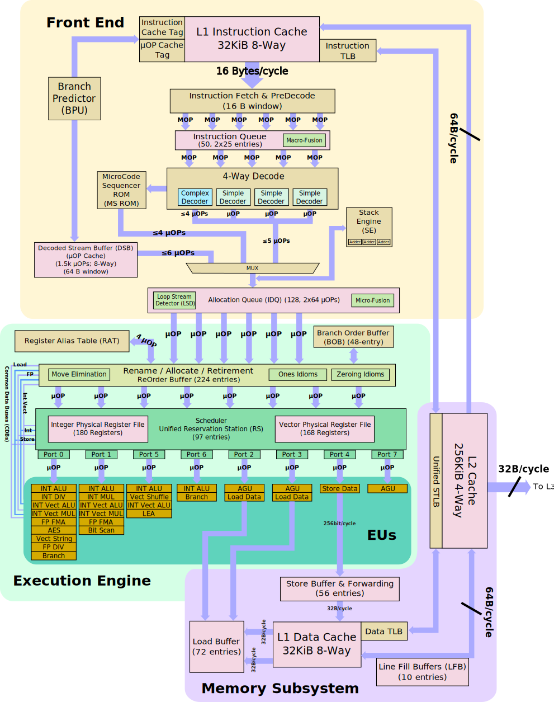    
* [Skylake (Server) Microarchitecture](https://en.wikichip.org/w/images/e/ee/skylake_server_block_diagram.svg)
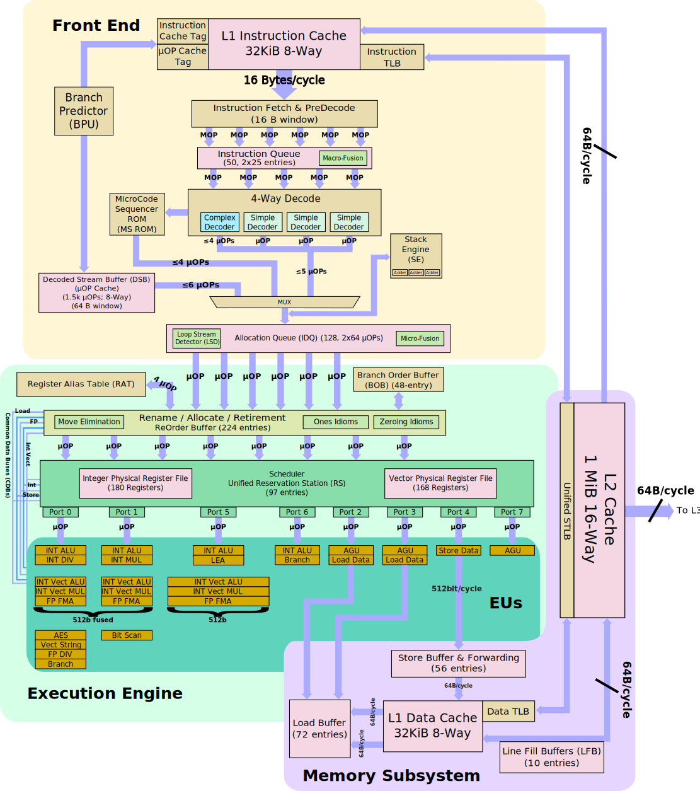

## 流水线总览
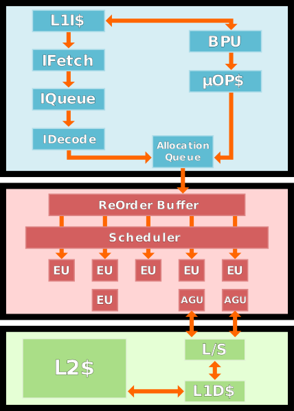
* `Allocation Queue`，它就还有一个名字叫做 `Instruction Decode Queue`，同时它还有可能被叫做 `IDQ` 或 `AQ`

### 前端（Front-End）
* 上图中蓝色部分就代表流水线的前端。它的主要作用就是获取指令、解码（Decode）指令。
* 为了最大限度的发挥 CPU 的能力，前端就需要尽可能高效率地把程序指令输送给后端。这里就面临两个挑战：
  * 如何更快更准确地取得要执行的指令
  * 如何将取得的指令更快地解码为 **微指令（micro-ops/uops）**
* 有了更多的微指令输送给后端（执行单元），后端的工作量才能饱和。而前端的所有组件和机制，都是围绕这两个挑战进行的。

### 后端（Back-End）
* 上图中红色的部分就代表流水线的后端。一般来讲绿色的部分是存储子系统，虽然与后端交互，但严格讲不算在后端里面。
* 后端的主要任务就是执行前端送过来的指令。和前端类似，后端除了“来料加工”之外，也有它自己需要面对的挑战：
  * 如何提高指令的并行程度
  * 如何充分利用已有的 CPU 能力

## 前端（Front End）
* 处理器在前端这一部分的时候还是顺序（in-order）处理的，主要是也确实没什么乱序的空间。
  * 虽然说是顺序，但前端因为贴近业务，所以受人写的代码的影响也比较大。
  * 如果仅仅只是“取指令->解码”，恐怕需要写程序的人是个非常聪明的程序员。前端很多组件的工作其实都是在填程序员的坑，这也是作者比较心疼前端的地方。

### Fetch
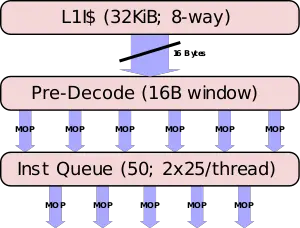

* 前端的任务，首先是从内存中取得指令。同读取数据类似，CPU 通过查询页表获得指令所在的内存地址，同时把指令塞到 CPU 的 L1 指令缓存里。
* 具体要把哪个地址上的指令数据送到 L1 iCache 里，这是 **分支预测器（Branch predictor）** 的工作。
  * 作为 CPU 的核心技术，Intel 并没有透露太多信息，我们这里也只好一笔带过。不过它的细节也许很复杂，但它的脾气很好掌握：和我们很多人不喜欢自己的工作一样，它的工作就是处理分支，但它最不喜欢分支。
* 在 Skylake 架构里，L1 iCache 大小为 `32KB`，组织形式为 8-way set associative（关于 CPU 缓存组织形式的讲解可以参照[这篇](https://decodezp.github.io/2018/11/25/quickwords2-cacheassociativity/)）
* 每个 cycle 可以取 `16 Byte` 长度（**fetch window**）的指令。
  * 如果你开了 Hyper-thread，那么同一个物理核上的两个逻辑核均分这个 fetch window，每个 cycle 各占用一次。
* 在 L1 iCache 里的指令还都是变长的 x86 macro-ops，也就是我们看到的那些编译之后的汇编指令。如果熟悉这些指令的话，就会知道这些指令的长度（就是那些二进制数字）都不一样，同时一条指令有时可以由好几个操作组成。
* 这种指令对 CPU 的执行单元来说是很不友好的，同时如果想要通过乱序执行提高指令的并行度，减小指令的粒度也是必须的步骤。因此需要把这些 `marco-ops` “**解码**”为 “`micro-ops`”。
* 当然具体的解码工作还在后面。从 L1 iCache 中取得指令数据后，首先要进入“**预解码**”阶段，
  * 在这里需要识别出在一个 fetch window 中取得的这 `16` 个 Byte 的数据里面有多少个指令。
  * 除此之外，还需要对一些特殊指令，比如分支转跳打上一些标记。
* 但因为指令变长的原因，`16` 个 Byte 往往并不对应固定的指令数，还有可能最后一个指令有一半在这 `16 Byte` 里，另一边还在后面。
* 另外就是 pre-decode 在一个 cycle 最多识别出 `6` 个指令，或者这 `16 Byte` 的数据都解析完。
  * 如果这 `16` 个 Byte 里包含有 `7` 个指令，那么第一个 cycle 识别出前 `6` 个之后，还需要第二个 cycle 识别最后一个，然后才能再读取后面 `16 Byte`。
  * 那么 pre-decode 的效率就变成了 `3.5 instruction / cycle`，比最理想的情况 `6 instruction / cycle` 降低了 `41%`，现实就是这么残酷。
* 经过 pre-decode 之后，才真正从 `16 Byte` 的二进制数据中识别出了指令，这些指令下一步要被塞到一个队列里（Instruction Queue）看看有没有什么能被优化的地方。
  * 一个最常见的优化方式就是 **macro-op fusion**，就是把两个相邻的，且能被一个指令表示的指令，用那一个指令替换掉。比如：
```s
cmp eax, [mem]
jne loop
```
直接换成
```s
cmpjne eax, [mem], loop
```
* 当然既然决定这么替换，新指令对流水线的开销肯定小于被替换的两个指令之和。如此可以减轻一部分后端执行单元的工作负荷和资源开销。
* OK, 在取得了指令数据，识别出了数据中的指令，并对指令做了一些优化合并之后，就该开始正儿八经地解码了。

### 解码

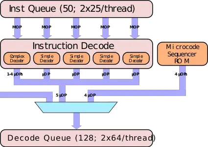

* 在拿到了经过“预解码”的 `macro-ops` 之后，开始正式进入解码过程。`marco-ops` 进入 Instruction Decode 组件解码，最终的输出为定长的 `micro-ops`。
* Insturction Decode 组件也有入口带宽限制，每个 cycle 最多取
  * `3` 个 unfused 指令 + `2` 个 fused 指令，
  * 或者 `5` 个 unfused 指令（这里指 macro ops）。
* 所以说 fused 多了也不好，一个 cycle 最多取两个。
* 同时如果开了 Hyper Thread，则两个 Thread 按 cycle 交替使用 Instruction Decode。
* 在 Instruction Decode 组件里面的就是各个具体的 Decoder。Decoder类型可以分类两类，
  * 一类是 Simple Decoder，
  * 一类是 Complex Decoder。
* 顾名思义，**Simple Decoder** 处理的是解码之后的输出为 `1` 个 `fused-uop` 的指令；**Complex Decoder** 处理的是解码之后的输出为 `1` 个至 `4` 个 `fused-uop` 的指令。

#### Fused-uop
* **注意**：这里说的是 fused-`uop`，不是 fused-`marco`。在这里所有输出的 uop 都是做过 fused 处理的，目的是减少后续资源的占用。
* 但这里有一个比较容易混淆的概念，就是 `fused-uop` 并非专指那些两个 uop 合并之后生成的“合并 uop”，而是指所有经过了 uop fusion 处理的 uop
  * 有些指令可能两个 uop 变一个，但也有一些是一个还是一个，即便如此，输出的那一个也叫 `fused-uop`
* 为了进一步澄清这个概念，我们稍微需要涉及一点后端的概念。
  * 在前端这里，生成 `fused-uop` 的部分还属于 CPU 流水线中的 **uops fused domain**，
  * 而在后端需要将指令发射到执行单元去的时候，是不能执行 `fused uop` 的，所以 `fused uop` 还需要再分解为 `unfused uop` 才可以执行，这一部分就属于 CPU 流水线中的 **uops unfused domain**。
* 有了这些概念之后，我们可以看一下 [Instruction Tables.pdf](https://www.agner.org/optimize/instruction_tables.pdf) 这份文档。
  * 在 P244 中有对 skylake 指令的说明，上面有对一些概念的解释，下面是一张表格：

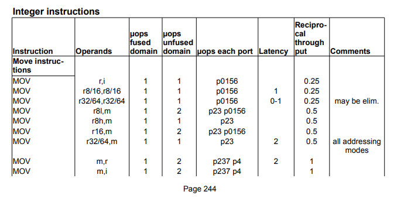

* 在这张表格里是最常见的 `mov` 命令的说明。但因为操作数（operands）的不同在真正执行的时候也会有细节上的差别。
  * 第一行中的 `mov` 的两个操作数一个是 `register`，另外一个是一个立即数。在 uops fused domain 和 uops unfused domain 两栏中的计数都是 `1`。这种指令也算在 uops fused domain 经过了 fusion 处理。只不过其实前后没什么区别。
  * 但如果我们看一下所有在 uops unfused domain 里计数为 `2` 的 `mov` 指令，它们在 uops fused domain 中的计数都是 `1`。这种 `mov` 指令就是真正做过`2` 条 uop 合并的 `mov` 指令。
* Skylake 有 `4` 个 Simple Decoder 和 `1` 个 Complex Decoder。但从表里我们可以看到 uops fused domain 计数为 `1`，也就是可以被 Simple Decoder 处理的指令在所有指令中所占的比例似乎并没有达到 `4/5` 那么高。
* 这里需要说明的是，输出大于 `4` 个 uop 的指令，既不由 Simple Decoder 处理，也不由 Complex Decoder 处理，而是直接去查 **Microcode Sequencer（MS）**，这是一块类似于缓存的 ROM。
* Complex Decoder 的数量始终为 `1` 的原因是：
  * Complex Decoder 解码出来的 uop 都很难在执行时进行并行化处理，
  * 同时 Complex Decoder 每多解码一个 uop，就要有一个 Simple Decoder 处于不能工作的状态。
* 对 CPU 来说，它最希望的就是它要做的工作，它需要的数据，它要执行的指令，都已经在一块缓存里准备就绪了。这是 CPU 上班摸鱼的主要方法，但摸出了风格，摸出了水平。

### MSROM


* **MSROM（Micro-code sequencer ROM）** 就是上一节提到的专门处理输出大于 `4` 个 uop 的那块类似缓存的 ROM。
* 很多文档里面也直接将其称为 `MS`，具体叫什么多需要结合上下文语境，知道是一回事就好了。
* 在 Instruction Decoder 收到一个输出要大于 `4` 个 `uop` 的指令之后，它就会将请求转发给 MSROM。
* MSROM 虽然是专门解码/查询大于 `4` 个 `uop` 的指令的组件，但它最大的传输效率是 `4 uop/cycle`。同时在它工作的时候，所有的 Instruction Decoder 都要处于 Disable 的状态。因此虽然它的工作不太需要“动脑子”，但却仍要尽量避免。

### Stack Engine
* **Stack Engine** 是专门处理栈操作指令的专用组件。类似 `push`、`pop`、`call`、`ret` 这样的指令都算栈操作指令。
* Stack Engine 不算什么新鲜的黑科技，自从 Pentium M 时代起就已经出现在 Intel 的 CPU 中。
* 它的主要目的是 **避免栈操作指令对后端资源的占用，从而为其他计算任务提供出更多的资源**。为此，Stack Engine 提供 **栈操作指令专用的加法器** 和 *其他所需的逻辑* 完成这一任务。
* Stack Engine 在 Instruction Decoder 之后，监控所有流出的 uop，并且从中提取出栈操作指令，进而直接执行，从而减轻栈操作指令对后端资源的占用。
* 这也可能是为什么有些时候 `inline` 的函数性能还不如不 `inline` 的原因吧:D（不负责任猜测）

### Decoded Stream Buffer（DSB）

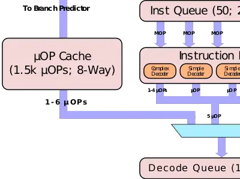

#### 别名
* 像 DSB 这种组件，首先要说明的就是它也叫 uop cache 或 decoded iCache
#### 作用
* 无论是用 Instruction Decoder 还是用 MSROM，终究还是要做一次“解码”的操作。但同所有 Cache 加速的原理一样，如果能把解码之后的结果（uop）存下来，下次再出现的时候直接使用，那么就可以显著提高解码速度，DSB 就是这个目的。
#### 参数
* DSB 的组织形式是 `32` 个 set，每个 set 有 `8` 条 cache line，每条 cache line 最多保存 `6` 个 uop。
* 每次 cache hit 可以传输最大 6 个 `uop/cycle`，这 `6` 个 uop 最大可以对应到 `64 byte` 的前端 fetch window size，并且完全不需要任何 Instruction decoder 参与，也没有繁琐的解码过程。
* 在实际应用中，DSB 的 cache hit rate 在 `80%` 或以上。
#### 与 `iCache` 的关系
* CPU 的 iCache 一般存储的是最原始的从内存里读进来的程序的汇编指令（marco instruction）。
* 而 DSB 或者 uop cache 虽然也是存 instruction 的cache，但如前所述，它存的是已经解码好的 uop，所以这玩意有时候又被称为“**decoded iCache**”。
  * 当然了，这些 uop 都是 CPU 的 iCache 中的指令解码之后得到的。
#### 与 MSROM 的关系
* 输出大于 `4` 个 uop 的指令依然只能由 MSROM 解码。
* DSB 保存的也是那些小于等于 `4` 个 uop 指令的 uop。

#### MITE Path 和 DSB Path
* 这两个概念主要用于区分最终需要执行的 uop 是通过什么方式来的。
* 在上一节 Decoded Stream Buffer 之前的所有内容，都算是 **MITE Path**。
  * MITE 是 Micro-instruction Translation Engine 的缩写，同时它在有些文档里也被称作 legacy decode pipeline 或 legacy path。
  * 这条线路上过来的 uop 都是从 marco instruction 一步一步解码来的。
* **DSB path** 就是直接从 DSB 那条道上过来的 uop。
* 当 CPU 需要在 MITE Path、DSB Path 以及 MSROM 之间切换（switch）以便取得所需的 uop 时，需要花费一定的 CPU cycle 完成这一工作。

### Instruction Decode Queue（IDQ）
* IDQ 也叫 **Allocation Queue（AQ）**，也有时候会写成是 Decode Queue。
* 解码完成的 uops 在进入后端之前需要先在 IDQ 中做一下缓冲。作为一个”缓冲队列”，主要作用是将前端解码可能引入的流水线”气泡（bubbles）“消化掉，为后端提供稳定的 uops 供应(目标是 `6 uop/cycle`)。
* Skylake 的 IDQ 最大可以存放 `64` 个 `uops/thread`，比 Broadwell 的 `28` 个多一倍还多。
* 这些 uop 在 IDQ 中除了排一下队之外，还会被 **Loop Stream Detector（LSD）** 扫描一遍，用来发现这些 uop 是不是来自于一个循环。

### Loop Stream Detector（LSD）
* 如果在 IDQ 中能被发现存在循环体 uop，那么在下一次循环的时候，就不需要去重新解码这些循环体生成的 uop，而是直接由 LSD 提供 uops。
  * 这便可以省去指令 fetch、解码、读 uop cache、分支预测等所有之前的步骤，并且能进一步减少缓存占用。
* 当然，当 LSD 起作用的时候，整个前端都是处于 Disabled 的状态。
* Skylake 的 LSD 需要在 IDQ 的长度（`64 uop`）内发现循环，所以，循环体还是尽量紧凑一点吧:D

## 后端（Back End）

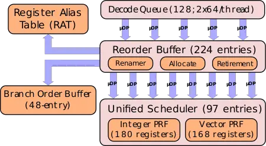

* 还是首先介绍一下这个部分是否有别的名字。在有些文档里后端又直接被称为 **Execution Engine**。
* 后端的主要任务当然就是执行前端解码出来的这些 uop。但后端和前端的设计都在围绕着“如何提高指令的并行性”来设计和优化。
* 在 Skylake 架构中，IDQ 以最大 `6 uop/cycle` 的速度将 uop 送入 Re-order Buffer，后端的处理在 Re-order Buffer 中正式开始。

### Out-of-order（OOO）Execution/Engine
* 先讲一下 OOO（乱序）以便对后端的执行有一个整体的把握。
  * 我们的程序虽然是按顺序编写的指令，但 CPU 并不（一定）会按相同的方式执行。为了提升整体效率，CPU 采用的是乱序执行的方式。
  * 从一个“窗口”范围内选取可以执行的指令执行，并且这些操作对用户透明，在程序编写者的角度看来仍是在按他编写的指令顺序执行。
* 从根本上来讲，OOO 是用”数据流（Data flow）”的角度来看待程序，而非程序员的“指令流”视角。
* **指令的目的** 就是以一种特定的方式操纵存在于内存/缓存中的数据，引起数据的变化，其实这就是我们通常所说的“写程序”。只不过这是人类习惯的逻辑方式，在机器看来并不一定高效。

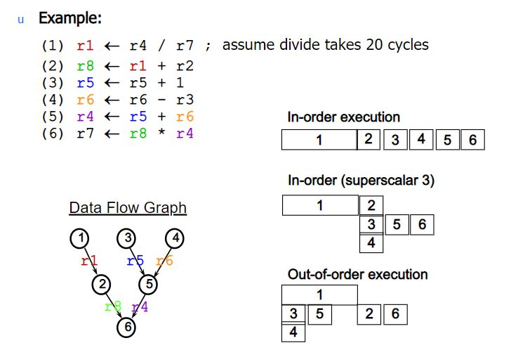

> 截图出自 Computer Architecture 2011 – out-of-order execution (lec 7) 1 Computer Architecture Out-of-order execution By Dan Tsafrir, 11/4/2011 Presentation

* 在上图例子中，需要执行左上角的六个计算指令。
* In-order execution 是假设完全按照程序顺序执行这六个指令的耗时。
* 下面的 In-order（superscalar3）是合并了一些可以并行执行的指令的耗时。
  * 因为指令（2）中的 `r1` 要依赖指令（1）的结果，所以指令（2）只能等（1）执行结束再执行。
  * 而本来可以并行执行的（3）、（4）也因为要保证 In-order 顺序而只能一同放在（1）之后执行。
* 但从左下角的 Data flow 的角度来看，其实我们并不需要按照指令顺序运行程序：
  * 指令（2）完全可以放在后面执行，并重新安排并行计算顺序。这样就又节省了执行所需的时间。
* OOO 选择可执行指令的依据是：
  * 不依赖未执行指令操纵的数据
  * 有可用的执行资源
* 为了尽可能让进入后端的指令满足这两个条件，OOO 采用了一系列的组件和技术。在后面的章节中将会进行介绍。
* 上图是一个 OOO 的概念示意图。前端输出给后端的都是顺序指令流，后端在一个窗口范围中选择可以执行的指令进行乱序执行。
  * 这里面没有强调的是，**最终指令退出（retire）的顺序仍是按照程序的顺序**。
    * **批注**：认清这一点很重要，很多人把需要内存屏障的原因与乱序执行混为一谈，这是根本性的错误。
* 这里对 OOO（Out-Of-Order）乱序执行再简单讲两句。深入乱序执行的难点不在于“不按指令顺序执行”，而是如何做到“按指令顺序退出”。
* 这里面的关键是，所有执行过的指令都先被“缓存”起来，并不把执行之后的结果真正写到寄存器或者内存里。
  * 从用户角度看，这个指令其实并没有被“执行”，因为它没有引起任何数据方面的变化。
  * 等到它可以确定是需要被执行的指令，并且它前面的指令都已经把结果写入（commit）之后，它再去 commit。这样从用户角度看来，程序就是按照指令顺序执行了。
* 在很多文档里，“Commit”和“Retire”是两个可以互换（interchangable）的词。

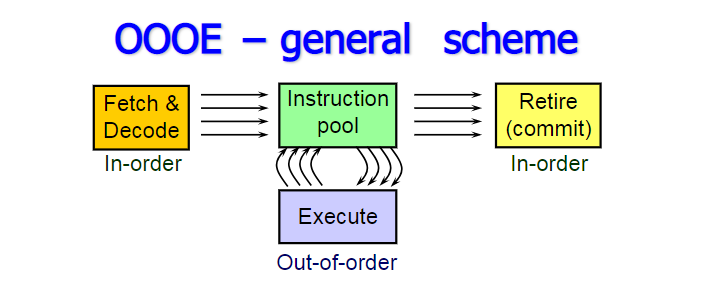

* 再来总结一下 OOO 的 Big Picture:
* 左边 Fetch & Decode 是之前讲的前端（Front-End）相关的内容。此时指令还是有序的。
* Decode 成微指令（uop）之后，这些微指令进入一个指令池（Instruction Pool），这里面能够被执行的指令，就直接被执行。“能够被执行”是指满足以下两个条件：
  * 已有指令需要的数据
  * 执行单元有空闲
* 当指令被执行之后
  * 通知所有对该指令有依赖的指令（们），它们所需要的数据已经准备好。
  * 注意：这里说的是“执行”，不是上面说的“Retire”或“Commit”
  * 为实现这一功能，CPU 中还必须要对微指令的操作数（数据）有 Bookkeeping 的能力
* Commit 指令
  * 只有当前指令的前序（指令顺序）指令都 Commit 之后，才能 Commit 当前指令
  * Commit 也可以并行进行，前提是满足上面一条的条件，同时并行 Commit 的指令间没有依赖

### False Dependency
* 乱序执行的一大前置条件就是指令数据间没有相互依赖。下面就着重分析一下依赖。
* 用下面的指令过程作一个示例：

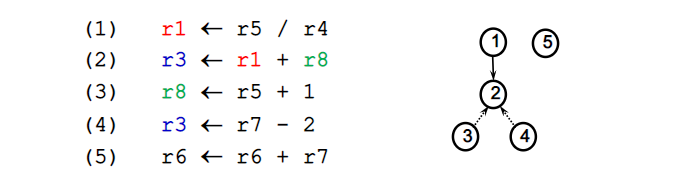

* 简单分析一下：
* **Read After Write（RAW）** 型依赖
  * (2) 指令需要读取 `r1` 的值，而 `r1` 的值需要 (1) 指令执行之后给出。所以 (2) 指令对 (1) 指令有 RAW 依赖。
  * RAW 依赖也被称作 **true dependency** 或者 **flow dependency**。
* **Write After Read（WAR）** 型依赖
  * (3) 指令需要更新 `r8` 的值，但在此之前 (2) 指令需要读取 `r8` 的值参与计算。所以 (3) 指令对 (2) 指令有 WAR 依赖。
  * WAR 依赖也被称作 **anti-dependencies**。
* **Write After Write（WAW）** 型依赖
  * (4) 指令需要在 (2) 指令写入 `r3` 之后再写入 `r3`。所以 (4) 指令对 (2) 指令有 WAW依赖。
  * WAW 依赖也可以被叫做 **output dependencies**。
* 按照以上的分析，这几条指令几乎没有可以并行执行的余地。不过，我想你也已经看出了一些“转机”：针对 WAR 和 WAW，是可以被 Register Rename 这种方法破解的。
  * 这两种依赖都被称为 **false dependency**。

### Register Rename

* 当需要写入 `r1` 的指令在读取 `r1` 的指令之后，写入的 `r1` 的新值可以首先保存在另外一个寄存器 `r1’` 里。
  * 读取 `r1` 的指令仍然读取原 `r1` 寄存器中的值，这样 WAR 指令就可以并行执行。
  * 当所有需要读取 `r1` 原值的指令都执行完毕，`r1` 就可以用新值代替。
* **Register Rename** 其实就是利用 CPU 提供的大量的物理寄存器，为寄存器制作“分身”或者，Alias，提供能够增加程序并行性的便利。
* 上面的例子里，`r1` 是 architectural register，`r1’` 是内部的 physical register。
* Rigster Rename 就是在制作这两种寄存器间的映射关系。当然，这一切对用户来说都是透明的。
* Physical register 的数量远多于 architectural register 的数量。其实 architectural register 仅仅是一个“代号”，并不是真正存放数据的位置。用这种方式，可以消除 WAW 和 WAR 这两种数据依赖进而增加程序整体的并行性。
* 那么到底怎么操作呢？其实本质上也就是建立一个“映射表”，一个从“代号”到存储位置的映射表。
* 例如，现有 `5` 个 architectural register 寄存器：`r1`、`r2`、`r3`、`r4`、`r5`；`9` 个 physical register 寄存器：`p1`、`p2`、……,`p9`。
* 指令：
```c
Add r1, r2, r3  ; r1 = r2 + r3
Sub r2, r1, r2  ; r2 = r1 - r2
Add  r1, r4, r5 ; r1 = r4 + r5
```
* 最开始是一个简单的映射关系：

r1 | r2 | r3 | r4 | r5
---|----|----|----|----
p1 | p2 | p3 | p4 | p5

在这张表里面还有一个 FreeList，用来保存还没有被占用的 physical register。

p6 | p7 | p8 | p9
---|----|----|----

* OK，首先考虑不使用 Register Rename 的情景。第二条指令是必须等待第一条指令执行完成之后才能执行，因为 `r1` 有 RAW 型依赖。这个其实 Register Rename 也没有办法。
* 但是第三条指令也不能在第二条指令之前执行，因为写入 `r1` 可能会影响第二条指令的结果（`r2`）。
* 为了增加指令的并行性，让第三条指令能与第一条指令并行，同时消除 WAW 和 WAR 型依赖，看一下 Register Rename 是怎么做的。
* 第一条指令就用原始对应的寄存器，此时还没有 Register Rename。对应的“映射表” Rename Table 如下：

A  | P
---|---
r1 | p1
r2 | p2
r3 | p3
r4 | p4
r5 | p5

* 第二条指令中，`r2` 针对第一条指令有 WAR 型依赖，可以将写入 `r2` 的结果放在另外一个寄存器里。
  * 从 FreeList 中选取下一个空闲的 physical register，即 `p6`。
  * 所以这条指令实际上就变成了 `Sub r6, r1, r2; r6 = r1 - r2`。
* Rename Table 如下：

A  | P
---|---
r1 | p1
r2 | **p6**
r3 | p3
r4 | p4
r5 | p5

* 即告之后续指令 `r2` 最终的结果保存在 `p6` 里面。
* 第三条指令，`r1` 针对第一条指令有 WAW 型依赖，可以将写入 `r1` 的结果放到另外一个寄存器里。
  * 从 FreeList 中选取下一个空闲的 physical register，即`p7`。
  * 所以这条指令实际上就变成了 `Add p7, p4, p5 ; p7 = p4 + p5`
* Rename Table 如下：

A  | P
---|---
r1 | **p7**
r2 | p6
r3 | p3
r4 | p4
r5 | p5

* 即告之 `r1` 最终的结果保存在 `p7` 里面。
* 所有指令对 architectural register 的读取都先通过 Rename Table 获得确切地址。
* 回到最初提到的问题，因为第一条指令和第三条指令实际写入的寄存器（分别是 `p1` 和 `p7`）并不冲突，且第二条指令仅在 `p1` 中读取数据，因此这两条指令可以并行执行。
* 现代 CPU 的 Rename Table 一般是在 ROB 里的 **RAT（Rename Alias Table）**。同时 physical register 也会被 **ROB entry** 取代。
* 其实现在对 Register Rename 的理解更多的是建立一个概念，在整个微架构中，这一步不是一个孤立的组件，所有组件之间都需要紧密配合。

### 一个示例介绍 Reorder Buffer（ROB）和 Register Alias Table（RAT）和 Reservation Station（RS）
* 理解乱序执行（Out-of-Order）的核心其实就是把 ROB、RAT 和 RS 这三个组件搞透。
* 如果要单独讲，很容易成为一大锅概念和专有名词的杂烩。所以这次把这几个紧密相关的组件放到一起，先用例子说明，仅描述自然行为，同时也避免出现太多概念。

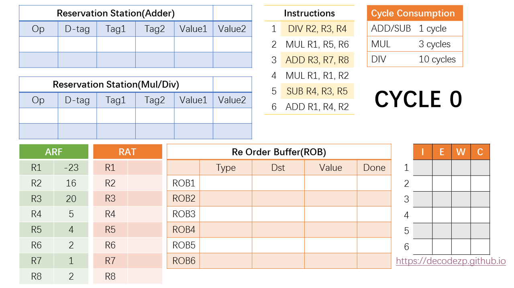

* 上图是在一个起始时刻 `cycle 0` 时 CPU 后端各组件的状态。
* 它即将执行 `Instructions` 表格里的 `6` 条指令。
* 不同种类指令所需要消耗的执行时间如 `Cycle Consumption` 所示。
* `ARF` 是 `Architectural Register File`，里面保存有当前时刻 architectural register 中的值；
* `RAT` 就是前面介绍过的 `Register Alias Table`，主要用作对 architectural register 的 Rename。
* `Reservation Station (RS)` 根据所连接的执行不同类型指令的 Port 而分成两类，
  * 一类保存 `ADD/SUB` 相关的指令，
  * 一类保存 `MUL/DIV` 相关的指令。
* `Reservation Station (RS)` 里面的指令在两个 `Value` 都 `Ready` 的时候将发送到执行单元执行。
* `Re Order Buffer` 旁边的表格是这 `6` 条指令从 `Issue` 到 `Execute`、`Write` 最后再到 `Commit` 这几个状态的 cycle 时刻表。
* OK，那么下面进入第一个 cycle。

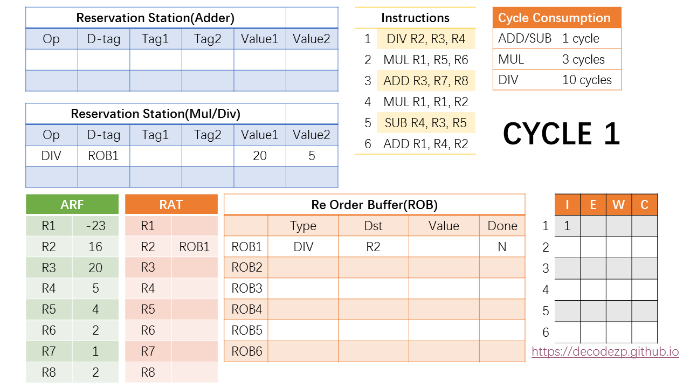

* 第一条指令 `DIV R2, R3, R4` 按照先进先出的原则首先进入 `ROB1`。
* 在 ROB 中，`Dst` 填该指令的目的 architectural register，也就是 `R2`；`Value` 是该指令执行完计算出来的结果，显然现在还不得而知，表示是否执行完的`Done` 标志位也是 `N` 的状态。
* 同时针对 `DIV` 指令的 RS 中也有空闲资源，因此该指令也会在同一 cycle 进入 RS。
* 目的 tag `D-tag` 填写指令对应的 ROB 条目（`ROB1`）；`Tag1` 和 `Tag2` 通过查阅 RAT 中 `R3` 和 `R4` 的状态，如果有 Rename 的情况，则填写对应的ROB 条目，如果没有，则直接读取 `ARF` 中的值，作为 `Value` 填入。
* 因此，`D-tag` 是 `ROB1`，`Tag1` 和 `Tag2` 因为 `R3` 和 `R4` 没有 Rename 所以不填，直接读取 `ARF` 中的值，`20` 和 `5`，放入 `Value1` 和 `Value2` 中。
* 之后，在 RAT 中，`R2` 被 Rename 成了 `ROB1`，即表示后续指令欲读取 `R2` 的值的话，都应该去读取 `ROB1` 中 `value` 的值。
* 此时该 `DIV` 指令所需要的操作数都已经 `Ready`，那么就可以在下一个 cycle 时从 RS 中 *发射* 到执行单元去执行。
* 下面进入第二个 cycle。

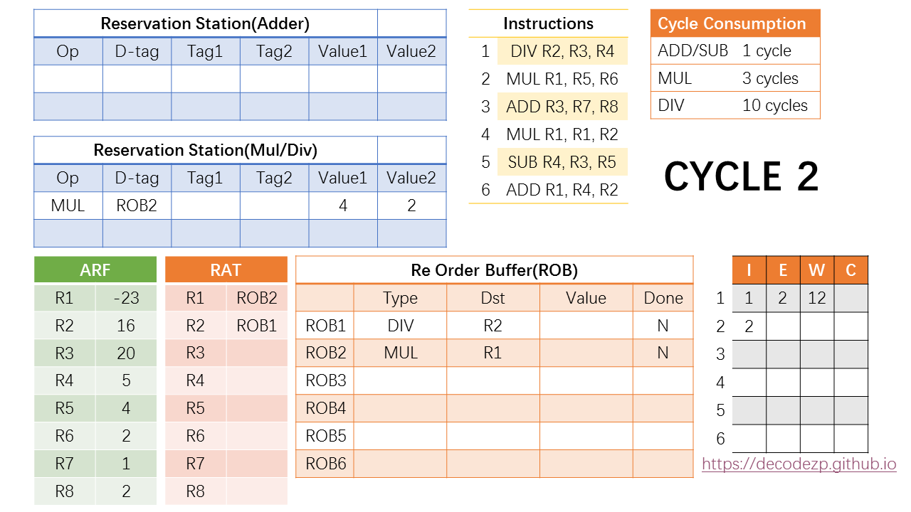

* 在第二个 cycle 中，第一条 `DIV` 指令开始执行，根据 `DIV` 的执行周期，那么我们知道它将在第 `2 + 10 = 12` 个 cycle 中执行完成。
* 同时 ROB 中还有空闲，我们可以 issue 第二条 `MUL` 指令。
* 在 RS 中，上一条 `DIV` 指令已经清出，也有空闲资源，所以 `MUL` 指令也可以进入到 RS 中。另外几个选项也如 `DIV` 指令的判断方式，因此 `D-tag` 为`ROB2`，两个 `value` 为 `4` 和 `2`。此时 `MUL` 指令也已经 `Ready`，可以在下一个 cycle 开始执行。
* 同时 RAT 中将 `R1` rename 到 `ROB2`。因为后续最新的 `R1` 的值将等于 `ROB2` 中的 `value`。

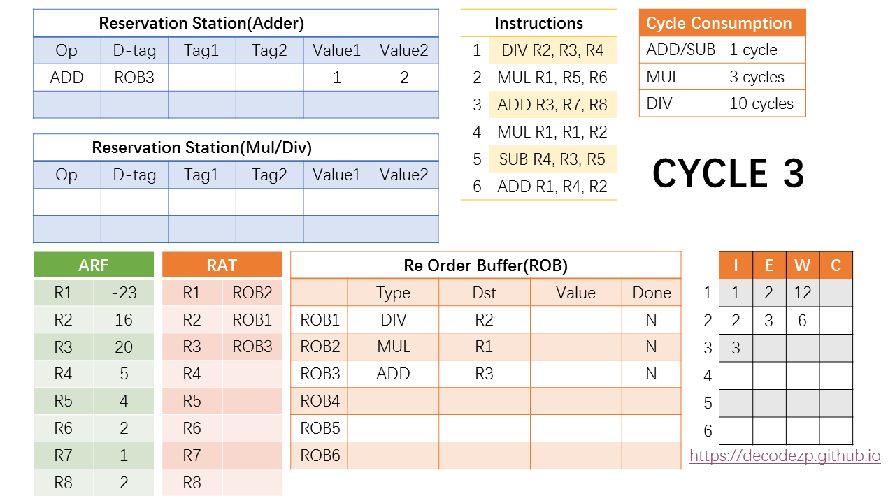

* 在第三个 cycle 中，`MUL` 指令开始执行，根据 `MUL` 的执行周期，它将在第 `3 + 3 = 6` 个 cycle 中执行完成。
* 因 ROB 中还有空闲，此时可以 issue 第三条 `ADD` 指令。
* RS 里面，`ADD` 指令需要放到存放 `ADD/SUB` 指令的 RS 中，除此之外，各字段的填写方式与之前的指令没有区别。
* `R7` 和 `R8` 也可以直接从 `ARF` 中获取数值，因此该 `ADD` 指令也已经 `Ready`，可以在下一个 cycle 开始执行。
* 之后，RAT 中将 `R3` rename到 `ROB3`。

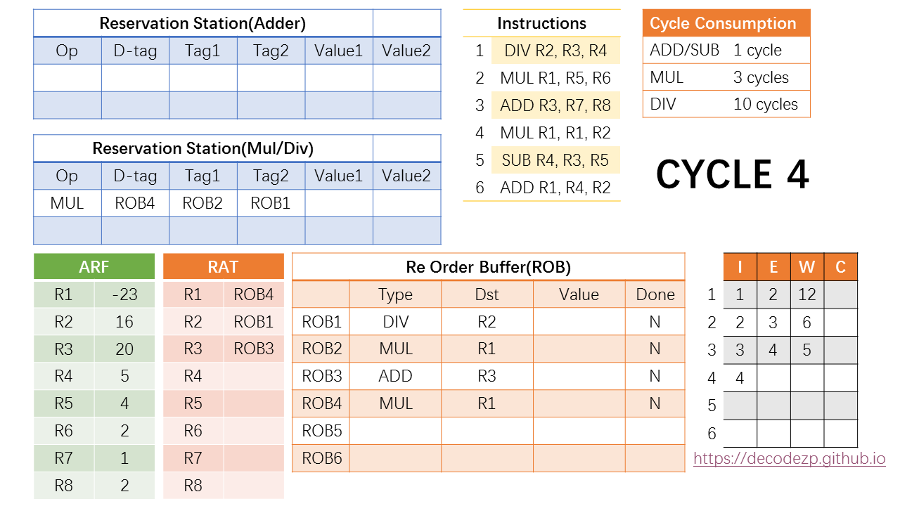

* 那么在第四个 cycle 中，第四条 `MUL` 指令可以进入 ROB 和 RS 之中。
* 在 RS 中，`D-tag` 填入该指令对应的 ROB 条目，即 `ROB4`。
* 而它的第一个操作数 `R1` 通过 RAT 读取（参见 cycle 3 中的 RAT 情况。），rename 到了 `ROB2`，因此 `Tag1` 需要填 `ROB2`。
* `Tag2` 同理，填 `ROB1`。
* 之后，RAT 中的 `R1` 需要 rename 到 `ROB4`，以保持最新的状态。
* RS 中，因为该条指令两个操作数的 `value` 还没有 `Ready`，不能在下一个 cycle 开始执行，因此还暂存在 RS 之中。


* 在第五个 cycle 中，拆成两个阶段来看。
  * 第一个阶段，也即 `cycle 5'`，第五条 `SUB` 指令进入 ROB 和 RS，各字段的填写方式与之前相同。

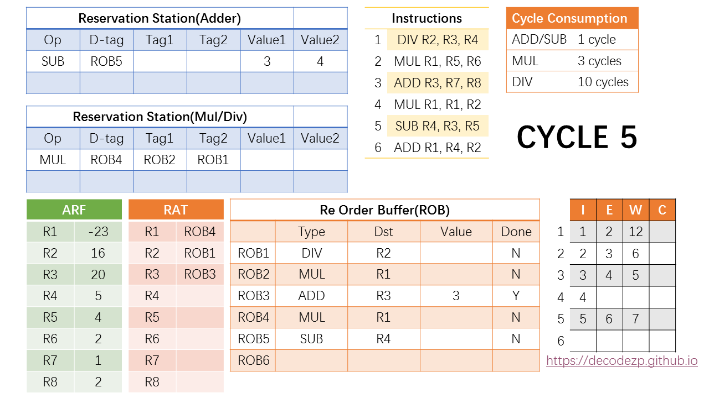

* 在 cycle 5的第二个阶段中，注意到指令时刻表中，第三条在指令将在 cycle 5 完成执行，并进入 `Write` 阶段。
* 于是此时第三条指令在 ROB 中对应的 `ROB3` 的 `Value` 中将填入该指令执行的结果，也就是 `3`，同时设置标志位 `DONE` 为 `Y`。
* 在执行完成之后，在同一个 cycle 中，CPU 还将进行一个操作，就是将该结果广播给 RS 中现存的指令，如果有等待 `ROB3` 执行结果的指令，将接收该结果并更新状态。
* 在当前 RS（`Adder`）中，`SUB` 指令正在等待 `ROB3` 的结果（参见 `cycle5'`），于是其不再等待 `Tag1`，并在 `Value1` 中填入结果 `3`。
* 此时该 `SUB` 指令也已经 `Ready`，并将在下一个 `cycle` 中执行，根据其执行开销，将在第 `6 + 1 = 7` cycle时执行完成。
* 看一下第六个 cycle 时会发生什么。

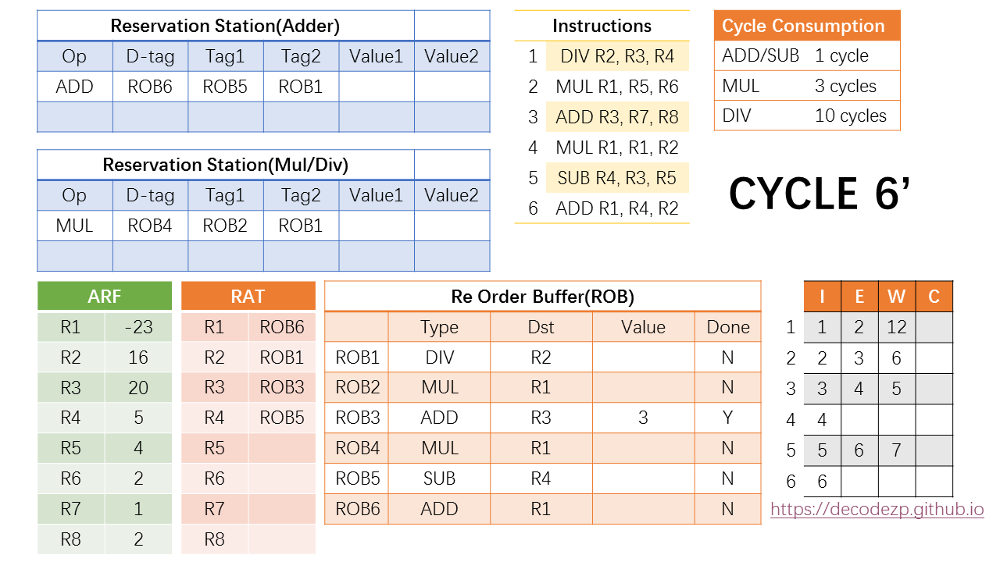

* 仍然分为两个阶段。第一个阶段 `cycle 6'` 里，第六条 `ADD` 指令可以进入 ROB 以及 RS。
* 在 RS 中，`D-tag` 填写该指令所在的 ROB 条目 `ROB6`，两个操作数通过读取 RAT 获得，`R4` 和 `R2` 对应的分别是 `ROB5` 和 `ROB1`。
* RAT 中 `R1` 所对应的最新值修改为 `ROB6`。

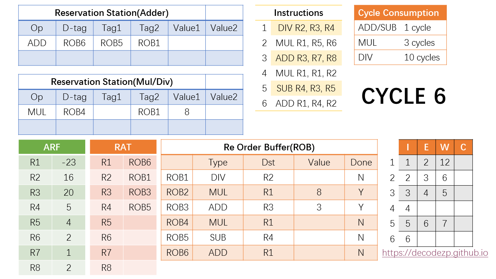

* 在第二个阶段，注意到此时第二条指令也在 `cycle 6` 执行完毕，因此它将执行的结果 `8` 写入到其所在的 ROB 条目 `ROB2`，并在同时将执行的结果广播给 RS 中的指令。
* 此时 RS 中的 `MUL` 指令正在等待 `ROB2` 的值，此时将其对应的 `Value1` 中写入计算的结果 `8`。


* 在第七个周期，注意到第五条指令也该执行完成，其所执行所得到的结果 `-1`，也需要写回到 `ROB5` 并广播给 RS 中的指令。
* 但此时没有等待该值的指令。所以对其他状态暂时没有影响。
* 但如果此时有新的指令需要 `R4`，`ROB5` 此时的值可以直接传递给该指令。


* 在第 7 个指令之后，CPU 进入一个尴尬的时期。没有新的指令执行完毕，RS 中的指令也没有 `Ready` 的，观察一下时刻表，下一个时刻有新的指令执行完毕是 `cycle 12` 的事。
* 在 `cycle 12` 中第一条 `DIV` 指令执行完毕，结果写入 `ROB1`，广播结果给 RS 中的指令，正好两个都需要 `ROB1`，并且拿到这个结果之后都进入 `Ready` 状态，可以在下一个 cycle 执行。
* 更新一下第四条和第六条指令的时刻表，执行都是在第 13 个 cycle，完成将分别在第 16 和 14 个cycle。
* 此时还发生了一件事，就是 ROB 中的第一条指令的 DONE 标志位标成了 `Y`。
  * ROB 之前我们介绍是一个先入先出的 FIFO 结构，只有第一条指令完成之后，才能按顺序开始 commit。


* 所以在 `cycle 13`，第一条指令历史性的 commit 了。
* Commit 的意思就是把结果写入到 `ARF`，因此 `R2` 在 `ARF` 中改为了 `4`。
* 同时删除该 ROB 条目，为后续的指令腾出资源。
* 当然 RAT 中也不再需要 rename 到 `ROB1`，最新的值已经在 `ARF` 中。

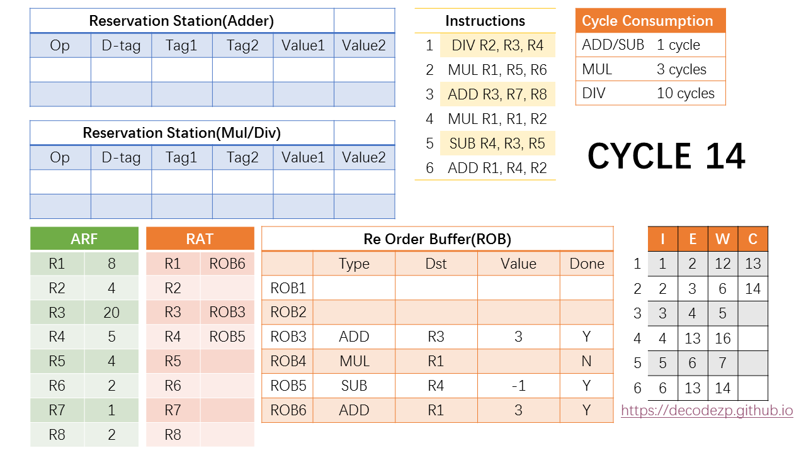

* 在 `cycle 14` 中，ROB 中的当前在队列头部的指令，也就是第二条指令也可以 commit 了，按之前的操作，`R1` 的值也改成了最新的值 `8`。
* 同时，第六条指令也执行完毕，计算的结果写入 `ROB6`。当然这条指令还不能 commit，因为 commit 需要按指令顺序。

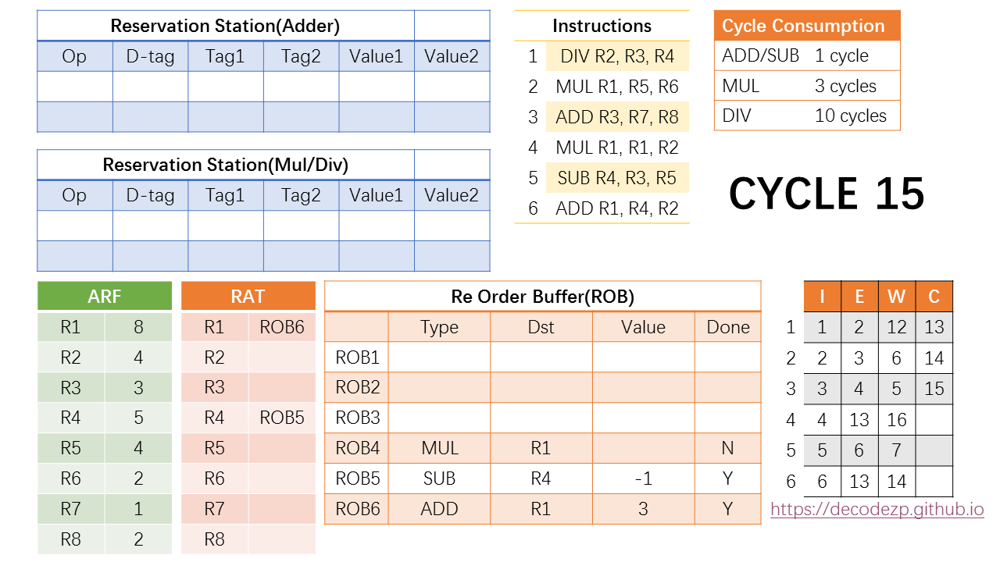

* 第 15 个 cycle，除了 commit 第三条指令之外没什么好做的。和以前的操作类似。


* 第 16 个 cycle，第 4 条指令执行完毕，结果写入 `ROB4`，同时它也是当前 ROB 中在队列头部的指令，可以在下一个 cycle commit。

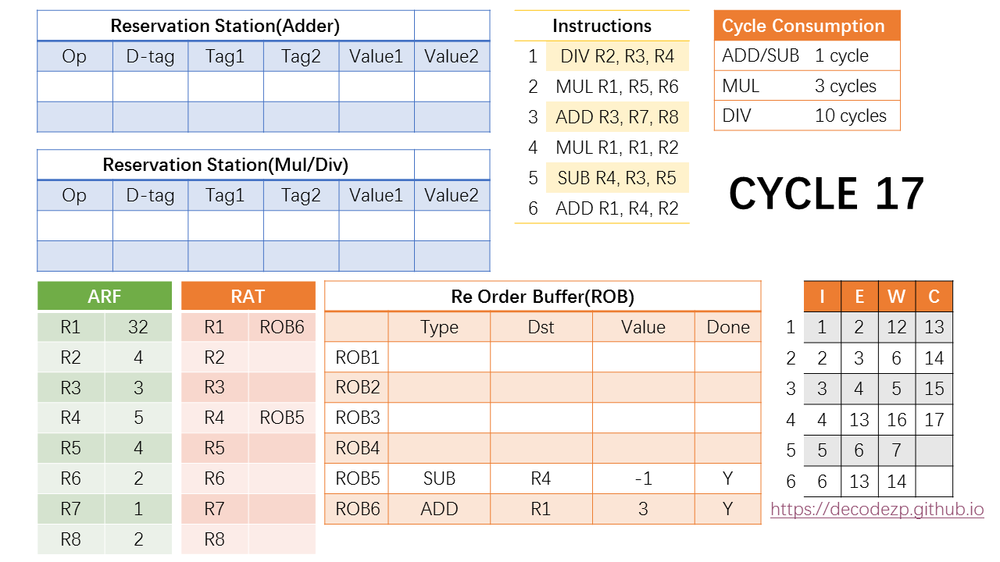

* 第 17 个 cycle，commit 第四条指令。

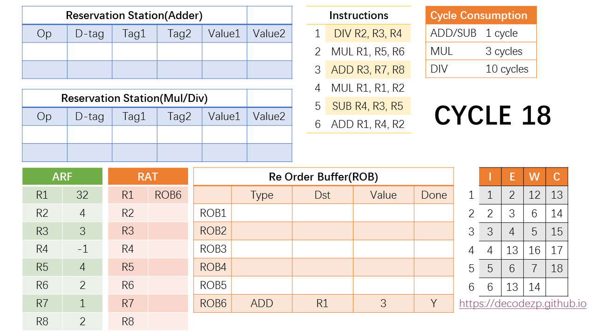

* 剩下的第 18、19 cycle 想必你也知道该干什么了：把最后的两条指令 commit 掉。


* OK，当指令时刻表都完成之后，这 6 条指令正式执行完毕。

### 关于这几个组件
* 全部目的都在于通过一个示例解释 RAT、ROB 和 RS 这三个组件的组成、特性和功能。在熟悉了这个例子的基础上可以再去寻找那些传统的“教科书”去印证理解那些大段大段的文字描述。
* 这个例子其实还缺少一些类似分支转跳，尤其是分支预测失败之后如何操作的说明。但足矣描述清楚 CPU 的乱序执行和顺序 commit 到底是怎么回事。
* 关于 CPU 微架构，前端和后端的内容基本上介绍的差不多了，后面会开始最后一个部分，也就是内存操作相关的组件的介绍。

## Load 和 Store 指令

* 在之前的章节中，我们讨论了重排序缓冲区（ROB）、保留站（RS）以及寄存器别名表（RAT）的工作原理。细心的读者可能注意到，示例中并未包含加载（`load`）和存储（`store`）指令。这既是为了简化说明，也因为这两类指令需要本文专门介绍的独特机制。
* 尽管我们将 `load`/`store` 指令与其他指令区别对待，但所有指令及流水线设计的核心目标始终一致：通过消除依赖关系提升指令级并行度。具体而言：
  * 消除控制依赖：通过分支预测实现
  * 消除伪依赖：通过寄存器重命名实现
* 注意：寄存器重命名主要针对寄存器而非内存操作
* 那么内存操作是否存在依赖？如果有，该如何解决？这正是本文要探讨的核心问题。

### Load 和 Store 与读和写是不同的

* **术语定义**：
  * 加载/存储（`load`/`store`）指内存访问 *指令（instruction）*
  * 读写（Read/Write）指直接对内存执行的 *操作（actions）*
* 虽然日常讨论中常混用这些术语，但为避免后续理解歧义，我们必须明确区分：
  * 存储指令（`store`）遵循常规指令流程，仅当 `strore` 指令提交（commit）后，内存写入才真正生效
  * 加载指令（`load`）的执行则更特殊：其内存读取动作可能在 `load` 指令提交之前或之后发生
    * 这是因为 `load` 需要获取相同地址的先前存储（stores）的结果，故实际在执行阶段（execute stage）就需完成操作

### 寄存器与内存

* 寄存器和内存存在同类依赖（伪依赖 False dependencies 可通过乱序执行消除），但关键区别在于：内存操作地址仅在运行时确定，这导致依赖关系极难预判。例如：
```c
Load r3 = 0[r6]
Add r7 = r3 + r9
Store r4 -> 0[r7]
Sub r1 = r1 - r2
Load r8 = 0[r1]
```
* 这里，在第三条指令中，将 `r4` 中的值存储到由 `r7` 表示的内存位置，然后将内存位置 `[r1]` 中的值加载到 `r8`。
  * 我们假设有 cache 命中。如果 `r7` 不等于 `r1`，就没有问题。
* 如果 `r7` 等于 `r1`，问题出现了，因为 `store`/第三条指令还没有 commit，那么最后一条指令 cache/read 的值不是最新的/正确的。
  * 换句话说，这是一个原始的真正的依赖。在这种情况下，我们信任的朋友编译器也帮不了忙。
  * **批注**：感觉这个问题在 x86 TSO 下应该不会出现，第三条指令写到 `store` buffer 里，第五条指令会先去 store buffer 里去 `load`，如果里面没有才会去 cache 里加载。相反，`r7` 不等于 `r1` 反而会因多处理器对两个不同地址的 store-load 而产生乱序问题
    * 可能这里设想的是 `load` 的是 `store` 还未 commit 前就从 cache 里取到值了，这可能吗？

#### 内存别名（Memory Aliasing）的根源
* 当两个指针指向同一内存地址时，必然产生真依赖（true dependency）。
* 尽管可通过编译提示（compiler hint）避免别名问题，但最终仍依赖程序员管理其复杂的“面条逻辑”（spaghetti logic）。

## Outstanding Cache Miss
* 在阅读 CPU PMU 事件文档或其他一些相关资料的时候，总是会看到“Outstanding Cache Miss”这类描述。对于 Cache Miss 大家应该比较熟悉，但什么叫做”Outstanding Cache Miss”就需要再作一下说明了。
* 当 CPU 发生 Cache Miss 之后，自然需要从下一级 cache，或者 RAM 中将需要的数据存入 cache。从请求开始到数据还没有进入 cache 的这段时间，就是“**Outstanding Cache Miss**”。
* 如果将 cache 的数据请求也理解成和一般的 I/O 请求一样，那么也会区分是 blocking 还是 non-blocking 的请求。
  * 如果一条 cache 请求在没有完成之前（处于 Outstanding 的状态）所有其他请求都无法进行，那么这块 cache 就叫做 **blocking cache**。
  * 反之，如果 cache 可以同时处理多条 I/O 请求，那么这个 cache 就是 **non-blocking cache**。
* 当然 non-blocking cache 的性能会好一些。另外 non-blocking cache 的另外一个指标就是能同时 Hold 住多少条 Cache 请求。

## Skylake Non-inclusive Cache 和 Snoop Filter 的关系
* Skylake 的 cache 设计使用了 `Non-inclusive` 的架构设计，同时调大了 L2 cache 的大小。
* 简单来说，区别就是以前从内存读入的数据会同时进入 L3 和 L2 cache，而现在会只进入 L2 cache，当该数据从 L2 cache 中清除的时候，才会进入 L3 cache。
* 在以前的 cache 架构中，L2 cache 中的数据是 L3 cache 数据的真子集。而 Skylake 的架构中，L2 和 L3 的数据在绝大部分时间中是独占的（exclusive）的，即二者所缓存的数据没有重叠。
* 但注意，Skylake的架构是 Non-inclusive，而不是严格的 exclusive，是因为当同一条 Cache Line 在多个 CPU 核的 L2 cache 中都存在时，L3 cache 中也有该 Cache Line 的数据。
* 还有一些别的区别，比如 Skylake 的 Cache Line 支持”Forward”状态，具备专用的 snoop filter 等。
* **Snoop filter** 主要用来追踪记录在 L2 和 L1 中的 Cache Line，Skylake 之前的架构是用 L3 cache 充当的，因为 L2 和 L1 的数据都存在于 L3 cache 中。
* Snoop filter 还是一个特点是，如果一条 Snoop filter 中的记录需要被清除，那么就需要将该条记录对应的，存在于 L2 和 L1 Cache 中的数据 invalid 掉，该数据会进入 L3 cache。这个叫做“**Back invalidation**”。
  * 这个东西有可能会成为导致一些应用在Skylake上性能下降的原因。
* 下面是一个读取过程：
  * CPU 核心 A 请求数据地址 addr -> L2 Cache Miss -> 从内存中加载 addr 数据进入 L2 -> Snoop filter 记录 addr
  * 当核心 A 的 L2 cache 清除 addr 对应的数据后，该数据进入 L3 cache，同时在 Snoop filter 中也清除 addr 的记录
  * 如果此时核心 A 又需要 addr 上的数据，则直接从 L3 读取，并在 Snoop filter 中添加记录

## Snoop Filter Back Invalidation
* [前面](https://decodezp.github.io/2019/12/23/quickwords37-skylake-cache-snoop-filter/)提到了 Skylake 的 CPU 对 cache 的结构进行了一番改动，L2 和 L3 cache 从 `Inclusive` 的关系变为了 `Non-inclusive`。这个变化就引入了 Skylake 中专用的 Snoop Filter。
* 和所有 Snoop Filter 一样，都是服务于 MESI 协议，探测一下同一条 Cache Line 在不同的 CPU 核中的状态。
* 在 Skylake 中的区别是，以前的 Snoop Filter 都是直接用 L3 cache，因为 cache 之间存在 `Inclusive` 的关系，所以所有 CPU core L2 cache 中存在的数据在 L3 中都存在，因此方便多个核之间“交流”数据信息。
* 换成 `Non-inclusive` 架构之后，L3 便不再具有这一“特殊能力”，为了保证 Cache Cohenerence，就需要专门的 Snoop Filter。
* 从本质上将，Snoop Filter 也就是一块 cache，保存有某个 Cache Line 在所有 CPU 核中的状态，以便支持 MESI 协议。
* 是 cache 的话就存在一个问题，就是 cache 的大小始终是有限的。
  * 当 Snoop Filter 中保存的信息超出了它的容量，就需要将一些原有的信息踢出。
  * 由于 Snoop Filter 的特殊性，如果 cache 的状态信息不存在了，但 cache 仍然存在于 CPU 核心的 L1 或 L2 cache 中，便无法继续保持 cache 相干性。
  * 所以在 Snoop Filter 踢出某个 Cache Line 的信息时，同样需要把各级 cache 中存在的该 Cache Line 从 cache 中踢出。这一行为就成为“**Snoop Filter Back Invalidation**”。
* 如果你的程序出现 Cache Miss，可能并不是因为 cache 大小不够或者你要的数据不在 cache 之中，还有可能是 Snoop Filter 容量不够，导致出现 Back Invalidation 出现 Cache Miss。

## References
- [几句话说清楚9：Skylake微架构(Microarchitecture)剖析(1)](https://decodezp.github.io/2019/01/07/quickwords9-skylake-pipeline-1/)
- [几句话说清楚10：Skylake微架构(Microarchitecture)剖析(2) ](https://decodezp.github.io/2019/01/10/quickwords10-skylake-pipeline-2/)
- [几句话说清楚11：Skylake微架构(Microarchitecture)剖析(3)](https://decodezp.github.io/2019/01/12/quickwords11-skylake-pipeline-3/)
- [几句话说清楚12：Skylake微架构(Microarchitecture)剖析(4)](https://decodezp.github.io/2019/01/20/quickwords12-skylake-pipeline-4/)
- [几句话说清楚14：Skylake微架构(Microarchitecture)剖析(5)](https://decodezp.github.io/2019/02/03/quickwords14-skylake-pipeline-5/)
- [几句话说清楚21：Skylake微架构(Microarchitecture)剖析(6)](https://decodezp.github.io/2019/03/10/quickwords21-skylake-pipeline-6/)
- [几句话说清楚23：Skylake微架构(Microarchitecture)剖析(7)](https://decodezp.github.io/2019/04/03/quickwords23-skylake-pipeline-7/)
- [几句话说清楚24：Skylake微架构(Microarchitecture)剖析(8)](https://decodezp.github.io/2019/04/06/quickwords24-skylake-pipeline-8/)
- [Quickwords27 Skylake Microarchitecture(10)](https://decodezp.github.io/2019/04/20/quickwords27-skylake-pipeline-10/)
- [Quickwords28：Skylake Microarchitecture(11) ](https://decodezp.github.io/2019/05/18/quickwords28-skylake-pipeline-11/)
- [几句话说清楚40:什么是Outstanding Cache Miss](https://decodezp.github.io/2020/03/12/quickwords40-outstanding-cache-miss/)
- [几句话说清楚37:Skylake Non-inclusive缓存和Snoop Filter的关系](https://decodezp.github.io/2019/12/23/quickwords37-skylake-cache-snoop-filter/)
- [几句话说清楚39:什么是Snoop Filter Back Invalidation](https://decodezp.github.io/2020/02/03/quickwords39-snoopfilter-back-invalidation/)