# Docker 相关的概念
## /proc/[pid]/ns
* 如果两个进程指向的 namespace 编号相同，说明它们在同一个 namespace 下，否则在不同的 namespace 里
* 一旦这些 link 文件被打开，只要打开的文件描述符（fd）存在，那么就算该 namespace 下的所有进程都已经结束，这个 namespace 也会一直存在，后续的进程也可以加入进来
* 在 docker 中，通过文件描述符定位和加入一个存在的 namespace 是最基本的方式
* 如用`mount --bind`的方式保持一个 namespace
  ```
  # touch ~/uts
  # mount --bind /proc/[pid]/ns/uts ~/uts
  ```
## 通过`setns()`加入一个已存在的 namespace
* 通过系统调用`setns()`，进程从原先的 namespace 加入某个已存在的 namespace
* 通常为了不影响进程的调用者，也为了使新加入的 pid namespace 生效，会在`setns()`执行后调用`clone()`创建子进程继续执行命令，让原先的进程结束运行

## 通过`unshared()`在原先的进程上进行 namespace 隔离
* `unshare()`允许一个进程在不创建新进程的情况下，控制它的共享执行上下文
* 目前并不是所有的进程属性都可以被`unshare()`
* `unshare()`运行在原先的进程上，因此不需要启动新进程就可以起到隔离的效果，相当于跳出原先的 namespace 进行操作

## 信号与 init 进程
* 内核为 PID namespace 中的 init 进程赋予了 **信号屏蔽** 的特权。如果 init 中没有编写处理某个信号的逻辑代码，那么与 init 在 *同一个 PID namespace 下的进程（即使有超级权限）* 发送给它的该信号都会被屏蔽。为了防止 init 进程被误杀。
* 父节点 PID namespace 中的进程发送同样的信号给子节点中的 init 进程，如果不是`SIGKILL`或者`SIGSTOP`都会被忽略。
* 如果发送`SIGKILL`或者`SIGSTOP`，子进程的 init 会强制执行，即父节点中的进程有权终止子节点中的进程。

## PID namespace
* 创建了 PID namespace 后，原先`unshare()`调用者进程并不进入新的 PID namespace，接下来创建的子进程才会进入新的 namespace，这个子进程也随之成为新 namespace 中的 init 进程。
* 类似，调用`setns()`创建新 PID namespace 时，调用者进程也不进入新的 PID namespace，而是随后创建的子进程进入。
* 为什么创建其他 namespace 是`unshare()`和`setns()`会直接进入新的 namespace，而惟独 PID namespace 例外？
  * 因为调用`getpid()`函数得到的 PID 是根据调用者所在的 PID namespace 而决定返回哪个 PID，进入新的 PID namespace 会导致 PID 产生变化。
  * 对于用户态的程序和库函数来说，它们都认为进程的 PID 是个常量，PID 的变化会引起这些进程崩溃。
  * 一旦程序进程创建后，那么它的 PID namespace 的关系就确定下来了，进程不会变更它们对应的 namespace。
  * 在 docker 中，`docker exec`会使用`setns()`函数加入已经存在的 namespace，但最终还会调用`clone()`函数，原因就在于此。

## mount namespace
* mount namespace 的 flag 是`CLONE_NEWNS`。
* `/proc/[pid]/mounts` 查看所有挂载在当前 namespace 中的文件系统。
* `/proc/[pid]/mountstats` 查看 mount namespace 中文件设备的统计信息，包括挂载文件的名字、文件系统类型、挂载位置等。
* **挂载传播（mount propagation）** 定义了 *挂载对象（mount object）* 之间的关系，这样的关系包括 *共享关系* 和 *从属关系*，系统用这些关系决定任何挂载对象中的挂载事件如何传播到其他挂载对象。
  * **共享关系（share relationship）**：如果两个挂载对象具有共享关系，那么一个挂载对象中的挂载事件会传播到另一个挂载对象，反之亦然。
  * **从属关系（slave relationship）**：如果两个挂载对象形成从属关系，那么挂载对象中的挂载事件会传播到另一个挂载对象，但反之不行；在这种关系中，从属对象是事件的接收者。
* 一个挂载状态可能为以下一种：
  * 共享挂载（share）传播事件的挂载对象
  * 从属挂载（slave）接收事件的挂载对象
  * 共享/从属挂载（shared and slave）兼有传播和接收事件的挂载对象
  * 私有挂载（private）既不传播事件也不接收事件的挂载对象
  * 不可绑定挂载（unbindable）与私有挂载相似，但不允许执行绑定挂载，即创建 mount namespace 时这块文件对象不可被复制
* 默认情况下，所有挂载都是私有的。
* 设置为共享挂载的命令如下：
  `mount --make-shared <mount-object>`
* 从共享挂载状态的挂载对象克隆的挂载对象，其状态也是共享，它们互相传播事件。
* 设置为从属挂载的命令如下：
  `mount --make-slave <shared-mount-object>`
* 来源于从属挂载对象的挂载对象也是从属的挂载，它也从属于原来的从属挂载对象的主挂载对象。
* 将一个从属挂载对象设置为共享/从属挂载，或者将其移动到一个共享挂载对象下：
  `mount --make-shared <slave-mount-object>`
* 把修改过的挂载对象重新标记为私有：
  `mount --make-private <mount-object>`
* 把挂载对象标记为不可绑定：
  `mount --make-unbindable <mount-object>`
* 以上设置都可以递归式地应用到所有子目录中。

## network namespace
* network namespace 主要提供网络资源的隔离，包括：
  * 网络设备
  * IPv4 和 IPv6 协议栈
  * IP 路由表
  * 防火墙
  * `/proc/net`目录
  * `/sys/class/net`目录
  * socket
* 一个物理的网络设备最多存在于一个 network namespace 中。
* 可以通过创建 veth pair（虚拟网络设备对：有两端，类似管道，如果数据从一端传入另一端也能收到，反之亦然）在不同的 network namespace 间创建通道，以达到通信目的。
* 注意，当新创建的 network namespace 被释放时（所有内部的进程都终止并且 namespace 文件没有被挂载或者打开），在这个 namespace 中的物理网卡会返回到 root namespace，而非创建该进程的父进程所在的 network namespace。

## user namespace
* 用户绑定操作通过在`/proc/[pid]/uid_map`和`/proc/[pid]/gid_map`两个文件中写入对应的绑定信息实现，格式如下：
  ```
  ID-inside-ns    ID-outside-ns    length
  ```
  * 第一个字段`ID-inside-ns`表示新建的 user namespace 中对应的 user/group ID，第二个字段`ID-outside-ns`表示 namespace 外部映射的 user/group ID。`length`表示映射范围，如果填大于 1 的值，则按顺序建立一一映射。
  * 这两个文件只允许由拥有该 user namespace 中 `CAP_SETUID` 权限的进程写入一次，不允许修改。
  * 写入的进程必须是该 user namespace 的 *父 namespace* 或者 *子 namespace*。

## cgroups
### cgroups 的作用
* 资源限制：对任务的资源总额进行限制
* 优先级分配
* 资源统计：统计资源的使用量
* 任务控制：对任务执行挂起、恢复等操作
### cgroups 术语
* **subsystem（子系统）**：cgroups 中的子系统就是一个资源调度控制器。
  ```
  tmpfs on /sys/fs/cgroup type tmpfs (ro,nosuid,nodev,noexec,seclabel,mode=755)
  cgroup on /sys/fs/cgroup/systemd type cgroup (rw,nosuid,nodev,noexec,relatime,seclabel,xattr,release_agent=/usr/lib/systemd/systemd-cgroups-agent,name=systemd)
  cgroup on /sys/fs/cgroup/net_cls,net_prio type cgroup (rw,nosuid,nodev,noexec,relatime,seclabel,net_prio,net_cls)
  cgroup on /sys/fs/cgroup/cpu,cpuacct type cgroup (rw,nosuid,nodev,noexec,relatime,seclabel,cpuacct,cpu)
  cgroup on /sys/fs/cgroup/perf_event type cgroup (rw,nosuid,nodev,noexec,relatime,seclabel,perf_event)
  cgroup on /sys/fs/cgroup/pids type cgroup (rw,nosuid,nodev,noexec,relatime,seclabel,pids)
  cgroup on /sys/fs/cgroup/memory type cgroup (rw,nosuid,nodev,noexec,relatime,seclabel,memory)
  cgroup on /sys/fs/cgroup/freezer type cgroup (rw,nosuid,nodev,noexec,relatime,seclabel,freezer)
  cgroup on /sys/fs/cgroup/blkio type cgroup (rw,nosuid,nodev,noexec,relatime,seclabel,blkio)
  cgroup on /sys/fs/cgroup/cpuset type cgroup (rw,nosuid,nodev,noexec,relatime,seclabel,cpuset)
  cgroup on /sys/fs/cgroup/devices type cgroup (rw,nosuid,nodev,noexec,relatime,seclabel,devices)
  cgroup on /sys/fs/cgroup/hugetlb type cgroup (rw,nosuid,nodev,noexec,relatime,seclabel,hugetlb)
  ```
* **task（任务）**：一个进程或线程
  * 如下例子的`tasks`文件中含有该控制组的任务
* **cgroups（控制组）**：cgroups 中的资源都以 cgroup 为单位实现的。
  * cgroup 表示按某种资源控制标准划分而成的任务组，包含一个或多个子系统。
  * 一个任务可以加入某个 cgroup，也可以从一个 cgroup 迁移到另一个 cgroup。
  * 如下例子的`docker`和其下名为容器ID的目录都是控制组
* **hierarchy（层级）**：层级由一系列 cgroup 以一个树状结构排列而成，每个层级通过绑定对应的子系统进行资源控制。
  * 层级中的 cgroup 节点可以包含零或多个子节点，子节点继承父节点挂载的子系统
  * 整个操作系统可以有多个层级
  * 在层级中创建目录相当于给控制组创建了一个后代 cgroup，后代 cgroup 默认继承原有 cgroup 中的属性，但可以根据需求对配置参数进行调整
  * 当一个顶层的 cgroup 文件系统被 umount 时，如果其中创建过深层次的后代 cgroup 目录，那么就算上层的 cgroup 被卸载了，层级也是激活状态，其后代 cgroup 中的配置依旧有效
  * 只有递归式地卸载层级中的所有 cgroup，那个层级才会被真正删除
  * 如下例子的`docker`和其下名为容器ID的目录构成了一个层级
  ```
  $ tree /sys/fs/cgroup/cpu,cpuacct/docker/
  /sys/fs/cgroup/cpu,cpuacct/docker
  ├── cgroup.clone_children
  ├── cgroup.event_control
  ├── cgroup.procs
  ├── cpuacct.stat
  ├── cpuacct.usage
  ├── cpuacct.usage_percpu
  ├── cpu.cfs_period_us
  ├── cpu.cfs_quota_us
  ├── cpu.rt_period_us
  ├── cpu.rt_runtime_us
  ├── cpu.shares
  ├── cpu.stat
  ├── f4e18e0357aed405dc43194f9a8fd371fd470e394fe05a0a888d10d4199cc261
  │   ├── cgroup.clone_children
  │   ├── cgroup.event_control
  │   ├── cgroup.procs
  │   ├── cpuacct.stat
  │   ├── cpuacct.usage
  │   ├── cpuacct.usage_percpu
  │   ├── cpu.cfs_period_us
  │   ├── cpu.cfs_quota_us
  │   ├── cpu.rt_period_us
  │   ├── cpu.rt_runtime_us
  │   ├── cpu.shares
  │   ├── cpu.stat
  │   ├── notify_on_release
  │   └── tasks
  ├── notify_on_release
  └── tasks
  ```
### subsystems, cgroups 的 hierarchies 和 tasks 之间的关系
* **规则1**：单个层级可以附加一个或多个子系统。
  * 只要`cpu`和`memory`子系统（或其他子系统）还未被附加到已经附加了任何其他子系统的任何其他层级，那么它便可以附加到这个层级。
  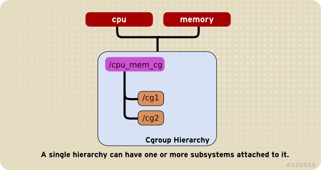
* **规则2**：一个子系统可以附加到多个层级，当且仅当目标层级只有唯一一个子系统时。
  * 一个已经附加在某个层级上的子系统不能附加到其他 *含有别的子系统的* 层级上。
  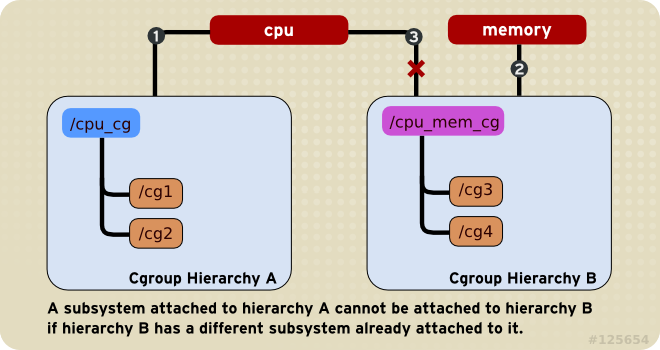
* **规则3**：对于创建的每个层级，任务只能存在于其中一个 cgroup 中，即一个任务不能存在于同一个层级的不同 cgroup 中；但一个任务可以存在于不同层级中的多个 cgroup 中。
  * 如果操作时把一个任务添加到同一个层级中的另一个 cgroup 中，则会将它从第一个 cgroup 移除。
  * 系统每次新建一个层级时，该系统上的所有任务默认加入这个新建层级的初始化 cgroup，这个 cgroup 也被称为 **root cgroup**。
  * 当第一个层级创建时，系统中的每一个任务至少是一个 cgroup 的成员：root cgroup。因此当使用 cgroups，每个系统任务总是在至少一个 cgroup 里。
  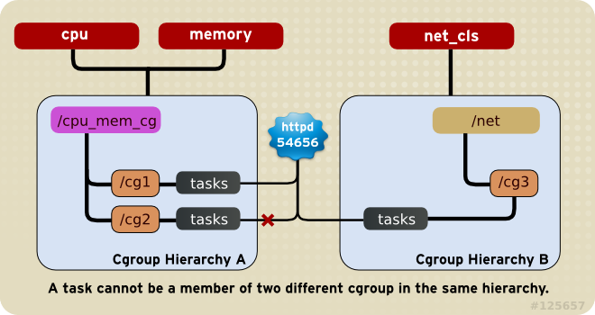
* **规则4**：任务在`fork`/`clone`自身时创建的子任务默认与原任务在同一个 cgroup 中，但是子任务允许被移动到不同的 cgroup 中。
  * 即`fork`/`clone`完成后，父子任务间在 cgroup 方面是互不影响的。
  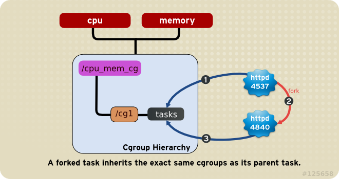

##  Docker 对 cgroups 运用
* Docker daemon 会在单独挂载了每一个子系统的控制组目录（比如`/sys/fs/cgroups/cpu`、`/sys/fs/cgroups/memory`）下创建一个名为 `docker` 的控制组
* 在`docker`控制组里为每个容器创建一个以 *容器ID* 为名的 *容器控制组*
* 这个容器里的所有进程号都会写到该控制组`tasks`中，并且在控制文件（比如`cpu.cfs_quota_us`）中写入预设的限制参数值

## Docker 架构概览
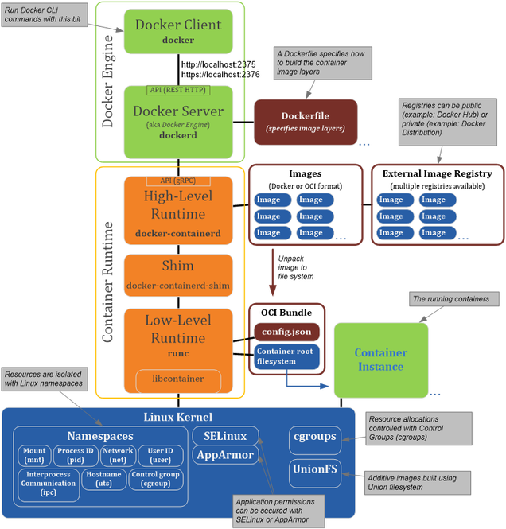
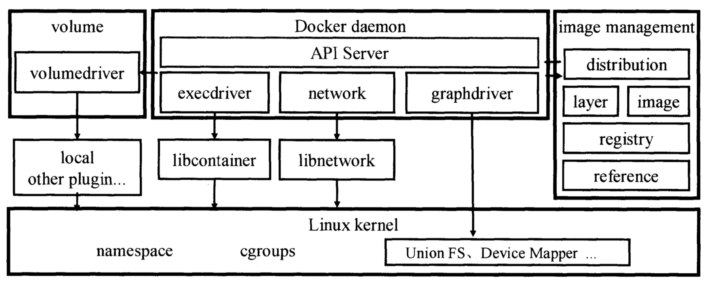
* `volumn`和`network`的生命周期都是独立于容器的，与容器一样是 Docker 中的一等公民
* Docker 用户可以单独增删改查`volumn`和`network`，然后在创建容器的时候根据需要配置给容器

### 镜像管理
#### distribution
* 负责与 Docker register 交互，上传下载镜像
* 存储与 v2 register 有关的元数据
#### register
* 负责与 Docker register 有关的身份验证、镜像查找、镜像验证
* 管理 register mirror 等交互操作
#### image
* 负责与镜像元数据有关的存储、查找，镜像层的索引、查找
* 镜像 tar 包有关的导入、导出等操作
#### reference
* 负责存储本地所有镜像的 repository 和 tag 名
* 维护与镜像 ID 之间的映射关系
#### layer
* 负责与镜像层和容器层元数据有关的增删查改
* 负责将镜像层的增删查改操作映射到实际存储镜像层文件系统的`graphdriver`模块

### execdriver、volumndriver、graphdirver
#### execdriver
* 对 Linux 操作系统的 namespace、cgroups、apparmor、SELinux 等容器需要的 **系统操作** 进行的一层二次封装。
* `libcontainer`和`LXC`为两种不同的实现。
#### volumndriver
* **volumn 数据卷存储操作** 的最终执行者，负责 volumn 的增删改查，屏蔽不同的驱动实现的区别，为上层调用者提供一个同一的接口。
  * docker 默认的 volumndriver 是`local`，默认将文件存储于 *docker 根目录* 下的`volumn`文件夹里。
  * 其他的 volumndriver 均通过外部插件实现。
#### graphdirver
* 所有与 **容器镜像相关操作** 的最终执行者。
  * graphdirver 会在 docker 工作目录下维护一组与镜像层对应的目录，并记下镜像层之间的关系以及与具体的 graphdriver 实现相关的数据。
  * 用户 *对镜像的操作* 最终会被映射成 *对这些目录文件以及元数据的增删查改*，从而屏蔽掉不同文件存储实现对于上层调用者的影响。
  * 在 Linux 环境下，目前 docker 已经支持的 graphdriver 包括 `aufs`、`btrfs`、`zfs`、`devicemapper`、`overlay`和`vfs`。

### Network
* libnetwork 抽象出一个容器网络模型（Container Network Model, CNM)，并给调用者提供一个统一抽象接口。
* CNM 模型对真实的容器网络抽象出三种对象 **沙盒（sandbox）**、**端点（endpoint）**、**网络（network）**。
* 由具体网络驱动（包括内置的 Bridge、Host、None、和 overlay 驱动以及通过插件配置的外部驱动）操作对象，并通过网络控制器提供一个统一的接口供调用者管理网络。
* 网络驱动负责实现具体的操作。

## Client 和 Daemon
### Client
* `docker [OPTIONS] COMMAND [arg...]`
* `-H, --host=[] Daemon socket(s) to connect to`
  * Client 模式，本次操作需要连接的 docker daemon 的位置
  * Daemon 模式，提供所要监听的地址
  * **Hosts 变量** 或者 **系统环境变量`DOCKER_HOST`** 不为空，说明用户指定了 host 对象
  * 否则使用默认的 `unix:///var/run/docker.sock`
* `protoAddrParts`，信息来自于`-H`参数中`://`前后的两部分的组合，即与 docker daemon 建立通信的协议方式与 socket 地址

# Docker 镜像管理
## Docker 镜像的特点
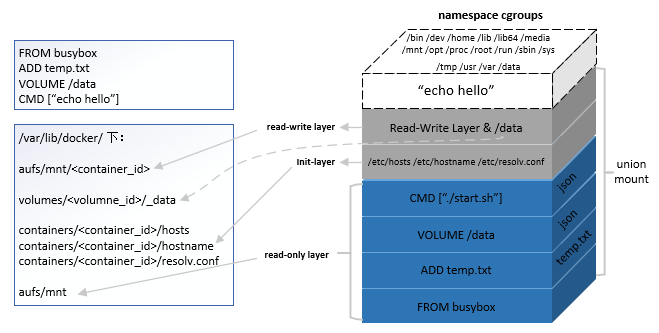
### 分层
* 每个镜像（image）由一系列镜像层（layer）组成
* `docker commit`提交修改过的容器文件系统为一个新的镜像时，保存的内容仅为最上层读写文件系统中被更新过的文件
* 分层可达到不同镜像之间共享镜像层的效果
### 写时复制
* 未更改文件内容时，所有容器共享同一份数据
* 只有在 docker 容器运行过程中文件系统发生变化时，才会把变化的文件内容写到可读写层，并隐藏只读层的老版本文件
### 内容寻址（content-addressable storage）
* 根据文件内容来索引镜像和镜像层
* 对镜像层的内容计算校验和，生成一个内容哈希值，作为镜像层的唯一标志
* 对于来自不同构建的镜像层，只要拥有相同的内容哈希，也能被不同的镜像共享
### 联合挂载
* 在一个挂载点同时挂载多个文件系统，将挂载点的原目录与被挂载内容进行整合，使得最终可见的文件系统将包含整合之后的各层的文件和目录
* 联合挂载不是 docker 镜像的必须技术
## Docker 镜像关键概念
### registry
* 保存 docker 镜像
* 镜像层次结构
* 镜像的元数据
### repository
* repository 即由具有某个功能的 docker 镜像的所有迭代版本构成的镜像组
* registry 由一系列经过命名的 repository 组成，repository 通过命名规范对用户仓库和顶层仓库进行组织
* registry 是 repository 的集合，repository 是镜像的集合
### manifest
* manifest（描述文件）主要存在于 registry 中作为 docker 镜像的元数据文件
* 在`pull`、`push`、`save`和`load`中作为镜像结构和基础信息的描述文件
  * 在镜像被`pull`或者`load`到 docker 宿主机时，manifest 被转化为本地的镜像配置文件 config
* manifest list 可以组合不同架构，实现同名 docker 镜像的 manifest，用以支持多架构 docker 镜像
### image
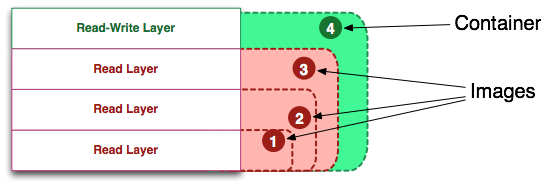
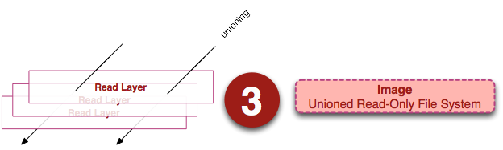
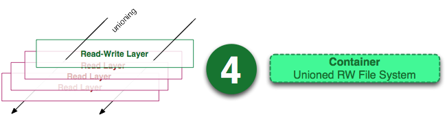
* docker 内部的 image 概念是用来存储一组镜像相关的元数据信息，主要包括
  * 镜像的架构（如 AMD64）
  * 镜像默认配置信息
  * 构建镜像的容器配置信息
  * 包含所有镜像层信息的 rootfs
* docker 利用 rootfs 中的`diff_id`计算出内容寻址的索引（chainID）来获取 layer 相关的信息，进而获取每一个镜像层的文件内容
### layer

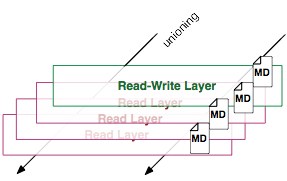
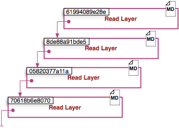
* layer（镜像层）是一个 docker 用来管理镜像层的中间概念
  * 镜像是由镜像层组成的
  * 单个镜像层可能被多个镜像共享
* docker 镜像管理中的 layer 主要存放了镜像层的`diff_id`、`size`、`cache-id`和`parent`等内容，实际的文件内容则由存储驱动来管理，并可以通过`cache-id`在本地索引到
### Dockerfile

## Docker build 构建镜像
### Docker client 端
```
Usage: docker build [OPTIONS] PATH | URL | -
```
* `PATH`或`URL`指向的文件为 **context**，包含 build docker 镜像过程中需要的 Dockerfile 以及其他资源文件。
* 第一个参数为`-`时根据命令行输入参数对 Dockerfile 和 context 进行设置
  ```
  docker build - < Dockerfile
  docker build - < context.tar.gz
  ```
* 第一个参数为`URL`时，会从`URL`下载 context，其中的 Dockerfile 会被用于后续的镜像构建
* 第一个参数为本地文件或目录的情况
  1. 当前文件夹作为 context
  ```
  docker build -t vieus/apache:2.0 .
  ```
  * 如果用户定义了 tag，则对其指定的 repository 和 tag 进行验证。
  2. 分离式的 Dockerfile 和 context
  ```
  cd /my/docker/app/do
  docker build -f /my/docker/app/mydockerfile /my/docker/app/mycontext
  ```
  * 如果目录中有`.dockerignore`文件，则 context 中满足其定义的规则的文件都从上传列表中排除，不打包传给 docker daemon
  * 唯一例外的是`.dockerignore`文件中误写入`.dockerignore`本身或者 Dockerfile
### Docker server 端
Docker server 端接收到相应的 HTTP 请求后，需要做的工作如下
1. 创建一个临时目录，并将 context 指定的文件系统解压到该目录下
2. 读取并解析 Dockerfile
3. 根据解析出的 Dockerfile 遍历其中的所有指令，并分发到不同的模块去执行
  * Dockerfile 每条指令的格式均为`INSTRUCTION arguments`
  * `INSTRUCTION`为特定关键词，会映射到不同的 parser 进行处理
4. parser 为上述每一个指令创建一个对应的临时容器，在容器中执行当前指令，然后通过`commit`将此容器生成一个`layer`
5. Dockerfile 中所有的指令对应的层的集合就是此次 build 后的结果。如果指定了`tag`参数，便给镜像打上对应的 tag。最后一个`commit`生成的镜像 ID 作为最终的镜像 ID 返回

## Docker 镜像的分发
### docker save IMAGE
* `docker save`命令会创建一个镜像的压缩文件，这个文件能够在另外一个主机的 docker 上使用。
* 和`export`命令不同，`save`命令为每一个层都保存了它们的元数据。这个命令 **只能对镜像生效**。
  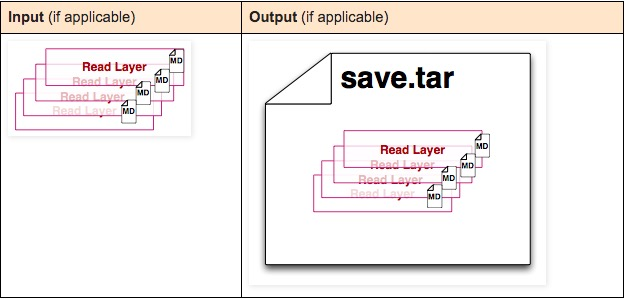
### docker export CONTAINER
* `docker export`命令创建一个 tar 文件，并且移除了元数据和不必要的层，将多个层整合成了一个层，只保存了当前统一视角看到的内容。
* `expoxt`后的容器再`import`到 docker 中，通过`docker images --tree`命令只能看到一个镜像；而`save`后的镜像则不同，它能够看到这个镜像的历史镜像。
  

# References
* [RELATIONSHIPS BETWEEN SUBSYSTEMS, HIERARCHIES, CONTROL GROUPS AND TASKS](https://access.redhat.com/documentation/en-us/red_hat_enterprise_linux/6/html/resource_management_guide/sec-relationships_between_subsystems_hierarchies_control_groups_and_tasks)
* [Containers Part 2 – Understanding Docker](https://mattjhayes.com/2018/05/21/containers-part-2-understanding-docker/)
